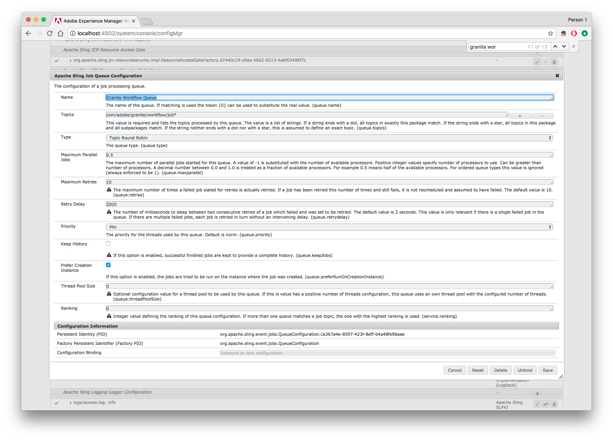

# Acerca de la configuración del servicio de nube de Dynamic Media {#configuring-dynamic-media-scene-mode}

Si utiliza la configuración de Adobe Experience Manager para diferentes entornos, como uno para desarrollo, uno para ensayo y otro para producción en directo, debe configurar los servicios de Dynamic Media Cloud para cada uno de esos entornos.

## Diagrama de arquitectura de Dynamic Media {#architecture-diagram-of-dynamic-media-scene-mode}

El siguiente diagrama de arquitectura describe el funcionamiento de Dynamic Media.

Con la nueva arquitectura, AEM es responsable de los recursos principales y de las sincronizaciones con Dynamic Media para el procesamiento y la publicación de recursos:

1. Cuando el recurso principal se carga en AEM, se replica en Dynamic Media. En ese momento, Dynamic Media gestiona todo el procesamiento de recursos y la generación de representaciones, como la codificación de vídeo y las variantes dinámicas de una imagen.
1. Una vez generadas las representaciones, AEM puede acceder a las representaciones de Dynamic Media remotas y realizar la previsualización de forma segura (no se devuelven los binarios a la instancia de AEM).
1. Una vez que el contenido está listo para publicarse y aprobarse, activa el servicio Dynamic Media para insertar el contenido en los servidores envío y almacenar el contenido en caché en la CDN.


<!-- OBSOLETE CONTENT

## (Optional) Migrating Dynamic Media presets and configurations from 6.3 to 6.5 Zero Downtime {#optional-migrating-dynamic-media-presets-and-configurations-from-to-zero-downtime}

If you are upgrading AEM Dynamic Media from 6.3 to 6.4 or 6.5 (which now includes the ability for zero downtime deployments), you are required to run the following curl command to migrate all your presets and configurations from `/etc` to `/conf` in CRXDE Lite.

>[!NOTE]
>
>If you run your AEM instance in compatibility mode--that is, you have the compatibility packaged installed--you do not need to run these commands.

For all upgrades, either with or without the compatibility package, you can copy the default, out-of-the-box viewer presets that originally came with Dynamic Media by running the following Linux curl command:

`curl -u admin:admin -X POST https://<server_address>:<server_port>/libs/settings/dam/dm/presets/viewer.pushviewerpresets.json`

To migrate any custom viewer presets and configurations that you have created from `/etc` to `/conf`, run the following Linux curl command:

`curl -u admin:admin -X POST https://<server_address>:<server_port>/libs/settings/dam/dm/presets.migratedmcontent.json`

-->

## Configuración del servicio Dynamic Media Cloud {#configuring-dynamic-media-cloud-services}

**Antes de configurar el servicio** de nube de Dynamic Media: Después de recibir el correo electrónico de aprovisionamiento con las credenciales de Dynamic Media, debe [iniciar sesión](https://www.adobe.com/marketing-cloud/experience-manager/scene7-login.html) en Dynamic Media Classic para cambiar la contraseña. La contraseña que se proporciona en el correo electrónico de aprovisionamiento es generada por el sistema y está pensada para ser una contraseña temporal solamente. Es importante que actualice la contraseña para que el servicio de Dynamic Media Cloud esté configurado con las credenciales correctas.

Para configurar los servicios de nube de medios dinámicos:

1. En AEM, toque el logotipo de AEM para acceder a la consola de navegación global.
1. En el lado izquierdo de la consola, bajo el encabezado **[!UICONTROL Herramientas]**, pulse **[!UICONTROL Cloud Services > Configuración de Dynamic Media]**.
1. En la página Explorador de configuración de Dynamic Media, en el panel izquierdo, pulse **[!UICONTROL global]** (no pulse ni seleccione el icono de carpeta a la izquierda de **[!UICONTROL global]**) y, a continuación, pulse **[!UICONTROL Crear]**.
1. En la página Crear configuración de Dynamic Media, escriba un título, la dirección de correo electrónico de la cuenta de Dynamic Media y la contraseña y, a continuación, seleccione su región. Adobe se lo proporciona en el correo electrónico de aprovisionamiento. Póngase en contacto con el servicio de soporte técnico si no recibió esto.
1. Click **[!UICONTROL Connect to Dynamic Media]**.

   >[!NOTE]
   >
   >Después de recibir el correo electrónico de aprovisionamiento con las credenciales de Dynamic Media, [inicie sesión](https://www.adobe.com/marketing-cloud/experience-manager/scene7-login.html) en Dynamic Media Classic para cambiar la contraseña. La contraseña que se proporciona en el correo electrónico de aprovisionamiento es generada por el sistema y está pensada para ser una contraseña temporal solamente. Es importante que actualice la contraseña para que el servicio de nube de Dynamic Media esté configurado con las credenciales correctas.

1. Cuando la conexión se realiza correctamente, puede establecer lo siguiente:

   * **[!UICONTROL Compañía]** : el nombre de la cuenta de Dynamic Media. Es posible que tenga varias cuentas de Dynamic Media para distintas submarcas, divisiones o entornos de ensayo y producción.

   * **[!UICONTROL Ruta de carpeta raíz de la empresa]**

   * **[!UICONTROL Publicación de recursos]** : puede elegir entre las tres opciones siguientes:
      * **[!UICONTROL Inmediatamente]** significa que, cuando se cargan recursos, el sistema los ingiere y proporciona la URL o incrustación al instante. No es necesaria la intervención del usuario para publicar recursos.
      * **[!UICONTROL Tras la Activación]** , significa que primero debe publicar explícitamente el recurso antes de proporcionar un vínculo URL/Incrustar.
      * **[!UICONTROL Publicación]** selectiva significa que los recursos se publican automáticamente solo para previsualización segura y se pueden publicar explícitamente en AEM sin publicarlos en DMS7 para envío de dominio público. En el futuro, Adobe mejorará esta opción para publicar recursos en AEM y publicarlos en Dynamic Media, mutuamente excluyentes entre sí. Es decir, puede publicar recursos en DMS7 para que pueda utilizar funciones como Recorte inteligente o representaciones dinámicas. O bien, puede publicar recursos exclusivamente en AEM para obtener una vista previa; estos mismos recursos no se publican en DMS7 para envío de dominio público.
   * **[!UICONTROL Servidor]** de Previsualización segura: permite especificar la ruta de URL al servidor de previsualización de representaciones seguras. Es decir, una vez generadas las representaciones, AEM puede acceder a las representaciones de Dynamic Media remotas y realizar la previsualización de forma segura (no se devuelven los binarios a la instancia de AEM).
A menos que tenga una disposición especial para utilizar el servidor de su propia compañía o un servidor especial, Adobe Systems le recomienda que deje esta configuración como se especificó.

   * **[!UICONTROL Sincronizar todo el contenido]** : seleccionado de forma predeterminada. Anule la selección de esta opción si desea incluir o excluir recursos de la sincronización con Dynamic Media de forma selectiva. Si anula la selección de esta opción, podrá elegir entre los dos modos de sincronización de Dynamic Media siguientes:

   * **[!UICONTROL Modo de sincronización de medios dinámicos]**
      * **[!UICONTROL Habilitado de forma predeterminada]** : la configuración se aplica a todas las carpetas de forma predeterminada, a menos que se marque una carpeta específicamente para la exclusión. <!-- you can then deselect the folders that you do not want the configuration applied to.-->
      * **[!UICONTROL Deshabilitado de forma predeterminada]** : la configuración no se aplica a ninguna carpeta hasta que se marca explícitamente una carpeta seleccionada para sincronizar con Dynamic Media.
Para marcar una carpeta seleccionada para sincronizar con Dynamic Media, abra la página Propiedades de la carpeta de recursos. Tap the **[!UICONTROL Details]** tab, then from the **[!UICONTROL Dynamic Media sync mode]** drop-down list, choose from the following three options, then save tap **[!UICONTROL Save]**.
         * **[!UICONTROL Heredado]** : no hay ningún valor de sincronización explícito en la carpeta; en su lugar, la carpeta hereda el valor de sincronización de una de sus carpetas antecesoras o del modo predeterminado en la configuración de nube. El estado detallado de heredado se muestra mediante una información del objeto.
         * **[!UICONTROL Habilitar para subcarpetas]** : Incluya todo en este subárbol para sincronizar con Dynamic Media. La configuración específica de la carpeta anula el modo predeterminado en la configuración de la nube.
         * **[!UICONTROL Deshabilitado para subcarpetas]** : excluya todo lo que hay en este subárbol de la sincronización con Dynamic Media.

   >[!NOTE]
   >
   >No se admite el control de versiones en Dynamic Media. Además, la activación retrasada solo se aplica si **[!UICONTROL Publicar recursos]** en la página Editar configuración de Dynamic Media está configurada en **[!UICONTROL Al activarse]** y, a continuación, solo hasta la primera vez que se activa el recurso.
   >
   >
   >Una vez activado un recurso, cualquier actualización se publica inmediatamente en directo en el Envío S7.

   

1. Toque **[!UICONTROL Guardar]**.
1. Para realizar una previsualización segura del contenido de Dynamic Media antes de que se publique, deberá &quot;permitir la inclusión en la lista&quot; de la instancia de creación de AEM para conectarse a Dynamic Media:

   * Inicie sesión en su cuenta de Dynamic Media Classic: [https://www.adobe.com/marketing-cloud/experience-manager/scene7-login.html](https://www.adobe.com/marketing-cloud/experience-manager/scene7-login.html). Adobe proporcionó sus credenciales e inicio de sesión en el momento del aprovisionamiento. Si no dispone de esta información, póngase en contacto con el servicio de asistencia técnica.
   * En la barra de navegación situada cerca de la parte superior derecha de la página, haga clic en **[!UICONTROL Ajustes > Ajustes de aplicación > Ajustes de publicación > Servidor]** de imágenes.

   * En la lista desplegable Contexto de publicación de la página Servidor de imágenes, seleccione **[!UICONTROL Probar servicio]** de imágenes.
   * Para el filtro de direcciones de cliente, toque **[!UICONTROL Añadir]**.
   * Seleccione la casilla de verificación para habilitar (activar) la dirección y, a continuación, introduzca la dirección IP de la instancia de AEM Author (no de Dispatcher IP).
   * Haga clic en **[!UICONTROL Guardar]**.

Ha finalizado con la configuración básica; está listo para usar Dynamic Media.

Si desea personalizar aún más la configuración, puede completar de forma opcional cualquiera de las tareas en [Configuración avanzada en Dynamic Media](#optional-configuring-advanced-settings-in-dynamic-media-scene-mode).

## (Opcional) Configuración avanzada en Dynamic Media{#optional-configuring-advanced-settings-in-dynamic-media-scene-mode}

Si desea personalizar aún más la configuración y la configuración de Dynamic Media, o optimizar su rendimiento, puede completar una o varias de las siguientes tareas *opcionales* :

* [Configuración y configuración de los ajustes de Dynamic Media](#optional-setup-and-configuration-of-dynamic-media-scene-mode-settings)
* [(Opcional) Ajuste del rendimiento de Dynamic Media](#optional-tuning-the-performance-of-dynamic-media-scene-mode)

<!--

* [(Optional) Filtering assets for replication](#optional-filtering-assets-for-replication)

-->

### (Opcional) Configuración y configuración de los ajustes de Dynamic Media {#optional-setup-and-configuration-of-dynamic-media-scene-mode-settings}

Utilice la interfaz de usuario de Dynamic Media Classic (Scene7) para realizar cambios en la configuración de Dynamic Media.

Algunas de las tareas anteriores requieren que inicie sesión en Dynamic Media Classic (Scene7) aquí: [https://www.adobe.com/marketing-cloud/experience-manager/scene7-login.html](https://www.adobe.com/marketing-cloud/experience-manager/scene7-login.html)

Las tareas de configuración y configuración incluyen lo siguiente:

* [Configuración de publicación para Image Server](#publishing-setup-for-image-server)
* [Configuración de la configuración general de la aplicación](#configuring-application-general-settings)
* [Configuración de la administración de color](#configuring-color-management)
* [Configuración del procesamiento de recursos](#configuring-asset-processing)
* [Añadir tipos MIME personalizados para formatos no admitidos](#adding-custom-mime-types-for-unsupported-formats)
* [Creación de ajustes preestablecidos de conjunto de lotes para generar automáticamente conjuntos de imágenes y conjuntos de giros](#creating-batch-set-presets-to-auto-generate-image-sets-and-spin-sets)

#### Configuración de publicación para Image Server {#publishing-setup-for-image-server}

La configuración de configuración de publicación determina cómo se envían los recursos de forma predeterminada desde Dynamic Media. Si no se especifica ninguna configuración, Medios dinámicos envía un recurso según la configuración predeterminada definida en Ajuste de publicación. Por ejemplo, una solicitud de envío de una imagen que no incluye un atributo resolution genera una imagen con la configuración de Resolución de objeto predeterminada.

Para configurar Ajuste de publicación: en Dynamic Media Classic, haga clic en **[!UICONTROL Ajustes > Ajustes de aplicación > Ajustes de publicación > Servidor]** de imágenes.

La pantalla Servidor de imágenes establece la configuración predeterminada para la entrega de imágenes. Consulte la pantalla de la interfaz de usuario para ver la descripción de cada configuración.

* **[!UICONTROL Atributos]** de solicitud: Esta configuración impone límites a las imágenes que se pueden enviar desde el servidor.
* **[!UICONTROL Atributos]** de solicitud predeterminados: esta configuración se refiere al aspecto predeterminado de las imágenes.
* **[!UICONTROL Atributos]** de miniatura comunes: esta configuración se refiere al aspecto predeterminado de las imágenes en miniatura.
* **[!UICONTROL Valores predeterminados para los campos]** del catálogo: esta configuración se refiere a la resolución y al tipo de miniatura predeterminada de las imágenes.
* **[!UICONTROL Atributos]** de administración de color: esta configuración determina qué perfiles de color ICC se utilizan.
* **[!UICONTROL Atributos]** de compatibilidad: Esta configuración permite que los párrafos al inicio y al final de las capas de texto se traten como en la versión 3.6 para lograr compatibilidad con versiones anteriores.
* **[!UICONTROL Compatibilidad]** con Localizaciones: Esta configuración le permite administrar varios atributos de configuración regional. También le permite especificar una cadena de asignación de configuración regional para que pueda definir qué idiomas desea admitir para las distintas sugerencias de herramientas en los visores. Para obtener más información sobre la configuración de la compatibilidad con **Localizaciones]**, consulte [Consideraciones al configurar la localización de recursos](https://help.adobe.com/en_US/scene7/using/WS997f1dc4cb0179f034e07dc31412799d19a-8000.html).

#### Configuración de la configuración general de la aplicación {#configuring-application-general-settings}

Para abrir la página Configuración general de la aplicación, en la barra de navegación global de Dynamic Media Classic, haga clic en **[!UICONTROL Ajustes > Ajustes de aplicación > Configuración]** general.

* **[!UICONTROL Servidores]** : Al aprovisionar la cuenta, Dynamic Media proporciona automáticamente los servidores asignados para la compañía. Estos servidores se utilizan para construir cadenas URL para el sitio Web y las aplicaciones. Estas llamadas mediante URL son específicas de su cuenta. No cambie ninguno de los nombres de servidor a menos que la asistencia técnica de AEM indique expresamente lo contrario.

* **[!UICONTROL Sobrescribir imágenes]** : Dynamic Media no permite que dos archivos tengan el mismo nombre. El ID de URL de cada elemento (el nombre de archivo menos la extensión) debe ser único. Estas opciones especifican cómo se cargan los recursos de reemplazo: ya sea que reemplacen el original o se conviertan en duplicados. Se cambia el nombre de los recursos de Duplicado por &quot;-1&quot; (por ejemplo, silla.tif se denomina silla-1.tif). Estas opciones afectan a los recursos cargados en una carpeta diferente a la original o a los recursos con una extensión de nombre de archivo diferente a la original (como JPG, TIF o PNG).

* **[!UICONTROL Sobrescribir en la carpeta actual, el mismo nombre/extensión]** de imagen base: esta opción es la regla más estricta para reemplazar. Requiere que la imagen de sustitución se cargue en la misma carpeta que la imagen original y que la imagen de sustitución tenga la misma extensión de nombre de archivo que la imagen original. Si no se cumplen estos requisitos, se crea un duplicado.

   >[!NOTE]
   >
   >Para mantener la coherencia con AEM, seleccione siempre esta configuración: **Sobrescribir en la carpeta actual, con el mismo nombre/extensión de imagen base**

* **[!UICONTROL Sobrescribir en cualquier carpeta, con la misma extensión]** o nombre de recurso base: requiere que la imagen de sustitución tenga la misma extensión de nombre de archivo que la imagen original (por ejemplo, silla.jpg debe reemplazar a silla.jpg, no silla.tif). Sin embargo, puede cargar la imagen de reemplazo en una carpeta distinta a la original. La imagen actualizada reside en la nueva carpeta; el archivo ya no se puede encontrar en su ubicación original
* **[!UICONTROL Sobrescribir en cualquier carpeta, el mismo nombre de recurso base independientemente de la extensión]** . Esta opción es la regla de reemplazo más inclusiva. Puede cargar una imagen de sustitución en una carpeta distinta a la original, cargar un archivo con una extensión de nombre de archivo diferente y reemplazar el archivo original. Si el archivo original se encuentra en una carpeta diferente, la imagen de reemplazo reside en la nueva carpeta en la que se cargó.

* **[!UICONTROL Perfiles]** de color predeterminados: consulte [Configuración de la administración](#configuring-color-management) de color para obtener más información.

>[!NOTE]
>
>De forma predeterminada, el sistema muestra 15 representaciones al seleccionar **[!UICONTROL Representaciones]** y 15 ajustes preestablecidos de visualizador al seleccionar **[!UICONTROL Visualizadores]** en la vista de detalles del recurso. Puede aumentar este límite. Consulte [Aumento o disminución del número de ajustes preestablecidos de imagen que se muestran](/help/assets/dynamic-media/managing-image-presets.md#increasing-or-decreasing-the-number-of-image-presets-that-display) o [Aumento o disminución del número de ajustes preestablecidos de visualizador que se muestran](/help/assets/dynamic-media/managing-viewer-presets.md#increasing-the-number-of-viewer-presets-that-display).


#### Configuración de la administración de color {#configuring-color-management}

La administración dinámica de color de los medios le permite colorear los recursos correctos. Con la corrección de color, los recursos ingestados conservan su espacio de color (RGB, CMYK, Gris) y su perfil de color incrustado. Cuando se solicita una representación dinámica, el color de la imagen se corrige en el espacio de color del destinatario mediante la salida CMYK, RGB o gris. See [Configuring Image Presets](/help/assets/dynamic-media/managing-image-presets.md).

Para configurar las propiedades de color predeterminadas para habilitar la corrección de color al solicitar imágenes:

1. [Inicie sesión en Dynamic Media Classic](https://www.adobe.com/marketing-cloud/experience-manager/scene7-login.html) con las credenciales proporcionadas durante el aprovisionamiento. Vaya a **[!UICONTROL Ajustes > Ajustes]** de aplicación.
1. Expanda el área **[!UICONTROL Ajustes de publicación]** y seleccione **[!UICONTROL Servidor de imágenes]**. Configure **[!UICONTROL Publicar contexto]** en **[!UICONTROL Servicio de imágenes]** cuando establezca los valores predeterminados para las instancias de publicación.
1. Desplácese a la propiedad que necesite cambiar, por ejemplo, una propiedad en el área Atributos **[!UICONTROL de administración de]** color.

   Puede establecer las siguientes propiedades de corrección de color:

   * **[!UICONTROL Espacio]** de color predeterminado CMYK: nombre del perfil de color predeterminado CMYK
   * **[!UICONTROL Espacio]** de color predeterminado de escala de grises: nombre del perfil de color gris predeterminado
   * **[!UICONTROL Espacio]** de color predeterminado RGB: nombre del perfil de color RGB predeterminado
   * **[!UICONTROL Calidad]** de representación de conversión de color: especifica la interpretación. Acceptable values are: **[!UICONTROL perceptual]**, **[!UICONTROL relative colometric]**, **[!UICONTROL saturation]**, **[!UICONTROL absolute colometric]**. Adobe recommends **[!UICONTROL relative]]**as the default.

1. Toque **[!UICONTROL Guardar]**.

Por ejemplo, puede establecer el **[!UICONTROL espacio de color predeterminado RGB]** en *sRGB* y el **[!UICONTROL espacio de color predeterminado CMYK]** en *WebCoated*.

Al hacerlo, se haría lo siguiente:

* Activa la corrección de color para imágenes RGB y CMYK.
* Las imágenes RGB que no tengan un perfil de color se considerarán como en el espacio de color *sRGB* .
* Las imágenes CMYK que no tengan un perfil de color se considerarán en el espacio de color *WebCoated* .
* Las representaciones dinámicas que devuelven salida RGB la devolverán en el *sRGB *espacio de color.
* Las representaciones dinámicas que devuelven una salida CMYK la devolverán en el espacio de color *WebCoated* .

#### Configuración del procesamiento de recursos {#configuring-asset-processing}

Puede definir qué tipos de recursos deben procesarse con Dynamic Media y personalizar los parámetros avanzados de procesamiento de recursos. Por ejemplo, puede especificar parámetros de procesamiento de recursos para realizar lo siguiente:

* Convertir un archivo PDF de Adobe en un recurso de catálogo electrónico.
* Convertir un Documento de Adobe Photoshop (.PSD) en un recurso de plantilla de letrero para su personalización.
* Rasterice un archivo de Adobe Illustrator (.AI) o un archivo de secuencia de comandos postscript encapsulado de Adobe Photoshop (.EPS).
* Nota: Los Perfiles de vídeo y los Perfiles de imagen se pueden utilizar para definir el procesamiento de vídeos e imágenes, respectivamente.

Consulte [Carga de recursos](/help/assets/add-assets.md).

**Para configurar el procesamiento de recursos**

1. En AEM, haga clic en el logotipo de AEM para acceder a la consola de navegación global y, a continuación, haga clic en **[!UICONTROL General > CRXDE Lite]**.
1. En el carril izquierdo, vaya a lo siguiente:

   `/conf/global/settings/cloudconfigs/dmscene7/jcr:content/mimeTypes`

   

1. En la carpeta mimeTypes, seleccione un tipo de MIME.
1. A la derecha de la página de CRXDE Lite, en la parte inferior:

   * Haga clic con el doble en el campo **[!UICONTROL habilitado]** . De forma predeterminada, todos los tipos de MIME de recursos están activados (definidos como **[!UICONTROL true]**), lo que significa que los recursos se sincronizarán con Dynamic Media para su procesamiento. Si desea excluir el procesamiento de este tipo de MIME de recurso, cambie esta configuración a **[!UICONTROL false]**.

   * Haga clic con el botón doble en **[!UICONTROL jobParam]** para abrir el campo de texto asociado. Consulte Tipos [de MIME](/help/assets/file-format-support.md) admitidos para obtener una lista de los valores de parámetro de procesamiento permitidos que puede utilizar para un tipo de MIME determinado.

1. Realice una de las acciones siguientes:

   * Repita los pasos del 3 al 4 para editar tipos de MIME adicionales.
   * En la barra de menús de la página CRXDE Lite, haga clic en **[!UICONTROL Guardar todo]**.

1. En la esquina superior izquierda de la página, toque **[!UICONTROL CRXDE Lite]** para volver a AEM.

#### Añadir tipos MIME personalizados para formatos no admitidos {#adding-custom-mime-types-for-unsupported-formats}

Puede agregar tipos MIME personalizados para formatos no admitidos en AEM Assets. Para garantizar que AEM no elimina ningún nodo nuevo que agregue a CRXDE Lite, debe asegurarse de mover el tipo MIME antes de `image_` y de que su valor activado se establezca en **[!UICONTROL falso]**.

**Adición de tipos MIME personalizados para formatos no admitidos**

1. From AEM, tap **[!UICONTROL Tools > Operations > Web Console]**.

   

1. Se abre una nueva ficha de explorador en la página de configuración **[!UICONTROL de la consola web de]** Adobe Experience Manager.

   

1. En la página, desplácese hacia abajo hasta el nombre *Servicio MIME de tipo de recurso de Adobe CQ Scene7* como se muestra en la siguiente captura de pantalla. A la derecha del nombre, pulse la opción **[!UICONTROL Editar los valores de configuración]** (icono de lápiz).

   

1. En la página **Adobe CQ Scene7 Asset MIME type Service** , haga clic en cualquier icono de signo más &lt;+>. La ubicación en la tabla donde se hace clic en el signo más para agregar el nuevo tipo de MIME es trivial.

   

1. Escriba `DWG=image/vnd.dwg` el campo de texto vacío que acaba de agregar.

   Tenga en cuenta que el ejemplo `DWG=image/vnd.dwg` se muestra únicamente con fines ilustrativos. El tipo MIME que agregue aquí puede ser cualquier otro formato no admitido.

   

1. In the lower-right corner of the page, tap **[!UICONTROL Save]**.

   En este punto, puede cerrar la ficha del explorador que tiene la página de configuración de la consola web de Adobe Experience Manager abierta.

1. Vuelva a la ficha del navegador que tiene la consola AEM abierta.
1. From AEM, tap **[!UICONTROL Tools > General > CRXDE Lite]**.

   

1. En el carril izquierdo, vaya a lo siguiente:

   `conf/global/settings/cloudconfigs/dmscene7/jcr:content/mimeTypes`

1. Arrastre el tipo MIME `image_vnd.dwg` y colóquelo directamente sobre `image_` el árbol como se muestra en la siguiente captura de pantalla.

   

1. Con el tipo de MIME `image_vnd.dwg` aún seleccionado, en la pestaña **[!UICONTROL Propiedades]**, en la fila **[!UICONTROL habilitada]**, dentro del encabezado de la columna **[!UICONTROL Valor]**, haga doble clic para abrir la lista desplegable **[!UICONTROL Valor]**.
1. Escriba `false` el campo (o seleccione **[!UICONTROL false]** en la lista desplegable).

   

1. Cerca de la esquina superior izquierda de la página de CRXDE Lite, haga clic en **[!UICONTROL Guardar todo]**.

#### Creación de ajustes preestablecidos de conjunto de lotes para generar automáticamente conjuntos de imágenes y conjuntos de giros {#creating-batch-set-presets-to-auto-generate-image-sets-and-spin-sets}

Utilice los ajustes preestablecidos de conjunto de lotes para automatizar la creación de conjuntos de imágenes o conjuntos de giros mientras los recursos se cargan en Dynamic Media.

En primer lugar, defina la convención de nombre para la forma en que los recursos deben agruparse en un conjunto. A continuación, puede crear un ajuste preestablecido de conjunto de lotes con un nombre único y un conjunto independiente de instrucciones que definan cómo construir el conjunto con imágenes que coincidan con las convenciones de nombre definidas en la fórmula preestablecida.

Al cargar archivos, Dynamic Media crea automáticamente un conjunto con todos los archivos que coinciden con la convención de nombre definida en los ajustes preestablecidos activos.

**Configuración de la asignación de nombres predeterminada**

Cree una convención de nombre predeterminada que se utilice en cualquier fórmula de ajuste preestablecido de conjunto de lotes. La convención de nombre predeterminada seleccionada en la definición del ajuste preestablecido de conjunto de lotes puede ser todo lo que la compañía necesita para generar conjuntos por lotes. Se crea un ajuste preestablecido de conjunto de lotes para utilizar la convención de nombre predeterminada que defina. Puede crear tantos ajustes preestablecidos de conjunto de lotes como desee con convenciones de nombre personalizadas alternativas necesarias para un conjunto concreto de contenido en casos en los que exista una excepción a la nomenclatura predeterminada definida por la compañía.

Aunque no es necesario configurar una convención de nombres predeterminada para utilizar la funcionalidad de ajuste preestablecido de conjunto de lotes, la práctica recomendada es utilizar la convención de nombres predeterminada para definir tantos elementos de la convención de nombres que desee agrupar en un conjunto para agilizar la creación de conjuntos de lotes.

Como alternativa, tenga en cuenta que puede utilizar el código **[!UICONTROL de]** Vista sin campos de formulario disponibles. En esta vista, puede crear las definiciones de convención de nombres utilizando expresiones normales.

Hay dos elementos disponibles para la definición: Coincidencia y Nombre base. Estos campos permiten definir todos los elementos de una convención de nombres e identificar la parte de la convención utilizada para asignar un nombre al conjunto en el que están contenidos. La convención de nombres individual de una compañía puede utilizar una o varias líneas de definición para cada uno de estos elementos. Puede utilizar tantas líneas como desee para su definición única y agruparlas en elementos distintos, como imagen principal, elemento de color, elemento de Vista alternativa y elemento de muestra.

**Para configurar la nomenclatura predeterminada**

1. Inicie sesión en la cuenta de Dynamic Media Classic (Scene7): [https://www.adobe.com/marketing-cloud/experience-manager/scene7-login.html](https://www.adobe.com/marketing-cloud/experience-manager/scene7-login.html)

   Adobe proporcionó sus credenciales e inicio de sesión en el momento del aprovisionamiento. Si no dispone de esta información, póngase en contacto con el servicio de asistencia técnica.

1. En la barra de navegación situada cerca de la parte superior de la página, toque **[!UICONTROL Ajustes > Ajustes de aplicación > Valores preestablecidos de conjunto por lotes > Nombre]** predeterminado.
1. Seleccione **[!UICONTROL Ver formulario]** o **[!UICONTROL Ver código]** para especificar cómo desea ver e introducir información sobre cada elemento.

   Puede seleccionar la casilla de verificación Código **[!UICONTROL de]** Vista para realizar una vista de la creación del valor de expresión normal junto con las selecciones de formulario. Puede introducir o modificar estos valores para ayudar a definir los elementos de la convención de nombres, si la vista del formulario le limita por cualquier motivo. Si los valores no se pueden analizar en la vista del formulario, los campos del formulario se desactivan.

   >[!NOTE]
   >
   >Los campos de formulario desactivados no validan que las expresiones normales sean correctas. Verá los resultados de la expresión normal que está generando para cada elemento después de la línea de resultados. La expresión regular completa está visible en la parte inferior de la página.

1. Expanda cada elemento según sea necesario e introduzca las convenciones de nombres que desee utilizar.
1. Si es necesario, realice una de las siguientes acciones:

   * Toque **[!UICONTROL Añadir]** para agregar otra convención de nombre para un elemento.
   * Toque **[!UICONTROL Eliminar]** para eliminar una convención de nombre para un elemento.

1. Realice una de las acciones siguientes:

   * Toque **[!UICONTROL Guardar como]** y escriba un nombre para el ajuste preestablecido.
   * Toque **[!UICONTROL Guardar]** si está editando un ajuste preestablecido existente.

**Creación de un ajuste preestablecido de conjunto de lotes**

Dynamic Media utiliza ajustes preestablecidos de conjunto de lotes para organizar los recursos en conjuntos de imágenes (imágenes alternativas, opciones de color, giro de 360) para mostrarlos en los visores. Los ajustes preestablecidos de conjunto de lotes se ejecutan automáticamente junto con los procesos de carga de recursos en Dynamic Media.

Puede crear, editar y administrar los ajustes preestablecidos de conjunto de lotes. Existen dos formas de definiciones de ajustes preestablecidos de conjunto de lotes: una para una convención de nombre predeterminada que puede haber configurado y otra para convenciones de nombre personalizadas que cree sobre la marcha.

Puede utilizar el método de campo de formulario para definir un ajuste preestablecido de conjunto de lotes o el método de código, que le permite utilizar expresiones regulares. Como en Nombre predeterminado, puede elegir Código de Vista al mismo tiempo que define en la Vista Formulario y utilizar expresiones regulares para crear sus definiciones. También puede desactivar la vista para usar una u otra exclusivamente.

**Creación de un ajuste preestablecido de conjunto por lotes**

1. Inicie sesión en la cuenta de Dynamic Media Classic (Scene7): [https://www.adobe.com/marketing-cloud/experience-manager/scene7-login.html](https://www.adobe.com/marketing-cloud/experience-manager/scene7-login.html)

   Adobe proporcionó sus credenciales e inicio de sesión en el momento del aprovisionamiento. Si no dispone de esta información, póngase en contacto con el servicio de asistencia técnica.

1. En la barra de navegación situada cerca de la parte superior de la página, toque **[!UICONTROL Ajustes > Ajustes de aplicación > Valores preestablecidos de conjunto por lotes > Valor preestablecido]** de conjunto por lotes.

   Tenga en cuenta que Formulario **[!UICONTROL de]** Vista, tal como se define en la esquina superior derecha de la página Detalles, es la vista predeterminada.

1. En el panel Lista de ajustes preestablecidos, toque **[!UICONTROL Añadir]** para activar los campos de definición en el panel Detalles del lado derecho de la pantalla.
1. En el panel Detalles, en el campo Nombre de ajuste preestablecido, escriba un nombre para el ajuste preestablecido.
1. En el menú desplegable Tipo de conjunto de lotes, seleccione un tipo de ajuste preestablecido.
1. Realice una de las acciones siguientes:

   * If you are using a default naming convention that you previously set up under **[!UICONTROL Application Setup > Batch Set Presets > Default Naming]**, expand **[!UICONTROL Asset Naming Conventions]**, and then in the File Naming drop-down list, tap **[!UICONTROL Default]**.

   * To define a new naming convention as you set up the preset, expand **[!UICONTROL Asset Naming Conventions]**, and then in the File Naming drop-down list, click **[!UICONTROL Custom]**.

1. Para el orden de secuencia, defina el orden en que se muestran las imágenes después de que el conjunto se agrupe en Dynamic Media.

   De forma predeterminada, los recursos se ordenan de forma alfanumérica. Sin embargo, puede utilizar una lista separada por comas de expresiones regulares para definir el orden.

1. Para la convención de creación y nombre de conjunto, especifique el sufijo o el prefijo del nombre base definido en la convención de nombres de recursos. Además, defina dónde se creará el conjunto dentro de la estructura de carpetas de Dynamic Media.

   Si define un gran número de conjuntos, puede que prefiera mantenerlos separados de las carpetas que contienen los propios recursos. Por ejemplo, puede crear una carpeta de conjuntos de imágenes y colocar aquí los conjuntos generados.

1. En el panel Detalles, toque **[!UICONTROL Guardar]**.
1. Toque **[!UICONTROL Activo]** junto al nuevo nombre de ajuste preestablecido.

   Al activar el ajuste preestablecido, se garantiza que al cargar recursos en Dynamic Media, el ajuste preestablecido de conjunto de lotes se aplica para generar el conjunto.

**Creación de un ajuste preestablecido de conjunto de lotes para la generación automática de un conjunto de giros 2D**

Puede utilizar el tipo de conjunto de lotes Conjunto de giros de **[!UICONTROL varios ejes]** para crear una fórmula que automatice la generación de conjuntos de giros 2D. La agrupación de imágenes utiliza expresiones regulares de fila y columna para que los recursos de imagen estén correctamente alineados en la ubicación correspondiente de la matriz multidimensional. No hay un número mínimo o máximo de filas o columnas que debe tener en un conjunto de giros de varios ejes.

Por ejemplo, supongamos que desea crear un conjunto de giros de varios ejes denominado `spin-2dspin`. Tiene un conjunto de imágenes de conjunto de giros que contienen tres filas, con 12 imágenes por fila. Las imágenes reciben el siguiente nombre:

```
spin-01-01
 spin-01-02
 …
 spin-01-12
 spin-02-01
 …
 spin-03-12
```

Con esta información, la fórmula de tipo de conjunto de lotes podría crearse de la siguiente manera:


La agrupación de la parte del nombre de recurso compartido del conjunto de giros se agrega al campo **Coincidencia** (como resaltado). La parte variable del nombre del recurso que contiene la fila y la columna se agrega a los campos **Fila** y **Columna**, respectivamente.

Cuando se carga y publica el conjunto de giros, se activa el nombre de la fórmula de conjunto de giros 2D que aparece en **Ajustes preestablecidos de conjunto de lotes** en el cuadro de diálogo **Opciones de carga de trabajo**.

**Creación de un ajuste preestablecido de conjunto de lotes para la generación automática de un conjunto de giros 2D**

1. Inicie sesión en la cuenta de Dynamic Media Classic (Scene7): [https://www.adobe.com/marketing-cloud/experience-manager/scene7-login.html](https://www.adobe.com/marketing-cloud/experience-manager/scene7-login.html)

   Adobe proporcionó sus credenciales e inicio de sesión en el momento del aprovisionamiento. Si no dispone de esta información, póngase en contacto con el servicio de asistencia técnica.

1. En la barra de navegación situada cerca de la parte superior de la página, haga clic en **[!UICONTROL Ajustes > Ajustes de aplicación > Valores preestablecidos de conjunto por lotes > Valor preestablecido** de conjunto por lotes.

   Tenga en cuenta que Formulario **[!UICONTROL de]** Vista, tal como se define en la esquina superior derecha de la página Detalles, es la vista predeterminada.

1. En el panel Lista de ajustes preestablecidos, haga clic en **[!UICONTROL Añadir]** para activar los campos de definición en el panel Detalles del lado derecho de la pantalla.
1. En el panel Detalles, en el campo Nombre de ajuste preestablecido, escriba un nombre para el ajuste preestablecido.
1. En el menú desplegable Tipo de conjunto de lotes, seleccione **[!UICONTROL Conjunto de recursos]**.
1. En la lista desplegable Subtipo, seleccione Conjunto de giros de **[!UICONTROL varios ejes]**.
1. Expanda Convenciones **[!UICONTROL de nombres de]** recursos y, a continuación, en la lista desplegable Nombres de archivos, haga clic en **[!UICONTROL Personalizado]**.
1. Utilice los atributos **[!UICONTROL Coincidencia]** y, opcionalmente, **[!UICONTROL Nombre base]** para establecer una expresión regular para la asignación de nombres a los recursos de imagen que conforman la agrupación.

   Por ejemplo, la expresión regular de coincidencia literal puede tener el siguiente aspecto:

   `(w+)-w+-w+`

1. Expanda Posición **[!UICONTROL de columna de]** fila y, a continuación, defina el formato de nombre para la posición del recurso de imagen en la matriz Conjunto de giros 2D.

   Utilice el paréntesis para abarcar la posición de fila o columna en el nombre del archivo.

   Por ejemplo, para la expresión regular de fila, puede tener el siguiente aspecto:

   `\w+-R([0-9]+)-\w+`

   o

   `\w+-(\d+)-\w+`

   Para la expresión regular de columna, puede tener el siguiente aspecto:

   `\w+-\w+-C([0-9]+)`

   o

   `\w+-\w+-C(\d+)`

   Recuerde que estos son sólo ejemplos. Puede crear la expresión normal según sus necesidades.

   >[!NOTE]
   >
   >Si la combinación de expresiones regulares de fila y columna no puede determinar la posición del recurso dentro de la matriz de conjuntos de giros multidimensional, ese recurso no se agrega al conjunto y se registra un error.

1. Para la convención de creación y nombre de conjunto, especifique el sufijo o el prefijo del nombre base definido en la convención de nombres de recursos.

   Además, defina dónde se creará el conjunto de giros en la estructura de carpetas de Dynamic Media Classic.

   Si define un gran número de conjuntos, puede que prefiera mantenerlos separados de las carpetas que contienen los propios recursos. Por ejemplo, cree una carpeta Conjuntos de giros para colocar los conjuntos generados aquí.

1. En el panel Detalles, haga clic en **[!UICONTROL Guardar]**.
1. Haga clic en **[!UICONTROL Activo]** junto al nuevo nombre de ajuste preestablecido.

   Al activar el ajuste preestablecido, se garantiza que al cargar recursos en Dynamic Media, el ajuste preestablecido de conjunto de lotes se aplica para generar el conjunto.

### (Opcional) Ajuste del rendimiento de Dynamic Media {#optional-tuning-the-performance-of-dynamic-media-scene-mode}

Para que Dynamic Media <!--(with `dynamicmedia_scene7` run mode)--> funcione sin problemas, Adobe recomienda los siguientes consejos de ajuste del rendimiento y la escalabilidad de la sincronización:

* Actualización de los parámetros de trabajo predefinidos para el procesamiento de diferentes formatos de archivo.
* Actualización de los subprocesos de trabajo de la cola de Granite (recursos de vídeo) predefinidos.
* Actualizando los subprocesos de trabajo en cola predefinidos de flujo de trabajo transitorio de Granite (imágenes y recursos que no son de vídeo).
* Actualización de las conexiones de carga máximas al servidor de Dynamic Media Classic.

#### Actualización de los parámetros de trabajo predefinidos para el procesamiento de diferentes formatos de archivo

Puede ajustar los parámetros de trabajo para un procesamiento más rápido al cargar archivos. Por ejemplo, si está cargando archivos PSD pero no desea procesarlos como plantillas, puede establecer la extracción de capas en false (desactivado). En ese caso, el parámetro de trabajo optimizado aparecerá como `process=None&createTemplate=false`.

Adobe recomienda utilizar los siguientes parámetros de trabajo &quot;optimizados&quot; para archivos PDF, Postscript y PSD:

| Tipo de archivo | Parámetros de trabajo recomendados |
| ---| ---|
| PDF | `pdfprocess=Rasterize&resolution=150&colorspace=Auto&pdfbrochure=false&keywords=false&links=false` |
| Postscript | `psprocess=Rasterize&psresolution=150&pscolorspace=Auto&psalpha=false&psextractsearchwords=false&aiprocess=Rasterize&airesolution=150&aicolorspace=Auto&aialpha=false` |
| PSD | `process=None&layerNaming=Layername&anchor=Center&createTemplate=false&extractText=false&extendLayers=false` |

Para actualizar cualquiera de estos parámetros, siga los pasos que se indican en [Activación de la compatibilidad](#enabling-mime-type-based-assets-scene-upload-job-parameter-support)con el parámetro de trabajo de carga de Dynamic Media Classic/Assets basado en tipos MIME.

#### Actualización de la cola Granite Transient Workflow {#updating-the-granite-transient-workflow-queue}

La cola de flujo de trabajo de tránsito de granito se utiliza para el flujo de trabajo de recursos **[!UICONTROL de actualización de]** DAM. En Dynamic Media, se utiliza para la ingesta y el procesamiento de imágenes.

**Para actualizar la cola Granite Transient Workflow**

1. Vaya a [https://&lt;server>/system/console/configMgr](https://localhost:4502/system/console/configMgr) y busque la **cola: Granite Transient Workflow Queue**.

   >[!NOTE]
   >
   >Se necesita una búsqueda de texto en lugar de una dirección URL directa porque el OSGi PID se genera de forma dinámica.

1. En el campo **[!UICONTROL Número máximo de trabajos]** paralelos, cambie el número al valor deseado.

   De forma predeterminada, el número máximo de trabajos paralelos depende del número de núcleos de CPU disponibles. Por ejemplo, en un servidor de 4 núcleos, asigna dos subprocesos de trabajo. (Un valor entre 0,0 y 1,0 está basado en la proporción, o cualquier número bueno que no sea 1 asignará el número de subprocesos de trabajo).

   Adobe recomienda configurar 32 trabajos **[!UICONTROL paralelos]** máximos para admitir correctamente la carga pesada de archivos en Dynamic Media Classic (Scene7).

   

1. Toque **[!UICONTROL Guardar]**.

#### Actualización de la cola Granite Workflow {#updating-the-granite-workflow-queue}

La cola Granite Workflow se utiliza para flujos de trabajo no transitorios. En Dynamic Media, solía procesar vídeo con el flujo de trabajo de codificación de vídeo **[!UICONTROL de]** Dynamic Media.

**Para actualizar la cola Granite Workflow**

1. Navegue hasta `https://<server>/system/console/configMgr` y busque la **cola: Cola** de flujo de trabajo de granito.

   >[!NOTE]
   >
   >Se necesita una búsqueda de texto en lugar de una dirección URL directa porque el OSGi PID se genera de forma dinámica.

1. En el campo **[!UICONTROL Número máximo de trabajos]** paralelos, cambie el número al valor deseado.

   De forma predeterminada, el número máximo de trabajos paralelos depende del número de núcleos de CPU disponibles. Por ejemplo, en un servidor de 4 núcleos, asigna dos subprocesos de trabajo. (Un valor entre 0,0 y 1,0 está basado en la proporción, o cualquier número bueno que no sea 1 asignará el número de subprocesos de trabajo).

   En la mayoría de los casos de uso, la configuración predeterminada de 0,5 es suficiente.

   

1. Toque **[!UICONTROL Guardar]**.

#### Actualización de la conexión de carga de Scene7 {#updating-the-scene-upload-connection}

La configuración de la conexión de carga de Scene7 sincroniza los recursos de AEM con los servidores de Dynamic Media Classic.

**Para actualizar la conexión de carga de Scene7**

1. Ir a `https://<server>/system/console/configMgr/com.day.cq.dam.scene7.impl.Scene7UploadServiceImpl`
1. En el campo **[!UICONTROL Número de conexiones]** y/o el campo Tiempo de espera **[!UICONTROL del trabajo]** activo, cambie el número como desee.

   La opción **[!UICONTROL Número de conexiones]** controla el número máximo de conexiones HTTP permitidas para AEM a la carga de Dynamic Media; normalmente, el valor predefinido de 10 conexiones es suficiente.

   La configuración del tiempo de espera **[!UICONTROL del trabajo]** activo determina el tiempo de espera para que los recursos de Dynamic Media cargados se publiquen en el servidor de envío. Este valor es 2100 segundos o 35 minutos de forma predeterminada.

   Para la mayoría de los casos de uso, el ajuste de 2100 es suficiente.

   

1. Toque **[!UICONTROL Guardar]**.

<!-- NOTE - OBSOLETE that customisations to replication agents to transform content are no longer used; the following content is obsolete now 

### (Optional) Filtering assets for replication {#optional-filtering-assets-for-replication}

In non-Dynamic Media deployments, you replicate *all* assets (both images and video) from your AEM author environment to the AEM publish node. This workflow is necessary because the AEM publish servers also deliver the assets.

However, in Dynamic Media deployments, because assets are delivered by way of the cloud service, there is no need to replicate those same assets to AEM publish nodes. Such a "hybrid publishing" workflow avoids extra storage costs and longer processing times to replicate assets. Other content, such as Site pages, continue to be served from the AEM publish nodes.

The filters provide a way for you to *exclude* assets from being replicated to the AEM publish node.

#### Using default asset filters for replication {#using-default-asset-filters-for-replication}

If you are using Dynamic Media for imaging and/or video, then you can use the default filters that we provide as-is. The following filters are active by default:

<table>
 <tbody>
  <tr>
   <td> </td>
   <td><strong>Filter</strong></td>
   <td><strong>Mimetype</strong></td>
   <td><strong>Renditions</strong></td>
  </tr>
  <tr>
   <td>Dynamic Media Image Delivery</td>
   <td><p>filter-images</p> <p>filter-sets</p> <p> </p> </td>
   <td><p>Starts with <strong>image/</strong></p> <p>Contains <strong>application/</strong> and ends with <strong>set</strong>.</p> </td>
   <td>The out-of-the-box "filter-images" (applies to single images assets, including interactive images) and "filter-sets" (applies to Spin Sets, Image Sets, Mixed Media Sets, and Carousel Sets) will:
    <ul>
     <li>Exclude from replication the original image and static image renditions.</li>
    </ul> </td>
  </tr>
  <tr>
   <td>Dynamic Media Video Delivery</td>
   <td>filter-video</td>
   <td>Starts with <strong>video/</strong></td>
   <td>The out-of-the-box "filter-video" will:
    <ul>
     <li>Exclude from replication the original video and static thumbnail renditions.<br /> <br /> </li>
    </ul> </td>
  </tr>
 </tbody>
</table>

>[!NOTE]
>
>Filters apply to mime types and cannot be path specific.

#### Customizing asset filters for replication {#customizing-asset-filters-for-replication}

1. In AEM, tap the AEM logo to access the global navigation console and tap the **[!UICONTROL Tools > General > CRXDE Lite]**.
1. In the left folder tree, navigate to `/etc/replication/agents.author/publish/jcr:content/damRenditionFilters` to review the filters.

   

1. To define the Mime Type for the filter, you can locate the Mime Type as follows:

   In the left rail, expand `content > dam > <locate_your_asset> > jcr:content > metadata`, and then in the table, locate `dc:format`.

   The following graphic is an example of an asset's path to `dc:format`.

   

   Notice that the `dc:format` for the asset `Fiji Red.jpg` is `image/jpeg`.

   To have this filter apply to all images, regardless of their format, set the value to `image/*` where `*` is a regular expression that is applied to all images of any format.

   To have the filter apply only to images of the type JPEG, enter a value of `image/jpeg`.

1. Define what renditions you want to include or exclude from replication.

   Characters that you can use to filter for replication include the following:

<table>
 <tbody>
  <tr>
   <td><strong>Character to use</strong></td>
   <td><strong>How it filters assets for replication</strong></td>
  </tr>
  <tr>
   <td>*</td>
   <td>Wildcard character<br /> </td>
  </tr>
  <tr>
   <td>+</td>
   <td>Includes assets for replication.</td>
  </tr>
  <tr>
   <td>-</td>
   <td>Excludes assets from replication.</td>
  </tr>
 </tbody>
</table>

   Navigate to `content/dam/<locate your asset>/jcr:content/renditions`.

   The following graphic is an example of an asset's renditions.

   

   If you only wanted to replicate the original, then you would enter `+original`.

   -->

