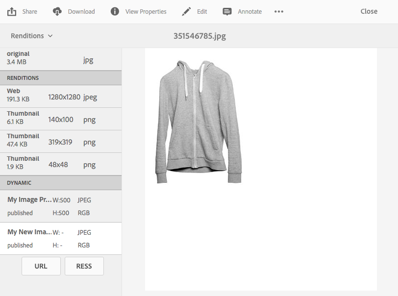

# Aplicación de ajustes preestablecidos de imagen de Dynamic Media {#applying-image-presets}

Los ajustes preestablecidos de imagen permiten que los recursos entreguen imágenes de forma dinámica en diferentes tamaños, en diferentes formatos o con otras propiedades de imagen que se generan dinámicamente. Puede elegir un ajuste preestablecido al exportar para cambiar el formato de las imágenes a las especificaciones que haya descrito el administrador.

Además, puede elegir un ajuste preestablecido de imagen que sea interactivo (designado por el **[!UICONTROL RESS]** después de seleccionarlo).

[Los administradores pueden crear y configurar ajustes preestablecidos de imagen](managing-image-presets.md).

>[!NOTE]
>
>Las imágenes inteligentes funcionan con los ajustes preestablecidos de imagen existentes. Utiliza inteligencia en el último milisegundo de envío para reducir aún más el tamaño del archivo de imagen en función de la velocidad de conexión del explorador o de la red. Consulte [Imágenes inteligentes](imaging-faq.md) para obtener más información.

Puede aplicar un ajuste preestablecido de imagen a una imagen cada vez que la previsualice.

**Para aplicar ajustes preestablecidos de imagen de Dynamic Media:**

1. Abra el recurso y, en el carril izquierdo, seleccione la lista desplegable y, a continuación, seleccione **[!UICONTROL Representaciones]**.

   >[!NOTE]
   >
   >* Las representaciones estáticas aparecen en la mitad superior del panel. Las representaciones dinámicas aparecen en la mitad inferior. Solo con las representaciones dinámicas, puede utilizar la dirección URL para mostrar la imagen. El **[!UICONTROL URL]** El botón sólo aparece si selecciona una representación dinámica. El **[!UICONTROL RESS]** El botón solo aparece si selecciona un ajuste preestablecido de imagen interactivo.
   >
   >* El sistema muestra numerosas representaciones al seleccionar **[!UICONTROL Representaciones]** en la Vista de detalles de un recurso. Puede aumentar el número de ajustes preestablecidos vistos. Consulte [Aumento del número de ajustes preestablecidos de imagen que se muestran](managing-image-presets.md#increasing-or-decreasing-the-number-of-image-presets-that-display).

   

1. Realice una de las acciones siguientes:

   * Para previsualizar el ajuste preestablecido de imagen, seleccione una representación dinámica.
   * Para mostrar la ventana emergente, seleccione **[!UICONTROL URL]**, **[!UICONTROL Incrustar]**, o **[!UICONTROL RESS]**.

   >[!NOTE]
   >
   >Si el recurso *y* Si los ajustes preestablecidos de imagen aún no se han publicado, la variable **[!UICONTROL URL]** (o los botones URL y RESS, si corresponde) no está disponible.
   >
   >Tenga en cuenta también que los ajustes preestablecidos de imagen se publican automáticamente en un servidor de Dynamic Media S7.
