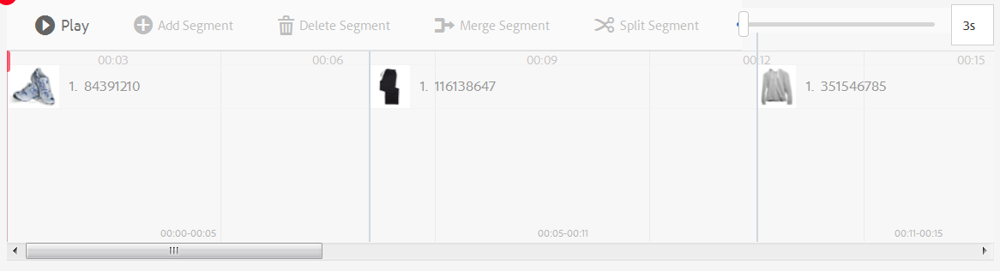

# Vídeos interactivos{#interactive-videos}


Puede crear fácilmente vídeos interactivos (también conocidos como vídeos de ventas) que impulsan la conversión directamente desde el vídeo. La participación del cliente en el vídeo se produce en un panel junto con el reproductor de vídeo, donde las miniaturas de servicio, información o producto relacionadas se desplazan a la vista en función de lo que se muestre en el vídeo. Los clientes pueden tocar la miniatura y estar vinculados directamente al servicio, o agregar el artículo a un carro de compras para una compra inmediata, o estar vinculados a una página web para obtener más información.

Cuando termina el vídeo, se muestra un resumen visual de todas las ofertas para impulsar una llamada a acción. Los clientes tienen otra oportunidad de tocar el elemento que desean. Experiencias procesables y específicas como éstas aumentan la conversión y la participación de los clientes.

Consulte también Imágenes [interactivas](/help/assets/dynamic-media/interactive-images.md).

## Vídeo interactivo en acción {#interactive-video-in-action}

Para ver un vídeo interactivo y de ventas en acción, haga clic en [Demostraciones en directo](https://landing.adobe.com/en/na/dynamic-media/ctir-2755/live-demos.html), desplácese hasta el encabezado **[!UICONTROL Medios de ventas]** en la página y, a continuación, haga clic en el vídeo de ventas para comenzar la reproducción.

* Durante la reproducción, como los productos se utilizan en el vídeo, el producto idéntico aparece a la derecha como una imagen en miniatura.

* Haga clic en la miniatura para pausar el vídeo y abrir la vista rápida del producto. Por ejemplo, haga clic en la imagen en miniatura de KitchenAid en el vídeo para experimentar una vista de giro de 360 grados del mezclador o amplíe para ver los detalles del mezclador.

Consulte también [Uso de vídeo interactivo con Dynamic Media](https://docs.adobe.com/content/help/en/experience-manager-learn/assets/dynamic-media/dynamic-media-interactive-video-feature-video-use.html)

<!-- 

There was a link here that showed the video frame of an interactive video and when the reader clicked the frame the video would play https://marketing.adobe.com/resources/help/en_US/dm/shoppable-video/AXIS/index.html. This now needs to call a new interactive video

-->

<!-- 

[A frame from an interactive, shoppable video](assets/chlimage_1-126.png) *A video frame capture from an interactive, shoppable video.*

-->

>[!NOTE]
>
>Si crea un vídeo interactivo para iniciar una página web cuando un usuario hace clic en una imagen en miniatura, algunos dispositivos bloquearán la apertura de la página web emergente. En estos casos, debe cambiar la configuración del bloqueador de ventanas emergentes en el dispositivo. Por ejemplo, en un iPhone 6 de Apple, toque **[!UICONTROL Configuración > Safari > Bloquear ventanas emergentes]** y, a continuación, deslice el control a **[!UICONTROL Desactivado]**. Ahora, al reproducir un vídeo interactivo y hacer clic en una miniatura, se le preguntará si desea abrir la ventana emergente. Si lo acepta, se abre la página web.

### Vea cómo se crean los vídeos interactivos {#watch-how-interactive-videos-are-created}

Mire este tutorial de 7 minutos y 30 segundos sobre [cómo se crean los vídeos interactivos](https://s7d5.scene7.com/s7viewers/html5/VideoViewer.html?videoserverurl=https://s7d5.scene7.com/is/content/&amp;emailurl=https://s7d5.scene7.com/s7/emailFriend&amp;serverUrl=https://s7d5.scene7.com/is/image/&amp;config=Scene7SharedAssets/Universal_HTML5_Video_social&amp;contenturl=https://s7d5.scene7.com/skins/&amp;asset=S7tutorials/InteractiveVideo) [](https://outv.omniture.com?v=s4NHQ2dzqd7hIqWjeG2sIdyNWsTWyupA).
(Aunque el tutorial de vídeo está marcado con Assets On Demand, los principios y pasos siguen aplicándose a Vídeo interactivo en AEM Assets).

### Seminario web sobre el éxito de los clientes de Adobe {#adobe-customer-success-webinar}

El [uso compartido de vídeos interactivos, vínculos y YouTube en el seminario web de AEM Assets](https://adobecustomersuccess.adobeconnect.com/p1yxzdo4aec/) le enseña a utilizar vídeos interactivos y otras funciones para vincular eventos impulsados por la conversión con el contenido de marketing de vídeo.

## Inicio rápido: Vídeos interactivos {#quick-start-interactive-videos}

La siguiente descripción paso a paso del flujo de trabajo se ha diseñado para ayudarle en el uso inicial de vídeos interactivos en Dynamic Media.

Busque el encabezado **Ejemplo** en algunas de las tareas de Inicio rápido. Contiene un breve tutorial basado en esta página web de demostración de [inicio que *no tiene* interactividad agregada a ella aún](https://marketing.adobe.com/resources/help/en_US/dm/shoppable-video/john-lewis/landing-0.html).

Los **ejemplos** sirven para ilustrar los pasos que se siguen para integrar vídeos interactivos en su propio sitio web.

Cuando termine el tutorial en la última sección Ejemplo, [este es el aspecto que tendrá](https://marketing.adobe.com/resources/help/en_US/dm/shoppable-video/john-lewis/landing-3.html)su página web de demostración final con el vídeo interactivo totalmente integrado.


Pasos de vídeo interactivos:

1. **(Opcional) Identificación de variables** de vista rápida: Inicio identificando variables dinámicas utilizadas por la implementación de vista rápida existente. Las variables se utilizan para asignar miniaturas de productos a la vista rápida de productos correspondiente al crear un vídeo interactivo. Consulte [(Opcional) Identificación de variables](#optional-identifying-quickview-variables)de vista rápida.
   **Este paso solo es necesario si se cumple**lo siguiente:
・ Desea agregar interactividad al vídeo activando las vistas rápidas.
・ Su implementación de AEM *no utiliza* un marco de integración de comercio electrónico para extraer datos de productos a AEM desde cualquier solución de comercio electrónico, como por ejemplo Websphere Commerce de IBM, Elastic Path, hybris o Intershop.

1. **(Opcional) Creación de un ajuste preestablecido** de visor de vídeo interactivo: personalice el aspecto y el comportamiento de los distintos componentes que componen el reproductor, como la barra de desplazamiento de vídeo y las miniaturas interactivas.
No es necesario crear su propio ajuste preestablecido de visor de vídeo interactivo si desea utilizar los ajustes preestablecidos de visor de vídeo interactivo predeterminados `Shoppable_Video_Light` o `Shoppable_Video_Dark` en su lugar.
Consulte [Creación de un nuevo ajuste preestablecido](/help/assets/dynamic-media/managing-viewer-presets.md#creating-a-new-viewer-preset) de visor (opcional) y Consideraciones [especiales para crear un ajuste preestablecido](/help/assets/dynamic-media/managing-viewer-presets.md#special-considerations-for-creating-an-interactive-viewer-preset)de visor interactivo.

1. **Carga de un vídeo y sus recursos** de imagen asociados: cargue un vídeo y las imágenes asociadas que desee que sean interactivas.
Consulte [Carga de vídeos y sus recursos](#uploading-a-video-and-its-associated-thumbnail-assets)de miniaturas asociados.

1. **Añadir la interactividad en el vídeo** : Añada uno o varios segmentos de tiempo en el vídeo. A continuación, asocie las miniaturas de imágenes dentro de esos segmentos de tiempo. Asigne cada miniatura de imagen a una acción como un hipervínculo, una vista rápida o un fragmento de experiencia.
(Tenga en cuenta que el método de vinculación basado en URL no es posible si el contenido interactivo tiene vínculos con direcciones URL relativas, especialmente vínculos a páginas de AEM Sites).
Para finalizar, publique los recursos de vídeo interactivos. Al publicar se crea el código incrustado o la URL que se copiará y aplicará a la página de aterrizaje del sitio web.Consulte [Añadir la interactividad en el vídeo](#adding-interactivity-to-your-video).
Consulte [Publicación de recursos](/help/assets/dynamic-media/publishing-dynamicmedia-assets.md).

1. **Añadir un vídeo interactivo en el sitio web o en el sitio web en AEM** Si utiliza AEM Sites, AEM comercio electrónico o ambos, puede agregar el vídeo interactivo directamente a una página web en AEM arrastrando el componente Medios interactivos a la página. See [Adding Dynamic Media Assets to Pages.](/help/assets/dynamic-media/adding-dynamic-media-assets-to-pages.md)
Utilice el código incrustado o la URL para integrar el vídeo interactivo con las experiencias del sitio web. Consulte [Integración de vídeos interactivos con el sitio web](#integrating-an-interactive-video-with-your-website).
Si está utilizando un WCM de terceros (Web Content Manager), debe integrar el nuevo vídeo interactivo con la implementación de vista rápida existente que se utiliza en el sitio web. Consulte [Integración de un vídeo interactivo con una vista rápida](#integrating-an-interactive-video-with-an-existing-quickview)existente.
   [Adición de recursos de Dynamic Media a las páginas](/help/assets/dynamic-media/adding-dynamic-media-assets-to-pages.md)

## (Opcional) Identificación de variables de Quickview {#optional-identifying-quickview-variables}

>[!NOTE]
Esta tarea solo es necesaria si se cumple lo siguiente:
* Desea agregar interactividad al vídeo activando las vistas rápidas.
* La implementación de AEM *no utiliza* un marco de integración de comercio electrónico para extraer datos de productos a AEM desde cualquier solución de comercio electrónico, como comercio de esfera web de IBM, ruta elástica, hibris o intershop. <!-- See [eCommerce concepts in AEM Assets](/help/sites-administering/concepts.md).-->

Si la implementación de AEM utiliza el comercio electrónico, puede omitir esta tarea y continuar con la siguiente tarea.

Inicio identificando las variables dinámicas utilizadas por la implementación de vista rápida existente para que pueda asignar las miniaturas de los productos a la vista rápida del producto correspondiente durante el proceso de creación de vídeo interactivo.

Cuando agrega segmentos de tiempo a un vídeo, asigna un SKU y cualquier variable adicional a cada miniatura que agregue a un segmento. Estas variables se utilizan más adelante para mostrar el producto de vista rápida correcto.

Es importante identificar correctamente qué variables son necesarias para activar de forma exclusiva una vista rápida del producto.

A veces puede bastar con consultar con especialistas de TI responsables de la implementación de Quickview existente. Es probable que conozcan el conjunto mínimo de datos necesario para identificar la vista rápida en el sistema. Sin embargo, en la mayoría de los casos también es posible simplemente analizar el comportamiento existente del código front-end.

La mayoría de las implementaciones de Quickview utilizan el siguiente paradigma:

* El usuario activa un elemento de interfaz de usuario en el sitio web. Por ejemplo, al hacer clic en el botón &quot;Vista rápida&quot;.
* El sitio web envía una solicitud de Ajax al servidor para cargar los datos o el contenido de la vista rápida, si es necesario.
* Los datos de la vista rápida se traducen al contenido como preparación para su procesamiento en la página web.
* Por último, el código front-end procesa visualmente dicho contenido en la pantalla.

Por lo tanto, el método consiste en visitar diferentes áreas del sitio web existente donde se implementa Quickview, activar la vista rápida y capturar la URL de Ajax que envía la página web para cargar los datos o el contenido de la vista rápida.

Normalmente no es necesario que utilice ninguna herramienta de depuración especializada. Los navegadores web modernos cuentan con inspectores web que realizan un trabajo adecuado. Estos son algunos ejemplos de exploradores Web que incluyen inspectores Web:

* Para ver todas las solicitudes HTTP salientes en Google Chrome, pulse **F12** (Windows) o **Comando+Opciones+I** (Mac) para abrir el panel Herramientas del desarrollador y, a continuación, haga clic en la ficha **Red** .

* In Firefox, you can either activate the Firebug plug-in by pressing **F12** (Windows) or **Command+Option+I** (Mac) and use its **[!UICONTROL Net]** tab, or you can use the built-in Inspector tool and its Network tab.

* En Internet Explorer, active la herramienta de depuración pulsando **F12**.

Cuando la supervisión de red está activada en el explorador, active la vista rápida en la página.

Ahora encuentre la URL de Ajax de vista rápida en el registro de red y copie la URL grabada para análisis futura. En la mayoría de los casos, cuando se activa la vista rápida, hay numerosas solicitudes que se envían al servidor. Normalmente, la URL de Ajax de vista rápida es una de las primeras de la lista. Tiene una parte o ruta de cadena de consulta compleja y su tipo MIME de respuesta es `text/html`, `text/xml`o `text/javascript`.

Durante este proceso es importante visitar diferentes áreas del sitio web, con diferentes tipos y categorías de productos. El motivo es que las direcciones URL de vista rápida pueden tener partes que son comunes para una categoría de sitio web determinada, pero solo cambian si se visita un área diferente del sitio web.

En el caso más sencillo, la única parte variable de la URL de vista rápida es el SKU del producto. En este caso, el valor de SKU del producto es la única pieza de datos necesaria para agregar miniaturas a un segmento de tiempo en el vídeo interactivo de AEM.

Sin embargo, en casos complejos, la URL de vista rápida tiene diferentes elementos además del SKU del producto, como ID de categoría, código de color, etc. En estos casos, cada elemento de este tipo se convierte en una variable separada en la definición de datos en miniatura en AEM.

Considere los siguientes ejemplos de URL de vista rápida y sus variables de miniatura resultantes:

<table>
  <tbody>
  <tr>
    <td><p>SKU único, que se encuentra en la cadena de consulta.</p> </td>
    <td><p>Las direcciones URL de vista rápida grabadas incluyen lo siguiente:</p>
    <ul>
      <li><p><code>https://server/json?productId=866558&amp;source=100</code></p> </li>
      <li><p><code>https://server/json?productId=1196184&amp;source=100</code></p> </li>
      <li><p><code>https://server/json?productId=1081492&amp;source=100</code></p> </li>
      <li><p><code>https://server/json?productId=1898294&amp;source=100</code></p> </li>
    </ul> <p>La única parte variable de la dirección URL es el valor del parámetro de cadena de <code>productId=</code> consulta y es claramente un valor de SKU. Por lo tanto, nuestras miniaturas solo necesitan campos SKU rellenados con valores como <strong><code>866558</code></strong>, <strong><code>1196184</code></strong>, <strong><code>1081492</code></strong>, <strong><code>1898294</code></strong>.</p> </td>
  </tr>
  <tr>
    <td><p>SKU único, que se encuentra en la ruta de URL.</p> </td>
    <td><p>Las direcciones URL de vista rápida grabadas incluyen lo siguiente:</p>
    <ul>
      <li><p><code>https://server/product/6422350843</code></p> </li>
      <li><p><code>https://server/product/1607745002</code></p> </li>
      <li><p><code>https://server/product/0086724882</code></p> </li>
    </ul> <p>La parte variable se encuentra en la última parte de la ruta y se convierte en el valor de SKU de AEM miniaturas: <strong><code>6422350843</code></strong>, <strong><code>1607745002</code></strong>, <strong><code>0086724882</code></strong>.</p> </td>
  </tr>
  <tr>
    <td><p>SKU e ID de categoría en la cadena de consulta.</p> </td>
    <td><p>Las direcciones URL de vista rápida grabadas incluyen lo siguiente:</p>
    <ul>
      <li><p><code>https://server/quickView/product/?category=1100004&amp;prodId=305466</code></p> </li>
      <li><p><code>https://server/quickView/product/?category=1100004&amp;prodId=310181</code></p> </li>
      <li><p><code>https://server/quickView/product/?category=1740148&amp;prodId=308706</code></p> </li>
    </ul> <p>En este caso, hay dos partes diferentes en la dirección URL. El SKU se almacena en el <code>prodId</code> parámetro y el ID de categoría se almacena en el <code>category=</code> parámetro.</p> <p>Como tal, las definiciones de miniaturas son pares. Es decir, un valor de SKU y una variable adicional llamada <code>categoryId</code>. Los pares resultantes son los siguientes:</p>
    <ul>
      <li>El SKU es <code>305466</code> y <code>categoryId</code> es <code>1100004</code></li>
      <li>El SKU es <code>310181</code> y <code>categoryId</code> es <code>1100004</code></li>
      <li>El SKU es <code>308706</code> y <code>categoryId</code> es <code>1740148</code></li>
    </ul> <p> </p> </td>
  </tr>
  </tbody>
</table>

**Ejemplo**

Cuando se aplica el enfoque anterior a nuestro sitio web de Ejemplo, tenemos una página web con varias miniaturas de productos, cada una con el botón &quot;VER MÁS&quot;:

[https://marketing.adobe.com/resources/help/en_US/dm/shoppable-video/john-lewis/landing-0.html](https://marketing.adobe.com/resources/help/en_US/dm/shoppable-video/john-lewis/landing-0.html)

Después de activar todas las vistas rápidas del producto disponibles en la página, obtiene la siguiente lista de las solicitudes de vista rápida realizadas en el servidor:

* datafeed/candles-233396346.json
* datafeed/candles-233978050.json
* datafeed/candles-234024346.json
* datafeed/candles-234024356.json
* datafeed/candles-234024359.json
* datafeed/cushions-233939848.json
* datafeed/cushions-234019477.json
* datafeed/cushions-234019483.json
* datafeed/furniture-231747479.json
* datafeed/furniture-232625621.json
* datafeed/furniture-232625626.json
* datafeed/furniture-233939810.json
* datafeed/furniture-233939825.json
* datafeed/furniture-233939828.json
* datafeed/furniture-233939853.json
* datafeed/furniture-233940334.json
* datafeed/glassware-000064007.json
* datafeed/glassware-230722193.json
* datafeed/glassware-233916550.json
* datafeed/glassware-233916597.json

Si observa estas llamadas al servidor, verá que la información específica del producto solo está presente en la ruta de solicitud. También se observa que la cadena de consulta no se utiliza en absoluto y que hay dos tipos distintos de datos involucrados:

* El primer tipo son velas, cojines, muebles y vidrieras. Puede llamar a esta &quot;categoría del producto&quot;.
* El segundo tipo es el código de producto, como 233916597. Puede suponer que es &quot;SKU de producto&quot;.

Dada esta información, toda la URL de vista rápida tiene el siguiente patrón:

`/datafeed/$categoryId$-$SKU$.json`

En función de esta análisis, puede concluir que puede utilizar las dos variables siguientes para las miniaturas: `categoryId` y `SKU`.

Ya está listo para cargar un vídeo y sus recursos de miniaturas asociados.

## (Opcional) Creación de un ajuste preestablecido de visor de vídeo interactivo {#optional-creating-an-interactive-video-viewer-preset}

Puede omitir esta tarea y continuar con la siguiente si desea utilizar cualquiera de los tipos de ajustes preestablecidos predeterminados del visor de vídeo interactivo `Shoppable_Video_dark` o `Shoppable_Video_light`.

Cuando se hace clic en una miniatura en el entorno de creación, aparece una previsualización del cuadro de diálogo Vista rápida.


Si lo desea, puede crear su propio ajuste preestablecido de visor de vídeo interactivo personalizado. Puede determinar, entre otras cosas, el estilo del reproductor de vídeo, las miniaturas interactivas y la vista de cuadrícula de miniaturas que aparece al final del vídeo.

Un ajuste preestablecido de visor de vídeo interactivo procesa correctamente el vídeo y todos los segmentos de línea de tiempo que ha agregado. También utiliza una vista rápida predeterminada de ejemplo al hacer clic en una miniatura de producto en modo de Previsualización para que pueda probar su interactividad antes de publicar.

Después de guardar el ajuste preestablecido de visualizador, su estado se establece automáticamente en **On **en la página Ajustes preestablecidos del visualizador. Este estado significa que está visible en el componente Dynamic Media y siempre que se obtiene una vista previa de un vídeo con él. Asegúrese de publicar también manualmente el nuevo ajuste preestablecido de visualizador.

Consulte [Creación de un nuevo ajuste preestablecido](/help/assets/dynamic-media/managing-viewer-presets.md#creating-a-new-viewer-preset) de visor para crear su propio ajuste preestablecido de visor de vídeo interactivo.

## Carga de un vídeo y sus recursos de miniaturas asociados {#uploading-a-video-and-its-associated-thumbnail-assets}

Si ya ha cargado los recursos de vídeo y miniaturas, continúe [Añadiendo la interactividad en el vídeo](#adding-interactivity-to-your-video).

Si ha cargado los vídeos o las imágenes incorrectos o desea eliminar los vídeos o las imágenes cargados que ya no necesita, consulte [Eliminación de recursos](/help/assets/manage-digital-assets.md#delete-assets).

Para cargar un vídeo y sus recursos de miniaturas asociados:

1. Cargue el vídeo y los recursos de miniaturas asociados a la carpeta o carpetas que desee.

   See [Uploading assets](/help/assets/manage-digital-assets.md).
Consulte [Carga de recursos mediante la programación](/help/assets/manage-digital-assets.md)de trabajos de FTP.

   Ahora agregue interactividad al vídeo.

## Añadir la interactividad en el vídeo {#adding-interactivity-to-your-video}

Los segmentos de línea de tiempo se agregan a un vídeo mediante el editor visual in-situ de la página Crear vídeo interactivo.

Después de agregar segmentos de línea de tiempo, agregue imágenes en miniatura dentro de cada segmento. Para cada miniatura que agregue, se le aplicará una acción. Por ejemplo, puede aplicar una vista rápida a la miniatura, o puede asignarle un hipervínculo o un fragmento de experiencia.

Consulte Fragmentos [de experiencias](/help/sites-cloud/authoring/fundamentals/experience-fragments.md).

>[!NOTE]
Tenga en cuenta que las herramientas de uso compartido de medios sociales en vídeo interactivo no son compatibles cuando incrusta el visor en un fragmento de experiencia. Para solucionar este problema, puede utilizar o crear ajustes preestablecidos de visor que no tengan herramientas de uso compartido en medios sociales. Estos ajustes preestablecidos de visor permiten incrustarlos correctamente en fragmentos de experiencia.

>[!NOTE]
El método de vinculación basado en URL no es posible si el contenido interactivo tiene vínculos con direcciones URL relativas, especialmente vínculos a páginas de AEM Sites.

Las opciones Deshacer y Rehacer, cerca de la esquina superior derecha de la página, son compatibles durante la sesión de creación/edición actual.

Después de guardar el vídeo interactivo, éste se abre inmediatamente en la Previsualización. Desde allí, puede seleccionar un ajuste preestablecido de visor de vídeo interactivo y reproducir el vídeo para ver una representación aproximada de cómo aparecerá para los clientes.

Para añadir interactividad al vídeo:

1. En la vista Recursos, navegue hasta el vídeo que ha cargado y desee hacer interactivo.
1. Realice una de las acciones siguientes:

   * Hover on the image, then tap **[!UICONTROL Select]** (checkmark icon). En la barra de herramientas, toque **[!UICONTROL Editar]**.

   * Pase el ratón sobre la imagen y, a continuación, toque **[!UICONTROL Más acciones]** (icono de tres puntos) **[!UICONTROL > Editar]**.

   * Toque la imagen para abrirla en la página Vista de detalles. En la barra de herramientas, toque **[!UICONTROL Editar]**.

1. En la página Crear vídeo interactivo, realice una de las siguientes acciones:

   * Toque el botón **[!UICONTROL Reproducir]** para empezar a reproducir el vídeo. Cuando un producto, servicio o detalle concreto que desee resaltar entre en vista, toque **[!UICONTROL Añadir segmento]** en la barra de herramientas. Repita el procedimiento hasta que haya llegado al final del vídeo.

      Por cada segmento de tiempo que agregue, puede asignarle una o más imágenes en miniatura y luego vincular esas miniaturas a páginas de productos de vista rápida para que los clientes las compren o a páginas Web para obtener más información.

   * Toque el botón **[!UICONTROL Reproducir]** para empezar a reproducir el vídeo. Cuando un producto, servicio o detalle concreto que desee resaltar entre en vista, toque **[!UICONTROL Pausa]**. Toque **[!UICONTROL Añadir segmento]**.

      Continúe reproduciendo y pausando el vídeo en puntos de la línea de tiempo en los que desee agregar un segmento hasta que llegue al final del vídeo.

1. (Opcional) Arrastre la barra en el **[!UICONTROL deslizador de la cronología]** a la izquierda para acercar o a la derecha para alejar, controlando así el grado de detalle que ve de los segmentos que ha agregado.

   

   Según la duración del vídeo, la duración del segmento se establece de forma predeterminada en los siguientes valores:

   <table>
      <tbody>
        <tr>
        <td><strong>Si la duración del vídeo es...</strong></td>
        <td><strong>El valor predeterminado de la configuración Duración del segmento es...</strong></td>
        </tr>
        <tr>
        <td>3 minutos o más</td>
        <td>60 segundos</td>
        </tr>
        <tr>
        <td>2 a 3 minutos</td>
        <td>30 segundos</td>
        </tr>
        <tr>
        <td>1-2 minutos</td>
        <td>20 seconds<br /> </td>
        </tr>
        <tr>
        <td>30-60 segundos</td>
        <td>10 segundos</td>
        </tr>
        <tr>
        <td>30 segundos o menos</td>
        <td>5 segundos</td>
        </tr>
      </tbody>
    </table>

   La línea de tiempo del vídeo utiliza tanto espacio de la pantalla como lo que está disponible. Por lo tanto, al cambiar el tamaño del explorador, los segmentos que ha agregado mantienen su ancho correcto.

   Para ilustrarlo, las tres capturas de pantalla siguientes utilizan el mismo vídeo. Observe que la anchura de cada segmento cambia según la configuración de la escala de línea de tiempo.

   

   Captura de pantalla A

   La captura de pantalla A de arriba muestra la vista predeterminada de un video de producto de 29 segundos. La escala de línea de tiempo se establece en el valor predeterminado de 5 segundos.

   

   Captura de pantalla B

   En la captura de pantalla B anterior, el control deslizante Escala de línea de tiempo se arrastraba del valor predeterminado de 5 segundos a 3 segundos. Tenga en cuenta que las marcas de tiempo de escala de tiempo individuales ahora se definen en intervalos de 3 segundos.

   

   Captura de pantalla C

   En la captura de pantalla C anterior, el ajuste Escala de línea de tiempo se movió a 8 segundos. Observe cómo los segmentos que contienen miniaturas de productos se han reducido. El alejamiento de este modo resulta útil si tiene un vídeo largo y desea ver una descripción general de más segmentos que normalmente caben en el ancho de la página.

1. (Opcional) Realice cualquiera de las siguientes acciones:

   * Para ajustar la hora de inicio y la hora de finalización de un segmento.

      Seleccione un segmento y, a continuación, arrastre el óvalo azul inicial o final para ajustar el inicio o la hora de finalización, respectivamente. El fotograma de vídeo mostrado se mueve al tiempo adecuado en el vídeo, según los ajustes. El movimiento del segmento de línea de tiempo está restringido en función de cualquier segmento adyacente en la línea de tiempo. El tiempo mínimo permitido para el segmento es de un segundo.

      Utilice los siguientes métodos abreviados de navegación para comprobar y ajustar rápidamente los segmentos de vídeo:

      * Toque el óvalo azul inicial para buscar el vídeo directamente al principio del segmento.
      * Toque el óvalo azul final para buscar el vídeo directamente al final de ese segmento.
      * Toque todo el segmento para devolver la reproducción de vídeo al inicio de ese segmento

   

   Cambio de posición del final de un segmento de línea de tiempo

   * Para eliminar un segmento

      Seleccione el último segmento que se encuentra en la línea de tiempo y, en la barra de herramientas, toque **[!UICONTROL Eliminar segmento]**. Si se seleccionan dos o más segmentos, la función Eliminar segmento se desactiva.

      Solo puede eliminar el último segmento. Por ejemplo, si desea eliminar todos los segmentos de la línea de tiempo, siempre debe seleccionar el último y, a continuación, tocar **[!UICONTROL Eliminar segmento]**.


1. Seleccione un segmento de tiempo al que desee asociar una o varias imágenes en miniatura.
1. A la derecha del vídeo, toque la ficha **[!UICONTROL Contenido]** .
1. En la ficha Contenido, toque **[!UICONTROL Seleccionar recursos]** y, a continuación, busque y seleccione todos los recursos de imagen que desee utilizar con el vídeo. Los recursos seleccionados se agregan al panel Selector de recursos de la ficha Contenido.

1. En el selector de recursos situado debajo de la ficha Contenido, realice una de las siguientes acciones:

   <table>
      <tbody>
        <tr>
        <td>Para asociar una miniatura al segmento de línea de tiempo seleccionado</td>
        <td><p>Toque la imagen en el panel selector de recursos de la derecha.</p> <p>Puede agregar tantas miniaturas como desee a un segmento de línea de tiempo. Para cada imagen seleccionada, aparece una marca de verificación sobre la imagen en el selector de recursos.</p> </td>
        </tr>
        <tr>
        <td>Quitar una miniatura del segmento de línea de tiempo seleccionado</td>
        <td><p>Realice una de las acciones siguientes:</p>
          <ul>
          <li>En el panel selector de recursos, toque una imagen con una marca de verificación para anular la selección. El recurso de imagen se elimina del segmento de línea de tiempo.<br /> </li>
          <li>En el segmento de línea de tiempo seleccionado, toque una imagen y, en la barra de herramientas, toque <strong>Eliminar producto</strong>.</li>
          </ul> </td>
        </tr>
      </tbody>
    </table>

   

   Al tocar una imagen en el panel selector de recursos, se agrega al segmento de línea de tiempo seleccionado.

1. Seleccione una sola imagen en miniatura dentro de uno de los segmentos de la línea de tiempo y, a continuación, toque la ficha **[!UICONTROL Acciones]** .
1. Realice una de las acciones siguientes:
   <table> 
    <tbody> 
      <tr> 
      <td>Asociación de la imagen en miniatura seleccionada con una vista rápida</td> 
      <td><p>En Tipo de acción, toque <strong>Vista rápida</strong>.</p> <p>Si es cliente de AEM Sites y comercio electrónico:</p> 
       <ul> 
       <li>Tenga en cuenta que el campo de texto Valor de SKU se rellena previamente con el SKU del producto seleccionado (Unidad de almacenamiento de información), que es un identificador único para cada producto o servicio distinto que esté ofreciendo. Esto se rellena automáticamente cuando la imagen está asociada a un producto en AEM comercio.</li> 
       <li>Si el SKU previamente rellenado es incorrecto, toque o haga clic en el icono Selector de producto (lupa) para abrir la página Seleccionar producto. Toque o haga clic en el producto que desee utilizar y, a continuación, toque la marca de verificación situada en la esquina superior derecha de la página para volver al Editor de vídeo interactivo.</li> 
       </ul> <p> Si <em>no es</em> cliente de AEM Sites o de comercio electrónico</p> 
       <ul> 
       <li>Consulte <a href="/help/assets/dynamic-media/carousel-banners.md#identifying-hotspot-and-image-map-variables">Identificación de variables</a>de puntos interactivos. Deberá definir estas variables. </li> 
       <li>De forma predeterminada, este campo SKU utiliza el nombre de archivo del recurso de imagen sin la extensión. Si sigue una convención de nombres estándar para los archivos basados en SKU, esto generalmente no requiere ninguna edición adicional. </li> 
       <li>De lo contrario, edite el valor predeterminado e introduzca el valor de SKU correcto. En el campo de texto Valor de SKU, escriba el SKU del producto (Unidad de mantenimiento de existencias), que es un identificador único para cada producto o servicio distinto que oferta. El valor de SKU introducido rellena automáticamente la parte variable de la plantilla de vista rápida, de modo que el sistema sepa asociar la imagen tocada con la vista rápida de un SKU concreto.</li> 
       </ul> <p>(Opcional) Si hay otras variables dentro de la vista rápida que debe utilizar para identificar un producto, toque <strong>Añadir variable</strong>genérica. En el campo de texto, especifique una variable adicional. Por ejemplo, <code>category=Womens</code> es una variable agregada.</p> <p> </p> </td> 
      </tr> 
      <tr> 
      <td>Asociación de la imagen en miniatura seleccionada con un hipervínculo</td> 
      <td><p>En Tipo de acción, toque <strong>Hipervínculo</strong>y, a continuación, realice una de las siguientes acciones:</p> 
       <ul> 
       <li>Si es cliente de AEM Sites, toque el icono (carpeta) Selector de sitio para navegar a una página web. Tenga en cuenta que el método de vinculación basado en URL no es posible si el contenido interactivo tiene vínculos con direcciones URL relativas, especialmente vínculos a páginas de AEM Sites.</li> 
       <li>Si es cliente independiente de Dynamic Media, en el campo de texto HREF, especifique la ruta de URL completa a una página web vinculada.</li> 
       </ul> <p>Asegúrese de especificar si desea abrir el vínculo en una nueva ficha del explorador o en la ficha actual.</p> </td> 
      </tr> 
      <tr> 
      <td>Asociación de la imagen en miniatura seleccionada con un fragmento de experiencia</td> 
      <td><p>En Tipo de acción, toque Fragmento <strong>de</strong>experiencia y, a continuación, haga lo siguiente:<p> 
       <ul> 
       <li>Si es cliente de AEM Sites, toque o haga clic en el icono de búsqueda (lupa) para abrir la página Fragmento de experiencias. Toque o haga clic en el fragmento de experiencias que desee utilizar y, a continuación, toque <strong>Seleccionar </strong>en la esquina superior derecha de la página para volver al panel Acciones de la página anterior.<br /> Consulte Fragmentos <a href="/help/sites-cloud/authoring/fundamentals/experience-fragments.md">de experiencias</a>.</li> 
      </ul> 
       <ul> 
       <li>Especifique la anchura y la altura del fragmento de experiencias tal como aparecerán en el vídeo.</li>
       </ul><strong>Nota</strong>: Tenga en cuenta que las herramientas de uso compartido de medios sociales en vídeo interactivo no son compatibles cuando incrusta el visor en un fragmento de experiencia. Para solucionar este problema, puede utilizar o crear ajustes preestablecidos de visor que no tengan herramientas de uso compartido en medios sociales. Estos ajustes preestablecidos de visor permiten incrustarlos correctamente en fragmentos de experiencia.</p></tr>&lt; 
      <tr> 
      <td>Para editar una acción ya asignada a una imagen en miniatura</td> 
      <td>Dentro de un segmento de línea de tiempo, toque una imagen en miniatura que tenga un vínculo de cadena a la derecha de su etiqueta de texto. El vínculo de cadena indica que se le asigna una acción. Toque la ficha <strong>Acciones</strong> para realizar los cambios.</td> 
      </tr> 
      <tr> 
      <td>Cambio de la etiqueta de texto de una imagen en miniatura</td> 
      <td><p>De forma predeterminada, la etiqueta de texto utiliza el campo de metadatos de la imagen en miniatura <code>Title</code> . Si no <code>Title</code> está presente, se utiliza el nombre de archivo de la imagen en miniatura, pero sin la extensión.</p> <p>Para cambiar la etiqueta de texto de una imagen en miniatura, en la <strong>ficha </strong>Acciones, directamente debajo del recurso de imagen que se muestra, introduzca el texto que desee. Consulte la siguiente ilustración.</p> <p>Tenga en cuenta que la nueva etiqueta de texto solo la utiliza el propio reproductor de vídeo y el texto en miniatura que se muestra en el segmento de línea de tiempo. El cambio de etiqueta no afecta al campo de metadatos Título de la imagen en miniatura ni a su nombre de archivo.</p> </td> 
      </tr> 
      <tr> 
      <td>Para revertir un cambio realizado</td> 
      <td>Cerca de la esquina superior derecha de la página, toque <strong>Deshacer</strong> o <strong>Rehacer</strong>.</td> 
      </tr> 
    </tbody> 
   </table>

   

   Se agrega una nueva etiqueta de texto a la imagen en miniatura.

1. Realice una de las acciones siguientes:

   * Repita los pasos 6 a 11 para agregar más imágenes en miniatura a los segmentos de línea de tiempo del vídeo.
   * Continúe con el paso opcional 13.

1. (Opcional) Realice una de las acciones siguientes:

   * **[!UICONTROL Combinar segmento]** : puede combinar dos segmentos adyacentes (con o sin miniaturas de producto asignadas a ellos) en un segmento.

      En la línea de tiempo, toque dos o más segmentos contiguos que desee combinar en uno. Tenga en cuenta que no hay controladores de arrastre de óvalo azul en los dos segmentos seleccionados en la siguiente ilustración.

      Toque **[!UICONTROL Combinar segmento]** en la barra de herramientas.
   

   Combinar dos segmentos seleccionados de cinco segundos en un segmento de diez segundos.

   * **[!UICONTROL Dividir segmento]** : puede dividir un solo segmento en dos segmentos de igual temporización. Si ya hay miniaturas de productos asignadas al segmento, las miniaturas se combinan en el segmento izquierdo.

      En la línea de tiempo, toque un segmento que desee dividir por la mitad y, a continuación, toque **[!UICONTROL Dividir segmento]** en la barra de herramientas.

      Al seleccionar dos o más segmentos, se deshabilita la función **[!UICONTROL Dividir segmento]** .
   

   Dividir un segmento seleccionado de diez segundos en dos segmentos de cinco segundos cada uno.

1. Cerca de la esquina superior derecha de la página **[!UICONTROL Crear vídeo]** interactivo, se muestra el nombre del ajuste preestablecido de visor seleccionado actualmente para el vídeo. Toque el nombre para seleccionar otro ajuste preestablecido de visor.

   Por ejemplo, el ajuste preestablecido de `Shoppable_Video_light` visor permite reproducir el vídeo con un área de visualización en blanco adyacente al vídeo. El área de visualización es donde se muestran las imágenes en miniatura en las que se puede hacer clic durante la reproducción. El ajuste preestablecido `Shoppable_Video_dark` de visor le permite reproducir el vídeo con un área de visualización en negro adyacente al vídeo.

   Si ha creado su propio ajuste preestablecido de visor de vídeo interactivo, también lo verá en la lista de ajustes preestablecidos de los que puede elegir.

   Cuando haya terminado, toque **[!UICONTROL Guardar]**.

   >[!NOTE]
   Al guardar el vídeo interactivo, se guarda automáticamente un archivo asociado de `.vtt`. El archivo de `.vtt`se guarda en la carpeta `_VTT` situada en la raíz de **[!UICONTROL Assets]**. El archivo y la carpeta son necesarios para que el vídeo interactivo se reproduzca correctamente en el sitio web. Como tal, no mueva, edite ni elimine la carpeta `_VTT` ni su contenido.

1. Publique el vídeo interactivo. La publicación crea el código incrustado o la dirección URL que, finalmente, copiará y pegará en las experiencias del sitio web.

   Si ha añadido interactividad con las vistas de preguntas y respuestas rápidas, utilice únicamente el código incrustado; si ha agregado interactividad con páginas web con hipervínculos, también puede utilizar la URL publicada. Sin embargo, tenga en cuenta que el método de vinculación basado en URL no es posible si el contenido interactivo tiene vínculos con direcciones URL relativas, en particular vínculos a páginas de AEM Sites.

   Consulte [Publicación de recursos](publishing-dynamicmedia-assets.md).

   >[!NOTE]
   Para publicar un vídeo de ventas con Quickviews, asegúrese de publicar también cada uno de los recursos de imagen relacionados del vídeo desde el área de comercio, por separado.

   Después de agregar segmentos de línea de tiempo y publicar el vídeo interactivo, estará listo para agregarlo a la página de aterrizaje de sitio web existente. Consulte [Integración de vídeos interactivos con el sitio web.](#integrating-an-interactive-video-with-your-website)

## Publicación de recursos de vídeo interactivos {#publishing-interactive-video-assets}

Consulte [Publicación de recursos](/help/assets/dynamic-media/publishing-dynamicmedia-assets.md) para obtener más información sobre cómo publicar recursos de vídeo interactivos.

## Integración de vídeos interactivos con el sitio web {#integrating-an-interactive-video-with-your-website}

Después de cargar un vídeo, agregar segmentos de línea de tiempo y publicar el vídeo interactivo, ya estará listo para agregarlo al sitio web existente.

Si es cliente de AEM Sites, puede agregar el vídeo interactivo arrastrando el componente Medios interactivos a la página. See [Adding Dynamic Media Assets to Pages.](/help/assets/dynamic-media/adding-dynamic-media-assets-to-pages.md)

Si es cliente independiente de AEM Assets, puede agregar manualmente el vídeo interactivo a su sitio web como se describe en esta sección.

1. Copie la URL o el código incrustado del vídeo interactivo publicado.
See [Embedding the Video or Image Viewer on a Web Page](/help/assets/dynamic-media/embed-code.md).
Si ha añadido interactividad con las vistas de preguntas y respuestas rápidas, utilice únicamente el código incrustado; si ha agregado interactividad con páginas web con hipervínculos, también puede utilizar la URL publicada. Sin embargo, tenga en cuenta que el método de vinculación basado en URL no es posible si el contenido interactivo tiene vínculos con direcciones URL relativas, en particular vínculos a páginas de AEM Sites.

1. En el código de página web del destinatario, identifique dónde se encuentra el vídeo estático.
1. Elimine el vídeo estático y reemplace el código por el código incrustado o la URL que ha copiado de AEM Assets, tal como está.
El código incrustado copiado se establece para un entorno interactivo, por lo que debe ajustarse automáticamente al área ocupada anteriormente por el vídeo estático.

>[!NOTE]
En este punto, si ha agregado interactividad solo con páginas web con hipervínculos, ya no estará.
Sin embargo, si ha agregado interactividad para activar una vista rápida, las miniaturas adyacentes al vídeo interactivo solo se muestran con fines de visualización; aún no están integrados con las vistas rápidas existentes. En este caso, ahora debe integrar el vídeo interactivo con las vistas de ciclo de vida existentes en su sitio web.

**Ejemplo**

Uso del sitio web de demostración como ejemplo:

[https://marketing.adobe.com/resources/help/en_US/dm/shoppable-video/john-lewis/landing-0.html](https://marketing.adobe.com/resources/help/en_US/dm/shoppable-video/john-lewis/landing-0.html)

Observe que es código incrustado de vídeo estándar:

```xml
<style type="text/css">
 #s7video_div.s7videoviewer{
   width:100%;
   height:auto;
 }
</style>

<script type="text/javascript" src="https://demos-pub.assetsadobe.com/etc/dam/viewers/s7viewers/html5/js/VideoViewer.js"></script>
<div id="s7video_div"></div>
<script type="text/javascript">
 var s7videoviewer = new s7viewers.VideoViewer({
  "containerId" : "s7video_div",
  "params" : {
   "serverurl" : "https://adobedemo62-h.assetsadobe.com/is/image",
   "contenturl" : "https://demos-pub.assetsadobe.com/",
   "config" : "/etc/dam/presets/viewer/Video",
   "config2": "/etc/dam/presets/analytics",
   "videoserverurl": "https://gateway-na.assetsadobe.com/DMGateway/public/demoCo",
   "posterimage": "/content/dam/marketing/shoppable-video/john-lewis/shoppable-video-john-lewis-2014.mp4",
   "asset" : "/content/dam/marketing/shoppable-video/john-lewis/shoppable-video-john-lewis-2014.mp4" }
 }).init();
</script>
```

La integración es tan sencilla como eliminar el código incrustado de vídeo y reemplazarlo por el código incrustado de vídeo interactivo de AEM. Puede ver el resultado en la siguiente dirección URL. Aunque muestra un vídeo interactivo presente en la página, aún no está integrado con las vistas rápidas existentes:

[https://marketing.adobe.com/resources/help/en_US/dm/shoppable-video/john-lewis/landing-1.html](https://marketing.adobe.com/resources/help/en_US/dm/shoppable-video/john-lewis/landing-1.html)

## Integración de un vídeo interactivo con una vista rápida existente {#integrating-an-interactive-video-with-an-existing-quickview}

>[!NOTE]
Esta tarea solo se aplica si es cliente independiente de AEM Assets.

El último paso de este proceso es integrar el vídeo interactivo con una implementación de vista rápida existente que se utiliza en el sitio web. No existe una solución para la integración que funcione en todos los casos. Cada implementación de QuickView es única. Como tal, se necesita un enfoque específico que muy probablemente implique la asistencia de una persona de TI de primer nivel.

La implementación de vista rápida existente normalmente representa una cadena de acciones interrelacionadas que se producen en la página web en el siguiente orden:

1. Un usuario activa un elemento en la interfaz de usuario del sitio web.
1. El código front-end obtiene una URL de vista rápida basada en el elemento de interfaz de usuario que se activó en el paso 1.
1. El código front-end envía una solicitud de AJAX utilizando la dirección URL obtenida en el paso 2.
1. La lógica back-end devuelve los datos o el contenido de vista rápida correspondientes al código front-end.
1. El código front-end carga los datos o el contenido de la vista rápida.
1. De forma opcional, el código front-end convierte los datos de vista rápida cargados en una representación HTML.
1. El código front-end muestra un cuadro de diálogo o panel modal y representa el contenido HTML en la pantalla para el usuario final.

Es posible que estas llamadas no representen llamadas de API públicas independientes a las que la lógica de página web puede llamar de forma arbitraria. En su lugar, es una llamada encadenada donde cada paso siguiente se oculta en la última fase (llamada de retorno) del paso anterior.

Al mismo tiempo que el vídeo interactivo sustituye al paso 1 y al paso 2 parcialmente, cuando un usuario hace clic en una miniatura dentro del vídeo interactivo, el visor controla esta interacción del usuario. El visor devuelve un evento a la página web que contiene todos los datos de miniaturas añadidos anteriormente a AEM.

En un controlador de evento de este tipo, el código front-end hace lo siguiente:

* Escucha un evento emitido por el vídeo interactivo.
* Construye una URL de vista rápida basada en los datos de miniaturas.
* Activa el proceso de cargar la vista rápida desde el servidor y procesarla en la pantalla para su visualización.

Además, el visor de vídeo interactivo admite el modo de funcionamiento a pantalla completa. El usuario final activa las vistas rápidas haciendo clic en una miniatura sin salir de la pantalla completa. Para lograr esta funcionalidad, modifique el código del front-end de modo que el cuadro de diálogo modal de vista rápida esté adjunto al contenedor del visor. No agregue el CUERPO documento ni ningún otro elemento de página web que no esté disponible cuando el visor esté en modo de pantalla completa. El código que realiza este trabajo debe escuchar otra llamada de retorno de visor que se envía después de que el visor se cargue en la página.

El código incrustado devuelto por AEM ya tiene un controlador de evento listo para usar. Se comenta como se ve en el siguiente fragmento de código resaltado:

```xml
<style type="text/css">
 #s7interactivevideo_div.s7interactivevideoviewer{
   width:100%;
   height:auto;
 }
</style>
<script type="text/javascript" src="https://demos-pub.assetsadobe.com/etc/dam/viewers/s7viewers/html5/js/InteractiveVideoViewer.js"></script>

<div id="s7interactivevideo_div"></div>
<script type="text/javascript">
 var s7interactivevideoviewer = new s7viewers.InteractiveVideoViewer({
  "containerId" : "s7interactivevideo_div",
  "params" : {
   "serverurl" : "https://adobedemo62-h.assetsadobe.com/is/image",
   "contenturl" : "https://demos-pub.assetsadobe.com/",
   "config" : "/etc/dam/presets/viewer/Shoppable_Video_light",
   "config2": "/etc/dam/presets/analytics",
   "videoserverurl": "https://gateway-na.assetsadobe.com/DMGateway/public/demoCo",
   "interactivedata": "content/dam/_VTT/marketing/shoppable-video/john-lewis/shoppable-video-john-lewis-2014.mp4.svideo.vtt",
   "VideoPlayer.contenturl": "https://adobedemo62-h.assetsadobe.com/is/content",
   "asset" : "/content/dam/marketing/shoppable-video/john-lewis/shoppable-video-john-lewis-2014.mp4" }
 })
 /* // Example of interactive video event for quickview.
   s7interactivevideoviewer.setHandlers({
   "quickViewActivate": function(inData) {
     var sku=inData.sku; //SKU for product ID
    //To pass other parameter from the hotspot, you need to add custom parameter during the hotspot setup as parameterName=value
    loadQuickView(sku); //Replace this call with your quickview plugin
    //Please refer to your quickviewer plugin for the quickview call
    },
"initComplete":function() {
    //--- Attach quickview popup to viewer container so popup will work in fullscreen mode ---
    var popup = document.getElementById('quickview_div'); // get custom quickview container
    popup.parentNode.removeChild(popup); // remove it from current DOM
    var sdkContainerId = s7interactivevideoviewer.getComponent("container").getInnerContainerId(); // get viewer container component
    var inner_container = document.getElementById(sdkContainerId);
    inner_container.appendChild(popup); //Attach custom quickview container to viewer
    }
   });
 */
 s7interactivevideoviewer.init();
</script>
```

Por lo tanto, solo es necesario descomentar el fragmento de código resaltado de arriba y reemplazar el cuerpo de controladores ficticios por un código específico para la página web en particular.

Hay dos controladores de llamada de retorno predeterminados presentes en el código incrustado estándar: `quickViewActivate` y `initComplete`. El `quickViewActivate` controlador se activa cuando se hace clic en una miniatura en el visor. Utilícelo para integrar el visor con la lógica de activación de vista rápida. El `initComplete` controlador se activa una sola vez cuando el visor se carga en la página. Este controlador se utiliza para ajustar la ubicación del cuadro de diálogo Vista rápida en el DOM de la página web.

El proceso de construir la URL de vista rápida es opuesto al proceso de identificar las variables de miniatura que se trataron anteriormente en este tema. Con los ejemplos de URL de vista rápida identificados anteriormente, puede ver cómo se construye la URL de vista rápida en cada caso:

<table>
  <tbody>
  <tr>
    <td><p>SKU único, que se encuentra en la cadena de consulta</p> </td>
    <td><code class="code">s7interactivevideoviewer.setHandlers({
      "quickViewActivate": function(inData) {
      var quickViewUrl = "https://server/json?productId=" + inData.sku + "&amp;source=100";
      },
      });</code></td>
  </tr>
  <tr>
    <td>SKU único, que se encuentra en la ruta de URL</td>
    <td><code class="code">s7interactivevideoviewer.setHandlers({
      "quickViewActivate": function(inData) {
      var quickViewUrl = "https://server/product/" + inData.sku;
      },
      });</code></td>
  </tr>
  <tr>
    <td><p>SKU e ID de categoría en la cadena de consulta</p> </td>
    <td><code class="code">s7interactivevideoviewer.setHandlers({
      "quickViewActivate": function(inData) {
      var quickViewUrl = "https://server/quickView/product/?category=" + inData.categoryId + "&amp;prodId=" + inData.sku;
      },
      });</code></td>
  </tr>
  </tbody>
</table>

El último paso para activar la URL de vista rápida y activar el panel de vista rápida requiere probablemente la asistencia de una persona de TI del cliente de su departamento de TI. Tienen los conocimientos para saber mejor cómo activar con precisión la implementación de Vista rápida desde el paso adecuado, teniendo una URL de vista rápida lista para usar.

Puede ver cómo se aplican estos pasos al sitio web de demostración para integrar completamente un vídeo interactivo con el código de vista rápida. Anteriormente, en este tema, la estructura de la URL de vista rápida se identificaba como la siguiente:

```xml
/datafeed/$CategoryId$-$SKU$.json
```

Es fácil reconstruir esta dirección URL dentro del `quickViewActivate` controlador mediante `categoryId` los campos y `sku` disponibles en el `inData` objeto que se pasa al controlador mediante el código del visor, como se muestra a continuación:

```xml
var sku=inData.sku;
var categoryId=inData.categoryId;
var quickViewUrl = "datafeed/" + categoryId + "-" + sku + ".json";
```

El sitio web de demostración está activando el cuadro de diálogo Vista rápida mediante una simple llamada `loadQuickView()` de función. Esta función toma sólo un argumento, que es la URL de datos de vista rápida. Por lo tanto, el último paso necesario para integrar el vídeo interactivo es añadir la siguiente línea de código al `quickViewActivate` controlador:

```xml
loadQuickView(quickViewUrl);
```

Por último, asegúrese de que el cuadro de diálogo Vista rápida está adjunto al elemento de contenedor del visor. El código incrustado predeterminado proporciona pasos de muestra para lograr esta funcionalidad. Para obtener una referencia al elemento de contenedor del visor, puede utilizar las siguientes líneas de código:

```xml
var sdkContainerId = s7interactivevideoviewer.getComponent("container").getInnerContainerId(); // get viewer container component
var inner_container = document.getElementById(sdkContainerId);
```

Donde `inner_container` es una referencia a un `DIV` elemento administrado por el visor. Desea que el cuadro de diálogo sea un elemento secundario de eso `DIV`.

Los pasos para localizar realmente el elemento del cuadro de diálogo modal y adjuntarlo al contenedor anterior son específicos de cada caso. Nuevamente, puede buscar la ayuda de su desarrollador de front-end que esté familiarizado con la implementación de Quickview que sea necesaria.

En el caso del sitio web de muestra, el cuadro de diálogo modal de vista rápida se implementa como `DIV` con el ID de vista rápida-modal adjunto directamente al documento `BODY`. Por lo tanto, el código para mover ese cuadro de diálogo al contenedor del visor es tan sencillo como el siguiente:

```xml
var sdkContainerId = s7interactivevideoviewer.getComponent("container").getInnerContainerId(); // get viewer container component
var inner_container = document.getElementById(sdkContainerId);
inner_container.appendChild(document.getElementById("quickview-modal"));
```

El código fuente completo es el siguiente:

```xml
<style type="text/css">
 #s7interactivevideo_div.s7interactivevideoviewer{
   width:100%;
   height:auto;
 }
</style>
<script type="text/javascript" src="https://demos-pub.assetsadobe.com/etc/dam/viewers/s7viewers/html5/js/InteractiveVideoViewer.js"></script>

<div id="s7interactivevideo_div"></div>
<script type="text/javascript">
 var s7interactivevideoviewer = new s7viewers.InteractiveVideoViewer({
  "containerId" : "s7interactivevideo_div",
  "params" : {
   "serverurl" : "https://adobedemo62-h.assetsadobe.com/is/image",
   "contenturl" : "https://demos-pub.assetsadobe.com/",
   "config" : "/etc/dam/presets/viewer/Shoppable_Video_light",
   "videoserverurl": "https://gateway-na.assetsadobe.com/DMGateway/public/demoCo",
   "interactivedata": "content/dam/_VTT/marketing/shoppable-video/john-lewis/shoppable-video-john-lewis-2014.mp4.svideo.vtt",
   "VideoPlayer.contenturl": "https://adobedemo62-h.assetsadobe.com/is/content",
   "asset" : "/content/dam/marketing/shoppable-video/john-lewis/shoppable-video-john-lewis-2014.mp4" }
 })
 // Example of interactive video event for quickview.
   s7interactivevideoviewer.setHandlers({
   "quickViewActivate": function(inData) {
     var sku=inData.sku; //SKU for product ID
     var categoryId=inData.categoryId; //categoryId
    var quickViewUrl = "datafeed/" + categoryId + "-" + sku + ".json";
    loadQuickView(quickViewUrl);
    },
   "initComplete":function() {
    //--- Attach quickview popup to viewer container so popup will work in fullscreen mode ---
    var sdkContainerId = s7interactivevideoviewer.getComponent("container").getInnerContainerId(); // get viewer container component
    var inner_container = document.getElementById(sdkContainerId);
    inner_container.appendChild(document.getElementById("quickview-modal"));
    }
   });
 s7interactivevideoviewer.init();
</script>
```

El sitio web de demostración final con el vídeo interactivo totalmente integrado tiene el siguiente aspecto:

[https://marketing.adobe.com/resources/help/en_US/dm/shoppable-video/john-lewis/landing-3.html](https://marketing.adobe.com/resources/help/en_US/dm/shoppable-video/john-lewis/landing-3.html)

## Uso de las vistas rápidas para crear ventanas emergentes personalizadas {#using-quickviews-to-create-custom-pop-ups}

See [Using Quickviews to create custom pop-ups](/help/assets/dynamic-media/custom-pop-ups.md).
-->