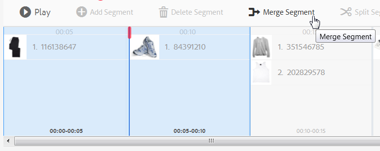

# Vídeos interactivos{#interactive-videos}

Puede crear fácilmente vídeos interactivos (también conocidos como vídeos de ventas) que promuevan la conversión directamente desde el vídeo. La participación del cliente con el vídeo se produce en un panel junto al reproductor de vídeo, donde el servicio relacionado, la información o las miniaturas de productos se desplazan hasta la vista en función de lo que aparece en el vídeo. Los clientes pueden seleccionar la miniatura y vincularse directamente al servicio, añadir el artículo a un carro de compras para su compra inmediata o vincularse a una página web para obtener más información.

Cuando termina el vídeo, se muestra un resumen visual de todas las ofertas para impulsar una llamada a la acción. Los clientes tienen otra oportunidad de seleccionar el artículo que desean. Las experiencias procesables y específicas como estas aumentan la participación y las conversiones de los clientes.

Vea también [imágenes interactivas](/help/assets/dynamic-media/interactive-images.md).

## Vídeo interactivo en acción {#interactive-video-in-action}

Para ver un vídeo interactivo y de ventas en acción, selecciona [Demostraciones en directo](https://landing.adobe.com/en/na/dynamic-media/ctir-2755/live-demos.html), desplázate hasta el encabezado de **[!UICONTROL Medios de ventas]** de la página y, a continuación, selecciona el vídeo de ventas para comenzar la reproducción.

* Durante la reproducción, a medida que los productos se utilizan en el vídeo, el producto idéntico aparece a la derecha como una imagen en miniatura.

* Para pausar el vídeo y abrir la vista rápida del producto, seleccione la miniatura. Por ejemplo, seleccione la imagen en miniatura de KitchenAid del vídeo para ver una rotación de 360° de la mesa de mezclas o aumente para ver los detalles de la mesa de mezclas.

Ver también [Usar vídeo interactivo con Dynamic Media](https://experienceleague.adobe.com/docs/experience-manager-learn/assets/dynamic-media/dynamic-media-interactive-video-feature-video-use.html?lang=es#dynamic-media)

<!-- 

There was a link here that showed the video frame of an interactive video and when the reader selected the frame the video would play https://experienceleague.adobe.com/tools/dynamic-media-demo/shoppable-video/AXIS/index.html?lang=es. This must now call a new interactive video

-->

<!-- 

[A frame from an interactive, shoppable video](assets/chlimage_1-126.png) *A video frame capture from an interactive, shoppable video.*

-->

>[!NOTE]
>
>Si crea un vídeo interactivo para iniciar una página web cuando un usuario selecciona una imagen en miniatura, algunos dispositivos bloquean la apertura de la página web emergente. En estos casos, cambie la configuración del bloqueador de ventanas emergentes en el dispositivo. Por ejemplo, en un Apple iPhone 6, ve a **[!UICONTROL Configuración]** > **[!UICONTROL Safari]** > **[!UICONTROL Bloquear elementos emergentes]** y luego desliza el control a **[!UICONTROL Desactivado]**. Ahora, cuando reproduzca un vídeo interactivo y seleccione una miniatura, se le preguntará si desea abrir la ventana emergente. Si acepta, se abrirá la página web.

### Vea cómo se crean los vídeos interactivos {#watch-how-interactive-videos-are-created}

Vea un tutorial sobre [cómo se crean los vídeos interactivos](https://s7d5.scene7.com/s7viewers/html5/VideoViewer.html?videoserverurl=https://s7d5.scene7.com/is/content/&amp;emailurl=https://s7d5.scene7.com/s7/emailFriend&amp;serverUrl=https://s7d5.scene7.com/is/image/&amp;config=Scene7SharedAssets/Universal_HTML5_Video_social&amp;contenturl=https://s7d5.scene7.com/skins/&amp;asset=S7tutorials/InteractiveVideo)&#x200B;(7 minutos y 30 segundos).
(Aunque el tutorial de vídeo está marcado con Assets on Demand, los principios y pasos siguen aplicándose a Vídeo interactivo en Adobe Experience Manager Assets).

### Seminario web de éxito del cliente de Adobe {#adobe-customer-success-webinar}

El seminario web [Uso de vídeo interactivo, uso compartido de vínculos y uso compartido de YouTube en Experience Manager Assets](https://adobecustomersuccess.adobeconnect.com/p1yxzdo4aec/) te enseña a usar vídeo interactivo y otras funciones para vincular eventos impulsados por conversiones al contenido de marketing de vídeo.

## Inicio rápido: vídeos interactivos {#quick-start-interactive-videos}

La siguiente descripción paso a paso del flujo de trabajo se ha diseñado para ayudarle a ponerse en marcha rápidamente con los vídeos interactivos de Dynamic Media.

Busque el encabezado **Ejemplo** dentro de algunas de las tareas de inicio rápido. Contiene un breve tutorial basado en esta [página web de demostración de inicio que *aún no* tiene interactividad agregada](https://experienceleague.adobe.com/tools/dynamic-media-demo/shoppable-video/john-lewis/landing-0.html?lang=es).

Los **ejemplos** sirven para ilustrar los pasos que se siguen para integrar vídeos interactivos en su propio sitio web.

Cuando termine el tutorial en la última sección Ejemplo, [su página web de demostración final con el vídeo interactivo completamente integrado aparecerá de esta manera](https://experienceleague.adobe.com/tools/dynamic-media-demo/shoppable-video/john-lewis/landing-3.html?lang=es).

Pasos del vídeo interactivo:

1. **(Opcional) Identifique las variables de Quickview** - Comience identificando las variables dinámicas utilizadas por la implementación de Quickview existente. Las variables se utilizan para asignar miniaturas de producto a la vista rápida de producto correspondiente al crear el vídeo interactivo. Consulte [(Opcional) Identificación de variables de vista rápida ](#optional-identifying-quickview-variables).
   **Este paso solo es necesario si se cumplen todas las condiciones siguientes:**
   * Desea añadir interactividad al vídeo activando en Vistas rápidas.
   * Su implementación de Experience Manager *no* usa un marco de integración de comercio electrónico para extraer datos de productos a Experience Manager desde cualquier solución de comercio electrónico, como IBM® WebSphere® Commerce, Elastic Path, SAP Hybris o Intershop.

1. **(opcional) crear un ajuste preestablecido de visualizador de vídeo interactivo**: personalice el aspecto y el comportamiento de varios componentes que conforman el reproductor, como la selección manual de vídeo y las miniaturas interactivas.
No es necesario crear su propio ajuste preestablecido de visualizador de vídeo interactivo si desea utilizar en su lugar los ajustes preestablecidos de visualizador de vídeo interactivo `Shoppable_Video_Light` o `Shoppable_Video_Dark` predeterminados.
Consulte [Crear un ajuste preestablecido de visor](/help/assets/dynamic-media/managing-viewer-presets.md#creating-a-new-viewer-preset) (opcional) y [Consideraciones especiales para crear un ajuste preestablecido de visor interactivo](/help/assets/dynamic-media/managing-viewer-presets.md#special-considerations-for-creating-an-interactive-viewer-preset).

1. **Cargar un vídeo y sus recursos de imagen asociados**: cargue un vídeo y las imágenes asociadas que desee hacer interactivas.
Ver [Cargar un vídeo y sus recursos de miniaturas asociados](#uploading-a-video-and-its-associated-thumbnail-assets).

   >[!NOTE]
   >
   >El formato de vídeo MXF aún no se admite para su uso con vídeos interactivos en Dynamic Media.

1. **Agregar interactividad al vídeo** - Agregue uno o más segmentos de tiempo al vídeo. A continuación, asocie miniaturas de imágenes dentro de esos segmentos de tiempo. Asigne cada miniatura de imagen a una acción, como un hipervínculo, una vista rápida o un fragmento de experiencia.
(El método de vinculación basado en URL no es posible si el contenido interactivo tiene vínculos con direcciones URL relativas, especialmente vínculos a páginas de Experience Manager Sites).
Para terminar, publique los recursos de vídeo interactivo. La publicación crea el código incrustado o la dirección URL que finalmente copia y aplica a la página de aterrizaje del sitio web. Ver [Agregar interactividad al vídeo](#adding-interactivity-to-your-video).
Ver [Publicar Assets](/help/assets/dynamic-media/publishing-dynamicmedia-assets.md).

1. **Agregue un vídeo interactivo a su sitio web o a su sitio web en Experience Manager**. Si utiliza Experience Manager Sites, comercio electrónico o ambos, agregue el vídeo interactivo a una página web en Experience Manager. Arrastre el componente Medios interactivos a la página. Consulte [Agregar Dynamic Media Assets a las páginas](/help/assets/dynamic-media/adding-dynamic-media-assets-to-pages.md).
Utilice el código incrustado o la URL para integrar el vídeo interactivo con las experiencias del sitio web. Ver [Integrar un vídeo interactivo con el sitio web](#integrating-an-interactive-video-with-your-website).
Si utiliza un WCM (Administrador de contenido web) de terceros, debe integrar el nuevo vídeo interactivo con la implementación de vista rápida existente que se utiliza en el sitio web. Ver [Integrar un vídeo interactivo con una vista rápida existente](#integrating-an-interactive-video-with-an-existing-quickview).
   [Agregar Dynamic Media Assets a las páginas](/help/assets/dynamic-media/adding-dynamic-media-assets-to-pages.md)

## (Opcional) Identificar variables de Quickview {#optional-identifying-quickview-variables}

>[!NOTE]
>
>Esta tarea solo es necesaria si se cumplen los siguientes criterios:
>
>* Desea añadir interactividad al vídeo activando en Vistas rápidas.
>* Su implementación de Experience Manager *no* usa un marco de integración de comercio electrónico para extraer datos de productos a Experience Manager desde cualquier solución de comercio electrónico, como IBM® WebSphere® Commerce, Elastic Path, SAP Hybris o Intershop. <!-- See [eCommerce concepts in Experience Manager Assets](/help/sites-administering/concepts.md).-->
>
>Si la implementación de Experience Manager utiliza el comercio electrónico, puede omitir esta tarea y continuar con la siguiente.

Comience identificando las variables dinámicas utilizadas por la implementación de Quickview existente para poder asignar miniaturas de productos a la vista rápida de productos correspondiente durante el proceso de creación de vídeo interactivo.

Al añadir segmentos de tiempo a un vídeo, asigna un SKU (código de referencia) y cualquier variable adicional a cada miniatura que añade a un segmento. Estas variables se utilizan más adelante para mostrar el producto Quickview correcto.

Es importante identificar correctamente qué variables son necesarias para almacenar en déclencheur de forma exclusiva una vista rápida de producto.

A veces basta con consultar con los especialistas de TI responsables de la implementación de Quickview existente. Es probable que conozcan el conjunto mínimo de datos que identifica a Quickview en el sistema. Sin embargo, es posible simplemente analizar el comportamiento existente del código front-end.

La mayoría de las implementaciones de Quickview utilizan el siguiente paradigma:

* El usuario activa un elemento de interfaz de usuario en el sitio web. Por ejemplo, seleccionar un botón &quot;Vista rápida&quot;.
* El sitio web envía una solicitud Ajax al back-end para cargar los datos o el contenido de Quickview, si es necesario.
* Los datos de vista rápida se traducen al contenido como preparación para su representación en la página web.
* Finalmente, el código front-end procesa visualmente dicho contenido en la pantalla.

Por lo tanto, el método consiste en visitar diferentes áreas del sitio web existente donde se implementa Quickview. A continuación, almacene en déclencheur la vista rápida y adquiera la URL de Ajax que envía la página web para cargar los datos o el contenido de la vista rápida.

Normalmente no es necesario utilizar herramientas de depuración especializadas. Los navegadores web modernos cuentan con inspectores web que hacen un trabajo adecuado. A continuación se muestran algunos ejemplos de exploradores web que incluyen inspectores web:

* Para ver todas las solicitudes HTTP salientes en Google Chrome, presione **F12** (Windows®) o **Comando+Opciones+I** (Mac) para abrir el panel Herramientas para desarrolladores y, a continuación, seleccione la ficha **Red**.

* En Firefox, puede activar el complemento Firebug pulsando **F12** (Windows®) o **Comando+Opción+I** (Mac) y usar su pestaña **[!UICONTROL Net]**, o bien puede usar la herramienta Inspector integrada y su pestaña Red.

* En Internet Explorer, active la herramienta de depuración presionando **F12**.

Cuando la monitorización de red está activada en el navegador, almacene en déclencheur la vista rápida en la página.

Ahora busque la URL de Ajax de vista rápida en el registro de red y copie la URL grabada para un análisis futuro. Normalmente, cuando se almacena en déclencheur la vista rápida, hay numerosas solicitudes que se envían al servidor. Normalmente, la URL de Ajax de vista rápida es una de las primeras en la lista. Tiene una parte de cadena de consulta o una ruta de acceso compleja y su tipo MIME de respuesta es `text/html`, `text/xml` o `text/javascript`.

Durante este proceso, es importante visitar diferentes áreas del sitio web, con diferentes categorías y tipos de productos. El motivo es que las direcciones URL de Quickview tienen partes que son comunes para una categoría de sitio web determinada, pero que solo cambian si visita una zona diferente del sitio web.

En el caso más simple, la única parte de la variable en la URL de vista rápida es el SKU del producto. En este caso, el valor SKU del producto es el único fragmento de datos necesario para añadir miniaturas a un segmento de tiempo en el vídeo interactivo en Experience Manager.

Sin embargo, en casos complejos, la dirección URL de vista rápida tiene diferentes elementos variables además del SKU del producto, como el ID de categoría y el código de color. En estos casos, cada uno de estos elementos se convierte en una variable independiente en la definición de datos de miniaturas en Experience Manager.

Considere los siguientes ejemplos de direcciones URL de vista rápida y las variables de miniaturas resultantes:

<table>
  <tbody>
  <tr>
    <td><p>SKU único, encontrado en la cadena de consulta.</p> </td>
    <td><p>Las direcciones URL de vista rápida registradas incluyen lo siguiente:</p>
    <ul>
      <li><p><code>https://server/json?productId=866558&amp;source=100</code></p> </li>
      <li><p><code>https://server/json?productId=1196184&amp;source=100</code></p> </li>
      <li><p><code>https://server/json?productId=1081492&amp;source=100</code></p> </li>
      <li><p><code>https://server/json?productId=1898294&amp;source=100</code></p> </li>
    </ul> <p>La única parte de la variable en la dirección URL es el valor del parámetro de cadena de consulta <code>productId=</code> y es claramente un valor SKU. Por lo tanto, las miniaturas solo necesitan campos SKU rellenados con valores como <strong><code>866558</code></strong>, <strong><code>1196184</code></strong>, <strong><code>1081492</code></strong>, <strong><code>1898294</code></strong>.</p> </td>
  </tr>
  <tr>
    <td><p>SKU único, encontrado en la ruta URL.</p> </td>
    <td><p>Las direcciones URL de vista rápida registradas incluyen lo siguiente:</p>
    <ul>
      <li><p><code>https://server/product/6422350843</code></p> </li>
      <li><p><code>https://server/product/1607745002</code></p> </li>
      <li><p><code>https://server/product/0086724882</code></p> </li>
    </ul> <p>La parte de la variable se encuentra en la última parte de la ruta y se convierte en el valor SKU de las miniaturas de Experience Manager: <strong><code>6422350843</code></strong>, <strong><code>1607745002</code></strong>, <strong><code>0086724882</code></strong>.</p> </td>
  </tr>
  <tr>
    <td><p>SKU e ID de categoría en la cadena de consulta.</p> </td>
    <td><p>Las direcciones URL de vista rápida registradas incluyen lo siguiente:</p>
    <ul>
      <li><p><code>https://server/quickView/product/?category=1100004&amp;prodId=305466</code></p> </li>
      <li><p><code>https://server/quickView/product/?category=1100004&amp;prodId=310181</code></p> </li>
      <li><p><code>https://server/quickView/product/?category=1740148&amp;prodId=308706</code></p> </li>
    </ul> <p>En este caso, la dirección URL consta de dos partes diferentes. El SKU se almacena en el parámetro <code>prodId</code> y el ID de categoría en el parámetro <code>category=</code>.</p> <p>Como tal, las definiciones de miniaturas son pares. Es decir, un valor SKU y una variable adicional llamada <code>categoryId</code>. Los pares resultantes son los siguientes:</p>
    <ul>
      <li>El SKU es <code>305466</code> y <code>categoryId</code> es <code>1100004</code></li>
      <li>El SKU es <code>310181</code> y <code>categoryId</code> es <code>1100004</code></li>
      <li>El SKU es <code>308706</code> y <code>categoryId</code> es <code>1740148</code></li>
    </ul> <p> </p> </td>
  </tr>
  </tbody>
</table>

**Ejemplo**

Cuando se aplica el método anterior al sitio web de ejemplo, tiene una página web con varias miniaturas de productos, cada una con un botón &quot;VER MÁS&quot;:

[https://experienceleague.adobe.com/tools/dynamic-media-demo/shoppable-video/john-lewis/landing-0.html?lang=es](https://experienceleague.adobe.com/tools/dynamic-media-demo/shoppable-video/john-lewis/landing-0.html?lang=es)

Después de activar todas las vistas rápidas de productos disponibles en la página, obtiene la siguiente lista de solicitudes de vista rápida realizadas al back-end:

* datafeed/candles-233396346.json
* datafeed/candles-233978050.json
* datafeed/candles-234024346.json
* datafeed/candles-234024356.json
* datafeed/candles-234024359.json
* datafeed/cushions-233939848.json
* datafeed/cushions-234019477.json
* datafeed/cushions-234019483.json
* datafeed/furniture-231747479.json
* datafeed/furniture-232625621.json
* datafeed/furniture-232625626.json
* datafeed/furniture-233939810.json
* datafeed/furniture-233939825.json
* datafeed/furniture-233939828.json
* datafeed/furniture-233939853.json
* datafeed/furniture-233940334.json
* datafeed/glassware-000064007.json
* datafeed/glassware-230722193.json
* datafeed/glassware-233916550.json
* datafeed/glassware-233916597.json

Si se observan las llamadas al servidor, la información específica del producto solo está presente en la ruta de solicitud. También verá que la cadena de consulta no se utiliza en absoluto y que hay dos tipos distintos de fragmentos de datos implicados:

* El primer tipo son velas, cojines, muebles y cristalería. Puede llamar a esta &quot;categoría de producto&quot;.
* El segundo tipo es el código de producto, como 233916597. Puede suponer que es el &quot;SKU del producto&quot;.

Dada esta información, toda la URL de vista rápida tiene el siguiente patrón:

`/datafeed/$categoryId$-$SKU$.json`

Basándose en este análisis, puede concluir que puede utilizar las dos variables siguientes para las miniaturas: `categoryId` y `SKU`.

Ya está listo para cargar un vídeo y sus recursos de miniaturas asociados.

## (Opcional) Cree un ajuste preestablecido de visualizador de vídeo interactivo {#optional-creating-an-interactive-video-viewer-preset}

Puede omitir esta tarea y continuar con la siguiente si desea utilizar cualquiera de los tipos de ajustes preestablecidos predeterminados listos para usar del visualizador de vídeo interactivo `Shoppable_Video_dark` o `Shoppable_Video_light`.

Cuando se selecciona una miniatura en el entorno de creación, aparece una vista previa del cuadro de diálogo Vista rápida.


Si lo desea, puede crear su propio ajuste preestablecido de visualizador de vídeo interactivo. Puede determinar, entre otras cosas, el estilo del reproductor de vídeo, las miniaturas interactivas y la vista de cuadrícula de miniaturas que aparece al final del vídeo.

Un ajuste preestablecido de visualizador de vídeo interactivo procesa correctamente el vídeo y todos los segmentos de cronología que haya añadido. También utiliza una vista rápida predeterminada de ejemplo al seleccionar una miniatura de producto en el modo de vista previa, para poder probar su interactividad antes de publicar.

Después de guardar el ajuste preestablecido de visualizador, su estado se establece automáticamente en **On &#x200B;** en la página Ajustes preestablecidos del visualizador. Este estado significa que está visible en el componente Dynamic Media y siempre que se obtiene una vista previa de un vídeo con él. Asegúrese de publicar también manualmente el nuevo ajuste preestablecido de visualizador.

Consulte [Crear un ajuste preestablecido de visualizador](/help/assets/dynamic-media/managing-viewer-presets.md#creating-a-new-viewer-preset) para crear su propio ajuste preestablecido de visualizador de vídeo interactivo.

## Cargar un vídeo y sus recursos de miniaturas asociados {#uploading-a-video-and-its-associated-thumbnail-assets}

Si ya has cargado tus recursos de vídeo y miniaturas, continúa con [Agregar interactividad al vídeo](#adding-interactivity-to-your-video).

>[!NOTE]
>
>El formato de vídeo MXF aún no se admite para su uso con vídeos interactivos en Dynamic Media.

Si has subido vídeos o imágenes incorrectos, o si deseas eliminar vídeos o imágenes cargados que ya no necesites, consulta [Eliminar Assets](/help/assets/manage-digital-assets.md#delete-assets).

Para cargar un vídeo y sus recursos de miniaturas asociados:

1. Cargue el vídeo y los recursos de miniaturas asociados a la carpeta o carpetas que desee.

   Consulte [Cargar recursos](/help/assets/manage-digital-assets.md).
Consulte [Cargar recursos mediante la programación de trabajos de FTP](/help/assets/manage-digital-assets.md).

   Ahora añada interactividad al vídeo.

## Añada interactividad al vídeo {#adding-interactivity-to-your-video}

Los segmentos de cronología se añaden a un vídeo mediante el editor visual local de la página Crear vídeo interactivo.

Después de agregar segmentos de cronología, agregue imágenes en miniatura dentro de cada segmento. Por cada miniatura que agregue, le aplicará una acción. Por ejemplo, puede aplicar una vista rápida a la miniatura o puede asignarle un hipervínculo o un Fragmento de experiencia.

Ver [Fragmentos de experiencias](/help/sites-cloud/authoring/fragments/content-fragments.md).

>[!NOTE]
>
>Las herramientas de uso compartido de medios sociales de un vídeo interactivo no son compatibles cuando se incrusta el visualizador en un fragmento de experiencia. En su lugar, puede utilizar o crear ajustes preestablecidos de visualizador que no tengan herramientas de uso compartido de medios sociales. Estos ajustes preestablecidos de visualizador le permiten incrustarlo correctamente en los fragmentos de experiencias.

>[!NOTE]
>
>El método de vinculación basado en URL no es posible si el contenido interactivo tiene vínculos con direcciones URL relativas, especialmente vínculos a páginas de Experience Manager Sites.

Las opciones Deshacer y Rehacer, cerca de la esquina superior derecha de la página, son compatibles durante la sesión de creación y edición actual.

Después de guardar el vídeo interactivo, este se abre inmediatamente en Vista previa. Desde allí, puede seleccionar un ajuste preestablecido de visualizador de vídeo interactivo y reproducir el vídeo para ver una representación aproximada de cómo aparece a los clientes.

**Para agregar interactividad al vídeo:**

1. En la vista de Assets, vaya al vídeo que ha cargado y que desea hacer interactivo.
1. Realice una de las siguientes acciones:

   * Pase el ratón sobre la imagen y, a continuación, seleccione **[!UICONTROL Seleccionar]** (icono de marca de verificación). En la barra de herramientas, seleccione **[!UICONTROL Editar]**.

   * Pase el ratón sobre la imagen y luego seleccione **[!UICONTROL Más acciones]** (icono de tres puntos) **[!UICONTROL > Editar]**.

   * Para abrirla en la página Vista de detalles, seleccione la imagen. En la barra de herramientas, seleccione **[!UICONTROL Editar]**.

1. En la página Crear vídeo interactivo, realice una de las siguientes acciones:

   * Para empezar a reproducir el vídeo, selecciona el botón **[!UICONTROL Reproducir]**. Cuando un producto, servicio o detalle en particular que desee resaltar aparezca en la vista, seleccione **[!UICONTROL Agregar segmento]** en la barra de herramientas. Repita el proceso hasta que haya llegado al final del vídeo.

     Por cada segmento de tiempo que agregue, puede asignarle una o más imágenes en miniatura. A continuación, puede vincular esas miniaturas a las páginas de producto de Vista rápida para que los clientes compren o a las páginas web para obtener más información.

   * Para empezar a reproducir el vídeo, selecciona el botón **[!UICONTROL Reproducir]**. Cuando un producto, servicio o detalle en particular que desee resaltar aparezca a la vista, seleccione **[!UICONTROL Pausa]**. Seleccione **[!UICONTROL Agregar segmento]**.

     Continúe reproduciendo y pausando el vídeo en los puntos de la cronología en los que desee añadir un segmento hasta que llegue al final del vídeo.

1. (Opcional) Arrastre la barra en el **[!UICONTROL Regulador de la escala de tiempo]** a la izquierda para acercar o a la derecha para alejar. Esta acción le permite controlar cuántos detalles ve de los segmentos que ha agregado.

   

   Según la duración del vídeo, la Duración del segmento tiene los valores predeterminados siguientes:

   <table>
      <tbody>
        <tr>
        <td><strong>Si la duración del vídeo es...</strong></td>
        <td><strong>El valor predeterminado de Duración del segmento es...</strong></td>
        </tr>
        <tr>
        <td>3 minutos o más</td>
        <td>60 segundos</td>
        </tr>
        <tr>
        <td>2-3 minutos</td>
        <td>30 segundos</td>
        </tr>
        <tr>
        <td>1-2 minutos</td>
        <td>20 segundos<br /> </td>
        </tr>
        <tr>
        <td>30 a 60 segundos</td>
        <td>10 segundos</td>
        </tr>
        <tr>
        <td>30 segundos o menos</td>
        <td>5 segundos</td>
        </tr>
      </tbody>
    </table>

   La cronología del vídeo utiliza tantos bienes raíces de pantalla como lo que está disponible para ella. De este modo, al cambiar el tamaño del explorador, los segmentos que ha añadido mantienen su anchura correcta.

   Para ilustrar, las tres capturas de pantalla siguientes utilizan el mismo vídeo. Observe que la anchura de cada segmento cambia según la configuración Escala de cronología.

   

   Captura de pantalla A

   La captura de pantalla A anterior muestra la vista predeterminada de un vídeo de producto de 29 segundos. La Escala de cronología se establece en 5 segundos como valor predeterminado.

   

   Captura de pantalla B

   En la captura de pantalla B anterior, el deslizador Escala de cronología se arrastró del valor predeterminado de 5 a 3 segundos. Tenga en cuenta que las marcas de tiempo de escala de tiempo individuales ahora están configuradas en intervalos de 3 segundos.

   

   Captura de pantalla C

   En la captura de pantalla C anterior, la configuración Escala de cronología se movió a 8 segundos. Observe cómo se han reducido los segmentos que contienen miniaturas de productos. Alejar de esta manera es útil si tiene un vídeo largo y desea poder ver una descripción general de más segmentos que normalmente se ajustarían al ancho de la página.

1. (Opcional) Realice una de las siguientes acciones:

   * Para ajustar la hora de inicio y la hora de finalización de un segmento.

     Seleccione un segmento y, a continuación, arrastre el óvalo azul inicial o final para ajustar la hora de inicio o finalización, respectivamente. El fotograma de vídeo mostrado se desplaza al momento apropiado del vídeo, según los ajustes que haya realizado. El movimiento del segmento de la cronología está restringido en función de cualquier segmento adyacente de la cronología. El tiempo mínimo permitido para el segmento es de un segundo.

     Utilice los siguientes métodos abreviados de navegación para comprobar y ajustar rápidamente los segmentos de vídeo:

      * Para buscar el vídeo directamente al principio de ese segmento, seleccione el óvalo azul inicial.
      * Para buscar el vídeo directamente al final de ese segmento, seleccione el óvalo azul final.
      * Para devolver la reproducción de vídeo al principio de ese segmento, seleccione todo el segmento.

   

   Reposición del final de un segmento de cronología

   * Para eliminar un segmento

     Seleccione el último segmento de la cronología y, a continuación, en la barra de herramientas, seleccione **[!UICONTROL Eliminar segmento]**. Si se seleccionan dos o más segmentos, la función Eliminar segmento estará desactivada.

     Solo puede eliminar el último segmento. Por ejemplo, si desea eliminar todos los segmentos de la cronología, siempre debe seleccionar el último y, a continuación, seleccionar **[!UICONTROL Eliminar segmento]**.

1. Seleccione un segmento de tiempo al que desee asociar una o varias imágenes en miniatura.
1. A la derecha del vídeo, seleccione la ficha **[!UICONTROL Contenido]**.
1. En la pestaña Contenido, seleccione **[!UICONTROL Seleccionar Assets]** y, a continuación, examine y seleccione todos los recursos de imagen que desee usar con el vídeo. Los recursos seleccionados se agregan al panel Selector de recursos en la pestaña Contenido.

1. En el selector de recursos que se encuentra debajo de la pestaña Contenido, realice una de las siguientes acciones:

   <table>
      <tbody>
        <tr>
        <td>Para asociar una miniatura al segmento de cronología seleccionado</td>
        <td><p>Seleccione la imagen en el panel selector de recursos de la derecha.</p> <p>Puede agregar tantas miniaturas como desee a un segmento de cronología. Para cada imagen que seleccione, aparecerá una marca de verificación sobre la imagen en el selector de recursos.</p> </td>
        </tr>
        <tr>
        <td>Para quitar una miniatura del segmento de escala de tiempo seleccionado</td>
        <td><p>Realice una de las siguientes acciones:</p>
          <ul>
          <li>En el panel del selector de recursos, seleccione una imagen con una marca de verificación para anular su selección. El recurso de imagen se ha eliminado del segmento de escala de tiempo.<br /> </li>
          <li>En el segmento de cronología seleccionado, seleccione una imagen y, en la barra de herramientas, seleccione <strong>Eliminar producto</strong>.</li>
          </ul> </td>
        </tr>
      </tbody>
    </table>

   

   Al seleccionar una imagen en el panel selector de recursos, se agrega al segmento de cronología seleccionado.

1. Seleccione una sola imagen en miniatura en uno de los segmentos de la cronología y, a continuación, seleccione la ficha **[!UICONTROL Acciones]**.
1. Realice una de las siguientes acciones:
   <table> 
    <tbody> 
      <tr> 
      <td>Para asociar la imagen en miniatura seleccionada con una vista rápida</td> 
      <td><p>En Tipo de acción, seleccione <strong>Quickview</strong>.</p> <p>Si es cliente de Experience Manager Sites y de comercio electrónico:</p> 
       <ul> 
       <li>Tenga en cuenta que el campo de texto Valor de SKU está rellenado previamente con el SKU del producto seleccionado (unidad de stock). El SKU es un identificador único para cada producto o servicio que ofrece. Este campo se rellena automáticamente cuando la imagen está asociada a un producto en Experience Manager Commerce.</li> 
       <li>Si el SKU rellenado previamente es incorrecto, seleccione el icono del selector de productos (lupa) para abrir la página Seleccionar producto. Seleccione el producto que desea utilizar y, a continuación, seleccione la marca de verificación en la esquina superior derecha de la página. Volverá al editor de vídeo interactivo.</li> 
       </ul> <p> Si usted es <em>no</em> cliente de Experience Manager Sites o de comercio electrónico</p> 
       <ul> 
       <li>Consulte <a href="/help/assets/dynamic-media/carousel-banners.md#identifying-hotspot-and-image-map-variables">Identificación de variables de punto interactivo</a>. Estas variables deben definirse.</li> 
       <li>De forma predeterminada, este SKU utiliza el nombre de archivo del recurso de imagen sin la extensión. Si sigue una convención de nombres estándar para los archivos basada en el SKU, este campo no suele requerir ediciones adicionales. </li> 
       <li>De lo contrario, edite el valor predeterminado e introduzca el valor SKU correcto. En el campo de texto Valor de SKU, escriba la SKU del producto (unidad de stock), que es un identificador único para cada producto o servicio distinto que ofrece. El valor de SKU introducido rellena automáticamente la parte variable de la plantilla de vista rápida para que el sistema sepa que debe asociar la imagen seleccionada con la vista rápida de una SKU en particular.</li> 
       </ul> <p>(Opcional) Si hay otras variables dentro de la vista rápida que debe usar para identificar aún más un producto, seleccione <strong>Agregar variable genérica</strong>. En el campo de texto, especifique una variable adicional. Por ejemplo, <code>category=Womens</code> es una variable agregada.</p> <p> </p> </td> 
      </tr> 
      <tr> 
      <td>Para asociar la miniatura seleccionada con un hipervínculo</td> 
      <td><p>En Tipo de acción, seleccione <strong>Hipervínculo</strong> y, a continuación, siga uno de estos procedimientos:</p> 
       <ul> 
       <li>Si es cliente de Experience Manager Sites, seleccione el icono Selector de sitio (carpeta) para navegar a una página web. El método de vinculación basado en URL no es posible si el contenido interactivo tiene vínculos con direcciones URL relativas, especialmente vínculos a páginas de Experience Manager Sites.</li> 
       <li>Si es cliente independiente de Dynamic Media, en el campo de texto HREF, especifique la ruta de URL completa a una página web vinculada.</li> 
       </ul> <p>Asegúrese de especificar si desea abrir el vínculo en una nueva pestaña del explorador o en la pestaña actual.</p> </td> 
      </tr> 
      <tr> 
      <td>Para asociar la imagen en miniatura seleccionada con un fragmento de experiencia</td> 
      <td><p>En Tipo de acción, seleccione <strong>Fragmento de experiencia</strong> y, a continuación, haga lo siguiente:<p> 
       <ul> 
       <li>Si es cliente de Experience Manager Sites, seleccione el icono Buscar (lupa) para abrir la página Fragmento de experiencia. Seleccione el fragmento de experiencia que desee usar y, a continuación, seleccione <strong>Para volver al panel Acciones de la página anterior, seleccione </strong>en la esquina superior derecha de la página.<br /> Ver <a href="/help/sites-cloud/authoring/fragments/content-fragments.md">Fragmentos de experiencias</a>.</li> 
      </ul> 
       <ul> 
       <li>Especifique la anchura y la altura del fragmento de experiencia tal como aparece en el vídeo.</li>
       </ul><strong>Nota</strong>: Las herramientas para compartir en medios sociales de Vídeo interactivo no se admiten cuando se incrusta el visor en un fragmento de experiencia. En su lugar, puede utilizar o crear ajustes preestablecidos de visualizador que no tengan herramientas de uso compartido de medios sociales. Estos ajustes preestablecidos de visualizador le permiten incrustarlo correctamente en los fragmentos de experiencias.</p></tr>&lt; 
      <tr> 
      <td>Para editar una acción ya asignada a una imagen en miniatura</td> 
      <td>En un segmento de la cronología, seleccione una imagen en miniatura que tenga un vínculo de cadena a la derecha de su etiqueta de texto. El vínculo de cadena indica que se le ha asignado una acción. Para realizar los cambios, seleccione la ficha <strong>Acciones</strong>.</td> 
      </tr> 
      <tr> 
      <td>Para cambiar la etiqueta de texto de una imagen en miniatura</td> 
      <td><p>De forma predeterminada, la etiqueta de texto utiliza el campo de metadatos <code>Title</code> de la imagen en miniatura. Si <code>Title</code> no está presente, se utiliza el nombre de archivo de la imagen en miniatura, pero sin la extensión.</p> <p>Para cambiar la etiqueta de texto de una imagen en miniatura, en la pestaña <strong>Acciones </strong>, directamente debajo del recurso de imagen que se muestra, escriba el texto deseado. Consulte la siguiente imagen.</p> <p>La nueva etiqueta de texto solo la utiliza el reproductor de vídeo y el texto en miniatura que se muestra en el segmento de cronología. El cambio de etiqueta no afecta al campo de metadatos Título de la imagen en miniatura ni a su nombre de archivo.</p> </td> 
      </tr> 
      <tr> 
      <td>Para revertir un cambio</td> 
      <td>Cerca de la esquina superior derecha de la página, seleccione <strong>Deshacer</strong> o <strong>Rehacer</strong>.</td> 
      </tr> 
    </tbody> 
   </table>

   

   Se agrega una nueva etiqueta de texto a la imagen en miniatura.

1. Realice una de las siguientes acciones:

   * Repita los pasos 6-11 para añadir más imágenes en miniatura a los segmentos de la cronología del vídeo.
   * Continúe con el paso opcional 13.

1. (Opcional) Realice una de las siguientes acciones:

   * **[!UICONTROL Combinar segmento]**: puede combinar dos segmentos adyacentes (con o sin miniaturas de productos asignadas) en un segmento.

     En la cronología, seleccione dos o más segmentos contiguos que desee combinar en uno. No hay puntos de control de arrastre ovalados azules en los dos segmentos seleccionados en la imagen siguiente.

     Seleccione **[!UICONTROL Combinar segmento]** en la barra de herramientas.

   

   Combinación de dos segmentos de cinco segundos seleccionados en un segmento de diez segundos.

   * **[!UICONTROL Dividir segmento]**: puede dividir un solo segmento en dos segmentos a la vez. Si ya hay miniaturas de productos asignadas al segmento, las miniaturas se combinan en el segmento izquierdo.

     En la cronología, seleccione el segmento que desee dividir por la mitad y, a continuación, seleccione **[!UICONTROL Dividir segmento]** en la barra de herramientas.

     Si se seleccionan dos o más segmentos, se deshabilita la característica **[!UICONTROL Dividir segmento]**.

   

   Dividir un segmento seleccionado de diez segundos en dos segmentos de cinco segundos cada uno.

1. Cerca de la esquina superior derecha de la página **[!UICONTROL Crear vídeo interactivo]**, se muestra el nombre del ajuste preestablecido de visor seleccionado que se usa con el vídeo. Para seleccionar un ajuste preestablecido de visor diferente, seleccione el nombre.

   Por ejemplo, el ajuste preestablecido de visualizador `Shoppable_Video_light` le permite reproducir el vídeo con un área de visualización blanca junto al vídeo. El área de visualización es donde se muestran las imágenes en miniatura seleccionables durante la reproducción. El ajuste preestablecido de visualizador `Shoppable_Video_dark` le permite reproducir el vídeo con un área de visualización negra junto al vídeo.

   Si ha creado su propio ajuste preestablecido de visualizador de vídeo interactivo, puede verlo en la lista de ajustes preestablecidos entre los que puede elegir.

   Cuando haya terminado, seleccione **[!UICONTROL Guardar]**.

   >[!NOTE]
   >
   >Al guardar el vídeo interactivo, se guarda automáticamente un archivo asociado de `.vtt`. El archivo `.vtt` se guardó en la carpeta `_VTT` en la raíz de **[!UICONTROL Assets]**. El archivo y la carpeta son necesarios para que el vídeo interactivo se reproduzca correctamente en el sitio web. Como tal, no mueva, edite ni elimine la carpeta `_VTT` ni su contenido.

1. Publique el vídeo interactivo. La publicación crea el código incrustado o la dirección URL que finalmente copia y pega en las experiencias del sitio web.

   Si ha agregado interactividad con vistas rápidas, utilice únicamente el código incrustado; si ha agregado interactividad con páginas web con hipervínculos, también puede utilizar la dirección URL publicada. Sin embargo, tenga en cuenta que el método de vinculación basado en URL no es posible si el contenido interactivo tiene vínculos con direcciones URL relativas, especialmente vínculos a páginas de Experience Manager Sites.

   Consulte [Publicar recursos](publishing-dynamicmedia-assets.md).

   >[!NOTE]
   >
   >Para publicar un vídeo de ventas con vistas rápidas, asegúrese de publicar también cada uno de los recursos de imagen relacionados del vídeo desde su área de comercio, por separado.

   Después de agregar segmentos de cronología y publicar el vídeo interactivo, está listo para agregarlo a la página de aterrizaje del sitio web existente. Ver [Integrar un vídeo interactivo con el sitio web](#integrating-an-interactive-video-with-your-website).

## Publicar recursos de vídeo interactivo {#publishing-interactive-video-assets}

Consulte [Publicar Assets](/help/assets/dynamic-media/publishing-dynamicmedia-assets.md) para obtener más información sobre cómo publicar recursos de vídeo interactivo.

## Integración de un vídeo interactivo con el sitio web {#integrating-an-interactive-video-with-your-website}

Después de cargar un vídeo, añadir segmentos de cronología y publicar el vídeo interactivo, ya puede añadirlo a su sitio web.

Si es cliente de Experience Manager Sites, puede agregar el vídeo interactivo arrastrando el componente Medios interactivos a su página. Consulte [Agregar Dynamic Media Assets a las páginas](/help/assets/dynamic-media/adding-dynamic-media-assets-to-pages.md).

Si es cliente independiente de Experience Manager Assets, puede añadir manualmente el vídeo interactivo a su sitio web como se describe en esta sección.

1. Copie el código incrustado o la URL del vídeo interactivo publicado.
Ver [Incrustar el visor de vídeo o de imágenes en una página web](/help/assets/dynamic-media/embed-code.md).
Si ha agregado interactividad con vistas rápidas, utilice únicamente el código incrustado; si ha agregado interactividad con páginas web con hipervínculos, también puede utilizar la dirección URL publicada. Sin embargo, tenga en cuenta que el método de vinculación basado en URL no es posible si el contenido interactivo tiene vínculos con direcciones URL relativas, especialmente vínculos a páginas de Experience Manager Sites.

1. En el código de la página web de destino, identifique dónde se encuentra el vídeo estático.
1. Elimine el vídeo estático y reemplace el código con el código incrustado o la URL que ha copiado de Experience Manager Assets, tal cual.
El código incrustado copiado se configura para un entorno interactivo, de modo que se ajusta automáticamente al área ocupada anteriormente por el vídeo estático.

>[!NOTE]
>
>En este punto, si ha agregado interactividad con solo páginas web con hipervínculos, habrá terminado.
>
>Sin embargo, si ha agregado interactividad para almacenar en déclencheur una vista rápida, las miniaturas junto al vídeo interactivo son solo para fines de visualización; aún no se han integrado con las vistas rápidas existentes. En tal caso, debe integrar el vídeo interactivo con las vistas rápidas existentes en el sitio web.

**Ejemplo**

Uso del sitio web de demostración como ejemplo:

[https://experienceleague.adobe.com/tools/dynamic-media-demo/shoppable-video/john-lewis/landing-0.html?lang=es](https://experienceleague.adobe.com/tools/dynamic-media-demo/shoppable-video/john-lewis/landing-0.html?lang=es)

Observe que el código incrustado de vídeo es estándar:

```js {.line-numbers}
<style type="text/css">
 #s7video_div.s7videoviewer{
   width:100%;
   height:auto;
 }
</style>

<script type="text/javascript" src="https://demos-pub.assetsadobe.com/etc/dam/viewers/s7viewers/html5/js/VideoViewer.js"></script>
<div id="s7video_div"></div>
<script type="text/javascript">
 var s7videoviewer = new s7viewers.VideoViewer({
  "containerId" : "s7video_div",
  "params" : {
   "serverurl" : "https://adobedemo62-h.assetsadobe.com/is/image",
   "contenturl" : "https://demos-pub.assetsadobe.com/",
   "config" : "/etc/dam/presets/viewer/Video",
   "config2": "/etc/dam/presets/analytics",
   "videoserverurl": "https://gateway-na.assetsadobe.com/DMGateway/public/demoCo",
   "posterimage": "/content/dam/marketing/shoppable-video/john-lewis/shoppable-video-john-lewis-2014.mp4",
   "asset" : "/content/dam/marketing/shoppable-video/john-lewis/shoppable-video-john-lewis-2014.mp4" }
 }).init();
</script>
```

La integración es tan sencilla como eliminar el código de incrustación de vídeo y sustituirlo por el código de incrustación de vídeo interactivo de Experience Manager. Puede ver el resultado en la siguiente dirección URL. Aunque muestra un vídeo interactivo presente en la página, aún no está integrado con las vistas rápidas existentes:

[https://experienceleague.adobe.com/tools/dynamic-media-demo/shoppable-video/john-lewis/landing-1.html?lang=es](https://experienceleague.adobe.com/tools/dynamic-media-demo/shoppable-video/john-lewis/landing-1.html?lang=es)

## Integración de un vídeo interactivo con una vista rápida existente {#integrating-an-interactive-video-with-an-existing-quickview}

>[!NOTE]
>
>Esta tarea solo se aplica si es un cliente independiente de Experience Manager Assets.

El último paso de este proceso es integrar su vídeo interactivo con una implementación de Quickview existente que se utilice en su sitio web. No hay ninguna solución para la integración que funcione para todos los casos. Cada implementación de Quickview es única. Por lo tanto, se necesita un enfoque específico que implique la asistencia de una persona de TI front-end.

La implementación de Quickview existente normalmente representa una cadena de acciones interrelacionadas que se producen en la página web en el siguiente orden:

1. Un usuario almacena en déclencheur un elemento en la interfaz de usuario del sitio web.
1. El código front-end obtiene una URL de vista rápida basada en el elemento de interfaz de usuario activado en el paso 1.
1. El código front-end envía una solicitud AJAX utilizando la dirección URL obtenida en el paso 2.
1. La lógica back-end devuelve los datos de vista rápida o el contenido correspondiente al código front-end.
1. El código front-end carga los datos de vista rápida o el contenido.
1. De forma opcional, el código front-end convierte los datos de vista rápida cargados en una representación de HTML.
1. El código front-end muestra un cuadro de diálogo o panel modal y procesa el contenido de HTML en la pantalla para el usuario.

Estas llamadas no representan llamadas de API públicas independientes a las que la lógica de página web puede llamar desde un paso arbitrario. En su lugar, es una llamada encadenada en la que cada paso siguiente se oculta en la última fase (llamada de retorno) del paso anterior.

Al mismo tiempo que el vídeo interactivo reemplaza el paso 1 y parcialmente el paso 2, cuando un usuario selecciona una miniatura dentro del vídeo interactivo, el visualizador gestiona dicha interacción del usuario. El visor devuelve un evento a la página web que contiene todos los datos en miniatura previamente añadidos a Experience Manager.

En un controlador de eventos de este tipo, el código front-end hace lo siguiente:

* Escucha un evento emitido por el vídeo interactivo.
* Construye una URL de vista rápida basada en los datos de miniaturas.
* Déclencheur el proceso de cargar la vista rápida desde el backend y procesarla en la pantalla para mostrarla.

Además, el visualizador de vídeo interactivo admite el modo de funcionamiento de pantalla completa. El usuario obtiene un déclencheur de las vistas rápidas seleccionando una miniatura sin salir de la pantalla completa. Para lograr esta funcionalidad, modifique el código front-end de modo que el cuadro de diálogo modal de vista rápida esté adjunto al contenedor del visor. No agregue el documento BODY ni ningún otro elemento de página web que no esté disponible cuando el visor esté en modo de pantalla completa. El código que realiza este trabajo escucha una llamada de retorno del visor más que se envía después de que el visor se cargue en la página.

El código incrustado devuelto por Experience Manager ya tiene un controlador de eventos listo para usar. Se comenta como se ve en el siguiente fragmento de código resaltado:

```js {.line-numbers}
<style type="text/css">
 #s7interactivevideo_div.s7interactivevideoviewer{
   width:100%;
   height:auto;
 }
</style>
<script type="text/javascript" src="https://demos-pub.assetsadobe.com/etc/dam/viewers/s7viewers/html5/js/InteractiveVideoViewer.js"></script>

<div id="s7interactivevideo_div"></div>
<script type="text/javascript">
 var s7interactivevideoviewer = new s7viewers.InteractiveVideoViewer({
  "containerId" : "s7interactivevideo_div",
  "params" : {
   "serverurl" : "https://adobedemo62-h.assetsadobe.com/is/image",
   "contenturl" : "https://demos-pub.assetsadobe.com/",
   "config" : "/etc/dam/presets/viewer/Shoppable_Video_light",
   "config2": "/etc/dam/presets/analytics",
   "videoserverurl": "https://gateway-na.assetsadobe.com/DMGateway/public/demoCo",
   "interactivedata": "content/dam/_VTT/marketing/shoppable-video/john-lewis/shoppable-video-john-lewis-2014.mp4.svideo.vtt",
   "VideoPlayer.contenturl": "https://adobedemo62-h.assetsadobe.com/is/content",
   "asset" : "/content/dam/marketing/shoppable-video/john-lewis/shoppable-video-john-lewis-2014.mp4" }
 })
 /* // Example of interactive video event for quickview.
   s7interactivevideoviewer.setHandlers({
   "quickViewActivate": function(inData) {
     var sku=inData.sku; //SKU for product ID
    //To pass other parameter from the hotspot, you need to add custom parameter during the hotspot setup as parameterName=value
    loadQuickView(sku); //Replace this call with your quickview plugin
    //See your quickviewer plugin for the quickview call
    },
"initComplete":function() {
    //--- Attach quickview pop-up to viewer container so pop-up works in fullscreen mode ---
    var popup = document.getElementById('quickview_div'); // get custom quickview container
    popup.parentNode.removeChild(popup); // remove it from current DOM
    var sdkContainerId = s7interactivevideoviewer.getComponent("container").getInnerContainerId(); // get viewer container component
    var inner_container = document.getElementById(sdkContainerId);
    inner_container.appendChild(popup); //Attach custom quickview container to viewer
    }
   });
 */
 s7interactivevideoviewer.init();
</script>
```

Por lo tanto, solo es necesario descomentar el fragmento de código resaltado arriba y reemplazar el cuerpo de los controladores ficticios con código específico de la página web en particular.

Hay dos controladores de devolución de llamada predeterminados en el código incrustado estándar: `quickViewActivate` y `initComplete`. El controlador `quickViewActivate` entra en déclencheur cuando se selecciona una miniatura en el visor. Utilícelo para integrar el visor con la lógica de activación de Vista rápida. El controlador `initComplete` déclencheur solo una vez cuando el visor se carga en la página. Este controlador se utiliza para ajustar la ubicación del cuadro de diálogo de vista rápida en el DOM de la página web.

El proceso de construir la URL de vista rápida es opuesto al proceso de identificar variables de miniaturas que se trató anteriormente en este tema. Con los ejemplos de URL de vista rápida identificados anteriormente, puede ver cómo se construye la URL de vista rápida en cada caso:

<table>
  <tbody>
  <tr>
    <td><p>SKU único, encontrado en la cadena de consulta</p> </td>
    <td><code class="code">s7interactivevideoviewer.setHandlers(&lbrace;
      "quickViewActivate": function(inData) &lbrace;
      var quickViewUrl = "https://server/json?productId=" + inData.sku + "&amp;source=100";
      &rbrace;,
      &rbrace;);</code></td>
  </tr>
  <tr>
    <td>SKU único, encontrado en la ruta URL</td>
    <td><code class="code">s7interactivevideoviewer.setHandlers(&lbrace;
      "quickViewActivate": function(inData) &lbrace;
      var quickViewUrl = "https://server/product/" + inData.sku;
      &rbrace;,
      &rbrace;);</code></td>
  </tr>
  <tr>
    <td><p>SKU e ID de categoría en la cadena de consulta</p> </td>
    <td><code class="code">s7interactivevideoviewer.setHandlers(&lbrace;
      "quickViewActivate": function(inData) &lbrace;
      var quickViewUrl = "https://server/quickView/product/?category=" + inData.categoryId + "&amp;prodId=" + inData.sku;
      &rbrace;,
      &rbrace;);</code></td>
  </tr>
  </tbody>
</table>

El último paso para almacenar en déclencheur la URL de vista rápida y activar el panel de vista rápida muy probablemente requiera la asistencia de una persona de TI front-end de su departamento de TI. Tienen los conocimientos necesarios para saber cómo almacenar en déclencheur con precisión la implementación de Quickview desde el paso adecuado, teniendo una URL de Quickview lista para usar.

Puede ver cómo se aplican estos pasos al sitio web de demostración para integrar completamente un vídeo interactivo con el código de vista rápida. Anteriormente en este tema, la estructura de la URL de vista rápida se identificaba de la siguiente manera:

```xml {.line-numbers}
/datafeed/$CategoryId$-$SKU$.json
```

Es fácil reconstruir esta dirección URL dentro del controlador `quickViewActivate` mediante los campos `categoryId` y `sku` disponibles en el objeto `inData` pasado al controlador mediante el código del visor, como se muestra a continuación:

```js {.line-numbers}
var sku=inData.sku;
var categoryId=inData.categoryId;
var quickViewUrl = "datafeed/" + categoryId + "-" + sku + ".json";
```

El sitio web de demostración está activando el cuadro de diálogo Vista rápida mediante una simple llamada a la función `loadQuickView()`. Esta función solo toma un argumento, que es la URL de datos de vista rápida. Por lo tanto, el último paso para integrar el vídeo interactivo es agregar la siguiente línea de código al controlador `quickViewActivate`:

```xml {.line-numbers}
loadQuickView(quickViewUrl);
```

Por último, asegúrese de que el cuadro de diálogo Vista rápida está adjunto al elemento contenedor del visor. El código incrustado predeterminado proporciona pasos de ejemplo para lograr esta funcionalidad. Para obtener una referencia al elemento contenedor del visor, puede utilizar las siguientes líneas de código:

```js {.line-numbers}
var sdkContainerId = s7interactivevideoviewer.getComponent("container").getInnerContainerId(); // get viewer container component
var inner_container = document.getElementById(sdkContainerId);
```

Donde `inner_container` es una referencia a un elemento `DIV` administrado por el visor. Desea que el cuadro de diálogo sea secundario de ese(a) `DIV`.

Los pasos para localizar realmente el elemento de cuadro de diálogo modal y adjuntarlo al contenedor anterior son específicos de mayúsculas y minúsculas. De nuevo, puede buscar la ayuda de su desarrollador front-end que esté familiarizado con la implementación de Quickview que necesita.

Para el sitio web de ejemplo, el cuadro de diálogo modal de vista rápida se implementa como `DIV` con el identificador modal de vista rápida adjunto directamente al documento `BODY`. Por lo tanto, el código para mover ese cuadro de diálogo al contenedor del visor es tan sencillo como el siguiente:

```js {.line-numbers}
var sdkContainerId = s7interactivevideoviewer.getComponent("container").getInnerContainerId(); // get viewer container component
var inner_container = document.getElementById(sdkContainerId);
inner_container.appendChild(document.getElementById("quickview-modal"));
```

El código fuente completo es el siguiente:

```javascript {.line-numbers}
<style type="text/css">
 #s7interactivevideo_div.s7interactivevideoviewer{
   width:100%;
   height:auto;
 }
</style>
<script type="text/javascript" src="https://demos-pub.assetsadobe.com/etc/dam/viewers/s7viewers/html5/js/InteractiveVideoViewer.js"></script>

<div id="s7interactivevideo_div"></div>
<script type="text/javascript">
 var s7interactivevideoviewer = new s7viewers.InteractiveVideoViewer({
  "containerId" : "s7interactivevideo_div",
  "params" : {
   "serverurl" : "https://adobedemo62-h.assetsadobe.com/is/image",
   "contenturl" : "https://demos-pub.assetsadobe.com/",
   "config" : "/etc/dam/presets/viewer/Shoppable_Video_light",
   "videoserverurl": "https://gateway-na.assetsadobe.com/DMGateway/public/demoCo",
   "interactivedata": "content/dam/_VTT/marketing/shoppable-video/john-lewis/shoppable-video-john-lewis-2014.mp4.svideo.vtt",
   "VideoPlayer.contenturl": "https://adobedemo62-h.assetsadobe.com/is/content",
   "asset" : "/content/dam/marketing/shoppable-video/john-lewis/shoppable-video-john-lewis-2014.mp4" }
 })
 // Example of interactive video event for quickview.
   s7interactivevideoviewer.setHandlers({
   "quickViewActivate": function(inData) {
     var sku=inData.sku; //SKU for product ID
     var categoryId=inData.categoryId; //categoryId
    var quickViewUrl = "datafeed/" + categoryId + "-" + sku + ".json";
    loadQuickView(quickViewUrl);
    },
   "initComplete":function() {
    //--- Attach quickview pop-up to viewer container so pop-up works in fullscreen mode ---
    var sdkContainerId = s7interactivevideoviewer.getComponent("container").getInnerContainerId(); // get viewer container component
    var inner_container = document.getElementById(sdkContainerId);
    inner_container.appendChild(document.getElementById("quickview-modal"));
    }
   });
 s7interactivevideoviewer.init();
</script>
```

El sitio web de demostración final con el vídeo interactivo completamente integrado tiene el siguiente aspecto:

[https://experienceleague.adobe.com/tools/dynamic-media-demo/shoppable-video/john-lewis/landing-3.html?lang=es](https://experienceleague.adobe.com/tools/dynamic-media-demo/shoppable-video/john-lewis/landing-3.html?lang=es)

## Crear una ventana emergente personalizada con Windows® mediante Quickview {#using-quickviews-to-create-custom-pop-ups}

Consulte [Crear ventanas emergentes personalizadas® con Quickview](/help/assets/dynamic-media/custom-pop-ups.md).
