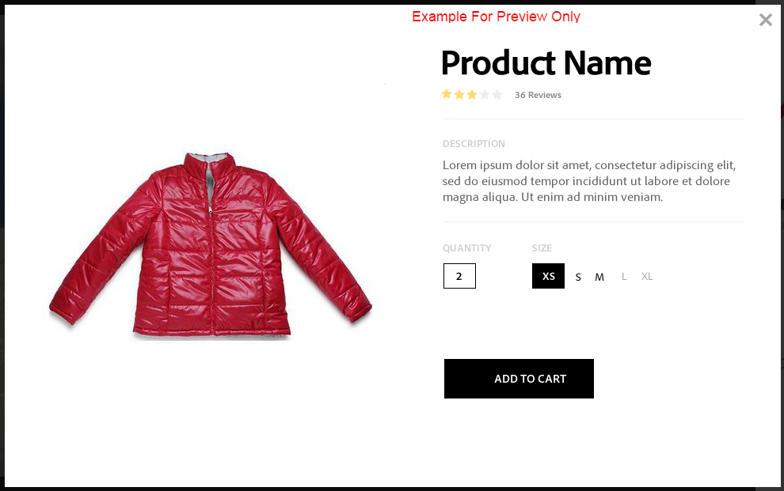

# Vídeos interactivos{#interactive-videos}

Puede crear fácilmente vídeos interactivos (también conocidos como vídeos de ventas) que impulsen la conversión directamente desde el vídeo. La participación del cliente con el vídeo se produce en un panel junto al reproductor de vídeo, donde el servicio, la información o las miniaturas de productos relacionados se desplazan a la vista según lo que se incluye en el vídeo. Los clientes pueden seleccionar la miniatura y estar vinculados directamente al servicio, o agregar el artículo a un carro de compras para su compra inmediata, o estar vinculados a una página web para obtener más información.

Cuando termina el vídeo, se muestra un resumen visual de todas las ofertas para dirigir una llamada a la acción. Los clientes tienen otra oportunidad de seleccionar el elemento que desean. Experiencias procesables y específicas, como estas, aumentan las conversiones y las participaciones de los clientes.

Consulte también [Imágenes interactivas](/help/assets/dynamic-media/interactive-images.md).

## Vídeo interactivo en acción {#interactive-video-in-action}

Para ver un vídeo interactivo y de ventas en acción, seleccione [Demostraciones en directo](https://landing.adobe.com/en/na/dynamic-media/ctir-2755/live-demos.html), desplácese hasta el **[!UICONTROL Medios de ventas]** en la página y, a continuación, seleccione el vídeo de ventas para comenzar la reproducción.

* Durante la reproducción, como los productos se utilizan en el vídeo, el producto idéntico aparece a la derecha como una imagen en miniatura.

* Para pausar el vídeo y abrir la vista rápida del producto, seleccione la miniatura. Por ejemplo, seleccione la imagen en miniatura de KitchenAid en el vídeo para experimentar una vista de giro de 360° del mezclador o acerque para ver los detalles del mezclador.

Consulte también [Uso de vídeo interactivo con Dynamic Media](https://experienceleague.adobe.com/docs/experience-manager-learn/assets/dynamic-media/dynamic-media-interactive-video-feature-video-use.html#dynamic-media)

<!-- 

There was a link here that showed the video frame of an interactive video and when the reader selected the frame the video would play https://experienceleague.adobe.com/tools/dynamic-media-demo/shoppable-video/AXIS/index.html. This now needs to call a new interactive video

-->

<!-- 

[A frame from an interactive, shoppable video](assets/chlimage_1-126.png) *A video frame capture from an interactive, shoppable video.*

-->

>[!NOTE]
>
>Si crea un vídeo interactivo para iniciar una página web cuando un usuario selecciona una imagen en miniatura, algunos dispositivos impiden que se abra la página web emergente. En estos casos, cambie la configuración del bloqueador de ventanas emergentes en el dispositivo. Por ejemplo, en un Apple iPhone 6, vaya a **[!UICONTROL Configuración]** > **[!UICONTROL Safari]** > **[!UICONTROL Bloquear ventanas emergentes]** y deslice el control hasta **[!UICONTROL Off]**. Ahora, cuando reproduce un vídeo interactivo y selecciona una miniatura, se le pedirá que abra la ventana emergente. Si lo acepta, se abre la página web.

### Ver cómo se crean los vídeos interactivos {#watch-how-interactive-videos-are-created}

Mire este tutorial en [cómo se crean los vídeos interactivos](https://s7d5.scene7.com/s7viewers/html5/VideoViewer.html?videoserverurl=https://s7d5.scene7.com/is/content/&amp;emailurl=https://s7d5.scene7.com/s7/emailFriend&amp;serverUrl=https://s7d5.scene7.com/is/image/&amp;config=Scene7SharedAssets/Universal_HTML5_Video_social&amp;contenturl=https://s7d5.scene7.com/skins/&amp;asset=S7tutorials/InteractiveVideo)(7 minutos y 30 segundos).
(Aunque el tutorial de vídeo está marcado con Assets on Demand, los principios y pasos siguen aplicándose a Vídeo interactivo en Adobe Experience Manager Assets).

### Seminario web sobre el éxito de los clientes de Adobe {#adobe-customer-success-webinar}

La variable [Uso compartido de vínculos, vídeos interactivos y YouTube en Experience Manager Assets](https://adobecustomersuccess.adobeconnect.com/p1yxzdo4aec/) webinar le enseña a utilizar vídeo interactivo y otras funciones para enlazar eventos impulsados por conversión con su contenido de marketing de vídeo.

## Inicio rápido: Vídeos interactivos {#quick-start-interactive-videos}

La siguiente descripción paso a paso del flujo de trabajo está diseñada para ayudarle a poner en marcha rápidamente los vídeos interactivos en Dynamic Media.

Busque la variable **Ejemplo** dentro de algunas de las tareas de inicio rápido. Contiene un breve tutorial basado en esto [inicio de la página web de demostración que *no* tienen interactividad agregada aún](https://experienceleague.adobe.com/tools/dynamic-media-demo/shoppable-video/john-lewis/landing-0.html).

Los **ejemplos** sirven para ilustrar los pasos que se siguen para integrar vídeos interactivos en su propio sitio web.

Cuando termine el tutorial en la última sección Ejemplo , [su página web de demostración final con el vídeo interactivo totalmente integrado aparece de esta manera](https://experienceleague.adobe.com/tools/dynamic-media-demo/shoppable-video/john-lewis/landing-3.html).

Pasos de vídeo interactivo:

1. **(Opcional) Identifique las variables de vista rápida** - Comience identificando las variables dinámicas que utiliza su implementación de vista rápida existente. Las variables se utilizan para asignar miniaturas de productos a la vista rápida de su producto correspondiente al crear el vídeo interactivo. Consulte [(Opcional) Identificación de variables de vista rápida](#optional-identifying-quickview-variables).
   **Este paso solo es necesario si se cumplen todas las condiciones siguientes:**
   * Desea agregar interactividad al vídeo activando las vistas rápidas.
   * La implementación de Experience Manager hace lo siguiente *not* utilice un marco de integración de eCommerce para extraer datos de productos a Experience Manager desde cualquier solución de comercio electrónico, como IBM® WebSphere® Commerce, Elastic Path, SAP Hybris o Intershop.

1. **(Opcional) Crear un ajuste preestablecido de visualizador de vídeo interactivo** : personalice el aspecto y el comportamiento de los distintos componentes que componen el reproductor, como la barra de desplazamiento del vídeo y las miniaturas interactivas.
No es necesario crear su propio ajuste preestablecido de visualizador de vídeo interactivo si desea utilizar los ajustes preestablecidos de visualizador de vídeo interactivo integrados `Shoppable_Video_Light` o `Shoppable_Video_Dark` en su lugar.
Consulte [Crear un ajuste preestablecido de visualizador](/help/assets/dynamic-media/managing-viewer-presets.md#creating-a-new-viewer-preset) (opcional) y [Consideraciones especiales para crear un ajuste preestablecido de visualizador interactivo](/help/assets/dynamic-media/managing-viewer-presets.md#special-considerations-for-creating-an-interactive-viewer-preset).

1. **Cargar un vídeo y sus recursos de imagen asociados** - Cargue un vídeo e imágenes asociadas que desee hacer interactivas.
Consulte [Cargar un vídeo y sus recursos de miniaturas asociados](#uploading-a-video-and-its-associated-thumbnail-assets).

   >[!NOTE]
   >
   >El formato de vídeo MXF aún no es compatible para su uso con vídeos interactivos en Dynamic Media.

1. **Añadir interactividad al vídeo** : agregue uno o más segmentos de tiempo al vídeo. A continuación, asocie miniaturas de imágenes dentro de esos segmentos de tiempo. Asigne cada miniatura de imagen a una acción, como un hipervínculo, una vista rápida o un fragmento de experiencia.
(El método de vinculación basado en URL no es posible si el contenido interactivo tiene vínculos con direcciones URL relativas, especialmente vínculos a páginas de Experience Manager Sites).
Para terminar, publique los recursos de vídeo interactivos. La publicación crea el código incrustado o la URL que se copian y aplican a la página de aterrizaje del sitio web. Consulte [Añadir interactividad al vídeo](#adding-interactivity-to-your-video).
Consulte [Publicar recursos](/help/assets/dynamic-media/publishing-dynamicmedia-assets.md).

1. **Añada un vídeo interactivo al sitio web o al sitio web en Experience Manager** - Si utiliza Experience Manager Sites o eCommerce, o ambos, agregue el vídeo interactivo a una página web en Experience Manager. Arrastre el componente Medios interactivos a la página. Consulte [Agregar recursos de Dynamic Media a páginas](/help/assets/dynamic-media/adding-dynamic-media-assets-to-pages.md).
Utilice el código incrustado o la URL para integrar el vídeo interactivo con las experiencias del sitio web. Consulte [Integración de un vídeo interactivo con el sitio web](#integrating-an-interactive-video-with-your-website).
Si utiliza un WCM de terceros (Web Content Manager), debe integrar el nuevo vídeo interactivo con la implementación de vista rápida existente que se utiliza en el sitio web. Consulte [Integración de un vídeo interactivo con una vista rápida existente](#integrating-an-interactive-video-with-an-existing-quickview).
   [Agregar recursos de Dynamic Media a páginas](/help/assets/dynamic-media/adding-dynamic-media-assets-to-pages.md)

## (Opcional) Identifique las variables de vista rápida {#optional-identifying-quickview-variables}

>[!NOTE]
>
>Esta tarea solo es necesaria si los siguientes son verdaderos:
>
>* Desea agregar interactividad al vídeo activando las vistas rápidas.
>* La implementación de Experience Manager hace lo siguiente *not* utilice un marco de integración de eCommerce para extraer datos de productos a Experience Manager desde cualquier solución de comercio electrónico, como IBM® WebSphere® Commerce, Elastic Path, SAP Hybris o Intershop. <!-- See [eCommerce concepts in Experience Manager Assets](/help/sites-administering/concepts.md).-->
>
Si su implementación de Experience Manager utiliza eCommerce, puede omitir esta tarea y continuar con la siguiente tarea.

Comience por identificar las variables dinámicas que usa la implementación de Quickview existente, de modo que pueda asignar miniaturas de productos a la vista rápida de su producto correspondiente durante el proceso de creación de vídeo interactivo.

Al agregar segmentos de tiempo a un vídeo, se asigna un SKU (unidad de mantenimiento de stock) y cualquier variable adicional a cada miniatura que se agregue a un segmento. Estas variables se utilizan más adelante para mostrar el producto Quickview correcto.

Es importante identificar correctamente qué variables son necesarias para almacenar en déclencheur un producto de forma única en Quickview.

A veces basta con consultar a los especialistas de TI responsables de la implementación de Quickview existente. Es probable que conozcan el conjunto mínimo de datos que identifica Quickview en el sistema. Sin embargo, es posible simplemente analizar el comportamiento existente del código front-end.

La mayoría de las implementaciones de vista rápida utilizan el siguiente paradigma:

* El usuario activa un elemento de interfaz de usuario en el sitio web. Por ejemplo, si selecciona el botón &quot;Vista rápida&quot;.
* El sitio web envía una solicitud de Ajax al servidor para cargar los datos o el contenido de la vista rápida, si es necesario.
* Los datos de vista rápida se traducen al contenido como preparación para su renderización en la página web.
* Por último, el código front-end procesa visualmente dicho contenido en la pantalla.

Por lo tanto, el enfoque es visitar diferentes áreas del sitio web existente donde se implementa Quickview. A continuación, déclencheur la vista rápida y adquiera la URL de Ajax que envía la página web para cargar los datos o el contenido de la vista rápida.

Normalmente no es necesario que utilice ninguna herramienta de depuración especializada. Los navegadores web modernos cuentan con inspectores web que realizan un trabajo adecuado. A continuación se indican algunos ejemplos de exploradores web que incluyen inspectores web:

* Para ver todas las solicitudes HTTP salientes en Google Chrome, pulse **F12** (Windows®) o **Comando+Opciones+I** (Mac) para abrir el panel Herramientas para desarrolladores y, a continuación, seleccione la **Red** pestaña .

* En Firefox, puede activar el complemento Firebug pulsando **F12** (Windows®) o **Comando + Opción + I** (Mac) y utilice su **[!UICONTROL Red]** o puede utilizar la herramienta Inspector integrada y su pestaña Red.

* En Internet Explorer, active la herramienta de depuración pulsando **F12**.

Cuando la supervisión de red está activada en el explorador, ponga en déclencheur la vista rápida en la página.

Ahora, busque la URL de Ajax de vista rápida en el registro de red y copie la URL grabada para su análisis futuro. Por lo general, cuando se déclencheur la vista rápida hay numerosas solicitudes que se envían al servidor. Normalmente, la URL de Ajax de vista rápida es una de las primeras de la lista. Tiene una ruta o porción de cadena de consulta compleja y su tipo MIME de respuesta es `text/html`, `text/xml`o `text/javascript`.

Durante este proceso, es importante visitar diferentes áreas del sitio web, con diferentes tipos y categorías de productos. El motivo es que las URL de vista rápida tienen partes que son comunes para una categoría de sitio web determinada, pero cambian solo si visita un área diferente del sitio web.

En el caso más simple, la única parte de la variable en la URL de vista rápida es el SKU del producto. En este caso, el valor SKU del producto es la única pieza de datos necesaria para agregar miniaturas a un segmento de tiempo en el vídeo interactivo en el Experience Manager.

Sin embargo, en casos complejos, la URL de vista rápida tiene diferentes elementos además del SKU del producto, como el ID de categoría y el código de color. En estos casos, cada elemento de este tipo se convierte en una variable independiente en la definición de datos de miniatura en el Experience Manager.

Veamos los siguientes ejemplos de direcciones URL de vista rápida y las variables de miniaturas resultantes:

<table>
  <tbody>
  <tr>
    <td><p>SKU único, que se encuentra en la cadena de consulta.</p> </td>
    <td><p>Las direcciones URL de vista rápida registradas incluyen lo siguiente:</p>
    <ul>
      <li><p><code>https://server/json?productId=866558&amp;source=100</code></p> </li>
      <li><p><code>https://server/json?productId=1196184&amp;source=100</code></p> </li>
      <li><p><code>https://server/json?productId=1081492&amp;source=100</code></p> </li>
      <li><p><code>https://server/json?productId=1898294&amp;source=100</code></p> </li>
    </ul> <p>La única parte variable de la dirección URL es el valor de la variable <code>productId=</code> parámetro de cadena de consulta, y es claramente un valor de SKU. Por lo tanto, las miniaturas solo necesitan campos SKU rellenados con valores como <strong><code>866558</code></strong>, <strong><code>1196184</code></strong>, <strong><code>1081492</code></strong>, <strong><code>1898294</code></strong>.</p> </td>
  </tr>
  <tr>
    <td><p>SKU único, que se encuentra en la ruta de URL.</p> </td>
    <td><p>Las direcciones URL de vista rápida registradas incluyen lo siguiente:</p>
    <ul>
      <li><p><code>https://server/product/6422350843</code></p> </li>
      <li><p><code>https://server/product/1607745002</code></p> </li>
      <li><p><code>https://server/product/0086724882</code></p> </li>
    </ul> <p>La parte variable se encuentra en la última parte de la ruta y se convierte en el valor SKU de las miniaturas del Experience Manager: <strong><code>6422350843</code></strong>, <strong><code>1607745002</code></strong>, <strong><code>0086724882</code></strong>.</p> </td>
  </tr>
  <tr>
    <td><p>SKU e ID de categoría en la cadena de consulta.</p> </td>
    <td><p>Las direcciones URL de vista rápida registradas incluyen lo siguiente:</p>
    <ul>
      <li><p><code>https://server/quickView/product/?category=1100004&amp;prodId=305466</code></p> </li>
      <li><p><code>https://server/quickView/product/?category=1100004&amp;prodId=310181</code></p> </li>
      <li><p><code>https://server/quickView/product/?category=1740148&amp;prodId=308706</code></p> </li>
    </ul> <p>En este caso, hay dos partes diferentes en la dirección URL. El SKU se almacena en la variable <code>prodId</code> y el ID de categoría se almacena en la variable <code>category=</code> parámetro.</p> <p>Como tal, las definiciones de miniaturas son pares. Es decir, un valor de SKU y una variable adicional llamada <code>categoryId</code>. Los pares resultantes son los siguientes:</p>
    <ul>
      <li>SKU <code>305466</code> y <code>categoryId</code> es <code>1100004</code></li>
      <li>SKU <code>310181</code> y <code>categoryId</code> es <code>1100004</code></li>
      <li>SKU <code>308706</code> y <code>categoryId</code> es <code>1740148</code></li>
    </ul> <p> </p> </td>
  </tr>
  </tbody>
</table>

**Ejemplo**

Cuando se aplica el enfoque anterior al sitio web de Ejemplo, tiene una página web con varias miniaturas de productos, cada una con el botón &quot;VER MÁS&quot;:

[https://experienceleague.adobe.com/tools/dynamic-media-demo/shoppable-video/john-lewis/landing-0.html](https://experienceleague.adobe.com/tools/dynamic-media-demo/shoppable-video/john-lewis/landing-0.html)

Después de activar todas las vistas rápidas del producto disponibles en la página, obtiene la siguiente lista de solicitudes de vista rápida realizadas en el servidor:

* datafeed/candles-233396346.json
* datafeed/candles-233978050.json
* datafeed/candles-234024346.json
* datafeed/candles-234024356.json
* datafeed/candles-234024359.json
* datafeed/cushions-233939848.json
* datafeed/cushions-234019477.json
* datafeed/cushions-234019483.json
* datafeed/furniture-231747479.json
* datafeed/furniture-232625621.json
* datafeed/furniture-232625626.json
* datafeed/furniture-233939810.json
* datafeed/furniture-233939825.json
* datafeed/furniture-233939828.json
* datafeed/furniture-233939853.json
* datafeed/furniture-233940334.json
* datafeed/glassware-000064007.json
* datafeed/glassware-230722193.json
* datafeed/glassware-233916550.json
* datafeed/glassware-233916597.json

Si se observan las llamadas al servidor, la información específica del producto solo está presente en la ruta de solicitud. También observa que la cadena de consulta no se utiliza en absoluto y que hay dos tipos distintos de fragmentos de datos involucrados:

* El primer tipo son velas, cojines, muebles y cristalería. Puede llamar a esta &quot;categoría de producto&quot;.
* El segundo tipo es código de producto, como 233916597. Puede suponer que es &quot;SKU de producto&quot;.

Dada esta información, toda la URL de vista rápida tiene el siguiente patrón:

`/datafeed/$categoryId$-$SKU$.json`

En función de este análisis, concluye que puede utilizar las dos variables siguientes para las miniaturas: `categoryId` y `SKU`.

Ya está listo para cargar un vídeo y sus recursos de miniaturas asociados.

## (Opcional) Crear un ajuste preestablecido de visualizador de vídeo interactivo {#optional-creating-an-interactive-video-viewer-preset}

Puede omitir esta tarea y continuar con la siguiente si quiere utilizar cualquiera de los tipos predeterminados de ajustes preestablecidos de visualizador de vídeo interactivo preestablecidos `Shoppable_Video_dark` o `Shoppable_Video_light`.

Cuando se selecciona una miniatura en el entorno de creación, aparece una vista previa del cuadro de diálogo Vista rápida.



Si lo desea, puede crear su propio ajuste preestablecido de visualizador de vídeo interactivo personalizado. Puede determinar, entre otras cosas, el estilo del reproductor de vídeo, las miniaturas interactivas y la vista de cuadrícula en miniatura que aparece al final del vídeo.

Un ajuste preestablecido de visualizador de vídeo interactivo procesa correctamente el vídeo y todos los segmentos de línea de tiempo que ha añadido. También utiliza una vista rápida predeterminada de ejemplo al seleccionar una miniatura de producto en el modo de vista previa, de modo que pueda probar su interactividad antes de publicarla.

Después de guardar el ajuste preestablecido de visualizador, su estado se establece automáticamente en **On **en la página Ajustes preestablecidos del visualizador. Este estado significa que está visible en el componente Dynamic Media y siempre que se obtiene una vista previa de un vídeo con él. Asegúrese de publicar también manualmente el nuevo ajuste preestablecido de visualizador.

Consulte [Crear un ajuste preestablecido de visualizador](/help/assets/dynamic-media/managing-viewer-presets.md#creating-a-new-viewer-preset) para crear su propio ajuste preestablecido de visualizador de vídeo interactivo.

## Cargar un vídeo y sus recursos de miniaturas asociados {#uploading-a-video-and-its-associated-thumbnail-assets}

Si ya ha cargado los recursos de vídeo y miniaturas, continúe con [Añadir interactividad al vídeo](#adding-interactivity-to-your-video).

>[!NOTE]
El formato de vídeo MXF aún no es compatible para su uso con vídeos interactivos en Dynamic Media.

Si ha cargado vídeos o imágenes incorrectos o quiere eliminar vídeos o imágenes cargados que ya no necesita, consulte [Eliminar recursos](/help/assets/manage-digital-assets.md#delete-assets).

Para cargar un vídeo y sus recursos de miniaturas asociados:

1. Cargue el vídeo y los recursos de miniaturas asociados a la carpeta o carpetas que desee.

   Consulte [Cargar recursos](/help/assets/manage-digital-assets.md).
Consulte [Cargar recursos mediante la programación de trabajos de FTP](/help/assets/manage-digital-assets.md).

   Ahora agregue interactividad al vídeo.

## Añadir interactividad al vídeo {#adding-interactivity-to-your-video}

Agregue segmentos de línea de tiempo a un vídeo mediante el editor visual local de la página Crear vídeo interactivo .

Después de agregar segmentos de cronología, agregue imágenes en miniatura dentro de cada segmento. Para cada miniatura que agregue, debe aplicar una acción a ella. Por ejemplo, puede aplicar una vista rápida a la miniatura, o bien asignarle un hipervínculo o un fragmento de experiencia.

Consulte [Fragmentos de experiencias](/help/sites-cloud/authoring/fundamentals/experience-fragments.md).

>[!NOTE]
Las herramientas de uso compartido de medios sociales en vídeo interactivo no son compatibles cuando se incrusta el visor en un fragmento de experiencia. En su lugar, puede usar o crear ajustes preestablecidos de visualizador que no tengan herramientas de uso compartido en redes sociales. Estos ajustes preestablecidos de visor permiten incrustarlos correctamente en fragmentos de experiencias.

>[!NOTE]
El método de vinculación basado en URL no es posible si el contenido interactivo tiene vínculos con direcciones URL relativas, especialmente vínculos a páginas de Experience Manager Sites.

Las opciones Deshacer y Rehacer, cerca de la esquina superior derecha de la página, son compatibles durante la sesión de creación/edición actual.

Después de guardar el vídeo interactivo, el vídeo se abre inmediatamente en la vista previa. Desde allí, puede seleccionar un ajuste preestablecido de visualizador de vídeo interactivo y reproducir el vídeo para ver una representación aproximada de cómo le aparece a los clientes.

**Para añadir interactividad al vídeo:**

1. En la vista Recursos, desplácese hasta el vídeo que ha cargado y desee hacer interactivo.
1. Realice una de las siguientes acciones:

   * Pase el ratón sobre la imagen y seleccione **[!UICONTROL Select]** (icono de marca de verificación). En la barra de herramientas, seleccione **[!UICONTROL Editar]**.

   * Pase el ratón sobre la imagen y seleccione **[!UICONTROL Más acciones]** (icono de tres puntos) **[!UICONTROL > Editar]**.

   * Para abrirlo en la página Vista de detalles, seleccione la imagen. En la barra de herramientas, seleccione **[!UICONTROL Editar]**.

1. En la página Crear vídeo interactivo , realice una de las acciones siguientes:

   * Para comenzar a reproducir el vídeo, seleccione la opción **[!UICONTROL Play]** botón. Cuando entre en la vista un producto, servicio o detalle concreto que desea resaltar, seleccione **[!UICONTROL Añadir segmento]** en la barra de herramientas. Repita el proceso hasta que haya llegado al final del vídeo.

      Por cada segmento de tiempo que agregue, puede asignarle una o más imágenes en miniatura. A continuación, puede vincular esas miniaturas a páginas de productos de vista rápida para que los clientes las compren o a páginas web para obtener más información.

   * Para comenzar a reproducir el vídeo, seleccione la opción **[!UICONTROL Play]** botón. Cuando entre en la vista un producto, servicio o detalle concreto que desea resaltar, seleccione **[!UICONTROL Pausa]**. Select **[!UICONTROL Añadir segmento]**.

      Continúe reproduciendo y pausando el vídeo en los puntos de la cronología en los que desee agregar un segmento hasta que llegue al final del vídeo.

1. (Opcional) Arrastre la barra a la **[!UICONTROL Regulador de escala de cronología]** izquierda para acercar o derecha para alejar. Esta acción le permite controlar cuánto detalle ve de los segmentos que ha agregado.

   

   En función de la duración del vídeo, la duración del segmento es, de forma predeterminada, de los siguientes valores:

   <table>
      <tbody>
        <tr>
        <td><strong>Si la duración del vídeo es...</strong></td>
        <td><strong>El valor predeterminado de la configuración Duración del segmento es...</strong></td>
        </tr>
        <tr>
        <td>3 minutos o más</td>
        <td>60 segundos</td>
        </tr>
        <tr>
        <td>2 a 3 minutos</td>
        <td>30 segundos</td>
        </tr>
        <tr>
        <td>1-2 minutos</td>
        <td>20 segundos<br /> </td>
        </tr>
        <tr>
        <td>de 30 a 60 segundos</td>
        <td>10 segundos</td>
        </tr>
        <tr>
        <td>30 segundos o menos</td>
        <td>5 segundos</td>
        </tr>
      </tbody>
    </table>

   La línea de tiempo del vídeo utiliza tanto espacio de la pantalla como lo que está disponible para él. De este modo, cuando cambia el tamaño del explorador, los segmentos que ha agregado mantienen su anchura correcta.

   Como ejemplo, las tres capturas de pantalla siguientes utilizan el mismo vídeo. Observe que el ancho de cada segmento cambia según la configuración de Escala de línea de tiempo .

   

   Captura De Pantalla A

   La captura de pantalla A anterior muestra la vista predeterminada de un vídeo de producto de 29 segundos. La escala de cronología se establece en el valor predeterminado de 5 segundos.

   

   Captura de pantalla B

   En la captura de pantalla B anterior, el control deslizante Escala de cronología se arrastró del valor predeterminado de 5 segundos a 3 segundos. Tenga en cuenta que las marcas de tiempo de escala de línea de tiempo individuales ahora se establecen todas en intervalos de 3 segundos.

   

   Captura de pantalla C

   En la captura de pantalla C anterior, el ajuste Escala de línea de tiempo se movió a 8 segundos. Observe cómo los segmentos que contienen miniaturas de productos se han reducido. Esta forma de alejarse resulta útil si tiene un vídeo largo y desea ver una descripción general de más segmentos que normalmente se ajustarían al ancho de la página.

1. (Opcional) Realice cualquiera de las siguientes acciones:

   * Para ajustar la hora de inicio y la hora de finalización de un segmento.

      Seleccione un segmento y, a continuación, arrastre el óvalo azul inicial o final para ajustar la hora de inicio o finalización, respectivamente. El fotograma de vídeo mostrado se mueve al tiempo adecuado en el vídeo, según los ajustes. El movimiento del segmento de la cronología está restringido en función de cualquier segmento adyacente de la cronología. El tiempo mínimo permitido para el segmento es de un segundo.

      Utilice los siguientes métodos abreviados de navegación para comprobar y ajustar rápidamente sus segmentos de vídeo:

      * Para buscar el vídeo directamente al principio de ese segmento, seleccione el óvalo azul inicial.
      * Para buscar el vídeo directamente hasta el final de ese segmento, seleccione el óvalo azul final.
      * Para devolver la reproducción de vídeo al principio de ese segmento, seleccione todo el segmento.

   

   Cambio de posición del final de un segmento de línea de tiempo

   * Para eliminar un segmento

      Seleccione el último segmento que se encuentra en la línea de tiempo y, en la barra de herramientas, seleccione **[!UICONTROL Eliminar segmento]**. Si se seleccionan dos o más segmentos, la función Eliminar segmento se desactiva.

      Solo puede eliminar el último segmento. Por ejemplo, si desea eliminar todos los segmentos de la cronología, siempre debe seleccionar el último y, a continuación, seleccionar **[!UICONTROL Eliminar segmento]**.


1. Seleccione un segmento de tiempo al que desee asociar una o más imágenes en miniatura.
1. A la derecha del vídeo, seleccione el **[!UICONTROL Contenido]** pestaña .
1. En la pestaña Content , seleccione **[!UICONTROL Seleccionar recursos]** y, a continuación, busque y seleccione todos los recursos de imagen que desee utilizar con el vídeo. Los recursos seleccionados se añaden al panel Selector de recursos en la ficha Contenido .

1. En el selector de recursos que se encuentra debajo de la ficha Contenido , realice una de las acciones siguientes:

   <table>
      <tbody>
        <tr>
        <td>Para asociar una miniatura al segmento de línea de tiempo seleccionado</td>
        <td><p>Seleccione la imagen en el panel selector de recursos de la derecha.</p> <p>Puede agregar tantas miniaturas como desee a un segmento de línea de tiempo. Para cada imagen seleccionada, aparece una marca de verificación sobre la imagen en el selector de recursos.</p> </td>
        </tr>
        <tr>
        <td>Para eliminar una miniatura del segmento de línea de tiempo seleccionado</td>
        <td><p>Realice una de las acciones siguientes:</p>
          <ul>
          <li>En el panel Selector de recursos, seleccione una imagen con una marca de verificación para anular la selección. El recurso de imagen se elimina del segmento de línea de tiempo.<br /> </li>
          <li>En el segmento de línea de tiempo seleccionado, seleccione una imagen y, en la barra de herramientas, seleccione <strong>Eliminar producto</strong>.</li>
          </ul> </td>
        </tr>
      </tbody>
    </table>

   

   Al seleccionar una imagen en el panel selector de recursos, se agrega al segmento de línea de tiempo seleccionado.

1. Seleccione una sola imagen en miniatura dentro de uno de los segmentos de la cronología y, a continuación, seleccione la variable **[!UICONTROL Acciones]** pestaña .
1. Realice una de las acciones siguientes:
   <table> 
    <tbody> 
      <tr> 
      <td>Para asociar la imagen en miniatura seleccionada con una vista rápida</td> 
      <td><p>En Tipo de acción, seleccione <strong>Vista rápida</strong>.</p> <p>Si es cliente de Experience Manager Sites y comercio electrónico:</p> 
       <ul> 
       <li>Observe que el campo de texto Valor de SKU se rellena previamente con el SKU del producto seleccionado (unidad de mantenimiento de stock). El SKU es un identificador único para cada producto o servicio distinto que ofrezca. Este campo se rellena automáticamente cuando la imagen está asociada a un producto en Experience Manager Commerce.</li> 
       <li>Si el SKU rellenado previamente es incorrecto, seleccione el icono Selector de producto (lupa) para abrir la página Seleccionar producto . Seleccione el producto que desee utilizar y, a continuación, seleccione la marca de verificación en la esquina superior derecha de la página. Volverá al Editor de vídeo interactivo.</li> 
       </ul> <p> Si <em>not</em> un cliente de Experience Manager Sites o comercio electrónico</p> 
       <ul> 
       <li>Consulte <a href="/help/assets/dynamic-media/carousel-banners.md#identifying-hotspot-and-image-map-variables">Identificación de variables de zona interactiva</a>. Estas variables deben definirse.</li> 
       <li>De forma predeterminada, este campo SKU utiliza el nombre de archivo del recurso de imagen sin la extensión. Si sigue una convención de nombres estándar para los archivos basada en el SKU, este campo no suele requerir ninguna edición adicional. </li> 
       <li>De lo contrario, edite el valor predeterminado e introduzca el valor de SKU correcto. En el campo de texto Valor de SKU , escriba el SKU del producto (unidad de mantenimiento de stock), que es un identificador único para cada producto o servicio distinto que ofrezca. El valor SKU introducido rellena automáticamente la parte variable de la plantilla de vista rápida, de modo que el sistema sepa asociar la imagen seleccionada con la vista rápida de un SKU concreto.</li> 
       </ul> <p>(Opcional) Si hay otras variables dentro de la vista rápida que debe utilizar para identificar un producto, seleccione <strong>Agregar variable genérica</strong>. En el campo de texto, especifique una variable adicional. Por ejemplo, <code>category=Womens</code> es una variable añadida.</p> <p> </p> </td> 
      </tr> 
      <tr> 
      <td>Asociación de la imagen en miniatura seleccionada con un hipervínculo</td> 
      <td><p>En Tipo de acción, seleccione <strong>Hipervínculo</strong>y, a continuación, realice una de las siguientes acciones:</p> 
       <ul> 
       <li>Si es cliente de Experience Manager Sites, seleccione el icono (carpeta) Selector de sitio para navegar a una página web. El método de vinculación basado en URL no es posible si el contenido interactivo tiene vínculos con direcciones URL relativas, especialmente vínculos a páginas de Experience Manager Sites.</li> 
       <li>Si es cliente independiente de Dynamic Media, en el campo de texto HREF especifique la ruta de URL completa a una página web vinculada.</li> 
       </ul> <p>Asegúrese de especificar si desea abrir el vínculo en una nueva pestaña del explorador o en la pestaña actual.</p> </td> 
      </tr> 
      <tr> 
      <td>Para asociar la imagen en miniatura seleccionada con un fragmento de experiencia</td> 
      <td><p>En Tipo de acción, seleccione <strong>Fragmento de experiencia</strong>y, a continuación, haga lo siguiente:<p> 
       <ul> 
       <li>Si es cliente de Experience Manager Sites, seleccione el icono de búsqueda (lupa) para abrir la página Fragmento de experiencia . Seleccione el fragmento de experiencia que desee utilizar y, a continuación, seleccione <strong>Para volver al panel Acciones de la página anterior, seleccione </strong>en la esquina superior derecha de la página.<br /> Consulte <a href="/help/sites-cloud/authoring/fundamentals/experience-fragments.md">Fragmentos de experiencias</a>.</li> 
      </ul> 
       <ul> 
       <li>Especifique la anchura y la altura del fragmento de experiencia tal como aparece en el vídeo.</li>
       </ul><strong>Nota</strong>: Las herramientas de uso compartido de medios sociales de Vídeo interactivo no son compatibles cuando se incrusta el visor en un fragmento de experiencia. En su lugar, puede usar o crear ajustes preestablecidos de visualizador que no tengan herramientas de uso compartido en redes sociales. Estos ajustes preestablecidos de visor permiten incrustarlos correctamente en fragmentos de experiencias.</p></tr>&lt; 
      <tr> 
      <td>Para editar una acción ya asignada a una imagen en miniatura</td> 
      <td>Dentro de un segmento de línea de tiempo, seleccione una imagen en miniatura que tenga un vínculo de cadena a la derecha de su etiqueta de texto. El vínculo de cadena indica que se le ha asignado una acción. Para realizar los cambios, seleccione la opción <strong>Acciones</strong> pestaña .</td> 
      </tr> 
      <tr> 
      <td>Cambio de la etiqueta de texto de una imagen en miniatura</td> 
      <td><p>De forma predeterminada, la etiqueta de texto utiliza la imagen en miniatura <code>Title</code> campo de metadatos. If <code>Title</code> no está presente, se utiliza el nombre de archivo de la imagen en miniatura en su lugar, pero sin la extensión .</p> <p>Para cambiar la etiqueta de texto de una imagen en miniatura, en la sección <strong>Acciones </strong>, directamente debajo del recurso de imagen que se muestra, escriba el texto que desee. Consulte la siguiente imagen.</p> <p>La nueva etiqueta de texto la utiliza solo el propio reproductor de vídeo y el texto en miniatura que se muestra en el segmento de línea de tiempo. El cambio de etiqueta no afecta al campo de metadatos Título de la imagen en miniatura ni a su nombre de archivo.</p> </td> 
      </tr> 
      <tr> 
      <td>Para revertir un cambio</td> 
      <td>Cerca de la esquina superior derecha de la página, seleccione <strong>Deshacer</strong> o <strong>Rehacer</strong>.</td> 
      </tr> 
    </tbody> 
   </table>

   

   Se agrega una nueva etiqueta de texto a la imagen en miniatura.

1. Realice una de las siguientes acciones:

   * Repita los pasos 6-11 para agregar más imágenes en miniatura a segmentos de línea de tiempo en el vídeo.
   * Continúe con el paso opcional 13.

1. (Opcional) Realice una de las siguientes acciones:

   * **[!UICONTROL Combinar segmento]** : puede combinar dos segmentos adyacentes (con o sin miniaturas de productos asignadas a ellos) en un segmento.

      En la línea de tiempo, seleccione dos o más segmentos contiguos que desee combinar en uno. No hay controles de arrastre ovalados azules en los dos segmentos seleccionados en la imagen siguiente.

      Select **[!UICONTROL Combinar segmento]** en la barra de herramientas.
   

   Combinar dos segmentos seleccionados de cinco segundos en un segmento de diez segundos.

   * **[!UICONTROL Dividir segmento]** : puede dividir un solo segmento en dos segmentos a los que se asigna un mismo tiempo. Si ya hay miniaturas de producto asignadas al segmento, las miniaturas se combinan en el segmento izquierdo.

      En la línea de tiempo, seleccione un segmento que desee dividir por la mitad y, a continuación, seleccione **[!UICONTROL Dividir segmento]** en la barra de herramientas.

      Al seleccionar dos o más segmentos, se deshabilita la variable **[!UICONTROL Dividir segmento]** función.
   

   Dividir un segmento de diez segundos seleccionado en dos segmentos de cinco segundos cada uno.

1. Cerca de la esquina superior derecha de la **[!UICONTROL Crear vídeo interactivo]** , se muestra el nombre del ajuste preestablecido de visualizador seleccionado que se utiliza con el vídeo. Para seleccionar otro ajuste preestablecido de visualizador, seleccione el nombre.

   Por ejemplo, la variable `Shoppable_Video_light` el ajuste preestablecido de visualizador le permite reproducir el vídeo con un área de visualización en blanco junto al vídeo. El área de visualización es donde se muestran las imágenes en miniatura seleccionables durante la reproducción. La variable `Shoppable_Video_dark` el ajuste preestablecido de visualizador le permite reproducir el vídeo con un área de visualización en negro junto al vídeo.

   Si ha creado su propio ajuste preestablecido de visualizador de vídeo interactivo, puede verlo en la lista de ajustes preestablecidos entre los que elegir.

   Cuando haya terminado, seleccione **[!UICONTROL Guardar]**.

   >[!NOTE]
   Al guardar el vídeo interactivo, se guarda automáticamente un archivo asociado de `.vtt`. La variable `.vtt` se guarda en el `_VTT` carpeta en la raíz de **[!UICONTROL Recursos]**. El archivo y la carpeta son necesarios para que el vídeo interactivo se reproduzca correctamente en el sitio web. Como tal, no mueva, edite ni elimine la carpeta `_VTT` ni su contenido.

1. Publique el vídeo interactivo. La publicación crea el código incrustado o la URL que, finalmente, copia y pega en las experiencias del sitio web.

   Si ha añadido interactividad con las vistas rápidas, utilice únicamente el código incrustado; si ha añadido interactividad con páginas web hipervinculadas, también puede utilizar la URL publicada. Sin embargo, tenga en cuenta que el método de vinculación basado en URL no es posible si el contenido interactivo tiene vínculos con direcciones URL relativas, especialmente vínculos a páginas de Experience Manager Sites.

   Consulte [Publicar recursos](publishing-dynamicmedia-assets.md).

   >[!NOTE]
   Para publicar un vídeo de ventas con vistas rápidas, asegúrese de publicar cada uno de los recursos de imagen relacionados del vídeo en el área de comercio, por separado.

   Después de agregar segmentos de cronología y publicar el vídeo interactivo, estará listo para agregarlo a la página de aterrizaje del sitio web existente. Consulte [Integración de un vídeo interactivo con el sitio web](#integrating-an-interactive-video-with-your-website).

## Publicar recursos de vídeo interactivos {#publishing-interactive-video-assets}

Consulte [Publicar recursos](/help/assets/dynamic-media/publishing-dynamicmedia-assets.md) para obtener más información sobre cómo publicar recursos de vídeo interactivos.

## Integración de un vídeo interactivo con el sitio web {#integrating-an-interactive-video-with-your-website}

Después de cargar un vídeo, añadir segmentos de cronología y publicar el vídeo interactivo, ya está listo para agregarlo al sitio web existente.

Si es cliente de Experience Manager Sites, puede agregar el vídeo interactivo arrastrando el componente de Medios interactivos a su página. Consulte [Agregar recursos de Dynamic Media a páginas](/help/assets/dynamic-media/adding-dynamic-media-assets-to-pages.md).

Si es cliente independiente de Experience Manager Assets, puede añadir manualmente el vídeo interactivo al sitio web tal como se describe en esta sección.

1. Copie el código incrustado o la URL del vídeo interactivo publicado.
Consulte [Incrustar el visualizador de imágenes o vídeos en una página web](/help/assets/dynamic-media/embed-code.md).
Si ha añadido interactividad con las vistas rápidas, utilice únicamente el código incrustado; si ha añadido interactividad con páginas web hipervinculadas, también puede utilizar la URL publicada. Sin embargo, tenga en cuenta que el método de vinculación basado en URL no es posible si el contenido interactivo tiene vínculos con direcciones URL relativas, especialmente vínculos a páginas de Experience Manager Sites.

1. En el código de página web del objetivo, identifique dónde se encuentra el vídeo estático.
1. Elimine el vídeo estático y reemplace el código por el código incrustado o la URL que ha copiado de Experience Manager Assets tal cual.
El código incrustado copiado está configurado para un entorno interactivo, de modo que se ajusta automáticamente al área ocupada anteriormente por el vídeo estático.

>[!NOTE]
En este punto, si ha añadido interactividad solo con páginas web hipervinculadas, ha terminado.
Sin embargo, si ha añadido interactividad al déclencheur de una vista rápida, las miniaturas junto al vídeo interactivo solo tienen fines de visualización; todavía no están integrados con las vistas rápidas existentes. En este caso, debe integrar el vídeo interactivo con las vistas rápidas existentes en el sitio web.

**Ejemplo**

Ejemplo de uso del sitio web de demostración:

[https://experienceleague.adobe.com/tools/dynamic-media-demo/shoppable-video/john-lewis/landing-0.html](https://experienceleague.adobe.com/tools/dynamic-media-demo/shoppable-video/john-lewis/landing-0.html)

Tenga en cuenta que el código incrustado de vídeo es estándar:

```js {.line-numbers}
<style type="text/css">
 #s7video_div.s7videoviewer{
   width:100%;
   height:auto;
 }
</style>

<script type="text/javascript" src="https://demos-pub.assetsadobe.com/etc/dam/viewers/s7viewers/html5/js/VideoViewer.js"></script>
<div id="s7video_div"></div>
<script type="text/javascript">
 var s7videoviewer = new s7viewers.VideoViewer({
  "containerId" : "s7video_div",
  "params" : {
   "serverurl" : "https://adobedemo62-h.assetsadobe.com/is/image",
   "contenturl" : "https://demos-pub.assetsadobe.com/",
   "config" : "/etc/dam/presets/viewer/Video",
   "config2": "/etc/dam/presets/analytics",
   "videoserverurl": "https://gateway-na.assetsadobe.com/DMGateway/public/demoCo",
   "posterimage": "/content/dam/marketing/shoppable-video/john-lewis/shoppable-video-john-lewis-2014.mp4",
   "asset" : "/content/dam/marketing/shoppable-video/john-lewis/shoppable-video-john-lewis-2014.mp4" }
 }).init();
</script>
```

La integración es tan sencilla como eliminar el código incrustado de vídeo y reemplazarlo por el código incrustado de vídeo interactivo de Experience Manager. Puede ver el resultado en la siguiente URL. Aunque muestra un vídeo interactivo presente en la página, aún no está integrado con las vistas rápidas existentes:

[https://experienceleague.adobe.com/tools/dynamic-media-demo/shoppable-video/john-lewis/landing-1.html](https://experienceleague.adobe.com/tools/dynamic-media-demo/shoppable-video/john-lewis/landing-1.html)

## Integración de un vídeo interactivo con una vista rápida existente {#integrating-an-interactive-video-with-an-existing-quickview}

>[!NOTE]
Esta tarea solo se aplica si es cliente independiente de Experience Manager Assets.

El último paso de este proceso es integrar su vídeo interactivo con una implementación de vista rápida existente que se utiliza en su sitio web. No existe una solución para la integración que funcione en todos los casos. Cada implementación de QuickView es única. Como tal, se necesita un enfoque específico que incluya la asistencia de una persona de TI de front-end.

La implementación de vista rápida existente representa normalmente una cadena de acciones interrelacionadas que se producen en la página web en el siguiente orden:

1. Un usuario déclencheur un elemento en la interfaz de usuario del sitio web.
1. El código del front-end obtiene una URL de vista rápida basada en el elemento de la interfaz de usuario que se activó en el paso 1.
1. El código front-end envía una solicitud de AJAX utilizando la URL obtenida en el paso 2.
1. La lógica back-end devuelve los datos o el contenido de vista rápida correspondientes al código front-end.
1. El código front-end carga los datos o el contenido de Quickview.
1. De forma opcional, el código front-end convierte los datos de Quickview cargados en una representación de HTML.
1. El código front-end muestra un cuadro de diálogo modal o panel y representa el contenido del HTML en la pantalla para el usuario final.

Estas llamadas no representan llamadas de API públicas independientes a las que la lógica de página web puede llamar desde un paso arbitrario. En su lugar, se trata de una llamada encadenada en la que cada paso siguiente se oculta en la última fase (llamada de retorno) del paso anterior.

Al mismo tiempo que el vídeo interactivo sustituye al paso 1 y al paso 2 parcialmente, cuando un usuario selecciona una miniatura dentro del vídeo interactivo, el visor gestiona esta interacción. El visor devuelve un evento a la página web que contiene todos los datos de miniaturas añadidos anteriormente al Experience Manager.

En un controlador de eventos de este tipo, el código front-end hace lo siguiente:

* Escucha un evento emitido por el vídeo interactivo.
* Crea una URL de vista rápida basada en los datos de las miniaturas.
* Déclencheur el proceso de carga de la vista rápida desde el servidor y de renderización en la pantalla para su visualización.

Además, el visor de vídeo interactivo es compatible con el modo de funcionamiento de pantalla completa. El usuario final déclencheur las vistas rápidas seleccionando una miniatura sin salir de la pantalla completa. Para lograr esta funcionalidad, se modifica el código del front-end de modo que el cuadro de diálogo modal de vista rápida esté adjunto al contenedor del visor. No agregue el BODY del documento ni ningún otro elemento de página web que no esté disponible cuando el visor esté en modo de pantalla completa. El código que realiza este trabajo escucha otra llamada de retorno de visualizador que se envía después de que el visualizador se cargue en la página.

El código incrustado devuelto por el Experience Manager ya tiene un controlador de eventos listo para usar. Se comenta como se ve en el siguiente fragmento de código resaltado:

```js {.line-numbers}
<style type="text/css">
 #s7interactivevideo_div.s7interactivevideoviewer{
   width:100%;
   height:auto;
 }
</style>
<script type="text/javascript" src="https://demos-pub.assetsadobe.com/etc/dam/viewers/s7viewers/html5/js/InteractiveVideoViewer.js"></script>

<div id="s7interactivevideo_div"></div>
<script type="text/javascript">
 var s7interactivevideoviewer = new s7viewers.InteractiveVideoViewer({
  "containerId" : "s7interactivevideo_div",
  "params" : {
   "serverurl" : "https://adobedemo62-h.assetsadobe.com/is/image",
   "contenturl" : "https://demos-pub.assetsadobe.com/",
   "config" : "/etc/dam/presets/viewer/Shoppable_Video_light",
   "config2": "/etc/dam/presets/analytics",
   "videoserverurl": "https://gateway-na.assetsadobe.com/DMGateway/public/demoCo",
   "interactivedata": "content/dam/_VTT/marketing/shoppable-video/john-lewis/shoppable-video-john-lewis-2014.mp4.svideo.vtt",
   "VideoPlayer.contenturl": "https://adobedemo62-h.assetsadobe.com/is/content",
   "asset" : "/content/dam/marketing/shoppable-video/john-lewis/shoppable-video-john-lewis-2014.mp4" }
 })
 /* // Example of interactive video event for quickview.
   s7interactivevideoviewer.setHandlers({
   "quickViewActivate": function(inData) {
     var sku=inData.sku; //SKU for product ID
    //To pass other parameter from the hotspot, you need to add custom parameter during the hotspot setup as parameterName=value
    loadQuickView(sku); //Replace this call with your quickview plugin
    //Please refer to your quickviewer plugin for the quickview call
    },
"initComplete":function() {
    //--- Attach quickview popup to viewer container so popup will work in fullscreen mode ---
    var popup = document.getElementById('quickview_div'); // get custom quickview container
    popup.parentNode.removeChild(popup); // remove it from current DOM
    var sdkContainerId = s7interactivevideoviewer.getComponent("container").getInnerContainerId(); // get viewer container component
    var inner_container = document.getElementById(sdkContainerId);
    inner_container.appendChild(popup); //Attach custom quickview container to viewer
    }
   });
 */
 s7interactivevideoviewer.init();
</script>
```

Por lo tanto, solo es necesario descomentar el fragmento de código resaltado arriba y reemplazar el cuerpo de los controladores ficticios por un código específico para la página web en particular.

Hay dos controladores de llamada de retorno predeterminados presentes en el código incrustado estándar: `quickViewActivate` y `initComplete`. La variable `quickViewActivate` controlador déclencheur cuando se selecciona una miniatura en el visor. Utilícelo para integrar el visor con la lógica de activación de vista rápida. La variable `initComplete` déclencheur solo una vez cuando el visor se carga en la página. Este controlador se utiliza para ajustar la ubicación del cuadro de diálogo Vista rápida en el DOM de la página web.

El proceso de construcción de la URL de vista rápida es opuesto al proceso de identificación de variables de miniatura que se trataron anteriormente en este tema. Con los ejemplos de URL de vista rápida identificados anteriormente, puede ver cómo se construye la URL de vista rápida en cada caso:

<table>
  <tbody>
  <tr>
    <td><p>SKU único, que se encuentra en la cadena de consulta</p> </td>
    <td><code class="code">s7interactivevideoviewer.setHandlers({
      "quickViewActivate": function(inData) {
      var quickViewUrl = "https://server/json?productId=" + inData.sku + "&amp;source=100";
      },
      });</code></td>
  </tr>
  <tr>
    <td>SKU único, que se encuentra en la ruta de URL</td>
    <td><code class="code">s7interactivevideoviewer.setHandlers({
      "quickViewActivate": function(inData) {
      var quickViewUrl = "https://server/product/" + inData.sku;
      },
      });</code></td>
  </tr>
  <tr>
    <td><p>SKU e ID de categoría en la cadena de consulta</p> </td>
    <td><code class="code">s7interactivevideoviewer.setHandlers({
      "quickViewActivate": function(inData) {
      var quickViewUrl = "https://server/quickView/product/?category=" + inData.categoryId + "&amp;prodId=" + inData.sku;
      },
      });</code></td>
  </tr>
  </tbody>
</table>

El último paso para almacenar en déclencheur la URL de vista rápida y activar el panel de vista rápida requiere, muy probablemente, la asistencia de una persona de TI de front-end de su departamento de TI. Tienen conocimientos para saber mejor cómo realizar un déclencheur exacto de la implementación de QuickView desde el paso adecuado, teniendo una URL de Quickview lista para usar.

Puede ver cómo se aplican estos pasos al sitio web de demostración para integrar completamente un vídeo interactivo con el código de vista rápida. Anteriormente, en este tema, la estructura de la URL de vista rápida se identificaba como la siguiente:

```xml {.line-numbers}
/datafeed/$CategoryId$-$SKU$.json
```

Es fácil reconstruir esta URL dentro del `quickViewActivate` controlador mediante `categoryId` y `sku` los campos disponibles en la variable `inData` se pasa al controlador mediante el código del visor, como se muestra a continuación:

```js {.line-numbers}
var sku=inData.sku;
var categoryId=inData.categoryId;
var quickViewUrl = "datafeed/" + categoryId + "-" + sku + ".json";
```

El sitio web de demostración activa el cuadro de diálogo Vista rápida utilizando un `loadQuickView()` llamada de función. Esta función toma solo un argumento, que es la URL de datos de vista rápida. Por lo tanto, el último paso para integrar el vídeo interactivo es añadir la siguiente línea de código al `quickViewActivate` controlador:

```xml {.line-numbers}
loadQuickView(quickViewUrl);
```

Finalmente, asegúrese de que el cuadro de diálogo Vista rápida esté adjunto al elemento contenedor del visor. El código incrustado predeterminado proporciona pasos de muestra para lograr esta funcionalidad. Para obtener una referencia al elemento contenedor del visor, puede utilizar las siguientes líneas de código:

```js {.line-numbers}
var sdkContainerId = s7interactivevideoviewer.getComponent("container").getInnerContainerId(); // get viewer container component
var inner_container = document.getElementById(sdkContainerId);
```

Donde `inner_container` es una referencia a un `DIV` elemento administrado por el visor. Desea que el cuadro de diálogo sea un elemento secundario de esa `DIV`.

Los pasos para localizar realmente el elemento del cuadro de diálogo modal y adjuntarlo al contenedor anterior dependen de las mayúsculas y minúsculas. Una vez más, puede solicitar la ayuda de su desarrollador de front-end que esté familiarizado con la implementación de Quickview que es necesaria.

Para el sitio web de muestra, el cuadro de diálogo modal de vista rápida se implementa como un `DIV` con el ID modal de vista rápida adjunto directamente al documento `BODY`. Por lo tanto, el código para mover ese cuadro de diálogo al contenedor del visor es tan sencillo como el siguiente:

```js {.line-numbers}
var sdkContainerId = s7interactivevideoviewer.getComponent("container").getInnerContainerId(); // get viewer container component
var inner_container = document.getElementById(sdkContainerId);
inner_container.appendChild(document.getElementById("quickview-modal"));
```

El código fuente completo es el siguiente:

```javascript {.line-numbers}
<style type="text/css">
 #s7interactivevideo_div.s7interactivevideoviewer{
   width:100%;
   height:auto;
 }
</style>
<script type="text/javascript" src="https://demos-pub.assetsadobe.com/etc/dam/viewers/s7viewers/html5/js/InteractiveVideoViewer.js"></script>

<div id="s7interactivevideo_div"></div>
<script type="text/javascript">
 var s7interactivevideoviewer = new s7viewers.InteractiveVideoViewer({
  "containerId" : "s7interactivevideo_div",
  "params" : {
   "serverurl" : "https://adobedemo62-h.assetsadobe.com/is/image",
   "contenturl" : "https://demos-pub.assetsadobe.com/",
   "config" : "/etc/dam/presets/viewer/Shoppable_Video_light",
   "videoserverurl": "https://gateway-na.assetsadobe.com/DMGateway/public/demoCo",
   "interactivedata": "content/dam/_VTT/marketing/shoppable-video/john-lewis/shoppable-video-john-lewis-2014.mp4.svideo.vtt",
   "VideoPlayer.contenturl": "https://adobedemo62-h.assetsadobe.com/is/content",
   "asset" : "/content/dam/marketing/shoppable-video/john-lewis/shoppable-video-john-lewis-2014.mp4" }
 })
 // Example of interactive video event for quickview.
   s7interactivevideoviewer.setHandlers({
   "quickViewActivate": function(inData) {
     var sku=inData.sku; //SKU for product ID
     var categoryId=inData.categoryId; //categoryId
    var quickViewUrl = "datafeed/" + categoryId + "-" + sku + ".json";
    loadQuickView(quickViewUrl);
    },
   "initComplete":function() {
    //--- Attach quickview popup to viewer container so popup will work in fullscreen mode ---
    var sdkContainerId = s7interactivevideoviewer.getComponent("container").getInnerContainerId(); // get viewer container component
    var inner_container = document.getElementById(sdkContainerId);
    inner_container.appendChild(document.getElementById("quickview-modal"));
    }
   });
 s7interactivevideoviewer.init();
</script>
```

El sitio web de la demostración final con el vídeo interactivo totalmente integrado se muestra de la siguiente manera:

[https://experienceleague.adobe.com/tools/dynamic-media-demo/shoppable-video/john-lewis/landing-3.html](https://experienceleague.adobe.com/tools/dynamic-media-demo/shoppable-video/john-lewis/landing-3.html)

## Crear ventanas emergentes personalizadas con Quickview {#using-quickviews-to-create-custom-pop-ups}

Consulte [Crear ventanas emergentes personalizadas con Quickview](/help/assets/dynamic-media/custom-pop-ups.md).
