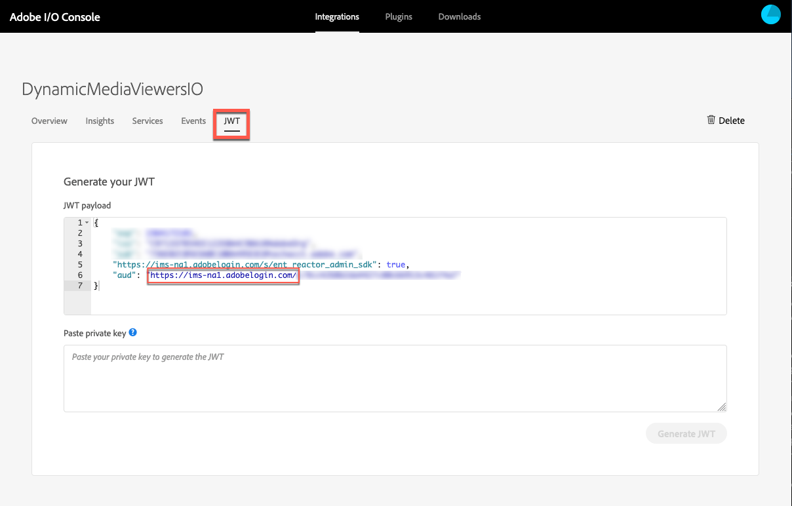

# Integración de visualizadores de Dynamic Media con Adobe Analytics y Adobe Launch {#integrating-dynamic-media-viewers-with-adobe-analytics-and-adobe-launch}

## ¿Qué es la integración de visores de Dynamic Media con Adobe Analytics y Adobe Launch? {#what-is-dynamic-media-viewers-integration-with-adobe-analytics-and-adobe-launch}

La nueva *extensión de visores de Dynamic Media* para Adobe Launch, junto con la reciente versión de visores de Dynamic Media 5.13, permite a los clientes de Dynamic Media, Adobe Analytics y Adobe Launch utilizar eventos y datos específicos para los visores de Dynamic Media en su configuración de inicio de Adobe.

Esta integración significa que puede rastrear el uso de los visores de Dynamic Media en su sitio web con Adobe Analytics. Al mismo tiempo, puede utilizar los eventos y datos expuestos por los visores con cualquier otra extensión de Launch que provenga de Adobe o de terceros.

Consulte [Extensiones de Adobe](https://experienceleague.adobe.com/docs/launch/using/extensions-ref/overview.html#adobe-extension) en la Guía del usuario del Experience Platform Launch para obtener más información sobre las extensiones.

**Quién debe leer esta documentación:** Administradores de sitio, desarrolladores de la plataforma AEM y los integrantes del equipo de Operaciones.

### Limitaciones de la integración {#limitations-of-the-integration}

* La integración de inicio de Adobe para visores de Dynamic Media no funciona en el nodo de creación de AEM. No puede ver ningún seguimiento de una página WCM hasta que se publique.
* La integración de inicio de Adobe para visores de Dynamic Media no se admite en el modo de operación &quot;emergente&quot;, donde la URL del visor se obtiene mediante el botón &quot;URL&quot; de la página Detalles del recurso.
* La integración de inicio de Adobe no se puede usar simultáneamente con la integración de Analytics de visores heredados (mediante el parámetro `config2=`).
* La compatibilidad con el seguimiento de vídeo está limitada únicamente al seguimiento de reproducción principal, como se describe en [Información general de seguimiento](https://experienceleague.adobe.com/docs/media-analytics/using/sdk-implement/track-av-playback/track-core-overview.html#player-events). En concreto, no se admite el seguimiento de QoS, anuncios, capítulos/segmentos o errores.
* La configuración de duración de almacenamiento para elementos de datos no se admite para elementos de datos con la extensión *visores de Dynamic Media*. La duración del almacenamiento debe establecerse en **[!UICONTROL None]**.

### Casos de uso para la integración {#use-cases-for-the-integration}

El principal caso de uso de la integración con Adobe Launch son los clientes que utilizan AEM Assets y AEM Sites. En estos casos, puede configurar una integración estándar entre el nodo AEM autor y Adobe Launch y, a continuación, asociar la instancia de Sitios con la propiedad Adobe Launch. Después de esto, cualquier componente WCM de Dynamic Media agregado a una página Sitios rastreará datos y eventos de los visores.

Consulte [Acerca del seguimiento de visores de Dynamic Media en AEM Sites](https://wiki.corp.adobe.com/display/~oufimtse/Dynamic+Media+Viewers+integration+with+Adobe+Launch#DynamicMediaViewersintegrationwithAdobeLaunch-TrackingDynamicMediaViewersinAEMSites).

Un caso de uso secundario que admite la integración son aquellos clientes que solo usan AEM Assets o Dynamic Media Classic. En estos casos, se obtiene el código incrustado del visor y se agrega a la página web. A continuación, obtenga la URL de producción de la biblioteca de lanzamiento de Adobe desde Inicio de Adobe y agréguela manualmente al código de la página web.

Consulte [Acerca del seguimiento de los visores de Dynamic Media mediante código incrustado](https://wiki.corp.adobe.com/display/~oufimtse/Dynamic+Media+Viewers+integration+with+Adobe+Launch#DynamicMediaViewersintegrationwithAdobeLaunch-TrackingDynamicMediaViewersusingEmbedcode).

## Cómo funciona el seguimiento de datos y eventos en la integración {#how-data-and-event-tracking-works-in-the-integration}

La integración aprovecha dos tipos independientes de seguimiento de visores de Dynamic Media: *Adobe Analytics* y *Adobe Analytics para audio y video*.

### Acerca del seguimiento mediante Adobe Analytics {#about-tracking-using-adobe-analytics}

Adobe Analytics permite rastrear las acciones que realiza el usuario final cuando interactúa con los visores de Dynamic Media en el sitio web. Adobe Analytics también permite realizar un seguimiento de los datos específicos del visor. Por ejemplo, puede rastrear y registrar eventos de carga de vista junto con el nombre del recurso, las acciones de zoom que se hayan producido, las acciones de reproducción de vídeo, etc.

En Adobe Launch, los conceptos de *Elementos de datos* y *Reglas* funcionan juntos para habilitar el seguimiento de Adobe Analytics.

#### Acerca de los elementos de datos en el lanzamiento de Adobe {#about-data-elements-in-adobe-launch}

Un elemento de datos en Inicio de Adobe es una propiedad con nombre cuyo valor se define estáticamente o se calcula dinámicamente en función del estado de una página web o de los datos de los visores de Dynamic Media.

Las opciones disponibles para una definición de elemento de datos dependen de la lista de extensiones instaladas en la propiedad de inicio de Adobe. La extensión &quot;Core&quot; está preinstalada y está disponible de forma predeterminada en cualquier configuración. Esta extensión &quot;Core&quot; permite definir un elemento de datos cuyo valor proviene de una cookie, código JavaScript, cadena de consulta y muchas otras fuentes.

Para el seguimiento de Adobe Analytics, es necesario instalar varias extensiones adicionales, tal como se describe en [Instalación y configuración de extensiones](#installing-and-setup-of-extensions). La extensión Visores de Dynamic Media permite definir un elemento de datos que es un argumento del evento de visor dinámico. Por ejemplo, es posible hacer referencia al tipo de visor, o al nombre del recurso que el visor ha informado al cargar, al nivel de zoom que se registra cuando el usuario final amplía y mucho más.

La extensión del visor de Dynamic Media mantiene los valores de sus elementos de datos actualizados automáticamente.

Después de definirlo, se puede utilizar un elemento de datos en otros lugares de la interfaz de usuario de inicio de Adobe mediante el widget de selector de elementos de datos. En particular, la acción Configurar variables de la extensión Adobe Analytics hará referencia a los elementos de datos definidos para el seguimiento de visores de Dynamic Media en Regla (véase más abajo).

Consulte [Elementos de datos](https://experienceleague.adobe.com/docs/launch/using/reference/manage-resources/data-elements.html#reference) en la Guía del usuario del Experience Platform Launch para obtener más información.

#### Acerca de las reglas en el lanzamiento de Adobe {#about-rules-in-adobe-launch}

Una regla en Inicio de Adobe es una configuración agnóstica que define tres áreas que conforman una regla: *Eventos*, *Condiciones* y *Acciones*:

* *Los eventos*  (si) indican a Inicio de Adobe cuándo se debe déclencheur una regla.
* *Las condiciones*  (si) indican a Adobe Launch qué restricciones adicionales se permiten o no al activar una regla.
* *Las acciones*  (entonces) indican a Adobe Launch qué hacer cuando se activa una regla.

Las opciones disponibles en la sección Eventos, condiciones y acciones dependen de las extensiones instaladas en la propiedad de inicio de Adobe. La extensión *Core* está preinstalada y disponible de forma predeterminada en cualquier configuración. La extensión proporciona varias opciones para Eventos, como acciones básicas a nivel de explorador que incluyen cambios de enfoque, pulsaciones de teclas, envíos de formularios, etc. También incluye opciones para Condiciones, como el valor de la cookie, el tipo de explorador y mucho más. Para Acciones, solo está disponible la opción Código personalizado.

Para el seguimiento de Adobe Analytics, se deben instalar varias extensiones adicionales, tal como se describe en [Instalación y configuración de extensiones](#installing-and-setup-of-extensions). Específicamente:

* La extensión de visores de Dynamic Media amplía la lista de Eventos admitidos a eventos específicos de visores de Dynamic Media, como la carga del visor, el intercambio de recursos, el zoom y la reproducción de vídeo.
* La extensión Adobe Analytics amplía la lista de acciones admitidas con dos acciones necesarias para enviar datos a los servidores de seguimiento: *Establecer variables* y *Enviar señalización*.

Para rastrear los visores de Dynamic Media es posible utilizar cualquier tipo de lo siguiente:

* Eventos de la extensión de visores de Dynamic Media, de la extensión Core o de cualquier otra extensión.
* Condiciones de la definición de regla. O bien, puede dejar el área de condiciones vacío.

En la sección Acciones, es necesario que tenga una acción *Establecer variables*. Esta acción indica a Adobe Analytics cómo rellenar las variables de seguimiento con datos. Al mismo tiempo, la acción *Establecer variables* no envía nada al servidor de seguimiento.

La acción *Establecer variables* debe ir seguida de una acción *Enviar señalización*. La acción *Enviar señalización* realmente envía datos al servidor de seguimiento de Analytics. Ambas acciones, *Establecer variables* y *Enviar señalización*, provienen de la extensión Adobe Analytics.

Consulte [Reglas](https://experienceleague.adobe.com/docs/launch/using/reference/manage-resources/rules.html#reference) en la Guía del usuario del Experience Platform Launch para obtener más información.

#### Configuración de muestra {#sample-configuration}

La siguiente configuración de muestra en Inicio de Adobe muestra cómo rastrear un nombre de recurso al cargar el visor.

1. En la ficha **[!UICONTROL Elementos de datos]**, defina un elemento de datos `AssetName` que haga referencia al parámetro `asset` del evento `LOAD` de la extensión de visores de Dynamic Media.

   

1. En la ficha **[!UICONTROL Reglas]**, defina una regla *TrackAssetOnLoad*.

   En esta regla, el campo **[!UICONTROL Evento]** utiliza el evento **[!UICONTROL CARGA]** de la extensión Visores de Dynamic Media.

   

1. La configuración de acción tiene dos tipos de acciones de la extensión Adobe Analytics:

   *Configure las variables*, que asignan una variable de análisis de su elección al valor del elemento  `AssetName` de datos.

   *Enviar señalización*, que envía información de seguimiento a Adobe Analytics.

   

1. La configuración de regla resultante tiene el siguiente aspecto:

   

### Acerca de Adobe Analytics para audio y vídeo {#about-adobe-analytics-for-audio-and-video}

Cuando se suscribe una cuenta de Experience Cloud para usar Adobe Analytics para audio y vídeo, basta con habilitar el seguimiento de vídeo en la configuración de la extensión *Visores de Dynamic Media*. Las métricas de vídeo están disponibles en Adobe Analytics. El seguimiento de vídeo depende de la presencia de Adobe Media Analytics para la extensión de audio y vídeo.

Consulte [Instalación y configuración de extensiones](#installing-and-setup-of-extensions).

Actualmente, la compatibilidad con el seguimiento de videos está limitada al seguimiento de &quot;reproducción central&quot; solamente, como se describe en [Información general de seguimiento](https://experienceleague.adobe.com/docs/media-analytics/using/sdk-implement/track-av-playback/track-core-overview.html#player-events). En concreto, no se admite el seguimiento de QoS, anuncios, capítulos/segmentos o errores.

## Uso de la extensión de visores de Dynamic Media {#using-the-dynamic-media-viewers-extension}

Como se indica en [Casos de uso para la integración](#use-cases-for-the-integration), es posible rastrear los visores de Dynamic Media con la nueva integración de Adobe Launch en AEM Sites y mediante el uso de código incrustado.

### Seguimiento de visores de Dynamic Media en AEM Sites {#tracking-dynamic-media-viewers-in-aem-sites}

Para realizar el seguimiento de los visores de Dynamic Media en AEM Sites, deben realizarse todos los pasos enumerados en la sección [Configuración de todas las piezas de integración](#configuring-all-the-integration-pieces). Específicamente, debe crear la configuración de IMS y la configuración de la nube de inicio de Adobe.

Después de realizar la configuración adecuada, cualquier visor de Dynamic Media que agregue a una página Sitios mediante un componente WCM admitido por Dynamic Media rastreará automáticamente los datos en Adobe Analytics, Adobe Analytics para vídeo o ambos.

Consulte [Añadir recursos de Dynamic Media a páginas mediante sitios de Adobe](/help/assets/dynamic-media/adding-dynamic-media-assets-to-pages.md).

### Seguimiento de visores de Dynamic Media mediante código incrustado {#tracking-dynamic-media-viewers-using-embed-code}

Los clientes que no utilicen AEM Sites o incrusten visores de Dynamic Media en páginas web fuera de AEM Sites, o en ambas, pueden seguir utilizando la integración de Adobe Launch.

Debe completar los pasos de configuración desde las secciones [Configuración de Adobe Analytics](#configuring-adobe-analytics-for-the-integration) y [Configuración de Adobe Launch](#configuring-adobe-launch-for-the-integration). Sin embargo, no es necesario realizar pasos de configuración relacionados con AEM.

Una vez configurada correctamente, puede añadir compatibilidad con Inicio de Adobe a una página web con un visor de Dynamic Media.

Consulte [Añadir el código incrustado de inicio](https://experienceleague.adobe.com/docs/launch-learn/implementing-in-websites-with-launch/configure-launch/launch-add-embed.html#configure-launch) para obtener más información sobre cómo utilizar el código incrustado de la biblioteca de inicio de Adobe.

Consulte [Incrustación del visor de imágenes o vídeos en una página Web](/help/assets/dynamic-media/embed-code.md) para obtener más información sobre cómo utilizar la función de código incrustado de AEM Dynamic Media.

**Para realizar el seguimiento de los visores de Dynamic Media mediante código incrustado**

1. Tenga una página web lista para incrustar un visor de Dynamic Media.
1. Obtenga el código incrustado de la biblioteca de lanzamiento de Adobe iniciando sesión en Inicio de Adobe en primer lugar (consulte [Configuración de inicio de Adobe](#configuring-adobe-launch-for-the-integration)).
1. Haga clic en **[!UICONTROL Propiedad]** y, a continuación, haga clic en la ficha **[!UICONTROL Entornos]**.
1. Recoge el nivel de Entorno relevante para el entorno de la página web. A continuación, en la columna **[!UICONTROL Instalar]**, haga clic en el icono de cuadro.
1. **[!UICONTROL En el cuadro de diálogo]** Instrucciones de instalación web, copie el código incrustado completo de la biblioteca de inicio de Adobe, junto con  `<script/>` las etiquetas que lo rodean.

## Guía de referencia para la extensión de visores de Dynamic Media {#reference-guide-for-the-dynamic-media-viewers-extension}

### Acerca de la configuración de visores de Dynamic Media {#about-the-dynamic-media-viewers-configuration}

La extensión del visor de Dynamic Media se integra automáticamente con la biblioteca de lanzamiento de Adobe si se cumplen todas las condiciones siguientes:

* El objeto global de la biblioteca de inicio de Adobe ( `_satellite`) está presente en la página.
* La función de extensión de visores de Dynamic Media `_dmviewers_v001()` se define en `_satellite`.

* `config2=` no se ha especificado el parámetro de visor, lo que significa que el visor no utiliza la integración de Analytics heredada.

Además, existe una opción para deshabilitar explícitamente la integración de Adobe Launch en el visor especificando el parámetro `launch=0` en la configuración del visor. El valor predeterminado de este parámetro es `1`.

### Configuración de la extensión de visores de Dynamic Media {#configuring-the-dynamic-media-viewers-extension}

La única opción de configuración para la extensión Visores de Dynamic Media es **[!UICONTROL Habilitar Adobe Media Analytics para audio y vídeo]**.

Al marcar (activar o &quot;activar&quot;) esta opción, y si Adobe Media Analytics para la extensión de audio y vídeo está instalado y configurado correctamente, las métricas de reproducción de vídeo se envían a la solución Adobe Analytics para audio y vídeo. Al desactivar esta opción, se desactiva el seguimiento de vídeo.

Tenga en cuenta que si habilita esta opción *sin* tener instalada la extensión de Adobe Media Analytics para audio y vídeo, la opción no tendrá ningún efecto.

### Acerca de los elementos de datos en la extensión de visores de Dynamic Media {#about-data-elements-in-the-dynamic-media-viewers-extension}

El único tipo de elemento de datos que proporciona la extensión Visualizadores de Dynamic Media es el **[!UICONTROL Evento de visualizador]** de la lista desplegable **[!UICONTROL Tipo de elemento de datos]**.

Cuando se selecciona, el editor de elementos de datos procesa un formulario con dos campos:

* **[!UICONTROL Tipo de datos de evento de visualizadores de DM]**: Una lista desplegable que identifica todos los eventos de visualizador admitidos por la extensión de visualizadores de Dynamic Media que tienen argumentos, además de un elemento especial **[!UICONTROL COMÚN]**. Un elemento **[!UICONTROL COMÚN]** representa una lista de parámetros de evento que son comunes a todos los tipos de eventos enviados por los visualizadores.
* **[!UICONTROL Parámetro]**  de seguimiento: un argumento del evento del visor de Dynamic Media seleccionado.

Consulte la [guía de referencia de visores de Dynamic Media](https://experienceleague.adobe.com/docs/dynamic-media-developer-resources/library/viewers-aem-assets-dmc/c-html5-s7-aem-asset-viewers.html) para ver la lista de eventos admitidos por cada tipo de visor; vaya a una sección específica del visor y, a continuación, haga clic en la subsección Compatibilidad con el seguimiento de Adobe Analytics. Actualmente, la guía de referencia de visores de Dynamic Media no documento argumentos de evento.

Consideremos ahora el ciclo de vida de los visores de Dynamic Media *Elemento de datos*. El valor de dicho elemento de datos se rellena después de que se produzca el evento correspondiente del visor de Dynamic Media en la página. Por ejemplo, si el elemento de datos apunta al evento **[!UICONTROL LOAD]** y su argumento &quot;asset&quot;, el valor de dicho elemento de datos recibirá datos válidos después de que el visor ejecute el evento LOAD por primera vez. Si el elemento de datos apunta al evento **[!UICONTROL ZOOM]** y su argumento de &quot;escala&quot;, el valor de dicho elemento de datos permanecerá vacío hasta que el visor envíe un evento **[!UICONTROL ZOOM]** por primera vez.

Del mismo modo, los valores de los elementos de datos se actualizan automáticamente cuando el visor envía un evento correspondiente a la página. La actualización de valor se produce incluso si el evento concreto no se especifica en la configuración de regla. Por ejemplo, si **[!UICONTROL ZoomScale]** de elemento de datos está definido para el parámetro “scale” del evento ZOOM, pero la única regla presente en la configuración de regla se activa mediante el evento **[!UICONTROL LOAD]**, el valor de **[!UICONTROL ZoomScale]** se actualiza cada vez que un usuario ejecuta zoom dentro del visualizador.

Cualquier visualizador de Dynamic Media tiene un identificador único en la página web. El elemento de datos realiza un seguimiento del valor mismo y del visualizador que lo ha propagado. Esto significa que si hay varios visualizadores en la misma página y un elemento de datos **[!UICONTROL AssetName]** que señala al evento **[!UICONTROL LOAD]** y a su argumento “asset”; el elemento de datos **[!UICONTROL AssetName]** mantiene una colección de nombres de recursos asociados a cada visualizador cargado en la página.

El valor exacto que devuelve el elemento de datos depende del contexto. Si el elemento de datos se solicita en una regla que se activó con un evento del visor de Dynamic Media, se devuelve el valor del elemento de datos para el visor que inició la regla. Y, si el elemento de datos se solicita en una regla que se activó con un Evento de otra extensión de Inicio de Adobe, entonces el valor del elemento de datos es el valor del visor que fue el último en actualizar este elemento de datos.

**Considere la siguiente configuración** de muestra:

* Una página web con dos visores de zoom Dynamic Media; los referiremos como *visor1* y *visor2*.

* **[!UICONTROL El elemento]** ZoomScaleData señala al  **** evento ZOOM y su argumento &quot;scale&quot;.
* **** TrackPanRule con lo siguiente:

   * Utiliza el evento de Dynamic Media Viewer **[!UICONTROL PAN]** como déclencheur.
   * Envía el valor del elemento de datos **[!UICONTROL ZoomScale]** a Adobe Analytics.

* **** TrackKeyRule con lo siguiente:

   * Utiliza el evento de prensa clave de la extensión Inicio de Adobe principal como déclencheur.
   * Envía el valor del elemento de datos **[!UICONTROL ZoomScale]** a Adobe Analytics.

Ahora, supongamos que el usuario final carga la página web con los dos visores. En *viewer1*, se amplía al 50% de la escala; a continuación, en *viewer2*, se acercan a una escala del 25 %. En *viewer1*, recorren la imagen y finalmente presionan una tecla en el teclado.

La actividad del usuario final resulta en que se realicen las dos llamadas de seguimiento siguientes a Adobe Analytics:

* La primera llamada se produce porque la regla **[!UICONTROL TrackPan]** se activa cuando el usuario ingresa a *viewer1*. Esa llamada envía el 50 % como valor del elemento de datos **[!UICONTROL ZoomScale]** porque el elemento de datos sabrá que la regla se activa por *viewer1* y obtiene el valor de escala correspondiente;
* La segunda llamada se produce porque la regla **[!UICONTROL TrackKey]** se activa cuando el usuario presiona una tecla en el teclado. Esa llamada envía el 25 % como valor del elemento de datos **[!UICONTROL ZoomScale]** porque el visor no activó la regla. Como tal, el elemento de datos devuelve el valor más actualizado.

El ejemplo configurado arriba también afecta a la duración del valor del elemento de datos. El valor del elemento de datos administrado por el visor de Dynamic Media se almacena en el código de la biblioteca de inicio de Adobe incluso después de que el propio visor se haya eliminado de la página web. Esto significa que si hay una regla que se activa por una extensión que no es de Dynamic Media Viewer y hace referencia a dicho elemento de datos, el elemento de datos devuelve el último valor conocido, incluso si el visor ya no está presente en la página web.

En cualquier caso, los valores de los elementos de datos impulsados por los visores de Dynamic Media no se almacenan en el almacenamiento local ni en el servidor; en su lugar, solo se guardan en la biblioteca de inicio de Adobe del lado del cliente. Los valores de dicho elemento de datos desaparecen cuando se vuelve a cargar la página web.

Generalmente, el editor de elementos de datos admite la selección de [duración del almacenamiento](https://experienceleague.adobe.com/docs/launch/using/reference/manage-resources/data-elements.html?lang=en#create-a-data-element). Sin embargo, los elementos de datos que utilizan la extensión Visores de Dynamic Media solo admiten la opción de duración de almacenamiento **[!UICONTROL None]**. En la interfaz de usuario es posible establecer cualquier otro valor, pero en este caso no se define el comportamiento de los elementos de datos. La extensión administra por sí sola el valor del elemento de datos: el elemento de datos que mantiene el valor del argumento de evento del visor durante todo el ciclo de vida del visor.

### Acerca de las reglas en la extensión de visores de Dynamic Media {#about-rules-in-the-dynamic-media-viewers-extension}

En el editor de reglas, la extensión agrega nuevas opciones de configuración para el editor de Eventos. También proporciona una opción para hacer referencia manualmente a los parámetros de evento en el editor de acciones como una opción de mano corta en lugar de utilizar elementos de datos preconfigurados.

#### Acerca del editor de Eventos {#about-the-events-editor}

En el editor de eventos, la extensión Visualizadores de medios dinámicos agrega un nuevo **[!UICONTROL Tipo de evento]** denominado **[!UICONTROL Evento de visualizador]**.

Cuando se selecciona, el editor de Evento procesa la lista desplegable **[!UICONTROL eventos del visor de Dynamic Media]**, que enumera todos los eventos disponibles que admiten los visores de Dynamic Media.

#### Acerca del editor de acciones {#about-the-actions-editor}

La extensión Visores de Dynamic Media le permite utilizar parámetros de evento de visores de Dynamic Media para asignarlos a variables de análisis en el editor Definir variables de la extensión de Adobe Analytics.

El método más sencillo para hacerlo es completar el siguiente proceso de dos pasos:

* En primer lugar, defina uno o varios elementos de datos, donde cada elemento de datos representa un parámetro de un evento de visor de Dynamic Media.
* Por último, en el editor Establecer variables de la extensión Adobe Analytics, haga clic en el icono Selector de elementos de datos (tres discos apilados) para abrir el cuadro de diálogo Seleccionar elemento de datos y, a continuación, seleccione un elemento de datos en él.

Sin embargo, es posible utilizar un enfoque alternativo y evitar la creación de elementos de datos. Puede hacer referencia directamente a un argumento de un evento de visualizador de Dynamic Media introduciendo el nombre completo del argumento de evento en el campo de entrada de **[!UICONTROL valor]** de la asignación de variables de Analytics, rodeado de signos de porcentaje (%). Por ejemplo,

`%event.detail.dm.LOAD.asset%`

Tenga en cuenta que existe una diferencia importante entre el uso de elementos de datos y la referencia directa de argumentos de evento. Para el elemento de datos, no importa qué evento déclencheur la acción Definir variables, el evento que déclencheur la regla puede no estar relacionado con el visor dinámico (como un clic del ratón en la página web desde la extensión Core). Sin embargo, al utilizar una referencia de argumento directa es importante asegurarse de que el evento que déclencheur la regla corresponde al argumento de evento al que hace referencia.

Por ejemplo, la referencia `%event.detail.dm.LOAD.asset%` devuelve el nombre de recurso correcto si la regla se activa mediante el evento **[!UICONTROL LOAD]** de la extensión del visualizador de Dynamic Media. Sin embargo, devuelve un valor vacío para cualquier otro evento.

La tabla siguiente lista los eventos del visor de Dynamic Media y sus argumentos admitidos:

<table>
 <tbody>
  <tr>
   <td>Nombre del evento del visor</td>
   <td>Referencia de argumento</td>
  </tr>
  <tr>
   <td><code>COMMON</code></td>
   <td><code>%event.detail.dm.objID%</code></td>
  </tr>
  <tr>
   <td> </td>
   <td><code>%event.detail.dm.compClass%</code></td>
  </tr>
  <tr>
   <td> </td>
   <td><code>%event.detail.dm.instName%</code></td>
  </tr>
  <tr>
   <td> </td>
   <td><code>%event.detail.dm.timeStamp%</code></td>
  </tr>
  <tr>
   <td><code>BANNER</code> </td>
   <td><code>%event.detail.dm.BANNER.asset%</code></td>
  </tr>
  <tr>
   <td> </td>
   <td><code>%event.detail.dm.BANNER.frame%</code></td>
  </tr>
  <tr>
   <td> </td>
   <td><code>%event.detail.dm.BANNER.label%</code></td>
  </tr>
  <tr>
   <td><code>HREF</code></td>
   <td><code>%event.detail.dm.HREF.rollover%</code></td>
  </tr>
  <tr>
   <td><code>ITEM</code></td>
   <td><code>%event.detail.dm.ITEM.rollover%</code></td>
  </tr>
  <tr>
   <td><code>LOAD</code></td>
   <td><code>%event.detail.dm.LOAD.applicationname%</code></td>
  </tr>
  <tr>
   <td><strong> </strong></td>
   <td><code>%event.detail.dm.LOAD.asset%</code></td>
  </tr>
  <tr>
   <td><strong> </strong></td>
   <td><code>%event.detail.dm.LOAD.company%</code></td>
  </tr>
  <tr>
   <td><strong> </strong></td>
   <td><code>%event.detail.dm.LOAD.sdkversion%</code></td>
  </tr>
  <tr>
   <td><strong> </strong></td>
   <td><code>%event.detail.dm.LOAD.viewertype%</code></td>
  </tr>
  <tr>
   <td><strong> </strong></td>
   <td><code>%event.detail.dm.LOAD.viewerversion%</code></td>
  </tr>
  <tr>
   <td><code>METADATA</code></td>
   <td><code>%event.detail.dm.METADATA.length%</code></td>
  </tr>
  <tr>
   <td> </td>
   <td><code>%event.detail.dm.METADATA.type%</code></td>
  </tr>
  <tr>
   <td><code>MILESTONE</code></td>
   <td><code>%event.detail.dm.MILESTONE.milestone%</code></td>
  </tr>
  <tr>
   <td><code>PAGE</code></td>
   <td><code>%event.detail.dm.PAGE.frame%</code></td>
  </tr>
  <tr>
   <td> </td>
   <td><code>%event.detail.dm.PAGE.label%</code></td>
  </tr>
  <tr>
   <td><code>PAUSE</code></td>
   <td><code>%event.detail.dm.PAUSE.timestamp%</code></td>
  </tr>
  <tr>
   <td><code>PLAY</code></td>
   <td><code>%event.detail.dm.PLAY.timestamp%</code></td>
  </tr>
  <tr>
   <td><code>SPIN</code></td>
   <td><code>%event.detail.dm.SPIN.framenumber%</code></td>
  </tr>
  <tr>
   <td><code>STOP</code></td>
   <td><code>%event.detail.dm.STOP.timestamp%</code></td>
  </tr>
  <tr>
   <td><code>SWAP</code></td>
   <td><code>%event.detail.dm.SWAP.asset%</code></td>
  </tr>
  <tr>
   <td><code>SWATCH</code></td>
   <td><code>%event.detail.dm.SWATCH.frame%</code></td>
  </tr>
  <tr>
   <td> </td>
   <td><code>%event.detail.dm.SWATCH.label%</code></td>
  </tr>
  <tr>
   <td><code>TARG</code></td>
   <td><code>%event.detail.dm.TARG.frame%</code></td>
  </tr>
  <tr>
   <td> </td>
   <td><code>%event.detail.dm.TARG.label%</code></td>
  </tr>
  <tr>
   <td><code>ZOOM</code></td>
   <td><code>%event.detail.dm.ZOOM.scale%</code></td>
  </tr>
 </tbody>
</table>

## Configuración de todas las piezas de integración {#configuring-all-the-integration-pieces}

**ANTES DE COMENZAR**

Si aún no lo ha hecho, Adobe recomienda que revise a fondo toda la documentación anterior a esta sección para que pueda comprender la integración completa.

En esta sección se explican los pasos de configuración necesarios para integrar los visores de Dynamic Media con Adobe Analytics y Adobe Analytics para audio y vídeo. Aunque es posible utilizar la extensión de visores de Dynamic Media para otros fines en Adobe Launch, estos escenarios no se incluyen en esta documentación.

La integración se configurará en los siguientes productos de Adobe:

* Adobe Analytics: configurará variables e informes de seguimiento.
* Inicio de Adobe: definirá una propiedad, una o varias reglas y uno o varios elementos de datos para habilitar el seguimiento del visor.

Además, si esta solución de integración se utiliza con AEM Sites, también se debe realizar la siguiente configuración:

* Adobe I/O Console: la integración se crea para Adobe Launch.
* AEM nodo de creación: configuración de IMS y configuración de nube de inicio de Adobe.

Como parte de la configuración, asegúrese de tener acceso a una compañía en Adobe Experience Cloud que ya tenga Adobe Analytics y Adobe Launch activados.

## Configuración de Adobe Analytics para la integración {#configuring-adobe-analytics-for-the-integration}

Después de configurar Adobe Analytics, se configurará lo siguiente para la integración:

* Se ha seleccionado un grupo de informes.
* Las variables de Analytics están disponibles para recibir datos de seguimiento.
* Los informes están disponibles para la vista de datos recopilados dentro de Adobe Analytics.

Consulte también [Guía de implementación de Analytics](https://experienceleague.adobe.com/docs/analytics/implementation/home.html).

**Para configurar Adobe Analytics para la integración**:

1. Inicio accediendo a Adobe Analytics desde la Experience Cloud [página de inicio](https://exc-home.experiencecloud.adobe.com/exc-home/home.html#/). En la barra de menús, haga clic en el icono Soluciones (una tabla de puntos de tres por tres) cerca de la esquina superior derecha de la página y, a continuación, haga clic en **[!UICONTROL Analytics]**.

   

   Ahora seleccionará un grupo de informes.

### Selección de un grupo de informes {#selecting-a-report-suite}

1. Cerca de la esquina superior derecha de la página Adobe Analytics, a la derecha del campo **[!UICONTROL Buscar informes]**, seleccione el grupo de informes correcto en la lista desplegable. Si hay varios grupos de informes disponibles y no está seguro de cuál usar, póngase en contacto con el administrador de Adobe Analytics, que le ayudará a seleccionar qué grupo de informes utilizar.

   En la siguiente ilustración, un usuario creó un grupo de informes denominado *DynamicMediaViewersExtensionDoc* y lo seleccionó en la lista desplegable. El nombre del grupo de informes se muestra únicamente con fines ilustrativos; el nombre del grupo de informes que seleccione en última instancia será distinto.

   Si no hay ningún grupo de informes disponible, usted o el administrador de Adobe Analytics deben crear uno para poder continuar con la configuración.

   Consulte [Informes y grupos de informes](https://experienceleague.adobe.com/docs/analytics/admin/manage-report-suites/report-suites-admin.html#manage-report-suites) y [Creación de un grupo de informes](https://experienceleague.adobe.com/docs/analytics/admin/admin-console/create-report-suite.html#admin-console).

   En Adobe Analytics, los grupos de informes se administran en **[!UICONTROL Administración > Grupos de informes]**.

   

   Ahora configurará variables de Adobe Analytics.

### Configuración de variables de Adobe Analytics {#setting-up-adobe-analytics-variables}

1. Ahora designará una o varias variables de Adobe Analytics que desee utilizar para rastrear el comportamiento de los visores de Dynamic Media en la página web.

   Es posible utilizar cualquier tipo de variable admitida por Adobe Analytics. La decisión sobre el tipo de variable (como Tráfico personalizado [props], Conversión [eVar]) debe estar motivada por las necesidades específicas de la implementación de Analytics.

   Consulte [Información general de props y eVars](https://experienceleague.adobe.com/docs/analytics/implementation/vars/page-vars/evar.html#vars).

   A efectos de esta documentación, solo se utilizará una variable de tráfico personalizado (props) porque estará disponible en un informe de Analytics en los pocos minutos siguientes a que se produzca una acción en una página web.

   Para habilitar una nueva variable de tráfico personalizado, en Adobe Analytics, en la barra de herramientas, haga clic en **[!UICONTROL Administración > Grupos de informes]**.

1. En la página **[!UICONTROL Administrador de grupos de informes]**, seleccione el informe correcto y, en la barra de herramientas, haga clic en **[!UICONTROL Editar configuración > Tráfico > Variables de tráfico]**.
1. Allí, tome la variable no utilizada, asígnele un nombre descriptivo ( **[!UICONTROL Recurso del visor (prop 30)]**) y cambie el cuadro combinado a &quot;Habilitado&quot; en la columna Habilitado.

   La siguiente captura de pantalla es un ejemplo de una variable de tráfico personalizado ( **[!UICONTROL prop30]**) para rastrear el nombre de un recurso utilizado por el visor:

   

1. En la parte inferior de la lista de variables, haga clic en **[!UICONTROL Guardar]**.

### Configuración de un informe {#setting-up-a-report}

1. En general, la configuración de un informe en Adobe Analytics depende de las necesidades específicas del proyecto. Como tal, la configuración detallada del informe está fuera del alcance de esta integración.

   Sin embargo, es suficiente para saber que los informes de tráfico personalizado estarán disponibles automáticamente en Adobe Analytics después de configurar las variables de tráfico personalizado en **[Configuración de variables de Adobe Analytics](#setting-up-adobe-analytics-variables)**.

   Por ejemplo: el informe para la variable de **[!UICONTROL recurso del visualizador (prop 30)]** está disponible en el menú Informes en **[!UICONTROL Tráfico personalizado > Tráfico personalizado 21-30 > Recurso del visualizador (prop 30)]**.

   Al visitar este informe justo después de la creación de **[!UICONTROL Recursos del visualizador (prop 30)]**, no se muestra ningún dato; esto se espera en este punto de la integración.

   

## Configuración del lanzamiento de Adobe para la integración {#configuring-adobe-launch-for-the-integration}

Después de configurar Inicio de Adobe, se configurará lo siguiente para la integración:

* La creación de una nueva propiedad para mantener todas las configuraciones juntas.
* Instalación y configuración de extensiones. El código de cliente de todas las extensiones instaladas en la propiedad se compila en una biblioteca. Esta biblioteca se utiliza más adelante en la página web.
* Configuración de elementos de datos y reglas. Esta configuración define los datos que se van a capturar desde los visores de Dynamic Media, cuándo se va a realizar el déclencheur de la lógica de seguimiento y dónde se deben enviar los datos del visor en Adobe Analytics.
* Publicación de la biblioteca.

**Para configurar Adobe Launch para la integración**:

1. Inicio accediendo a Adobe Launch desde el Experience Cloud [página de inicio](https://exc-home.experiencecloud.adobe.com/exc-home/home.html#/). En la barra de menús, haga clic en el icono Soluciones (tres por tres tablas de puntos) cerca de la esquina superior derecha de la página y, a continuación, haga clic en **[!UICONTROL Iniciar]**.

   También puede [abrir Inicio de Adobe directamente](https://launch.adobe.com/).

   

### Creación de una propiedad en Inicio de Adobe {#creating-a-property-in-adobe-launch}

Una propiedad de Inicio de Adobe es una configuración con nombre que mantiene todas las opciones de configuración juntas. Se genera una biblioteca de los ajustes de configuración que se publica en diferentes niveles de entorno (desarrollo, ensayo y producción).

Consulte también [Crear una propiedad de inicio](https://experienceleague.adobe.com/docs/launch-learn/implementing-in-mobile-android-apps-with-launch/configure-launch/launch-create-a-property.html#configure-launch).

1. En Inicio de Adobe, haga clic en **[!UICONTROL Nueva propiedad]**.
1. En el cuadro de diálogo **[!UICONTROL Crear propiedad]**, dentro del campo **[!UICONTROL Nombre]**, escriba un nombre descriptivo, como el título del sitio web. Por ejemplo, `DynamicMediaViewersProp.`
1. En el campo **[!UICONTROL Dominios]**, introduzca el dominio del sitio web.
1. En la lista desplegable **[!UICONTROL Opciones avanzadas]**, habilite **[!UICONTROL Configurar para el desarrollo de extensiones (no se puede modificar posteriormente)]** siempre que la extensión que desee utilizar (en este caso, los *visualizadores de Dynamic Media*) aún no se haya publicado.

   

1. Haga clic en **[!UICONTROL Guardar]**.

   Haga clic en la propiedad recién creada y luego continúe con *Instalación y configuración de extensiones*.

### Instalación y configuración de extensiones {#installing-and-setup-of-extensions}

Todas las extensiones disponibles en Inicio de Adobe se enumeran en **[!UICONTROL Extensiones > Catálogo]**.

Para instalar una extensión, haga clic en **[!UICONTROL Instalar]**. Si es necesario, realice una configuración de extensión única y haga clic en **[!UICONTROL Guardar]**.

Cuando sea necesario, deben instalarse y configurarse las siguientes extensiones:

* (Requerido) *Extensión del servicio de ID de Experience Cloud*

No se necesita ninguna configuración adicional, aceptar los valores propuestos. Cuando haya terminado, asegúrese de hacer clic en **[!UICONTROL Guardar]**.

Consulte [Extensión del servicio de ID de Experience Cloud](https://experienceleague.adobe.com/docs/launch/using/extensions-ref/adobe-extension/id-service-extension/overview.html#extensions-ref).

* (Requerido) *Extensión de Adobe Analytics*

Para configurar esta extensión, primero necesitará la ID del grupo de informes que se encuentra en Adobe Analytics, en **[!UICONTROL Administración > Grupode informes]**, en el encabezado de la columna **[!UICONTROL ID del grupo de informes]**.

(Solo con fines de demostración, el ID del grupo de informes **[!UICONTROL DynamicMediaViewersExtensionDoc]** se utilizará en las siguientes capturas de pantalla. Este ID se creó y utilizó en [Selección de un grupo](#selecting-a-report-suite) de informes anteriormente).

En la página Instalar extensión, introduzca la ID del grupo de informes en el campo **[!UICONTROL Grupos de informes de desarrollo]**, en el campo **[!UICONTROL Grupos de informes de ensayo]** y en el campo **[!UICONTROL Grupos de informes de producción]**.

*Configure el siguiente elemento solo si planea utilizar el seguimiento de vídeo:*

En la página **[!UICONTROL Instalar extensión]**, expanda **[!UICONTROL General]** y, a continuación, especifique el Servidor de seguimiento. El Servidor de seguimiento sigue la plantilla `<trackingNamespace>.sc.omtrdc.net`, donde `<trackingNamespace>` es la información obtenida en el correo electrónico de aprovisionamiento.

Haga clic en **[!UICONTROL Guardar]**.

Consulte [Extensión de Adobe Analytics](https://experienceleague.adobe.com/docs/launch/using/extensions-ref/adobe-extension/analytics-extension/overview.html#extensions-ref).

* (Opcional. Solo es necesario si se necesita el seguimiento de vídeo) *extensión de Adobe Media Analytics para audio y vídeo*

Complete el campo del servidor de seguimiento. El servidor de seguimiento para la extensión *Adobe Media Analytics para audio y vídeo* es diferente del servidor de seguimiento utilizado para Adobe Analytics. Sigue la plantilla `<trackingNamespace>.hb.omtrdc.net`, donde `<trackingNamespace>` es la información del correo electrónico de aprovisionamiento.

El resto de campos son opcionales.

Consulte [Adobe Media Analytics para la extensión de audio y vídeo](https://experienceleague.adobe.com/docs/launch/using/extensions-ref/adobe-extension/media-analytics-extension/overview.html#extensions-ref).

* (Requerido) *Extensión de visores de Dynamic Media*

Seleccione **[!UICONTROL habilitar Adobe Analytics para vídeo]** para activar el seguimiento de Video Heartbeat.

Tenga en cuenta que, en el momento de escribir esto, la extensión *Visores de Dynamic Media* solo está disponible si se crea la propiedad de inicio de Adobe para desarrollo.

Consulte [Creación de una propiedad en Inicio de Adobe](#creating-a-property-in-adobe-launch).

Después de instalar y configurar las extensiones, al menos las siguientes cinco extensiones (cuatro si no realiza el seguimiento de vídeo) se enumerarán en el área Extensiones > Instalado.

### Configuración de elementos de datos y reglas {#setting-up-data-elements-and-rules}

En Inicio de Adobe, cree elementos de datos y reglas que sean necesarios para rastrear los visores de Dynamic Media.

Consulte [Cómo funciona el seguimiento de datos y eventos en la integración](#how-data-and-event-tracking-works-in-the-integration) para obtener una visión general del seguimiento con Adobe Launch.

Consulte [Configuración de muestra](#sample-configuration) para obtener una configuración de muestra en Inicio de Adobe que muestra cómo rastrear un nombre de recurso al cargar el visor.

Consulte [Configuración de la extensión de visores de Dynamic Media](#configuring-the-dynamic-media-viewers-extension) para obtener información detallada sobre las capacidades de la extensión.

### Publicación de una biblioteca {#publishing-a-library}

Para realizar cambios en la configuración de Inicio de Adobe (incluida la configuración de Propiedades, Extensiones, Reglas y Elementos de datos), debe *publicar* dichos cambios. La publicación en Adobe Launch se realiza desde la ficha Publicación, en la configuración Propiedad.

Adobe Launch puede tener varios entornos de desarrollo, un entorno de ensayo y un entorno de producción. De forma predeterminada, la configuración de la nube de inicio de Adobe en AEM señala el nodo AEM autor al entorno de fase de Inicio de Adobe y el nodo de publicación AEM al entorno de producción de Inicio de Adobe. Esta disposición significa que con la configuración de AEM predeterminada, es necesario publicar la biblioteca de inicio de Adobe en el entorno de ensayo para utilizarla en AEM autor y, a continuación, publicarla en el entorno de producción para que pueda utilizarse en AEM publicación.

Consulte [Entornos](https://experienceleague.adobe.com/docs/launch/using/reference/publish/environments/environments.html#environment-types) para obtener más información sobre los entornos de inicio de Adobe.

La publicación de una biblioteca implica los dos pasos siguientes:

* Añadir y crear una nueva biblioteca incluyendo todos los cambios necesarios (nuevos y actualizaciones) en la biblioteca.
* Subir la biblioteca por los diferentes niveles de entorno (de desarrollo a ensayo y producción)

#### Añadir y crear una nueva biblioteca {#adding-and-building-a-new-library}

1. La primera vez que abra la ficha Publicación en Inicio de Adobe, la lista de biblioteca estará vacía.

   En la columna izquierda, haga clic en **[!UICONTROL Añadir nueva biblioteca]**.

   

1. En la página Crear nueva biblioteca, en el campo **[!UICONTROL Nombre]**, introduzca un nombre descriptivo para la nueva biblioteca. Por ejemplo,

   *DynamicMediaViewersLib*

   En la lista desplegable Entorno, elija el nivel de Entorno. Inicialmente, solo el nivel de desarrollo está disponible para selección. Cerca del lado inferior izquierdo de la página, haga clic en **[!UICONTROL Añadir todos los recursos cambiados]**.

   

1. Cerca de la esquina superior derecha de la página, haga clic en **[!UICONTROL Guardar y crear para desarrollo]**.

   En pocos minutos, la biblioteca se crea y está lista para usarse.

   

   >[!NOTE]
   >
   >La próxima vez que realice cambios en la configuración de Adobe Launch, vaya a la pestaña **[!UICONTROL Publicación]** en la configuración de la **[!UICONTROL propiedad]** y, a continuación, haga clic en la biblioteca creada anteriormente.
   >
   >
   >En la pantalla de publicación de la biblioteca, haga clic en **[!UICONTROL Añadir todos los recursos cambiados]** y, a continuación, haga clic en **[!UICONTROL Guardar y crear para desarrollo]**.

#### Subir una biblioteca a través de niveles de entorno {#moving-a-library-up-through-environment-levels}

1. Después de agregar una nueva biblioteca, se encuentra inicialmente en el entorno de desarrollo. Para moverlo al nivel de entorno Ensayo (que corresponde a la columna Enviado), en el menú desplegable de la biblioteca, haga clic en **[!UICONTROL Enviar para aprobación]**.

   

1. En el cuadro de diálogo de confirmación, haga clic en **[!UICONTROL Enviar]**.

   Una vez que la biblioteca se desplace a la columna Enviada, en el menú desplegable de la biblioteca, haga clic en **[!UICONTROL Generar para ensayo]**.

   

1. Siga un proceso similar para mover la biblioteca del entorno Ensayo al entorno Producción (que es la columna Publicado).

   Primero, en el menú desplegable, haga clic en **[!UICONTROL Aprobar para publicación]**.

   

1. En el menú desplegable, haga clic en **[!UICONTROL Generar y publicar en producción]**.

   

   Consulte [Publicación](https://experienceleague.adobe.com/docs/launch/using/reference/publish/overview.html#reference) para obtener más información sobre el proceso de publicación en Inicio de Adobe.

## Configuración de Adobe Experience Manager para la integración {#configuring-adobe-experience-manager-for-the-integration}

<!-- Prerequisites list below should be verified by Sasha -->

Requisitos previos:

* AEM ejecuta las instancias Autor y Publicar.
* AEM nodo de autor está configurado en Dynamic Media. <!-- Scene7 run mode (dynamicmedia_s7) -->
* Los componentes de Dynamic Media WCM están activados en AEM Sites.

La configuración AEM consta de los dos pasos principales siguientes:

* Configuración de AEM IMS.
* Configuración de Adobe Launch Cloud.

### Configuración de AEM IMS {#configuring-aem-ims}

1. En AEM autor, haga clic en el icono Herramientas (martillo) y, a continuación, haga clic en **[!UICONTROL Seguridad > Configuraciones de IMS de Adobe]**.

   

1. En la página Configuración de IMC de Adobe, cerca de la esquina superior izquierda, haga clic en **[!UICONTROL Crear]**.
1. En la página **[!UICONTROL Configuración técnica de la cuenta de Adobe IMD]**, en la lista desplegable **[!UICONTROL Soluciones de nube]**, haga clic en **[!UICONTROL Adobe Launch]**.
1. Habilite **[!UICONTROL Crear nuevo certificado]** y, a continuación, en el campo de texto, introduzca cualquier valor significativo para el certificado. Por ejemplo, *AdobeLaunchIMSCert*. Haga clic en **[!UICONTROL Crear certificado]**.

   Se muestra el siguiente mensaje de información:

   *Para recuperar un token de acceso válido, la clave pública del nuevo certificado debe agregarse a la cuenta técnica de Adobe I/O!*.

   Haga clic en **[!UICONTROL Aceptar]** para cerrar el cuadro de diálogo Información.

   

1. Haga clic en **[!UICONTROL Descargar clave pública]** para descargar un archivo de clave pública (`*.crt`) en el sistema local.

   >[!NOTE]
   >
   >En este punto, ***deje abierta*** la página **[!UICONTROL Configuración de cuenta técnica de Adobe IMS]**; ***no*** cierre la página y ***no*** haga clic en Siguiente. Volverá a esta página más adelante en los pasos.

   

1. En una nueva ficha del explorador, navegue a la [Consola de Adobe I/O](https://console.adobe.io/integrations).

1. En la página **[!UICONTROL Integraciones de la consola de Adobe I/O]**, cerca de la esquina superior derecha, haga clic en **[!UICONTROL Nueva integración]**.
1. En el cuadro de diálogo **[!UICONTROL Crear una nueva integración]**, compruebe que está seleccionado la opción **[!UICONTROL Acceder a una API]** y, a continuación, haga clic en **[!UICONTROL Continuar]**.

   

1. En la segunda página **[!UICONTROL Crear una nueva página de integración]**, active el botón de radio **[!UICONTROL API Experience Platform Launch]**. En la esquina inferior derecha de la página, haga clic en **[!UICONTROL Continuar]**.

   

1. En la tercera página **[!UICONTROL Cree una nueva integración]**, haga lo siguiente:

   * En el campo **[!UICONTROL Nombre]**, introduzca un nombre descriptivo. Por ejemplo, *DynamicMediaViewersIO*.

   * En el campo **[!UICONTROL Descripción]**, introduzca una descripción para la integración.

   * En el área **[!UICONTROL Certificados de clave pública]**, cargue el archivo de clave pública (`*.crt`) que descargó anteriormente en estos pasos.

   * En el encabezado **[!UICONTROL Seleccione una función para la API de Experience Platform Launch]**, seleccione **[!UICONTROL Administración]**.

   * En el encabezado **[!UICONTROL Seleccione uno o varios perfiles de producto para la API de Experience Platform Launch]**, seleccione el perfil de producto denominado **[!UICONTROL Launch - &lt;your_compañía_name>]**.

   

1. Haga clic en **[!UICONTROL Crear integración]**.
1. En la página **[!UICONTROL Integración creada]**, haga clic en **[!UICONTROL Continuar con los detalles de integración]**.

   

1. Aparece una página de detalles de Integraciones, similar a la siguiente:

   >[!NOTE]
   >
   >***Deje abierta esta página de detalles de integración***. En un momento necesitarás información de las pestañas **[!UICONTROL Información general]** y **[!UICONTROL JWT]**.

   
   _Página de detalles de la integración_

1. Vuelva a la página **[!UICONTROL Configuración de cuenta técnica de Adobe IMS]** que dejó abierta anteriormente. En la esquina superior derecha de la página, haga clic en **[!UICONTROL Siguiente]** para abrir la página **[!UICONTROL Cuenta]** en la ventana **[!UICONTROL Configuración de cuenta técnica de IMS de Adobe]**.

   (Si ha cerrado la página por error anteriormente, regrese a AEM Author y, a continuación, haga clic en **[!UICONTROL Herramientas > Seguridad > Configuraciones de Adobe IMS]**. Haga clic en **[!UICONTROL Crear]**. En la lista desplegable **[!UICONTROL Solución de nube]**, seleccione **[!UICONTROL Adobe Launch]**. En la lista desplegable **[!UICONTROL Certificado]**, seleccione el nombre del certificado creado anteriormente.

   
   _Configuración de la cuenta técnica de IMS de Adobe: página de certificados_

1. La página **[!UICONTROL Cuenta]** tiene cinco campos que le requerirán que rellene con la información de la página Detalles de la integración del paso anterior.

   
   _Configuración de cuenta técnica de IMS de Adobe: página de cuenta_

1. En la página **[!UICONTROL Cuenta]**, rellene los campos siguientes:

   * **[!UICONTROL Título]** : introduzca un título de cuenta descriptivo.
   * **[!UICONTROL Servidor]**  de autorización: regrese a la página de detalles de integración que abrió anteriormente. Haga clic en la ficha **[!UICONTROL JWT]**. Copie el nombre del servidor (sin la ruta de acceso) como se resalta a continuación.

(el nombre del servidor de ejemplo es solo para fines ilustrativos)   Vuelva a la página **[!UICONTROL Cuenta]** y, a continuación, pegue el nombre en el campo correspondiente.
Por ejemplo, `https://ims-na1.adobelogin.com/`
(el nombre del servidor de ejemplo es solo para fines ilustrativos)

   
   _Página de detalles de integración: ficha JWT_

1. **[!UICONTROL Clave de API]**: Vuelva a la página de detalles de la integración. Haga clic en la pestaña **[!UICONTROL Información general]** y, a continuación, a la derecha del campo **[!UICONTROL Clave de API (ID de cliente)]**, haga clic en **[!UICONTROL Copiar]**.

   Vuelva a la página **[!UICONTROL Cuenta]** y pegue la clave en el campo correspondiente.

   
   _Página de detalles de la integración_

1. **[!UICONTROL Secreto del cliente]**: Regrese a la página de detalles de la integración. En la pestaña **[!UICONTROL Información general]**, haga clic en **[!UICONTROL Recuperar secreto de cliente]**. A la derecha del campo **[!UICONTROL Secreto de cliente]**, haga clic en **[!UICONTROL Copiar]**.

   Vuelva a la página **[!UICONTROL Cuenta]** y pegue la clave en el campo correspondiente.

1. **[!UICONTROL Carga útil]** : regrese a la página de detalles de integración. En la ficha **[!UICONTROL JWT]**, en el campo Carga útil JWT, copie todo el código de objeto JSON.

   Vuelva a la página **[!UICONTROL Cuenta]** y pegue el código en el campo correspondiente.

   
   _Página de detalles de integración: ficha JWT_

   La página Cuenta, con todos los campos completados, tendrá un aspecto similar al siguiente:

   

1. Cerca de la esquina superior derecha de la página **[!UICONTROL Cuenta]**, haga clic en **[!UICONTROL Crear]**.

   Con AEM IMS configurado, ahora tiene un nuevo IMSAccount enumerado en **[!UICONTROL Configuraciones IMS de Adobe]**.

   

## Configuración de Adobe Launch Cloud para la integración {#configuring-adobe-launch-cloud-for-the-integration}

1. En AEM autor, cerca de la esquina superior izquierda, haga clic en el icono Herramientas (martillo) y, a continuación, haga clic en **[!UICONTROL Cloud Services > Configuraciones de inicio de Adobe]**.

   

1. En la página **[!UICONTROL Configuraciones de inicio de Adobe]**, en el panel izquierdo, seleccione un sitio AEM para el cual desee aplicar la configuración de inicio de Adobe.

   Sólo con fines ilustrativos, el **[!UICONTROL sitio We.Retail]** está seleccionado en la captura de pantalla siguiente.

   

1. Cerca de la esquina superior izquierda de la página, haga clic en **[!UICONTROL Crear]**.
1. En la página **[!UICONTROL General]** (1/3 páginas) de la ventana **[!UICONTROL Crear configuración de Adobe Launch]**, rellene los campos siguientes:

   * **[!UICONTROL Título]** : introduzca un título de configuración descriptivo. Por ejemplo, `We.Retail Launch cloud configuration`.

   * **[!UICONTROL Configuración]**  de IMS de Adobe asociada: seleccione la configuración de IMS que creó anteriormente en  [Configuración de AEM IMS](#configuring-aem-ims).

   * **[!UICONTROL Compañía]** : en la lista desplegable  **** Empresa, seleccione la compañía del Experience Cloud. La lista se rellena automáticamente.

   * **[!UICONTROL Propiedad]** : en la lista desplegable Propiedad, seleccione la propiedad Inicio de Adobe que creó anteriormente. La lista se rellena automáticamente.
   Después de completar todos los campos, la página **[!UICONTROL General]** tendrá un aspecto similar al siguiente:

   

1. Cerca de la esquina superior izquierda, haga clic en **[!UICONTROL Siguiente]**.
1. En la página **[!UICONTROL Ensayo]** (2/3 páginas) de la ventana **[!UICONTROL Crear configuración de Adobe Launch]**, rellene el siguiente campo:

   En el campo **[!UICONTROL URI de biblioteca]**, compruebe la ubicación de la versión de ensayo de la biblioteca de Adobe Launch. AEM rellena este campo automáticamente.

   Solo para fines ilustrativos, este paso utilizará bibliotecas de lanzamiento de Adobe implementadas en CDN de Adobe.

   >[!NOTE]
   >
   >Compruebe que el URI de la biblioteca rellenado automáticamente (identificador uniforme de recursos) no esté mal formado. Si es necesario, corríjalo para que el URI represente un URI relativo al protocolo. Es decir, inicio de una barra diagonal de doble.
   >
   >
   >Por ejemplo: `//assets.adobetm.com/launch-xxxx`.

   La página **[!UICONTROL Ensayo]** debe tener un aspecto similar al siguiente. Tenga en cuenta que las opciones **[!UICONTROL Archivar]** y **[!UICONTROL Cargar biblioteca de forma asincrónica]** ***no*** están definidas:

   

1. Cerca de la esquina superior derecha, haga clic en **[!UICONTROL Siguiente]**.
1. En la página **[!UICONTROL Producción]** (3/3 páginas) de la ventana **[!UICONTROL Crear configuración de Adobe Launch]**, si es necesario, corrija el URI de producción rellenado automáticamente de forma similar a como se hizo en la página anterior **[!UICONTROL Ensayo]**.
1. Cerca de la esquina superior derecha, haga clic en **[!UICONTROL Crear]**.

   La nueva configuración de Adobe Launch Cloud ahora se crea y se muestra junto a su sitio web.

1. Seleccione la nueva configuración de la nube de inicio de Adobe (cuando está seleccionada, aparece una marca de verificación a la izquierda del título de configuración). En la barra de herramientas, haga clic en **[!UICONTROL Publicar]**.

   

Actualmente, AEM autor no admite la integración de visores de Dynamic Media con Adobe Launch.

Sin embargo, se admite en el nodo de publicación AEM. Con la configuración predeterminada de Adobe Launch Cloud Configuration, AEM publicación utiliza el entorno de producción de Adobe Launch. Como tal, es necesario insertar las actualizaciones de la biblioteca de lanzamiento de Adobe desde Desarrollo hasta el entorno de producción cada vez que se realice la prueba.

Es posible solucionar esta limitación especificando la URL de desarrollo o ensayo de la biblioteca de lanzamiento de Adobe en la configuración de Adobe Launch Cloud para AEM publicación anterior. Al hacer esto, el nodo de publicación AEM utiliza la versión de desarrollo o ensayo de la biblioteca de lanzamiento de Adobe.

Consulte [Integrar Experience Platform Launch y AEM](https://experienceleague.adobe.com/docs/experience-manager-learn/sites/integrations/experience-platform-launch/overview.html#integrations) para obtener más información sobre la configuración de Adobe Launch Cloud Configuration.