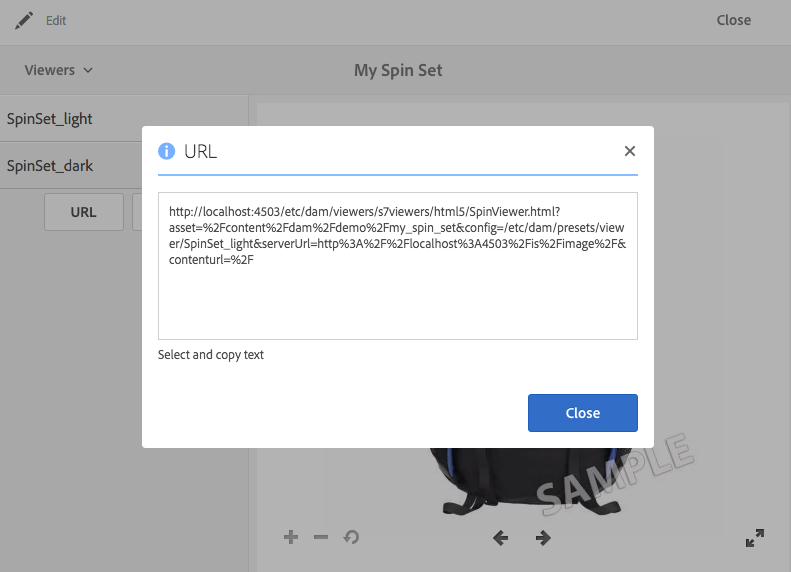

# Vinculación de URL en la aplicación web {#linking-urls-to-your-web-application}

Sus sitios web y aplicaciones acceden a los servicios de Dynamic Media mediante llamadas URL. Después de publicar un recurso, Dynamic Media activa una cadena URL que hace referencia al recurso. Puede pegar estas direcciones URL en un navegador web para realizar pruebas.

Solo se vincula a las direcciones URL si se *not* usar Adobe Experience Manager como WCM. La vinculación (frente a la incrustación) se utiliza cuando se desea enviar un reproductor de vídeo como ventana emergente o modal. Si utiliza Experience Manager como WCM, [los recursos se añaden directamente en la página.](adding-dynamic-media-assets-to-pages.md)

Para colocar estas cadenas URL en sus páginas web y aplicaciones, cópielas desde Dynamic Media.

>[!NOTE]
>
>Las cadenas URL solo están disponibles para representaciones dinámicas de recursos. Actualmente no están disponibles para recursos estáticos que residen en DAM y no en el servidor de Dynamic Media. El botón URL no aparece en las representaciones estáticas.

Consulte también [Incrustar el visualizador de imágenes o vídeos en una página web](embed-code.md).

Consulte también [Vincular URL de YouTube a la aplicación web](video.md).

Consulte también [Distribución de imágenes optimizadas para un sitio interactivo](responsive-site.md).

Consulte también [Cargar recursos](/help/assets/manage-digital-assets.md#uploading-assets).

## Obtener una dirección URL para un recurso {#obtaining-a-url-for-an-asset}

Puede obtener una cadena URL generada por un ajuste preestablecido de imagen o un ajuste preestablecido de visualizador. Después de copiar la URL, esta se coloca en el Portapapeles para que pueda pegarla según sea necesario en las páginas de su sitio web o aplicación.

>[!NOTE]
>
>La dirección URL no está disponible para copiarse hasta que no haya publicado el recurso seleccionado. Además, también debe publicar el ajuste preestablecido de visualizador o de imagen.
>
>Consulte [Publicar recursos](publishing-dynamicmedia-assets.md).
>
>Consulte [Publicar ajustes preestablecidos de visor](managing-viewer-presets.md#publishing-viewer-presets).
>
>Consulte [Publicar ajustes preestablecidos de imagen](managing-image-presets.md#publishing-image-presets).

Existen varias formas de obtener una cadena de URL. Sin embargo, los pasos siguientes muestran solo un método que puede utilizar.

**Para obtener una URL para un recurso:**

1. Vaya a la *publicado* recurso cuya URL preestablecida de imagen o URL preestablecida de visor que desee copiar y seleccione el recurso para abrirlo.

   Recuerde que las direcciones URL solo están disponibles para copiarse *después* de *publicar* los recursos por primera vez. Además, también se debe publicar el ajuste preestablecido de visualizador o de imagen.

   Consulte [Publicar recursos](publishing-dynamicmedia-assets.md).

   Consulte [Publicar ajustes preestablecidos de visor](managing-viewer-presets.md#publishing-viewer-presets).

   Consulte [Publicar ajustes preestablecidos de imagen](managing-image-presets.md#publishing-image-presets).

1. En función del recurso que haya seleccionado, realice una de las siguientes acciones:

   * Si ha seleccionado una imagen, en el menú desplegable, seleccione **[!UICONTROL Representaciones]**.

      En el **[!UICONTROL Dinámica]** , seleccione un nombre preestablecido para ver su representación en el marco derecho. Si es necesario, desplácese por la lista Representaciones para ver el encabezado Dinámico.

      En la parte inferior del carril izquierdo, seleccione **[!UICONTROL URL]**.

      

   * Si ha seleccionado un conjunto de giros, un conjunto de imágenes, un conjunto de carrusel o un vídeo, en el menú desplegable, seleccione **[!UICONTROL Visualizadores]**.

      En el carril izquierdo, seleccione un nombre de ajuste preestablecido de visualizador. Se abre una vista previa del conjunto o vídeo en una página independiente.

      En el carril izquierdo, en la parte inferior, seleccione **[!UICONTROL URL]**.

      

1. Para obtener una vista previa del recurso o agregar a la página de contenido web, seleccione y copie el texto en el explorador web.

   Para salir de la ventana URL, seleccione la opción **[!UICONTROL X]** o seleccione **[!UICONTROL Cerrar]**.

## Obtener una URL para un recurso estático {#obtaining-a-url-for-a-static-asset}

Dynamic Media admite la entrega de recursos estáticos, que son otros recursos además de imágenes y vídeos. Los formatos de recursos estáticos admitidos para la entrega son los siguientes:

* Archivos 3D
* GIF animado
* Archivos de audio
* CSS
* JavaScript (cuando su empresa está configurada con su propio dominio)
* PDF
* SVG
* XML
* ZIP

**Para obtener una URL para un recurso estático:**

1. Vaya a la *publicado* recurso estático cuya URL desee copiar y seleccione el recurso para abrirlo.

   Recuerde que las URL solo están disponibles para copiarse *after* primero *publicado* el recurso estático.

   Consulte [Publicación de recursos](publishing-dynamicmedia-assets.md).

1. Utilice cualquiera de los siguientes métodos para obtener la URL del recurso estático publicado:

   * `The URL of the published static is the following:`

      * `https://*<server_name>*/is/content/*<company_name>*/*<static_asset_filename>*.*<extension>*`

         Por ejemplo, `https://aem.com/is/content/adobe/image.gif`.
   * Select **[!UICONTROL Activo]** > **[!UICONTROL Representaciones dinámicas]**, seleccione una representación dinámica del recurso estático y copie la URL.

      Cambiar la URL copiada para usar `is/content` en la ruta en lugar de `is/image/`.

## Obtener una URL de vídeo para una representación de vídeo publicada {#obtaining-a-video-url-for-a-published-video-rendition}

1. En el Experience Manager, vaya a **[!UICONTROL Herramientas]** > **[!UICONTROL Implementación]** > **[!UICONTROL Cloud]** > **[!UICONTROL Cloud Services]**.
1. En el **[!UICONTROL Cloud Services]** , desplácese hacia abajo hasta la página **[!UICONTROL Cloud Services de Dynamic Media]** encabezado y, a continuación, seleccione **[!UICONTROL Mostrar configuraciones]**.
1. En **[!UICONTROL Configuraciones disponibles]**, seleccione el nombre de la configuración que desee.

1. En el **[!UICONTROL Configuración de Dynamic Media Cloud]** página, en **[!UICONTROL URL del servicio de vídeo]**, copie la ruta URL completa. Necesita la ruta de URL copiada más adelante en los pasos.

   Por ejemplo, la ruta de URL podría aparecer de forma similar a la siguiente:

   `https://s7athens.macromedia.com:9090/DMGateway/`

   (La ruta anterior es únicamente para fines explicativos; no es la ruta real que copia).

1. En **[!UICONTROL ID de registro]**, copie el nombre del cliente que se encuentra en la última parte del ID.

   Por ejemplo, si el ID de registro era `87654321|MyCompany`, el nombre del cliente sería `MyCompany`.

1. Cerca de la esquina superior izquierda de la página, seleccione **[!UICONTROL Cloud Services]** y, a continuación, seleccione el icono del Experience Manager y vaya a **[!UICONTROL General]** > **[!UICONTROL CRXDE Lite]**.
1. Copie toda la ruta de representación de vídeo desde el JCR (Repositorio de contenido Java™).

   Por ejemplo, la ruta de representación del vídeo podría aparecer de forma similar a la siguiente:

   `/_renditions_/0bd/0bd28743-a616-4fe6-92aa-6eae7c2112f/avs/Momentum_1080-0x720-2600k.mp4`

   (La ruta anterior es únicamente para fines explicativos; no es la ruta real que copia).

1. Para formar una ruta URL completa, ordene la información copiada en el siguiente orden:

   `<Video_Service_URL>/public/<Customer_name_from_Registration_ID>/<Video_rendition_path>`

   Por ejemplo, utilizando las rutas de ejemplo y el nombre de cliente de ejemplo desde los pasos anteriores, la ruta completa aparece de la siguiente manera:

   `https://s7athens.macromedia.com:9090/DMGateway/public/MyCompany/_renditions_/0bd/0bd28743-a616-4fe6-92aa-6eae7c2112ff/avs/Momentum_1080-0x720-2600k.mp4`

   Esta ruta es la dirección URL completa del vídeo para una representación de vídeo publicada.

## Obtener una URL de vídeo para flujo adaptable (HLS) {#obtaining-a-video-url-for-adaptive-streaming-hls}

1. En el Experience Manager, vaya a **[!UICONTROL Herramientas]** > **[!UICONTROL Implementación]** > **[!UICONTROL Cloud]** > **[!UICONTROL Cloud Services]**.
1. En el **[!UICONTROL Cloud Services]** , desplácese hacia abajo hasta la página **[!UICONTROL Cloud Services de Dynamic Media]** encabezado y, a continuación, seleccione **[!UICONTROL Mostrar configuraciones]**.
1. En **[!UICONTROL Configuraciones disponibles]**, seleccione el nombre de la configuración que desee.
1. En el **[!UICONTROL Configuración de Cloud Services de Dynamic Media]** , haga lo siguiente:

   * En **[!UICONTROL URL del servicio de vídeo]**, copie la ruta de URL completa. Necesitará la ruta de URL copiada más adelante en estos pasos. Por ejemplo, la ruta de URL podría aparecer de forma similar a la siguiente:

   `https://gateway-na.assetsadobe.com/DMGateway/`

   (La ruta anterior es únicamente para fines explicativos; no es la ruta real que copia).

   * En **[!UICONTROL ID de registro]**, copie el nombre del cliente que se encuentra en la última parte del ID. Necesita el nombre de cliente copiado más adelante en estos pasos.

      Por ejemplo, si el ID de registro era `87654321|demoCo`, el nombre de cliente que copia sería `demoCo`.

1. En función del protocolo de envío de vídeo que utilice, copie el selector de protocolo correspondiente. Necesita el selector de protocolo copiado más adelante en estos pasos.

   <table>
    <tbody>
      <tr>
      <td><strong>Protocolo de envío de vídeo que utiliza</strong></td>
      <td><strong>Selector de protocolo para usar</strong></td>
      </tr>
      <tr>
      <td>
HTTP
 
Si utiliza HTTP (entrega de vídeo no seguro), asegúrese de cambiar <code>https</code> a <code>http</code> en el valor URL del servicio de vídeo que ha copiado anteriormente.
 </td>
      <td><code>public/</code></td>
      </tr>
      <tr>
      <td>HTTPS</td>
      <td><code>public-ssl/</code></td>
      </tr>
    </tbody>
   </table>

1. Copie la ruta completa del recurso de vídeo en Experience Manager, tal como lo procesa Dynamic Media. Necesita esta ruta de recursos de vídeo copiada más adelante en estos pasos.

   Por ejemplo:

   `/content/dam/marketing/MyVideo.mp4`

1. Combine todas las piezas que ha copiado anteriormente para crear una cadena en el siguiente orden:

   &lt; `video service URL`>&lt; `protocol selector`>&lt; `customer name`>&lt; `video asset path`>

   Por ejemplo, si se utiliza la información copiada de los ejemplos de estos pasos, la cadena aparecerá de la siguiente manera:

   `https://gateway-na.assetsadobe.com/DMGateway/public-ssl/demoCo/content/dam/marketing/MyVideo.mp4`

1. Completar la dirección URL añadiendo `.m3u8` al final de la cadena. Por ejemplo, anexar `.m3u8` a la cadena del paso anterior, la ruta de URL completa aparecerá de la siguiente manera:

   `https://gateway-na.assetsadobe.com/DMGateway/public-ssl/demoCo/content/dam/marketing/MyVideo.mp4.m3u8`

## Utilice HTTP/2 para enviar los recursos de Dynamic Media {#using-http-to-deliver-your-dynamic-media-assets}

HTTP/2 es el nuevo protocolo web actualizado que mejora la forma en que se comunican los exploradores y los servidores. Proporciona una transferencia de información más rápida y reduce la cantidad de potencia de procesamiento necesaria. La entrega de recursos de Dynamic Media ahora puede realizarse a través de HTTP/2, lo que proporciona una mejor respuesta y tiempos de carga.

Consulte [Entrega HTTP2 de contenido](http2faq.md) para obtener información detallada sobre cómo empezar a usar HTTP/2 con su cuenta de Dynamic Media.
