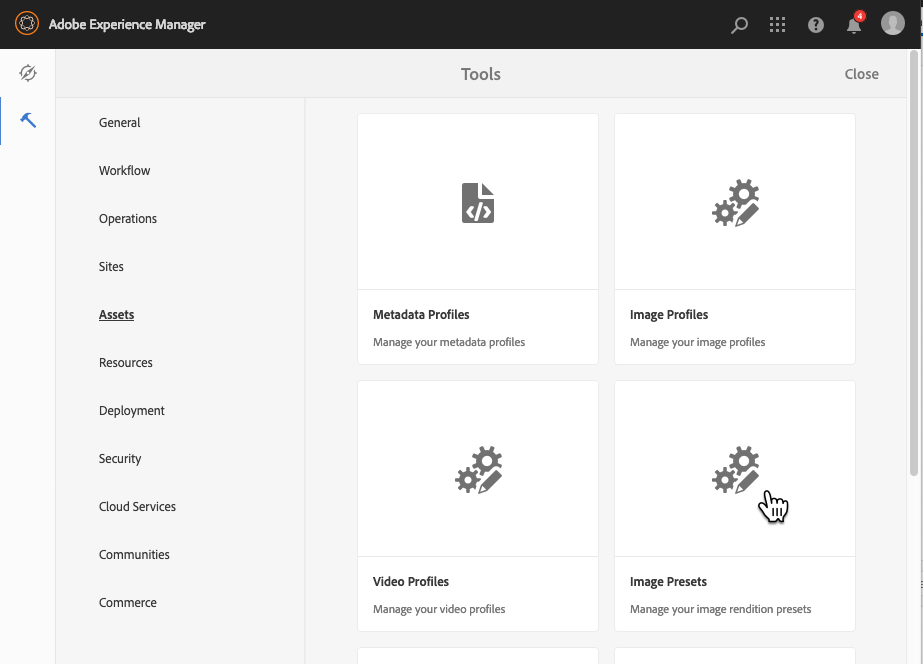
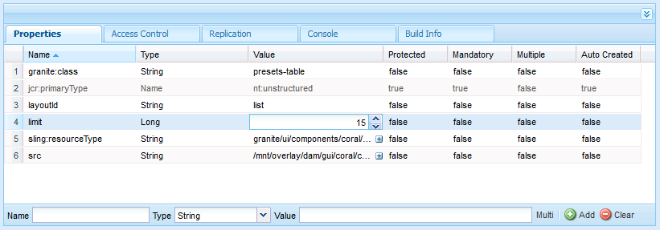
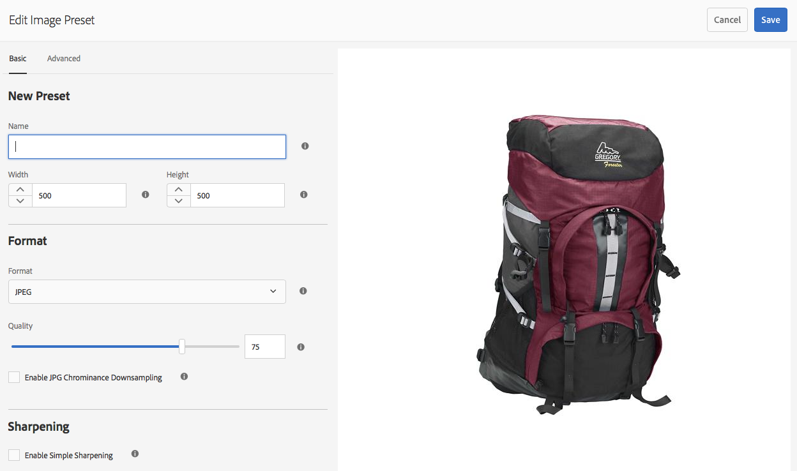
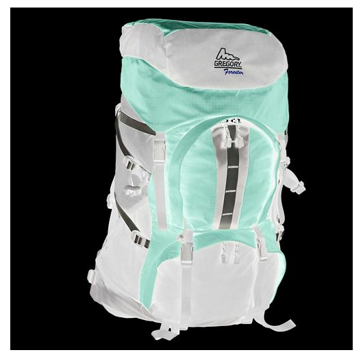
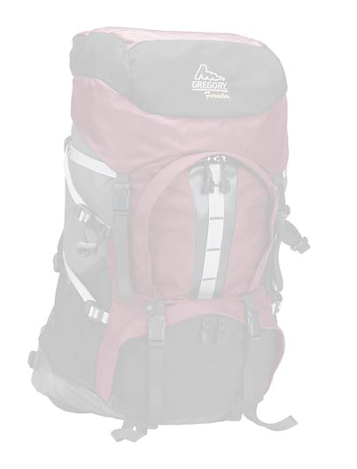

# Administrar ajustes preestablecidos de imagen{#managing-image-presets}

Los ajustes preestablecidos de imagen permiten a Adobe Experience Manager Assets ofrecer imágenes dinámicamente en diferentes tamaños, en diferentes formatos o con otras propiedades de imagen que se generan dinámicamente. Cada ajuste preestablecido de imagen representa una colección predefinida de comandos de tamaño y formato para mostrar imágenes. Al crear un ajuste preestablecido de imagen, elige un tamaño para la entrega de imágenes. También puede elegir comandos de formato para optimizar el aspecto de la imagen cuando se envíe la imagen para su visualización.

Los administradores pueden crear ajustes preestablecidos para exportar recursos. Los usuarios pueden elegir un ajuste preestablecido al exportar imágenes, que también redistribuye las imágenes según las especificaciones del administrador.

También puede crear ajustes preestablecidos de imagen que respondan. Si aplica un ajuste preestablecido de imagen interactivo a los recursos, cambiarán según el dispositivo o el tamaño de pantalla en que se visualicen. Puede configurar los ajustes preestablecidos de imagen para que utilicen CMYK en el espacio de color, además de RGB o Gris.

En esta sección se describe cómo crear, modificar y administrar ajustes preestablecidos de imagen de forma general. Puede aplicar un ajuste preestablecido de imagen a una imagen cada vez que la previsualice. Consulte [Aplicar ajustes preestablecidos de imagen](/help/assets/dynamic-media/image-presets.md).

>[!NOTE]
>
>Las imágenes inteligentes funcionan con los ajustes preestablecidos de imagen existentes y utilizan inteligencia en el último milisegundo de envío para reducir aún más el tamaño del archivo de imagen en función de la velocidad de conexión del explorador o de la red. Consulte [Imágenes inteligentes](/help/assets/dynamic-media/imaging-faq.md) para obtener más información.

## Más información sobre los ajustes preestablecidos de imagen {#understanding-image-presets}

Al igual que una macro, un ajuste preestablecido de imagen es una colección predefinida de comandos de tamaño y formato guardados con un nombre. Para comprender cómo funcionan los ajustes preestablecidos de imagen, supongamos que el sitio web requiere que cada imagen de producto aparezca en diferentes tamaños, formatos y tasas de compresión para el escritorio y la entrega móvil.

Puede crear dos ajustes preestablecidos de imagen: 500 x 500 píxeles para escritorio y 150 x 150 píxeles para móvil. Puede crear dos ajustes preestablecidos de imagen, uno denominado `Enlarge` para mostrar imágenes a 500x500 píxeles y otro denominado `Thumbnail` para mostrar imágenes a 150 x 150 píxeles. Para enviar imágenes con el tamaño `Enlarge` y `Thumbnail`, Experience Manager encuentra la definición de `Enlarge Image Preset` y `Thumbnail Image Preset`. A continuación, Experience Manager genera dinámicamente una imagen con el tamaño y las especificaciones de formato de cada ajuste preestablecido de imagen.

Las imágenes de tamaño reducido cuando se envían de forma dinámica pueden perder nitidez y detalle. Por este motivo, cada ajuste preestablecido de imagen contiene controles de formato para optimizar una imagen cuando se entrega a un tamaño determinado. Estos controles garantizan que las imágenes sean nítidas y claras cuando se envíen al sitio web o a la aplicación.

Los administradores pueden crear ajustes preestablecidos de imagen. Para crear un ajuste preestablecido de imagen, puede empezar desde cero o puede empezar desde uno existente y guardarlo con un nuevo nombre.

## Administrar ajustes preestablecidos de imagen {#managing-image-presets-1}

Para administrar los ajustes preestablecidos de imagen en Experience Manager, seleccione el logotipo de Experience Manager para acceder a la consola de navegación global y, a continuación, seleccione el icono Herramientas y vaya a **[!UICONTROL Assets]** > **[!UICONTROL Ajustes preestablecidos de imagen]**.



>[!NOTE]
>
>Los ajustes preestablecidos de imagen que cree también estarán disponibles como representaciones dinámicas al obtener una vista previa de los recursos o enviarlos.
>
>No necesita *not* publicar ajustes preestablecidos de imagen, ya que los ajustes preestablecidos de imagen se publican automáticamente.
>
>Consulte [Publicar ajustes preestablecidos de imagen](#publishing-image-presets).

>[!NOTE]
>
>El sistema muestra varias representaciones cuando selecciona **[!UICONTROL Representaciones]** en la vista de detalles de un recurso. Puede aumentar o disminuir el número de ajustes preestablecidos de imagen que se muestran. Ver [Aumentar el número de ajustes preestablecidos de imagen que se muestran](#increasing-or-decreasing-the-number-of-image-presets-that-display).

## Relación entre los ajustes preestablecidos de imagen y las representaciones {#how-image-presets-relate-to-renditions}

Los ajustes preestablecidos de imagen definen cómo Dynamic Media ofrece las imágenes, incluidos el tamaño, el formato, la compresión y otros parámetros de visualización. Los ajustes preestablecidos no generan representaciones por sí mismos. En su lugar, se basan en representaciones que se crean cuando se procesan los recursos.

### Generación de representaciones en AEM as a Cloud Service{#rendition-generation-in-aemaacs}

En AEM as a Cloud Service, las representaciones se generan mediante [Microservicios de recursos](https://experienceleague.adobe.com/es/docs/experience-manager-cloud-service/content/assets/manage/asset-microservices-configure-and-use#). El flujo de trabajo de recursos de actualización de DAM no está disponible para la personalización en Cloud Service.

Entre las consideraciones importantes se incluyen las siguientes:

* Las representaciones se generan en el momento de la carga.
* Los cambios en un perfil de procesamiento afectan a los recursos recién cargados. Los activos existentes deben volver a procesarse si se requieren nuevas representaciones.
* La personalización del modelo de flujo de trabajo no se admite en AEM as a Cloud Service para la generación de representaciones.

Los ajustes preestablecidos de imagen hacen referencia a las representaciones disponibles a la hora de envío. Asegúrese de que existan las representaciones necesarias antes de configurar o utilizar ajustes preestablecidos de imagen.

**Para controlar qué representaciones se generan:**

1. Cree o edite un [perfil de procesamiento](https://experienceleague.adobe.com/es/docs/experience-manager-cloud-service/content/assets/manage/asset-microservices-configure-and-use#).
2. Configure las definiciones de representación requeridas.
3. Aplique el perfil de procesamiento a la carpeta adecuada.

Cuando los recursos se cargan en una carpeta que tiene un perfil de procesamiento aplicado, los microservicios de recursos generan automáticamente las representaciones definidas.

<!--
### Adobe Illustrator (AI), PostScript&reg; (EPS), and PDF file formats {#adobe-illustrator-ai-postscript-eps-and-pdf-file-formats}

If you intend to support the ingestion of AI, EPS, and PDF files so that you can generate dynamic renditions of these file formats, review the following information before you create Image Presets.

Adobe Illustrator's file format is a variant of PDF. The main differences, in the context of Experience Manager Assets, are the following:

* Adobe Illustrator documents consist of a single page with multiple layers. Each layer is extracted as a PNG subasset under the main Illustrator asset.
* PDF documents consist of one or more pages. Each page is extracted as a single page PDF subasset under the main multi-page PDF document.

The `Create Sub Asset process` component creates the subassets within the overall `DAM Update Asset` workflow. To see this process component within the workflow, navigate to **[!UICONTROL Tools]** > **[!UICONTROL Workflow]** > **[!UICONTROL Models]** > **[!UICONTROL DAM Update Asset]** > **[!UICONTROL Edit]**.

See also [Viewing pages of a multi-page file](/help/assets/manage-linked-subassets.md#view-pages-of-a-multi-page-file).

You can view the subassets or the pages when you open the asset, select the Content menu, and select **[!UICONTROL Subassets]** or **[!UICONTROL Pages]**. The subassets are real assets. The `Create Sub Asset` workflow component extracts the PDF pages. They are then stored as `page1.pdf`, `page2.pdf`, and so on, below the main asset. After they are stored, the `DAM Update Asset` workflow processes them.

To use Dynamic Media to preview and generate dynamic renditions for AI, EPS or PDF files, the following processing steps are required:

1. In the `DAM Update Asset` workflow, the `Rasterize PDF/AI Image Preview Rendition` process component rasterizes the first page of the original asset &ndash; using the configured resolution &ndash; into a `cqdam.preview.png` rendition.

1. The `Dynamic Media Process Image Assets` process component within the workflow optimizes the `cqdam.preview.png` rendition into a PTIFF.

>[!NOTE]
>
>In the DAM Update Asset workflow, the **[!UICONTROL EPS thumbnails]** step generates thumbnails for EPS files.

#### PDF/AI/EPS asset metadata properties {#pdf-ai-eps-asset-metadata-properties}

| **Metadata property** |**Description** |
|---|---|
| `dam:Physicalwidthininches` |Document width in inches. |
| `dam:Physicalheightininches` |Document height in inches. |

You access `Rasterize PDF/AI Image Preview Rendition` process component options by way of the `DAM Update Asset` workflow.

Select Adobe Experience Manager in the upper left, the click **[!UICONTROL Tools]** > **[!UICONTROL Workflow]** > **[!UICONTROL Models]**. On the Workflow Models page, select **[!UICONTROL DAM Update Asset]**, then on the toolbar select **[!UICONTROL Edit]**. On the DAM Update Asset workflow page, double-select the `Rasterize PDF/AI Image Preview Rendition` process component to open its Step Properties dialog box.

#### Rasterize PDF/AI Image Preview Rendition options {#rasterize-pdf-ai-image-preview-rendition-options}


Arguments to rasterize PDF or AI workflow

|Process Argument | Default setting | Description |
|---|---|---|
| Mime Types | application/pdf<br>application/postscript<br>application/illustrator| List of document mime-types that are considered to be PDF or Illustrator documents. |
| Max Width | 2048 | Maximum width of the generated preview rendition, in pixels.|
| Max Height | 2048| Maximum height of the generated preview rendition, in pixels. |
| Resolution | 72 | Resolution to rasterize the first page, in ppi (pixels per inch). |

Using the default process arguments, the first page of a PDF/AI document is rasterized at 72 ppi and the generated preview image is sized at 2048 x 2048 pixels. For a typical deployment, you can increase the resolution to a minimum of 150 ppi or more. For example, a US letter size document at 300 ppi requires a maximum width and height of 2550 x 3300 pixels, respectively.

Max Width and Max Height limit the resolution at which to rasterize. For example, if the maximums are unchanged, and Resolution is set to 300 ppi, a US Letter document is rasterized at 186 ppi. That is, the document is 1581 x 2046 pixels.

The `Rasterize PDF/AI Image Preview Rendition` process component has a maximum defined to ensure that it does not create overly large images in memory. Such large images can overflow the memory provided to the JVM (Java&trade; Virtual Machine). Care must be taken to provide the JVM with enough memory to manage the configured number of parallel workflows, with each having the potential to create an image at the maximum configured size. -->

<!--
### InDesign (INDD) file format {#indesign-indd-file-format}

If you intend to support the ingestion of INDD files so that you can generate dynamic rendition of this file format, review the following information before you create Image Presets.

For InDesign files, sub assets are extracted only if the Adobe InDesign Server is integrated with Experience Manager. Referenced assets are linked based on their metadata. InDesign Server is not required for linking. However, the referenced assets must be present within Experience Manager before the InDesign files are processed for the links to be created between the InDesign files and the referenced assets.

See [Integrate Experience Manager Assets with InDesign Server](/help/assets/indesign.md).

The Media Extraction process component in the `DAM Update Asset` workflow runs several pre-configured Extend Scripts to process InDesign files.


The ExtendScript paths in the arguments of the Media Extraction process component in the DAM Update Asset workflow.

The following scripts are used by Dynamic Media integration:


|ExtendScript name | Default | Description |
|---|---|---|
| ThumbnailExport.jsx | Yes  | Generates a 300 PPI `thumbnail.jpg` rendition that is optimized and turned into a PTIFF rendition by `Dynamic Media Process Image Assets` process component.  |
| JPEGPagesExport.jsx | Yes | Generates a 300 PPI JPEG subasset for each page. The JPEG subasset is a real asset stored under the InDesign asset. The `DAM Update Asset` workflow optimizes and converts it into a PTIFF. |
| PDFPagesExport.jsx | No | Generates a PDF subasset for each page. The PDF subasset gets processed as described earlier. Because the PDF contains a single page only, no subassets are generated. |
-->

<!--
### Configure the image thumbnail size {#configuring-image-thumbnail-size}

You can configure the size of thumbnails by configuring those settings in the **[!UICONTROL DAM Update Asset]** workflow. There are two steps in the workflow where you can configure the thumbnail size of image assets. One (**[!UICONTROL Dynamic Media Process Image Assets]**) is used for dynamic image assets. The other (**[!UICONTROL Process Thumbnails]**) is used for static thumbnail generation or when all other processes fail to generate thumbnails. Regardless, *both* must have the same settings.

The **[!UICONTROL Dynamic Media Process Image Assets]** step uses the image server to generate thumbnails, independently of the configuration applied to the **[!UICONTROL Process Thumbnails]** step. Generating thumbnails through the **[!UICONTROL Process Thumbnails]** step is the slowest and most memory intensive way to create thumbnails.

Thumbnail sizing is defined in the following format: **[!UICONTROL width:height:center]**, for example, `80:80:false`. The width and height determine the size in pixels of the thumbnail. The center value is either false or true. If set to true, it indicates that the thumbnail image has exactly the size given in the configuration. If the resized image is smaller, it is centered within the thumbnail.

>[!NOTE]
>
>* Thumbnail sizes for EPS files are configured in the **[!UICONTROL EPS thumbnails]** step, in the **[!UICONTROL Arguments]** tab under Thumbnails.
>
>* Thumbnail sizes for videos are configured in the **[!UICONTROL FFmpeg thumbnails]** step, in the **[!UICONTROL Process]** tab under **[!UICONTROL Arguments]**.
>

**To configure the image thumbnail size:**

1. Navigate to **[!UICONTROL Tools]** > **[!UICONTROL Workflow]** > **[!UICONTROL Models]** > **[!UICONTROL DAM Update Asset]** > **[!UICONTROL Edit]**.
1. Select the **[!UICONTROL Dynamic Media Process Image Assets]** step and select the **[!UICONTROL Thumbnails]** tab. Change the thumbnail size, as needed, then select **[!UICONTROL OK]**.

   

1. Select the **[!UICONTROL Process Thumbnails]** step, then select the **[!UICONTROL Thumbnails]** tab. Change the thumbnail size, as needed, then select **[!UICONTROL OK]**.

   >[!NOTE]
   >
   >The values in the thumbnails argument in the **[!UICONTROL Process Thumbnails]** step must match the thumbnails argument in the **[!UICONTROL Dynamic Media Process Image Assets]** step.

1. Select **[!UICONTROL Save]** to save the changes to the workflow.
-->

## Aumentar o reducir el número de ajustes preestablecidos de imagen que se muestran {#increasing-or-decreasing-the-number-of-image-presets-that-display}

Los ajustes preestablecidos de imagen que cree estarán disponibles como representaciones dinámicas al obtener una vista previa de los recursos. Experience Manager muestra varias representaciones dinámicas al ver un recurso desde **[!UICONTROL Vista de detalles > Representaciones]**. Puede aumentar o disminuir el límite de representaciones que se muestran.

**Para aumentar o disminuir el número de ajustes preestablecidos de imagen que se muestran:**

1. Vaya a CRXDE Lite ([https://localhost:4502/crx/de](https://localhost:4502/crx/de)).
1. Vaya al nodo de lista de ajustes preestablecidos de imagen en `/libs/dam/gui/coral/content/commons/sidepanels/imagepresetsdetail/imgagepresetslist`

   

1. En la propiedad **[!UICONTROL limit]**, cambie el **[!UICONTROL valor]**, que se establece en 15 de forma predeterminada, por el número deseado.
1. Vaya al origen de datos del ajuste preestablecido de imagen en `/libs/dam/gui/coral/content/commons/sidepanels/imagepresetsdetail/imgagepresetslist/datasource`

   

1. En la propiedad limit, cambie el número al deseado, por ejemplo, `{empty requestPathInfo.selectors[1] ? "20" : requestPathInfo.selectors[1]}`
1. Seleccione **[!UICONTROL Guardar todo]**.

## Crear ajustes preestablecidos de imagen {#creating-image-presets}

Cree ajustes preestablecidos de imagen para poder aplicar los ajustes de forma coherente en todas las imágenes cuando previsualice o publique.

>[!NOTE]
>
>Si utiliza Internet Explorer 9, la creación de un ajuste preestablecido no aparece en la lista de ajustes preestablecidos inmediatamente después de guardarlo. Para solucionar este problema, deshabilite la caché para IE9.

Si tiene intención de admitir la ingesta de archivos AI, PDF y EPS para poder generar una representación dinámica de estos formatos de archivo, revise la siguiente información antes de crear ajustes preestablecidos de imagen.

Ver [formatos de archivo de Adobe Illustrator (AI), PostScript® (EPS) y PDF](#adobe-illustrator-ai-postscript-eps-and-pdf-file-formats).

Si tiene intención de admitir la ingesta de archivos INDD para que pueda generar una representación dinámica de este formato de archivo, revise la siguiente información antes de crear ajustes preestablecidos de imagen.

Ver [formato de archivo de InDesign (INDD)](#indesign-indd-file-format).

**Para crear ajustes preestablecidos de imagen:**

1. En Experience Manager, seleccione el logotipo de Experience Manager para acceder a la consola de navegación global y vaya a **[!UICONTROL Herramientas]** > **[!UICONTROL Assets]** > **[!UICONTROL Ajustes preestablecidos de imagen]**.
1. Seleccione **[!UICONTROL Crear]**.

   

   >[!NOTE]
   >
   >Para que este ajuste preestablecido de imagen sea interactivo, borre los valores de los campos **[!UICONTROL width]** y **[!UICONTROL height]** y déjelos en blanco.

1. En la ventana **[!UICONTROL Editar ajuste preestablecido de imagen]**, escriba valores en las fichas **[!UICONTROL Básico]** y **[!UICONTROL Avanzado]** según corresponda, incluido un nombre. Las opciones se describen en [Opciones de ajustes preestablecidos de imagen](#image-preset-options). Los ajustes preestablecidos aparecen en el panel izquierdo y se pueden utilizar sobre la marcha con otros recursos.

   

1. Seleccione **[!UICONTROL Guardar]**.

## Crear un ajuste preestablecido de imagen interactivo {#creating-a-responsive-image-preset}

Para crear un ajuste preestablecido de imagen interactivo, realice los pasos que se indican en [Crear ajustes preestablecidos de imagen](#creating-image-presets). Cuando introduzca la altura y anchura en la ventana **[!UICONTROL Editar ajuste preestablecido de imagen]**, borre los valores y déjelos en blanco.

Si los deja en blanco, Experience Manager verá que este ajuste preestablecido de imagen responde. Puede ajustar los demás valores según corresponda.

>[!NOTE]
>
>Para ver los botones **[!UICONTROL URL]** y **[!UICONTROL RESS]** al aplicar un ajuste preestablecido de imagen a un recurso, este debe publicarse.
>
>
>
>Los ajustes preestablecidos y los recursos de imagen se publican automáticamente.

### Opciones de ajustes preestablecidos de imagen {#image-preset-options}

Al crear o editar ajustes preestablecidos de imagen, tiene las opciones que se describen en esta sección. Además, Adobe recomienda estas opciones de &quot;práctica recomendada&quot; para comenzar:

* **[!UICONTROL Formato]** (ficha **[!UICONTROL Básico]**): seleccione **[!UICONTROL JPEG]** u otro formato que cumpla sus requisitos. Todos los navegadores web admiten el formato de imagen JPEG; ofrece un buen equilibrio entre los tamaños de archivos pequeños y la calidad de imagen. Sin embargo, las imágenes en formato JPEG utilizan un esquema de compresión con pérdidas que puede introducir artefactos de imagen no deseados si el ajuste de compresión es demasiado bajo. Por este motivo, Adobe recomienda establecer la calidad de compresión en 75. Este ajuste ofrece un buen equilibrio entre la calidad de imagen y el tamaño de archivo pequeño.

* **[!UICONTROL Habilitar enfoque simple]**: No seleccione **[!UICONTROL Habilitar enfoque simple]** (este filtro de enfoque ofrece menos control que la configuración de máscara de enfoque).

* **[!UICONTROL Enfoque: Modo de remuestreo]** - Seleccione **[!UICONTROL Enfoque2]**.

### Opciones de pestaña básicas {#basic-tab-options}

| Campo | Descripción |
| --- | --- |
| **Nombre** | Introduzca un nombre descriptivo sin espacios en blanco. Para ayudar a los usuarios a identificar este ajuste preestablecido de imagen, incluya la especificación de tamaño de imagen en el nombre. |
| **Anchura y altura** | Especifique el tamaño en píxeles de la imagen resultante. La anchura y la altura deben ser superiores a 0 píxeles. Si alguno de los valores es 0, no se crea ningún ajuste preestablecido. Si ambos valores están en blanco, se crea un ajuste preestablecido de imagen interactivo. |
| **Formato** | Elija un formato en el menú.<br>Elegir **JPEG** ofrece las siguientes opciones:<br>· **Calidad** - La escala de calidad de JPEG es de 1 a 100. La escala es visible al arrastrar el control deslizante.<br>· **Habilitar la disminución de resolución de crominancia en JPG**: como el ojo es menos sensible a la información de color de alta frecuencia que la luminancia de alta frecuencia, las imágenes de JPEG dividen la información de imagen en componentes de luminancia y color. Cuando se comprime una imagen de JPEG, el componente de luminancia se deja a resolución completa, mientras que los componentes de color se reducen de resolución promediando grupos de píxeles juntos. La disminución de resolución reduce el volumen de datos a la mitad o a un tercio con un impacto mínimo en la calidad percibida. La disminución de resolución no es aplicable a imágenes en escala de grises. Esta técnica reduce la cantidad de compresión útil para imágenes con alto contraste (por ejemplo, imágenes con texto superpuesto).<br><br>Elegir **GIF** o **GIF con alfa** proporciona estas opciones adicionales de **Cuantificación de color GIF**:<br>· **Tipo** - Seleccionar **Adaptable** (predeterminado), **Web** o **Macintosh**. Si selecciona **GIF con Alpha**, la opción Macintosh no estará disponible.<br>· **Tramado** - Seleccionar **Difuso** o **Desactivado**.<br>· **Número de colores** - Escriba un número de 2 a 256.<br>· **Lista de colores**: escriba una lista separada por comas. Por ejemplo, para blanco, gris y negro, escriba `000000,888888,ffffff`.<br><br>Elegir **PDF**, **TIFF** o **TIFF con alpha** proporciona esta opción adicional:<br>· **Compresión** - Seleccione un algoritmo de compresión. Las opciones de algoritmo para PDF son **None**, **Zip** y **Jpeg**; para TIFF son **None**, **LZW**, **Jpeg** y **Zip**; y para TIFF con Alpha son **None**, **LZW** y **Zip**.<br><br>Elegir **PNG**, **PNG con Alpha** o **EPS** no proporciona opciones adicionales. |
| **Enfoque** | Seleccione **Activar enfoque simple** para aplicar un filtro de enfoque básico a la imagen después de cambiar su tamaño. El enfoque puede ayudar a compensar el desenfoque que puede producirse cuando se muestra una imagen en un tamaño diferente. |

### Opciones de pestaña avanzadas {#advanced-tab-options}

<table>
 <tbody>
  <tr>
   <td><strong>Campo</strong></td>
   <td><strong>Descripción</strong></td>
  </tr>
  <tr>
   <td><strong>Espacio de color</strong></td>
   <td>Seleccione <strong>RGB, CMYK,</strong> o <strong>Escala de grises</strong> para el espacio de color.</td>
  </tr>
  <tr>
   <td><strong>Perfil de color</strong></td>
   <td>Seleccione el perfil del espacio de color de salida al que desea convertir el recurso si es diferente del perfil de trabajo.</td>
  </tr>
  <tr>
   <td><strong>Procesar intención</strong></td>
   <td>Puede anular la interpretación predeterminada. Las intenciones de representación determinan lo que sucede con los colores que no se pueden reproducir en el perfil de color de destino (fuera de la gama). La Interpretación se ignora si no es compatible con el perfil ICC.
    <ul>
     <li>Seleccione <strong>Perceptual</strong> para comprimir la gama total de un espacio de color en otro espacio de color cuando uno o más colores de la imagen original estén fuera de la gama del espacio de color de destino.</li>
     <li>Seleccione <strong>Colorimétrico relativo</strong> cuando un color del espacio de color actual esté fuera de la gama en el espacio de color de destino. Y desea asignarlo a la gama de colores de destino más cercana sin alterar otros colores. </li>
     <li>Seleccione <strong>Saturación</strong> si desea reproducir la saturación de color de la imagen original al convertirla en el espacio de color de destino. </li>
     <li>Seleccione <strong>Colorimétrico absoluto</strong> para que coincida exactamente con los colores sin ningún ajuste para el punto blanco o el punto negro que alteraría el brillo de la imagen.</li>
    </ul> </td>
  </tr>
  <tr>
   <td><strong>Compensación de punto negro</strong></td>
   <td>Seleccione esta opción si el perfil de salida admite esta función. La compensación de punto negro se ignora si no es compatible con el perfil ICC especificado.</td>
  </tr>
  <tr>
   <td><strong>Distorsión</strong></td>
   <td>Seleccione esta opción para evitar o reducir posibles defectos de bandas de colores. </td>
  </tr>
  <tr>
   <td><strong>Tipo de enfoque</strong></td>
   <td><p>Seleccione <strong>Ninguno</strong>, <strong>Enfoque</strong> o <strong>Máscara de enfoque</strong>. </p>
    <ul>
     <li>Seleccione <strong>Ninguno</strong> si desea deshabilitar el enfoque.</li>
     <li>Seleccione <strong>Enfoque </strong>para aplicar un filtro de enfoque básico a la imagen después de cambiar su tamaño. El enfoque puede ayudar a compensar el desenfoque que puede producirse cuando se muestra una imagen en un tamaño diferente. </li>
     <li>Seleccione <strong> Máscara de enfoque</strong> si desea ajustar un efecto de filtro de enfoque en la imagen final con disminución de resolución. Puede controlar la intensidad del efecto, el radio del efecto (medido en píxeles) y un umbral de contraste que se ignora. Este efecto utiliza las mismas opciones que el filtro "Máscara de enfoque" de Photoshop.</li>
    </ul> <p>En <strong>Máscara de enfoque</strong>, tiene las siguientes opciones:</p>
    <ul>
     <li><strong>Cantidad</strong>: controla la cantidad de contraste aplicado a los píxeles del borde. El valor predeterminado del número real es 1,0. Para imágenes de alta resolución, puede aumentarla hasta 5,0. Considere la cantidad como una medida de la intensidad del filtro.</li>
     <li><strong>Radio</strong>: Determina el número de píxeles adyacentes a los píxeles de borde que afectarán al enfoque. Para imágenes de alta resolución, introduzca un número real entre 1 y 2. Un valor bajo enfoca únicamente los píxeles de borde; un valor alto enfoca una banda más ancha de píxeles. El valor correcto depende del tamaño de la imagen.</li>
     <li><strong>Umbral</strong>: determina el intervalo de contraste que se omitirá cuando se aplique el filtro Máscara de enfoque. En otras palabras, esta opción define en qué medida los píxeles enfocados deben diferir del área circundante para considerarse píxeles de borde y enfoque. Para evitar la introducción de ruido, experimente con valores enteros entre 2 y 20. </li>
     <li><strong>Aplicar a</strong>: determina si el enfoque se aplica a cada color o brillo.</li>
    </ul>
    <div>
      El enfoque se describe en
     <a href="https://experienceleague.adobe.com/es/docs/experience-manager-learn/assets/dynamic-media/images/dynamic-media-image-sharpening-feature-video-use#dynamic-media">Uso del enfoque de imágenes con Experience Manager Dynamic Media</a> vídeo, en <a href="https://experienceleague.adobe.com/es/docs/dynamic-media-classic/using/master-files/sharpening-image#master-files">Enfoque de una imagen</a> tema de la Ayuda en línea y en <a href="https://experienceleague.adobe.com/docs/dynamic-media-classic/assets/s7_sharpening_images.pdf?lang=es">Prácticas recomendadas para enfocar imágenes en Dynamic Media Classic</a> PDF descargable.
    </div> </td>
  </tr>
  <tr>
   <td><strong>Modo de remuestreo</strong></td>
   <td>Seleccione una opción <strong>Modo de remuestreo</strong>. Estas opciones enfocan la imagen cuando se reduce su resolución:
    <ul>
     <li><strong>Bilinear</strong>: el método de remuestreo más rápido. Pueden verse algunos defectos de solapamiento.</li>
     <li><strong>Bicúbico</strong>: aumenta el uso de CPU, pero genera imágenes más nítidas con artefactos de solapamiento menos evidentes.</li>
     <li><strong>Enfocado2</strong> - Puede producir resultados ligeramente más enfocados que los Bicúbicos, pero a un costo de CPU aún mayor.</li>
     <li><strong>Bi-Sharp</strong>: selecciona el remuestreador predeterminado de Photoshop para reducir el tamaño de imagen, lo que se denomina <strong>enfoque bicúbico</strong> en Adobe Photoshop.</li>
     <li><strong>Cada color</strong> y <strong>brillo</strong> - cada método puede basarse en el color o el brillo. De manera predeterminada, <strong>Cada color</strong> está seleccionado.</li>
    </ul> </td>
  </tr>
  <tr>
   <td><strong>Resolución de impresión</strong></td>
   <td>Seleccione una resolución para imprimir esta imagen; el valor predeterminado es 72 píxeles.</td>
  </tr>
  <tr>
   <td><strong>Modificador de imagen</strong></td>
   <td><p>Más allá de la configuración de imagen común disponible en la interfaz de usuario, Dynamic Media admite numerosas modificaciones de imagen avanzadas que puede especificar en el campo <strong>Modificadores de imagen</strong>. Estos parámetros se definen en la <a href="https://experienceleague.adobe.com/es/docs/dynamic-media-developer-resources/image-serving-api/image-serving-api/http-protocol-reference/syntax-and-features/image-serving-http/c-command-overview">referencia de comando del protocolo Image Server</a>.</p> <p>Importante: No se admiten las siguientes funciones enumeradas en la API:</p>
    <ul>
     <li>Comandos básicos de creación de plantillas y procesamiento de texto: <code>text= textAngle= textAttr= textFlowPath= textFlowXPath= textPath=</code> y <code>textPs=</code></li>
     <li>Comandos de localización: <code>locale=</code> y <code>req=xlate</code></li>
     <li><code>req=set</code> no está disponible para uso general.</li>
     <li><code>req=mbrset</code></li>
     <li><code>req=saveToFile</code></li>
     <li><code>req=targets</code></li>
     <li><code>template=</code></li>
     <li>Servicios no principales de Dynamic Media: SVG, procesamiento de imágenes y web para impresión</li>
    </ul> </td>
  </tr>
 </tbody>
</table>

## Definir opciones de ajustes preestablecidos de imagen con modificadores de imagen {#defining-image-preset-options-with-image-modifiers}

Además de las opciones disponibles en las pestañas Básico y Avanzado, puede definir modificadores de imagen para que tenga más opciones al definir ajustes preestablecidos de imagen. El procesamiento de imágenes se basa en la API de procesamiento de imágenes de Dynamic Media y se define en detalle en la [Referencia de protocolo HTTP](https://experienceleague.adobe.com/es/docs/dynamic-media-developer-resources/image-serving-api/image-rendering-api/http-protocol-reference/c-ir-introduction#image-rendering-api).

A continuación se muestran algunos ejemplos básicos de lo que se puede hacer con los modificadores de imagen.

>[!NOTE]
>
>Algunos modificadores de imagen [no se pueden usar en Experience Manager](#advanced-tab-options).

* [op_invert](https://experienceleague.adobe.com/es/docs/dynamic-media-developer-resources/image-serving-api/image-serving-api/http-protocol-reference/command-reference/r-op-invert): invierte cada componente de color para obtener un efecto de imagen negativo.

  ```xml {.line-numbers}
  &op_invert=1
  ```

  

* [op_blur](https://experienceleague.adobe.com/es/docs/dynamic-media-developer-resources/image-serving-api/image-serving-api/http-protocol-reference/command-reference/r-op-blur): aplica un filtro de desenfoque a la imagen.

  ```xml {.line-numbers}
  &op_blur=7
  ```

  

* Comandos combinados - op_blur y op-invert

  ```xml {.line-numbers}
  &op_invert=1&op_blur=7
  ```

  

* [op_bright](https://experienceleague.adobe.com/es/docs/dynamic-media-developer-resources/image-serving-api/image-serving-api/http-protocol-reference/command-reference/r-op-brightness): disminuye o aumenta el brillo.

  ```xml {.line-numbers}
  &op_brightness=58
  ```

  

* [opac](https://experienceleague.adobe.com/es/docs/dynamic-media-developer-resources/image-serving-api/image-serving-api/http-protocol-reference/command-reference/r-opac): ajusta la opacidad de la imagen. Permite reducir la opacidad en primer plano.

  ```xml {.line-numbers}
  opac=29
  ```

  

## Editar ajustes preestablecidos de imagen {#modifying-image-presets}

1. En Experience Manager, seleccione el logotipo de Experience Manager para acceder a la consola de navegación global y vaya a **[!UICONTROL Herramientas]** > **[!UICONTROL Assets]** > **[!UICONTROL Ajustes preestablecidos de imagen]**.

   

1. Seleccione un ajuste preestablecido y luego seleccione **[!UICONTROL Editar]**. Se abre la ventana **[!UICONTROL Editar ajuste preestablecido de imagen]**.
1. Realice cambios y seleccione **[!UICONTROL Guardar]** para guardar los cambios o **[!UICONTROL Cancelar]** para cancelar los cambios.

## Publicar ajustes preestablecidos de imagen {#publishing-image-presets}

Los ajustes preestablecidos de imagen se publican automáticamente.

## Eliminar ajustes preestablecidos de imagen {#deleting-image-presets}

1. En Experience Manager, seleccione el logotipo de Experience Manager para acceder a la consola de navegación global y haga clic en el icono Herramientas.
1. Vaya a **[!UICONTROL Assets]** > **[!UICONTROL Ajustes preestablecidos de imagen]**.
1. Seleccione un ajuste preestablecido y, a continuación, seleccione **[!UICONTROL Eliminar]**. Dynamic Media confirma que desea eliminarlo. Seleccione **[!UICONTROL Eliminar]** para eliminar o seleccione **[!UICONTROL Cancelar]** para volver a los ajustes preestablecidos de imagen.
