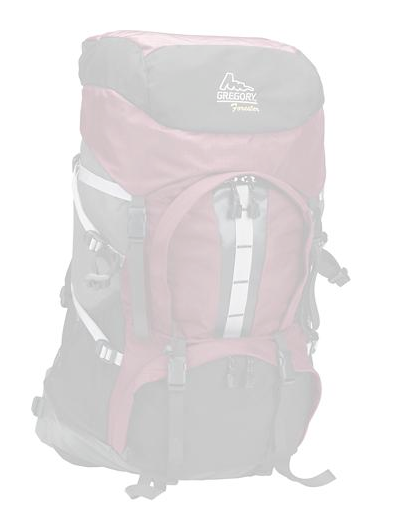

# Administrar ajustes preestablecidos de imagen{#managing-image-presets}

Los ajustes preestablecidos de imagen permiten a Adobe Experience Manager Assets ofrecer imágenes dinámicamente en diferentes tamaños, en diferentes formatos o con otras propiedades de imagen que se generan dinámicamente. Cada ajuste preestablecido de imagen representa una colección predefinida de comandos de tamaño y formato para mostrar imágenes. Al crear un ajuste preestablecido de imagen, elige un tamaño para la entrega de imágenes. También puede elegir comandos de formato para optimizar el aspecto de la imagen cuando se envíe la imagen para su visualización.

Los administradores pueden crear ajustes preestablecidos para exportar recursos. Los usuarios pueden elegir un ajuste preestablecido al exportar imágenes, que también redistribuye las imágenes según las especificaciones del administrador.

También puede crear ajustes preestablecidos de imagen que respondan. Si aplica un ajuste preestablecido de imagen interactivo a los recursos, cambiarán según el dispositivo o el tamaño de pantalla en que se visualicen. Puede configurar los ajustes preestablecidos de imagen para que utilicen CMYK en el espacio de color, además de RGB o Gris.

En esta sección se describe cómo crear, modificar y administrar ajustes preestablecidos de imagen de forma general. Puede aplicar un ajuste preestablecido de imagen a una imagen cada vez que la previsualice. Consulte [Aplicar ajustes preestablecidos de imagen](/help/assets/dynamic-media/image-presets.md).

>[!NOTE]
>
>Las imágenes inteligentes funcionan con los ajustes preestablecidos de imagen existentes y utilizan inteligencia en el último milisegundo de envío para reducir aún más el tamaño del archivo de imagen en función de la velocidad de conexión del explorador o de la red. Consulte [Imágenes inteligentes](/help/assets/dynamic-media/imaging-faq.md) para obtener más información.

## Más información sobre los ajustes preestablecidos de imagen {#understanding-image-presets}

Al igual que una macro, un ajuste preestablecido de imagen es una colección predefinida de comandos de tamaño y formato guardados con un nombre. Para comprender cómo funcionan los ajustes preestablecidos de imagen, supongamos que el sitio web requiere que cada imagen de producto aparezca en diferentes tamaños, formatos y tasas de compresión para el escritorio y la entrega móvil.

Puede crear dos ajustes preestablecidos de imagen: 500 x 500 píxeles para escritorio y 150 x 150 píxeles para móvil. Puede crear dos ajustes preestablecidos de imagen, uno denominado `Enlarge` para mostrar imágenes a 500x500 píxeles y otro denominado `Thumbnail` para mostrar imágenes a 150 x 150 píxeles. Para enviar imágenes con el tamaño `Enlarge` y `Thumbnail`, Experience Manager encuentra la definición de `Enlarge Image Preset` y `Thumbnail Image Preset`. A continuación, Experience Manager genera dinámicamente una imagen con el tamaño y las especificaciones de formato de cada ajuste preestablecido de imagen.

Las imágenes de tamaño reducido cuando se envían de forma dinámica pueden perder nitidez y detalle. Por este motivo, cada ajuste preestablecido de imagen contiene controles de formato para optimizar una imagen cuando se entrega a un tamaño determinado. Estos controles garantizan que las imágenes sean nítidas y claras cuando se envíen al sitio web o a la aplicación.

Los administradores pueden crear ajustes preestablecidos de imagen. Para crear un ajuste preestablecido de imagen, puede empezar desde cero o puede empezar desde uno existente y guardarlo con un nuevo nombre.

## Administrar ajustes preestablecidos de imagen {#managing-image-presets-1}

Para administrar los ajustes preestablecidos de imagen en Experience Manager, seleccione el logotipo de Experience Manager para acceder a la consola de navegación global y, a continuación, seleccione el icono Herramientas y vaya a **[!UICONTROL Assets]** > **[!UICONTROL Ajustes preestablecidos de imagen]**.


>[!NOTE]
>
>Los ajustes preestablecidos de imagen que cree también estarán disponibles como representaciones dinámicas al obtener una vista previa de los recursos o enviarlos.
>
>No necesita *not* publicar ajustes preestablecidos de imagen, ya que los ajustes preestablecidos de imagen se publican automáticamente.
>
>Consulte [Publicar ajustes preestablecidos de imagen](#publishing-image-presets).

>[!NOTE]
>
>El sistema muestra varias representaciones cuando selecciona **[!UICONTROL Representaciones]** en la vista de detalles de un recurso. Puede aumentar o disminuir el número de ajustes preestablecidos de imagen que se muestran. Ver [Aumentar el número de ajustes preestablecidos de imagen que se muestran](#increasing-or-decreasing-the-number-of-image-presets-that-display).

### Formatos de archivo de Adobe Illustrator (AI), PostScript® (EPS) y PDF {#adobe-illustrator-ai-postscript-eps-and-pdf-file-formats}

Si tiene intención de admitir la ingesta de archivos AI, EPS y PDF para poder generar representaciones dinámicas de estos formatos de archivo, revise la siguiente información antes de crear ajustes preestablecidos de imagen.

El formato de archivo de Adobe Illustrator es una variante de PDF. Las principales diferencias, en el contexto de Experience Manager Assets, son las siguientes:

* Los documentos de Adobe Illustrator constan de una sola página con varias capas. Cada capa se extrae como un subrecurso PNG en el recurso principal de Illustrator.
* Los documentos de PDF constan de una o más páginas. Cada página se extrae como un subactivo de PDF de una sola página en el documento principal de PDF de varias páginas.

El componente `Create Sub Asset process` crea los subrecursos dentro del flujo de trabajo general `DAM Update Asset`. Para ver este componente de proceso en el flujo de trabajo, vaya a **[!UICONTROL Herramientas]** > **[!UICONTROL Flujo de trabajo]** > **[!UICONTROL Modelos]** > **[!UICONTROL Recurso de actualización DAM]** > **[!UICONTROL Editar]**.

<!-- See also [Viewing pages of a multi-page file](/help/assets/manage-linked-subassets.md#view-pages-of-a-multi-page-file). -->

Puede ver los subrecursos o las páginas al abrir el recurso, seleccionar el menú Contenido y seleccionar **[!UICONTROL Subrecursos]** o **[!UICONTROL Páginas]**. Los subactivos son activos reales. El componente de flujo de trabajo `Create Sub Asset` extrae las páginas de PDF. Luego se almacenan como `page1.pdf`, `page2.pdf`, etc., debajo del recurso principal. Una vez almacenados, el flujo de trabajo `DAM Update Asset` los procesará.

Para utilizar Dynamic Media para previsualizar y generar representaciones dinámicas para archivos AI, EPS o PDF, se requieren los siguientes pasos de procesamiento:

1. En el flujo de trabajo `DAM Update Asset`, el componente de proceso `Rasterize PDF/AI Image Preview Rendition` rasteriza la primera página del recurso original (con la resolución configurada) en una representación `cqdam.preview.png`.

1. El componente de proceso `Dynamic Media Process Image Assets` del flujo de trabajo optimiza la representación de `cqdam.preview.png` en un PTIFF.

>[!NOTE]
>
>En el flujo de trabajo de recursos de actualización de DAM, el paso de **[!UICONTROL miniaturas de EPS]** genera miniaturas para los archivos EPS.

#### Propiedades de metadatos de recursos de PDF/AI/EPS {#pdf-ai-eps-asset-metadata-properties}

| **Propiedad de metadatos** | **Descripción** |
|---|---|
| `dam:Physicalwidthininches` | Ancho del documento en pulgadas. |
| `dam:Physicalheightininches` | Altura del documento en pulgadas. |

Puede acceder a `Rasterize PDF/AI Image Preview Rendition` opciones de componentes de proceso a través del flujo de trabajo `DAM Update Asset`.

Seleccione Adobe Experience Manager en la esquina superior izquierda y haga clic en **[!UICONTROL Herramientas]** > **[!UICONTROL Flujo de trabajo]** > **[!UICONTROL Modelos]**. En la página Modelos de flujo de trabajo, seleccione **[!UICONTROL Recurso de actualización DAM]** y, en la barra de herramientas, seleccione **[!UICONTROL Editar]**. En la página Flujo de trabajo de recursos de actualización de DAM, haga doble clic en el componente de proceso `Rasterize PDF/AI Image Preview Rendition` para abrir el cuadro de diálogo Propiedades del paso.

#### Rasterizar las opciones de representación de previsualización de imagen de PDF/AI {#rasterize-pdf-ai-image-preview-rendition-options}


Argumentos para rasterizar PDF o flujo de trabajo de IA

| Argumento del proceso | Configuración predeterminada | Descripción |
|---|---|---|
| Tipos MIME | application/pdf<br>application/postscript<br>application/illustrator | Lista de tipos MIME de documento que se consideran documentos de PDF o Illustrator. |
| Anchura máxima | 2048 | Anchura máxima de la representación de vista previa generada, en píxeles. |
| Altura máxima | 2048 | Altura máxima de la representación de vista previa generada, en píxeles. |
| Resolución | 72 | Resolución para rasterizar la primera página, en ppp (píxeles por pulgada). |

Con los argumentos de proceso predeterminados, la primera página de un documento de PDF/AI se rasteriza a 72 ppp y el tamaño de la imagen de vista previa generada es de 2048 x 2048 píxeles. Para una implementación típica, puede aumentar la resolución a un mínimo de 150 ppp o más. Por ejemplo, un documento de tamaño carta de EE. UU. a 300 ppp requiere una anchura y altura máximas de 2550 x 3300 píxeles, respectivamente.

La anchura máxima y la altura máxima limitan la resolución a la que se va a rasterizar. Por ejemplo, si los máximos no cambian y la resolución se establece en 300 ppp, un documento de carta de EE. UU. se rasteriza a 186 ppp. Es decir, el documento tiene 1581 x 2046 píxeles.

El componente de proceso `Rasterize PDF/AI Image Preview Rendition` tiene un máximo definido para garantizar que no cree imágenes demasiado grandes en la memoria. Estas imágenes de gran tamaño pueden desbordarse de la memoria proporcionada a la máquina virtual JVM (Java™). Se debe tener cuidado de proporcionar a JVM suficiente memoria para administrar el número configurado de flujos de trabajo paralelos, cada uno con el potencial de crear una imagen en el tamaño máximo configurado.

### Formato de archivo InDesign (INDD) {#indesign-indd-file-format}

Si tiene intención de admitir la ingesta de archivos INDD para que pueda generar una representación dinámica de este formato de archivo, revise la siguiente información antes de crear ajustes preestablecidos de imagen.

En el caso de los archivos InDesign, los subrecursos se extraen únicamente si la Adobe InDesign Server está integrada con Experience Manager. Los recursos a los que se hace referencia están vinculados según sus metadatos. InDesign Server no es necesario para la vinculación. Sin embargo, los recursos a los que se hace referencia deben estar presentes en Experience Manager antes de que se procesen los archivos InDesign para que se creen los vínculos entre los archivos InDesign y los recursos a los que se hace referencia.

<!-- See [Integrate Experience Manager Assets with InDesign Server](/help/assets/indesign.md). -->

El componente de proceso de extracción de medios del flujo de trabajo `DAM Update Asset` ejecuta varios scripts extendidos preconfigurados para procesar archivos de InDesign.


Las rutas ExtendScript en los argumentos del componente Proceso de extracción de medios en el flujo de trabajo de recursos de actualización de DAM.

La integración de Dynamic Media utiliza los siguientes scripts:


| Nombre de ExtendScript | Predeterminado | Descripción |
|---|---|---|
| ThumbnailExport.jsx | Sí | Genera una representación de 300 PPI `thumbnail.jpg` que está optimizada y convertida en una representación PTIFF por el componente de proceso `Dynamic Media Process Image Assets`. |
| JPEGPagesExport.jsx | Sí | Genera un subrecurso de JPEG de 300 PPP para cada página. El subrecurso de JPEG es un recurso real almacenado bajo el recurso de InDesign. El flujo de trabajo `DAM Update Asset` lo optimiza y lo convierte en un PTIFF. |
| PDFPagesExport.jsx | No | Genera un subrecurso de PDF para cada página. El subrecurso de PDF se procesa como se describió anteriormente. Como PDF contiene solo una página, no se generan subrecursos. |

### Configurar el tamaño de la miniatura de la imagen {#configuring-image-thumbnail-size}

Puede configurar el tamaño de las miniaturas configurando estos valores en el flujo de trabajo **[!UICONTROL Recurso de actualización DAM]**. En el flujo de trabajo hay dos pasos en los que puede configurar el tamaño de la miniatura de los recursos de imagen. Se utiliza una (**[!UICONTROL imagen de proceso de Dynamic Media Assets]**) para los recursos de imagen dinámica. El otro (**[!UICONTROL Procesar miniaturas]**) se usa para generar miniaturas estáticas o cuando los demás procesos no generan miniaturas. Independientemente, *ambos* deben tener la misma configuración.

El paso **[!UICONTROL Dynamic Media Process Image Assets]** utiliza el servidor de imágenes para generar miniaturas, independientemente de la configuración aplicada al paso **[!UICONTROL Procesar miniaturas]**. La generación de miniaturas a través del paso **[!UICONTROL Miniaturas de proceso]** es la forma más lenta y con mayor consumo de memoria para crear miniaturas.

El tamaño de la miniatura se define en el formato siguiente: **[!UICONTROL ancho:height:centro]**, por ejemplo, `80:80:false`. La anchura y la altura determinan el tamaño en píxeles de la miniatura. El valor central puede ser false o true. Si se establece en true, indica que la imagen en miniatura tiene exactamente el tamaño indicado en la configuración. Si la imagen redimensionada es más pequeña, se centra dentro de la miniatura.

>[!NOTE]
>
>* El tamaño de las miniaturas de los archivos EPS se configura en el paso **[!UICONTROL miniaturas de EPS]**, en la pestaña **[!UICONTROL Argumentos]**, en Miniaturas.
>
>* Los tamaños de las miniaturas de los vídeos se configuran en el paso **[!UICONTROL Miniaturas FFmpeg]**, en la pestaña **[!UICONTROL Proceso]**, en **[!UICONTROL Argumentos]**.
>

**Para configurar el tamaño de la miniatura de la imagen:**

1. Vaya a **[!UICONTROL Herramientas]** > **[!UICONTROL Flujo de trabajo]** > **[!UICONTROL Modelos]** > **[!UICONTROL Recurso de actualización DAM]** > **[!UICONTROL Editar]**.
1. Seleccione el paso **[!UICONTROL Assets de imagen de proceso de Dynamic Media]** y seleccione la pestaña **[!UICONTROL Miniaturas]**. Cambie el tamaño de la miniatura, según sea necesario, y luego seleccione **[!UICONTROL Aceptar]**.

   

1. Seleccione el paso **[!UICONTROL Procesar miniaturas]** y, a continuación, seleccione la pestaña **[!UICONTROL Miniaturas]**. Cambie el tamaño de la miniatura, según sea necesario, y luego seleccione **[!UICONTROL Aceptar]**.

   >[!NOTE]
   >
   >Los valores del argumento de miniaturas del paso **[!UICONTROL Miniaturas de proceso]** deben coincidir con el argumento de miniaturas del paso **[!UICONTROL Recursos de imagen de proceso de Dynamic Media]**.

1. Seleccione **[!UICONTROL Guardar]** para guardar los cambios en el flujo de trabajo.

### Aumentar o reducir el número de ajustes preestablecidos de imagen que se muestran {#increasing-or-decreasing-the-number-of-image-presets-that-display}

Los ajustes preestablecidos de imagen que cree estarán disponibles como representaciones dinámicas al obtener una vista previa de los recursos. Experience Manager muestra varias representaciones dinámicas al ver un recurso desde **[!UICONTROL Vista de detalles > Representaciones]**. Puede aumentar o disminuir el límite de representaciones que se muestran.

**Para aumentar o disminuir el número de ajustes preestablecidos de imagen que se muestran:**

1. Vaya a CRXDE Lite ([https://localhost:4502/crx/de](https://localhost:4502/crx/de)).
1. Vaya al nodo de lista de ajustes preestablecidos de imagen en `/libs/dam/gui/coral/content/commons/sidepanels/imagepresetsdetail/imgagepresetslist`

   

1. En la propiedad **[!UICONTROL limit]**, cambie el **[!UICONTROL valor]**, que se establece en 15 de forma predeterminada, por el número deseado.
1. Vaya al origen de datos del ajuste preestablecido de imagen en `/libs/dam/gui/coral/content/commons/sidepanels/imagepresetsdetail/imgagepresetslist/datasource`

   

1. En la propiedad limit, cambie el número al deseado, por ejemplo, `{empty requestPathInfo.selectors[1] ? "20" : requestPathInfo.selectors[1]}`
1. Seleccione **[!UICONTROL Guardar todo]**.

### Crear ajustes preestablecidos de imagen {#creating-image-presets}

Cree ajustes preestablecidos de imagen para poder aplicar los ajustes de forma coherente en todas las imágenes cuando previsualice o publique.

>[!NOTE]
>
>Si utiliza Internet Explorer 9, la creación de un ajuste preestablecido no aparece en la lista de ajustes preestablecidos inmediatamente después de guardarlo. Para solucionar este problema, deshabilite la caché para IE9.

Si tiene intención de admitir la ingesta de archivos AI, PDF y EPS para poder generar una representación dinámica de estos formatos de archivo, revise la siguiente información antes de crear ajustes preestablecidos de imagen.

Ver [formatos de archivo de Adobe Illustrator (AI), PostScript® (EPS) y PDF](#adobe-illustrator-ai-postscript-eps-and-pdf-file-formats).

Si tiene intención de admitir la ingesta de archivos INDD para que pueda generar una representación dinámica de este formato de archivo, revise la siguiente información antes de crear ajustes preestablecidos de imagen.

Ver [formato de archivo de InDesign (INDD)](#indesign-indd-file-format).

**Para crear ajustes preestablecidos de imagen:**

1. En Experience Manager, seleccione el logotipo de Experience Manager para acceder a la consola de navegación global y vaya a **[!UICONTROL Herramientas]** > **[!UICONTROL Assets]** > **[!UICONTROL Ajustes preestablecidos de imagen]**.
1. Seleccione **[!UICONTROL Crear]**.

   

   >[!NOTE]
   >
   >Para que este ajuste preestablecido de imagen sea interactivo, borre los valores de los campos **[!UICONTROL width]** y **[!UICONTROL height]** y déjelos en blanco.

1. En la ventana **[!UICONTROL Editar ajuste preestablecido de imagen]**, escriba valores en las fichas **[!UICONTROL Básico]** y **[!UICONTROL Avanzado]** según corresponda, incluido un nombre. Las opciones se describen en [Opciones de ajustes preestablecidos de imagen](#image-preset-options). Los ajustes preestablecidos aparecen en el panel izquierdo y se pueden utilizar sobre la marcha con otros recursos.

   

1. Seleccione **[!UICONTROL Guardar]**.

### Creación de un ajuste preestablecido de imagen interactivo {#creating-a-responsive-image-preset}

Para crear un ajuste preestablecido de imagen interactivo, realice los pasos que se indican en [Crear ajustes preestablecidos de imagen](#creating-image-presets). Cuando introduzca la altura y anchura en la ventana **[!UICONTROL Editar ajuste preestablecido de imagen]**, borre los valores y déjelos en blanco.

Si los deja en blanco, Experience Manager verá que este ajuste preestablecido de imagen responde. Puede ajustar los demás valores según corresponda.

>[!NOTE]
>
>Para ver los botones **[!UICONTROL URL]** y **[!UICONTROL RESS]** al aplicar un ajuste preestablecido de imagen a un recurso, este debe publicarse.
>
>
>
>Los ajustes preestablecidos y los recursos de imagen se publican automáticamente.

### Opciones de ajustes preestablecidos de imagen {#image-preset-options}

Al crear o editar ajustes preestablecidos de imagen, tiene las opciones que se describen en esta sección. Además, Adobe recomienda estas opciones de &quot;práctica recomendada&quot; para comenzar:

* **[!UICONTROL Formato]** (ficha **[!UICONTROL Básico]**): seleccione **[!UICONTROL JPEG]** u otro formato que cumpla sus requisitos. Todos los navegadores web admiten el formato de imagen JPEG; ofrece un buen equilibrio entre los tamaños de archivos pequeños y la calidad de imagen. Sin embargo, las imágenes en formato JPEG utilizan un esquema de compresión con pérdidas que puede introducir artefactos de imagen no deseados si el ajuste de compresión es demasiado bajo. Por este motivo, Adobe recomienda establecer la calidad de compresión en 75. Este ajuste ofrece un buen equilibrio entre la calidad de imagen y el tamaño de archivo pequeño.

* **[!UICONTROL Activar enfoque simple]**: No seleccione **[!UICONTROL Activar enfoque simple]** (este filtro de enfoque ofrece menos control que la configuración de máscara de enfoque).

* **[!UICONTROL Enfoque: Modo de remuestreo]** - Seleccione **[!UICONTROL Enfoque2]**.

#### Opciones de pestaña básicas {#basic-tab-options}

| Campo | Descripción |
| --- | --- |
| **Nombre** | Introduzca un nombre descriptivo sin espacios en blanco. Para ayudar a los usuarios a identificar este ajuste preestablecido de imagen, incluya la especificación de tamaño de imagen en el nombre. |
| **Anchura y altura** | Especifique el tamaño en píxeles de la imagen resultante. La anchura y la altura deben ser superiores a 0 píxeles. Si alguno de los valores es 0, no se crea ningún ajuste preestablecido. Si ambos valores están en blanco, se crea un ajuste preestablecido de imagen interactivo. |
| **Formato** | Elija un formato en el menú.<br>Elegir **JPEG** ofrece las siguientes opciones:<br>· **Calidad** - La escala de calidad de JPEG es de 1 a 100. La escala es visible al arrastrar el control deslizante.<br>· **Habilitar la disminución de resolución de crominancia en JPG**: como el ojo es menos sensible a la información de color de alta frecuencia que la luminancia de alta frecuencia, las imágenes de JPEG dividen la información de imagen en componentes de luminancia y color. Cuando se comprime una imagen de JPEG, el componente de luminancia se deja a resolución completa, mientras que los componentes de color se reducen de resolución promediando grupos de píxeles juntos. La disminución de resolución reduce el volumen de datos a la mitad o a un tercio con un impacto mínimo en la calidad percibida. La disminución de resolución no es aplicable a imágenes en escala de grises. Esta técnica reduce la cantidad de compresión útil para imágenes con alto contraste (por ejemplo, imágenes con texto superpuesto).<br><br>Elegir **GIF** o **GIF con alfa** proporciona estas opciones adicionales de **Cuantificación de color GIF**:<br>· **Tipo** - Seleccionar **Adaptable** (predeterminado), **Web** o **Macintosh**. Si selecciona **GIF con Alpha**, la opción Macintosh no estará disponible.<br>· **Tramado** - Seleccionar **Difuso** o **Desactivado**.<br>· **Número de colores** - Escriba un número de 2 a 256.<br>· **Lista de colores**: escriba una lista separada por comas. Por ejemplo, para blanco, gris y negro, escriba `000000,888888,ffffff`.<br><br>Elegir **PDF**, **TIFF** o **TIFF con alpha** proporciona esta opción adicional:<br>· **Compresión** - Seleccione un algoritmo de compresión. Las opciones de algoritmo para PDF son **None**, **Zip** y **Jpeg**; para TIFF son **None**, **LZW**, **Jpeg** y **Zip**; y para TIFF con Alpha son **None**, **LZW** y **Zip**.<br><br>Elegir **PNG**, **PNG con Alpha** o **EPS** no proporciona opciones adicionales. |
| **Enfoque** | Seleccione **Activar enfoque simple** para aplicar un filtro de enfoque básico a la imagen después de cambiar su tamaño. El enfoque puede ayudar a compensar el desenfoque que puede producirse cuando se muestra una imagen en un tamaño diferente. |

#### Opciones de pestaña avanzadas {#advanced-tab-options}

<table>
 <tbody>
  <tr>
   <td><strong>Campo</strong></td>
   <td><strong>Descripción</strong></td>
  </tr>
  <tr>
   <td><strong>Espacio de color</strong></td>
   <td>Seleccione <strong>RGB, CMYK,</strong> o <strong>Escala de grises</strong> para el espacio de color.</td>
  </tr>
  <tr>
   <td><strong>Perfil de color</strong></td>
   <td>Seleccione el perfil del espacio de color de salida al que desea convertir el recurso si es diferente del perfil de trabajo.</td>
  </tr>
  <tr>
   <td><strong>Procesar intención</strong></td>
   <td>Puede anular la interpretación predeterminada. Las intenciones de representación determinan lo que sucede con los colores que no se pueden reproducir en el perfil de color de destino (fuera de la gama). La Interpretación se ignora si no es compatible con el perfil ICC.
    <ul>
     <li>Seleccione <strong>Perceptual</strong> para comprimir la gama total de un espacio de color en otro espacio de color cuando uno o más colores de la imagen original estén fuera de la gama del espacio de color de destino.</li>
     <li>Seleccione <strong>Colorimétrico relativo</strong> cuando un color del espacio de color actual esté fuera de la gama en el espacio de color de destino. Y desea asignarlo a la gama de colores de destino más cercana sin alterar otros colores. </li>
     <li>Seleccione <strong>Saturación</strong> si desea reproducir la saturación de color de la imagen original al convertirla en el espacio de color de destino. </li>
     <li>Seleccione <strong>Colorimétrico absoluto</strong> para que coincida exactamente con los colores sin ningún ajuste para el punto blanco o el punto negro que alteraría el brillo de la imagen.</li>
    </ul> </td>
  </tr>
  <tr>
   <td><strong>Compensación de punto negro</strong></td>
   <td>Seleccione esta opción si el perfil de salida admite esta función. La compensación de punto negro se ignora si no es compatible con el perfil ICC especificado.</td>
  </tr>
  <tr>
   <td><strong>Distorsión</strong></td>
   <td>Seleccione esta opción para evitar o reducir posibles defectos de bandas de colores. </td>
  </tr>
  <tr>
   <td><strong>Tipo de enfoque</strong></td>
   <td><p>Seleccione <strong>Ninguno</strong>, <strong>Enfoque</strong> o <strong>Máscara de enfoque</strong>. </p>
    <ul>
     <li>Seleccione <strong>Ninguno</strong> si desea deshabilitar el enfoque.</li>
     <li>Seleccione <strong>Enfoque </strong>para aplicar un filtro de enfoque básico a la imagen después de cambiar su tamaño. El enfoque puede ayudar a compensar el desenfoque que puede producirse cuando se muestra una imagen en un tamaño diferente. </li>
     <li>Seleccione <strong> Máscara de enfoque</strong> si desea ajustar un efecto de filtro de enfoque en la imagen final con disminución de resolución. Puede controlar la intensidad del efecto, el radio del efecto (medido en píxeles) y un umbral de contraste que se ignora. Este efecto utiliza las mismas opciones que el filtro "Máscara de enfoque" de Photoshop.</li>
    </ul> <p>En <strong>Máscara de enfoque</strong>, tiene las siguientes opciones:</p>
    <ul>
     <li><strong>Cantidad</strong>: controla la cantidad de contraste aplicado a los píxeles del borde. El valor predeterminado del número real es 1,0. Para imágenes de alta resolución, puede aumentarla hasta 5,0. Considere la cantidad como una medida de la intensidad del filtro.</li>
     <li><strong>Radio</strong>: Determina el número de píxeles adyacentes a los píxeles de borde que afectarán al enfoque. Para imágenes de alta resolución, introduzca un número real entre 1 y 2. Un valor bajo enfoca únicamente los píxeles de borde; un valor alto enfoca una banda más ancha de píxeles. El valor correcto depende del tamaño de la imagen.</li>
     <li><strong>Umbral</strong>: determina el intervalo de contraste que se omitirá cuando se aplique el filtro Máscara de enfoque. En otras palabras, esta opción define en qué medida los píxeles enfocados deben diferir del área circundante para considerarse píxeles de borde y enfoque. Para evitar la introducción de ruido, experimente con valores enteros entre 2 y 20. </li>
     <li><strong>Aplicar a</strong>: determina si el enfoque se aplica a cada color o brillo.</li>
    </ul>
    <div>
      El enfoque se describe en
     <a href="https://experienceleague.adobe.com/es/docs/experience-manager-learn/assets/dynamic-media/images/dynamic-media-image-sharpening-feature-video-use#dynamic-media">Uso del enfoque de imágenes con Experience Manager Dynamic Media</a> vídeo, en <a href="https://experienceleague.adobe.com/es/docs/dynamic-media-classic/using/master-files/sharpening-image#master-files">Enfoque de una imagen</a> tema de la Ayuda en línea y en <a href="https://experienceleague.adobe.com/docs/dynamic-media-classic/assets/s7_sharpening_images.pdf?lang=es">Prácticas recomendadas para enfocar imágenes en Dynamic Media Classic</a> PDF descargable.
    </div> </td>
  </tr>
  <tr>
   <td><strong>Modo de remuestreo</strong></td>
   <td>Seleccione una opción <strong>Modo de remuestreo</strong>. Estas opciones enfocan la imagen cuando se reduce su resolución:
    <ul>
     <li><strong>Bilinear</strong>: el método de remuestreo más rápido. Pueden verse algunos defectos de solapamiento.</li>
     <li><strong>Bicúbico</strong>: aumenta el uso de CPU, pero genera imágenes más nítidas con artefactos de solapamiento menos evidentes.</li>
     <li><strong>Enfocado2</strong> - Puede producir resultados ligeramente más enfocados que los Bicúbicos, pero a un costo de CPU aún mayor.</li>
     <li><strong>Bi-Sharp</strong>: selecciona el remuestreador predeterminado de Photoshop para reducir el tamaño de imagen, lo que se denomina <strong>enfoque bicúbico</strong> en Adobe Photoshop.</li>
     <li><strong>Cada color</strong> y <strong>brillo</strong> - cada método puede basarse en el color o el brillo. De manera predeterminada, <strong>Cada color</strong> está seleccionado.</li>
    </ul> </td>
  </tr>
  <tr>
   <td><strong>Resolución de impresión</strong></td>
   <td>Seleccione una resolución para imprimir esta imagen; el valor predeterminado es 72 píxeles.</td>
  </tr>
  <tr>
   <td><strong>Modificador de imagen</strong></td>
   <td><p>Más allá de la configuración de imagen común disponible en la interfaz de usuario, Dynamic Media admite numerosas modificaciones de imagen avanzadas que puede especificar en el campo <strong>Modificadores de imagen</strong>. Estos parámetros se definen en la <a href="https://experienceleague.adobe.com/es/docs/dynamic-media-developer-resources/image-serving-api/image-serving-api/http-protocol-reference/syntax-and-features/image-serving-http/c-command-overview">referencia de comando del protocolo Image Server</a>.</p> <p>Importante: No se admiten las siguientes funciones enumeradas en la API:</p>
    <ul>
     <li>Comandos básicos de creación de plantillas y procesamiento de texto: <code>text= textAngle= textAttr= textFlowPath= textFlowXPath= textPath=</code> y <code>textPs=</code></li>
     <li>Comandos de localización: <code>locale=</code> y <code>req=xlate</code></li>
     <li><code>req=set</code> no está disponible para uso general.</li>
     <li><code>req=mbrset</code></li>
     <li><code>req=saveToFile</code></li>
     <li><code>req=targets</code></li>
     <li><code>template=</code></li>
     <li>Servicios no principales de Dynamic Media: SVG, procesamiento de imágenes y web para impresión</li>
    </ul> </td>
  </tr>
 </tbody>
</table>

### Definir opciones de ajustes preestablecidos de imagen con modificadores de imagen {#defining-image-preset-options-with-image-modifiers}

Además de las opciones disponibles en las pestañas Básico y Avanzado, puede definir modificadores de imagen para que tenga más opciones al definir ajustes preestablecidos de imagen. El procesamiento de imágenes se basa en la API de procesamiento de imágenes de Dynamic Media y se define en detalle en la [Referencia de protocolo HTTP](https://experienceleague.adobe.com/es/docs/dynamic-media-developer-resources/image-serving-api/image-rendering-api/http-protocol-reference/c-ir-introduction#image-rendering-api).

A continuación se muestran algunos ejemplos básicos de lo que se puede hacer con los modificadores de imagen.

>[!NOTE]
>
>Algunos modificadores de imagen [no se pueden usar en Experience Manager](#advanced-tab-options).

* [op_invert](https://experienceleague.adobe.com/es/docs/dynamic-media-developer-resources/image-serving-api/image-serving-api/http-protocol-reference/command-reference/r-op-invert): invierte cada componente de color para obtener un efecto de imagen negativo.

  ```xml {.line-numbers}
  &op_invert=1
  ```

  

* [op_blur](https://experienceleague.adobe.com/es/docs/dynamic-media-developer-resources/image-serving-api/image-serving-api/http-protocol-reference/command-reference/r-op-blur): aplica un filtro de desenfoque a la imagen.

  ```xml {.line-numbers}
  &op_blur=7
  ```

  

* Comandos combinados - op_blur y op-invert

  ```xml {.line-numbers}
  &op_invert=1&op_blur=7
  ```

  

* [op_bright](https://experienceleague.adobe.com/es/docs/dynamic-media-developer-resources/image-serving-api/image-serving-api/http-protocol-reference/command-reference/r-op-brightness): disminuye o aumenta el brillo.

  ```xml {.line-numbers}
  &op_brightness=58
  ```

  

* [opac](https://experienceleague.adobe.com/es/docs/dynamic-media-developer-resources/image-serving-api/image-serving-api/http-protocol-reference/command-reference/r-opac): ajusta la opacidad de la imagen. Permite reducir la opacidad en primer plano.

  ```xml {.line-numbers}
  opac=29
  ```

  

### Editar ajustes preestablecidos de imagen {#modifying-image-presets}

1. En Experience Manager, seleccione el logotipo de Experience Manager para acceder a la consola de navegación global y vaya a **[!UICONTROL Herramientas]** > **[!UICONTROL Assets]** > **[!UICONTROL Ajustes preestablecidos de imagen]**.

   

1. Seleccione un ajuste preestablecido y luego seleccione **[!UICONTROL Editar]**. Se abre la ventana **[!UICONTROL Editar ajuste preestablecido de imagen]**.
1. Realice cambios y seleccione **[!UICONTROL Guardar]** para guardar los cambios o **[!UICONTROL Cancelar]** para cancelar los cambios.

### Publicar ajustes preestablecidos de imagen {#publishing-image-presets}

Los ajustes preestablecidos de imagen se publican automáticamente.

### Eliminar ajustes preestablecidos de imagen {#deleting-image-presets}

1. En Experience Manager, seleccione el logotipo de Experience Manager para acceder a la consola de navegación global y haga clic en el icono Herramientas.
1. Vaya a **[!UICONTROL Assets]** > **[!UICONTROL Ajustes preestablecidos de imagen]**.
1. Seleccione un ajuste preestablecido y, a continuación, seleccione **[!UICONTROL Eliminar]**. Dynamic Media confirma que desea eliminarlo. Seleccione **[!UICONTROL Eliminar]** para eliminar o seleccione **[!UICONTROL Cancelar]** para volver a los ajustes preestablecidos de imagen.
