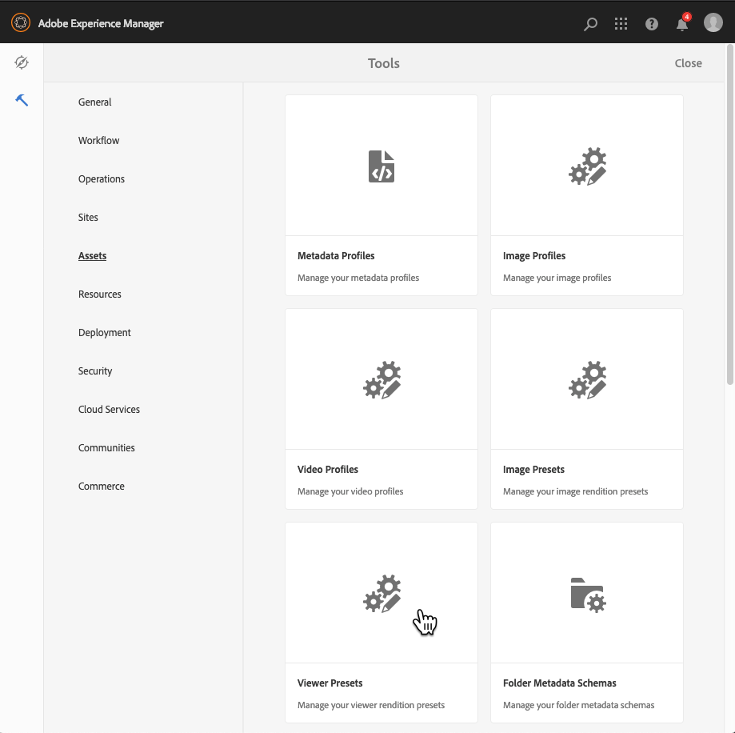

# Administrar ajustes preestablecidos de visor{#managing-viewer-presets}

Un ajuste preestablecido de visualizador es una colección de ajustes que determinan cómo ven los usuarios los recursos de medios enriquecidos en sus pantallas de equipos y dispositivos móviles. Si es un administrador, puede crear ajustes preestablecidos de visor. La configuración está disponible para una matriz de opciones de configuración del visor. Por ejemplo, puede cambiar el tamaño de visualización del visor o el comportamiento de zoom.

<!-- OBSOLETE SDK withdrawn from public view. Available internally only at `http://staging.scene7.com/s7sdk/3.8/docs/jsdoc/symbols/_s7sdk.html` 

For instructions on creating and customizing your own HTML5 viewer presets, see the *Adobe Scene7 HTML5 Viewer SDK*. The SDK is available on the IS publish server embedded in the SDK itself. Each library version has its own SDK documentation included.

Path: `<scene7_domain>/s7sdk/<library_version>/docs/jsdocs/index.html`.
For example, 3.5 SDK: [https://s7d1.scene7.com/s7sdk/3.5/docs/jsdoc/index.html](https://s7d1.scene7.com/s7sdk/3.5/docs/jsdoc/index.html)

-->

Consulte también la [Guía de referencia de visores de Dynamic Media](https://experienceleague.adobe.com/docs/dynamic-media-developer-resources.html).

En esta sección se describe cómo crear, editar y administrar ajustes preestablecidos de visualizador. Puede aplicar un ajuste preestablecido de visualizador a un recurso cada vez que lo previsualice. Consulte [Aplicar ajustes preestablecidos de visor](#applying-a-viewer-preset-to-an-asset).

>[!NOTE]
>
>Edición de *ajustes preestablecidos del visor predefinidos y listos para usar* no es un escenario compatible. Si intenta editar un ajuste preestablecido de visualizador listo para usar, se le pedirá que guarde el ajuste preestablecido de visualizador con un nuevo nombre.

## Accesibilidad de teclado para visualizadores {#keyboard-accessibility-for-viewers}

Todos los visores integrados admiten la accesibilidad del teclado.

Consulte también [Navegación y accesibilidad del teclado](https://experienceleague.adobe.com/docs/dynamic-media-developer-resources/library/c-keyboard-accessibility.html).

## Administrar ajustes preestablecidos de visor {#managing-viewer-presets-1}

Puede agregar, editar, eliminar, publicar, cancelar la publicación y previsualizar ajustes preestablecidos de visualizador en Adobe Experience Manager navegando hasta **[!UICONTROL Herramientas]** (icono de martillo) > **[!UICONTROL Recursos] > [!UICONTROL Ajustes preestablecidos de visor]**.

>[!NOTE]
>
>De forma predeterminada, el sistema muestra 15 ajustes preestablecidos de visualizador al seleccionar Visualizadores en la vista de detalles de un recurso. Puede aumentar este límite. Consulte [Aumente el número de ajustes preestablecidos de visor que se muestran](#increasing-the-number-of-viewer-presets-that-display).

### Compatibilidad del visor con páginas web interactivas {#viewer-support-for-responsive-designed-web-pages}

Las diferentes páginas Web tienen diferentes necesidades. Por ejemplo, a veces se desea una página web que proporcione un vínculo que abra el visor de HTML5 en una ventana independiente del explorador. En otros casos, es necesario incrustar el visor de HTML5 directamente en la página de alojamiento. En este último caso, la página web tiene un diseño estático. O bien, es &quot;interactivo&quot; y se muestra de forma diferente en diferentes dispositivos o para diferentes tamaños de ventana del navegador. Para satisfacer estas necesidades, todos los visores predefinidos y listos para usar del HTML5 que se incluyen con Dynamic Media admiten tanto páginas web estáticas como páginas web diseñadas con capacidad de respuesta.

Consulte [Biblioteca de imágenes estáticas interactivas](https://experienceleague.adobe.com/docs/dynamic-media-developer-resources/image-serving-api/image-serving-api/responsive-static-image-library/c-about-responsive-static-image-library.html#about-responsive-image-library) en el *Ayuda de la API de servicio y renderización de imágenes de Dynamic Media* para obtener más información sobre cómo incrustar visores interactivos en sus páginas web.

>[!NOTE]
>
>Publique todos los visores integrados antes de utilizarlos para los primeros.
>Consulte [Publicar ajustes preestablecidos de visor](#publishing-viewer-presets).

### Compatibilidad del sistema con ajustes preestablecidos del visor  {#viewer-preset-system-compatibility}

Todos los ajustes preestablecidos de visor integrados que se incluyen con Dynamic Media son totalmente compatibles con los siguientes sistemas:

* Equipos de escritorio
* Apple iPhone
* Apple iPad
* Smartphone Android™
* Tableta Android™

<!-- OUTDATED 2/25/22 * For video, extra support for MP4 playback is provided for [BlackBerry&reg;](https://developer.blackberry.com/devzone/develop/supported_media/bb_media_support_at_a_glance.html#kba1328730952678) and [Windows&reg; Phone](https://docs.microsoft.com/en-us/windows/uwp/audio-video-camera/supported-codecs). -->

### Tipos de medios enriquecidos para ajustes preestablecidos de visor {#rich-media-types-for-viewer-presets}

Los administradores pueden añadir y personalizar los siguientes tipos de medios enriquecidos al crear ajustes preestablecidos de visor.

<table>
 <tbody>
  <tr>
   <td><strong>Conjunto de carrusel</strong>  </td>
   <td>
Las zonas interactivas, los mapas de imágenes o ambas se añaden a una serie de dos o más imágenes. Un cliente puede recorrer las imágenes a la izquierda o a la derecha y, a continuación, seleccionar un punto interactivo de una imagen para obtener más información o para realizar compras directamente desde las páginas de aterrizaje, categoría o página de inicio de un sitio web.
 </td>
  </tr>
    <tr>
   <td><strong>Dimensional</strong>  </td>
   <td>
Muestra escenas 3D que le permiten girar, recorrer, acercar o volver a entrar en la cámara.
 </td>
  </tr>
  <tr>
   <td><strong>Zoom flotante </strong></td>
   <td>
Muestra una segunda imagen del área ampliada junto a la imagen original. No hay controles que utilizar: los usuarios mueven la selección sobre el área que desean ver.
 
Al determinar el uso completo del ancho de banda para este visor, tenga en cuenta que tanto la imagen principal como la imagen flotante se proporcionan en el visor. El tamaño de la imagen principal (ancho y alto del escenario) y el factor de zoom determinan el tamaño de la imagen flotante. Para evitar que el tamaño del archivo flotante sea demasiado grande, equilibre estos dos valores: si tiene un tamaño de imagen principal grande, reduzca el valor del factor de zoom. (La anchura flotante y la altura flotante determinan el tamaño de la ventana flotante, pero no el tamaño de la imagen flotante que se proporciona al visor).
 
Por ejemplo, si el tamaño de la imagen principal es de 350 por 350 píxeles, con un factor de zoom de 3, la imagen flotante resultante es de 1050 por 1050 píxeles. Si el tamaño de la imagen principal es de 300 por 300 píxeles, con un factor de zoom de 4, la imagen flotante es de 1200 por 1200 píxeles. Según la configuración de calidad del JPEG (la configuración recomendada está entre 80 y 90), puede reducir el tamaño del archivo de forma significativa. Los factores de zoom recomendados son de 2,5 a 4, dependiendo del tamaño de la imagen principal.
 </td>
  </tr>
  <tr>
   <td><strong>Zoom en línea</strong></td>
   <td>Muestra una imagen del área ampliada dentro del visor original. No hay controles que usar. Es decir, los usuarios mueven la selección sobre el área que desean ver.</td>
  </tr>
  <tr>
   <td><strong>Conjunto de imágenes</strong></td>
   <td>En el visor de conjuntos de imágenes, los usuarios pueden ver diferentes vistas o variaciones de color de un elemento seleccionando una imagen en miniatura. Este visor también ofrece herramientas de zoom para examinar las imágenes de cerca.</td>
  </tr>
  <tr>
   <td><strong>Imagen interactiva</strong></td>
   <td>Los puntos interactivos se agregan a las partes de una imagen que un cliente puede seleccionar para obtener más información o para realizar compras directamente desde las páginas de aterrizaje, categoría o inicio de un sitio web.</td>
  </tr>
  <tr>
   <td><strong>Vídeo interactivo</strong></td>
   <td>Las miniaturas se añaden a los segmentos de cronología de un vídeo que un cliente puede seleccionar para obtener más información o para realizar compras directamente desde las páginas de inicio, categoría o aterrizaje de un sitio web.</td>
  </tr>
  <tr>
   <td><strong>Medios mixtos</strong></td>
   <td>Muestra diferentes tipos de medios en un visualizador. Puede incluir conjuntos de giros, conjuntos de imágenes, imágenes y vídeos.</td>
  </tr>
  <tr>
   <td><strong>Imagen panorámica</strong></td>
   <td>
Los visores Panoramic Image y PanoramicVR representan imágenes panorámicas esféricas para sumergir a los usuarios en una experiencia de visualización de 360° de una habitación, propiedad, ubicación o paisaje.
 
Para que una imagen cargada se califique como un panorama esférico, debe tener una o ambas de las siguientes opciones:

    <ul>
     <li>Una relación de aspecto de 2:1.</li>
     <li>Etiquetado con las palabras clave <code>equirectangular</code>o <code>spherical</code> y <code>panorama</code>o <code>spherical </code>y <code>panoramic</code>. Consulte <a href="/help/sites-cloud/authoring/features/tags.md">Uso de etiquetas</a>.</li>
    </ul> 
Tanto la proporción de aspecto como los criterios de palabra clave se aplican a los recursos panorámicos para la página de detalles de recursos y el componente WCM "Medios panorámicas".
</td>
  </tr>
    <tr>
   <td><strong>Recorte inteligente de vídeos</strong>  </td>
   <td>
Utilice este visor para detectar y recortar automáticamente al punto focal de cualquier vídeo.
 </td>
  </tr>
  <tr>
   <td><strong>Conjunto de giros</strong></td>
   <td>Proporciona varias vistas de una imagen para que los usuarios puedan girar el objeto para examinar los diferentes lados y ángulos.</td>
  </tr>
  <tr>
   <td><strong>Vídeo 360</strong></td>
   <td>
Utilice el visor de vídeo 360/VR para representar un vídeo equirectangular que ofrezca una experiencia de visualización inmersiva de una habitación, propiedad, ubicación, paisaje o procedimiento médico.
 
Durante la reproducción en una pantalla plana, el usuario controla el ángulo de visualización. La reproducción en dispositivos móviles utiliza sus controles giroscópicos integrados.
 
El visor incluye compatibilidad nativa con la entrega de 360 recursos de vídeo. De forma predeterminada, no es necesaria ninguna configuración adicional para la visualización o reproducción. El vídeo 360 se entrega con extensiones de vídeo estándar como .mp4, .mkv y .mov. El códec más común es H.264.
 </td>
  </tr>
  <tr>
   <td><strong>Vídeo</strong></td>
   <td>
Reproduce el vídeo mediante flujo continuo de velocidad de bits progresiva o adaptable. La transmisión de velocidad de bits adaptable realiza automáticamente la detección de dispositivos y ancho de banda para ofrecer el vídeo de calidad adecuada en el formato correcto.
 </td>
  </tr>
  <tr>
   <td><strong>Zoom vertical</strong></td>
   <td>
El visor de zoom vertical le permite maximizar una experiencia de visualización de imágenes de producto para ofrecer a los usuarios la mejor representación de un producto. La ubicación vertical de las muestras hace lo siguiente:

    <ul>
     <li>Garantiza que las muestras estén "por encima del pliegue".  Con muestras horizontales, dependiendo del tamaño de la pantalla del escritorio del usuario, las muestras no son visibles hasta que el usuario se desplace hacia abajo por la página. Al colocar las muestras verticalmente en el visor, se garantiza que sean visibles independientemente del tamaño de pantalla del usuario.</li>
     <li>Maximiza el tamaño de la imagen principal.  Con las muestras horizontales, es necesario reservar espacio en la página para garantizar que sean visibles. Esta posición redujo el tamaño de la imagen principal. Sin embargo, con un diseño de muestra vertical, no es necesario asignar este espacio. Como tal, puede maximizar el tamaño de la imagen principal.</li>
    </ul> </td>
  </tr>
  <tr>
   <td><strong>Zoom</strong></td>
   <td>Permite a los usuarios acercarse al área seleccionándola. Los usuarios pueden seleccionar controles para acercar, alejar y restablecer la imagen a su tamaño predeterminado.</td>
  </tr>
 </tbody>
</table>

### Lista de ajustes preestablecidos de visor integrados {#list-of-out-of-the-box-viewer-presets}

La siguiente tabla identifica todos los ajustes preestablecidos de visor predefinidos y listos para usar que se incluyen con Dynamic Media.

Consulte también [Demostraciones en directo](https://landing.adobe.com/en/na/dynamic-media/ctir-2755/live-demos.html).

Para obtener información sobre las versiones compatibles del navegador web y del sistema operativo de los visores, consulte las Notas de la versión de los visores.

Consulte &quot;Notas de la versión de los visualizadores&quot; en la tabla de contenido de la [Guía de referencia de visores](https://experienceleague.adobe.com/docs/dynamic-media-developer-resources.html).

>[!NOTE]
>
>Todos los ajustes preestablecidos de visualizador integrados en Dynamic Media se activan (activan), pero es necesario publicarlos.
>Consulte [Publicar ajustes preestablecidos de visor](#publishing-viewer-presets).
>
>Los ajustes preestablecidos de visor nuevos que cree y agregue deben activarse *y *publicarse.
>Consulte [Activar o desactivar ajustes preestablecidos de visor](#activating-or-deactivating-viewer-presets) y [Ajustes preestablecidos del visualizador de publicaciones](#publishing-viewer-presets).

<table>
 <tbody>
  <tr>
   <td><strong>Título preestablecido del visor</strong></td>
   <td><strong>Tipo</strong></td>
   <td><strong>Nombre de archivo CSS</strong>  </td>
  </tr>
  <tr>
   <td>Carrusel_Dotted_dark</td>
   <td>Carousel_Set</td>
   <td><code>html5_carouselviewer_dotted_dark.css</code></td>
  </tr>
  <tr>
   <td>Carrusel_Dotted_light</td>
   <td>Carousel_Set</td>
   <td><code>html5_carouselviewer_dotted_light.css</code></td>
  </tr>
  <tr>
   <td>Carrusel_Numeric_dark</td>
   <td>Carousel_Set</td>
   <td><code>html5_carouselviewer_numeric_dark.css</code></td>
  </tr>
  <tr>
   <td>Carrusel_Numeric_light</td>
   <td>Carousel_Set</td>
   <td><code>html5_carouselviewer_numeric_light.css</code></td>
  </tr>
  <tr>
   <td>Flotante</td>
   <td>Zoom flotante</td>
   <td><code>html5_flyoutviewer.css</code></td>
  </tr>
  <tr>
   <td>ImageSet_dark</td>
   <td>Conjunto de imágenes</td>
   <td><code>html5_zoomviewer_dark.css</code></td>
  </tr>
  <tr>
   <td>ImageSet_light</td>
   <td>Conjunto de imágenes</td>
   <td><code>html5_zoomviewer_light.css</code></td>
  </tr>
  <tr>
   <td>InlineMixedMedia_dark</td>
   <td>Mixed_Media</td>
   <td><code>html5_inlinemixedmediaviewer_dark.css</code></td>
  </tr>
  <tr>
   <td>InlineMixedMedia_light</td>
   <td>Mixed_Media</td>
   <td><code>html5_inlinemixedmediaviewer_light.css</code></td>
  </tr>
  <tr>
   <td>InlineZoom</td>
   <td>Zoom flotante</td>
   <td><code>html5_inlinezoomviewer.css</code></td>
  </tr>
  <tr>
   <td>MixedMedia_dark</td>
   <td>Mixed_Media</td>
   <td><code>html5_mixedmediaviewer_dark.css</code></td>
  </tr>
  <tr>
   <td>MixedMedia_light</td>
   <td>Mixed_Media</td>
   <td><code>html5_mixedmediaviewer_light.css</code></td>
  </tr>
  <tr>
   <td>PanoramicImage</td>
   <td>Panoramic_Image</td>
   <td><code>html5_panoramicimage.css</code></td>
  </tr>
  <tr>
   <td>PanoramicImageVR</td>
   <td>Panoramic_Image</td>
   <td><code>html5_panoramicimage.css</code></td>
  </tr>
  <tr>
   <td>Shoppable_Banner</td>
   <td>Interactive_Image</td>
   <td><code>html5_interactiveimage.css</code></td>
  </tr>
  <tr>
   <td>Shoppable_Video_dark</td>
   <td>Interactive_Video</td>
   <td><code>html5_interactivevideoviewer_dark.css</code></td>
  </tr>
  <tr>
   <td>Shoppable_Video_light</td>
   <td>Interactive_Video</td>
   <td><code>html5_interactivevideovewer_light.css</code></td>
  </tr>
  <tr>
   <td>SpinSet_dark</td>
   <td>Conjunto de giros</td>
   <td><code>html5_spinviewer_dark.css</code></td>
  </tr>
  <tr>
   <td>SpinSet_light</td>
   <td>Conjunto de giros</td>
   <td><code>html5_spinviewer_light.css</code></td>
  </tr>
  <tr>
   <td>
Vídeo
 
(Incluye compatibilidad con subtítulos optativos)
 </td>
   <td>Vídeo</td>
   <td><code>html5_videoviewer.css</code></td>
  </tr>
  <tr>
   <td>
Video360_social
 
(Incluye controles básicos de reproducción de vídeo, el procesamiento de vídeo se realiza en modo estéreo, el control manual del punto de vista está desactivado, pero el control giroscópico está activado y no hay funciones de medios sociales)
 </td>
   <td>Video_360</td>
   <td><code>html5_video360viewersocial.css</code></td>
  </tr>
  <tr>
   <td>
Video360VR
 
(Diseñado para usuarios finales que utilizan lentes de realidad virtual. Incluye controles básicos de reproducción de vídeo y funciones de medios sociales)
 </td>
   <td>Video_360</td>
   <td><code>html5_video360viewer.css</code></td>
  </tr>
  <tr>
   <td>
Video_social
 
(Incluye compatibilidad con subtítulos y redes sociales)
 </td>
   <td>Vídeo</td>
   <td><code>html5_videoviewersocial.css</code></td>
  </tr>
  <tr>
   <td>Zoom_dark  </td>
   <td>Zoom  </td>
   <td><code>html5_basiczoomviewer_dark.css</code></td>
  </tr>
  <tr>
   <td>Zoom_light  </td>
   <td>Zoom</td>
   <td><code>html5_basiczoomviewer_light.css</code></td>
  </tr>
  <tr>
   <td>ZoomVertical_oscuro  </td>
   <td>Vertical_Zoom</td>
   <td><code>html5_zoomverticalviewer_dark.css</code></td>
  </tr>
  <tr>
   <td>ZoomVertical_light</td>
   <td>Vertical_Zoom</td>
   <td><code>html5_zoomverticalviewer_light.css</code></td>
  </tr>
 </tbody>
</table>

### Matriz de gestos de visores móviles compatibles {#supported-mobile-viewers-gestures-matrix}

La tabla siguiente identifica los gestos del visor móvil compatibles con los dispositivos iOS, Android™ 2.x y Android™ 3.x.

<table>
 <tbody>
  <tr>
   <td><strong>Gesto</strong></td>
   <td><strong>Zoom flotante </strong></td>
   <td><strong>Zoom</strong></td>
   <td><strong>Giro</strong></td>
  </tr>
  <tr>
   <td>
<strong>Arrastrar</strong>
 </td>
   <td>
Pans
 </td>
   <td>
Pans
 </td>
   <td>
Pans
 </td>
  </tr>
  <tr>
   <td>
<strong>Tocar</strong>
 </td>
   <td>
Muestra la ventana flotante
 </td>
   <td>
Muestra u oculta la interfaz de usuario
 </td>
   <td>
Muestra u oculta la interfaz de usuario
 </td>
  </tr>
  <tr>
   <td>
<strong>Pulsar dos veces</strong>
 </td>
   <td>
No se aplica
 </td>
   <td>
Amplía o restablece
 </td>
   <td>
Amplía o restablece
 </td>
  </tr>
  <tr>
   <td>
<strong>Abrir el lápiz</strong>
 </td>
   <td>
No se aplica
 </td>
   <td>
Amplía (solo iOS y Android™ 3x)
 </td>
   <td>
Amplía (solo iOS y Android™ 3x)
 </td>
  </tr>
  <tr>
   <td>
<strong>Pellizque</strong>
 </td>
   <td>
No se aplica
 </td>
   <td>
Reduce el tamaño de la página (solo iOS y Android™ 3x)
 </td>
   <td>
Reduce el tamaño de la página (solo iOS y Android™ 3x)
 </td>
  </tr>
  <tr>
   <td>
<strong>Deslizar</strong>
 </td>
   <td>
Desplaza la barra de muestra
 </td>
   <td>
Desplazamiento por imágenes
 </td>
   <td>
Giros
 </td>
  </tr>
  <tr>
   <td>
<strong>Flick</strong>
 </td>
   <td>
Desplaza la barra de muestra
 </td>
   <td>
Desplazamiento por imágenes
 </td>
   <td>
Giros
 </td>
  </tr>
 </tbody>
</table>

## Aumente el número de ajustes preestablecidos de visor que se muestran {#increasing-the-number-of-viewer-presets-that-display}

El Experience Manager muestra una amplia variedad de ajustes preestablecidos de visor al ver recursos desde **[!UICONTROL Vista de detalles]** > **[!UICONTROL Visualizadores]**. Puede aumentar o disminuir el número de visualizadores que se muestran.

**Para aumentar el número de ajustes preestablecidos de visor que se muestran:**

1. Vaya al CRXDE Lite ([https://localhost:4502/crx/de](https://localhost:4502/crx/de)).
1. Vaya al nodo de lista de ajustes preestablecidos de visor en `/libs/dam/gui/coral/content/commons/sidepanels/viewerpresets/viewerpresetslist`

   

1. En la propiedad **[!UICONTROL limit]**, cambie el **[!UICONTROL valor]**, que se establece en 15 de forma predeterminada, por el número deseado.
1. Vaya a la fuente de datos del ajuste preestablecido de visualizador en `/libs/dam/gui/coral/content/commons/sidepanels/viewerpresets/viewerpresetslist/datasource`

   

1. En la propiedad limit , cambie el número por el número deseado, por ejemplo `{empty requestPathInfo.selectors[1] ? "20" : requestPathInfo.selectors[1]}`
1. Select **[!UICONTROL Guardar todo]**.

## Crear ajustes preestablecidos de visor {#creating-a-new-viewer-preset}

La creación de ajustes preestablecidos de visualizador le permite aplicar distintos ajustes para ver e interactuar con los recursos. Sin embargo, no es necesario crear ajustes preestablecidos de visor. Si lo prefiere, puede utilizar los ajustes preestablecidos de visualizador predeterminados que ya se incluyen con Experience Manager Assets.

Si elige crear un ajuste preestablecido de visualizador, después de guardarlo, el estado del visualizador se activa automáticamente (establecido en **[!UICONTROL Activado]**) en la página Ajustes preestablecidos de visor . Este estado significa que está visible en el componente Dynamic Media y en el componente Medios interactivos y siempre que se obtiene una vista previa de una imagen o un vídeo.

Algunos ajustes preestablecidos de visualizador tienen una configuración exclusiva que puede afectar al uso y al comportamiento general del visualizador. Según el ajuste preestablecido de visualizador que cree, debe tener en cuenta estas consideraciones especiales.

Consulte [Consideraciones especiales para crear un ajuste preestablecido de visualizador interactivo](#special-considerations-for-creating-an-interactive-viewer-preset).

Consulte [Consideraciones especiales para la creación de un ajuste preestablecido de visualizador de titular de carrusel](#special-considerations-for-creating-a-carousel-banner-viewer-preset).

**Para crear ajustes preestablecidos de visor:**

1. En la esquina superior izquierda del Experience Manager, seleccione el logotipo del Experience Manager y, a continuación, en el carril izquierdo, vaya a **[!UICONTROL Herramientas]** (icono de martillo) > **[!UICONTROL Recursos]** > **[!UICONTROL Ajustes preestablecidos de visor]**.

   

1. En la página Ajustes preestablecidos de visor , en la barra de herramientas, seleccione **[!UICONTROL Crear]**.
1. En el **[!UICONTROL Nuevo ajuste preestablecido de visualizador]** en el **[!UICONTROL Nombre de ajuste preestablecido]** , introduzca el nombre del nuevo ajuste preestablecido. Elija un nombre con cuidado; no se pueden editar después de seleccionar **[!UICONTROL Crear]**.

   Cuando guarde el ajuste preestablecido más adelante en estos pasos, el nombre aparecerá en la página Ajustes preestablecidos de visor debajo del encabezado de la columna Título preestablecido .

1. En el menú desplegable Tipo de medio enriquecido , seleccione el tipo de ajuste preestablecido de visualizador que desea crear y, en la esquina superior derecha de la página, seleccione **[!UICONTROL Crear]**.

   Consulte [Tipos de medios enriquecidos para ajustes preestablecidos de visor](#rich-media-types-for-viewer-presets).

1. En la página Editor de ajustes preestablecidos de visualizador , seleccione la opción **[!UICONTROL Aspecto]** pestaña .
1. Realice una de las siguientes acciones:

   * En el **[!UICONTROL Tipo seleccionado]** menú desplegable, seleccione un componente cuyo diseño visual desee personalizar. Como alternativa, puede seleccionar cualquier elemento visual en el visor para seleccionarlo para su configuración.

      El editor visual permite ver qué efecto tiene una propiedad determinada en un estilo. Establezca o ajuste cualquier propiedad para ver instantáneamente qué efecto tiene en el visor con la muestra a la izquierda del editor.

      Las propiedades de estilo CSS para cada tipo de ajuste preestablecido de visualizador se describen en la sección &quot;Personalización *`<viewer name>`* Tema de ayuda del visualizador [Guía de referencia de visores](https://experienceleague.adobe.com/docs/dynamic-media-developer-resources.html). Por ejemplo, si está creando un ajuste preestablecido de visualizador del tipo `Mixed_Media`, consulte [Personalizar visualizador de medios mixtos](https://experienceleague.adobe.com/docs/dynamic-media-developer-resources/library/viewers-aem-assets-dmc/mixed-media/customing-mixed-media/c-html5-mixedmedia-viewer-customizingviewer.html) para obtener una lista y una descripción de cada propiedad.

   * Si ha definido la configuración de estilo en un archivo CSS independiente, puede cargar el archivo CSS en Experience Manager Assets. Para buscar el archivo CSS cargado y asociarlo al ajuste preestablecido de visor, seleccione **[!UICONTROL Importar CSS]** debajo de **[!UICONTROL Tipo seleccionado]** menú desplegable (si es necesario, desplácese hacia arriba el editor visual para verlo).

      Al importar un archivo CSS, el editor visual comprueba si el CSS utiliza los marcadores de visor correctos. Por ejemplo, si está creando un visor de zoom, todas las reglas CSS que importe deben definirse con su nombre de clase de visor `.s7mixedmediaviewer` se define en un elemento de visualizador principal.

      Puede importar CSS arbitraria hecha a mano siempre y cuando defina correctamente los marcadores CSS de un visor determinado. (Los marcadores CSS se describen en cualquier &quot;Personalización&quot; *&lt;viewer name=&quot;&quot;>* Tema de ayuda del visualizador [Guía de referencia de visores](https://experienceleague.adobe.com/docs/dynamic-media-developer-resources.html). Por ejemplo, si desea obtener información sobre los marcadores CSS para el visor de zoom, consulte [Personalización del visor de zoom](https://experienceleague.adobe.com/docs/dynamic-media-developer-resources/library/viewers-aem-assets-dmc/zoom/customizing-zoom/c-html5-20-zoom-viewer-customizingviewer.html).) Sin embargo, es posible que el editor visual no entienda algunos valores de CSS. En estos casos, el editor visual intenta anular los errores para que el CSS pueda seguir funcionando.
   >[!NOTE]
   >
   >Si prefiere editar la CSS directamente en su formulario sin procesar, seleccione **[!UICONTROL Mostrar/ocultar CSS]** debajo del menú desplegable Tipo seleccionado (si es necesario, desplácese hacia arriba el editor visual para verlo).
   >Al igual que el editor visual, cuando cambia una propiedad directamente en el CSS, puede ver instantáneamente qué efecto tiene en la muestra del visor. Y, esa misma propiedad se actualiza automáticamente al mismo tiempo en el editor visual. Como tal, puede utilizar el editor CSS sin procesar o el editor visual, o ambos de forma intercambiable.

   >[!NOTE]
   >
   >Para las ilustraciones de botones, elija la imagen 2x y cargue las ilustraciones de alta resolución. Al trabajar con imágenes interactivas y banners de ventas, también puede seleccionar entre varios botones de puntos interactivos integrados.

1. (Opcional) Cerca de la parte superior de la página Editar ajuste preestablecido de visualizador , seleccione **[!UICONTROL Escritorio]**, **[!UICONTROL Tablet]** o **[!UICONTROL Teléfono]** para definir de forma exclusiva estilos visuales para distintos tipos de dispositivos y pantallas.
1. En la página Editor de ajustes preestablecidos de visualizador , seleccione la opción **[!UICONTROL Comportamiento]** pestaña . Como alternativa, puede seleccionar cualquier elemento visual en el visor para seleccionarlo para su configuración.
Por ejemplo, para la variable *Reproductor de videos* tipo, bajo **[!UICONTROL Modificadores]** > **[!UICONTROL Reproducción]**, puede seleccionar una de las tres opciones de flujo adaptable:

   * **[!UICONTROL guión]** - Los vídeos se transmiten solo como DASH. Sin embargo, en los dispositivos Safari/iOS, debe seleccionar **[!UICONTROL hls]** como tipo, en su lugar.
   * **[!UICONTROL hls]** - Los vídeos se transmiten solo como HLS.
   * **[!UICONTROL auto]** - Práctica recomendada. La creación de flujos DASH y HLS está optimizada para el almacenamiento. Por lo tanto, Adobe recomienda seleccionar siempre **[!UICONTROL auto]** como tipo de reproducción. Los vídeos se muestran como guiones, hls o progresivos, como se muestra a continuación:
      * Si el explorador admite DASH, se utiliza primero la transmisión de DASH.
      * Si el navegador no admite DASH, se utilizará el flujo HLS, segundo.
      * Si el navegador no admite DASH o HLS, se utiliza la reproducción progresiva, por último.

   >[!NOTE]
   >
   >Para ver y usar la variable **[!UICONTROL guión]** , primero debe activarlo el Soporte técnico de Adobe en su cuenta. Consulte [Habilitar DASH en su cuenta](/help/assets/dynamic-media/video.md#enable-dash).

1. En el menú desplegable **[!UICONTROL Tipo seleccionado]**, seleccione un componente cuyos comportamientos desee cambiar.

   Muchos componentes del editor visual tienen una descripción detallada asociada. Estas descripciones aparecen en cuadros azules al expandir un componente para mostrar sus parámetros asociados.

   Algunos tipos de visualizador tienen componentes que permiten especificar comandos del servicio de imágenes en un campo de texto **[!UICONTROL Comando IS]**. Para obtener una lista de los comandos que puede utilizar, consulte la [Referencia de API del servicio de imágenes](https://experienceleague.adobe.com/docs/dynamic-media-developer-resources/image-serving-api/image-serving-api/c-is-home.html).

   >[!NOTE]
   >
   >**Si utiliza un dispositivo táctil, como un teléfono o una tableta...**
   >
   >
   >Después de escribir un valor en el campo de texto, seleccione en cualquier parte de la interfaz de usuario para enviar el cambio y cerrar el teclado virtual. Si selecciona **[!UICONTROL Entrar]**, no se produce ninguna acción.

1. Cerca de la esquina superior derecha de la página, seleccione **[!UICONTROL Guardar]**.
1. Publique el nuevo ajuste preestablecido de visor. Es necesario publicar el ajuste preestablecido para poder usar la URL resultante en el sitio web.

   Consulte [Ajustes preestablecidos del visualizador de publicaciones](#publishing-viewer-presets).

   >[!IMPORTANT]
   >
   >Para vídeos antiguos que utilizan un perfil de flujo adaptable, la URL sigue reproduciéndose como de costumbre (con transmisión HLS) hasta que [reprocesar los recursos de vídeo](/help/assets/dynamic-media/about-image-video-profiles.md#reprocessing-assets). Después del reprocesamiento, la misma dirección URL seguirá funcionando pero ahora con *both* Flujo continuo DASH y HLS habilitado.

### Consideraciones especiales para crear un ajuste preestablecido de visualizador interactivo {#special-considerations-for-creating-an-interactive-viewer-preset}

**Acerca de los modos de visualización de las miniaturas de imagen en el panel:**

Cuando crea o edita un ajuste preestablecido de visualizador de vídeo interactivo, tiene la opción de qué ajuste de modo de visualización utilizar. Esta opción se produce al seleccionar `InteractiveSwatches` de la variable **[!UICONTROL Componente seleccionado]** menú desplegable en la sección **[!UICONTROL Comportamiento]** pestaña . El modo de visualización que elija afecta a cómo y cuándo aparecerán las miniaturas mientras se reproduce el vídeo. Puede elegir un modo de visualización `segment` (predeterminado) o un modo de visualización `continuous`.

<table>
 <tbody>
  <tr>
   <td><strong>Modo de visualización</strong></td>
   <td><strong>Descripción</strong></td>
  </tr>
  <tr>
   <td>Segmento</td>
   <td>
<code>Segment </code>es el modo de visualización predeterminado para los ajustes preestablecidos del visualizador de vídeo interactivo incorporado <code>Shoppable_Video_light</code> y <code>Shoppable_Video_dark</code> y cualquier ajuste preestablecido de visualizador de vídeo interactivo que cree usted mismo.
 
En este modo, supongamos que hay menos miniaturas asignadas a un segmento de vídeo que el número de puntos visibles en el panel de visualización. En estos casos, las miniaturas de los subsegmentos siguientes o anteriores son <i>not </i>se presiona para rellenar cualquier punto vacío en el panel. Es decir, conserva la visualización de muestras asignadas al segmento de vídeo concreto.
 </td>
  </tr>
  <tr>
   <td>Continuo</td>
   <td>
En <code>continuous </code>en el modo de visualización, suponga que el número de miniaturas de un segmento es menor que el número visible en el panel. En estos casos, el visor incluye automáticamente la visualización de miniaturas del segmento siguiente o del segmento anterior, donde se muestra la última miniatura.
 
La variable <a href="/help/assets/dynamic-media/interactive-videos.md">vídeo de este tema</a> es un ejemplo de <code>continuous </code>modo de visualización.
 </td>
  </tr>
 </tbody>
</table>

**Acerca del comportamiento de desplazamiento automático en el visor de vídeo interactivo:**

El comportamiento de desplazamiento automático de las miniaturas del visor de vídeo interactivo funciona independientemente del modo de visualización que haya elegido.

Cuando cree o edite un ajuste preestablecido de visualizador de vídeo interactivo, accede al desplazamiento automático desde la pestaña Comportamiento. En la pestaña Comportamiento , en la sección **[!UICONTROL Componentes seleccionados]** menú desplegable, seleccione **[!UICONTROL Muestras interactivas]**. La casilla de verificación Desplazamiento automático aparece debajo del campo de texto Comando IS.

Si desactiva el **[!UICONTROL desplazamiento automático]** (desactive la casilla de verificación) en el ajuste preestablecido de visualizador, durante la reproducción del vídeo por parte del usuario, el panel solo muestra la primera imagen en miniatura durante toda la duración del vídeo. Sin embargo, un usuario puede desplazarse manualmente por las miniaturas utilizando los iconos de flecha arriba y abajo, si lo desea.

Al activar (seleccionar) **[!UICONTROL Desplazamiento automático]** en el ajuste preestablecido de visualizador, durante la reproducción de vídeo, las imágenes en miniatura asignadas a un segmento de vídeo se desplazan hasta la vista al principio de un segmento. Sin embargo, hay instancias en las que ciertas miniaturas de un segmento se muestran el doble de tiempo que otras miniaturas antes o después de este segmento. Este comportamiento se produce porque el número de miniaturas de un segmento es mayor que el número visible en el panel y no se puede dividir de manera uniforme.

Como ejemplo, supongamos que tiene un segmento de vídeo de 30 segundos. Además, hay un total de nueve miniaturas para mostrar durante los 30 segundos. El tamaño del navegador es tal que hay cuatro posiciones de miniaturas visibles en el panel de visualización. El segmento de tiempo de vídeo de 30 segundos se divide en tres subsegmentos. La tabla siguiente muestra el desglose de las miniaturas que se muestran para un subsegmento de tiempo determinado:

| **Subsegmento de vídeo** | **Tiempo de subsegmento en segundos** | **Miniaturas visibles en el panel** |
|---|---|---|
| 1 | 0-10 | 1, 2, 3, 4 |
| 2 | 10-20 | 4, 5, 6, 7 |
| 3 | 20-30 | 6, 7, 8, 9 |

El subsegmento de vídeo 3 no se extiende más allá de las miniaturas asignadas a él. También observe que las miniaturas 4, 6 y 7 son visibles en el panel el doble de tiempo que las demás miniaturas.

La lógica que utiliza el visor para ver cuántas miniaturas se muestran en el panel en función del número de posiciones disponibles es la siguiente:

* Número de subsegmentos = redondear al subsegmento siguiente (número de miniaturas/número de espacios visibles en el panel de miniaturas, según el tamaño de la ventana del navegador).
Con el ejemplo de la tabla anterior, 9 miniaturas / 4 ranuras = 2,25; la lógica del visor lo redondea a tres subsegmentos.

* Número de miniaturas = redondear a la siguiente miniatura (número de miniaturas/número de subsegmentos de vídeo).
Con el ejemplo de la tabla anterior, 9 miniaturas / 3 subsegmentos de vídeo = 3 miniaturas.

* Duración del subsegmento = duración total del vídeo/número de subsegmentos de vídeo.
Con el ejemplo de la tabla anterior, 30 segundos / 3 subsegmentos de vídeo = 10 segundos de visualización de cada subsegmento de vídeo.

#### Consideraciones especiales para la creación de ajustes preestablecidos de visor de banners de carrusel {#special-considerations-for-creating-a-carousel-banner-viewer-preset}

Al crear ajustes preestablecidos de visor de titular de carrusel, se puede acceder a cambiar el estilo de las zonas interactivas de la siguiente manera:

|  | **Descripción** | **Acciones** |
|---|---|---|
| **[!UICONTROL Icono de zona interactiva]** | Cambiar el icono utilizado para la zona interactiva | Para cambiar la imagen del icono de zona interactiva, en la **[!UICONTROL Aspecto]** en **[!UICONTROL Componente seleccionado]**, seleccione **[!UICONTROL ImageMapEffect]**. En **[!UICONTROL Icono]**, seleccione **[!UICONTROL Fondo]** y, en el campo **[!UICONTROL Imagen]**, vaya a la imagen de fondo que desee. |

## Activar o desactivar ajustes preestablecidos de visor {#activating-or-deactivating-viewer-presets}

Los ajustes preestablecidos de visor disponibles en la interfaz de usuario dependen de los que estén activos en el modo Autor. De forma predeterminada, un ajuste preestablecido de visualizador es &quot;Activado&quot; después de crearlo. Si desactiva el ajuste preestablecido, no lo verá en modo Autor. Si se publica el ajuste preestablecido, siempre se publica independientemente de si está activado o desactivado. Desactive los ajustes preestablecidos de visualizador si la lista es demasiado complicada o si no desea que haya un ajuste preestablecido de visualizador disponible para su uso.

**Para activar o desactivar ajustes preestablecidos de visor:**

1. En la esquina superior izquierda del Experience Manager, seleccione el logotipo del Experience Manager y, a continuación, en el carril izquierdo, seleccione **[!UICONTROL Herramientas]** (icono de martillo) > **[!UICONTROL Recursos]** > **[!UICONTROL Ajustes preestablecidos de visor]**.
1. En la página Ajuste preestablecido de visualizador, en la sección **[!UICONTROL Estado]** , seleccione el botón para activar o desactivar un ajuste preestablecido de visualizador.

   Los ajustes preestablecidos de visor que se activan tienen el botón de alternancia a la derecha, dentro de un cuadro azul; los ajustes preestablecidos de visualizador desactivados tienen la opción que aparece a la izquierda, dentro de un cuadro gris claro.

## Publicar ajustes preestablecidos de visor {#publishing-viewer-presets}

Activar (o activar) el estado de un ajuste preestablecido de visualizador significa que está visible en el componente Dynamic Media, en el componente de Medios interactivos y siempre que se vea un recurso.

Sin embargo, para *deliver* Cuando se trata de un recurso con un ajuste preestablecido de visualizador, también se debe publicar el ajuste preestablecido de visualizador. Todos los ajustes preestablecidos de visor deben activarse *y* publicado para obtener la URL o el código incrustado de un recurso. Active y publique todos los ajustes preestablecidos de visualizador integrados que se incluyen con Dynamic Media. Los ajustes preestablecidos de visualizador personalizado que cree y agregue se activan automáticamente, pero también se deben publicar.

Consulte [Activación o desactivación de ajustes preestablecidos de visor](#activating-or-deactivating-viewer-presets).

Consulte también [Vista previa de recursos](/help/assets/dynamic-media/previewing-assets.md).

**Para publicar ajustes preestablecidos de visor:**

1. En la esquina superior izquierda del Experience Manager, seleccione el logotipo del Experience Manager y, a continuación, en el carril izquierdo, seleccione **[!UICONTROL Herramientas]** (icono de martillo) > **[!UICONTROL Recursos] > [!UICONTROL Ajustes preestablecidos de visor]**.
1. Seleccione uno o varios ajustes preestablecidos de visor que desee publicar.
1. En la barra de herramientas, seleccione la opción **[!UICONTROL Publicación]** icono.

## Ordenar ajustes preestablecidos de visor {#sorting-viewer-presets}

1. En la esquina superior izquierda del Experience Manager, seleccione el logotipo del Experience Manager y, a continuación, en el carril izquierdo, seleccione **[!UICONTROL Herramientas]** (icono de martillo) > **[!UICONTROL Recursos] > [!UICONTROL Ajustes preestablecidos de visor]**.
1. Select **[!UICONTROL Título preestablecido]**, **[!UICONTROL Tipo]**, **[!UICONTROL Publicado]** o **[!UICONTROL Estado]** para ordenar por ese encabezado de columna. Por ejemplo, seleccione **[!UICONTROL Tipo]**  para ordenar los tipos de ajustes preestablecidos de visualizador en orden alfabético o alfabético inverso.

## Editar ajustes preestablecidos de visor {#editing-viewer-presets}

Edición de *ajustes preestablecidos del visor predefinidos y listos para usar* no es un escenario compatible. Si edita un ajuste preestablecido de visualizador incorporado, se le pedirá que lo guarde con un nuevo nombre.

**Para editar ajustes preestablecidos de visor:**

1. En la esquina superior izquierda del Experience Manager, seleccione el logotipo del Experience Manager y, a continuación, en el carril izquierdo, seleccione **[!UICONTROL Herramientas]** (icono de martillo) > **[!UICONTROL Activo]** > **[!UICONTROL Ajustes preestablecidos de visor]**.
1. Seleccione un ajuste preestablecido marcando la casilla a la izquierda del título del ajuste preestablecido de visualizador.
1. En la barra de herramientas, seleccione **[!UICONTROL Editar]**.
1. En el **[!UICONTROL Editor de ajustes preestablecidos de visor]** realice los cambios que desee en el ajuste preestablecido de visualizador mediante las opciones que se encuentran en la **[!UICONTROL Aspecto]** y **[!UICONTROL Comportamiento]** pestañas.

   En el **[!UICONTROL Aspecto]** , cerca de la esquina superior izquierda de la página Editor de ajustes preestablecidos de visualizador , seleccione **[!UICONTROL Escritorio]**, **[!UICONTROL Tablet]** o **[!UICONTROL Teléfono]** para cambiar el modo de presentación del recurso.

1. Cerca de la esquina superior derecha de la página, realice una de las siguientes acciones:

   * Select **[!UICONTROL Guardar]** para guardar los cambios y volver a la página Ajustes preestablecidos de visor .
   * Select **[!UICONTROL Cancelar]** para anular los cambios realizados y volver a la página Ajuste preestablecido de visor .

## Eliminar ajustes preestablecidos de visor personalizado {#deleting-custom-viewer-presets}

Puede eliminar los ajustes preestablecidos de visor que haya creado y agregado a Dynamic Media.

**Para eliminar ajustes preestablecidos de visor personalizado:**

1. En la esquina superior izquierda del Experience Manager, seleccione el logotipo del Experience Manager y, a continuación, en el carril izquierdo, seleccione **[!UICONTROL Herramientas]** (icono de martillo) > **[!UICONTROL Recursos] > [!UICONTROL Ajustes preestablecidos de visor]**.
1. En la página Ajustes preestablecidos de visor , marque un Título preestablecido y, a continuación, seleccione la opción **[!UICONTROL Papelera]** icono.
1. Seleccione **[!UICONTROL Eliminar]**.

## Aplicación de ajustes preestablecidos de visor a un recurso {#applying-a-viewer-preset-to-an-asset}

Si ya ha publicado el recurso y el visualizador seleccionado, los botones **[!UICONTROL URL]** e **[!UICONTROL Incrustar]** aparecerán después de seleccionar un ajuste preestablecido de visualizador.

**Para aplicar un ajuste preestablecido de visualizador a un recurso:**

1. Abra el recurso y, cerca de la esquina superior izquierda de la página, seleccione el menú desplegable y, a continuación, seleccione **[!UICONTROL Visualizadores]**.

   >[!NOTE]
   >
   >Si ya ha publicado el recurso y el visualizador seleccionado, los botones **[!UICONTROL URL]** e **[!UICONTROL Incrustar]** aparecerán después de seleccionar un ajuste preestablecido de visualizador.

1. Para aplicarlo al recurso, seleccione un ajuste preestablecido de visualizador en el panel izquierdo.

   Puede [copiar la dirección URL para compartir](/help/assets/dynamic-media/linking-urls-to-yourwebapplication.md) con otros usuarios.

## Enviar recursos con ajustes preestablecidos de visor {#delivering-assets-with-viewer-presets}

Para obtener las direcciones URL de los ajustes preestablecidos de visor, consulte [Vincular URL a la aplicación web](/help/assets/dynamic-media/linking-urls-to-yourwebapplication.md). Consulte también [Incrustar el visualizador de vídeo en una página web](/help/assets/dynamic-media/embed-code.md).

Si utiliza Experience Manager como WCM, puede añadir recursos utilizando los ajustes preestablecidos de visor directamente en la página. Consulte [Agregar recursos de Dynamic Media a páginas](/help/assets/dynamic-media/adding-dynamic-media-assets-to-pages.md).
