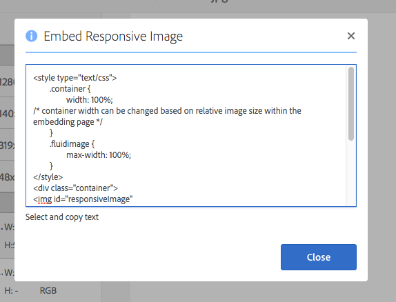

# Distribución de imágenes adaptables para un sitio interactivo {#delivering-optimized-images-for-a-responsive-site}

Utilice la función de código interactivo cuando desee compartir el código para la entrega interactiva con su desarrollador web. Copie el código adaptable (**[!UICONTROL RESS]**) en el portapapeles para poder compartirlo con el desarrollador web.

Esta función tiene sentido utilizarla si el sitio web se encuentra en un WCM de terceros. Sin embargo, si el sitio web está en Adobe Experience Manager, un servidor de imágenes externos procesa la imagen y la suministra a la página web.

Consulte también [Incrustación del visualizador de vídeo en una página web](embed-code.md).

Consulte también [Vinculación de URL a su aplicación web](linking-urls-to-yourwebapplication.md).

**Para ofrecer imágenes optimizadas para un sitio interactivo:**

1. Vaya a la imagen para la que desee proporcionar código interactivo y, en el menú desplegable, pulse **[!UICONTROL Representaciones]**.

   

1. Seleccione un ajuste preestablecido de imagen interactivo. Aparecerán los botones **[!UICONTROL URL]** y **[!UICONTROL RESS]**.

   

   >[!NOTE]
   >
   >El recurso seleccionado *y* el ajuste preestablecido de imagen o visualizador seleccionado deben publicarse para que los botones **[!UICONTROL URL]** o **[!UICONTROL RESS]** estén disponibles.
   >
   >Los ajustes preestablecidos de imagen se publican automáticamente.

1. Toque **[!UICONTROL RESS]**.

   

1. En el cuadro de diálogo **[!UICONTROL Incrustar imagen interactiva]**, seleccione, copie el texto del código interactivo y péguelo en el sitio web para acceder al recurso interactivo.
1. Edite los puntos de interrupción predeterminados en el código incrustado para que coincidan con lo que se encuentra en el sitio web adaptable, directamente en el código. Además, pruebe las distintas resoluciones de imagen que se proporcionan en diferentes puntos de interrupción de página.

## Uso de HTTP/2 para enviar los recursos de Dynamic Media {#using-http-to-delivery-your-dynamic-media-assets}

HTTP/2 es el nuevo protocolo web actualizado que mejora la forma en que se comunican los exploradores y los servidores. Proporciona una transferencia de información más rápida y reduce la cantidad de potencia de procesamiento necesaria. La entrega de recursos de Dynamic Media se admite mediante HTTP/2, que proporciona una mejor respuesta y tiempos de carga.

Consulte [Entrega HTTP2 de contenido](http2faq.md) para obtener información detallada sobre cómo empezar a utilizar HTTP/2 con su cuenta de Dynamic Media.
