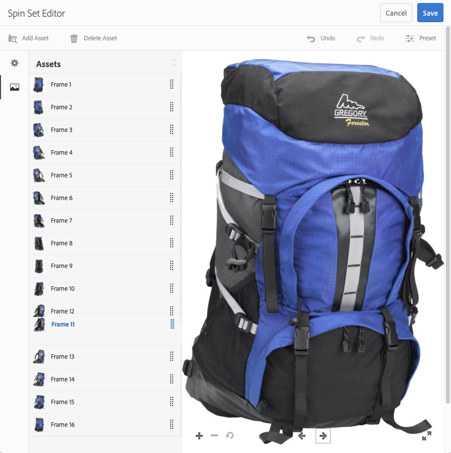

# Conjuntos de giros{#spin-sets}

Un conjunto de giros simula el acto del mundo real de girar un objeto para examinarlo. Los conjuntos de giros permiten ver los elementos desde cualquier ángulo, obteniendo los detalles visuales clave desde cualquier ángulo.

Un conjunto de giros simula una experiencia de visualización de 360°. Dynamic Media ofrece conjuntos de giros de un solo eje en los que los visualizadores pueden girar un elemento. Además, los usuarios pueden hacer zoom de forma libre y recorrer cualquiera de las vistas con unos pocos clics del ratón. De este modo, los usuarios pueden examinar un elemento más de cerca desde un punto de vista concreto.

Los conjuntos de giros se designan mediante un titular con la palabra **[!UICONTROL SPINSET]**. Además, si se publica el conjunto de giros, se muestra la fecha de publicación, indicada por el icono **[!UICONTROL Mundo]**, junto con la fecha de la última modificación, indicada por el icono **[!UICONTROL Lápiz]**.

>[!NOTE]
>
>Para obtener información sobre la interfaz de usuario de Assets, consulte [Administración de recursos con la interfaz táctil](/help/assets/manage-digital-assets.md) y aplíquela a una nueva carpeta en la que se carguen los recursos del conjunto de imágenes.

Al crear un conjunto de giros, Adobe recomienda la siguiente práctica recomendada y aplica el siguiente límite:

| Tipo de límite | Práctica recomendada | Límite impuesto |
| --- | --- | --- |
| Número máximo de filas/columnas por conjunto 2D | 12 a 18 imágenes por conjunto | 1000 |

Consulte también [Limitaciones de Dynamic Media](/help/assets/dynamic-media/limitations.md).

## Inicio rápido: Conjuntos de giros {#quick-start-spin-sets}

Para ponerse en marcha rápidamente con los conjuntos de giros, siga estos pasos:

1. Opcional. [Cree un ajuste preestablecido de conjunto por lotes](/help/assets/dynamic-media/batch-set-presets-dm.md) y aplíquelo a una nueva carpeta de recursos.

   Un ajuste preestablecido de conjunto por lotes puede ayudarle a automatizar la creación del conjunto de giros.

   >[!IMPORTANT]
   >
   >IPS (Image Production System) crea los conjuntos de lotes como parte de la ingesta de recursos.

1. [Cargar imágenes para varias vistas](#uploading-assets-for-spin-sets).

   Como mínimo, necesita 8-12 tomas de un artículo para un conjunto de giros unidimensional y 16-24 para un conjunto de giros bidimensional. Las tomas deben realizarse a intervalos regulares para dar la impresión de que el artículo está girando y volteando. Por ejemplo, si un conjunto de giros unidimensional incluye 12 disparos, gire el elemento 30° (360/12) para cada disparo.

   Consulte [Dynamic Media - Formatos de imagen rasterizada admitidos](/help/assets/file-format-support.md#image-support-dynamic-media) para obtener una lista de los formatos admitidos por los conjuntos de giros.

1. [Crear conjuntos de giros](#creating-spin-sets).

   Para crear un conjunto de giros, seleccione **[!UICONTROL Crear]** > **[!UICONTROL Conjunto de giros]** y, a continuación, asigne un nombre al conjunto, elija los recursos y elija el orden en que aparecen las imágenes.

   Consulte [Trabajar con selectores](/help/assets/dynamic-media/working-with-selectors.md).

1. Configure [ajustes preestablecidos del visualizador de conjuntos de giros](/help/assets/dynamic-media/managing-viewer-presets.md), según sea necesario.

   Los administradores pueden crear o modificar ajustes preestablecidos de visualizador de conjuntos de giros. Para ver el conjunto de giros con un ajuste preestablecido de visualizador, seleccione el conjunto de giros y, en el menú desplegable del carril izquierdo, seleccione **Visualizadores**.

   Para crear o editar ajustes preestablecidos de visor, consulte **[!UICONTROL Herramientas]** > **[!UICONTROL Assets]** > **[!UICONTROL Ajustes preestablecidos de visor]**.

   Consulte [Agregar y editar ajustes preestablecidos de visor](/help/assets/dynamic-media/managing-viewer-presets.md).

   Puede ver y acceder a los conjuntos creados mediante ajustes preestablecidos de conjuntos de lotes de tres formas diferentes. (Los conjuntos creados mediante ajustes preestablecidos de conjuntos de lotes, *no* aparecen en la interfaz de usuario).

1. [Previsualizar conjuntos de giros](/help/assets/dynamic-media/previewing-assets.md).

   Seleccione el conjunto de giros y podrá previsualizarlo. Gire el conjunto de giros. Puede elegir diferentes visores en el menú **[!UICONTROL Visualizadores]**, disponible en el menú desplegable del carril izquierdo.

1. [Publicar conjuntos de giros](/help/assets/dynamic-media/publishing-dynamicmedia-assets.md).

   La publicación de un conjunto de giros activa la URL y la cadena de incrustación. Además, debe [publicar el ajuste preestablecido de visor](/help/assets/dynamic-media/managing-viewer-presets.md).

1. [Vincular direcciones URL a la aplicación web](/help/assets/dynamic-media/linking-urls-to-yourwebapplication.md) o [Incrustar el visor de vídeo o de imágenes](/help/assets/dynamic-media/embed-code.md).

   Adobe Experience Manager Assets crea llamadas de URL para conjuntos de giros y las activa después de publicar los conjuntos de giros. Puede copiar estas direcciones URL al previsualizar los recursos. También puede incrustarlos en el sitio web.

   Seleccione el conjunto de giros y, a continuación, en el menú desplegable del carril izquierdo, seleccione **[!UICONTROL Visualizadores]**.

   Ver [Vincular un conjunto de giros a una página web](/help/assets/dynamic-media/linking-urls-to-yourwebapplication.md) e [Incrustar el visor de imágenes o vídeos](/help/assets/dynamic-media/embed-code.md).

Si es necesario, puede [editar conjuntos de giros](#editing-spin-sets). Además, puede ver y modificar [propiedades del conjunto de giros](/help/assets/manage-digital-assets.md#editing-properties).

## Cargar recursos para conjuntos de giros {#uploading-assets-for-spin-sets}

Como mínimo, necesita 8-12 tomas de un artículo para un conjunto de giros unidimensional. Las tomas deben realizarse a intervalos regulares para dar la impresión de que el artículo está girando y volteando. Por ejemplo, si un conjunto de giros unidimensional incluye 12 disparos, gire el elemento 30° (360/12) para cada disparo.

Consulte [Dynamic Media - Formatos de imagen rasterizada admitidos](/help/assets/file-format-support.md#image-support-dynamic-media) para obtener una lista de los formatos admitidos por los conjuntos de giros.

Puede cargar imágenes para los conjuntos de giros como haría [cargar cualquier otro recurso en Experience Manager Assets](/help/assets/manage-digital-assets.md).

### Directrices para capturar imágenes de un conjunto de giros {#guidelines-for-shooting-spin-set-images}

A continuación se indican algunas prácticas recomendadas en las imágenes de conjuntos de giros. En general, cuantas más imágenes tenga en un conjunto de giros, mejor será el efecto de giro de la imagen. Sin embargo, incluir muchas imágenes en el conjunto también aumenta la cantidad de tiempo que tardan las imágenes en cargarse. Experience Manager recomienda estas directrices para grabar imágenes para utilizarlas en conjuntos de giros:

* Como mínimo, utilice 8-12 imágenes en un conjunto de giros unidimensional y 16-24 imágenes en un conjunto de giros bidimensional. Es necesario un mínimo de 8 imágenes para poder girar 360°. Los conjuntos de giros unidimensionales son más comunes, ya que la creación de conjuntos de giros bidimensionales requiere mucha mano de obra.
* Utilice un formato sin pérdidas; se recomienda TIFF y PNG.
* Enmascara todas las imágenes de modo que el elemento aparezca sobre un fondo blanco puro u otro fondo de alto contraste. Opcionalmente, puede añadir sombras.
* Asegúrese de que los detalles del producto estén bien iluminados y enfocados.
* Tome imágenes de giro para la ropa de moda con un maniquí o modelo. A menudo, el maniquí está enmascarado (usando un maniquí de vidrio) o se muestra un maniquí estilizado/dressform en la imagen. Se puede crear un conjunto de giros en el modelo definiendo el número de ángulos. Marque cada ángulo con cinta en el suelo para que pueda guiar al modelo para que avance y mire en la dirección de cada disparo.

## Crear conjuntos de giros {#creating-spin-sets}

En esta sección se describe cómo crear conjuntos de giros.

>[!NOTE]
>
>También puede crear conjuntos de giros automáticamente mediante los [ajustes preestablecidos de conjuntos de lotes](/help/assets/dynamic-media/config-dm.md). **Importante:** IPS (Image Production System) crea los conjuntos de lotes como parte de la ingesta de recursos.
>
>Consulte &quot;Creación de ajustes preestablecidos de conjunto por lotes para generar automáticamente conjuntos de imágenes y conjuntos de giros&quot; en [Configurar Dynamic Media](/help/assets/dynamic-media/config-dm.md).

>[!NOTE]
>
>El orden en que aparecen las imágenes en un conjunto de giros es importante. Asegúrese de pedirlos de modo que el giro sea una vista suave de 360°.

Al crear un conjunto de giros, Adobe recomienda la siguiente práctica recomendada y aplica el siguiente límite:

| Tipo de límite | Práctica recomendada | Límite impuesto |
| --- | --- | --- |
| Número máximo de filas/columnas por conjunto 2D | 12 a 18 imágenes por conjunto | 1000 |

Consulte también [Limitaciones de Dynamic Media](/help/assets/dynamic-media/limitations.md).

**Para crear conjuntos de giros:**

1. En Assets, desplácese hasta donde desee crear un conjunto de giros, seleccione **[!UICONTROL Crear]** y, a continuación, **[!UICONTROL Conjunto de giros]**. También puede crear el conjunto desde una carpeta que contenga los recursos.

   

1. En el Editor de conjuntos de giros, en el campo **[!UICONTROL Título]**, escriba un nombre para el conjunto de giros. El nombre aparece en el titular del conjunto de giros. Si lo desea, introduzca una descripción.

   

   >[!NOTE]
   >
   >Al crear el conjunto de giros, puede cambiar la miniatura del conjunto de giros o permitir que Experience Manager seleccione la miniatura automáticamente en función de los recursos del conjunto de giros. Para seleccionar una miniatura, selecciona **[!UICONTROL Cambiar miniatura]** y selecciona cualquier imagen (también puedes navegar a otras carpetas para buscar imágenes). Si ha seleccionado una miniatura y, a continuación, decide que quiere que Experience Manager genere una del conjunto de giros, seleccione **[!UICONTROL Cambiar a Miniatura automática]**.

1. Realice una de las siguientes acciones:

   * Cerca de la esquina superior izquierda de la página Editor de conjuntos de giros, seleccione **[!UICONTROL Agregar recurso]**.

   * Cerca de la mitad de la página Editor de conjuntos de giros, seleccione **[!UICONTROL Seleccionar para abrir el Selector de recursos]**.

   Seleccione los recursos que desea incluir en el conjunto de giros. Los recursos seleccionados tienen un icono de marca de verificación sobre ellos. Cuando termine, cerca de la esquina superior derecha de la página, seleccione **[!UICONTROL Seleccionar]**.

   Con el Selector de recursos, puede buscar recursos escribiendo una palabra clave y pulsando **[!UICONTROL Retorno]**. También puede aplicar filtros para restringir los resultados de búsqueda. Puede filtrar por ruta, colección, tipo de archivo y etiqueta. Seleccione el filtro y, a continuación, seleccione el icono **[!UICONTROL Filtro]** en la barra de herramientas. Para cambiar la vista, pulse el icono Ver y seleccione **[!UICONTROL Vista de columna]**, **[!UICONTROL Vista de tarjeta]** o **[!UICONTROL Vista de lista]**.

   Consulte [Trabajar con selectores](/help/assets/dynamic-media/working-with-selectors.md).

   

1. Al agregar recursos al conjunto, estos se agregan automáticamente en orden alfanumérico. Puede reordenar u ordenar manualmente los recursos después de agregarlos.

   Si es necesario, arrastre el icono Reordenar de un recurso a la derecha del nombre de archivo del recurso para reordenar las imágenes hacia arriba o hacia abajo en la lista de conjuntos.

   

   Reordenación del fotograma 11 del conjunto de giros arrastrándolo a una nueva ubicación.

1. (Opcional) Realice una de las siguientes acciones:

   * Para eliminar una imagen, seleccione la imagen y seleccione **[!UICONTROL Eliminar recurso]**.

   * Para aplicar un ajuste preestablecido, cerca de la esquina superior derecha de la página, seleccione **[!UICONTROL Ajuste preestablecido]** y, a continuación, seleccione un ajuste preestablecido para aplicar a todos los recursos a la vez.

1. Seleccione **[!UICONTROL Guardar]**. El conjunto de giros creado aparecerá en la carpeta en la que lo creó.

## Visualización de conjuntos de giros {#viewing-spin-sets}

Puede crear conjuntos de giros en la interfaz de usuario o automáticamente mediante [ajustes preestablecidos de conjuntos de lotes](/help/assets/dynamic-media/config-dm.md). Sin embargo, los conjuntos creados mediante ajustes preestablecidos de conjuntos de lotes, *no* aparecen en la interfaz de usuario. Puede acceder a los conjuntos creados mediante ajustes preestablecidos de conjuntos de lotes de tres formas diferentes. (Estos métodos están disponibles aunque haya creado los conjuntos de giros en la interfaz de usuario).

>[!NOTE]
>
>También puede ver conjuntos a través de la interfaz de usuario, tal como se describe en [Editar conjuntos de giros](#editing-spin-sets).

**Para ver conjuntos de giros:**

1. Al abrir las propiedades de un recurso individual. Las propiedades indican de qué conjuntos es miembro el recurso seleccionado (en **[!UICONTROL Miembro de conjuntos]**). Para ver el conjunto completo, seleccione el nombre del conjunto.

   

1. Desde una imagen de miembro de cualquier conjunto. Seleccione el menú **[!UICONTROL Conjuntos]** para mostrar los conjuntos de los que es miembro el recurso.

   

1. Desde la búsqueda, puede seleccionar **[!UICONTROL Filtros]**, luego expandir **[!UICONTROL Dynamic Media]** y seleccionar **[!UICONTROL Conjuntos]**.

   La búsqueda devuelve conjuntos coincidentes creados manualmente en la interfaz de usuario o creados automáticamente mediante ajustes preestablecidos de conjuntos de lotes. Para los conjuntos automatizados, la consulta de búsqueda se realiza usando `Starts with` criterios de búsqueda que son diferentes de la búsqueda de Experience Manager que se basa en el uso de `Contains` criterios de búsqueda. Establecer el filtro en **[!UICONTROL Conjuntos]** es la única manera de buscar conjuntos automatizados.

   

## Editar conjuntos de giros {#editing-spin-sets}

Puede realizar varias tareas de edición en conjuntos de giros, como las siguientes:

* Añada imágenes al conjunto de giros.
* Reordene las imágenes del conjunto de giros.
* Elimine recursos del conjunto de giros.
* Aplicar ajustes preestablecidos de visor.
* Elimine el conjunto de giros.

**Para editar conjuntos de giros:**

1. Realice una de las siguientes acciones:

   * Pase el ratón sobre un recurso de conjunto de giros y luego seleccione **[!UICONTROL Editar]** (icono de lápiz).
   * Pase el ratón sobre un recurso de conjunto de giros, seleccione **[!UICONTROL Seleccionar]** (icono de marca de verificación) y, a continuación, seleccione **[!UICONTROL Editar]** en la barra de herramientas.

   * Seleccione un recurso de conjunto de giros y, a continuación, seleccione **[!UICONTROL Editar]** (icono de lápiz) en la barra de herramientas.

1. Para editar el conjunto de giros, realice una de las siguientes acciones:

   * Para reordenar las imágenes, arrastre una imagen a una nueva ubicación (seleccione el icono de reordenar para mover los elementos).
   * Para ordenar los elementos en orden ascendente o descendente, seleccione el encabezado de la columna.
   * Para agregar un recurso o actualizar un recurso existente, seleccione **[!UICONTROL Agregar recurso]**. Vaya a un recurso, selecciónelo y, a continuación, seleccione **[!UICONTROL Seleccionar]** cerca de la esquina superior derecha.
Si elimina la imagen que Experience Manager utiliza para la miniatura reemplazándola por otra imagen, se seguirá mostrando el recurso original.
   * Para eliminar un recurso, selecciónelo y seleccione **[!UICONTROL Eliminar recurso]**.
   * Para aplicar un ajuste preestablecido, seleccione el icono Ajuste preestablecido y elija uno.
   * Para eliminar un conjunto de giros completo, ve al conjunto de giros, selecciónalo y selecciona **[!UICONTROL Eliminar]**

   >[!NOTE]
   >
   >Para editar las imágenes de un conjunto de giros, vaya al conjunto, seleccione **[!UICONTROL Definir miembros]** en el carril izquierdo y, a continuación, seleccione el icono Lápiz en un recurso individual para abrir la ventana de edición.

1. Seleccione **[!UICONTROL Guardar]** cuando termine de editar.

## Previsualizar conjuntos de giros {#previewing-spin-sets}

Consulte [Vista previa de recursos](/help/assets/dynamic-media/previewing-assets.md).

## Publicar conjuntos de giros {#publishing-spin-sets}

Consulte [Publicar recursos](/help/assets/dynamic-media/publishing-dynamicmedia-assets.md).
