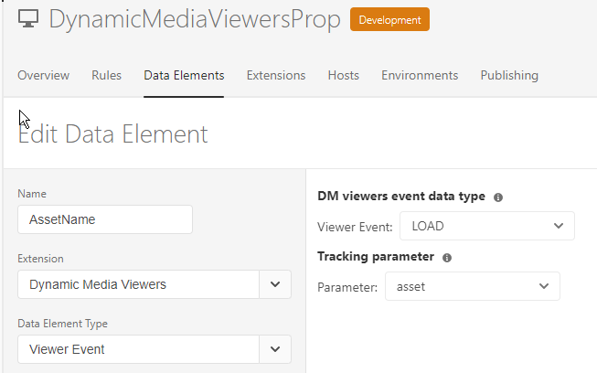
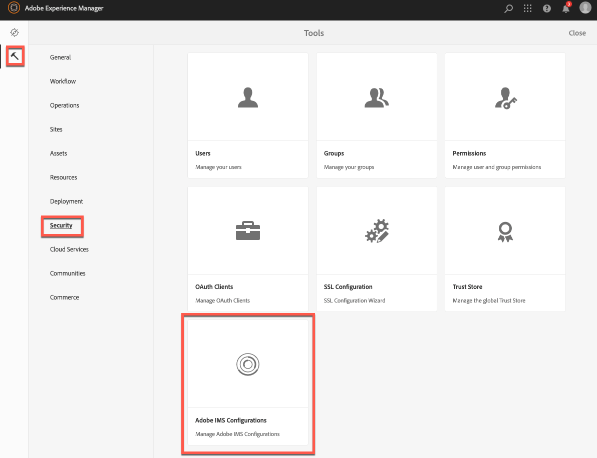

# Integración de visualizadores de Dynamic Media con etiquetas de Adobe Analytics y Experience Platform {#integrating-dynamic-media-viewers-with-adobe-analytics-and-adobe-launch}

## ¿Qué es la integración de visualizadores de Dynamic Media con las etiquetas de Adobe Analytics y Experience Platform? {#what-is-dynamic-media-viewers-integration-with-adobe-analytics-and-adobe-launch}

<!-- Leave this hidden path here; it points to the topic source from Sasha https://wiki.corp.adobe.com/pages/viewpage.action?spaceKey=~oufimtse&title=Dynamic+Media+Viewers+integration+with+Adobe+Launch 

name used to be Experience Platform Launch. Changed to Experience Platform Data Collection-->

La extensión *Visores de Dynamic Media* para etiquetas de Experience Platform funciona con Visores de Dynamic Media 5.13. Permite a los clientes de etiquetas de Adobe Analytics y Experience Platform utilizar eventos y datos de visualizadores de Dynamic Media en sus configuraciones de etiquetas.

Esta integración significa que puede realizar un seguimiento del uso de visualizadores de Dynamic Media en el sitio web con Adobe Analytics. Al mismo tiempo, puede utilizar los eventos y los datos expuestos por los visualizadores con cualquier otra extensión de etiquetas de Experience Platform que provenga de Adobe o de un tercero.

Para obtener más información sobre las extensiones de Adobe o de terceros, consulte [Extensiones de Adobe](https://experienceleague.adobe.com/es/docs/experience-platform/tags/extensions/overview) en la Guía del usuario de etiquetas de Experience Platform.

**Este tema está dirigido a:** Administradores del sitio, Desarrolladores del programa Adobe Experience Manager y usuarios de Operaciones.

### Limitaciones de la integración {#limitations-of-the-integration}

* La integración de etiquetas de Experience Platform para los visualizadores de Dynamic Media no funciona en el nodo de creación de Experience Manager. No puede ver ningún seguimiento desde una página WCM hasta que se publique.
* La integración de etiquetas de Experience Platform para visores de Dynamic Media no se admite en el modo de operación &quot;emergente&quot;, en el que la URL del visor se obtiene mediante el botón &quot;URL&quot; en la página Detalles del recurso.
* La integración de etiquetas de Experience Platform no se puede usar de forma simultánea con la integración de Analytics de visores heredados (mediante el parámetro `config2=`).
* La compatibilidad con el seguimiento de vídeos se limita únicamente al seguimiento de reproducción principal, tal como se describe en [Información general sobre el seguimiento](https://experienceleague.adobe.com/es/docs/media-analytics/using/tracking/track-core-overview#player-events). En particular, no se admiten QoS, anuncios, capítulos o segmentos ni el seguimiento de errores.
* La configuración de la duración del almacenamiento para los elementos de datos no se admite para los elementos de datos que usan la extensión *Visores de Dynamic Media*. La duración del almacenamiento debe establecerse en **[!UICONTROL None]**.

### Casos de uso para la integración {#use-cases-for-the-integration}

El caso de uso principal para la integración con etiquetas de Experience Platform son los clientes que utilizan Experience Manager Assets y Experience Manager Sites. En estos casos, puede configurar una integración estándar entre el nodo de creación de Experience Manager y las etiquetas de Experience Platform y, a continuación, asociar la instancia de Sites con la propiedad Etiquetas de Experience Platform. Después, cualquier componente WCM de Dynamic Media agregado a una página de Sites realizará un seguimiento de los datos y eventos de los visualizadores.

Consulte [Seguimiento de visores de Dynamic Media en Experience Manager Sites](#tracking-dynamic-media-viewers-in-aem-sites).

Un caso de uso secundario que admite la integración son los clientes que solo utilizan Experience Manager Assets o Dynamic Media Classic. En estos casos, se obtiene el código incrustado del visor y se agrega a la página del sitio web. A continuación, obtenga la URL de producción de la biblioteca Experience Platform Tags desde Experience Platform Tags y agréguela manualmente al código de la página web.

Consulte [Seguimiento de visores de Dynamic Media mediante código incrustado](#tracking-dynamic-media-viewers-using-embed-code).

## Funcionamiento de los datos y el seguimiento de eventos en la integración {#how-data-and-event-tracking-works-in-the-integration}

La integración aprovecha dos tipos independientes de seguimiento de visores de Dynamic Media: *Adobe Analytics* y *Adobe Analytics para audio y vídeo*.

### Acerca del seguimiento con Adobe Analytics {#about-tracking-using-adobe-analytics}

Adobe Analytics permite rastrear las acciones que realiza un usuario cuando interactúa con los visualizadores de Dynamic Media en el sitio web. Adobe Analytics también le permite hacer un seguimiento de datos específicos del visor. Por ejemplo, puede rastrear y registrar eventos de carga de vista junto con el nombre del recurso, cualquier acción de zoom que se haya producido y las acciones de reproducción de vídeo.

En las etiquetas de Experience Platform, los conceptos de *elementos de datos* y *reglas* trabajan juntos para habilitar el seguimiento de Adobe Analytics.

#### Acerca de los elementos de datos en las etiquetas de Experience Platform {#about-data-elements-in-adobe-launch}

Un elemento de datos en las etiquetas de Experience Platform es una propiedad con nombre cuyo valor se define estáticamente o se calcula dinámicamente en función del estado de una página web o de los datos de visualizadores de Dynamic Media.

Las opciones disponibles para una definición de elemento de datos dependen de la lista de extensiones instaladas en la propiedad Experience Platform Tags. La extensión &quot;Core&quot; está preinstalada y disponible de forma predeterminada en cualquier configuración. Esta extensión &quot;Core&quot; permite definir un elemento de datos cuyo valor proviene de una cookie, un código JavaScript, una cadena de consulta y muchas otras fuentes.

Para el seguimiento de Adobe Analytics, se deben instalar otras extensiones, como se describe en [Instalación y configuración de extensiones](#installing-and-setup-of-extensions). La extensión de visualizadores de Dynamic Media agrega la capacidad de definir un elemento de datos cuyo valor es un argumento del evento de visualizador dinámico. Por ejemplo, es posible hacer referencia al tipo de visor o al nombre del recurso notificado por el visor al cargar, al nivel de zoom notificado cuando el usuario final amplía y a mucho más.

La extensión del visualizador de Dynamic Media mantiene automáticamente los valores de sus elementos de datos actualizados.

Una vez definido, se puede utilizar un elemento de datos en otros lugares de la interfaz de usuario de etiquetas de Experience Platform mediante el widget selector de elementos de datos. La **acción Establecer variables** de la extensión de Adobe Analytics en una regla hace referencia a los elementos de datos definidos para el seguimiento de visualizadores de Dynamic Media (ver a continuación).

Consulte [Elementos de datos](https://experienceleague.adobe.com/es/docs/experience-platform/tags/ui/data-elements) en la Guía del usuario de etiquetas de Experience Platform.

#### Acerca de las reglas en las etiquetas de Experience Platform {#about-rules-in-adobe-launch}

Una regla de las etiquetas de Experience Platform es una configuración agnóstica que define tres áreas que conforman una regla: *Eventos*, *Condiciones* y *Acciones*:

* *Eventos* (if) indica a las etiquetas de Experience Platform cuándo almacenar en déclencheur una regla.
* *Las condiciones* (si se cumplen) indican a las etiquetas de Experience Platform qué otras restricciones se deben permitir o no permitir al activar una regla.
* *Acciones* (entonces) indica a las etiquetas de Experience Platform qué hacer cuando se activa una regla.

Las opciones disponibles en la sección Eventos, condiciones y acciones dependen de las extensiones instaladas en la propiedad Etiquetas de Experience Platform. La extensión *Core* está preinstalada y disponible de forma predeterminada en cualquier configuración. La extensión proporciona varias opciones para Eventos, como acciones básicas a nivel de explorador que incluyen cambios de enfoque, pulsaciones de teclas y envíos de formularios. También incluye opciones para Condiciones, como valor de la cookie, tipo de explorador y más. Para las acciones, solo está disponible la opción Código personalizado.

Para el seguimiento de Adobe Analytics, se deben instalar otras extensiones, como se describe en [Instalación y configuración de extensiones](#installing-and-setup-of-extensions). Específicamente:

* La extensión de visores de Dynamic Media amplía la lista de eventos admitidos a eventos específicos de visores de Dynamic Media, como la carga del visor, el intercambio de recursos, el zoom y la reproducción de vídeo.
* La extensión de Adobe Analytics amplía la lista de acciones admitidas con dos acciones necesarias para enviar datos a los servidores de seguimiento: *Establecer variables* y *Enviar señalización*.

Para rastrear visores de Dynamic Media, es posible utilizar cualquier tipo de lo siguiente:

* Eventos de la extensión Visualizadores de Dynamic Media, la extensión principal o cualquier otra extensión.
* Condiciones en la definición de regla. O bien, puede dejar vacía el área de condiciones.

En la sección Acciones, es necesario que tenga una acción *Set Variables*. Esta acción le indica a Adobe Analytics cómo rellenar variables de seguimiento con datos. Al mismo tiempo, la acción *Set Variables* no envía nada al servidor de seguimiento.

La acción **Enviar señalización** debe seguir la acción **Establecer variables**. La acción *Send Beacon* envía datos al servidor de seguimiento de Analytics. Ambas acciones, *Set Variables* y *Send Beacon*, provienen de la extensión de Adobe Analytics.

Consulte las [reglas](https://experienceleague.adobe.com/es/docs/experience-platform/tags/ui/rules) en la Guía del usuario de etiquetas de Experience Platform.

#### Configuración de muestra {#sample-configuration}

La siguiente configuración de ejemplo en Etiquetas de Experience Platform muestra cómo rastrear un nombre de recurso al cargar el visor.

1. En la ficha **[!UICONTROL Elementos de datos]**, defina un elemento de datos `AssetName` que haga referencia al parámetro `asset` del evento `LOAD` desde la extensión Visualizadores de Dynamic Media.

   

1. En la ficha **[!UICONTROL Reglas]**, defina una regla *TrackAssetOnLoad*.

   En esta regla, el campo **[!UICONTROL Event]** utiliza el evento **[!UICONTROL LOAD]** de la extensión de visores de Dynamic Media.

   

1. La configuración de acción tiene dos tipos de acción de la extensión de Adobe Analytics:

   *Establecer variables*, que asigna una variable de análisis de su elección al valor de `AssetName` elemento de datos.

   *Enviar señalización*, que envía información de seguimiento a Adobe Analytics.

   

1. La configuración de regla resultante aparece de la siguiente manera:

   

### Acerca de Adobe Analytics para audio y vídeo {#about-adobe-analytics-for-audio-and-video}

Cuando una cuenta de Experience Cloud está suscrita para usar Adobe Analytics para audio y vídeo, basta con habilitar el seguimiento de vídeo en la configuración de la extensión *Visores de Dynamic Media*. Las métricas de vídeo están disponibles en Adobe Analytics. El seguimiento de vídeos depende de la presencia de la extensión de Adobe Media Analytics para audio y vídeo.

Consulte [Instalación y configuración de extensiones](#installing-and-setup-of-extensions).

Actualmente, la compatibilidad con el seguimiento de vídeos se limita únicamente al seguimiento de &quot;reproducción principal&quot;, tal como se describe en [Información general de seguimiento](https://experienceleague.adobe.com/es/docs/media-analytics/using/tracking/track-core-overview#player-events). En particular, no se admiten QoS, anuncios, capítulos o segmentos ni el seguimiento de errores.

## Uso de la extensión Visualizadores de Dynamic Media {#using-the-dynamic-media-viewers-extension}

Como se mencionó en [Casos de uso para la integración](#use-cases-for-the-integration), es posible rastrear visualizadores de Dynamic Media con la nueva integración de etiquetas de Experience Platform en Experience Manager Sites y utilizando código incrustado.

### Seguimiento de visores de Dynamic Media en Experience Manager Sites {#tracking-dynamic-media-viewers-in-aem-sites}

Para hacer un seguimiento de los visores de Dynamic Media en Experience Manager Sites, se deben realizar todos los pasos enumerados en la sección [Configurar todas las partes de la integración](#configuring-all-the-integration-pieces). Específicamente, debe crear la configuración de IMS y la configuración de nube de etiquetas de Experience Platform.

Siguiendo la configuración adecuada, cualquier visor de Dynamic Media que agregue a una página de Sites mediante un componente WCM compatible con Dynamic Media, rastreará automáticamente los datos en Adobe Analytics, Adobe Analytics para vídeo o ambos.

Consulte [Agregar Dynamic Media Assets a páginas que usan Adobe Sites](/help/assets/dynamic-media/adding-dynamic-media-assets-to-pages.md).

### Seguimiento de visores de Dynamic Media mediante código incrustado {#tracking-dynamic-media-viewers-using-embed-code}

Los clientes que no utilicen Experience Manager Sites o que incrusten visores de Dynamic Media en páginas web fuera de Experience Manager Sites, o en ambas, pueden seguir utilizando la integración de etiquetas de Experience Platform.

Complete los pasos de configuración de las secciones [Configuración de Adobe Analytics](#configuring-adobe-analytics-for-the-integration) y [Configuración de etiquetas de Experience Platform](#configuring-adobe-launch-for-the-integration). Sin embargo, no es necesario realizar pasos de configuración relacionados con Experience Manager.

Después de la configuración adecuada, puede agregar compatibilidad con etiquetas de Experience Platform a una página web con un visualizador de Dynamic Media.

Consulte [Agregar el código incrustado de etiquetas de Experience Platform](https://experienceleague.adobe.com/es/docs/platform-learn/implement-in-websites/configure-tags/add-embed-code) para obtener más información sobre cómo usar el código incrustado de la biblioteca de etiquetas de Experience Platform.

Para obtener más información sobre cómo usar la característica de código incrustado de Experience Manager Dynamic Media, consulte [Incrustar el visor de vídeo o imágenes en una página web](/help/assets/dynamic-media/embed-code.md).

**Rastrear visores de Dynamic Media con código incrustado:**

1. Tenga una página web lista para incrustar un visualizador de Dynamic Media.
1. Obtenga el código incrustado para la biblioteca de etiquetas de Experience Platform iniciando sesión primero en Experience Platform Tags (consulte [Configuración de etiquetas de Experience Platform](#configuring-adobe-launch-for-the-integration)).
1. Seleccione **[!UICONTROL Propiedad]** y, a continuación, haga clic en la ficha **[!UICONTROL Entornos]**.
1. Elija el Nivel de entorno que sea relevante para el entorno de la página web. A continuación, en la columna **[!UICONTROL Instalar]**, haga clic en el icono de cuadro.
1. **[!UICONTROL En el cuadro de diálogo Instrucciones de instalación web]**, copie el código incrustado completo de la biblioteca de etiquetas de Experience Platform junto con las etiquetas `<script/>` que lo rodean.

## Guía de referencia para la extensión Visualizadores de Dynamic Media {#reference-guide-for-the-dynamic-media-viewers-extension}

### Acerca de la configuración de visores de Dynamic Media {#about-the-dynamic-media-viewers-configuration}

La extensión del visualizador de Dynamic Media se integra automáticamente con la biblioteca de etiquetas de Experience Platform si se cumplen las siguientes condiciones:

* El objeto global de biblioteca de etiquetas de Experience Platform (`_satellite`) está presente en la página.
* La función de extensión de visualizadores de Dynamic Media `_dmviewers_v001()` se ha definido en `_satellite`.

* No se ha especificado el parámetro de visor `config2=`, lo que significa que el visor no utiliza la integración heredada de Analytics.

Además, existe la opción de deshabilitar la integración de etiquetas de Experience Platform de forma explícita en el visor especificando el parámetro `launch=0` en la configuración del visor. El valor predeterminado de este parámetro es `1`.

### Configurar la extensión de visores de Dynamic Media {#configuring-the-dynamic-media-viewers-extension}

La única opción de configuración para la extensión Visualizadores de Dynamic Media es **[!UICONTROL Habilitar Adobe Media Analytics para audio y vídeo]**.

Al marcar (habilitar) esta opción y al instalar y configurar la extensión de Adobe Media Analytics para audio y vídeo, las métricas de reproducción de vídeo se envían a la solución Adobe Analytics para audio y vídeo. Al deshabilitar esta opción, se desactiva el seguimiento de vídeo.

Si habilita esta opción *sin que* tenga instalada la extensión de audio y vídeo de Adobe Media Analytics, la opción no tendrá ningún efecto.

### Acerca de los elementos de datos en la extensión Visualizadores de Dynamic Media {#about-data-elements-in-the-dynamic-media-viewers-extension}

El único tipo de elemento de datos que proporciona la extensión Visualizadores de Dynamic Media es el **[!UICONTROL Evento de visualizador]** de la lista desplegable **[!UICONTROL Tipo de elemento de datos]**.

Cuando se selecciona, el editor de elementos de datos procesa un formulario con dos campos:

* **[!UICONTROL Tipo de datos de evento de visualizadores de DM]**: una lista desplegable muestra todos los eventos de visualizador con argumentos admitidos por la extensión de visualizadores de Dynamic Media, junto con un elemento **[!UICONTROL COMÚN]** especial. Un elemento **[!UICONTROL COMÚN]** representa una lista de parámetros de evento que son comunes a todos los tipos de eventos enviados por los visualizadores.
* **[!UICONTROL Parámetro de seguimiento]**: un argumento del evento de visualizador de Dynamic Media seleccionado.

Consulte la [Guía de referencia de visores de Dynamic Media](https://experienceleague.adobe.com/es/docs/dynamic-media-developer-resources/library/viewers-aem-assets-dmc/c-html5-s7-aem-asset-viewers) para obtener la lista de eventos admitidos por cada tipo de visor; vaya a la sección específica del visor y, a continuación, seleccione la subsección Compatibilidad con el seguimiento de Adobe Analytics. Actualmente, la guía de referencia de visores de Dynamic Media no documenta argumentos de evento.

Veamos ahora el ciclo de vida de los visualizadores de Dynamic Media *Data Element*. El valor de este elemento de datos se rellena después de que el evento de visualizador de Dynamic Media correspondiente se produzca en la página. Por ejemplo, supongamos que el elemento de datos señala al evento **[!UICONTROL LOAD]** y a su argumento &quot;asset&quot;. El valor de un elemento de datos de este tipo recibe datos válidos después de que el visor ejecute el evento LOAD por primera vez. Si el elemento de datos apunta al evento **[!UICONTROL ZOOM]** y su argumento &quot;scale&quot;, el valor de dicho elemento de datos permanece vacío hasta que el visor envíe un evento **[!UICONTROL ZOOM]** por primera vez.

Del mismo modo, los valores de los elementos de datos se actualizan automáticamente cuando el visor envía un evento correspondiente a la página. La actualización de valor se produce incluso si el evento concreto no se especifica en la configuración de regla. Por ejemplo, supongamos que el elemento de datos **[!UICONTROL ZoomScale]** está definido para el parámetro &quot;scale&quot; del evento ZOOM. Sin embargo, el evento **[!UICONTROL LOAD]** es el único déclencheur en la configuración de la regla. El valor de **[!UICONTROL ZoomScale]** se actualiza cada vez que un usuario ejecuta zoom dentro del visor.

Cualquier visualizador de Dynamic Media tiene un identificador único en la página web. El elemento de datos realiza un seguimiento del valor mismo y del visualizador que lo ha rellenado. Por ejemplo, supongamos que hay varios visualizadores en la misma página y un elemento de datos **[!UICONTROL AssetName]** que señala al evento **[!UICONTROL LOAD]** y a su argumento &quot;asset&quot;. El elemento de datos **[!UICONTROL AssetName]** mantiene una colección de nombres de recursos asociados a cada visor cargado en la página.

El valor exacto devuelto por el elemento de datos depende del contexto. Si una regla activada por un evento de visualizador de Dynamic Media solicita el elemento de datos, se devuelve el valor para el visualizador que inició la regla. Si una regla activada por un evento desde otra extensión de etiquetas de Experience Platform solicita el elemento de datos, sigue el contexto del evento correspondiente. En este punto, el valor del elemento de datos proviene del visor que actualizó por última vez este elemento de datos.

**Tenga en cuenta la siguiente configuración de ejemplo:**

* Una página web que tiene dos visores de zoom de Dynamic Media: *viewer1* y *viewer2*.

* El elemento de datos **[!UICONTROL ZoomScale]** señala al evento **[!UICONTROL ZOOM]** y a su argumento &quot;scale&quot;.
* Regla **[!UICONTROL TrackPan]** con lo siguiente:

   * Utiliza el evento **[!UICONTROL PAN]** del visualizador de Dynamic Media como déclencheur.
   * Envía el valor del elemento de datos **[!UICONTROL ZoomScale]** a Adobe Analytics.

* Regla **[!UICONTROL TrackKey]** con:

   * Utiliza el evento de pulsación de teclas de la extensión de etiquetas de Experience Platform principal como déclencheur.
   * Envía el valor del elemento de datos **[!UICONTROL ZoomScale]** a Adobe Analytics.

Ahora, supongamos que el usuario carga la página web con los dos visores. En *viewer1*, se amplía a una escala del 50%; a continuación, en *viewer2*, se amplía a una escala del 25%. En *viewer1*, recorren la imagen y finalmente presionan una tecla del teclado.

La actividad del usuario provoca que se realicen las dos llamadas de seguimiento siguientes a Adobe Analytics:

* La primera llamada se produce porque la regla **[!UICONTROL TrackPan]** se activa cuando el usuario se desplaza en *viewer1*. Esa llamada envía **50%** como valor del elemento de datos **[!UICONTROL ZoomScale]** porque reconoce que *viewer1* activó la regla y recupera el valor de escala correspondiente;
* La segunda llamada se produce porque la regla **[!UICONTROL TrackKey]** se activa cuando el usuario presiona una tecla del teclado. Esa llamada envía el 25 % como valor del elemento de datos **[!UICONTROL ZoomScale]** porque el visor no almacenó en déclencheur la regla. Como tal, el elemento de datos devuelve el valor más actualizado.

El ejemplo configurado anteriormente también afecta a la duración del valor del elemento de datos. El valor del elemento de datos administrado por el visualizador de Dynamic Media se almacena en el código de biblioteca de etiquetas de Experience Platform incluso después de que el propio visualizador se haya eliminado de la página web. Esta funcionalidad significa que si una regla activada por una extensión de visualizador de Dynamic Media no hace referencia al elemento de datos, devuelve el último valor conocido. Incluso si el visualizador ya no está presente en la página web.

En cualquier caso, los valores de los elementos de datos impulsados por los visualizadores de Dynamic Media no se almacenan en el almacenamiento local ni en el servidor; en su lugar, solo se guardan en la biblioteca de etiquetas de Experience Platform del lado del cliente. Los valores de este elemento de datos desaparecen cuando se vuelve a cargar la página web.

Por lo general, el editor de elementos de datos admite [selección de duración del almacenamiento](https://experienceleague.adobe.com/es/docs/experience-platform/tags/ui/data-elements#create-a-data-element). Sin embargo, los elementos de datos que utilizan la extensión Visualizadores de Dynamic Media solo admiten la opción de duración del almacenamiento de **[!UICONTROL None]**. Es posible configurar cualquier otro valor en la interfaz de usuario, pero el comportamiento del elemento de datos no está definido en este caso. La extensión administra el valor del elemento de datos por su cuenta: el elemento de datos que mantiene el valor del argumento de evento del visor durante todo el ciclo de vida del visor.

### Acerca de las reglas en la extensión Visualizadores de Dynamic Media {#about-rules-in-the-dynamic-media-viewers-extension}

En el Editor de reglas, la extensión agrega nuevas opciones de configuración para el Editor de eventos. Además, el editor proporciona una opción para hacer referencia a los parámetros de evento manualmente en el editor de acciones como una opción abreviada en lugar de utilizar elementos de datos preconfigurados.

#### Acerca del editor de eventos {#about-the-events-editor}

En el editor de eventos, la extensión Visualizadores de Dynamic Media agrega un **[!UICONTROL Tipo de evento]** denominado **[!UICONTROL Evento de visualizador]**.

Cuando se selecciona, el editor de eventos muestra la lista desplegable **[!UICONTROL Eventos del visualizador de Dynamic Media]**, que enumera todos los eventos admitidos por los visualizadores de Dynamic Media.

#### Acerca del editor de acciones {#about-the-actions-editor}

La extensión Visualizadores de Dynamic Media permite utilizar parámetros de evento de visualizadores de Dynamic Media para asignar a variables de análisis en el editor de variables de conjunto de la extensión de Adobe Analytics.

El método más sencillo es completar el siguiente proceso en dos pasos:

* En primer lugar, defina uno o varios elementos de datos, donde cada elemento de datos representa un parámetro de un evento de visualizador de Dynamic Media.
* Por último, en el editor Set Variables de la extensión de Adobe Analytics, haga clic en  **selector de elementos de datos** para abrir el cuadro de diálogo Seleccionar elemento de datos y, a continuación, haga clic en un elemento de datos del mismo.

Sin embargo, es posible utilizar un enfoque alternativo y evitar la creación de elementos de datos. Puede hacer referencia directamente a un argumento desde un evento de visualizador de Dynamic Media. Escriba el nombre completo del argumento de evento en el campo de entrada **[!UICONTROL value]** de la asignación de variables de Analytics. Asegúrese de que los signos de porcentaje (%) estén rodeados. Por ejemplo,

`%event.detail.dm.LOAD.asset%`

Hay una diferencia importante entre el uso de elementos de datos y la referencia de argumentos de evento directo. Para el elemento de datos, no importa qué déclencheur de evento provoquen la acción Establecer variables. El evento que déclencheur la regla puede no estar relacionado con el visualizador dinámico (como seleccionar la página web de la extensión principal). Sin embargo, al utilizar una referencia de argumento directo es importante asegurarse de que el evento que déclencheur la regla corresponda al argumento de evento al que hace referencia.

Por ejemplo, si el evento **[!UICONTROL LOAD]** de la extensión del visualizador de Dynamic Media almacena en déclencheur la regla, la referencia a `%event.detail.dm.LOAD.asset%` devuelve el nombre de recurso correcto.

Sin embargo, devuelve un valor vacío para cualquier otro evento.

En la tabla siguiente se enumeran los eventos del visualizador de Dynamic Media y sus argumentos admitidos:

<table>
 <tbody>
  <tr>
   <td>Nombre del evento del visor</td>
   <td>Referencia de argumento</td>
  </tr>
  <tr>
   <td><code>COMMON</code></td>
   <td><code>%event.detail.dm.objID%</code></td>
  </tr>
  <tr>
   <td> </td>
   <td><code>%event.detail.dm.compClass%</code></td>
  </tr>
  <tr>
   <td> </td>
   <td><code>%event.detail.dm.instName%</code></td>
  </tr>
  <tr>
   <td> </td>
   <td><code>%event.detail.dm.timeStamp%</code></td>
  </tr>
  <tr>
   <td><code>BANNER</code>  </td>
   <td><code>%event.detail.dm.BANNER.asset%</code></td>
  </tr>
  <tr>
   <td> </td>
   <td><code>%event.detail.dm.BANNER.frame%</code></td>
  </tr>
  <tr>
   <td> </td>
   <td><code>%event.detail.dm.BANNER.label%</code></td>
  </tr>
  <tr>
   <td><code>HREF</code></td>
   <td><code>%event.detail.dm.HREF.rollover%</code></td>
  </tr>
  <tr>
   <td><code>ITEM</code></td>
   <td><code>%event.detail.dm.ITEM.rollover%</code></td>
  </tr>
  <tr>
   <td><code>LOAD</code></td>
   <td><code>%event.detail.dm.LOAD.applicationname%</code></td>
  </tr>
  <tr>
   <td><strong> </strong></td>
   <td><code>%event.detail.dm.LOAD.asset%</code></td>
  </tr>
  <tr>
   <td><strong> </strong></td>
   <td><code>%event.detail.dm.LOAD.company%</code></td>
  </tr>
  <tr>
   <td><strong> </strong></td>
   <td><code>%event.detail.dm.LOAD.sdkversion%</code></td>
  </tr>
  <tr>
   <td><strong> </strong></td>
   <td><code>%event.detail.dm.LOAD.viewertype%</code></td>
  </tr>
  <tr>
   <td><strong> </strong></td>
   <td><code>%event.detail.dm.LOAD.viewerversion%</code></td>
  </tr>
  <tr>
   <td><code>METADATA</code></td>
   <td><code>%event.detail.dm.METADATA.length%</code></td>
  </tr>
  <tr>
   <td> </td>
   <td><code>%event.detail.dm.METADATA.type%</code></td>
  </tr>
  <tr>
   <td><code>MILESTONE</code></td>
   <td><code>%event.detail.dm.MILESTONE.milestone%</code></td>
  </tr>
  <tr>
   <td><code>PAGE</code></td>
   <td><code>%event.detail.dm.PAGE.frame%</code></td>
  </tr>
  <tr>
   <td> </td>
   <td><code>%event.detail.dm.PAGE.label%</code></td>
  </tr>
  <tr>
   <td><code>PAUSE</code></td>
   <td><code>%event.detail.dm.PAUSE.timestamp%</code></td>
  </tr>
  <tr>
   <td><code>PLAY</code></td>
   <td><code>%event.detail.dm.PLAY.timestamp%</code></td>
  </tr>
  <tr>
   <td><code>SPIN</code></td>
   <td><code>%event.detail.dm.SPIN.framenumber%</code></td>
  </tr>
  <tr>
   <td><code>STOP</code></td>
   <td><code>%event.detail.dm.STOP.timestamp%</code></td>
  </tr>
  <tr>
   <td><code>SWAP</code></td>
   <td><code>%event.detail.dm.SWAP.asset%</code></td>
  </tr>
  <tr>
   <td><code>SWATCH</code></td>
   <td><code>%event.detail.dm.SWATCH.frame%</code></td>
  </tr>
  <tr>
   <td> </td>
   <td><code>%event.detail.dm.SWATCH.label%</code></td>
  </tr>
  <tr>
   <td><code>TARG</code></td>
   <td><code>%event.detail.dm.TARG.frame%</code></td>
  </tr>
  <tr>
   <td> </td>
   <td><code>%event.detail.dm.TARG.label%</code></td>
  </tr>
  <tr>
   <td><code>ZOOM</code></td>
   <td><code>%event.detail.dm.ZOOM.scale%</code></td>
  </tr>
 </tbody>
</table>

## Configurar todas las piezas de integración {#configuring-all-the-integration-pieces}

**ANTES DE COMENZAR**

Adobe recomienda revisar toda la documentación antes de esta sección para comprender la integración completa.

En esta sección se explican los pasos de configuración necesarios para integrar los visores de Dynamic Media con Adobe Analytics y Adobe Analytics para audio y vídeo. Aunque el uso de la extensión de visores de Dynamic Media para otros fines en etiquetas de Experience Platform es posible, estos escenarios no se tratan en esta documentación.

Va a utilizar los siguientes productos de Adobe para configurar su integración:

* Adobe Analytics: se utiliza para configurar variables e informes de seguimiento.
* Etiquetas de Experience Platform: se utilizan para definir una propiedad, una o más reglas y uno o más elementos de datos para habilitar el seguimiento del visor.

Además, si esta solución de integración se utiliza con Experience Manager Sites, se debe realizar la siguiente configuración:

* [Adobe Developer Console](https://developer.adobe.com/console/home): la integración se ha creado para las etiquetas de Experience Platform.
* Nodo de creación de Experience Manager: configuración de IMS y configuración de Experience Platform Tags Cloud.

Como parte de la configuración, asegúrese de que tiene acceso a una empresa en Adobe Experience Cloud que ya tiene habilitadas las etiquetas Adobe Analytics y Experience Platform.

## Configuración de Adobe Analytics para la integración {#configuring-adobe-analytics-for-the-integration}

Después de configurar Adobe Analytics, la integración se configura para lo siguiente:

* Se establece un grupo de informes y se selecciona.
* Las variables de Analytics están disponibles para recibir datos de seguimiento.
* Los informes están disponibles para ver los datos recopilados dentro de Adobe Analytics.

Consulte también [Guía de implementación de Analytics](https://experienceleague.adobe.com/es/docs/analytics/implementation/home).

**Para configurar Adobe Analytics para la integración:**

1. Comience por acceder a Adobe Analytics desde la [página principal](https://experience.adobe.com/#/home) de Experience Cloud. En la barra de menús, haga clic en el icono  **Soluciones** cerca de la esquina superior derecha de la página y, a continuación, seleccione **[!UICONTROL Analytics]**.

   

   Ahora, seleccione un grupo de informes.

### Selección de un grupo de informes {#selecting-a-report-suite}

1. Cerca de la esquina superior derecha de la página Adobe Analytics, a la derecha del campo **[!UICONTROL Buscar informes]**, seleccione el grupo de informes correcto en la lista desplegable. Si hay varios grupos de informes disponibles y no está seguro de cuál usar, pida ayuda. El administrador de Adobe Analytics puede guiarle en la selección del grupo de informes adecuado.

   En el ejemplo siguiente, un usuario creó un grupo de informes denominado *DynamicMediaViewersExtensionDoc* y lo seleccionó en la lista desplegable. El nombre del grupo de informes es solo un ejemplo. El nombre del grupo de informes que seleccione en última instancia depende de usted.

   Si no hay ningún grupo de informes disponible, usted o el administrador de Adobe Analytics deben crear uno para poder continuar con la configuración.

   Ver [Informes y grupos de informes](https://experienceleague.adobe.com/es/docs/analytics/admin/admin-tools/manage-report-suites/report-suites-admin) y [Crear un grupo de informes](https://experienceleague.adobe.com/es/docs/analytics/admin/admin-tools/manage-report-suites/c-new-report-suite/t-create-a-report-suite).

   En Adobe Analytics, los grupos de informes se administran en **[!UICONTROL Administración]** > **[!UICONTROL Grupos de informes]**.

   

   Ahora, configure las variables de Adobe Analytics.

### Configuración de variables de Adobe Analytics {#setting-up-adobe-analytics-variables}

1. Designe una o más variables de Adobe Analytics que desee utilizar para realizar un seguimiento del comportamiento de los visualizadores de Dynamic Media en la página web.

   Puede utilizar cualquier tipo de variable compatible con Adobe Analytics. La implementación de Analytics debe determinar el tipo de variable adecuado, como Tráfico personalizado (`props`) o Conversión (`eVar`).

   Consulte [Información general sobre props y eVars](https://experienceleague.adobe.com/es/docs/analytics/implementation/vars/page-vars/evar#vars).

   A los efectos de esta documentación, solo se utiliza una variable de tráfico personalizado (props) porque está disponible en un informe de Analytics pocos minutos después de que se produzca una acción en una página web.

   Para habilitar una nueva variable Tráfico personalizado, en Adobe Analytics, en la barra de herramientas, ve a **[!UICONTROL Administración]** > **[!UICONTROL Grupos de informes]**.

1. En la página **[!UICONTROL Administrador del grupo de informes]**, seleccione el informe correcto.
1. En la barra de herramientas, haga clic en **[!UICONTROL Editar configuración]** > **[!UICONTROL Tráfico]** > **[!UICONTROL Variables de tráfico]**.
1. Elija una variable no utilizada, asígnele un nombre descriptivo (**[!UICONTROL Recurso del visor (prop 30)]**) y, a continuación, cambie el cuadro combinado a &quot;Habilitado&quot; en la columna Habilitado.

   La siguiente captura de pantalla es un ejemplo de una variable de tráfico personalizado (**[!UICONTROL prop30]**) para rastrear un nombre de recurso usado por el visor:

   

1. En la parte inferior de la lista de variables, haga clic en **[!UICONTROL Guardar]**.

### Configuración de un informe {#setting-up-a-report}

Por lo general, las necesidades específicas de los proyectos determinan la configuración de los informes en Adobe Analytics. Como tal, la configuración detallada de un informe está fuera del ámbito de esta integración.

Sin embargo, basta con saber que los informes Tráfico personalizado estarán disponibles automáticamente en Adobe Analytics cuando haya configurado variables de Tráfico personalizado en **[Configurar variables de Adobe Analytics](#setting-up-adobe-analytics-variables)**.

Por ejemplo, el informe de **[!UICONTROL recurso del visor (prop 30)]** está disponible en el menú Informes en **[!UICONTROL Tráfico personalizado]** > **[!UICONTROL Tráfico personalizado 21-30]** > **[!UICONTROL Recurso del visor (prop 30)]**.

Al visitar este informe justo después de la creación de **[!UICONTROL Recursos del visualizador (prop 30)]**, no se muestra ningún dato; esto se espera en este punto de la integración.

## Configuración de etiquetas de Experience Platform para la integración {#configuring-adobe-launch-for-the-integration}

Después de configurar las etiquetas de Experience Platform, se configuran los siguientes elementos para la integración:

* La creación de una nueva propiedad para mantener todas las configuraciones juntas.
* Instalación y configuración de extensiones. El código del lado del cliente de todas las extensiones instaladas en la propiedad se compila junto en una biblioteca. La página web utiliza esta biblioteca más adelante.
* Configuración de elementos de datos y reglas. Esta configuración define qué datos adquirir de los visualizadores de Dynamic Media, cuándo almacenar en déclencheur la lógica de seguimiento y dónde enviar los datos del visualizador en Adobe Analytics.
* Publicación de la biblioteca.

**Para configurar las etiquetas de Experience Platform para la integración:**

1. Comience por acceder a las etiquetas de Experience Platform desde la [página principal](https://experience.adobe.com/#/home) de Experience Cloud. En la barra de menús, haga clic en el icono  **Soluciones** cerca de la esquina superior derecha de la página y, a continuación, haga clic en **[!UICONTROL Etiquetas]**.

   

### Creación de una propiedad en Experience Platform Tags {#creating-a-property-in-adobe-launch}

Una propiedad de Experience Platform Tags es una configuración con nombre que mantiene todos los ajustes juntos. Se genera y publica una biblioteca de las opciones de configuración en diferentes niveles de entorno (desarrollo, ensayo y producción).

Consulte también [Configurar una propiedad seleccionada](https://experienceleague.adobe.com/es/docs/platform-learn/implement-mobile-sdk/initial-configuration/configure-tags).

**Para crear una propiedad en Experience Platform Tags:**

1. En Etiquetas Experience Platform, haga clic en **[!UICONTROL Nueva propiedad]**.
1. En el cuadro de diálogo **[!UICONTROL Crear propiedad]**, dentro del campo **[!UICONTROL Nombre]**, escriba un nombre descriptivo, como el título del sitio web. Por ejemplo, `DynamicMediaViewersProp.`
1. En el campo **[!UICONTROL Dominios]**, escriba el dominio del sitio web.
1. En la lista desplegable **[!UICONTROL Opciones avanzadas]**, habilite **[!UICONTROL Configurar para el desarrollo de extensiones (no se puede modificar más adelante)]** en caso de que la extensión que desee utilizar (en este caso, *Visores de Dynamic Media*) aún no se haya publicado.

   

1. Seleccione **[!UICONTROL Guardar]**.

   Seleccione la propiedad creada y, a continuación, continúe con *Instalación y configuración de extensiones*.

### Instalación y configuración de extensiones {#installing-and-setup-of-extensions}

Todas las extensiones disponibles en Experience Platform Tags se enumeran en **[!UICONTROL Extensiones]** > **[!UICONTROL Catálogo]**.

Para instalar una extensión, haz clic en **[!UICONTROL Instalar]**. Si es necesario, realice una configuración de extensión única y luego haga clic en **[!UICONTROL Guardar]**.

Cuando sea necesario, se deben instalar y configurar las siguientes extensiones:

* (Obligatorio) Extensión *Experience Cloud ID Service*

No se necesita ninguna configuración adicional, excepto para los valores propuestos. Cuando haya terminado, asegúrese de hacer clic en **[!UICONTROL Guardar]**.

Consulte [Extensión del servicio de identidad de Experience Cloud](https://experienceleague.adobe.com/es/docs/experience-platform/tags/extensions/client/id-service/overview).

* (Obligatorio) Extensión *Adobe Analytics*

Para configurar esta extensión, necesita la ID del grupo de informes que se encuentra en Adobe Analytics, en **[!UICONTROL Administración]** > **[!UICONTROL Grupo de informes]**, en el encabezado de columna **[!UICONTROL ID del grupo de informes]**.

(Solo con fines de demostración, la ID del grupo de informes **[!UICONTROL DynamicMediaViewersExtensionDoc]** se usa en las siguientes capturas de pantalla. Este ID se creó y utilizó en [Selección de un grupo](#selecting-a-report-suite) de informes anteriormente).

En la página Instalar extensión, introduzca la ID del grupo de informes en el campo **[!UICONTROL Grupos de informes de desarrollo]**, en el campo **[!UICONTROL Grupos de informes de ensayo]** y en el campo **[!UICONTROL Grupos de informes de producción]**.

*Configure el elemento siguiente solo si desea utilizar el seguimiento de vídeo:*

En la página **[!UICONTROL Instalar extensión]**, expanda **[!UICONTROL General]** y, a continuación, especifique el servidor de seguimiento. El servidor de seguimiento sigue la plantilla `<trackingNamespace>.sc.omtrdc.net`, donde `<trackingNamespace>` es la información obtenida en el correo electrónico de aprovisionamiento.

Seleccione **[!UICONTROL Guardar]**.

Consulte [Extensión de Adobe Analytics](https://experienceleague.adobe.com/es/docs/experience-platform/tags/extensions/client/analytics/overview).

* (Opcional. Necesaria solo si se necesita seguimiento de vídeo) Extensión *Adobe Media Analytics for Audio and Video*

Rellene el campo del servidor de seguimiento. El servidor de seguimiento de la extensión *Adobe Media Analytics para audio y vídeo* es diferente del servidor de seguimiento utilizado para Adobe Analytics. Sigue a la plantilla `<trackingNamespace>.hb.omtrdc.net`, donde `<trackingNamespace>` es la información del correo electrónico de aprovisionamiento.

El resto de campos son opcionales.

Ver [extensión de Adobe Media Analytics para audio y vídeo](https://experienceleague.adobe.com/es/docs/experience-platform/tags/extensions/client/media-analytics/overview).

* (Obligatorio) Extensión *Dynamic Media Viewers*

Seleccione **[!UICONTROL habilitar Adobe Analytics para vídeo]** para activar el seguimiento de Video Heartbeat.

Al momento de escribir este artículo, la extensión *Visualizadores de Dynamic Media* solo está disponible si la propiedad de etiquetas de Experience Platform se ha creado para desarrollo.

Consulte [Crear una propiedad en Experience Platform Tags](#creating-a-property-in-adobe-launch).

Una vez instaladas y configuradas las extensiones, y como mínimo, las cinco extensiones siguientes (cuatro si no realiza el seguimiento de vídeos) se enumeran en el área Extensiones > Instaladas.

### Configuración de elementos de datos y reglas {#setting-up-data-elements-and-rules}

En Etiquetas de Experience Platform, cree los elementos de datos y las reglas necesarios para realizar el seguimiento de los visualizadores de Dynamic Media.

Consulte [Funcionamiento del seguimiento de datos y eventos en la integración](#how-data-and-event-tracking-works-in-the-integration) para obtener una descripción general del seguimiento con etiquetas de Experience Platform.

Consulte [Configuración de muestra](#sample-configuration) para ver una configuración de muestra en Experience Platform Tags que muestra cómo rastrear un nombre de recurso al cargar el visor.

Consulte [Configurar la extensión de visores de Dynamic Media](#configuring-the-dynamic-media-viewers-extension) para obtener información detallada sobre las funcionalidades de la extensión.

### Publicar una biblioteca {#publishing-a-library}

Para cambiar la configuración de las etiquetas de Experience Platform (que incluye la propiedad, las extensiones, las reglas y los elementos de datos configurados), debe *publicar* dichos cambios. La publicación en etiquetas de Experience Platform se realiza desde la pestaña Publicación en la configuración de la propiedad.

Las etiquetas de Experience Platform pueden tener varios entornos de desarrollo, un entorno de ensayo y un entorno de producción. De forma predeterminada, la Configuración en la nube de etiquetas de Experience Platform en Experience Manager señala el nodo Autor de Experience Manager al entorno de ensayo de las etiquetas de Platform. El nodo Publicación de Experience Manager apunta al entorno de producción de etiquetas de Experience Platform. Esta disposición significa que, con la configuración predeterminada de Experience Manager, es necesario publicar la biblioteca de etiquetas de Experience Platform en el entorno de ensayo. Al hacerlo, puede utilizarlo en el modo de autor en Experience Manager. A continuación, puede publicarlo en el entorno de producción para que se pueda utilizar en Experience Manager Publish.

Consulte [Entornos](https://experienceleague.adobe.com/es/docs/experience-platform/tags/publish/environments/environments) para obtener más información sobre los entornos de etiquetas de Experience Platform.

La publicación de una biblioteca implica los dos pasos siguientes:

* Añadir y crear una nueva biblioteca incluyendo todos los cambios necesarios (nuevos y actualizaciones) en la biblioteca.
* Desplazar la biblioteca a través de los diferentes niveles de entorno (desde Desarrollo hasta Ensayo y Producción).

#### Añadir y crear una nueva biblioteca {#adding-and-building-a-new-library}

1. La primera vez que abre la pestaña Publicación en Experience Platform Tags, la lista de la biblioteca está vacía.

   En la columna izquierda, haga clic en **[!UICONTROL Agregar nueva biblioteca]**.

   

1. En la página Crear nueva biblioteca, en el campo **[!UICONTROL Nombre]**, escriba el nombre descriptivo de la nueva biblioteca. Por ejemplo,

   *DynamicMediaViewersLib*

   En la lista desplegable Entorno, elija el Nivel de entorno. Inicialmente, solo está disponible el nivel de desarrollo para la selección. Cerca de la parte inferior izquierda de la página, haga clic en **[!UICONTROL Agregar todos los recursos modificados]**.

   

1. Cerca de la esquina superior derecha de la página, haga clic en **[!UICONTROL Guardar y generar para desarrollo]**.

   En unos minutos, la biblioteca se crea y está lista para usarse.

   

   >[!NOTE]
   >
   >La próxima vez que cambie la configuración de Experience Platform Tags, vaya a la pestaña **[!UICONTROL Publicación]** en la configuración de **[!UICONTROL Propiedad]** y, a continuación, seleccione la biblioteca creada anteriormente.
   >
   >
   >En la pantalla de publicación de la biblioteca, haga clic en **[!UICONTROL Agregar todos los recursos modificados]** y, a continuación, haga clic en **[!UICONTROL Guardar y generar para desarrollo]**.

#### Subir una biblioteca por los niveles de entorno {#moving-a-library-up-through-environment-levels}

1. Después de agregar una nueva biblioteca, se encuentra en el entorno de desarrollo. Para moverlo al nivel del entorno de ensayo (que corresponde a la columna Enviado), en el menú desplegable de la biblioteca, haga clic en **[!UICONTROL Enviar para aprobación]**.

   

1. En el cuadro de diálogo de confirmación, haga clic en **[!UICONTROL Enviar]**.

   Una vez que la biblioteca se haya movido a la columna Enviado, en el menú desplegable de la biblioteca, haga clic en **[!UICONTROL Generar para ensayo]**.

   

1. Para mover la biblioteca del entorno de ensayo al entorno de producción (que es la columna Publicado), siga un proceso similar.

   Primero, en el menú desplegable, haga clic en **[!UICONTROL Aprobar para publicación]**.

   

1. En el menú desplegable, haga clic en **[!UICONTROL Generar y publicar en producción]**.

   

   Consulte [Publicación](https://experienceleague.adobe.com/es/docs/experience-platform/tags/publish/overview) para obtener más información sobre el proceso de publicación en Experience Platform Tags.

## Configuración de Adobe Experience Manager para la integración {#configuring-adobe-experience-manager-for-the-integration}

<!-- Prerequisites list below should be verified by Sasha -->

Requisitos previos:

* Experience Manager ejecuta instancias tanto del modo de creación como del modo de publicación.
* El nodo de creación de Experience Manager está configurado en Dynamic Media. <!-- Scene7 run mode (dynamicmedia_s7) -->
* Los componentes WCM de Dynamic Media están habilitados en Experience Manager Sites.

La configuración de Experience Manager consta de los dos pasos principales siguientes:

* Configuración de Experience Manager IMS.
* Configuración de Experience Platform Tags Cloud.

### Configuración de Experience Manager IMS {#configuring-aem-ims}

1. En el autor de Experience Manager, haga clic en  **Herramientas** y, a continuación, vaya a **[!UICONTROL Seguridad]** > **[!UICONTROL Configuraciones de Adobe IMS]**.

   

1. En la página Configuración de Adobe IMC, cerca de la esquina superior izquierda, haz clic en **[!UICONTROL Crear]**.
1. En la página **[!UICONTROL Configuración técnica de cuenta de Adobe IMS]**, en la lista desplegable **[!UICONTROL Solución de nube]**, haga clic en **[!UICONTROL Recopilación de datos de Experience Platform]**.
1. Habilite **[!UICONTROL Crear nuevo certificado]** y, a continuación, en el campo de texto, escriba cualquier valor significativo para el certificado. Por ejemplo, *AdobeLaunchIMSCert*. Haga clic en **[!UICONTROL Crear certificado]**.

   Se muestra el siguiente mensaje de información:

   *Para recuperar un token de acceso válido, se debe agregar la clave pública del nuevo certificado a la cuenta técnica de Adobe Developer!*

   Para cerrar el cuadro de diálogo Información, haga clic en **[!UICONTROL Aceptar]**.

   

1. Seleccione **[!UICONTROL Descargar clave pública]** para descargar un archivo de clave pública (`*.crt`) en el sistema local.

   >[!NOTE]
   >
   >En este punto, ***deje abierta*** la página **[!UICONTROL Configuración de cuenta técnica de Adobe IMS]**; ***no*** cierre la página y ***no*** haga clic en **[!UICONTROL Siguiente]**. Va a volver a esta página más adelante en los pasos.

   

1. En una nueva pestaña del explorador, vaya a [Adobe Developer Console](https://developer.adobe.com/console/integrations).

1. En la página **[!UICONTROL Integraciones de Adobe Developer Console]**, cerca de la esquina superior derecha, haga clic en **[!UICONTROL Nueva integración]**.
1. En el cuadro de diálogo **[!UICONTROL Crear una nueva integración]**, compruebe que está seleccionado la opción **[!UICONTROL Acceder a una API]** y, a continuación, haga clic en **[!UICONTROL Continuar]**.

   

1. En la segunda página **[!UICONTROL Crear una nueva página de integración]**, habilita (activa) el botón de opción **[!UICONTROL API de etiquetas de Experience Platform]**. En la esquina inferior derecha de la página, haga clic en **[!UICONTROL Continuar]**.

   

1. En la tercera página **[!UICONTROL Crear una nueva página de integración]**, haga lo siguiente:

   * En el campo **[!UICONTROL Nombre]**, escriba un nombre descriptivo. Por ejemplo, *DynamicMediaViewersIO*.

   * En el campo **[!UICONTROL Descripción]**, escriba una descripción para la integración.

   * En el área **[!UICONTROL Certificados de clave pública]**, cargue el archivo de clave pública (`*.crt`) que descargó anteriormente en estos pasos.

   * En el encabezado **[!UICONTROL Seleccionar una función para la API de etiquetas de Experience Platform]**, haga clic en **[!UICONTROL Administrador]**.

   * En el encabezado **[!UICONTROL Seleccione uno o varios perfiles de producto para la API de etiquetas de Experience Platform]**, seleccione el perfil de producto denominado **[!UICONTROL Etiquetas - &lt;nombre_de_su_empresa>]**.

   

1. Seleccione **[!UICONTROL Crear integración]**.
1. En la página **[!UICONTROL Integración creada]**, haga clic en **[!UICONTROL Continuar con los detalles de la integración]**.

   

1. Aparecerá la página de detalles Integraciones, similar a la siguiente:

   >[!NOTE]
   >
   >***Deje abierta esta página de detalles de integración***. En un momento necesitarás información de las fichas **[!UICONTROL Información general]** y **[!UICONTROL JWT]**.

   
   *Página de detalles de la integración*

1. Vuelva a la página **[!UICONTROL Configuración de cuenta técnica de Adobe IMS]** que dejó abierta anteriormente. En la esquina superior derecha de la página, haga clic en **[!UICONTROL Siguiente]** para abrir la página **[!UICONTROL Cuenta]** en la ventana **[!UICONTROL Configuración de cuenta técnica de IMS de Adobe]**.

   (Si cerró la página anteriormente, regrese al autor de Experience Manager y vaya a **[!UICONTROL Herramientas]** > **[!UICONTROL Seguridad]** > **[!UICONTROL Configuraciones de Adobe IMS]**. Seleccione **[!UICONTROL Crear]**. En la lista desplegable **[!UICONTROL Solución de nube]**, haga clic en **[!UICONTROL Etiquetas de Experience Platform]**. En la lista desplegable **[!UICONTROL Certificado]**, haga clic en el nombre del certificado creado anteriormente.

   
   *Configuración de cuenta técnica de Adobe IMS - Página de certificado*

1. La página **[!UICONTROL Cuenta]** tiene cinco campos que debe rellenar con información de la página Detalles de integración del paso anterior.

   
   *Configuración de cuenta técnica de Adobe IMS - Página de cuenta*

1. En la página **[!UICONTROL Cuenta]**, rellene los campos siguientes:

   * **[!UICONTROL Título]** - Escriba un título descriptivo para la cuenta.
   * **[!UICONTROL Servidor de autorización]** - Vuelva a la página de detalles de integración que abrió anteriormente. Seleccione la ficha **[!UICONTROL JWT]**. Copie el nombre del servidor, sin la ruta, como se indica a continuación.

   Vuelva a la página **[!UICONTROL Cuenta]** y pegue el nombre en el campo correspondiente.
Por ejemplo, `https://ims-na1.adobelogin.com/`
(el nombre del servidor de ejemplo es solo para fines explicativos)

   
   *Página de detalles de la integración: ficha JWT*

1. **[!UICONTROL Clave de API]**: Vuelva a la página de detalles de la integración. Seleccione la ficha **[!UICONTROL Información general]** y, a continuación, a la derecha del campo **[!UICONTROL Clave API (ID de cliente)]**, haga clic en **[!UICONTROL Copiar]**.

   Vuelva a la página **[!UICONTROL Cuenta]** y pegue la clave en el campo correspondiente.

   
   *Página de detalles de la integración*

1. **[!UICONTROL Secreto del cliente]**: Regrese a la página de detalles de la integración. En la pestaña **[!UICONTROL Información general]**, haga clic en **[!UICONTROL Recuperar secreto de cliente]**. A la derecha del campo **[!UICONTROL Secreto de cliente]**, haga clic en **[!UICONTROL Copiar]**.

   Vuelva a la página **[!UICONTROL Cuenta]** y pegue la clave en el campo correspondiente.

1. **[!UICONTROL Carga útil]**: vuelva a la página de detalles de la integración. En la pestaña **[!UICONTROL JWT]**, en el campo Carga útil JWT, copie todo el código de objeto JSON.

   Vuelva a la página **[!UICONTROL Cuenta]** y pegue el código en el campo correspondiente.

   
   *Página de detalles de la integración: ficha JWT*

   La página Cuenta, con todos los campos rellenados, aparece de forma similar a la siguiente:

   

1. Cerca de la esquina superior derecha de la página **[!UICONTROL Cuenta]**, haga clic en **[!UICONTROL Crear]**.

   Con Experience Manager IMS configurado, ahora tiene una nueva cuenta IMSA en **[!UICONTROL Configuraciones de IMS de Adobe]**.

   

## Configuración de Experience Platform Tags Cloud para la integración {#configuring-adobe-launch-cloud-for-the-integration}

1. En el modo Autor de Experience Manager, cerca de la esquina superior izquierda, haga clic en  **Herramientas** y, a continuación, vaya a **[!UICONTROL Cloud Services]** > **[!UICONTROL Configuraciones de etiquetas de Experience Platform]**.

   

1. En la página **[!UICONTROL Configuraciones de etiquetas de Experience Platform]**, en el panel izquierdo, seleccione un sitio de Experience Manager al que desee aplicar la configuración de etiquetas de Experience Platform.

   Solo con fines de ejemplo, el sitio **`We.Retail`** está seleccionado en la captura de pantalla siguiente.

   

1. Cerca de la esquina superior izquierda de la página, haga clic en **[!UICONTROL Crear]**.
1. En la página **[!UICONTROL General]** (1/3 páginas) de la ventana **[!UICONTROL Crear configuración de etiquetas de Experience Platform]**, rellene los campos siguientes:

   * **[!UICONTROL Título]** - Escriba un título de configuración descriptivo. Por ejemplo, `We.Retail Tags cloud configuration`.

   * **[!UICONTROL Configuración de Adobe IMS asociada]**: seleccione la configuración de IMS que creó anteriormente en [Configurar Experience Manager IMS](#configuring-aem-ims).

   * **[!UICONTROL Empresa]** - En la lista desplegable **[!UICONTROL Empresa]**, seleccione su empresa de Experience Cloud. La lista se rellena automáticamente.

   * **[!UICONTROL Propiedad]**: en la lista desplegable Propiedad, seleccione la propiedad de etiquetas de Experience Platform que creó anteriormente. La lista se rellena automáticamente.

   Después de completar todos los campos, la página de **[!UICONTROL General]** tendrá un aspecto similar al siguiente:

   

1. Cerca de la esquina superior izquierda, haga clic en **[!UICONTROL Siguiente]**.
1. En la página **[!UICONTROL Ensayo]** (2/3 páginas) de la ventana **[!UICONTROL Crear configuración de etiquetas de Experience Platform]**, rellene el siguiente campo:

   En el campo **[!UICONTROL URI de biblioteca]** (identificador uniforme de recursos) , compruebe la ubicación de la versión de ensayo de la biblioteca de etiquetas de Experience Platform. Experience Manager rellena este campo automáticamente.

   Solo con fines explicativos, este paso utiliza bibliotecas de etiquetas de Experience Platform implementadas en CDN de Adobe.

   >[!NOTE]
   >
   >Compruebe que el URI de biblioteca (identificador uniforme de recursos) rellenado automáticamente esté correctamente formado. Si es necesario, corríjalo de modo que el URI represente un URI relativo al protocolo. Es decir, comienza desde una barra diagonal doble.
   >
   >
   >Por ejemplo: `//assets.adobetm.com/launch-xxxx`.

   Es probable que tu página **[!UICONTROL Ensayo]** tenga un aspecto similar al siguiente. Las opciones **[!UICONTROL Archivar]** y **[!UICONTROL Cargar biblioteca de forma asincrónica]** son ***no*** establecidas:

   

1. Cerca de la esquina superior derecha, haga clic en **[!UICONTROL Siguiente]**.
1. En la página **[!UICONTROL Producción]** (3/3 páginas) de la ventana **[!UICONTROL Crear configuración de etiquetas de Experience Platform]**, si es necesario, corrija el URI de producción rellenado automáticamente de forma similar a como se hizo en la página anterior **[!UICONTROL Ensayo]**.
1. Cerca de la esquina superior derecha, haz clic en **[!UICONTROL Crear]**.

   La nueva configuración de nube de etiquetas de Experience Platform se creará y aparecerá junto al sitio web.

1. Seleccione la nueva configuración de nube de etiquetas de Experience Platform (aparece una marca de verificación a la izquierda del título de la configuración cuando se selecciona). En la barra de herramientas, haga clic en **[!UICONTROL Publicar]**.

   

Actualmente, el autor de Experience Manager no admite la integración de visores de Dynamic Media con etiquetas de Experience Platform.

Sin embargo, se admite en el nodo de publicación de Experience Manager. Con la configuración predeterminada de la nube de etiquetas de Experience Platform, la publicación de Experience Manager utiliza el entorno de producción de etiquetas de Experience Platform. Como tal, es necesario insertar las actualizaciones de la biblioteca de etiquetas de Experience Platform de Desarrollo al entorno de Producción cada vez durante la prueba.

Es posible solucionar esta limitación. Especifique la URL de desarrollo o ensayo de la biblioteca de etiquetas de Experience Platform en la sección Configuración de nube de etiquetas de Experience Platform para la publicación de Experience Manager anterior. Al hacerlo, el nodo de publicación de Experience Manager utiliza la versión de desarrollo o ensayo de la biblioteca de etiquetas de Experience Platform.

Consulte [Integrar etiquetas de Experience Platform y Experience Manager](https://experienceleague.adobe.com/es/docs/experience-manager-learn/sites/integrations/experience-platform-data-collection-tags/overview#integrations) para obtener más información sobre la configuración de la nube de etiquetas de Experience Platform.
