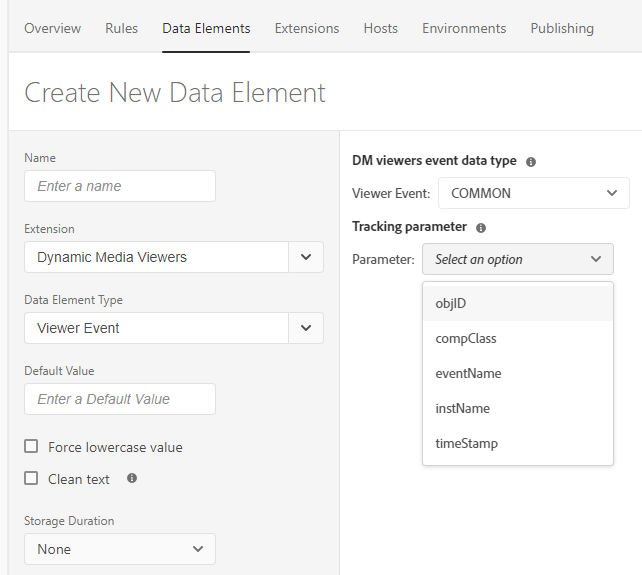
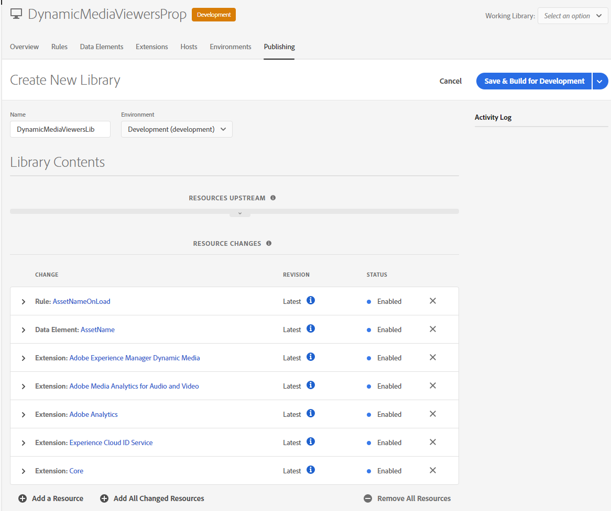

# Integración de visualizadores de Dynamic Media con etiquetas de Analytics y Adobe Experience Platform {#integrating-dynamic-media-viewers-with-adobe-analytics-and-adobe-launch}

## ¿Qué es la integración de los visualizadores de Dynamic Media con Adobe Analytics y las etiquetas de Experience Platform? {#what-is-dynamic-media-viewers-integration-with-adobe-analytics-and-adobe-launch}

<!-- Leave this hidden path here; it points to the topic source from Sasha https://wiki.corp.adobe.com/pages/viewpage.action?spaceKey=~oufimtse&title=Dynamic+Media+Viewers+integration+with+Adobe+Launch 

name used to be Experience Platform Launch. Changed to Experience Platform Data Collection-->

*Visores de Dynamic Media* extensión para etiquetas de Experience Platform y visores de Dynamic Media 5.13, permite que los clientes de Adobe Analytics y Etiquetas de Experience Platform utilicen eventos y datos específicos para los visualizadores de Dynamic Media en la configuración de etiquetas de Experience Platform.

Esta integración significa que puede realizar un seguimiento del uso de los visualizadores de Dynamic Media en su sitio web con Adobe Analytics. Al mismo tiempo, puede utilizar los eventos y datos expuestos por los visualizadores con cualquier otra extensión Etiquetas de Experience Platform que provenga de un Adobe o de un tercero.

Para obtener más información sobre las extensiones de Adobe o las extensiones de terceros, consulte [Extensiones de Adobe](https://experienceleague.adobe.com/docs/experience-platform/tags/extensions/overview.html) en la Guía del usuario de etiquetas de Experience Platform.

**Este tema está diseñado para lo siguiente:** Administradores de sitio, desarrolladores del programa Adobe Experience Manager y personas de Operaciones.

### Limitaciones de la integración {#limitations-of-the-integration}

* La integración de etiquetas de Experience Platform para visores de Dynamic Media no funciona en el nodo de creación de Experience Manager. No puede ver ningún seguimiento de una página WCM hasta que se publique.
* La integración de etiquetas de Experience Platform para los visores de Dynamic Media no es compatible con el modo de operación &quot;emergente&quot;, en el que la URL del visor se obtiene mediante el botón &quot;URL&quot; de la página Detalles del recurso.
* La integración de etiquetas de Experience Platform no se puede usar simultáneamente con la integración de Analytics de visores heredados (a través del `config2=` ).
* La compatibilidad con el seguimiento de vídeo se limita al seguimiento de reproducción principal, tal como se describe en [Información general de seguimiento](https://experienceleague.adobe.com/docs/media-analytics/using/tracking/track-av-playback/track-core-overview.html?lang=en#player-events). En concreto, no se admite el seguimiento de QoS, anuncios, capítulos/segmentos o errores.
* La configuración de la duración del almacenamiento para elementos de datos no es compatible con los elementos de datos que usan la variable *Visores de Dynamic Media* extensión. La duración del almacenamiento debe establecerse en **[!UICONTROL Ninguna]**.

### Ejemplos de uso de la integración {#use-cases-for-the-integration}

El caso de uso principal de la integración con etiquetas de Experience Platform es el de los clientes que usan Experience Manager Assets y Experience Manager Sites. En estos casos, puede configurar una integración estándar entre el nodo de creación del Experience Manager y las etiquetas del Experience Platform y, a continuación, asociar la instancia de Sites con la propiedad Etiquetas del Experience Platform. Después, cualquier componente WCM de Dynamic Media añadido a una página Sitios rastreará datos y eventos de los visualizadores.

Consulte [Seguimiento de visualizadores de Dynamic Media en Experience Manager Sites](#tracking-dynamic-media-viewers-in-aem-sites).

Un caso de uso secundario que admite la integración es el de los clientes que solo usan Experience Manager Assets o Dynamic Media Classic. En estos casos, obtiene el código incrustado para el visor y lo añade a la página del sitio web. A continuación, obtenga la URL de producción de la biblioteca de etiquetas de Experience Platform de Etiquetas de Experience Platform y agréguela manualmente al código de la página web.

Consulte [Seguimiento de visualizadores de Dynamic Media mediante el código incrustado](#tracking-dynamic-media-viewers-using-embed-code).

## Cómo funciona el seguimiento de datos y eventos en la integración {#how-data-and-event-tracking-works-in-the-integration}

La integración aprovecha dos tipos independientes de seguimiento de visores de Dynamic Media: *Adobe Analytics* y *Adobe Analytics para audio y vídeo*.

### Acerca del seguimiento con Adobe Analytics  {#about-tracking-using-adobe-analytics}

Adobe Analytics permite rastrear las acciones que realiza el usuario final cuando interactúa con los visualizadores de Dynamic Media en el sitio web. Adobe Analytics también permite rastrear datos específicos del visor. Por ejemplo, puede rastrear y registrar eventos de carga de vista junto con el nombre del recurso, cualquier acción de zoom que se haya producido y acciones de reproducción de vídeo.

En las etiquetas de Experience Platform, los conceptos de *Elementos de datos* y *Reglas* trabaje juntos para habilitar el seguimiento de Adobe Analytics.

#### Acerca de los elementos de datos en las etiquetas de Experience Platform {#about-data-elements-in-adobe-launch}

Un elemento de datos en etiquetas de Experience Platform es una propiedad con nombre cuyo valor se define de forma estática o se calcula dinámicamente en función del estado de una página web o de los datos de los visualizadores de Dynamic Media.

Las opciones disponibles para una definición de elemento de datos dependen de la lista de extensiones instaladas en la propiedad Etiquetas de Experience Platform. La extensión &quot;Core&quot; está preinstalada y está disponible de forma predeterminada en cualquier configuración. Esta extensión &quot;Core&quot; permite definir un elemento de datos que tenga como resultado una cookie, un código JavaScript, una cadena de consulta y muchas otras fuentes.

Para el seguimiento de Adobe Analytics, deben instalarse otras extensiones, tal como se describe en [Instalación y configuración de extensiones](#installing-and-setup-of-extensions). La extensión Visualizadores de Dynamic Media permite definir un elemento de datos que sea un argumento del evento de visualizador dinámico. Por ejemplo, es posible hacer referencia al tipo de visualizador o al nombre del recurso que el visualizador haya informado al cargar, al nivel de zoom que se recoge cuando el usuario final amplía y mucho más.

La extensión del visor de Dynamic Media mantiene los valores de sus elementos de datos actualizados automáticamente.

Una vez definido, un elemento de datos se puede utilizar en otros lugares de la interfaz de usuario de etiquetas de Experience Platform mediante el widget de selector de elementos de datos. En concreto, la acción Set Variables de la extensión de Adobe Analytics en la regla hace referencia a los elementos de datos definidos para los fines del seguimiento de visualizadores de Dynamic Media (consulte a continuación).

Consulte [Elementos de datos](https://experienceleague.adobe.com/docs/experience-platform/tags/ui/data-elements.html) en la Guía del usuario de etiquetas de Experience Platform.

#### Acerca de las reglas en las etiquetas de Experience Platform {#about-rules-in-adobe-launch}

Una regla en etiquetas de Experience Platform es una configuración agnóstica que define tres áreas que constituyen una regla: *Eventos*, *Condiciones* y *Acciones*:

* *Eventos* (si) indique a las etiquetas del Experience Platform cuándo realizar el déclencheur de una regla.
* *Condiciones* (si) indique a las etiquetas del Experience Platform qué otras restricciones permitir o no permitir al activar una regla.
* *Acciones* (entonces) indique a las etiquetas del Experience Platform qué hacer cuando se activa una regla.

Las opciones disponibles en la sección Eventos, condiciones y acciones dependen de las extensiones instaladas en la propiedad Etiquetas de Experience Platform. La variable *Principal* está preinstalado y está disponible de forma predeterminada en cualquier configuración. La extensión proporciona varias opciones para Eventos, como acciones básicas de explorador que incluyen cambio de enfoque, pulsaciones clave y envíos de formularios. También incluye opciones para Condiciones, como el valor de la cookie, el tipo de explorador y mucho más. Para Acciones, solo está disponible la opción Código personalizado .

Para el seguimiento de Adobe Analytics, se deben instalar otras extensiones, tal como se describe en [Instalación y configuración de extensiones](#installing-and-setup-of-extensions). Específicamente:

* La extensión Visualizadores de Dynamic Media amplía la lista de eventos admitidos a eventos específicos de los visualizadores de Dynamic Media, como la carga del visualizador, el intercambio de recursos, el zoom y la reproducción de vídeo.
* La extensión de Adobe Analytics amplía la lista de acciones admitidas con dos acciones necesarias para enviar datos a los servidores de seguimiento: *Establecer variables* y *Send Beacon*.

Para realizar el seguimiento de los visores de Dynamic Media, es posible utilizar cualquiera de los siguientes tipos:

* Eventos de la extensión de visores de Dynamic Media, la extensión principal o cualquier otra extensión.
* Condiciones de la definición de regla. O bien, puede dejar vacío el área de condiciones.

En la sección Acciones , es necesario que tenga una *Establecer variables* acción. Esta acción indica a Adobe Analytics cómo rellenar variables de seguimiento con datos. Al mismo tiempo, la variable *Establecer variables* acción no envía nada al servidor de seguimiento.

La variable *Establecer variables* la acción debe ir seguida de una *Send Beacon* acción. La variable *Send Beacon* en realidad, la acción envía datos al servidor de seguimiento de analytics. Ambas acciones, *Establecer variables* y *Send Beacon*, provienen de la extensión de Adobe Analytics.

Consulte [Reglas](https://experienceleague.adobe.com/docs/experience-platform/tags/ui/rules.html) en la Guía del usuario de etiquetas de Experience Platform.

#### Configuración de ejemplo {#sample-configuration}

La siguiente configuración de ejemplo en Etiquetas de Experience Platform muestra cómo rastrear un nombre de recurso al cargar el visor.

1. En el **[!UICONTROL Elementos de datos]** , definir un elemento de datos `AssetName` que hace referencia a `asset` del parámetro `LOAD` de la extensión Visualizadores de Dynamic Media.

   

1. En el **[!UICONTROL Reglas]** , definir una regla *TrackAssetOnLoad*.

   En esta regla, la variable **[!UICONTROL Evento]** el campo utiliza la variable **[!UICONTROL CARGA]** de la extensión Visualizadores de Dynamic Media.

   

1. La configuración de acción tiene dos tipos de acción de la extensión de Adobe Analytics:

   *Establecer variables*, que asignan una variable de análisis de su elección al valor de `AssetName` Elemento de datos.

   *Send Beacon*, que envía información de seguimiento a Adobe Analytics.

   

1. La configuración de regla resultante se muestra de la siguiente manera:

   

### Acerca de Adobe Analytics para audio y vídeo {#about-adobe-analytics-for-audio-and-video}

Cuando se suscribe una cuenta de Experience Cloud para usar Adobe Analytics para audio y vídeo, basta con habilitar el seguimiento de vídeo en la variable *Visores de Dynamic Media* configuración de extensión. Las métricas de vídeo están disponibles en Adobe Analytics. El seguimiento de vídeo depende de la presencia de la extensión de audio y vídeo de Adobe Medium Analytics.

Consulte [Instalación y configuración de extensiones](#installing-and-setup-of-extensions).

Actualmente, la compatibilidad con el seguimiento de vídeo se limita al seguimiento de &quot;reproducción principal&quot;, tal como se describe en [Información general de seguimiento](https://experienceleague.adobe.com/docs/media-analytics/using/tracking/track-av-playback/track-core-overview.html?lang=en#player-events). En concreto, no se admite el seguimiento de QoS, anuncios, capítulos/segmentos o errores.

## Utilice la extensión Visualizadores de Dynamic Media {#using-the-dynamic-media-viewers-extension}

Como se menciona en [Ejemplos de uso de la integración](#use-cases-for-the-integration), es posible realizar un seguimiento de los visores de Dynamic Media con la nueva integración de etiquetas de Experience Platform en Experience Manager Sites y mediante el uso del código incrustado.

### Seguimiento de visualizadores de Dynamic Media en Experience Manager Sites {#tracking-dynamic-media-viewers-in-aem-sites}

Para rastrear los visores de Dynamic Media en Experience Manager Sites, siga todos los pasos que se enumeran en la sección [Configurar todos los elementos de integración](#configuring-all-the-integration-pieces) debe realizarse. Específicamente, debe crear la configuración de IMS y la configuración de nube de etiquetas de Experience Platform.

Siguiendo la configuración adecuada, cualquier visor de Dynamic Media que agregue a una página Sitios mediante un componente WCM compatible con Dynamic Media, rastreará automáticamente los datos en Adobe Analytics, Adobe Analytics para vídeo o ambos.

Consulte [Agregar recursos de Dynamic Media a páginas mediante sitios de Adobe](/help/assets/dynamic-media/adding-dynamic-media-assets-to-pages.md).

### Seguimiento de visualizadores de Dynamic Media mediante el código incrustado {#tracking-dynamic-media-viewers-using-embed-code}

Los clientes que no utilizan Experience Manager Sites, o que incrustan los visores de Dynamic Media en páginas web fuera de Experience Manager Sites, o ambas, pueden seguir utilizando la integración Etiquetas de Experience Platform .

Complete los pasos de configuración desde la [Configuración de Adobe Analytics](#configuring-adobe-analytics-for-the-integration) y [Configuración de etiquetas de Experience Platform](#configuring-adobe-launch-for-the-integration) secciones. Sin embargo, no es necesario realizar pasos de configuración relacionados con el Experience Manager.

Siguiendo la configuración adecuada, puede agregar compatibilidad con etiquetas de Experience Platform a una página web con un visor de Dynamic Media.

Consulte [Añadir el código incrustado de etiquetas de Experience Platform](https://experienceleague.adobe.com/docs/platform-learn/implement-in-websites/configure-tags/add-embed-code.html) para obtener más información sobre cómo utilizar el código incrustado de la biblioteca de etiquetas de Experience Platform.

Para obtener más información sobre cómo utilizar la función de código incrustado de Experience Manager Dynamic Media, consulte [Incrustación del visualizador de imágenes o vídeos en una página web](/help/assets/dynamic-media/embed-code.md).

**Rastree los visores de Dynamic Media mediante el código incrustado:**

1. Tenga una página web lista para incrustar un visor de Dynamic Media.
1. Obtenga el código incrustado de la biblioteca de etiquetas de Experience Platform iniciando sesión en Etiquetas de Experience Platform (consulte [Configuración de etiquetas de Experience Platform](#configuring-adobe-launch-for-the-integration)).
1. Select **[!UICONTROL Propiedad]** y, a continuación, seleccione **[!UICONTROL Entornos]** pestaña .
1. Elija el nivel Entorno que sea relevante para el entorno de la página web. A continuación, en la variable **[!UICONTROL Instalar]** , seleccione el icono de cuadro.
1. **[!UICONTROL En las instrucciones de instalación web]** , copie el código incrustado completo de la biblioteca de etiquetas de Experience Platform junto con los `<script/>` etiquetas.

## Guía de referencia de la extensión de visores de Dynamic Media {#reference-guide-for-the-dynamic-media-viewers-extension}

### Acerca de la configuración de los visores de Dynamic Media {#about-the-dynamic-media-viewers-configuration}

La extensión del visor de Dynamic Media se integra automáticamente con la biblioteca de etiquetas de Experience Platform si las siguientes condiciones son verdaderas:

* Objeto global de la biblioteca de etiquetas de Experience Platform ( `_satellite`) está presente en la página .
* Función de extensión de visores de Dynamic Media `_dmviewers_v001()` está definido en `_satellite`.

* `config2=` no se ha especificado el parámetro del visor, lo que significa que el visor no utiliza la integración heredada de Analytics.

Además, existe la opción de deshabilitar explícitamente la integración de etiquetas de Experience Platform en el visor especificando `launch=0` en la configuración del visor. El valor predeterminado de este parámetro es `1`.

### Configurar la extensión Visualizadores de Dynamic Media {#configuring-the-dynamic-media-viewers-extension}

La única opción de configuración para la extensión Visualizadores de Dynamic Media es **[!UICONTROL Habilitar Adobe Medium Analytics para audio y vídeo]**.

Cuando marca (activa) esta opción y la extensión de audio y vídeo de Adobe Medium Analytics está instalada y configurada, las métricas de reproducción de vídeo se envían a la solución Adobe Analytics para audio y vídeo . Al desactivar esta opción, se desactiva el seguimiento de vídeo.

Si activa esta opción *without* con la extensión de audio y vídeo de Adobe Medium Analytics instalada, la opción no tiene ningún efecto.

### Acerca de los elementos de datos en la extensión Visualizadores de Dynamic Media {#about-data-elements-in-the-dynamic-media-viewers-extension}

El único tipo de elemento de datos que proporciona la extensión Visualizadores de Dynamic Media es el **[!UICONTROL Evento de visualizador]** de la lista desplegable **[!UICONTROL Tipo de elemento de datos]**.

Cuando se selecciona, el editor de elementos de datos procesa un formulario con dos campos:

* **[!UICONTROL Tipo de datos de evento de visualizadores de DM]**: Una lista desplegable que identifica todos los eventos de visualizador admitidos por la extensión de visualizadores de Dynamic Media que tienen argumentos, además de un elemento especial **[!UICONTROL COMÚN]**. Un elemento **[!UICONTROL COMÚN]** representa una lista de parámetros de evento que son comunes a todos los tipos de eventos enviados por los visualizadores.
* **[!UICONTROL Parámetro de seguimiento]** : un argumento del evento de visor de Dynamic Media seleccionado.

Consulte la [Guía de referencia de visores de Dynamic Media](https://experienceleague.adobe.com/docs/dynamic-media-developer-resources/library/viewers-aem-assets-dmc/c-html5-s7-aem-asset-viewers.html) para la lista de eventos admitidos por cada tipo de visor; vaya a la sección específico del visor y, a continuación, seleccione la subsección Compatibilidad con el seguimiento de Adobe Analytics . Actualmente, la guía de referencia de visores de Dynamic Media no documenta argumentos de eventos.

Consideremos ahora el ciclo de vida de los visualizadores de Dynamic Media *Elemento de datos*. El valor de dicho elemento de datos se rellena después de que el evento del visor de Dynamic Media correspondiente se produzca en la página. Por ejemplo, supongamos que el elemento de datos apunta a la variable **[!UICONTROL CARGA]** y su argumento &quot;asset&quot;. El valor de este elemento de datos recibe datos válidos después de que el visor ejecute el evento LOAD por primera vez. Si el elemento de datos apunta a la variable **[!UICONTROL ZOOM]** y su argumento &quot;scale&quot;, el valor de dicho elemento de datos permanece vacío hasta que el visor envía un **[!UICONTROL ZOOM]** por primera vez.

Del mismo modo, los valores de los elementos de datos se actualizan automáticamente cuando el visor envía un evento correspondiente a la página. La actualización de valor se produce incluso si el evento concreto no se especifica en la configuración de regla. Por ejemplo, supongamos que un elemento de datos **[!UICONTROL ZoomScale]** se define para el parámetro &quot;scale&quot; del evento ZOOM. Sin embargo, la única regla presente en la configuración de regla se activa mediante la función **[!UICONTROL CARGA]** evento. El valor de **[!UICONTROL ZoomScale]** se actualiza cada vez que un usuario ejecuta zoom dentro del visor.

Cualquier visualizador de Dynamic Media tiene un identificador único en la página web. El elemento de datos rastrea el propio valor y el visualizador que lo ha rellenado. Por ejemplo, supongamos que hay varios visualizadores en la misma página y un **[!UICONTROL AssetName]** Elemento de datos que señala a la variable **[!UICONTROL CARGA]** y su argumento &quot;asset&quot;. La variable **[!UICONTROL AssetName]** El elemento de datos mantiene una colección de nombres de recursos asociados a cada visualizador cargado en la página.

El valor exacto devuelto por el elemento de datos depende del contexto. Si se solicita el elemento de datos en una regla que se activó mediante un evento del visor de Dynamic Media, se devuelve el valor del elemento de datos para el visualizador que inició la regla. Además, el elemento de datos se solicita en una regla que se activó mediante un evento desde otra extensión de etiquetas de Experience Platform. En este punto, el valor del elemento de datos proviene del último visor que actualizó este elemento de datos.

**Considere la siguiente configuración de ejemplo:**

* Una página web con dos visores de zoom Dynamic Media: *visor1* y *visor2*.

* **[!UICONTROL ZoomScale]** El elemento de datos señala a la variable **[!UICONTROL ZOOM]** y su argumento &quot;scale&quot;.
* **[!UICONTROL TrackPan]** Regla con lo siguiente:

   * Utiliza el visor de Dynamic Media **[!UICONTROL PAN]** como déclencheur.
   * Envía el valor de **[!UICONTROL ZoomScale]** Elemento de datos a Adobe Analytics.

* **[!UICONTROL TrackKey]** Regla con lo siguiente:

   * Utiliza el evento de prensa clave de la extensión de etiquetas del Experience Platform principal como déclencheur.
   * Envía el valor de **[!UICONTROL ZoomScale]** Elemento de datos a Adobe Analytics.

Ahora, supongamos que el usuario final carga la página web con los dos visores. En *visor1*, se acercan al 50% de escala; luego, en *visor2*, aumentan la escala al 25%. En *visor1*, recorren la imagen y finalmente presionan una tecla en el teclado.

La actividad del usuario final provoca que se realicen las dos llamadas de seguimiento siguientes a Adobe Analytics:

* La primera llamada se produce porque **[!UICONTROL TrackPan]** La regla se activa cuando el usuario entra en *visor1*. Esa llamada envía el 50 % como valor de **[!UICONTROL ZoomScale]** Elemento de datos porque el elemento de datos sabe que la regla se activa mediante *visor1* y obtiene el valor de escala correspondiente;
* La segunda llamada se produce porque **[!UICONTROL TrackKey]** La regla se activa cuando el usuario presiona una tecla en el teclado. Esa llamada envía el 25 % como valor de **[!UICONTROL ZoomScale]** Elemento de datos porque el visor no activó la regla. Como tal, el elemento de datos devuelve el valor más actualizado.

El ejemplo configurado anteriormente también afecta a la duración del valor del elemento de datos. El valor del elemento de datos administrado por el visor de Dynamic Media se almacena en el código de la biblioteca de etiquetas de Experience Platform incluso después de que el propio visor se haya eliminado en la página web. Esta funcionalidad significa que si hay una regla activada por una extensión que no es de Dynamic Media Viewer y hace referencia a dicho elemento de datos, el elemento de datos devuelve el último valor conocido. Incluso si el visor ya no está presente en la página web.

En cualquier caso, los valores de los elementos de datos impulsados por los visualizadores de Dynamic Media no se almacenan en el almacenamiento local ni en el servidor; en su lugar, solo se mantienen en la biblioteca de etiquetas del Experience Platform del lado del cliente. Los valores de dicho elemento de datos desaparecen cuando la página web se vuelve a cargar.

En general, el editor de elementos de datos es compatible con [selección de duración de almacenamiento](https://experienceleague.adobe.com/docs/experience-platform/tags/ui/data-elements.html#create-a-data-element). Sin embargo, los elementos de datos que utilizan la extensión Visualizadores de Dynamic Media solo admiten la opción de duración del almacenamiento de **[!UICONTROL Ninguna]**. Es posible establecer cualquier otro valor en la interfaz de usuario, pero el comportamiento del elemento de datos no está definido en este caso. La extensión administra el valor del elemento de datos por su cuenta: el elemento de datos que mantiene el valor del argumento de evento del visor durante todo el ciclo de vida del visor.

### Acerca de las reglas en la extensión Visualizadores de Dynamic Media {#about-rules-in-the-dynamic-media-viewers-extension}

En el editor de reglas, la extensión agrega nuevas opciones de configuración para el editor de eventos. Además, el editor proporciona una opción para hacer referencia manualmente a los parámetros de evento en el editor de acciones como una opción breve en lugar de utilizar elementos de datos preconfigurados.

#### Acerca del editor de eventos {#about-the-events-editor}

En el editor de eventos, la extensión Visualizadores de Dynamic Media agrega una **[!UICONTROL Tipo de evento]** llamado **[!UICONTROL Evento del visor]**.

Cuando se selecciona, el editor de eventos procesa la lista desplegable **[!UICONTROL Eventos del visor de Dynamic Media]**, que enumera todos los eventos disponibles compatibles con los visores de Dynamic Media.

#### Acerca del editor de acciones {#about-the-actions-editor}

La extensión Visualizadores de Dynamic Media permite utilizar parámetros de evento de visualizadores de Dynamic Media para asignarlos a variables de análisis en el editor Set Variables de la extensión de Adobe Analytics.

El método más sencillo para ello es completar el siguiente proceso de dos pasos:

* En primer lugar, defina uno o varios elementos de datos, donde cada elemento de datos representa un parámetro de un evento del visualizador de Dynamic Media.
* Por último, en el editor Set Variables de la extensión de Adobe Analytics, seleccione el icono del selector de elementos de datos (tres discos apilados) para abrir el cuadro de diálogo Select Data Element (Seleccionar elemento de datos) y, a continuación, seleccione un elemento de datos de él.

Sin embargo, es posible utilizar un enfoque alternativo y evitar la creación de elementos de datos. Puede hacer referencia directamente a un argumento desde un evento de visualizador de Dynamic Media. Introduzca el nombre completo del argumento de evento en la variable **[!UICONTROL value]** campo de entrada de la asignación de variables de Analytics. Asegúrese de rodear los signos de porcentaje (%). Por ejemplo,

`%event.detail.dm.LOAD.asset%`

Existe una diferencia importante entre el uso de elementos de datos y la referencia de argumentos de eventos directos. Para el elemento de datos, no importa qué evento déclencheur la acción Set Variables. El evento que déclencheur la regla puede no estar relacionado con el visualizador dinámico (como seleccionar la página web de la extensión principal). Sin embargo, cuando se utiliza una referencia de argumento directo, es importante asegurarse de que el evento que déclencheur la regla corresponde al argumento de evento al que hace referencia.

Por ejemplo, la referencia `%event.detail.dm.LOAD.asset%` devuelve el nombre de recurso correcto si la regla se activa mediante el evento **[!UICONTROL LOAD]** de la extensión del visualizador de Dynamic Media. Sin embargo, devuelve un valor vacío para cualquier otro evento.

En la tabla siguiente se enumeran los eventos de visualizador de Dynamic Media y sus argumentos admitidos:

<table>
 <tbody>
  <tr>
   <td>Nombre del evento del visor</td>
   <td>Referencia de argumento</td>
  </tr>
  <tr>
   <td><code>COMMON</code></td>
   <td><code>%event.detail.dm.objID%</code></td>
  </tr>
  <tr>
   <td> </td>
   <td><code>%event.detail.dm.compClass%</code></td>
  </tr>
  <tr>
   <td> </td>
   <td><code>%event.detail.dm.instName%</code></td>
  </tr>
  <tr>
   <td> </td>
   <td><code>%event.detail.dm.timeStamp%</code></td>
  </tr>
  <tr>
   <td><code>BANNER</code> </td>
   <td><code>%event.detail.dm.BANNER.asset%</code></td>
  </tr>
  <tr>
   <td> </td>
   <td><code>%event.detail.dm.BANNER.frame%</code></td>
  </tr>
  <tr>
   <td> </td>
   <td><code>%event.detail.dm.BANNER.label%</code></td>
  </tr>
  <tr>
   <td><code>HREF</code></td>
   <td><code>%event.detail.dm.HREF.rollover%</code></td>
  </tr>
  <tr>
   <td><code>ITEM</code></td>
   <td><code>%event.detail.dm.ITEM.rollover%</code></td>
  </tr>
  <tr>
   <td><code>LOAD</code></td>
   <td><code>%event.detail.dm.LOAD.applicationname%</code></td>
  </tr>
  <tr>
   <td><strong> </strong></td>
   <td><code>%event.detail.dm.LOAD.asset%</code></td>
  </tr>
  <tr>
   <td><strong> </strong></td>
   <td><code>%event.detail.dm.LOAD.company%</code></td>
  </tr>
  <tr>
   <td><strong> </strong></td>
   <td><code>%event.detail.dm.LOAD.sdkversion%</code></td>
  </tr>
  <tr>
   <td><strong> </strong></td>
   <td><code>%event.detail.dm.LOAD.viewertype%</code></td>
  </tr>
  <tr>
   <td><strong> </strong></td>
   <td><code>%event.detail.dm.LOAD.viewerversion%</code></td>
  </tr>
  <tr>
   <td><code>METADATA</code></td>
   <td><code>%event.detail.dm.METADATA.length%</code></td>
  </tr>
  <tr>
   <td> </td>
   <td><code>%event.detail.dm.METADATA.type%</code></td>
  </tr>
  <tr>
   <td><code>MILESTONE</code></td>
   <td><code>%event.detail.dm.MILESTONE.milestone%</code></td>
  </tr>
  <tr>
   <td><code>PAGE</code></td>
   <td><code>%event.detail.dm.PAGE.frame%</code></td>
  </tr>
  <tr>
   <td> </td>
   <td><code>%event.detail.dm.PAGE.label%</code></td>
  </tr>
  <tr>
   <td><code>PAUSE</code></td>
   <td><code>%event.detail.dm.PAUSE.timestamp%</code></td>
  </tr>
  <tr>
   <td><code>PLAY</code></td>
   <td><code>%event.detail.dm.PLAY.timestamp%</code></td>
  </tr>
  <tr>
   <td><code>SPIN</code></td>
   <td><code>%event.detail.dm.SPIN.framenumber%</code></td>
  </tr>
  <tr>
   <td><code>STOP</code></td>
   <td><code>%event.detail.dm.STOP.timestamp%</code></td>
  </tr>
  <tr>
   <td><code>SWAP</code></td>
   <td><code>%event.detail.dm.SWAP.asset%</code></td>
  </tr>
  <tr>
   <td><code>SWATCH</code></td>
   <td><code>%event.detail.dm.SWATCH.frame%</code></td>
  </tr>
  <tr>
   <td> </td>
   <td><code>%event.detail.dm.SWATCH.label%</code></td>
  </tr>
  <tr>
   <td><code>TARG</code></td>
   <td><code>%event.detail.dm.TARG.frame%</code></td>
  </tr>
  <tr>
   <td> </td>
   <td><code>%event.detail.dm.TARG.label%</code></td>
  </tr>
  <tr>
   <td><code>ZOOM</code></td>
   <td><code>%event.detail.dm.ZOOM.scale%</code></td>
  </tr>
 </tbody>
</table>

## Configurar todos los elementos de integración {#configuring-all-the-integration-pieces}

**ANTES DE COMENZAR**

Adobe recomienda revisar toda la documentación antes de esta sección para comprender la integración completa.

En esta sección se explican los pasos de configuración necesarios para integrar los visores de Dynamic Media con Adobe Analytics y Adobe Analytics para audio y vídeo. Aunque es posible utilizar la extensión Visualizadores de Dynamic Media para otros fines en Etiquetas de Experience Platform, estos escenarios no se tratan en esta documentación.

Para configurar la integración, debe utilizar los siguientes productos de Adobe:

* Adobe Analytics: se utiliza para configurar variables de seguimiento e informes.
* Etiquetas de Experience Platform: se utilizan para definir una propiedad, una o varias reglas y uno o varios elementos de datos para habilitar el seguimiento del visualizador.

Además, si se utiliza esta solución de integración con Experience Manager Sites, se debe realizar la siguiente configuración:

* [Consola de Adobe Developer](https://developer.adobe.com/console/home) : la integración se crea para etiquetas de Experience Platform.
* Nodo de creación de Experience Manager : configuración de IMS y configuración de nube de etiquetas de Experience Platform.

Como parte de la configuración, asegúrese de tener acceso a una empresa de Adobe Experience Cloud que ya tenga habilitadas las etiquetas de Adobe Analytics y Experience Platform.

## Configuración de Adobe Analytics para la integración {#configuring-adobe-analytics-for-the-integration}

Después de configurar Adobe Analytics, se configurará lo siguiente para la integración:

* Hay un grupo de informes listo y seleccionado.
* Las variables de Analytics están disponibles para recibir datos de seguimiento.
* Los informes están disponibles para ver los datos recopilados dentro de Adobe Analytics.

Consulte también [Guía de implementación de Analytics](https://experienceleague.adobe.com/docs/analytics/implementation/home.html).

**Para configurar Adobe Analytics para la integración:**

1. Para empezar, acceda a Adobe Analytics desde el Experience Cloud [página principal](https://experience.adobe.com/#/home). En la barra de menús, seleccione el icono Soluciones (una tabla de puntos de tres por tres) cerca de la esquina superior derecha de la página y, a continuación, seleccione **[!UICONTROL Analytics]**.

   

   Ahora, seleccione un grupo de informes.

### Seleccionar un grupo de informes {#selecting-a-report-suite}

1. Cerca de la esquina superior derecha de la página Adobe Analytics, a la derecha del campo **[!UICONTROL Buscar informes]**, seleccione el grupo de informes correcto en la lista desplegable. Si hay varios grupos de informes disponibles y no está seguro de cuál usar, póngase en contacto con el administrador de Adobe Analytics, que le ayudará a seleccionar qué grupo de informes utilizar.

   En el ejemplo siguiente, un usuario creó un grupo de informes denominado *DynamicMediaViewersExtensionDoc* y lo seleccionó en la lista desplegable. El nombre del grupo de informes es solo un ejemplo. El nombre del grupo de informes que seleccione en última instancia depende de usted.

   Si no hay ningún grupo de informes disponible, usted o el administrador de Adobe Analytics deben crear uno antes de continuar con la configuración.

   Consulte [Informes y grupos de informes](https://experienceleague.adobe.com/docs/analytics/admin/admin-tools/manage-report-suites/report-suites-admin.html) y [Crear un grupo de informes](https://experienceleague.adobe.com/docs/analytics/admin/admin-tools/manage-report-suites/c-new-report-suite/t-create-a-report-suite.html).

   En Adobe Analytics, los grupos de informes se administran en **[!UICONTROL Administrador]** > **[!UICONTROL Grupos de informes]**.

   

   Ahora, configure variables de Adobe Analytics.

### Configuración de variables de Adobe Analytics {#setting-up-adobe-analytics-variables}

1. Designe una o más variables de Adobe Analytics que desee usar para rastrear el comportamiento de los visualizadores de Dynamic Media en la página web.

   Es posible utilizar cualquier tipo de variable admitida por Adobe Analytics. La decisión sobre el tipo de variable (como Tráfico personalizado) [props], Conversión [eVar]) se debe a las necesidades específicas de su implementación de Analytics .

   Consulte [Resumen de props y eVars](https://experienceleague.adobe.com/docs/analytics/implementation/vars/page-vars/evar.html#vars).

   A los efectos de esta documentación, solo se utilizará una variable de tráfico personalizado (props) porque estará disponible en un informe de Analytics en los pocos minutos siguientes a que se produzca una acción en una página web.

   Para habilitar una nueva variable de tráfico personalizado, en Adobe Analytics, en la barra de herramientas, vaya a **[!UICONTROL Administrador]** > **[!UICONTROL Grupos de informes]**.

1. En el **[!UICONTROL Administrador del grupo de informes]** , seleccione el informe correcto y, en la barra de herramientas, vaya a **[!UICONTROL Editar configuración]** > **[!UICONTROL Tráfico]** > **[!UICONTROL Variables de tráfico]**.
1. Elija una variable que no esté en uso, asígnele un nombre descriptivo ( **[!UICONTROL Recurso del visualizador (prop 30)]**) y, a continuación, cambie el cuadro combinado a &quot;Habilitado&quot; en la columna Activado .

   La siguiente captura de pantalla es un ejemplo de una variable de tráfico personalizado ( **[!UICONTROL prop30]**) para rastrear un nombre de recurso que usa el visor:

   

1. En la parte inferior de la lista de variables, seleccione **[!UICONTROL Guardar]**.

### Configuración de informes {#setting-up-a-report}

1. Por lo general, la configuración de un informe en Adobe Analytics depende de necesidades específicas del proyecto. De este modo, la configuración detallada del informe excede el ámbito de esta integración.

   Sin embargo, basta con saber que los informes Tráfico personalizado estarán disponibles automáticamente en Adobe Analytics después de configurar las variables Tráfico personalizado en **[Configuración de variables de Adobe Analytics](#setting-up-adobe-analytics-variables)**.

   Por ejemplo, el informe de **[!UICONTROL Recurso del visualizador (prop 30)]** está disponible en el menú Informes de **[!UICONTROL Tráfico personalizado]** > **[!UICONTROL Tráfico personalizado 21-30]** > **[!UICONTROL Recurso del visualizador (prop 30)]**.

   Al visitar este informe justo después de la creación de **[!UICONTROL Recursos del visualizador (prop 30)]**, no se muestra ningún dato; esto se espera en este punto de la integración.

   

## Configuración de etiquetas de Experience Platform para la integración {#configuring-adobe-launch-for-the-integration}

Después de configurar las etiquetas de Experience Platform, se configurará lo siguiente para la integración:

* La creación de una nueva propiedad para mantener todas las configuraciones juntas.
* Instalación y configuración de extensiones. El código del lado del cliente de todas las extensiones instaladas en la propiedad se compila en una biblioteca. Esta biblioteca la utiliza la página web más adelante.
* Configuración de elementos de datos y reglas. Esta configuración define qué datos adquirir de los visualizadores de Dynamic Media, cuándo almacenar en déclencheur la lógica de seguimiento y dónde enviar los datos del visualizador en Adobe Analytics.
* Publicación de la biblioteca.

**Para configurar las etiquetas de Experience Platform para la integración:**

1. Para empezar, acceda a Etiquetas de Experience Platform desde el Experience Cloud [página principal](https://experience.adobe.com/#/home). En la barra de menús, seleccione el icono Soluciones (tres por tres tablas de puntos) cerca de la esquina superior derecha de la página y, a continuación, seleccione **[!UICONTROL Etiquetas]**.

   También puede [abrir etiquetas de Experience Platform directamente](https://launch.adobe.com/).

   

### Crear una propiedad en etiquetas de Experience Platform {#creating-a-property-in-adobe-launch}

Una propiedad en Etiquetas de Experience Platform es una configuración con nombre que mantiene juntos todos los ajustes. Se genera y publica una biblioteca de los ajustes de configuración en diferentes niveles de entorno (desarrollo, ensayo y producción).

Consulte también [Configuración de una propiedad tap](https://experienceleague.adobe.com/docs/platform-learn/implement-mobile-sdk/initial-configuration/configure-tags.html).

**Para crear una propiedad en etiquetas de Experience Platform:**

1. En Etiquetas de Experience Platform, seleccione **[!UICONTROL Nueva propiedad]**.
1. En el cuadro de diálogo **[!UICONTROL Crear propiedad]**, dentro del campo **[!UICONTROL Nombre]**, escriba un nombre descriptivo, como el título del sitio web. Por ejemplo, `DynamicMediaViewersProp.`. 
1. En el **[!UICONTROL Dominios]** , introduzca el dominio del sitio web.
1. En la lista desplegable **[!UICONTROL Opciones avanzadas]**, habilite **[!UICONTROL Configurar para el desarrollo de extensiones (no se puede modificar posteriormente)]** siempre que la extensión que desee utilizar (en este caso, los *visualizadores de Dynamic Media*) aún no se haya publicado.

   

1. Seleccione **[!UICONTROL Guardar]**.

   Seleccione la propiedad recién creada y continúe con *Instalación y configuración de extensiones*.

### Instalación y configuración de extensiones {#installing-and-setup-of-extensions}

Todas las extensiones disponibles en Etiquetas de Experience Platform se enumeran en la sección **[!UICONTROL Extensiones]** > **[!UICONTROL Catálogo]**.

Para instalar una extensión, seleccione **[!UICONTROL Instalar]**. Si es necesario, realice una configuración de extensión única y, a continuación, seleccione **[!UICONTROL Guardar]**.

Cuando sea necesario, deben instalarse y configurarse las siguientes extensiones:

* (Obligatorio) *Servicio de ID de Experience Cloud* Extensión

No se necesita ninguna configuración adicional, acepte los valores propuestos. Cuando haya terminado, asegúrese de seleccionar **[!UICONTROL Guardar]**.

Consulte [Extensión del servicio de ID de Experience Cloud](https://experienceleague.adobe.com/docs/experience-platform/tags/extensions/client/id-service/overview.html).

* (Obligatorio) *Adobe Analytics* Extensión

Para configurar esta extensión, necesita la ID del grupo de informes que se encuentra en Adobe Analytics, en **[!UICONTROL Administrador]** > **[!UICONTROL Grupo de informes]**, en la sección **[!UICONTROL ID del grupo de informes]** encabezado de columna.

(Solo con fines de demostración, el ID del grupo de informes de la variable **[!UICONTROL DynamicMediaViewersExtensionDoc]** El grupo de informes se utiliza en las siguientes capturas de pantalla. Este ID se creó y utilizó en [Selección de un grupo](#selecting-a-report-suite) de informes anteriormente).

En la página Instalar extensión, introduzca la ID del grupo de informes en el campo **[!UICONTROL Grupos de informes de desarrollo]**, en el campo **[!UICONTROL Grupos de informes de ensayo]** y en el campo **[!UICONTROL Grupos de informes de producción]**.

*Configure el siguiente elemento solo si quiere utilizar el seguimiento de vídeo:*

En el **[!UICONTROL Instalar extensión]** página, expandir **[!UICONTROL General]** y, a continuación, especifique el Servidor de seguimiento. El servidor de seguimiento sigue la plantilla `<trackingNamespace>.sc.omtrdc.net`, donde `<trackingNamespace>` es la información obtenida en el correo electrónico de aprovisionamiento.

Seleccione **[!UICONTROL Guardar]**.

Consulte [Extensión de Adobe Analytics](https://experienceleague.adobe.com/docs/experience-platform/tags/extensions/client/analytics/overview.html).

* (Opcional. Obligatorio solo si se necesita el seguimiento de vídeo) *Adobe Medium Analytics para audio y vídeo* Extensión

Rellene el campo servidor de seguimiento . El servidor de seguimiento de *Adobe Medium Analytics para audio y vídeo* es diferente del servidor de seguimiento utilizado para Adobe Analytics. Sigue a la plantilla `<trackingNamespace>.hb.omtrdc.net`, donde `<trackingNamespace>` es la información del correo electrónico de aprovisionamiento.

Todos los demás campos son opcionales.

Consulte [Extensión de Adobe Medium Analytics for Audio and Video](https://experienceleague.adobe.com/docs/experience-platform/tags/extensions/client/media-analytics/overview.html).

* (Obligatorio) *Visores de Dynamic Media* Extensión

Seleccione **[!UICONTROL habilitar Adobe Analytics para vídeo]** para activar el seguimiento de Video Heartbeat.

En el momento de escribir este artículo, la variable *Visores de Dynamic Media* La extensión de solo está disponible si la propiedad Etiquetas de Experience Platform se crea para el desarrollo.

Consulte [Crear una propiedad en etiquetas de Experience Platform](#creating-a-property-in-adobe-launch).

Una vez instaladas y configuradas las extensiones, como mínimo, las siguientes cinco extensiones (cuatro si no realiza el seguimiento de vídeo) se enumerarán en el área Extensiones > Instaladas .

### Configuración de elementos de datos y reglas {#setting-up-data-elements-and-rules}

En Etiquetas de Experience Platform, cree los elementos de datos y las reglas necesarias para rastrear los visores de Dynamic Media.

Consulte [Cómo funciona el seguimiento de datos y eventos en la integración](#how-data-and-event-tracking-works-in-the-integration) para obtener información general sobre el seguimiento con etiquetas de Experience Platform.

Consulte [Configuración de ejemplo](#sample-configuration) para obtener una configuración de ejemplo en Etiquetas de Experience Platform que muestre cómo rastrear un nombre de recurso al cargar el visor.

Consulte [Configurar la extensión Visualizadores de Dynamic Media](#configuring-the-dynamic-media-viewers-extension) para obtener información detallada sobre las capacidades de la extensión.

### Publicar una biblioteca {#publishing-a-library}

Para cambiar la configuración de Etiquetas de Experience Platform (incluidas la configuración de propiedades, extensiones, reglas y elementos de datos), debe *publicar* estos cambios. La publicación en etiquetas de Experience Platform se realiza desde la pestaña Publicación en la configuración de la propiedad.

Las etiquetas de Experience Platform pueden tener varios entornos de desarrollo, un entorno de ensayo y un entorno de producción. De forma predeterminada, la Configuración de nube de etiquetas de Experience Platform en el Experience Manager señala el nodo de creación de Experience Manager al entorno de ensayo de las etiquetas de plataforma. El nodo Publicación de Experience Manager apunta al entorno Producción de etiquetas de Experience Platform. Esta disposición significa que con la configuración predeterminada del Experience Manager, es necesario publicar la biblioteca de etiquetas del Experience Platform en el entorno de ensayo. Al hacerlo, puede utilizarlo en el autor del Experience Manager. A continuación, puede publicarlo en el entorno Producción para que se pueda utilizar en la publicación en Experience Manager.

Consulte [Entornos](https://experienceleague.adobe.com/docs/experience-platform/tags/publish/environments/environments.html) para obtener más información sobre los entornos de etiquetas de Experience Platform.

La publicación de una biblioteca implica los dos pasos siguientes:

* Agregar y crear una nueva biblioteca incluyendo todos los cambios necesarios (nuevos y actualizaciones) en la biblioteca.
* Mover hacia arriba la biblioteca a través de los diferentes niveles de entorno (de Desarrollo a Ensayo y Producción).

#### Agregar y crear una nueva biblioteca {#adding-and-building-a-new-library}

1. La primera vez que abra la ficha Publicación en Etiquetas de Experience Platform, la lista de la biblioteca estará vacía.

   En la columna izquierda, seleccione **[!UICONTROL Agregar nueva biblioteca]**.

   

1. En la página Crear nueva biblioteca , en la **[!UICONTROL Nombre]** , introduzca un nombre descriptivo para la nueva biblioteca. Por ejemplo,

   *DynamicMediaViewersLib*

   En la lista desplegable Entorno , elija el nivel Entorno . Inicialmente, solo el nivel de desarrollo está disponible para la selección. Cerca del lado inferior izquierdo de la página, seleccione **[!UICONTROL Agregar todos los recursos modificados]**.

   

1. Cerca de la esquina superior derecha de la página, seleccione **[!UICONTROL Guardar y generar para desarrollo]**.

   En unos minutos, la biblioteca se creará y estará lista para utilizarse.

   

   >[!NOTE]
   >
   >La próxima vez que cambie la configuración de Etiquetas de Experience Platform, vaya a **[!UICONTROL Publicación]** en la pestaña **[!UICONTROL Propiedad]** y, a continuación, seleccione la biblioteca creada anteriormente.
   >
   >
   >En la pantalla de publicación de la biblioteca, seleccione **[!UICONTROL Agregar todos los recursos modificados]** y, a continuación, seleccione **[!UICONTROL Guardar y generar para desarrollo]**.

#### Mover hacia arriba una biblioteca a través de los niveles de entorno {#moving-a-library-up-through-environment-levels}

1. Una vez agregada una nueva biblioteca, se encuentra en el entorno de desarrollo. Para moverlo al nivel de entorno de ensayo (que corresponde a la columna Enviado ), en el menú desplegable de la biblioteca, seleccione **[!UICONTROL Enviar para aprobación]**.

   

1. En el cuadro de diálogo de confirmación, seleccione **[!UICONTROL Submit]**.

   Una vez que la biblioteca se mueva a la columna Enviado , en el menú desplegable de la biblioteca, seleccione **[!UICONTROL Generar para ensayo]**.

   

1. Para mover la biblioteca del entorno de ensayo al entorno de producción (que es la columna Publicado ), siga un proceso similar.

   En primer lugar, en el menú desplegable, seleccione **[!UICONTROL Aprobar para publicación]**.

   

1. En el menú desplegable, seleccione **[!UICONTROL Generar y publicar en producción]**.

   

   Consulte [Publicación](https://experienceleague.adobe.com/docs/experience-platform/tags/publish/overview.html) para obtener más información sobre el proceso de publicación en Etiquetas de Experience Platform.

## Configuración de Adobe Experience Manager para la integración {#configuring-adobe-experience-manager-for-the-integration}

<!-- Prerequisites list below should be verified by Sasha -->

Requisitos previos:

* Experience Manager ejecuta las instancias Autor y Publicar .
* El nodo de creación de Experience Manager está configurado en Dynamic Media. <!-- Scene7 run mode (dynamicmedia_s7) -->
* Los componentes WCM de Dynamic Media están activados en Experience Manager Sites.

La configuración del Experience Manager consta de los dos pasos principales siguientes:

* Configuración de IMS Experience Manager.
* Configuración de la nube de etiquetas de Experience Platform.

### Configuración de IMS de Experience Manager {#configuring-aem-ims}

1. En el autor del Experience Manager, seleccione el icono Herramientas (martillo) y, a continuación, vaya a **[!UICONTROL Seguridad]** > **[!UICONTROL Configuraciones de IMS de Adobe]**.

   

1. En la página Configuración de IMC de Adobe, cerca de la esquina superior izquierda, seleccione **[!UICONTROL Crear]**.
1. En el **[!UICONTROL Configuración de cuenta técnica de Adobe IMS]** en la **[!UICONTROL Solución en la nube]** lista desplegable, seleccione **[!UICONTROL Recopilación de datos del Experience Platform]**.
1. Habilitar **[!UICONTROL Crear nuevo certificado]** y, a continuación, en el campo de texto, introduzca cualquier valor significativo para el certificado. Por ejemplo, *AdobeLaunchIMSCert*. Select **[!UICONTROL Crear certificado]**.

   Se muestra el siguiente mensaje de información:

   *Para recuperar un token de acceso válido, la nueva clave pública del certificado debe agregarse a la cuenta técnica de Adobe Developer.*

   Para cerrar el cuadro de diálogo Información, seleccione **[!UICONTROL OK]**.

   

1. Select **[!UICONTROL Descargar clave pública]** para descargar un archivo de clave pública (`*.crt`) al sistema local.

   >[!NOTE]
   >
   >En este punto, ***dejar abierto*** el **[!UICONTROL Configuración de cuenta técnica de Adobe IMS]** página; ***no*** cierre la página y ***no*** select **[!UICONTROL Siguiente]**. Volverá a esta página más adelante en los pasos.

   

1. En una nueva pestaña del navegador, vaya a la [Consola de Adobe Developer](https://developer.adobe.com/console/integrations).

1. En el **[!UICONTROL Integraciones de la consola Adobe I/O]** página, cerca de la esquina superior derecha, seleccione **[!UICONTROL Nueva integración]**.
1. En el **[!UICONTROL Crear una nueva integración]** , asegúrese de que **[!UICONTROL Acceso a una API]** está seleccionado y, a continuación, seleccione **[!UICONTROL Continuar]**.

1. En el segundo **[!UICONTROL Crear una nueva integración]** , habilite (active) el **[!UICONTROL API de etiquetas del Experience Platform]** botón de opción. En la esquina inferior derecha de la página, seleccione **[!UICONTROL Continuar]**.

   

1. En la tercera **[!UICONTROL Crear una nueva integración]** , haga lo siguiente:

   * En el **[!UICONTROL Nombre]** , introduzca un nombre descriptivo. Por ejemplo, *DynamicMediaViewersIO*.

   * En el **[!UICONTROL Descripción]** , introduzca la descripción de la integración.

   * En el **[!UICONTROL Certificados de clave pública]** , cargue el archivo de clave pública (`*.crt`) que descargó anteriormente en estos pasos.

   * En el **[!UICONTROL Seleccionar una función para la API de etiquetas de Experience Platform]** encabezado, seleccione **[!UICONTROL Administrador]**.

   * En el **[!UICONTROL Seleccione uno o varios perfiles de producto para la API de etiquetas de Experience Platform]** , seleccione el perfil de producto llamado **[!UICONTROL Etiquetas - &lt;your_company_name>]**.

   

1. Select **[!UICONTROL Crear integración]**.
1. En el **[!UICONTROL Integración creada]** página, seleccione **[!UICONTROL Continuar con los detalles de integración]**.

   

1. Aparece una página de detalles Integraciones , similar a la siguiente:

   >[!NOTE]
   >
   >***Deje abierta esta página de detalles de integración***. Necesitará información variada del **[!UICONTROL Información general]** y **[!UICONTROL JWT]** en un momento.

   
   *Página de detalles de la integración*

1. Vuelva a la página **[!UICONTROL Configuración de cuenta técnica de Adobe IMS]** que dejó abierta anteriormente. En la esquina superior derecha de la página, seleccione **[!UICONTROL Siguiente]** para abrir el **[!UICONTROL Cuenta]** en el **[!UICONTROL Configuración de cuenta técnica de Adobe IMS]** ventana.

   (Si ha cerrado la página anteriormente, vuelva al autor del Experience Manager y, a continuación, vaya a **[!UICONTROL Herramientas]** > **[!UICONTROL Seguridad]** > **[!UICONTROL Configuraciones de IMS de Adobe]**. Seleccione **[!UICONTROL Crear]**. En el **[!UICONTROL Solución en la nube]** lista desplegable, seleccione **[!UICONTROL Etiquetas de Experience Platform]**. En la lista desplegable **[!UICONTROL Certificado]**, seleccione el nombre del certificado creado anteriormente.

   
   *Configuración de cuenta técnica de Adobe IMS: página Certificado*

1. La variable **[!UICONTROL Cuenta]** tiene cinco campos que requieren que rellene con información de la página de detalles de la integración del paso anterior.

   
   *Configuración de cuenta técnica de Adobe IMS: página de cuenta*

1. En el **[!UICONTROL Cuenta]** rellene los campos siguientes:

   * **[!UICONTROL Título]** - Introduzca un título descriptivo de la cuenta.
   * **[!UICONTROL Servidor de autorización]** - Vuelva a la página de detalles de integración que abrió anteriormente. Seleccione el **[!UICONTROL JWT]** pestaña . Copie el nombre del servidor (sin la ruta de acceso) como se indica a continuación.

(el nombre de servidor de ejemplo es solo para fines explicativos)   Vuelva a la página **[!UICONTROL Cuenta]** y, a continuación, pegue el nombre en el campo correspondiente.
Por ejemplo, `https://ims-na1.adobelogin.com/`
(el nombre de servidor de ejemplo es solo para fines explicativos)

   
   *Página de detalles de integración: pestaña JWT*

1. **[!UICONTROL Clave de API]**: Vuelva a la página de detalles de la integración. Seleccione el **[!UICONTROL Información general]** a la derecha de la pestaña **[!UICONTROL Clave de API (ID de cliente)]** campo, seleccione **[!UICONTROL Copiar]**.

   Vuelva a la página **[!UICONTROL Cuenta]** y pegue la clave en el campo correspondiente.

   
   *Página de detalles de la integración*

1. **[!UICONTROL Secreto del cliente]**: Regrese a la página de detalles de la integración. En el **[!UICONTROL Información general]** , seleccione **[!UICONTROL Recuperar secreto de cliente]**. A la derecha del **[!UICONTROL Secreto de cliente]** campo, seleccione **[!UICONTROL Copiar]**.

   Vuelva a la página **[!UICONTROL Cuenta]** y pegue la clave en el campo correspondiente.

1. **[!UICONTROL Carga útil]** - Vuelva a la página de detalles de la integración. En el **[!UICONTROL JWT]** , en el campo Carga útil JWT , copie todo el código de objeto JSON.

   Vuelva a la página **[!UICONTROL Cuenta]** y pegue el código en el campo correspondiente.

   
   *Página de detalles de integración: pestaña JWT*

   La página Cuenta, con todos los campos rellenados, aparece de manera similar a:

   

1. Cerca de la esquina superior derecha de la **[!UICONTROL Cuenta]** página, seleccione **[!UICONTROL Crear]**.

   Con IMS Experience Manager configurado, ahora tiene una nueva cuenta de IMSA incluida en **[!UICONTROL Configuraciones de IMS de Adobe]**.

   

## Configuración de Experience Platform Tags Cloud para la integración {#configuring-adobe-launch-cloud-for-the-integration}

1. En el autor del Experience Manager, cerca de la esquina superior izquierda, seleccione el icono Herramientas (martillo) y, a continuación, vaya a **[!UICONTROL Cloud Services]** > **[!UICONTROL Configuraciones de etiquetas del Experience Platform]**.

   

1. En el **[!UICONTROL Configuraciones de etiquetas del Experience Platform]** , en el panel izquierdo, seleccione el sitio del Experience Manager para el que desea aplicar la configuración de etiquetas del Experience Platform.

   Solo con fines de ejemplo, la variable **`We.Retail`** El sitio se selecciona en la captura de pantalla siguiente.

   

1. Cerca de la esquina superior izquierda de la página, seleccione **[!UICONTROL Crear]**.
1. En el **[!UICONTROL General]** página (1/3 páginas) del **[!UICONTROL Crear configuración de etiquetas de Experience Platform]** , rellene los campos siguientes:

   * **[!UICONTROL Título]** - Introduzca un título de configuración descriptivo. Por ejemplo, `We.Retail Tags cloud configuration`.

   * **[!UICONTROL Configuración de Adobe IMS asociada]** - Seleccione la configuración de IMS que creó anteriormente en [Configuración de IMS de Experience Manager](#configuring-aem-ims).

   * **[!UICONTROL Empresa]** - Desde el **[!UICONTROL Empresa]** en la lista desplegable, seleccione la empresa Experience Cloud. La lista se rellena automáticamente.

   * **[!UICONTROL Propiedad]** - En la lista desplegable Propiedad, seleccione la propiedad Etiquetas de Experience Platform que creó anteriormente. La lista se rellena automáticamente.

Después de completar todos los campos, su **[!UICONTROL General]** tendrá un aspecto similar al siguiente:

1. Cerca de la esquina superior izquierda, seleccione **[!UICONTROL Siguiente]**.
1. En el **[!UICONTROL Ensayo]** página (2/3 páginas) del **[!UICONTROL Crear configuración de etiquetas de Experience Platform]** , rellene el siguiente campo:

   En el **[!UICONTROL URI de biblioteca]** (Identificador uniforme de recursos), compruebe la ubicación de la versión de ensayo de la biblioteca de etiquetas de Experience Platform. El Experience Manager rellena este campo automáticamente.

   Solo para fines explicativos, este paso utiliza bibliotecas de etiquetas de Experience Platform implementadas en CDN de Adobe.

   >[!NOTE]
   >
   >Compruebe que el URI de biblioteca rellenado automáticamente (identificador uniforme de recursos) no tenga un formato incorrecto. Si es necesario, corríjalo para que el URI represente un URI relativo al protocolo. Es decir, comienza con una barra doble hacia adelante.
   >
   >
   >Por ejemplo: `//assets.adobetm.com/launch-xxxx`.

   Su **[!UICONTROL Ensayo]** es probable que la página aparezca similar a la siguiente. La variable **[!UICONTROL Archivo]** y **[!UICONTROL Cargar biblioteca asincrónicamente]** las opciones son ***not*** configurado:

   

1. Cerca de la esquina superior derecha, seleccione **[!UICONTROL Siguiente]**.
1. En el **[!UICONTROL Producción]** página (3/3 páginas) del **[!UICONTROL Crear configuración de etiquetas de Experience Platform]** , si es necesario, corrija el URI de producción rellenado automáticamente de forma similar a como se hizo en la anterior **[!UICONTROL Ensayo]** página.
1. Cerca de la esquina superior derecha, seleccione **[!UICONTROL Crear]**.

   La nueva configuración de nube de etiquetas de Experience Platform ahora se crea y aparece junto al sitio web.

1. Seleccione la nueva configuración de nube de etiquetas de Experience Platform (cuando esté seleccionada, aparece una marca de verificación a la izquierda del título de configuración). En la barra de herramientas, seleccione **[!UICONTROL Publicación]**.

   

Actualmente, el autor del Experience Manager no admite la integración de visores de Dynamic Media con etiquetas de Experience Platform.

Sin embargo, se admite en el nodo de publicación de Experience Manager. Con la configuración predeterminada de la nube de etiquetas de Experience Platform, la publicación en Experience Manager utiliza el entorno de producción de etiquetas de Experience Platform. Como tal, es necesario insertar las actualizaciones de la biblioteca de etiquetas de Experience Platform desde Desarrollo hasta el entorno de producción cada vez que se realiza la prueba.

Es posible solucionar esta limitación. Especifique la URL de desarrollo o de ensayo de la biblioteca de etiquetas de Experience Platform en la configuración de Experience Platform Tags Cloud para la publicación de Experience Manager anterior. Al hacerlo, el nodo de publicación del Experience Manager utiliza la versión de desarrollo o ensayo de la biblioteca de etiquetas del Experience Platform.

Consulte [Integrar etiquetas y Experience Manager del Experience Platform](https://experienceleague.adobe.com/docs/experience-manager-learn/sites/integrations/experience-platform-launch/overview.html#integrations) para obtener más información sobre la configuración de la nube de etiquetas de Experience Platform.
