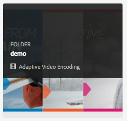

# Perfiles de vídeo de Dynamic Media{#video-profiles}

Dynamic Media ya incluye un perfil predefinido de codificación de vídeo adaptable. La configuración de este perfil predeterminado está optimizada para ofrecer a sus clientes la mejor experiencia de visualización posible. Al codificar los vídeos de origen principal mediante el perfil de codificación de vídeo adaptable, durante la reproducción, el reproductor de vídeo ajusta automáticamente la calidad del flujo de vídeo en función de la velocidad de conexión a Internet de los clientes. Esta acción se conoce como flujo de velocidad de bits adaptable.

Los siguientes son otros factores que determinan la calidad de sus vídeos:

* **Resolución del vídeo de origen principal cargado**

  Si el vídeo MP4 se grabó con una resolución inferior, como 240p o 360p, no se puede transmitir en alta definición.

* **Tamaño del reproductor de vídeo**

  De forma predeterminada, la &quot;Anchura&quot; del perfil de codificación de vídeo adaptable se establece en &quot;Automático&quot;. De nuevo, durante la reproducción se utiliza la mejor calidad según el tamaño del reproductor.

Consulte [Prácticas recomendadas para la codificación de vídeo](/help/assets/dynamic-media/video.md#best-practices-for-encoding-videos).

Consulte también [Prácticas recomendadas para organizar su Assets digital con el fin de usar perfiles de procesamiento](/help/assets/organize-assets.md).

>[!NOTE]
>
>Para generar los metadatos de un vídeo y las miniaturas de imágenes de vídeo asociadas, el propio vídeo debe pasar por el proceso de codificación en Dynamic Media. En Adobe Experience Manager, el flujo de trabajo **[!UICONTROL Dynamic Media Encode Video]** codifica el vídeo si ha activado Dynamic Media y ha configurado los servicios de nube de vídeo. Este flujo de trabajo captura el historial de procesos de flujo de trabajo y la información de errores. Ver [Supervisión de la codificación de vídeo y progreso de publicación en YouTube](/help/assets/dynamic-media/video.md#monitoring-video-encoding-and-youtube-publishing-progress). Si ha habilitado Dynamic Media y ha configurado los servicios de nube de vídeo, el flujo de trabajo de **[!UICONTROL codificación de vídeo de Dynamic Media]** surte efecto automáticamente al cargar un vídeo. (Si no usa Dynamic Media, el flujo de trabajo **[!UICONTROL DAM Update Asset]** surte efecto).
>
>Los metadatos son útiles para la búsqueda de recursos. Las miniaturas son imágenes de vídeo estáticas que se generan durante la codificación. El sistema de Experience Manager los necesita y se utilizan en la interfaz de usuario para ayudarle a identificar visualmente los vídeos en las vistas Tarjetas, Resultados de búsqueda y Lista de recursos. Puede ver las miniaturas generadas al seleccionar el icono Representaciones (la paleta de un Painter) de un vídeo codificado.

Cuando haya terminado de crear el perfil de vídeo, aplíquelo a una o varias carpetas. Consulte [Aplicar un perfil de vídeo a las carpetas](#applying-a-video-profile-to-folders).

Para definir parámetros de procesamiento avanzados para otros tipos de recursos, consulte [Configurar el procesamiento de recursos](/help/assets/dynamic-media/config-dm.md#configuring-asset-processing).

Vea también [Perfiles para procesar metadatos, imágenes y vídeos](/help/assets/dynamic-media/about-image-video-profiles.md).

## Ajustes preestablecidos de codificación de vídeo adaptable {#adaptive-video-encoding-presets}

La siguiente tabla identifica las prácticas recomendadas al codificar perfiles para flujo de vídeo adaptable a dispositivos móviles y tabletas y equipos de escritorio. Puede utilizar estos ajustes preestablecidos para cualquier vídeo de relación de aspecto.

<table>
 <tbody>
  <tr>
   <td><strong>Códec de formato de vídeo</strong></td>
   <td><strong>Tamaño de vídeo: Anchura (px)</strong></td>
   <td><strong>Tamaño del vídeo: altura (px)</strong></td>
   <td><strong>¿Mantener proporción de aspecto?</strong></td>
   <td><strong>Velocidad de bits de vídeo (Kbps)</strong></td>
   <td><strong>Velocidad De Fotogramas De Vídeo (Fps)</strong></td>
   <td><strong>Códec de audio</strong></td>
   <td><strong>Velocidad de bits de audio (Kbps)</strong></td>
  </tr>
  <tr>
   <td>
MP4 H.264 (mp4)
 </td>
   <td>auto</td>
   <td>360</td>
   <td>Sí</td>
   <td>730</td>
   <td>30</td>
   <td>Dolby HE-AAC</td>
   <td>128</td>
  </tr>
  <tr>
   <td>
MP4 H.264 (mp4)
 </td>
   <td>auto</td>
   <td>540</td>
   <td>Sí</td>
   <td>2000  </td>
   <td>30</td>
   <td>Dolby HE-AAC</td>
   <td>128</td>
  </tr>
  <tr>
   <td>
MP4 H.264 (mp4)
 </td>
   <td>auto</td>
   <td>720  </td>
   <td>Sí</td>
   <td>3000  </td>
   <td>30</td>
   <td>Dolby HE-AAC</td>
   <td>128</td>
  </tr>
 </tbody>
</table>

## Acerca del uso del recorte inteligente en perfiles de vídeo {#about-smart-crop-video}

El recorte inteligente de vídeos es una función opcional disponible en los perfiles de vídeo. Es una herramienta que utiliza Adobe AI para detectar y recortar automáticamente el punto focal en cualquier vídeo adaptable o vídeo progresivo que haya cargado, independientemente del tamaño.

Los formatos de vídeo compatibles para el recorte inteligente incluyen MP4, MKV, MOV, AVI, FLV y WMV.

El tamaño máximo de archivo de vídeo admitido para el recorte inteligente es el siguiente criterio:

* Duración de cinco minutos.
* 30 cuadros por segundo (FPS).
* Tamaño de archivo de 300 MB.

La IA de Adobe está limitada a 9000 fotogramas. Es decir, cinco minutos a 30 FPS. Si el vídeo tiene un FPS mayor, la duración máxima del vídeo admitida disminuye. Por ejemplo, un vídeo de 60 FPS debe durar dos minutos y medio para que sea compatible con Adobe AI y Smart Crop.

>[!IMPORTANT]
>
>Para que funcione el recorte inteligente de vídeo, debe incluir uno o más ajustes preestablecidos de codificación de vídeo en el perfil de vídeo.

Para utilizar el recorte inteligente para vídeo, debe crear un perfil de codificación de vídeo adaptable o progresivo. Como parte de su perfil, use la herramienta **[!UICONTROL Smart Crop Ratio]** para seleccionar proporciones de aspecto predefinidas. Por ejemplo, después de definir los ajustes preestablecidos de codificación de vídeo, puede añadir una definición de &quot;Horizontal móvil&quot; con una proporción de aspecto de 16x9 y una definición de &quot;Vertical móvil&quot; con una proporción de aspecto de 9x16. Otras proporciones de aspecto o recorte entre las que puede elegir incluir 1x1, 4x3 y 4x5.

Puede activar o desactivar el recorte inteligente de vídeo en el perfil de vídeo mediante el control deslizante situado a la derecha de **[!UICONTROL Smart Crop Ratio]** en la interfaz de usuario.

Después de crear y guardar el perfil de vídeo, puede aplicarlo a las carpetas que desee.

Ver [Aplicar perfiles de vídeo a carpetas específicas](#applying-video-profiles-to-specific-folders) o [Aplicar un perfil de vídeo globalmente](#applying-a-video-profile-globally).

Consulte también [Recorte inteligente de imágenes](image-profiles.md).

## Crear un perfil de vídeo para flujo de bits adaptable {#creating-a-video-encoding-profile-for-adaptive-streaming}

Dynamic Media ya incluye un perfil de codificación de vídeo adaptable predefinido (un grupo de ajustes de carga de vídeo para MP4 H.264) optimizado para ofrecer la mejor experiencia de visualización. Puede utilizar este perfil cuando cargue los vídeos.

Sin embargo, si este perfil predefinido no satisface sus necesidades, puede optar por crear su propio perfil de codificación de vídeo adaptable. Como práctica recomendada, cuando utiliza la configuración **[!UICONTROL Codificar para flujo adaptable]**, se validan todos los ajustes preestablecidos de codificación que agregue al perfil. Esta funcionalidad garantiza que todos los vídeos tengan la misma proporción de aspecto. Además, los vídeos codificados se tratan como un conjunto de velocidad de bits múltiple para flujo continuo.

Al crear el perfil de codificación de vídeo, observa que la mayoría de las opciones de codificación están rellenadas previamente con la configuración predeterminada recomendada para ayudarle. Sin embargo, si selecciona un valor distinto del predeterminado recomendado, puede causar una calidad de vídeo deficiente durante la reproducción y otros problemas de rendimiento.

Por lo tanto, para todos los ajustes preestablecidos de codificación de vídeo MP4 H.264 del perfil, se validan los siguientes valores para garantizar que sean los mismos en todos los ajustes preestablecidos de codificación individuales del perfil, lo que permite la transmisión de velocidad de bits adaptable:

* Códec de formato de vídeo: MP4 H.264 (.mp4)
* Códec de audio
* Velocidad de bits de audio
* Mantener proporción de aspecto
* Codificación de dos pasos
* Velocidad de bits constante
* Perfil H264
* Velocidad de muestreo de audio

Si los valores no son los mismos, puede seguir creando el perfil tal cual. Sin embargo, la transmisión de velocidad de bits adaptable no es posible. En su lugar, los usuarios experimentan una transmisión de una sola velocidad de bits. Se recomienda editar la configuración de codificación para utilizar los mismos valores en todos los ajustes preestablecidos de codificación individuales del perfil. (El editor de ajustes preestablecidos/perfiles de vídeo aplica la paridad de los ajustes de codificación de vídeo adaptable si &quot;Codificar para flujo adaptable&quot; está habilitado).

Consulte también [Crear un perfil de codificación de vídeo para flujo progresivo](#creating-a-video-encoding-profile-for-progressive-streaming).

Consulte también [Prácticas recomendadas para la codificación de vídeo](/help/assets/dynamic-media/video.md#best-practices-for-encoding-videos).

Para definir parámetros de procesamiento avanzados para otros tipos de recursos, consulte [Configurar el procesamiento de recursos](/help/assets/dynamic-media/config-dm.md#configuring-asset-processing).

**Para crear un perfil de vídeo para flujo de velocidad de bits adaptable:**

1. Seleccione el logotipo de Experience Manager y vaya a **[!UICONTROL Herramientas]** > **[!UICONTROL Assets]** > **[!UICONTROL Perfiles de vídeo]**.
1. Seleccione **[!UICONTROL Crear]**.
1. Introduzca un nombre y una descripción para el perfil.
1. En la página Crear/Editar ajustes preestablecidos de codificación de vídeo, seleccione **[!UICONTROL Agregar ajuste preestablecido de codificación de vídeo]**.
1. En la ficha **[!UICONTROL Básico]**, defina las opciones de vídeo y audio.
Seleccione el icono de información junto a cada opción para obtener más descripciones o ajustes recomendados basados en el códec de formato de vídeo seleccionado.
1. Bajo el encabezado Tamaño del vídeo, asegúrese de que **[!UICONTROL Mantener relación de aspecto]** está marcado.
1. Establezca la resolución del tamaño del fotograma de vídeo en píxeles. Use el valor **[!UICONTROL Automático]** para escalar automáticamente y hacer coincidir la proporción de aspecto de origen (proporción de anchura y altura). Por ejemplo, Automático x 480 o 640 x Automático.

1. Realice una de las siguientes acciones:

   * En el campo **[!UICONTROL Anchura]**, escriba **[!UICONTROL auto]**. En el campo **[!UICONTROL Altura]**, escriba un valor en píxeles.

   * Para ayudarle a visualizar el tamaño del vídeo, seleccione el icono de información (i) a la derecha de **[!UICONTROL Altura]** para abrir la página Calculadora de tamaño. Use la calculadora de tamaño **[!UICONTROL Size]** para establecer las dimensiones de vídeo (representadas por el cuadro azul) que desee. Seleccione **[!UICONTROL X]** en la esquina superior derecha cuando haya terminado.

1. (Opcional) Seleccione la ficha **[!UICONTROL Avanzado]** y asegúrese de que la casilla de verificación **[!UICONTROL Usar valores predeterminados]** esté seleccionada (recomendada). También puede modificar la configuración avanzada de vídeo y audio.
1. En la esquina superior derecha de la página, seleccione **[!UICONTROL Guardar]** para guardar el ajuste preestablecido.
1. Realice una de las siguientes acciones:
   * Repita los pasos 4-10 para crear más ajustes preestablecidos de codificación. (El flujo de vídeo adaptable requiere más de un ajuste preestablecido de vídeo).
   * Continúe con el paso siguiente.

1. (Opcional) Para agregar un recorte inteligente de vídeo a los vídeos a los que se aplica este perfil, haga lo siguiente:
   * En la página Editar perfil de vídeo, a la derecha del encabezado Proporción de recorte inteligente, seleccione **[!UICONTROL Agregar nuevo]**.
   * En el campo Nombre, escriba un nombre para la relación de recorte que le ayude a identificarla fácilmente.
   * En la lista desplegable **[!UICONTROL Crop Ratio]**, seleccione la proporción que desee utilizar.

1. Realice una de las siguientes acciones:

   * Continúe añadiendo nuevas proporciones de recorte según sea necesario.
   * Continúe con el paso siguiente.

1. En la esquina superior derecha de la página, vuelve a seleccionar **[!UICONTROL Guardar]** para guardar el perfil.

Ahora puede aplicar el perfil a las carpetas que contienen vídeos. Ver [Aplicación de un perfil de vídeo a las carpetas](#applying-a-video-profile-to-folders) o [Aplicación de un perfil de vídeo de forma global](#applying-a-video-profile-globally).

## Creación de un perfil de vídeo para flujo progresivo {#creating-a-video-encoding-profile-for-progressive-streaming}

Si decide no usar la opción **[!UICONTROL Codificar para flujo adaptable]**, todos los ajustes preestablecidos de codificación que agregue al perfil se tratarán como representaciones de vídeo individuales para flujo de una sola velocidad de bits o entrega de vídeo progresivo. Además, no hay ninguna validación para garantizar que todas las representaciones de vídeo tengan la misma proporción de aspecto.

El códec de formato de vídeo admitido es H.264 (.mp4). <!-- use to also include WebM but was requested for removal by Riya Midha in email dated October 14, 2024 -->

Consulte también [Crear un perfil de codificación de vídeo para flujo de velocidad de bits adaptable](#creating-a-video-encoding-profile-for-adaptive-streaming).

Vea también [Prácticas recomendadas para la codificación de vídeo](/help/assets/dynamic-media/video.md#best-practices-for-encoding-videos).

Para definir parámetros de procesamiento avanzados para otros tipos de recursos, consulte [Configuración del procesamiento de recursos](/help/assets/dynamic-media/config-dm.md#configuring-asset-processing).

**Para crear un perfil de vídeo para flujo progresivo:**

1. Seleccione el logotipo de Experience Manager y vaya a **[!UICONTROL Herramientas]** > **[!UICONTROL Assets]** > **[!UICONTROL Perfiles de vídeo]**.
1. Seleccione **[!UICONTROL Crear]**.
1. Introduzca un nombre y una descripción para el perfil.
1. En la página Crear/Editar ajustes preestablecidos de codificación de vídeo, seleccione **[!UICONTROL Agregar ajuste preestablecido de codificación de vídeo]**.
1. En la ficha **[!UICONTROL Básico]**, defina las opciones de vídeo y audio.
Seleccione el icono de información junto a cada opción para obtener más descripciones o ajustes recomendados basados en el códec de formato de vídeo seleccionado.
1. (Opcional) Bajo el encabezado Tamaño del vídeo, desmarque **[!UICONTROL Mantener relación de aspecto]**.
1. Haga lo siguiente:
   * En el campo **[!UICONTROL Anchura]**, escriba **[!UICONTROL auto]**.
   * En el campo **[!UICONTROL Altura]**, escriba un valor en píxeles.
Para ayudarle a visualizar el tamaño del vídeo, seleccione el icono de información Altura para abrir la página **[!UICONTROL Calculadora de tamaño]**. Utilice la página **[!UICONTROL Calculadora de tamaño]** para definir el tamaño del vídeo (cuadro azul) como desee. Cuando haya terminado, en la esquina superior derecha del cuadro de diálogo, seleccione **[!UICONTROL X]**.
1. (Opcional) Realice una de las siguientes acciones:

   * Seleccione la ficha **[!UICONTROL Avanzado]** y asegúrese de que la casilla de verificación **[!UICONTROL Usar valores predeterminados]** está activada (recomendada).

   * Desactive la casilla de verificación **[!UICONTROL Usar valores predeterminados]** y especifique la configuración de vídeo y audio que desee.
Seleccione el icono de información junto a cada opción para obtener más descripciones o ajustes recomendados basados en el códec de formato de vídeo seleccionado.

1. En la esquina superior derecha de la página, seleccione **[!UICONTROL Guardar]** para guardar el ajuste preestablecido.
1. Realice una de las siguientes acciones:

   * Repita los pasos 4-9 para crear más ajustes preestablecidos de codificación.
   * Continúe con el paso siguiente.

1. (Opcional) Para agregar un recorte inteligente de vídeo a los vídeos a los que se aplica este perfil, haga lo siguiente:

   * En la página Editar perfil de vídeo, a la derecha del encabezado Proporción de recorte inteligente, seleccione **[!UICONTROL Agregar nuevo]**.
   * En el campo Nombre, escriba un nombre para la relación de recorte que le ayude a identificarla fácilmente.
   * En la lista desplegable **[!UICONTROL Crop Ratio]**, seleccione la proporción que desee utilizar.

1. Realice una de las siguientes acciones:

   * Continúe añadiendo nuevas proporciones de recorte según sea necesario.
   * Continúe con el paso siguiente.

1. En la esquina superior derecha de la página, seleccione **[!UICONTROL Guardar]** para guardar el perfil.

Ahora puede aplicar el perfil a las carpetas que contienen vídeos. Ver [Aplicar un perfil de vídeo a las carpetas](#applying-a-video-profile-to-folders) o [Aplicar un perfil de vídeo globalmente](#applying-a-video-profile-globally).

## Usar parámetros de codificación de vídeo personalizados {#using-custom-added-video-encoding-parameters}

Puede editar un perfil de codificación de vídeo existente para aprovechar los parámetros avanzados de codificación de vídeo que no se encuentran en la interfaz de usuario al crear o editar un perfil de vídeo en Experience Manager. Puede añadir uno o más parámetros avanzados, como minBitrate y maxBitrate, al perfil existente.

**Para usar parámetros personalizados de codificación de vídeo agregados:**

1. Seleccione el logotipo de Experience Manager y luego vaya a **[!UICONTROL Herramientas]** > **[!UICONTROL General]** > **[!UICONTROL CRXDE Lite]**.
1. En la página CRXDE Lite, en el panel Explorador de la izquierda, navegue hasta lo siguiente:

   `/conf/global/settings/dam/dm/presets/video/*name_of_video_encoding_profile_to_edit`

1. En el panel situado en la parte inferior derecha de la página, en la pestaña Propiedades, especifique el **[!UICONTROL nombre]**, el **[!UICONTROL tipo]** y el **[!UICONTROL valor]** del parámetro que desea utilizar.

   Los siguientes parámetros avanzados están disponibles para su uso:

<table>
 <tbody>
  <tr>
   <td><strong>Nombre</strong></td>
   <td><strong>Descripción</strong>  </td>
   <td><strong>Tipo</strong>  </td>
   <td><strong>Valor</strong></td>
  </tr>
  <tr>
   <td><code>h264Level</code></td>
   <td>Nivel H.264 que se utilizará para la codificación. Normalmente, este nivel se determina automáticamente en función de la configuración de codificación que esté utilizando.</td>
   <td><code>String</code></td>
   <td>
Nivel h264 de 10 *
 
Por ejemplo, 3,0 = 30, 1,3 = 13)
 
No hay valor predeterminado.
 </td>
  </tr>
  <tr>
   <td><code>keyframe</code></td>
   <td>El número de fotogramas objetivo entre fotogramas clave. Calcule este valor para poder generar un fotograma clave cada 2-10 segundos. Por ejemplo, a 30 fotogramas por segundo, el intervalo de fotogramas clave es de 60 a 300.    Los intervalos de fotogramas clave más bajos mejoran la búsqueda de flujo y el comportamiento de cambio de flujo para las codificaciones de vídeo adaptables, y también pueden mejorar la calidad de los vídeos que tienen mucho movimiento. Sin embargo, como los fotogramas clave aumentan el tamaño de un archivo, un intervalo de fotogramas clave menor suele reducir la calidad general de vídeo a una velocidad de bits determinada.</td>
   <td><code>String</code></td>
   <td>
Número positivo.
 
El valor predeterminado es 300.
 
El valor recomendado para HLS o DASH (flujo de velocidad de bits adaptable) es de 60 a 90.
 </td>
  </tr>
  <tr>
   <td><code>minBitrate</code></td>
   <td>
Velocidad de bits mínima para admitir codificaciones de velocidad de bits variable, en Kbps (kilobits por segundo).
 
Este parámetro solo se aplica cuando <strong> Usar velocidad de bits constante </strong> no está seleccionado en la pestaña Avanzado al crear o editar un perfil de codificación de vídeo.
 
Consulte también <a href="/help/assets/dynamic-media/video.md#bitrate">Velocidad de bits</a>.
 </td>
   <td><code>String</code></td>
   <td>
Número positivo, en Kbps.
 
No hay valor predeterminado.
 </td>
  </tr>
  <tr>
   <td><code>maxBitrate</code></td>
   <td>
Velocidad de bits máxima para admitir codificaciones de velocidad de bits variable, en Kbps.
 
Este parámetro solo se aplica cuando <strong> Usar velocidad de bits constante </strong> no está seleccionado en la pestaña Avanzado al crear o editar un perfil de codificación de vídeo.
 
Consulte también <a href="/help/assets/dynamic-media/video.md#bitrate">Velocidad de bits</a>.
 </td>
   <td><code>String</code></td>
   <td>
Número positivo, en Kbps.
 
No hay valor predeterminado. Sin embargo, el valor recomendado es de hasta dos veces la velocidad de bits de codificación.
 </td>
  </tr>
  <tr>
   <td><code>audioBitrateCustom</code></td>
   <td>Establezca el valor en <code>true</code> para forzar una velocidad de bits constante para el flujo de audio, si es compatible con el códec de audio.</td>
   <td><code>String</code></td>
   <td>
<code>true</code>/<code>false</code>
 
El valor predeterminado es <code>false</code>.
 
El valor recomendado para HLS o DASH es <code>false</code>.
 
 
 </td>
  </tr>
 </tbody>
</table>

1. Cerca de la esquina inferior derecha de la página, seleccione **[!UICONTROL Agregar]**.
1. Realice una de las siguientes acciones:

   * Repita los pasos 3 y 4 para agregar otro parámetro al perfil de codificación de vídeo.
   * Cerca de la esquina superior izquierda de la página, seleccione **[!UICONTROL Guardar todo]**.

1. En la esquina superior izquierda de la página CRXDE Lite, seleccione el icono **[!UICONTROL Volver a inicio]** para regresar a Experience Manager.

### Editar un perfil de vídeo {#editing-a-video-encoding-profile}

Puede editar cualquier Perfil de vídeo que haya creado para añadir, editar o eliminar ajustes preestablecidos de vídeo dentro de ese perfil.

De manera predeterminada, no puede editar el perfil predefinido **[!UICONTROL Codificación de vídeo adaptable]** que se incluye con Dynamic Media. En su lugar, puede copiar fácilmente el perfil y guardarlo con un nombre nuevo. A continuación, puede editar los ajustes preestablecidos deseados en el perfil copiado.

Vea también [Prácticas recomendadas para la codificación de vídeo](/help/assets/dynamic-media/video.md#best-practices-for-encoding-videos).

Para definir parámetros de procesamiento avanzados para otros tipos de recursos, consulte [Configurar el procesamiento de recursos](/help/assets/dynamic-media/config-dm.md#configuring-asset-processing).

**Para editar un perfil de vídeo:**

1. Seleccione el logotipo de Experience Manager y vaya a **[!UICONTROL Herramientas]** > **[!UICONTROL Assets]** > **[!UICONTROL Perfiles de vídeo]**.
1. En la página Perfiles de vídeo, seleccione un nombre de perfil de vídeo.
1. En la barra de herramientas, seleccione **[!UICONTROL Editar]**.
1. En la página Perfil de codificación de vídeo, edite el nombre y la descripción que desee.
1. Como práctica recomendada, compruebe que la casilla de verificación **[!UICONTROL Codificar para flujo adaptable]** está activada.
Seleccione el icono de información para ver una descripción de la velocidad de bits adaptable. (Si está editando un perfil de vídeo progresivo, no active esta casilla de verificación).
1. En el encabezado Ajustes preestablecidos de codificación de vídeo, agregue, edite o elimine los ajustes preestablecidos de codificación de vídeo que conforman el perfil.

   Seleccione el icono de información que hay junto a cada opción en las pestañas **[!UICONTROL Básico]** y **[!UICONTROL Avanzado]** para obtener más descripciones o configuraciones recomendadas basadas en el códec de formato de vídeo seleccionado.

1. En la esquina superior derecha de la página, seleccione **[!UICONTROL Guardar]**.

### Copiar un perfil de vídeo {#copying-a-video-encoding-profile}

1. Seleccione el logotipo de Experience Manager y vaya a **[!UICONTROL Herramientas]** > **[!UICONTROL Assets]** > **[!UICONTROL Perfiles de vídeo]**.
1. En la página Perfiles de vídeo, seleccione un nombre de perfil de vídeo.
1. En la barra de herramientas, seleccione **[!UICONTROL Copiar]**.
1. En la página Perfil de codificación de vídeo, escriba un nombre nuevo para el perfil.
1. Como práctica recomendada, compruebe que la casilla de verificación **[!UICONTROL Codificar para flujo adaptable]** está activada. Seleccione el icono de información para ver una descripción de la velocidad de bits adaptable. (Si está copiando un perfil de vídeo progresivo, no active la casilla de verificación).

   En el modo híbrido de Dynamic Media, si un ajuste preestablecido de vídeo WebM forma parte del perfil de vídeo, **[!UICONTROL Codificar para flujo adaptable]** no es posible porque todos los ajustes preestablecidos deben ser MP4.
1. En el encabezado Ajustes preestablecidos de codificación de vídeo, agregue, edite o elimine los ajustes preestablecidos de codificación de vídeo que conforman el perfil.

   Seleccione el icono de información situado junto a cada opción en las pestañas Básico y Avanzado para ver las configuraciones y descripciones recomendadas.

1. En la esquina superior derecha de la página, seleccione **[!UICONTROL Guardar]**.

### Eliminar un perfil de vídeo {#deleting-a-video-encoding-profile}

1. Seleccione el logotipo de Experience Manager y vaya a **[!UICONTROL Herramientas]** > **[!UICONTROL Assets]** > **[!UICONTROL Perfiles de vídeo]**.
1. En la página Perfiles de vídeo, compruebe uno o varios nombres de perfiles de vídeo.
1. En la barra de herramientas, seleccione **[!UICONTROL Eliminar]**.
1. Seleccione **[!UICONTROL Aceptar]**.

## Aplicar un perfil de vídeo a las carpetas {#applying-a-video-profile-to-folders}

Al asignar un perfil de vídeo a una carpeta, las subcarpetas heredan automáticamente el perfil de su carpeta principal. Como tal, solo puede asignar un perfil de vídeo a una carpeta. Tenga en cuenta la estructura de carpetas de donde carga, almacena, utiliza y archiva los recursos.

Si ha asignado un perfil de vídeo diferente a una carpeta, el nuevo perfil anulará el perfil anterior. Los recursos de carpeta existentes anteriormente permanecen sin cambios. El nuevo perfil se aplica a los recursos que se agregan a la carpeta más adelante.

Las carpetas que tienen un perfil asignado se indican en la interfaz de usuario utilizando el nombre del perfil que aparece en el nombre de la tarjeta.

Puede aplicar perfiles de vídeo a carpetas específicas o globalmente a todos los recursos.

Puede volver a procesar los recursos en una carpeta que ya tenga un perfil de vídeo existente cambiado a posteriori. Consulte [Volver a procesar recursos en una carpeta](/help/assets/dynamic-media/about-image-video-profiles.md#reprocessing-assets).

### Aplicar un perfil de vídeo a carpetas específicas {#applying-video-profiles-to-specific-folders}

Puede aplicar un perfil de vídeo a una carpeta desde el menú **[!UICONTROL Herramientas]** o, si está en la carpeta, desde **[!UICONTROL Propiedades]**. En esta sección se describe cómo aplicar perfiles de vídeo a las carpetas de ambos modos.

Las carpetas que ya tienen un perfil asignado se indican mediante la visualización del nombre del perfil directamente debajo del nombre de la carpeta.

Vea también [Volver a procesar recursos en una carpeta después de editar su perfil de procesamiento](/help/assets/dynamic-media/about-image-video-profiles.md#reprocessing-assets).

#### Aplicación de un perfil de vídeo a las carpetas mediante la interfaz de usuario Perfiles {#applying-video-profiles-to-folders-by-way-of-the-profiles-user-interface}

1. Seleccione el logotipo de Experience Manager y vaya a **[!UICONTROL Herramientas]** > **[!UICONTROL Assets]** > **[!UICONTROL Perfiles de vídeo]**.
1. Seleccione el perfil de vídeo que desea aplicar a una o varias carpetas.
1. Seleccione **[!UICONTROL Aplicar perfil a las carpetas]** y seleccione la carpeta o carpetas que desee usar para recibir los recursos cargados recientemente. A continuación, seleccione **[!UICONTROL Aplicar]**. Las carpetas que ya tienen un perfil asignado se indican mostrando el nombre del perfil directamente debajo del nombre de la carpeta en **[!UICONTROL Vista de tarjeta]**.
Puede [monitorizar el progreso de un trabajo de procesamiento de perfil de vídeo](#monitoring-the-progress-of-an-encoding-job).

#### Aplicar un perfil de vídeo a las carpetas desde Propiedades {#applying-video-profiles-to-folders-from-properties}

1. Seleccione el logotipo de Experience Manager, vaya a **[!UICONTROL Assets]** y, a continuación, a la carpeta a la que desee aplicar un perfil de vídeo.
1. En la carpeta, active la marca de verificación para seleccionarla y, a continuación, seleccione **[!UICONTROL Propiedades]**.
1. Seleccione la pestaña **[!UICONTROL Perfiles de vídeo]**, seleccione el perfil en el menú desplegable y elija **[!UICONTROL Guardar y cerrar]**. Las carpetas que ya tienen un perfil asignado se indican mediante la visualización del nombre del perfil directamente debajo del nombre de la carpeta.

   
Puede [monitorizar el progreso de un trabajo de procesamiento de perfil de vídeo](#monitoring-the-progress-of-an-encoding-job).

### Aplicar un perfil de vídeo globalmente {#applying-a-video-profile-globally}

Además de aplicar un perfil a una carpeta, también puede aplicar uno de forma global para que cualquier contenido cargado en recursos de Experience Manager en cualquier carpeta tenga aplicado el perfil seleccionado.

Consulte también [Volver a procesar recursos en una carpeta](/help/assets/dynamic-media/about-image-video-profiles.md#reprocessing-assets).

**Para aplicar un perfil de vídeo globalmente:**

* Vaya a CRXDE Lite hasta el siguiente nodo: `/content/dam/jcr:content`. Agregue la propiedad `videoProfile:/libs/settings/dam/video/dynamicmedia/<name of video encoding profile>` y seleccione **[!UICONTROL Guardar todo]**.

  
* Puede [monitorizar el progreso de un trabajo de procesamiento de perfil de vídeo](#monitoring-the-progress-of-an-encoding-job).

## Monitorización del progreso de un trabajo de procesamiento del perfil de vídeo {#monitoring-the-progress-of-an-encoding-job}

Se muestra un indicador de procesamiento (o barra de progreso) para que pueda monitorizar visualmente el progreso de un trabajo de procesamiento de perfil de vídeo.

También puede ver el archivo `error.log` para supervisar el progreso de un trabajo de codificación, ver si la codificación ha finalizado o ver errores de trabajo. `error.log` se encuentra en la carpeta `logs` donde está instalada su instancia de Experience Manager.

## Eliminar un perfil de vídeo de las carpetas {#removing-a-video-profile-from-folders}

Cuando se quita un perfil de vídeo de una carpeta, las subcarpetas heredan automáticamente la eliminación del perfil de su carpeta principal. Sin embargo, cualquier procesamiento de archivos que se haya producido dentro de las carpetas permanecerá intacto.

Puede quitar un perfil de vídeo de una carpeta desde el menú **[!UICONTROL Herramientas]** o, si se encuentra en la carpeta, desde **[!UICONTROL Configuración de carpeta]**. En esta sección se describe cómo quitar perfiles de vídeo de las carpetas de ambos modos.

### Eliminación de un perfil de vídeo de las carpetas mediante la interfaz de usuario Perfiles {#removing-video-profiles-from-folders-by-way-of-the-profiles-user-interface}

1. Seleccione el logotipo de Experience Manager y vaya a **[!UICONTROL Herramientas]** > **[!UICONTROL Assets]** > **[!UICONTROL Perfiles de vídeo]**.
1. Seleccione el perfil de vídeo que desea quitar de una o varias carpetas.
1. Seleccione **[!UICONTROL Quitar perfil de las carpetas]**, seleccione la carpeta o carpetas que desee usar para quitar el perfil y seleccione **[!UICONTROL Quitar]**.

   Puede confirmar que el perfil de vídeo ya no se aplica a una carpeta porque el nombre ya no aparece debajo del nombre de la carpeta.

### Eliminación de un perfil de vídeo de las carpetas mediante Propiedades {#removing-video-profiles-from-folders-by-way-of-properties}

1. Seleccione el logotipo de Experience Manager, vaya a **[!UICONTROL Assets]** y luego a la carpeta de la que desee quitar un perfil de vídeo.
1. En la carpeta, active la marca de verificación para seleccionarla y, a continuación, seleccione **[!UICONTROL Propiedades]**.
1. Seleccione la pestaña **[!UICONTROL Perfiles de vídeo]**, seleccione **[!UICONTROL Ninguno]** en el menú desplegable y seleccione **[!UICONTROL Guardar y cerrar]**. Las carpetas que ya tienen un perfil asignado se indican mediante la visualización del nombre del perfil directamente debajo del nombre de la carpeta.
