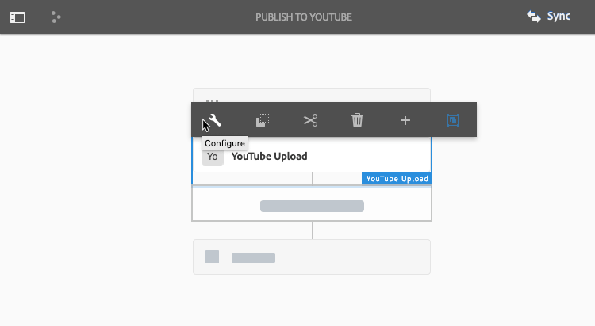

# Vídeo {#video}

En esta sección se describe el trabajo con vídeo en Dynamic Media.

## Inicio rápido: vídeos {#quick-start-videos}

La siguiente descripción paso a paso del flujo de trabajo se ha diseñado para ayudarle a ponerse en marcha rápidamente con los conjuntos de vídeos adaptables en Dynamic Media. Después de cada paso, hay referencias cruzadas a encabezados de temas donde puede encontrar más información.

>[!NOTE]
>
>Antes de trabajar con vídeo en Dynamic Media, asegúrese de que su administrador de Adobe Experience Manager ya ha activado y configurado los Cloud Services de Dynamic Media.
>
>* Consulte [Configuración de Cloud Services de Dynamic Media](/help/assets/dynamic-media/config-dm.md#configuring-dynamic-media-cloud-services) en Configuración de Dynamic Media y [Solucionar problemas de Dynamic Media](/help/assets/dynamic-media/troubleshoot-dm.md).
>


1. **Cargar los vídeos de Dynamic Media** haciendo lo siguiente:

   * Cree su propio perfil de codificación de vídeo. O bien, simplemente puede utilizar el predefinido _Codificación de vídeo adaptable_ perfil que viene con Dynamic Media.

      * [Creación de un perfil de codificación de vídeo](/help/assets/dynamic-media/video-profiles.md#creating-a-video-encoding-profile-for-adaptive-streaming).
      * Más información sobre [Prácticas recomendadas para la codificación de vídeo](#best-practices-for-encoding-videos).
   * Asocie el perfil de procesamiento de vídeo a una o varias carpetas en las que va a cargar los vídeos de origen principales.

      * [Aplicación de un perfil de vídeo a las carpetas](/help/assets/dynamic-media/video-profiles.md#applying-a-video-profile-to-folders).
      * Más información sobre [Organización de recursos digitales](/help/assets/organize-assets.md).
   * Cargue los vídeos de origen principales en las carpetas. Al añadir vídeos a la carpeta, se codifican según el perfil de procesamiento de vídeo que haya asignado a la carpeta.

      * Dynamic Media admite principalmente vídeos de formato corto con una duración máxima de 30 minutos y una resolución mínima buena a 25 x 25.
      * Puede cargar archivos de vídeo de hasta 15 GB cada uno.
      * [Cargar los vídeos](/help/assets/manage-video-assets.md#upload-and-preview-video-assets).
      * Más información sobre [Formatos de archivo de entrada admitidos](/help/assets/file-format-support.md).
   * Monitorizar cómo [la codificación de vídeo está progresando](#monitoring-video-encoding-and-youtube-publishing-progress) desde la vista de recursos o de flujo de trabajo.


1. **Administrar los vídeos de Dynamic Media** al realizar cualquiera de las siguientes acciones:

   * Organizar, examinar y buscar recursos de vídeo

      * [Organización de recursos digitales](/help/assets/organize-assets.md)
      * [Buscar recursos de vídeo](/help/assets/search-assets.md#custompredicates) o [Buscando recursos](/help/assets/manage-digital-assets.md#search-assets)
   * Previsualización y publicación de recursos de vídeo

      * Vea el vídeo de origen y las representaciones codificadas del vídeo junto con sus miniaturas asociadas:
         [Previsualizar vídeos](/help/assets/manage-video-assets.md#upload-and-preview-video-assets) o [Previsualización de recursos](/help/assets/dynamic-media/previewing-assets.md)
         [Administrar representaciones de vídeo](/help/assets/manage-digital-assets.md#managing-renditions)

      * [Administrar ajustes preestablecidos de visor](/help/assets/dynamic-media/managing-viewer-presets.md)
      * [Publicación de recursos](/help/assets/dynamic-media/publishing-dynamicmedia-assets.md)
   * Trabajo con metadatos de vídeo

      * Edite las propiedades del vídeo, como el título, la descripción y las etiquetas, y campos de metadatos personalizados:
         [Edición de propiedades de vídeo](/help/assets/manage-digital-assets.md#editing-properties)

      * [Administración de metadatos para recursos digitales](/help/assets/manage-metadata.md)
      * [Esquemas de metadatos](/help/assets/metadata-schemas.md)
   * Revise, apruebe y anote vídeos, y mantenga un control total de las versiones

      * [Anotación de vídeos](/help/assets/manage-video-assets.md#annotate-video-assets) o [Anotación de recursos](/help/assets/manage-digital-assets.md#annotating)

      * [Creación de una versión](/help/assets/manage-digital-assets.md#asset-versioning)
      * [Inicio de un flujo de trabajo en un recurso](/help/assets/manage-digital-assets.md#starting-a-workflow-on-an-asset)

      * [Revisar recursos de carpeta](/help/assets/bulk-approval.md)
      * [Proyectos](/help/sites-cloud/authoring/projects/overview.md)


1. **Publicación de vídeos de Dynamic Media** mediante una de las acciones siguientes:

   * Si utiliza Experience Manager como sistema WCM (Web Content Management), puede añadir vídeos directamente a las páginas web.

      * [Añadir vídeos a las páginas web](/help/assets/dynamic-media/adding-dynamic-media-assets-to-pages.md).
   * Si utiliza un sistema de administración de contenido web de terceros, puede vincular o incrustar vídeos a sus páginas web.

      * Integrar vídeo con URL:
         [Vinculación de URL en la aplicación web](/help/assets/dynamic-media/linking-urls-to-yourwebapplication.md).

      * Integración de vídeo mediante código incrustado en la página web:
         [Incrustar el visor de vídeo en una página web](/help/assets/dynamic-media/embed-code.md).
   * [Publicación de vídeos en YouTube](#publishing-videos-to-youtube).
   * [Generación de informes de vídeo](#viewing-video-reports).

   * [Agregar subtítulos a vídeo](#adding-captions-to-video).


## Trabajo con vídeo en Dynamic Media {#working-with-video-in-dynamic-media}

El vídeo en Dynamic Media es una solución integral que facilita la publicación de vídeos adaptables de alta calidad para su transmisión por streaming en varias pantallas, incluidas escritorios, tabletas y dispositivos móviles. Un conjunto de vídeos adaptable agrupa versiones del mismo vídeo que se codifican a diferentes velocidades de bits y formatos, como 400 kbps, 800 kbps y 1000 kbps. El equipo de escritorio o dispositivo móvil detecta el ancho de banda disponible.

Por ejemplo, en un dispositivo móvil iOS, detecta un ancho de banda como 3G, 4G o Wi-Fi. A continuación, selecciona automáticamente el vídeo codificado correcto entre las distintas velocidades de bits de vídeo dentro del conjunto de vídeos adaptables. El vídeo se transmite a equipos de escritorio, dispositivos móviles o tabletas.

Además, la calidad de vídeo cambia automáticamente si las condiciones de red cambian en el escritorio o en el dispositivo móvil. Además, si un cliente entra en modo de pantalla completa en un equipo de escritorio, el conjunto de vídeos adaptable responde con una mejor resolución, lo que mejora la experiencia de visualización del cliente. El uso de conjuntos de vídeos adaptables proporciona la mejor reproducción posible para los clientes que reproducen vídeo de Dynamic Media en varias pantallas y dispositivos.

La lógica que utiliza un reproductor de vídeo para determinar qué vídeo codificado se reproducirá o seleccionará durante la reproducción se basa en el siguiente algoritmo:

1. El reproductor de vídeo carga el fragmento de vídeo inicial en función de la velocidad de bits más cercana al valor establecido para la &quot;velocidad de bits inicial&quot; en el propio reproductor.
1. El reproductor de vídeo cambia según los cambios en la velocidad del ancho de banda según los siguientes criterios:

   1. El jugador elige el flujo de ancho de banda más alto por debajo o igual al ancho de banda estimado.
   1. El reproductor considera solo el 80% del ancho de banda disponible. Sin embargo, si está subiendo, es más conservador en solo el 70% para evitar la sobreestimación y volver inmediatamente.

Para obtener información técnica detallada sobre el algoritmo, consulte [https://android.googlesource.com/platform/frameworks/av/+/master/media/libstagefright/httplive/LiveSession.cpp](https://android.googlesource.com/platform/frameworks/av/+/master/media/libstagefright/httplive/LiveSession.cpp)

Para administrar un solo vídeo y conjuntos de vídeos adaptables, se admite lo siguiente:

* Carga de vídeo desde numerosos formatos de vídeo y audio compatibles y codificación de vídeo al formato MP4 H.264 para su reproducción en varias pantallas. Puede utilizar ajustes preestablecidos de vídeo adaptables predefinidos, ajustes preestablecidos de codificación de vídeo únicos o personalizar su propia codificación para controlar la calidad y el tamaño del vídeo.

   * Cuando se genera un conjunto de vídeos adaptable, incluye vídeos MP4.
   * **Nota**: los vídeos principales/de origen no se añaden a un conjunto de vídeos adaptables.

* Subtítulos de vídeo en todos los visores de vídeo de HTML5.
* Organice, examine y busque vídeos con compatibilidad total con metadatos para una administración eficaz de los recursos de vídeo.
* Ofrezca conjuntos de vídeos adaptables a la web y a equipos de escritorio, tabletas y dispositivos móviles.

La transmisión de vídeo adaptable es compatible con varias plataformas de iOS. Consulte [Guía de referencia de visores de Dynamic Media](https://experienceleague.adobe.com/docs/dynamic-media-developer-resources/library/viewers-aem-assets-dmc/video/c-html5-video-reference.html).

<!-- OUTDATED 2/28/22 BASED ON CQDOC-18692 Dynamic Media supports mobile video playback for MP4 H.264 video. You can find BlackBerry&reg; devices that support this video format at the following: [Supported video formats on BlackBerry&reg;](https://support.blackberry.com/kb/articleDetail?ArticleNumber=000005482).

OUTDATED 2/28/22 BASED ON CQDOC-18692 You can find Windows&reg; devices that support this video format at the following [Supported video formats on Windows&reg; Phone](https://docs.microsoft.com/en-us/windows/uwp/audio-video-camera/supported-codecs). -->

* Reproduzca el vídeo con los ajustes preestablecidos del visualizador de vídeo de Dynamic Media, incluidos los siguientes:

   * Visores de vídeo únicos.
   * Visores de medios mixtos que combinan contenido de vídeo e imagen.

* Configure reproductores de vídeo para satisfacer sus necesidades de marca.
* Integre vídeo en su sitio web, sitio móvil o aplicación móvil con una URL simple o código incrustado.

Consulte [Reproducción de vídeo dinámica](https://s7d9.scene7.com/s7/uvideo.jsp?asset=GeoRetail/Mop_AVS&amp;config=GeoRetail/Universal_Video1&amp;stageSize=640,480) muestra.

Consulte también [Visores para Experience Manager Assets y Dynamic Media Classic](https://experienceleague.adobe.com/docs/dynamic-media-developer-resources/library/viewers-aem-assets-dmc/c-html5-s7-aem-asset-viewers.html#viewers-aem-assets-dmc) y [Solo visores para Experience Manager Assets](https://experienceleague.adobe.com/docs/dynamic-media-developer-resources/library/viewers-for-aem-assets-only/c-html5-aem-asset-viewers.html#viewers-for-aem-assets-only) en el [Guía de referencia de visores de Dynamic Media](https://experienceleague.adobe.com/docs/dynamic-media-developer-resources.html).

## Práctica recomendada: Uso del visualizador de vídeo HTML5 {#best-practice-using-the-html-video-viewer}

Los ajustes preestablecidos del visualizador de vídeo Dynamic Media HTML5 son reproductores de vídeo sólidos. Puede utilizarlas para evitar muchos problemas comunes asociados con la reproducción de vídeo de HTML5 y problemas asociados con dispositivos móviles. Por ejemplo, una falta de entrega de flujo de bits adaptable y un alcance limitado del explorador de escritorio.

En el lado del diseño del reproductor, puede diseñar la funcionalidad del reproductor de vídeo con herramientas de desarrollo web estándar. Por ejemplo, puede diseñar los botones, los controles y el fondo de imagen de póster personalizado con HTML5 y CSS para ayudarle a llegar a sus clientes con un aspecto personalizado.

En la parte de reproducción del visor, detecta automáticamente la capacidad de vídeo del explorador. A continuación, sirve el vídeo mediante HLS o DASH, también conocido como flujo de vídeo adaptable. O bien, si estos métodos de envío no están presentes, se utiliza HTML 5 progressive en su lugar.

>[!NOTE]
>
>Para usar DASH en tus vídeos, primero debes habilitarlo en Asistencia técnica de Adobe en tu cuenta. Consulte [Habilitar DASH en su cuenta](#enable-dash).)

Puede combinar en un solo reproductor la capacidad de diseñar los componentes de reproducción con HTML5 y CSS. Puede tener reproducción integrada y utilizar flujo adaptable y progresivo según la capacidad del explorador. Todas estas funciones le permiten ampliar el alcance del contenido con medios enriquecidos tanto a los usuarios de equipos de escritorio como a los usuarios móviles, además de garantizar una experiencia de vídeo optimizada.

Consulte también [Solo visores para Experience Manager Assets](https://experienceleague.adobe.com/docs/dynamic-media-developer-resources/library/viewers-for-aem-assets-only/c-html5-aem-asset-viewers.html#viewers-for-aem-assets-only) en el [Guía de referencia de visores de Dynamic Media](https://experienceleague.adobe.com/docs/dynamic-media-developer-resources.html).


### Reproducción de vídeo en equipos de escritorio y dispositivos móviles mediante el visualizador de vídeo HTML5 {#playback-of-video-on-desktop-computers-and-mobile-devices-using-the-html-video-viewer}

En el caso de la transmisión de vídeo adaptable de escritorio y móvil, los vídeos utilizados para la conmutación de velocidad de bits se basan en todos los vídeos MP4 del conjunto de vídeos adaptable.

La reproducción de vídeo se produce mediante HLS o DASH, o descarga de vídeo progresivo. En versiones anteriores de Experience Manager, como 6.0, 6.1 y 6.2, los vídeos se transmitían por HTTP.

Sin embargo, en Experience Manager 6.3 y versiones posteriores, los vídeos se transmiten ahora por HTTPS (es decir, HLS o DASH) porque la URL del servicio de puerta de enlace DM siempre utiliza HTTPS. Este comportamiento predeterminado no afecta a los clientes. Es decir, la transmisión de vídeo siempre se producirá a través de HTTPS a menos que el explorador no la admita. (consulte la tabla siguiente).

Por tanto,

* Si tiene un sitio web HTTPS con flujo de vídeo HTTPS, el flujo está bien.
* Si tiene un sitio web HTTP con flujo de vídeo HTTPS, el flujo está bien y no hay problemas de contenido mixto desde el explorador web.

DASH es el estándar internacional y HLS es un estándar de Apple. Ambos se utilizan para la transmisión de vídeo adaptable. Además, ambas tecnologías ajustan automáticamente la reproducción según la capacidad del ancho de banda de la red. También permite al cliente &quot;buscar&quot; cualquier punto del vídeo sin necesidad de esperar a que se descargue el resto del vídeo.

El vídeo progresivo se proporciona descargando y almacenando el vídeo localmente en el sistema de escritorio o el dispositivo móvil de un usuario.

En la tabla siguiente se describe el dispositivo, el navegador y el método de reproducción de vídeos en equipos de escritorio y dispositivos móviles que utilizan el [Visor de vídeo de Dynamic Media HTML5](https://experienceleague.adobe.com/docs/dynamic-media-developer-resources/library/viewers-for-aem-assets-only/interactive-video/c-html5-aem-int-video.html#interactive-video).

<table>
 <tbody>
  <tr>
   <td><strong>Dispositivo</strong></td>
   <td><strong>Explorador</strong></td>
   <td><strong>Modo de reproducción de vídeo</strong></td>
  </tr>
  <tr>
   <td>Escritorio</td>
   <td>Internet Explorer 9 y 10</td>
   <td>Descarga progresiva.</td>
  </tr>
  <tr>
   <td>Escritorio</td>
   <td>Internet Explorer 11+</td>
   <td>En Windows® 8 y Windows® 10: forzar el uso de HTTPS siempre que se solicite DASH o HLS. Limitación conocida: HTTP en DASH o HLS no funciona en esta combinación de navegador/sistema operativo<br /> <br /> En Windows® 7: descarga progresiva. Utiliza la lógica estándar para seleccionar el protocolo HTTP frente al protocolo HTTPS.</td>
  </tr>
  <tr>
   <td>Escritorio</td>
   <td>Firefox 23-44</td>
   <td>Descarga progresiva.</td>
  </tr>
  <tr>
   <td>Escritorio</td>
   <td>Firefox 45 o posterior</td>
   <td>Flujo de velocidad de bits adaptable HLS o DASH*</td>
  </tr>
  <tr>
   <td>Escritorio</td>
   <td>Chrome</td>
   <td>Flujo de velocidad de bits adaptable HLS o DASH*</td>
  </tr>
  <tr>
   <td>Escritorio</td>
   <td>Safari (Mac)</td>
   <td>Flujo de velocidad de bits adaptable HLS</td>
  </tr>
  <tr>
   <td>Móvil</td>
   <td>Chrome (Android™ 6 o anterior)</td>
   <td>Descarga progresiva.</td>
  </tr>
  <tr>
   <td>Móvil</td>
   <td>Chrome (Android™ 7 o posterior)</td>
   <td>Velocidad de bits adaptable HLS o DASH* streaming/td&gt;
  </tr>
  <tr>
   <td>Móvil</td>
   <td>Android™ (explorador predeterminado)</td>
   <td>Descarga progresiva.</td>
  </tr>
  <tr>
   <td>Móvil</td>
   <td>Safari (iOS)</td>
   <td>Flujo de velocidad de bits adaptable HLS</td>
  </tr>
  <tr>
   <td>Móvil</td>
   <td>Chrome (iOS)</td>
   <td>Flujo de velocidad de bits adaptable HLS</td>
  </tr>
 </tbody>
</table>

>[!IMPORTANT]
>
>*Para usar DASH para tus videos, primero debes habilitarlo en tu cuenta con el Soporte técnico de Adobe. Consulte [Habilitar DASH en su cuenta](#enable-dash).)

<!--  THIS LINE WAS REMOVED FROM THE TABLE ABOVE ON FEB 28, 2022 BASED ON CQDOC 18692 -RSB <tr>
   <td>Mobile</td>
   <td>BlackBerry&reg;</td>
   <td>HLS or DASH</td>
  </tr>
 -->

## Arquitectura de la solución de vídeo de Dynamic Media {#architecture-of-dynamic-media-video-solution}

El siguiente gráfico muestra el flujo de trabajo general de creación de vídeos que se cargan y codifican mediante DMGateway (en modo híbrido de Dynamic Media) y que se ponen a disposición del público.


## Arquitectura de publicación híbrida para vídeos {#hybrid-publishing-architecture-for-videos}


## Prácticas recomendadas para codificar vídeos {#best-practices-for-encoding-videos}

El **Codificar vídeo Dynamic Media** el flujo de trabajo codifica el vídeo si ha activado Dynamic Media y ha configurado Cloud Services de vídeo. Este flujo de trabajo captura el historial de procesos de flujo de trabajo y la información de errores. Consulte [Monitorización de la codificación de vídeo y progreso de publicación en YouTube](#monitoring-video-encoding-and-youtube-publishing-progress). Si ha activado Dynamic Media y ha configurado Cloud Services de vídeo, la variable **[!UICONTROL Codificar vídeo Dynamic Media]** El flujo de trabajo de se aplica automáticamente al cargar un vídeo. (Si no utiliza Dynamic Media, la variable **[!UICONTROL Recurso de actualización DAM]** el flujo de trabajo surte efecto).

Las siguientes son sugerencias recomendadas para codificar archivos de vídeo de origen.

<!-- For advice about video encoding, see the following:

* [Streaming 101: The Basics — Codecs, Bandwidth, Data Rate, and Resolution](https://www.adobe.com/go/learn_s7_streaming101_en).
* [Video Encoding Basics](https://www.adobe.com/go/learn_s7_encoding_en). -->

### Archivos de vídeo de origen {#source-video-files}

Cuando codifique un archivo de vídeo, utilice un archivo de vídeo de origen de la máxima calidad posible. Evite utilizar archivos de vídeo codificados anteriormente porque estos archivos ya están comprimidos y una codificación posterior crea un vídeo de calidad inferior.

* Dynamic Media admite principalmente vídeos de formato corto con una duración máxima de 30 minutos y una resolución mínima buena a 25 x 25.
* Puede cargar archivos de vídeo de origen principales de hasta 15 GB cada uno.

En la tabla siguiente se describe el tamaño recomendado, la relación de aspecto y la velocidad de bits mínima que deben tener los archivos de vídeo de origen antes de codificarlos:

| Tamaño | Proporción de aspecto | Velocidad de bits mínima |
|--- |--- |--- |
| 1024 X 768 | 4:3 | 4500 Kbps para la mayoría de los vídeos. |
| 1280 X 720 | 16:9 | 3000 - 6000 kbps, dependiendo de la cantidad de movimiento en el vídeo. |
| 1920 X 1080 | 16:9 | 6.000 a 8.000 kbps, en función de la cantidad de movimiento del vídeo. |

### Obtener los metadatos de un archivo {#obtaining-a-file-s-metadata}

Puede obtener los metadatos de un archivo visualizando sus metadatos mediante una herramienta de edición para vídeos o utilizando una aplicación diseñada para obtener metadatos. A continuación se indican instrucciones para utilizar MediaInfo, una aplicación de terceros, para obtener los metadatos de un archivo de vídeo:

1. Ir a [Descarga de MediaInfo](https://mediaarea.net/en/MediaInfo/Download).
1. Seleccione y descargue el instalador para la versión GUI y siga las instrucciones de instalación.
1. Después de la instalación, haga clic con el botón derecho en el archivo de vídeo (solo Windows®) y seleccione MediaInfo o abra MediaInfo y arrastre el archivo de vídeo a la aplicación. Verá todos los metadatos asociados con el archivo de vídeo, incluidos el ancho, el alto y los fps.

### Proporción de aspecto {#aspect-ratio}

Cuando elija o cree un ajuste preestablecido de codificación de vídeo para el archivo de vídeo de origen principal, asegúrese de que el ajuste preestablecido tenga la misma proporción de aspecto que el archivo de vídeo de origen principal. La relación de aspecto es la relación entre la anchura y la altura del vídeo.

Para determinar la proporción de aspecto de un archivo de vídeo, obtenga los metadatos del archivo y anote la anchura y altura del archivo (consulte Obtención de metadatos de un archivo más arriba). A continuación, utilice esta fórmula para determinar la relación de aspecto:

anchura/altura = proporción de aspecto

En la tabla siguiente se describe cómo se traducen los resultados de la fórmula en opciones de relación de aspecto comunes:

| Resultado de fórmula | Proporción de aspecto |
|--- |--- |
| 1.33 | 4:3 |
| 0.75 | 3:4 |
| 1.78 | 16:9 |
| 0.56 | 9:16 |

Por ejemplo, un vídeo de 1440 anchura x 1080 altura tiene una relación de aspecto de 1440/1080 o 1,33. En este caso, elija un ajuste preestablecido de codificación de vídeo con una relación de aspecto de 4:3 para codificar el archivo de vídeo.

### Velocidad de bits {#bitrate}

La velocidad de bits es la cantidad de datos codificados para formar un segundo de reproducción de vídeo. La velocidad de bits se mide en kilobits por segundo (Kbps).

>[!NOTE]
>
>Como todos los códecs utilizan compresión con pérdida, la velocidad de bits es el factor más importante en la calidad del vídeo. Con la compresión con pérdida, cuanto más comprime un archivo de vídeo, más se degrada la calidad. Por este motivo, si todas las demás características son iguales (resolución, velocidad de fotogramas y códec), cuanto menor sea la velocidad de bits, menor será la calidad del archivo comprimido.

Al seleccionar una codificación de velocidad de bits, puede elegir entre dos tipos:

* **[!UICONTROL Codificación de velocidad constante]** (CBR): durante la codificación CBR, la velocidad de bits o el número de bits por segundo se mantienen iguales durante todo el proceso de codificación. La codificación CBR conserva la velocidad de datos establecida en su configuración durante todo el vídeo. Además, la codificación CBR no optimiza los archivos multimedia para la calidad, pero ahorra espacio de almacenamiento.
Utilice CBR si el vídeo contiene un nivel de movimiento similar en todo el vídeo. CBR se utiliza comúnmente para el contenido de vídeo de streaming. Consulte también [Usar parámetros de codificación de vídeo personalizados](/help/assets/dynamic-media/video-profiles.md#using-custom-added-video-encoding-parameters).

* **[!UICONTROL Codificación de velocidad de bits variable]** (VBR): La codificación VBR ajusta la velocidad de datos hacia abajo y hasta el límite superior establecido, en función de los datos requeridos por el compresor. Esta funcionalidad significa que durante un proceso de codificación VBR la velocidad de bits del archivo multimedia aumenta o disminuye dinámicamente según las necesidades de velocidad de bits de los archivos multimedia.
VBR tarda más en codificarse, pero produce los resultados más favorables; la calidad del archivo multimedia es superior. VBR se utiliza comúnmente para la entrega progresiva de contenido de vídeo http.

¿Cuándo se utiliza VBR o CRB?
Al seleccionar VBR en comparación con CBR, casi siempre se recomienda utilizar VBR para los archivos multimedia. VBR proporciona archivos de mayor calidad a velocidades de bits competitivas. Cuando utilice VBR, asegúrese de utilizar con codificación de dos pasos y establezca la velocidad de bits máxima en 1,5 veces la velocidad de bits de vídeo de destino.

Al elegir un ajuste preestablecido de codificación de vídeo, asegúrese de tener en cuenta la velocidad de conexión del usuario final de destino. Elija un ajuste preestablecido con una velocidad de datos del 80 % de esa velocidad. Por ejemplo, si la velocidad de conexión del usuario final de destino es de 1000 Kbps, el mejor ajuste preestablecido es uno con una velocidad de datos de vídeo de 800 Kbps.

En esta tabla se describe la velocidad de datos de las velocidades de conexión típicas.

| Velocidad (Kbps) | Tipo de conexión |
|--- |--- |
| 256 | Conexión de acceso telefónico. |
| 800 | Conexión móvil típica. Para esta conexión, establezca como objetivo una velocidad de datos en el rango de 400 a un máximo de 800 para experiencias 3G. |
| 2000 | Conexión de escritorio de banda ancha típica. Para esta conexión, establezca como objetivo una velocidad de datos en el rango de 800-2000 Kbps, con un promedio de la mayoría de los objetivos de 1200-1500 Kbps. |
| 5000 | Conexión típica de banda ancha alta. No se recomienda la codificación en este rango superior porque la mayoría de los consumidores no pueden acceder a la entrega de vídeo a esta velocidad. |

### Resolución {#resolution}

**Resolución** describe la altura y anchura de un archivo de vídeo en píxeles. La mayor parte del vídeo de origen se almacena en alta resolución (por ejemplo, 1920 x 1080). Para fines de streaming, el vídeo de origen se comprime con una resolución más pequeña (640 x 480 o menor).

La resolución y la velocidad de datos son dos factores integrados que determinan la calidad del vídeo. Para mantener la misma calidad de vídeo, cuanto mayor sea el número de píxeles de un archivo de vídeo (mayor será la resolución), mayor deberá ser la velocidad de datos. Por ejemplo, considere el número de píxeles por fotograma en una resolución de 320 x 240 y un archivo de vídeo de resolución de 640 x 480:

| Resolución | Píxeles por cuadro |
|--- |--- |
| 320 x 240 | 76,800 |
| 640 x 480 | 307,200 |

El archivo de 640 x 480 tiene cuatro veces más píxeles por fotograma. Para lograr la misma velocidad de datos para estas dos resoluciones de ejemplo, se aplica cuatro veces la compresión al archivo de 640 x 480, lo que puede reducir la calidad del vídeo. Por lo tanto, una velocidad de datos de vídeo de 250 Kbps produce una visualización de alta calidad con una resolución de 320 x 240, pero no con una resolución de 640 x 480.

En general, cuanto mayor sea la velocidad de datos que utilice, mejor aparecerá el vídeo y, cuanto mayor sea la resolución que utilice, mayor será la velocidad de datos que deberá mantener con calidad de visualización (en comparación con resoluciones más bajas).

Como la resolución y la velocidad de datos están vinculadas, tiene dos opciones al codificar vídeo:

* Elija una velocidad de datos y, a continuación, codifique con la resolución más alta que parezca buena a la velocidad de datos elegida.
* Elija una resolución y codifique a la velocidad de datos necesaria para conseguir vídeo de alta calidad con la resolución que elija.

Cuando elija (o cree) un ajuste preestablecido de codificación de vídeo para el archivo de vídeo de origen principal, utilice esta tabla para seleccionar la resolución correcta:

| Resolución | Altura (píxeles) | Tamaño de pantalla |
|--- |--- |--- |
| 240p | 240 | Pantalla pequeña |
| 300p | 300 | Pantalla pequeña normalmente para dispositivos móviles |
| 360p | 360 | Pantalla pequeña |
| 480p | 480 | Pantalla mediana |
| 720p | 720 | Pantalla grande |
| 1080p | 1080 | Pantalla grande de alta definición |

### Fps (fotogramas por segundo) {#fps-frames-per-second}

En Estados Unidos y Japón, la mayoría de los vídeos se graban a 29,97 fotogramas por segundo (fps); en Europa, la mayoría de los vídeos se graban a 25 fps. La película se filma a 24 fps.

Elija un ajuste preestablecido de codificación de vídeo que coincida con la velocidad de fps del archivo de vídeo de origen principal. Por ejemplo, si el vídeo de origen principal es de 25 fps, elija un ajuste preestablecido de codificación con 25 fps. De forma predeterminada, toda la codificación personalizada utiliza el fps del archivo de vídeo de origen principal. Por este motivo, no es necesario especificar explícitamente la configuración de fps al crear un ajuste preestablecido de codificación de vídeo.

### Dimensiones de codificación de vídeo {#video-encoding-dimensions}

Para obtener resultados óptimos, seleccione dimensiones de codificación de modo que el vídeo de origen sea un múltiplo completo de todos los vídeos codificados.

Para calcular esta proporción, se divide el ancho de origen por el ancho codificado para obtener la proporción de ancho. A continuación, se divide la altura de origen por la altura codificada para obtener la relación de altura.

Si la proporción resultante es un entero, significa que el vídeo se escala de forma óptima. Si la proporción resultante no es un entero, afecta a la calidad del vídeo al dejar artefactos de píxeles sobrantes en la pantalla. Este efecto es más evidente cuando el vídeo tiene texto.

Por ejemplo, supongamos que el vídeo de origen es de 1920 x 1080. En la tabla siguiente, los tres vídeos codificados proporcionan la configuración de codificación óptima para utilizar.

| Tipo de vídeo | Anchura x altura | Proporción de anchura | Proporción de altura |
|--- |--- |--- |--- |
| Origen | 1920x1080 | 1 | 1 |
| Codificado | 960 x 540 | 2 | 2 |
| Codificado | 640 x 360 | 3 | 3 |
| Codificado | 480 x 270 | 4 | 4 |

### Formato de archivo de vídeo codificado {#encoded-video-file-format}

Dynamic Media recomienda utilizar ajustes preestablecidos de codificación de vídeo MP4 H.264. Como los archivos MP4 utilizan el códec de vídeo H.264, proporciona vídeo de alta calidad pero en un tamaño de archivo comprimido.

### Habilitar DASH en su cuenta {#enable-dash}

DASH (Digital Adaptive Streaming over HTTP) es el estándar internacional para streaming de video y es ampliamente adoptado en diferentes visores de video. Cuando DASH está habilitado en su cuenta, tiene la opción de elegir entre DASH o HLS para flujo de vídeo adaptable. O bien, puede optar por ambos con el cambio automático entre los reproductores cuando **[!UICONTROL auto]** está seleccionado como tipo de reproducción en el ajuste preestablecido de Visor.

Algunas ventajas clave de habilitar DASH en su cuenta son las siguientes:

* Empaquete el vídeo de flujo DASH para la transmisión de velocidad de bits adaptable. Este método aumenta la eficacia del envío. El streaming adaptable garantiza la mejor experiencia de visualización para sus clientes.
* El streaming optimizado para el navegador con reproductores Dynamic Media cambia entre el streaming HLS y DASH para garantizar la mejor calidad de servicio. El reproductor de vídeo cambia automáticamente a HLS cuando se utiliza un explorador Safari.
* Puede configurar su método de flujo preferido (HLS o DASH) editando el ajuste preestablecido del visualizador de vídeo.
* La codificación de vídeo optimizada garantiza que no se utilice almacenamiento adicional al habilitar la capacidad DASH. Se crea un único conjunto de codificaciones de vídeo para HLS y DASH para optimizar los costes de almacenamiento de vídeo.
* Ayuda a que la entrega de vídeo sea más accesible para los clientes.
* Obtenga también la URL de flujo continuo mediante API.

   >[!IMPORTANT]
   >
   >Actualmente, solo está disponible en Norteamérica habilitar DASH en su cuenta.

Inicia una solicitud para utilizar DASH; no se activa automáticamente en su cuenta.

Para habilitar DASH en su cuenta, cree un caso de asistencia al cliente como se describe a continuación. En el caso de asistencia, especifique que desea habilitar DASH en su cuenta de Dynamic Media y en el Experience Manager.

**Para habilitar DASH en su cuenta:**

1. [Utilice el Admin Console para iniciar la creación de un nuevo caso de asistencia](https://helpx.adobe.com/es/enterprise/using/support-for-experience-cloud.html).
1. Siga las instrucciones para crear un caso de soporte y asegúrese de proporcionar la siguiente información:

   * Nombre del contacto principal, correo electrónico, teléfono.
   * Nombre de su cuenta de Dynamic Media.
   * Especifique que desea habilitar DASH en su cuenta de Dynamic Media y en el Experience Manager.

1. La Asistencia al cliente de Adobe le añade a la Lista de espera de clientes de DASH en función del orden en que se envían las solicitudes.
1. Cuando el Adobe de trabajo esté listo para administrar su solicitud, el Servicio de atención al cliente se pondrá en contacto con usted para coordinar y establecer una fecha objetivo para la habilitación de DASH.
1. Se le notificará una vez que el Servicio de atención al cliente lo haya completado.
1. Cree su [ajuste preestablecido de visor de vídeo](/help/assets/dynamic-media/managing-viewer-presets.md#creating-a-new-viewer-preset) como siempre.

## Publicación de vídeos en YouTube {#publishing-videos-to-youtube}

Puede publicar recursos de vídeo administrados en Experience Manager Assets directamente en un canal de YouTube que haya creado anteriormente.

Para publicar recursos de vídeo en YouTube, puede etiquetar recursos de vídeo en Experience Manager Assets con etiquetas. Estas etiquetas se asocian a un canal de YouTube. Si la etiqueta de un recurso de vídeo coincide con la de un canal de YouTube, el vídeo se publica en YouTube. La publicación en YouTube se produce junto con la publicación normal del vídeo, siempre y cuando se utilice una etiqueta asociada.

YouTube realiza su propia codificación. De este modo, el archivo de vídeo original que se cargó en Experience Manager se publica en YouTube, en lugar de en cualquier representación de vídeo que haya creado la codificación de Dynamic Media. Aunque no es necesario procesar vídeos con Dynamic Media, se espera que lo hagan en caso de que se necesite un ajuste preestablecido de visualizador para la reproducción.

Cuando evita el perfil de procesamiento de vídeo y publica directamente en YouTube, simplemente significa que el recurso de vídeo en Experience Manager Asset no obtiene una miniatura visible. También significa que los vídeos que no están codificados no funcionan con ninguno de los tipos de recursos de Dynamic Media.

La publicación de recursos de vídeo en servidores de YouTube implica completar las siguientes tareas para garantizar la verificación segura y protegida servidor a servidor con YouTube:

1. [Configuración de Google Cloud](#configuring-google-cloud-settings)
1. [Crear un canal de YouTube](#creating-a-youtube-channel)
1. [Añadir etiquetas para publicar](#adding-tags-for-publishing)
1. [Configuración de YouTube en Experience Manager](#setting-up-youtube-in-aem)
1. [(Opcional) Automatice la configuración de las propiedades predeterminadas de YouTube para los vídeos cargados](#optional-automating-the-setting-of-default-youtube-properties-for-your-uploaded-videos)
1. [Publicación de vídeos en el canal de YouTube](#publishing-videos-to-your-youtube-channel)
1. [(Opcional) Compruebe el vídeo publicado en YouTube](/help/assets/dynamic-media/video.md#optional-verifying-the-published-video-on-youtube)
1. [Vinculación de URL de YouTube a la aplicación web](#linking-youtube-urls-to-your-web-application)

También puede [cancelar la publicación de vídeos para eliminarlos de YouTube](#unpublishing-videos-to-remove-them-from-youtube).

### Configuración de Google Cloud {#configuring-google-cloud-settings}

Para publicar en YouTube, necesita una cuenta de Google. Si tiene una cuenta de GMAIL, entonces ya tiene una cuenta de Google; si no tiene una cuenta de Google, puede crear fácilmente una. Necesita la cuenta de porque necesita credenciales para publicar recursos de vídeo en YouTube. <!-- hidden March 3 2022 If you have an account already created, then skip this task and proceed directly to [Create a YouTube channel](#creating-a-youtube-channel). -->

La cuenta utilizada con Google Cloud y la cuenta de Google utilizada para YouTube no tienen por qué ser la misma.

Google cambia periódicamente su interfaz de usuario. Como tal, los pasos para publicar vídeos en YouTube pueden variar ligeramente de lo que se documenta a continuación. Esta advertencia también se aplica a YouTube cuando intenta comprobar si se han cargado vídeos en él.

>[!NOTE]
>
>Los siguientes pasos eran precisos en el momento de escribir este artículo. Sin embargo, Google actualiza periódicamente sus páginas web en la nube sin previo aviso. De este modo, es posible que algunas opciones de configuración tengan nombres ligeramente diferentes en la interfaz de usuario de Google del nombre utilizado en los pasos.

**Para establecer la configuración de Google Cloud:**

1. Cree una cuenta de Google.
   [https://accounts.google.com/signup/v2?service=mail&amp;flowName=GlifWebSignIn&amp;flowEntry=SignUp](https://accounts.google.com/signup/v2?service=mail&amp;flowName=GlifWebSignIn&amp;flowEntry=SignUp)

   Si ya tiene una cuenta de Google, puede pasar al siguiente paso.

1. Ir a [https://cloud.google.com/](https://cloud.google.com/).
1. En el **[!UICONTROL Google Cloud]** página, cerca de la esquina superior derecha, seleccione **[!UICONTROL Consola]**.

   Si es necesario, **[!UICONTROL Iniciar sesión]** usando las credenciales de su cuenta de Google para ver la **[!UICONTROL Consola]** opción.

1. En el **[!UICONTROL Tablero]** página, a la derecha de **[!UICONTROL Google Cloud Platform]**, seleccione la **[!UICONTROL Proyecto]** lista desplegable para abrir el **[!UICONTROL Seleccionar un proyecto]** Cuadro de diálogo.
1. En el **[!UICONTROL Seleccionar un proyecto]** , seleccione **[!UICONTROL Nuevo proyecto]**.
1. En el **[!UICONTROL Nuevo proyecto]** , en el **[!UICONTROL Nombre del proyecto]** , escriba el nombre del nuevo proyecto.

   El ID del proyecto se basa en el nombre del proyecto. Como tal, elija el nombre del proyecto con cuidado; no se puede cambiar después de crearlo. Además, debe volver a introducir el mismo ID de proyecto al configurar YouTube en Experience Manager más adelante. Por lo tanto, anótelo.

1. Seleccione **[!UICONTROL Crear]**.

1. Realice una de las siguientes acciones:

   * En el panel del proyecto, en la variable **[!UICONTROL Primeros pasos]** tarjeta, seleccione **[!UICONTROL Explorar y habilitar API]**.
   * En el panel del proyecto, en la variable **[!UICONTROL API]** tarjeta, seleccione **[!UICONTROL Ir a la información general de API]**.

1. Cerca de la parte superior central del **[!UICONTROL API y servicios]** página, seleccione **[!UICONTROL HABILITAR API Y SERVICIOS]**.<!-- NEXT STEP BELOW IS STEP 10 -->
1. En el **[!UICONTROL Biblioteca de API]** página, en el lado izquierdo, debajo de **[!UICONTROL Categoría]**, seleccione **[!UICONTROL YouTube]**. En el lado derecho de la página, seleccione **[!UICONTROL YouTube]**.
1. En el **[!UICONTROL YouTube]** página, seleccione **[!UICONTROL API de datos de YouTube v3]**.
1. En el **[!UICONTROL API de datos de YouTube v3]** página, seleccione **[!UICONTROL ADMINISTRAR]**.

   

1. Para utilizar la API, necesita credenciales. Si es necesario, en el lado izquierdo del **[!UICONTROL API y servicios]** página, seleccione **[!UICONTROL Credenciales]**.
1. En el **[!UICONTROL Credenciales]** página, cerca de la parte superior, seleccione **[!UICONTROL CREAR CREDENCIALES]**, luego seleccione **[!UICONTROL ID de cliente de OAuth]**.
1. En el **[!UICONTROL Crear ID de cliente de OAuth]** , en la **[!UICONTROL Tipo de aplicación]** , seleccione la opción **[!UICONTROL aplicación web]**.

   

1. Realice una de las siguientes acciones:

   * En el **[!UICONTROL Nombre]** , introduzca un nombre único para su cliente de OAuth 2.0.
   * Utilice el nombre predeterminado que Google ya proporcionó en la **[!UICONTROL Nombre]** field.

1. En el **[!UICONTROL Orígenes JavaScript autorizados]** encabezado, seleccione **[!UICONTROL AÑADIR URI]**.

   

1. En el **[!UICONTROL URI]** , introduzca la siguiente ruta, sustituyendo su propio dominio y número de puerto en la ruta y, a continuación, pulse **[!UICONTROL Entrar]** para añadir la ruta a la lista:

   `https://<servername.domain>:<port_number>`

   Por ejemplo, `https://1a2b3c.mycompany.com:4321`. 

   >[!NOTE]
   >
   >El ejemplo de ruta de URI anterior es hipotético y solo con fines explicativos.

1. En el **[!UICONTROL URI de redireccionamiento autorizados]** encabezado, seleccione AÑADIR URI.
1. En el **[!UICONTROL URI]** , introduzca la siguiente ruta, sustituyendo su propio dominio y número de puerto en la ruta y, a continuación, pulse **[!UICONTROL Entrar]** para añadir la ruta a la lista:

   `https://<servername.domain>:<port_number>/etc/cloudservices/youtube.youtubecredentialcallback.json`

   Por ejemplo, `https://1a2b3c.mycompany.com:4321/etc/cloudservices/youtube.youtubecredentialcallback.json`. 

   >[!NOTE]
   >
   >El ejemplo de ruta de URI anterior es hipotético y solo con fines explicativos.

1. Cerca de la parte inferior del **[!UICONTROL Crear ID de cliente de OAuth]** página, seleccione **[!UICONTROL Crear]**.
1. En el **[!UICONTROL Cliente de OAuth creado]** , haga lo siguiente:

   * (Opcional) Copie los valores en la variable **[!UICONTROL Su ID de cliente]** y **[!UICONTROL Secreto de cliente]** y guarde los cambios.
   * Seleccionar **[!UICONTROL DESCARGAR JSON]** y, a continuación, guarde el archivo JSON.

   Necesita este archivo JSON descargado cuando configure YouTube en Adobe Experience Manager más adelante.

   

1. En el **[!UICONTROL Cliente de OAuth creado]** , seleccione **[!UICONTROL OK]**.
1. Cierre la sesión de su cuenta de Google. Ahora cree un canal de YouTube.

### Crear un canal de YouTube {#creating-a-youtube-channel}

La publicación de vídeos en YouTube requiere que tenga uno o más canales. Si ya ha creado un canal de YouTube, puede omitir esta tarea y ir a [Añadir etiquetas para publicar](/help/assets/dynamic-media/video.md#adding-tags-for-publishing).

>[!CAUTION]
>
>Asegúrese de que ya ha configurado uno o más canales en YouTube *antes* Los canales se agregan en Configuración de YouTube en Experience Manager (consulte [Configuración de YouTube en Experience Manager](#setting-up-youtube-in-aem) abajo). Si no puede configurar el canal, no se le avisará de que no hay canales. Sin embargo, la verificación mediante Google se sigue produciendo cuando se añade un canal, pero no existe la opción de elegir el canal al que se envía el vídeo.

**Para crear un canal de YouTube:**

1. Ir a [https://www.youtube.com](https://www.youtube.com/) e inicie sesión con las credenciales de su cuenta de Google.
1. En la esquina superior derecha de la página de YouTube, seleccione la imagen de perfil (también puede aparecer como una letra dentro de un círculo de color sólido) y, a continuación, seleccione **[!UICONTROL Configuración de YouTube]** (icono de engranaje redondo).
1. En la página Información general, en el encabezado Funciones adicionales, seleccione **[!UICONTROL Ver todos mis canales o crear un canal]**.
1. En la página Canales, seleccione **[!UICONTROL Crear un canal nuevo]**.
1. En la página Cuenta de marca, en el campo Nombre de cuenta de marca, introduzca un nombre de empresa o cualquier otro nombre de canal que elija donde desea publicar los recursos de vídeo y, a continuación, seleccione **[!UICONTROL Crear]**.

   Recuerde el nombre que introduce aquí; debe introducirlo de nuevo cuando tenga que configurar YouTube en Experience Manager.

1. (Opcional) Si es necesario, agregue más canales.

   Ahora puede añadir etiquetas para la publicación.

### Añadir etiquetas para publicar {#adding-tags-for-publishing}

Para publicar en los vídeos en YouTube, Experience Manager asocia las etiquetas a uno o más canales de YouTube. Para añadir etiquetas para la publicación, consulte [Administración de etiquetas](/help/sites-cloud/authoring/features/tags.md).

O bien, si tiene intención de utilizar las etiquetas predeterminadas en Experience Manager, puede omitir esta tarea y ir a [Configuración de YouTube en Experience Manager](#setting-up-youtube-in-aem).

>[!NOTE]
>
>Una vez configurado el Cloud Service, no se requiere otra configuración para habilitar el agente de replicación de publicación de YouTube en este momento. El motivo es que se habilitó cuando se guardó la configuración del Cloud Service.

<!-- ### Enabling the YouTube Publish replication agent {#enabling-the-youtube-publish-replication-agent}

After you enable the YouTube Publish replication agent, if you want to test the connection to the Google Cloud account, select **[!UICONTROL Test Connection]**. A browser tab displays the connection results. If you have added YouTube Channels, then a listing of those is displayed as part of the test.

1. In the upper-left corner of Experience Manager, select the Experience Manager logo, then in the left rail, navigate to **[!UICONTROL Tools]** > **[!UICONTROL Deployment]** > **[!UICONTROL Replication]** > **[!UICONTROL Agents on Author]**.
1. On the Agents of Author page, select **[!UICONTROL YouTube Publish (youtube)]**.
1. On the toolbar, to the right of Settings, select **[!UICONTROL Edit]**.
1. Select the **[!UICONTROL Enabled]** checkbox to turn on the replication agent.
1. Select **[!UICONTROL OK]**. -->

### Configuración de YouTube en Experience Manager {#setting-up-youtube-in-aem}

A partir de Experience Manager 6.4, se introdujo un nuevo método de interfaz de usuario táctil para configurar la publicación de YouTube en Experience Manager. En función de la instancia instalada de Experience Manager que esté utilizando, realice una de las siguientes acciones:

* Para configurar YouTube en Experience Manager anterior a la versión 6.4, consulte [Configuración de YouTube en Experience Manager anterior a 6.4](/help/assets/dynamic-media/video.md#setting-up-youtube-in-aem-before).
* Para configurar YouTube en Experience Manager 6.4 o posterior, consulte [Configuración de YouTube en Experience Manager 6.4 y posterior](#setting-up-youtube-in-aem-and-later).

#### Configuración de YouTube en Experience Manager 6.4 y posterior {#setting-up-youtube-in-aem-and-later}

1. Asegúrese de iniciar sesión en la instancia de Dynamic Media como administrador.
1. En la esquina superior izquierda de Experience Manager, seleccione el logotipo del Experience Manager y, a continuación, en el carril izquierdo, vaya a **[!UICONTROL Herramientas]**(icono de martillo) > **[!UICONTROL Cloud Services]** > **[!UICONTROL Configuración de publicación de YouTube]**.
1. Seleccionar **[!UICONTROL global]** (no lo seleccione).

1. Cerca de la esquina superior derecha de la página global, seleccione **[!UICONTROL Crear]**.
1. En la página Crear configuración de YouTube, en Configuración de plataforma de Google Cloud, en el campo **[!UICONTROL Nombre de aplicación]**, introduzca el ID de proyecto de Google.

   Especificó el ID del proyecto al establecer inicialmente la configuración de Google Cloud anteriormente.
Deje abierta la página Crear configuración de YouTube; volverá a ella en un momento.

   

1. Con un editor de texto sin formato, abra el archivo JSON que descargó y guardó anteriormente en la tarea [Configuración de Google Cloud](/help/assets/dynamic-media/video.md#configuring-google-cloud-settings).
1. Seleccione y copie todo el texto JSON.
1. Vuelva al cuadro de diálogo Configuración de cuenta de YouTube. En el campo **[!UICONTROL Configuración JSON]**, pegue el texto JSON.
1. Cerca de la esquina superior derecha de la página, seleccione **[!UICONTROL Guardar]**.

   Ahora configure los canales de YouTube en Experience Manager.

1. Seleccionar **[!UICONTROL Añadir canal]**.
1. En el campo Nombre del canal, introduzca el nombre del canal que ha creado en la tarea **[!UICONTROL Añadir uno o más canales a YouTube]** antes.

   Si lo desea, puede añadir una descripción.

1. Seleccionar **[!UICONTROL Añadir]**.
1. Se muestra la verificación de YouTube/Google. Si aún no ha iniciado sesión en la cuenta de Google Cloud, omita este paso.

   * Introduzca el nombre de usuario y la contraseña de Google asociados con el ID del proyecto de Google y el texto JSON anteriores.
   * Según el número de canales de su cuenta, verá dos o más elementos. Seleccione un canal. No seleccione la dirección de correo electrónico; no es un canal.
   * En la página siguiente, seleccione **[!UICONTROL Aceptar]** para permitir el acceso a este canal.

1. Seleccionar **[!UICONTROL Permitir]**.

   Ahora configure etiquetas para la publicación.

1. **[!UICONTROL Configuración de etiquetas para publicar]** : En la página Cloud Services > YouTube, seleccione el icono de lápiz para editar la lista de etiquetas que desea utilizar.
1. Para mostrar la lista de etiquetas disponibles en Experience Manager, seleccione el icono de lista desplegable (acento circunflejo invertido).
1. Para añadirlas, seleccione una o varias etiquetas.

   Para eliminar una etiqueta que haya añadido, selecciónela y seleccione **[!UICONTROL X]**.

1. Cuando termine de agregar las etiquetas que desee, seleccione **[!UICONTROL Guardar]**.

   Ahora puede publicar vídeos en su canal de YouTube.

#### Configuración de YouTube en Experience Manager anterior a 6.4 {#setting-up-youtube-in-aem-before}

1. Asegúrese de iniciar sesión en la instancia de Dynamic Media como administrador.

1. En la esquina superior izquierda de Experience Manager, seleccione el logotipo del Experience Manager y, a continuación, en el carril izquierdo, vaya a **[!UICONTROL Herramientas]** (icono de martillo) > **[!UICONTROL Implementación]** > **[!UICONTROL Cloud Services]**.
1. En el encabezado Servicios de terceros, en YouTube, seleccione **[!UICONTROL Configurar ahora]**.
1. En el cuadro de diálogo Crear configuración, introduzca un título (obligatorio) y un nombre (opcional) en los campos respectivos.
1. Seleccione **[!UICONTROL Crear]**.
1. En el cuadro de diálogo Configuración de cuenta de YouTube, en el campo **[!UICONTROL Nombre de la aplicación]**, introduzca el ID del proyecto de Google.

   Especificó el ID del proyecto al [Configuración de Google Cloud configurada](/help/assets/dynamic-media/video.md#configuring-google-cloud-settings) antes.
Deje abierto el cuadro de diálogo Configuración de cuenta de YouTube; volverá a él en un momento.

1. Con un editor de texto sin formato, abra el archivo JSON que descargó y guardó anteriormente en la tarea Configuración de Google Cloud.
1. Seleccione y copie todo el texto JSON.
1. Vuelva al cuadro de diálogo Configuración de cuenta de YouTube. En el campo **[!UICONTROL Configuración JSON]**, pegue el texto JSON.
1. Seleccionar **[!UICONTROL OK]**.

   Ahora configure los canales de YouTube en Experience Manager.

1. A la derecha de **[!UICONTROL Canales disponibles]**, seleccione **+** (icono de signo más).
1. En el cuadro de diálogo Configuración de canal de YouTube, en el apartado Título, escriba el nombre del canal que creó en la tarea **[!UICONTROL Agregar uno o más canales a YouTube]** anteriormente.

   Si lo desea, puede añadir una descripción.

1. Seleccionar **[!UICONTROL OK]**.
1. Se muestra la verificación de YouTube/Google. Si aún no ha iniciado sesión en la cuenta de Google Cloud, omita este paso.

   * Introduzca el nombre de usuario y la contraseña de Google asociados con el ID del proyecto de Google y el texto JSON anteriores.
   * Según el número de canales de su cuenta, verá dos o más elementos. Seleccione un canal. No seleccione la dirección de correo electrónico; no es un canal.
   * En la página siguiente, seleccione **[!UICONTROL Aceptar]** para permitir el acceso a este canal.

1. Seleccionar **[!UICONTROL Permitir]**.

   Ahora configure etiquetas para la publicación.

1. **[!UICONTROL Configuración de etiquetas para publicar]** : En la página Cloud Services > YouTube, seleccione el icono de lápiz para editar la lista de etiquetas que desea utilizar.
1. Para mostrar la lista de etiquetas disponibles en Experience Manager, seleccione el icono de lista desplegable (acento circunflejo invertido).
1. Para añadirlas, seleccione una o varias etiquetas.

   Para eliminar una etiqueta que haya añadido, selecciónela y seleccione **X**.

1. Cuando termine de agregar las etiquetas que desee, seleccione **[!UICONTROL OK]**.

   Ahora puede publicar vídeos en su canal de YouTube.

### (Opcional) Automatice la configuración de las propiedades predeterminadas de YouTube para los vídeos cargados {#optional-automating-the-setting-of-default-youtube-properties-for-your-uploaded-videos}

Si lo desea, puede automatizar la configuración de las propiedades de YouTube al cargar los vídeos. Cree un perfil de procesamiento de metadatos en Experience Manager.

Para crear el perfil de procesamiento de metadatos, en primer lugar copiará valores de los campos **[!UICONTROL Etiqueta de campo]**, **[!UICONTROL Asignar a propiedad]** y **[!UICONTROL Opciones]**, todos se encuentran en Esquemas de metadatos para vídeo. A continuación, cree su perfil de procesamiento de metadatos de vídeo de YouTube agregándole esos valores.

**Para automatizar la configuración de las propiedades predeterminadas de YouTube para los vídeos cargados:**

1. En la esquina superior izquierda de Experience Manager, seleccione el logotipo del Experience Manager y, a continuación, en el carril izquierdo, vaya a **[!UICONTROL Herramientas]** (icono de martillo) > **[!UICONTROL Assets]** > **[!UICONTROL Esquemas de metadatos]**.
1. Seleccionar **[!UICONTROL predeterminado]**. (No añada una marca de verificación al cuadro de selección a la izquierda de &quot;predeterminado&quot;.)
1. En el **[!UICONTROL predeterminado]** , marque la casilla a la izquierda de **[!UICONTROL video]**, luego seleccione **[!UICONTROL Editar]**.
1. En la página Editor de esquemas de metadatos, seleccione **[!UICONTROL Avanzadas]** pestaña.
1. En el encabezado Publicación de YouTube, seleccione **[!UICONTROL Categoría de YouTube]**.
1. En el lado derecho de la página, debajo de **[!UICONTROL Configuración]** pestaña, haga lo siguiente:

   * En el **[!UICONTROL Asignar a la propiedad]** Campo de texto, seleccione y copie el valor.
Pegue el valor copiado en el editor de texto abierto. Necesitará este valor más adelante cuando cree su perfil de procesamiento de metadatos. Deje abierto el editor de texto.

   * En **[!UICONTROL Opciones]**, seleccione y copie el valor predeterminado que desee utilizar (por ejemplo, Personas y blogs o Ciencia y tecnología).
Pegue el valor copiado en el editor de texto abierto. Necesitará este valor más adelante cuando cree su perfil de procesamiento de metadatos. Deje abierto el editor de texto.

1. En el encabezado Publicación de YouTube, seleccione **[!UICONTROL Privacidad de YouTube]**.
1. En el lado derecho de la página, debajo de **[!UICONTROL Configuración]** pestaña, haga lo siguiente:

   * En el **[!UICONTROL Asignar a la propiedad]** Campo de texto, seleccione y copie el valor.
Pegue el valor copiado en el editor de texto abierto. Necesitará este valor más adelante cuando cree su perfil de procesamiento de metadatos. Deje abierto el editor de texto.

   * En **[!UICONTROL Opciones]**, seleccione y copie el valor predeterminado que desee utilizar. Observe que las Opciones se agrupan en pares de dos. El campo inferior del par es el valor predeterminado que desea copiar, como público, no incluido en la lista o privado.
Pegue el valor copiado en el editor de texto abierto. Necesitará este valor más adelante cuando cree su perfil de procesamiento de metadatos. Deje abierto el editor de texto.

1. Cerca de la esquina superior derecha de la página Editor de esquemas de metadatos, seleccione **[!UICONTROL Cancelar]**.
1. En la esquina superior izquierda de Experience Manager, seleccione el logotipo del Experience Manager y, a continuación, en el carril izquierdo, seleccione **[!UICONTROL Herramientas]** (icono de martillo) > **[!UICONTROL Assets]** > **[!UICONTROL Perfiles de metadatos]**.

1. En la página Perfiles de metadatos, cerca de la esquina superior derecha de la página, seleccione **[!UICONTROL Crear]**.
1. En el cuadro de diálogo Agregar perfil de metadatos, en la **[!UICONTROL Título de perfil]** campo de texto, introduzca el nombre `YouTube Video` luego seleccione **[!UICONTROL Crear]**.
1. En la página Editor de perfiles de metadatos, seleccione la opción **[!UICONTROL Avanzar]** pestaña.
1. Agregue los valores de publicación de YouTube copiados al perfil haciendo lo siguiente:

   * En el lado derecho de la página, seleccione **[!UICONTROL Generar formulario]** pestaña.
   * (Opcional) Arrastre el componente etiquetado como **[!UICONTROL Encabezado de sección]** a la izquierda y suéltelo en el área del formulario.
   * (Opcional) Seleccione **[!UICONTROL Etiqueta de campo]** para seleccionar el componente.
   * (Opcional) En el lado derecho de la página, en la pestaña Configuración, en el campo de texto Etiqueta de campo, introduzca `YouTube Publishing`.
   * Seleccione el **[!UICONTROL Generar formulario]** y, a continuación, arrastre el componente etiquetado **[!UICONTROL Texto con varios valores]** y suéltelo debajo de **[!UICONTROL Publicación de YouTube]** encabezado que ha creado.

   * Para seleccionar el componente, seleccione **[!UICONTROL Etiqueta de campo]**.
   * En el lado derecho de la página, en la pestaña Configuración, pegue los valores de publicación de YouTube (valor Etiqueta de campo y Asignar a valor de propiedad) que copió anteriormente, en sus respectivos campos del formulario. Pegue el valor Choices en el campo Default Value.

1. Agregue los valores de privacidad de YouTube copiados al perfil haciendo lo siguiente:

   * En el lado derecho de la página, seleccione **[!UICONTROL Generar formulario]** pestaña.
   * (Opcional) Arrastre el componente etiquetado como **[!UICONTROL Encabezado de sección]** a la izquierda y suéltelo en el área del formulario.
   * (Opcional) Seleccione **[!UICONTROL Etiqueta de campo]** para seleccionar el componente.
   * (Opcional) En el lado derecho de la página, en la pestaña Configuración, en el campo de texto Etiqueta de campo, introduzca `YouTube Privacy`.
   * Seleccione el **[!UICONTROL Generar formulario]** y, a continuación, arrastre el componente etiquetado **[!UICONTROL Texto con varios valores]** y suéltelo debajo de **[!UICONTROL Privacidad de YouTube]** encabezado creado.

   * Para seleccionar el componente, seleccione **[!UICONTROL Etiqueta de campo]**.
   * En el lado derecho de la página, en la pestaña Configuración, pegue los valores de publicación de YouTube (valor Etiqueta de campo y Asignar a valor de propiedad) que copió anteriormente, en sus respectivos campos del formulario. Pegue el valor Choices en el campo Default Value.

1. Cerca de la esquina superior derecha de la página, seleccione **[!UICONTROL Guardar]**.
1. Aplique el perfil de metadatos de publicación de YouTube a las carpetas en las que va a cargar los vídeos. Debe tener establecidos tanto el perfil de metadatos como el perfil de vídeo.

   Consulte [Perfiles de metadatos](/help/assets/metadata-profiles.md) y [Perfiles de vídeo](/help/assets/dynamic-media/video-profiles.md).

### Publicación de vídeos en el canal de YouTube {#publishing-videos-to-your-youtube-channel}

Ahora asocia las etiquetas que agregó anteriormente a los recursos de vídeo. Este proceso permite al Experience Manager saber qué recursos publicar en el canal de YouTube.

>[!NOTE]
>
>La publicación inmediata no se publica automáticamente en YouTube. Cuando se configura Dynamic Media, hay dos opciones de publicación entre las que elegir: **[!UICONTROL Inmediata]** o **[!UICONTROL Después de la activación]**.
>
>**[!UICONTROL Publicar inmediatamente]** significa que el recurso cargado (una vez sincronizado con IPS) se publica automáticamente en el sistema de entrega. Aunque esto se aplica a Dynamic Media, no se aplica a YouTube. Para publicar en YouTube, debe publicar mediante Experience Manager Author.

>[!NOTE]
Para publicar contenido desde YouTube, Experience Manager utiliza el **[!UICONTROL Publicar en YouTube]** flujo de trabajo, que permite monitorizar el progreso y ver cualquier información de error.
Consulte [Monitorización de la codificación de vídeo y progreso de publicación en YouTube](#monitoring-video-encoding-and-youtube-publishing-progress).
Para obtener información de progreso más detallada, puede monitorizar el registro de YouTube en replicación. No obstante, tenga en cuenta que dicha monitorización requiere acceso de administrador.

**Para publicar vídeos en su canal de YouTube:**

1. En Experience Manager, vaya al recurso de vídeo que desee publicar en el canal de YouTube.
1. Seleccione el recurso de vídeo (el conjunto de vídeos adaptable).
1. En la barra de herramientas, seleccione **[!UICONTROL Propiedades]**.
1. En la pestaña Básico, bajo el encabezado Metadatos, seleccione **[!UICONTROL Abrir cuadro de diálogo de selección]** a la derecha del campo Etiquetas.
1. En la página Seleccionar etiquetas, vaya a las etiquetas que desee utilizar y, a continuación, seleccione una o varias etiquetas.

   Recuerde que las etiquetas deben estar asociadas al canal de YouTube.

1. En la esquina superior derecha de la página, seleccione **[!UICONTROL Seleccionar]**.
1. En la esquina superior derecha de la página de propiedades del vídeo, seleccione **[!UICONTROL Guardar y cerrar]**.
1. En la barra de herramientas, seleccione **[!UICONTROL Publicación rápida]**.

   Consulte también [Uso de la administración de publicaciones con Experience Manager Sites](https://experienceleague.adobe.com/docs/experience-manager-learn/sites/page-authoring/publication-management-feature-video-use.html#page-authoring).

   Si lo desea, puede comprobar el vídeo publicado en el canal de YouTube.

### (Opcional) Compruebe el vídeo publicado en YouTube {#optional-verifying-the-published-video-on-youtube}

Si lo desea, puede monitorizar el progreso de la publicación de YouTube (o cancelar la publicación).

Consulte [Monitorización de la codificación de vídeo y progreso de publicación en YouTube](#monitoring-video-encoding-and-youtube-publishing-progress).

Los tiempos de publicación pueden variar considerablemente según numerosos factores, entre los que se incluyen el formato del vídeo de origen principal, el tamaño del archivo y el tráfico de carga. El proceso de publicación puede tardar entre unos minutos y varias horas. Además, los formatos de mayor resolución se procesan mucho más lentamente. Por ejemplo, 720p y 1080p tardan más en aparecer que 480p.

Después de ocho horas, si sigue viendo un mensaje de estado que dice **[!UICONTROL Cargado (procesando; espere)]**, intente eliminar el vídeo del sitio y cargarlo de nuevo.

### Vinculación de URL de YouTube a la aplicación web {#linking-youtube-urls-to-your-web-application}

Puede obtener una cadena URL de YouTube generada por Dynamic Media después de publicar el vídeo. Al copiar la URL de YouTube, esta aterriza en el Portapapeles para que pueda pegarla según sea necesario en las páginas de su sitio web o aplicación.

>[!NOTE]
La URL de YouTube no estará disponible para copiar hasta que haya publicado el recurso de vídeo en YouTube.

Para vincular URL de YouTube a la aplicación web:

1. Vaya a *YouTube publicado* recurso de vídeo cuya URL desee copiar y, a continuación, selecciónelo.

   Recuerde que las direcciones URL de YouTube solo están disponibles para copiar *después* usted tiene primero *publicado* los recursos de vídeo a YouTube.

1. En la barra de herramientas, seleccione **[!UICONTROL Propiedades]**.
1. Seleccione el **[!UICONTROL Avanzadas]** pestaña.
1. En el encabezado Publicación de YouTube, en la Lista de URL de YouTube, seleccione y copie el texto de la URL en el explorador web para previsualizar el recurso o añadirlo a la página de contenido web.

### Cancele la publicación de vídeos para poder eliminarlos de YouTube {#unpublishing-videos-to-remove-them-from-youtube}

Cuando se cancela la publicación de un recurso de vídeo en Experience Manager, el vídeo se elimina de YouTube.

>[!CAUTION]
Si elimina un vídeo directamente desde YouTube, Experience Manager no lo tendrá en cuenta y seguirá comportándose como si el vídeo se publicara en YouTube. Cancele siempre la publicación de un recurso de vídeo de YouTube mediante Experience Manager.

>[!NOTE]
Para eliminar contenido de YouTube, Experience Manager utiliza el **[!UICONTROL Cancelar publicación de YouTube]** flujo de trabajo, que permite monitorizar el progreso y ver cualquier información de error.
Consulte [Monitorización de la codificación de vídeo y progreso de publicación en YouTube](#monitoring-video-encoding-and-youtube-publishing-progress).

**Para cancelar la publicación de vídeos y eliminarlos de YouTube:**

1. Desplácese hasta los recursos de vídeo cuya publicación desea cancelar del canal de YouTube.
1. En un modo de selección de recursos, seleccione uno o varios recursos de vídeo publicados.
1. En la barra de herramientas, seleccione **[!UICONTROL Administrar publicación]**. Si es necesario, seleccione el icono de tres puntos (`. . .`) en la barra de herramientas para ver **[!UICONTROL Administrar publicación]**.
1. En la página Administrar publicación, seleccione **[!UICONTROL Cancelar publicación]**.
1. En la esquina superior derecha de la página, seleccione **[!UICONTROL Siguiente]**.
1. En la esquina superior derecha de la página, seleccione **[!UICONTROL Cancelar publicación]**.

## Monitorización de la codificación de vídeo y progreso de publicación en YouTube {#monitoring-video-encoding-and-youtube-publishing-progress}

Al cargar un nuevo vídeo en una carpeta a la que se ha aplicado la codificación de vídeo o, publica el vídeo en YouTube y supervisa cómo avanza (o falla) la codificación de vídeo o la publicación en Youtube. El progreso real de publicación de YouTube solo está disponible a través de los registros. Sin embargo, tanto si falla como si tiene éxito, se enumera de otras formas que se describen en el siguiente procedimiento. Además, recibirá notificaciones por correo electrónico cuando se complete o interrumpa un flujo de trabajo de publicación de YouTube o una codificación de vídeo.

### Monitorización del progreso {#monitoring-progress}

Puede monitorizar el progreso, incluida la codificación fallida o la publicación en YouTube.

1. Vea el progreso de la codificación de vídeo en la carpeta de recursos:

   * En la vista de tarjeta, el progreso de codificación de vídeo se muestra en el recurso en porcentaje. Si hay un error, esta información también se muestra en el recurso.

   

   * En la vista de lista, el progreso de codificación de vídeo se muestra en la **[!UICONTROL Estado de procesamiento]** columna. Si hay un error, este mensaje se muestra en la misma columna.

   

   Esta columna no se muestra de forma predeterminada. Para habilitar la columna, seleccione **[!UICONTROL Configuración de vista]** en el menú desplegable vistas y añada la variable **[!UICONTROL Estado de procesamiento]** y seleccione **[!UICONTROL Actualizar]**.

   

1. Vea el progreso en los detalles del recurso. Al seleccionar un recurso, abra el menú desplegable y seleccione **[!UICONTROL Cronología]**. Para reducirlo a actividades de flujo de trabajo como codificación o publicación en YouTube, seleccione **[!UICONTROL Flujos de trabajo]**.

   

   Cualquier información del flujo de trabajo, como la codificación, se muestra en la cronología. Para la publicación en YouTube, la cronología del flujo de trabajo también incluye el nombre del canal de YouTube y la dirección URL del vídeo de YouTube. Además, verá cualquier notificación de error en la cronología del flujo de trabajo una vez completada la publicación.

   >[!NOTE]
   Los mensajes de error/error pueden tardar mucho tiempo en registrarse finalmente debido a las diversas configuraciones del flujo de trabajo en **[!UICONTROL reintentos]**, **[!UICONTROL retraso de reintento]**, y **[!UICONTROL timeout]** de [https://localhost:4502/system/console/configMgr](https://localhost:4502/system/console/configMgr), por ejemplo:
   * Configuración de cola de trabajos de Apache Sling
   * Controlador de trabajos de proceso externo de Adobe Granite Workflow
   * Cola de tiempo de espera de Granite Workflow

   Puede ajustar la variable **[!UICONTROL reintentos]**, **[!UICONTROL retraso de reintento]**, y **[!UICONTROL timeout]** propiedades en estas configuraciones.

1. Para los flujos de trabajo en curso, consulte Instancias de flujo de trabajo disponibles en **[!UICONTROL Herramientas]** > **[!UICONTROL Flujo de trabajo]** > **[!UICONTROL Instancias]**.

   >[!NOTE]
   Necesita derechos administrativos para acceder a **[!UICONTROL Herramientas]** menú.

   

   Seleccione la instancia y seleccione **[!UICONTROL Abrir historial]**.

   

   Desde el área Instancias de flujo de trabajo, también puede suspender, finalizar o cambiar el nombre de los flujos de trabajo. Consulte [Administración de flujos de trabajo](/help/sites-cloud/authoring/workflows/overview.md) para obtener más información.

1. Para los trabajos con errores, consulte Errores de flujo de trabajo disponibles en **[!UICONTROL Herramientas]** > **[!UICONTROL Flujo de trabajo]** > **[!UICONTROL Errores]**. El **[!UICONTROL error de flujo de trabajo]** muestra todas las actividades de flujo de trabajo con errores.

   >[!NOTE]
   Necesita derechos administrativos para acceder a **[!UICONTROL Herramientas]** menú.

   

   >[!NOTE]
   El mensaje de error puede tardar mucho tiempo en registrarse finalmente debido a las diversas configuraciones del flujo de trabajo en **[!UICONTROL reintentos]**, **[!UICONTROL retraso de reintento]**, y **[!UICONTROL timeout]** de [https://localhost:4502/system/console/configMgr](https://localhost:4502/system/console/configMgr), por ejemplo:
   * Configuración de cola de trabajos de Apache Sling
   * Controlador de trabajos de proceso externo de Adobe Granite Workflow
   * Cola de tiempo de espera de Granite Workflow

   Puede ajustar la variable **[!UICONTROL reintentos]**, **[!UICONTROL retraso de reintento]**, y **[!UICONTROL timeout]** propiedades en estas configuraciones.

1. Para ver los flujos de trabajo completados, consulte Archivo de flujo de trabajo, disponible en **[!UICONTROL Herramientas]** > **[!UICONTROL Flujo de trabajo]** > **[!UICONTROL Archivar]**. El **[!UICONTROL archivo de flujo de trabajo]** enumera todas las actividades de flujo de trabajo completadas.

   >[!NOTE]
   Necesita derechos administrativos para acceder a **[!UICONTROL Herramientas]** menú.

   

1. Recibirá notificaciones por correo electrónico sobre trabajos de flujo de trabajo anulados o fallidos. Un administrador puede configurar estas notificaciones por correo electrónico. Consulte [Configurar notificaciones por correo electrónico](#configuring-e-mail-notifications).

<!-- EMAIL NOT AVAILABLE IN SKYLINE

#### Configuring e-mail notifications {#configuring-e-mail-notifications}

>[!NOTE]
>
>You may need administrative rights to access the **[!UICONTROL Tools]** menu.

How you configure notification depends on whether you want notifications for YouTube publishing jobs.

* For encoding jobs, you can access the configuration page for all Experience Manager workflow email notifications at **[!UICONTROL Tools]** > **[!UICONTROL Operations]** > **[!UICONTROL Web Console]** and by searching for **[!UICONTROL Day CQ Workflow Email Notification Service]**. You can select or clear the check boxes for **[!UICONTROL Notify on Abort]** or **[!UICONTROL Notify on Complete]** accordingly.

For YouTube publishing jobs, do the following:

1. In Experience Manager, navigate to **[!UICONTROL Tools]** > **[!UICONTROL Workflow]** > **[!UICONTROL Models]**.
1. On the Workflow Models page, select **[!UICONTROL Publish to YouTube]**, then select **[!UICONTROL Edit]** on the toolbar.
1. Near the upper-right corner of the Publish to YouTube workflow page, select **[!UICONTROL Edit]**.
1. Hover the mouse pointer on the YouTube Upload component, then select once to display the inline toolbar.

   

1. On the inline toolbar, select the Configuration icon (wrench). Select the **[!UICONTROL Arguments]** tab.

   

1. In the YouTube Upload Process - Step Properties dialog box, select the **[!UICONTROL Arguments]** tab.

   

1. You can select or clear the following check boxes:

    * Publish Start
    * Publish Failure
    * Publish Completion - includes information on channels and URLs

   Clearing a check box means that you will not receive the specified email notification from the YouTube Publish workflow.

   >[!NOTE]
   >
   >These emails are specific to YouTube and are in addition to the generic workflow email notifications. As a result, you may receive two sets of email notification - the generic notification available in the **[!UICONTROL Day CQ Workflow Email Notification Service]** and one specific to YouTube depending on your configuration settings.

1. When you are finished, near the upper-right corner of the dialog box, select the **[!UICONTROL Done]** icon (check mark).
1. On the Publish to YouTube workflow page, near the upper-right corner, select **[!UICONTROL Sync]**.

-->

## Ver informes de vídeo {#viewing-video-reports}

>[!NOTE]
Los informes de vídeo solo están disponibles cuando se ejecuta Dynamic Media en modo híbrido.

Los informes de vídeo muestran varias métricas agregadas a lo largo de un periodo especificado para ayudarle a monitorizarlas *publicado* los vídeos individuales y acumulados funcionan según lo esperado. Los siguientes datos de métricas principales se agregan para todos los vídeos publicados en todo el sitio web:

* Inicios de vídeo
* Tasa de finalización
* Promedio de tiempo en vídeo
* Tiempo total en vídeo
* Vídeos por visita

Una tabla de todos *publicado* Los vídeos también se muestran para que pueda rastrear los vídeos más vistos en su sitio web en función del total de inicios de vídeo.

Al seleccionar un nombre de vídeo en la lista, se muestra el informe de retención de audiencia (menú desplegable) del vídeo en forma de gráfico de líneas. El gráfico muestra el número de vistas durante un momento determinado de la reproducción de vídeo. Cuando reproduce el vídeo, la barra vertical rastrea en sincronización con el indicador de tiempo del reproductor. Las caídas en los datos del gráfico de líneas indican dónde cae la audiencia debido al desinterés.

Si el vídeo se ha codificado fuera de Adobe Experience Manager Dynamic Media, el gráfico de retención de audiencia (menú desplegable) y los datos del porcentaje de reproducción de la tabla no están disponibles.

>[!NOTE]
Los datos de seguimiento y creación de informes se basan exclusivamente en el uso del reproductor de vídeo propio de Dynamic Media y del ajuste preestablecido del reproductor de vídeo asociado. Como tal, no puede rastrear vídeos reproducidos mediante otros reproductores de vídeo ni informar sobre ellos.

De forma predeterminada, la primera vez que se acceden a Informes de vídeo, el informe muestra los datos de vídeo a partir del primer día del mes en curso y termina con la fecha del mes actual. Sin embargo, puede anular el intervalo de fechas predeterminado especificando su propio intervalo de fechas. La próxima vez que acceda a Informes de vídeo, se utilizará el intervalo de fechas especificado.

Para que los informes de vídeo funcionen correctamente, se crea automáticamente una ID de grupo de informes al configurar los Cloud Services de Dynamic Media. Al mismo tiempo, el ID del grupo de informes se inserta en el servidor de publicación para que esté disponible para la función Copiar URL al obtener una vista previa de los recursos. Sin embargo, esta funcionalidad requiere que el servidor de publicación ya esté configurado. Si el servidor de publicación no está configurado, aún puede publicar para ver el informe de vídeo. Sin embargo, debe volver a la Configuración de nube de Dynamic Media y seleccionar **[!UICONTROL OK]**.

**Para ver informes de vídeo:**

1. En la esquina superior izquierda de Experience Manager, seleccione el logotipo del Experience Manager y, a continuación, en el carril izquierdo, vaya a **[!UICONTROL Herramientas]** (icono de martillo) > **[!UICONTROL Assets]** > **[!UICONTROL Informes de vídeo]**.
1. En la página Informes de vídeo, realice una de las siguientes acciones:

   * Cerca de la esquina superior derecha, seleccione la opción **[!UICONTROL Actualizar informe de vídeo]** icono.
La actualización solo se utiliza si la fecha de finalización del informe es el día actual. Esta función garantiza que verá el seguimiento de vídeo que se ha producido desde la última vez que ejecutó el informe.

   * Cerca de la esquina superior derecha, seleccione la opción **[!UICONTROL Selector de fecha]** icono.
Especifique el intervalo de fechas de inicio y finalización para el que desea obtener datos de vídeo y, a continuación, seleccione **[!UICONTROL Ejecutar informe]**.

   El cuadro de grupo Métricas principales identifica varias medidas acumuladas para todos los *publicado* vídeos en el sitio.

1. En la tabla que muestra los vídeos más publicados, seleccione un nombre de vídeo para reproducir el vídeo y también consulte el informe de retención de audiencia (lista desplegable) del vídeo.

<!-- OBSOLETE CONTENT OBSOLETE CONTENT - SDK ONLY AVAILABLE INTERNALLY NOW 
### Viewing video reports based on a video viewer that you created using the Dynamic Media HTML5 Viewer SDK {#viewing-video-reports-based-on-a-video-viewer-that-you-created-using-the-scene-hmtl-viewer-sdk}

If you are using an out-of-box video viewer provided by Dynamic Media, or if you created a custom viewer preset based off of an out-of-box video viewer, then no additional steps are required to view video reports. However, if you have created your own video viewer based off the Dynamic Media HTML5 Viewer SDK, then use the following steps to ensure the your video viewer is sending tracking events to Dynamic Media Video Reports.

Use the Dynamic Media Viewers Reference and the Dynamic Media HTML5 Viewers SDK to create your own video viewers.

See [Dynamic Media Viewers Reference Guide](https://experienceleague.adobe.com/docs/dynamic-media-developer-resources/library/home.html).

Download the Scene7 HTML Viewer SDK from Adobe Developer Connection.

See [Adobe Developer Connection](https://help.adobe.com/en_US/scene7/using/WSef8d5860223939e2-43dedf7012b792fc1d5-8000.html).

**To view Video Reports based on a video viewer that you created using the Dynamic Media HTML5 Viewer SDK:**

1. Navigate to any published video asset.
1. Near the upper-left corner of the asset's page, from the drop-down list, select **[!UICONTROL Viewers]**.
1. Select any video viewer preset and copy the embed code.
1. In the embed code, find the line with the following:

   `videoViewer.setParam("config2", "<value>");`

   The `config2` parameter enables tracking in HTML5 Viewers. It is also a company-specific preset that contains the configuration information for Video Reporting, and for customer-specific Adobe Analytics configurations.

   The correct value for the config2 parameter is found in both the **[!UICONTROL Embed Code]** and in the copy **[!UICONTROL URL]** function. In the URL from the copy **[!UICONTROL URL]** command, the parameter to look for is `&config2=<value>` . The value is almost always `companypreset`, but in some instances it can also be `companypreset-1`, `companypreset-2`, and so forth.

1. In your custom video viewer code, add AppMeasurementBridge .jsp to the viewer page by doing the following:

    * First, determine if you need the `&preset` parameter.
      If the `config2` parameter is `companypreset`, you do *not *need `&preset=parameter`.
      If `config2` is anything else, set the preset parameter the same as the `config2` parameter. For example, if `config2=companypreset-2`, add `&param2=companypreset-2` to the AppMeasurmentBridge.jsp URL.

    * Then, add the AppMeasurementBridge.jsp script:
      `<script language="javascript" type="text/javascript" src="https://s7d1.scene7.com/s7viewers/AppMeasurementBridge.jsp?company=robindallas&preset=companypreset-2"></script>`

1. Create the TrackingManager component by doing the following:

    * After calling `s7sdk.Utils.init();` create a TrackingManager instance to track events by adding the following:
      `var trackingManager = new s7sdk.TrackingManager();`

    * Connect components to TrackingManager by doing the following:
      In the `s7sdk.Event.SDK_READY` event handler, attach the component you want to track to the TrackingManager.
      For example, if the component is `videoPlayer`, add
      `trackingManager.attach(videoPlayer);`
      to attach the component to the trackingManager. To track multiple viewers on a page, use multiple tracking mangaer components.

    * Create the AppMeasurementBridge object by adding the following:

      ```
      var appMeasurementBridge = new AppMeasurementBridge(); appMeasurementBridge.setVideoPlayer(videoPlayer);
      ```

    * Add the tracking function by adding the following:

      ```
      trackingManager.setCallback(appMeasurementBridge.track,
       appMeasurementBridge);
      ```

   The appMeasurementBridge object has a built-in track function. OBSOLETE However, you can provide your own to support multiple tracking systems or other functionality.

   For more information, see *Using the TrackingManager Component* in the *Scene7 HTML5 Viewer SDK User Guide* available for download from [Adobe Developer Connection](https://help.adobe.com/en_US/scene7/using/WSef8d5860223939e2-43dedf7012b792fc1d5-8000.html).
 -->

## Añadir subtítulos o subtítulos a un vídeo {#adding-captions-to-video}

Puede ampliar el alcance de sus vídeos a los mercados globales añadiendo subtítulos a vídeos únicos o a conjuntos de vídeos adaptables. Al añadir subtítulos opcionales, evitará la necesidad de doblar el audio o la necesidad de utilizar hablantes nativos para volver a grabar el audio para cada idioma diferente. El vídeo se reproduce en el idioma en que se grabó. Los subtítulos en idiomas extranjeros aparecen para que las personas de diferentes idiomas puedan entender la parte del audio.

Los subtítulos opcionales también permiten una buena accesibilidad para las personas sordas o con dificultades auditivas.

>[!NOTE]
El reproductor de vídeo que utilice debe admitir la visualización de subtítulos.

Consulte también [Accesibilidad en Dynamic Media](/help/assets/dynamic-media/accessibility-dm.md).

Dynamic Media puede convertir archivos de rótulo al formato JSON (JavaScript Object Notation). Esta conversión significa que puede incrustar el texto JSON en una página web como una transcripción oculta pero completa del vídeo. Los motores de búsqueda pueden rastrear/indexar el contenido para que los vídeos sean más fáciles de descubrir y dar a los clientes más detalles sobre el contenido del vídeo.

Consulte [Servir contenido estático (que no sea de imagen)](https://experienceleague.adobe.com/docs/dynamic-media-developer-resources/image-serving-api/image-serving-api/c-serving-static-nonimage-contents.html#image-serving-api) para obtener más información sobre el uso de la función JSON en una dirección URL.

**Para agregar subtítulos o subtítulos al vídeo:**

1. Utilice una aplicación o un servicio de terceros para crear el archivo de subtítulos y rótulos de vídeo.

   Asegúrese de que el archivo que crea sigue el estándar WebVTT (Web Video Text Tracks). La extensión de nombre de archivo de subtítulos es .VTT. Puede obtener más información sobre el estándar de subtítulos WebVTT.

   Consulte [WebVTT: El formato de seguimiento de texto de vídeo web](https://w3c.github.io/webvtt/).

   Existen herramientas y servicios gratuitos y premium que puede utilizar para crear archivos de subtítulos y subtítulos fuera de Dynamic Media. Por ejemplo, para crear un archivo de subtítulos de vídeo simple sin estilo, puede utilizar la siguiente herramienta gratuita de edición y creación de subtítulos en línea:

   [Creador de subtítulos WebVTT](https://testdrive-archive.azurewebsites.net/Graphics/CaptionMaker/Default.html)

   Para obtener los mejores resultados, utilice la herramienta en Internet Explorer 9 o posterior, Google Chrome o Safari.

   En la herramienta, en la variable **[!UICONTROL Introducir URL del archivo de vídeo]** , pegue la URL copiada del archivo de vídeo y seleccione **[!UICONTROL Cargar]**. Consulte [Obtener una URL para un recurso](/help/assets/dynamic-media/linking-urls-to-yourwebapplication.md#obtaining-a-url-for-an-asset) para obtener la dirección URL del propio archivo de vídeo, que puede pegar en **[!UICONTROL Introducir URL del campo de archivo de vídeo]**. Internet Explorer, Chrome o Safari pueden reproducir el vídeo de forma predeterminada.

   Ahora siga las instrucciones en pantalla del sitio para crear y guardar el archivo WebVTT. Cuando haya terminado, copie el contenido del archivo de rótulo y péguelo en un editor de texto sin formato y guárdelo con la extensión de nombre de archivo VTT.

   >[!NOTE]
   Para que los subtítulos de vídeo se admitan globalmente en varios idiomas, el estándar WebVTT requiere que cree archivos .vtt independientes y que realice llamadas a cada idioma que desee admitir.

   Por lo general, debe asignar al archivo VTT de rótulo el mismo nombre que al archivo de vídeo y anexarlo a la configuración regional del idioma, como -EN, -FR o -DE. Al hacerlo, puede ayudarle con la automatización de la generación de las direcciones URL de vídeo mediante el sistema de administración de contenido web existente.

1. En Experience Manager, cargue el archivo de subtítulos WebVTT en DAM.
1. Vaya a *publicado* recurso de vídeo que desea asociar con el archivo de rótulo que ha cargado.

   Recuerde que las direcciones URL solo están disponibles para copiarse *después* de *publicar* los recursos por primera vez.

   Consulte [Publicar recursos](/help/assets/dynamic-media/publishing-dynamicmedia-assets.md).

1. Realice una de las siguientes acciones:

   * Para una experiencia de visor de vídeo emergente, seleccione **[!UICONTROL URL]**. En el cuadro de diálogo URL, seleccione y copie la URL en el Portapapeles y, a continuación, pegue la URL en un editor de texto simple. Anexe la URL copiada del vídeo con la siguiente sintaxis:

      `&caption=<server_path>/is/content/<path_to_caption.vtt_file,1>`

      Tenga en cuenta `,1` al final de la ruta de título. Inmediatamente después de la extensión de nombre de archivo VTT en la ruta, puede, opcionalmente, activar (activar) o desactivar (desactivar) el botón de subtítulos opcionales en la barra del reproductor de vídeo estableciendo en `,1` o `,0`, respectivamente.

   * Para una experiencia de visor de vídeo integrada, seleccione **[!UICONTROL Código incrustado]**. En el cuadro de diálogo Código incrustado, seleccione, copie el código incrustado en el Portapapeles y, a continuación, pegue el código en un editor de texto simple. Anexe el código incrustado copiado con la siguiente sintaxis:

      `videoViewer.setParam("caption","<path_to_caption.vtt_file,1>");`

      Tenga en cuenta `,1` al final de la ruta de título. Inmediatamente después de la extensión de nombre de archivo VTT en la ruta, puede, opcionalmente, activar (activar) o desactivar (desactivar) el botón de subtítulos opcionales en la barra del reproductor de vídeo estableciendo en `,1` o `,0`, respectivamente.

## Añadir marcadores de capítulo al vídeo {#adding-chapter-markers-to-video}

Puede facilitar la visualización y navegación de los vídeos de formulario largo añadiendo marcadores de capítulo a vídeos únicos o a conjuntos de vídeos adaptables. Cuando un usuario reproduce el vídeo, puede seleccionar los marcadores de capítulo en la cronología del vídeo (también conocida como selección manual de vídeo). Pueden desplazarse fácilmente a su punto de interés o ir inmediatamente a nuevos contenidos, formación y demostraciones.

>[!NOTE]
El reproductor de vídeo utilizado debe admitir el uso de marcadores de capítulo. Los reproductores de vídeo de Dynamic Media admiten marcadores de capítulo, pero es posible que el uso de reproductores de vídeo de terceros no los admita.

<!-- OBSOLETE CONTENT OBSOLETE CONTENT If desired, you can create and brand your own custom video viewer with chapters instead of using a video viewer preset. For instructions on creating your own HTML5 viewer with chapter navigation, in the Adobe Scene7 Viewer SDK for HTML5 guide, reference the heading "Customizing Behavior Using Modifiers" under the classes `s7sdk.video.VideoPlayer` and `s7sdk.video.VideoScrubber`. The Adobe Scene7 Viewer SDK is available as a download from [Adobe Developer Connection](https://help.adobe.com/en_US/scene7/using/WSef8d5860223939e2-43dedf7012b792fc1d5-8000.html). -->

Puede crear una lista de capítulos para el vídeo de la misma manera que crea subtítulos. Es decir, se crea un archivo WebVTT. Sin embargo, tenga en cuenta que este archivo debe ser independiente de cualquier archivo de subtítulos WebVTT. No se pueden combinar subtítulos y capítulos en un archivo WebVTT.

Puede utilizar el siguiente ejemplo como ejemplo del formato que utiliza para crear un archivo WebVTT con navegación por capítulos:

### Archivo WebVTT con navegación por capítulos de vídeo {#webvtt-file-with-video-chapter-navigation}

```xml {.line-numbers}
WEBVTT
Chapter 1
00:00.000 --> 01:04.364
The bicycle store behind it all.
Chapter 2
01:04.364 --> 02:00.944
Creative Cloud.
Chapter 3
02:00.944 --> 03:02.937
Ease of management for a working solution.
Chapter 4
03:02.937 --> 03:35.000
Cost-efficient access to rapidly evolving technology.
```

En el ejemplo anterior, `Chapter 1` es el identificador de referencia y es opcional. El tiempo de referencia de `00:00:000 --> 01:04:364` especifica la hora de inicio y la hora de finalización del capítulo, en `00:00:000` formato. Los tres últimos dígitos son milisegundos y pueden dejarse como `000`, si se prefiere. El título del capítulo de `The bicycle store behind it all` es la descripción real del contenido del capítulo. El identificador de referencia, el tiempo de referencia inicial y el título del capítulo aparecen en una ventana emergente del reproductor de vídeo cuando un usuario pasa el puntero del ratón sobre un punto de referencia visual en la cronología.

Como está utilizando un visor de vídeo HTML5, asegúrese de que el archivo de capítulo que cree sigue el estándar WebVTT (Web Video Text Tracks). La extensión del nombre del archivo del capítulo es .VTT. Puede obtener más información sobre el estándar de subtítulos WebVTT.

Consulte [WebVTT: El formato de seguimiento de texto de vídeo web](https://w3c.github.io/webvtt/).

**Para agregar marcadores de capítulo al vídeo:**

1. Guarde el archivo VTT con codificación UTF8 para evitar problemas con la representación de caracteres en el texto del título del capítulo.

   Por lo general, desea asignar al archivo VTT del capítulo el mismo nombre que al archivo de vídeo y anexarlo con capítulos. Al hacerlo, puede ayudarle con la automatización de la generación de las direcciones URL de vídeo mediante el sistema de administración de contenido web existente.
1. En Experience Manager, cargue el archivo de capítulo WebVTT.

   Consulte [Cargar recursos](/help/assets/manage-digital-assets.md#uploading-assets).

1. Realice una de las siguientes acciones:

   <table>
     <tbody>
      <tr>
       <td>Para obtener una experiencia de visor de vídeo emergente</td>
       <td>
       <ol>
       <li>Vaya a <i>publicado </i>recurso de vídeo que desea asociar con el archivo de capítulo que ha cargado. Recuerde que las direcciones URL solo están disponibles para copiarse <i>después</i> de <i>publicar</i> los recursos por primera vez. Consulte <a href="/help/assets/dynamic-media/publishing-dynamicmedia-assets.md">Publicando recursos.</a></li>
       <li>En el menú desplegable, seleccione <strong>Espectadores</strong>.</li>
       <li>En el carril izquierdo, seleccione el nombre del ajuste preestablecido de visualizador de vídeo. Se abrirá una vista previa del vídeo en una página independiente.</li>
       <li>En el carril izquierdo, en la parte inferior, seleccione <strong>URL</strong>.</li>
       <li>En el cuadro de diálogo URL, seleccione y copie la URL en el Portapapeles, después pegue la URL en un editor de texto simple.</li>
       <li>Añada la URL copiada del vídeo con la siguiente sintaxis para que pueda asociarla con la URL copiada al archivo de capítulo:<br /> <br /> <code>&navigation=<<i>full_copied_URL_path_to_chapter_file</i>.vtt></code><br /> </li>
       </ol> </td>
      </tr>
      <tr>
       <td>Para una experiencia de visor de vídeo integrada<br /> </td>
       <td>
       <ol>
       <li>Vaya a <i>publicado </i>recurso de vídeo que desea asociar con el archivo de capítulo que ha cargado. Recuerde que las direcciones URL solo están disponibles para copiarse <i>después</i> de <i>publicar</i> los recursos por primera vez. Consulte <a href="/help/assets/dynamic-media/publishing-dynamicmedia-assets.md">Publicando recursos.</a></li>
       <li>En el menú desplegable, seleccione <strong>Espectadores</strong>.</li>
       <li>En el carril izquierdo, seleccione el nombre del ajuste preestablecido de visualizador de vídeo. Se abrirá una vista previa del vídeo en una página independiente.</li>
       <li>En el carril izquierdo, en la parte inferior, seleccione <strong>Incrustar</strong>.</li>
       <li>En el cuadro de diálogo Código incrustado, seleccione, copie todo el código en el Portapapeles y péguelo en un editor de texto simple.</li>
       <li>Anexe el código incrustado del vídeo con la siguiente sintaxis para que pueda asociarlo a la dirección URL copiada del archivo de capítulo:<br /> <br /> <code>videoViewer.setParam("navigation","&lt;<i>full_copied_URL_path_to_chapter_file</i>.vtt>"</code></li>
       </ol> </td>
      </tr>
     </tbody>
   </table>

<!--

## About video thumbnails {#about-video-thumbnails}

A video thumbnail is a reduced-size version of a video frame or an image asset representing the video to the customer. The thumbnail should serve to encourage a customer to select the video.

All videos in Experience Manager must have an associated thumbnail; you cannot delete a thumbnail without replacing it. By default, when you upload a video to Experience Manager, the first frame is used as the thumbnail. However, you can customize the thumbnail for branding purposes or visual search, for example. When you customize a video thumbnail, you can either play the video and pause on the frame you want to use, or you can select an image asset that you have already uploaded and *published* in your digital asset manager.

Note that a custom video thumbnail image that you select from a video is not extracted and saved in the DAM as a separate and distinct asset. However, a custom video thumbnail that you select from an existing image asset is saved to the JCR. The path of the selected asset gets stored under the video asset's node as in the following example path:

`/content/dam/*<folder_name*>/<*video_name*>/jcr:content/manualThumbnail`

The ability to customize a video thumbnail is only available after you have applied a video profile to the folder where the video is located.

### Adding a custom video thumbnail {#adding-a-custom-video-thumbnail}

1. Be sure you have already done the following:

    * Created a folder for your video assets.
    * [Applied a video profile to the folder](/help/assets/dynamic-media/video-profiles.md#applying-a-video-profile-to-folders).

    * [Uploaded your videos to the folder](/help/assets/manage-video-assets.md#upload-and-preview-video-assets).

1. Navigate to an uploaded video asset whose thumbnail image you want to change.
1. In asset selection mode either from **[!UICONTROL List View]** or **[!UICONTROL Card View]**, select the video asset.
1. On the toolbar, select the **[!UICONTROL Properties** icon (a circle with an "i" in it).
1. On the video's Properties page, select **[!UICONTROL Change Thumbnail]**.
1. On the Change Thumbnail page, do one of the following:

    * To use a frame from the video as the new thumbnail:

        * On the toolbar, select **[!UICONTROL Select Frame from video]**.
        * Select the Play button, then select the Pause button on the frame you want to capture as the video's new thumbnail.

    * To use an image asset as the new thumbnail:

        * On the toolbar, select **[!UICONTROL Select Thumbnail from Assets]**.
        * Select **[!UICONTROL Select Thumbnail]**.
        * Navigate to a previously uploaded and published image asset you want to use. Note that the asset will automatically be resized to serve as a thumbnail image for the video.
        * Select the image asset, then select **[!UICONTROL Select]**.

1. On the Change Thumbnail page, select **[!UICONTROL Save Change]**.
1. On the video's Properties page, in the upper-right corner, select **[!UICONTROL Save & Close]**.

-->

<!--

## About video thumbnails in Dynamic Media Hybrid mode{#about-video-thumbnails-in-dynamic-media-hybrid-mode}

You can choose from one of ten thumbnail images automatically generated by Dynamic Media to add to your video. The video player displays your selected thumbnail when a video asset is used with the Dynamic Media component in the authoring environment of Experience Manager Sites, Experience Manager Mobile, or Experience Manager Screens. The thumbnail serves as a static picture that best represents the contents of your entire video and further encourages users to select the Play button.

Based on the total time of the video, Dynamic Media captures ten (default) thumbnail images at 1%, 11%, 21%, 31%, 41%, 51%, 61%, 71%, 81%, and 91% into the video. The ten thumbnails persist meaning that if you decide to choose a different thumbnail later on, you do not need to regenerate the series. You preview the ten thumbnail images and then select the one you want to use with your video. If you want to change to default you can use CRXDE Lite to configure the time interval that thumbnail images are generated. For example, if you only wanted to generate a series of four evenly spaced thumbnail images from your video, you can configure the interval time at 24%, 49%, 74%, and 99%.

Ideally, you can add a video thumbnail anytime after you upload your video but before you publish the video on your website.

If you prefer, you can choose to upload a custom thumbnail to represent your video instead of using a thumbnail generated by Dynamic Media. For example, you could create a custom thumbnail image that has the title of your video, an eye-catching opening image, or a very specific image captured from your video. The custom video thumbnail image that you upload should have a maximum resolution of 1280 x 720 pixels (minimum width of 640 pixels) and be no larger than 2MB.

See also [About video thumbnails](/help/assets/dynamic-media/video.md#about-video-thumbnails-in-dynamic-media-scene-mode).

-->

<!--

### Adding a video thumbnail {#adding-a-video-thumbnail}

1. Navigate to an uploaded video asset that you want to add a video thumbnail.
1. In asset selection mode either from the List View or the Card View, select the video asset.
1. On the toolbar, select the **[!UICONTROL View Properties]** icon (a circle with an "i" in it).
1. On the video's Properties page, select **[!UICONTROL Change Thumbnail]**.
1. On the Change Thumbnail page, on the toolbar, select **[!UICONTROL Select Frame]**.

   Dynamic Media generates a series thumbnail images from your video, based on the default time interval or time interval you customized.

1. Preview the generated thumbnail images, then select the one you want to add to your video.
1. Select **[!UICONTROL Save Change]**.

   The video's thumbnail image is updated to use the thumbnail you selected. If you later decide to change the thumbnail image, you can return to the **[!UICONTROL Change Thumbnail]** page and select a new one.

   If you configured new default time intervals, or you uploaded a new video to replace the existing video, you will need to have Dynamic Media regenerate the thumbnails.

   See [Configuring the default time interval that video thumbnails are generated](#configuring-the-default-time-interval-that-video-thumbnails-are-generated).

-->

<!--

#### Configuring the default time interval that video thumbnails are generated {#configuring-the-default-time-interval-that-video-thumbnails-are-generated}

When you configure and save the new default time interval, your change automatically applies only to videos that you upload in the future. It does not automatically apply the new default to videos that you previously uploaded. For existing videos, you must regenerate the thumbnails.

See [Adding a video thumbnail](#adding-a-video-thumbnail).

**To configure the default time interval that video thumbnails are generated,**

1. In Experience Manager, navigate to **[!UICONTROL Tools]** > **[!UICONTROL General]** > **[!UICONTROL CRXDE Lite]**.

1. In the CRXDE Lite page, in the directory panel on the left, navigate t `o etc/dam/imageserver/configuration/jcr:content/settings.`

   if the directory panel is not visible, you may need to select the >> icon to the left of the Home tab.

1. On the lower-right panel, in the Properties tab, double-tap `thumbnailtime`.
1. In the Edit thumbnailtime dialog box, use the text fields to enter interval values as percentages.

    * Select the plus sign (+) icon to add one or more interval value fields. You may need to scroll to the bottom of the dialog box to see the icon.
    * Select the minus sign (-) icon to the right of an interval value field to delete it from the list.
    * Select the up arrow icon and the down arrow icon to reorder the interval values.

1. Select **[!UICONTROL OK]** to return to the Properties tab.
1. Near the upper-left corner of the CRXDE Lite page, select **[!UICONTROL Save All]**, then select the Back Home icon in the upper-left corner to return to Experience Manager.

   See [Adding a video thumbnail](#adding-a-video-thumbnail).

-->

<!--

### Adding a custom video thumbnail {#adding-a-custom-video-thumbnail-1}

These steps apply only to Dynamic Media running in Hybrid mode.

T**o add a custom video thumbnail**,

1. Navigate to an uploaded video asset that you want to add a custom video thumbnail.
1. In asset selection mode either from the List View or the Card View, select the video asset.
1. On the toolbar, select the **[!UICONTROL View Properties]** icon (a circle with an "i" in it).
1. On the video's Properties page, select **[!UICONTROL Change Thumbnail]**.
1. On the Change Thumbnail page, on the toolbar, select **[!UICONTROL Upload New Thumbnail]**.
1. Navigate to a thumbnail image you want to use, select it, then select **[!UICONTROL Open]** to begin uploading the image into Experience Manager. Following the upload, be sure you publish the image.
1. After you have successfully uploaded and published the image, in the Change Thumbnail page, select **[!UICONTROL Save Changes]**.

   The custom thumbnail is added to your video.

-->

## Cambio de la URL de Dynamic Media para los recursos de Dynamic Media

Los vídeos procesados en Dynamic Media se pueden utilizar mediante visores predeterminados y también accediendo directamente a las direcciones URL del manifiesto y reproduciéndolas a través de sus propios visores personalizados. A continuación se muestra la API para recuperar las URL de manifiesto de un vídeo.

### Acerca de la API de getVideoManifestURI

El `getVideoManifestURI`La API se expone a través de c`q-scene7-api:com.day.cq.dam.scene7.api` y se pueden utilizar para generar las siguientes direcciones URL de manifiesto:

```java
/**   
* Returns the manifest url for videos 
* @param resource video resource 
* @param manifestType type of video streaming manifest being requested 
* @param onlyIfPublished return a manifest only if the video is published 
* @return the manifest url for videos 
* 
* @throws Exception 
*/
@Nullable 
String getVideoManifestURI(Resource resource, ManifestType manifestType, boolean onlyIfPublished) throws Exception;
```

#### Parámetros de API getVideoManifestURI

Esta API emplea los tres parámetros siguientes:

| Parámetro | Descripción |
| --- | --- |
| `resource` | El recurso correspondiente al vídeo que Dynamic Media ha introducido. |
| `manifestType` | Puede ser `ManifestType.DASH` o `ManifestType.HLS` |
| `onlyIfPublished` | Se establece en true en caso de que el URI de manifiesto se genere solo si está publicado y disponible en el nivel de envío. |

Para recuperar las direcciones URL del manifiesto para los vídeos mediante el método anterior, agregue una [perfil de codificación de vídeo](/help/assets/dynamic-media/video-profiles.md#creating-a-video-encoding-profile-for-adaptive-streaming) a una carpeta &quot;cargar vídeos&quot;. Dynamic Media procesa estos vídeos en función de las codificaciones encontradas en el archivo de codificación de vídeo asignado a la carpeta. Ahora puede invocar la API anterior para recuperar las URL de manifiesto para los vídeos cargados.

### Escenarios de error

La API devuelve un valor nulo si hay errores. Las excepciones se registran en los registros de errores del Experience Manager. Todos estos errores registrados comienzan con `Could not generate Video Manifest URI`. Los siguientes escenarios pueden provocar estos errores:

* Un `IllegalArgumentException` se registra para cualquiera de las siguientes opciones:

   * El `resource` El parámetro pasado es nulo.
   * El `resource` El parámetro pasado no es un vídeo.
   * El `manifestType` El parámetro pasado es nulo.
   * El `onlyIfPublished` El parámetro se pasa como true, pero el vídeo no se publica.
   * El vídeo no se ha ingerido utilizando un conjunto de vídeos adaptable de Dynamic Media.

* `IOException` se registra cuando hay un problema de conexión con Dynamic Media.
* `UnsupportedOperationException` se registra cuando un `manifestType` el parámetro pasado es `ManifestType.DASH`, mientras que el vídeo no se ha procesado con el formato DASH.

<!-- THE REMAINING SECTION IS FOR 6.5 ONLY 

The following is an example of the above API using servlets written in *HTTPWhiteBoard* specification. Select each tab for the code syntax.

>[!BEGINTABS]

>[!TAB Add dependency in pom.xml]

+++**Add dependency in pom.xml** 

```java
dependency> 
     <groupId>com.day.cq.dam</groupId> 
     <artifactId>cq-scene7-api</artifactId> 
     <version>5.12.64</version> 
     <scope>provided</scope> 
</dependency> 
```

+++

>[!TAB Sample servlet]

+++**Sample servlet** 

```java
@Component
        service = Servlet.class 
) 
@HttpWhiteboardServletPattern(value = ManifestServlet.SERVLET_PATTERN) 
@HttpWhiteboardContextSelect(value = Constants.SERVLET_CONTEXT_SELECTOR) 
public class ManifestServlet extends HttpServlet { 

   private static final Logger LOGGER = LoggerFactory.getLogger(ManifestServlet.class); 

   private final ObjectMapper objectMapper; 

    @Reference 
    private Scene7Service scene7Service; 

   public static final String SERVLET_PATTERN = Constants.VIDEO_API_PREFIX + "/manifestUrl"; 

   public ManifestServlet() {
         this.objectMapper = new ObjectMapper(); 
         objectMapper.setSerializationInclusion(JsonInclude.Include.NON_NULL); 
   }

   @Override 

   protected void doGet(HttpServletRequest request, HttpServletResponse response) throws IOException {
        final ResourceResolver resolver = getResourceResolver(request); 
        String assetPath = request.getParameter("assetPath"); 
        String manifest = request.getParameter("manifestType"); 
        String onlyIfPublished = request.getParameter("onlyIfPublished"); 
        Resource resource = resolver.getResource(assetPath); 
        response.setCharacterEncoding(StandardCharsets.UTF_8.toString()); 
        response.setContentType("application/json"); 
        if(resource == null) { 
            LOGGER.info("could not retrieve the resource from JCR"); 
            error("could not retrieve the resource from JCR", response); 
            return; 
        }

        String manifestUri = null; 

        try{ 
            ManifestType manifestType =  ManifestType.DASH; 
            if(manifest != null) { 
                manifestType = ManifestType.valueOf(manifest); 
            } 
            manifestUri = scene7Service.getVideoManifestURI(resource, manifestType, onlyIfPublished != null); 
            objectMapper.writeValue(response.getWriter(), new ManifestUrl(manifestUri)); 
            response.setContentType("application/json"); 
        } catch (Exception e) { 
            LOGGER.error(e.getMessage(), e); 
            error(String.format("Unable to get the manifest url for %s. %s", assetPath, e.getMessage()), response); 
        } 
    } 

    private ResourceResolver getResourceResolver(HttpServletRequest request) { 
        Object rr = request.getAttribute(AuthenticationSupport.REQUEST_ATTRIBUTE_RESOLVER); 
        if (!(rr instanceof ResourceResolver)) { 
            throw new IllegalStateException( 
                    "The request does not seem to have been created via Apache Sling's authentication mechanism."); 
        } else { 
            return (ResourceResolver) rr; 
        } 
    } 

    private void error(String errorMessage, HttpServletResponse response) throws IOException { 
        ManifestUrl errorManifest = new ManifestUrl(null); 
        errorManifest.setErrorMessage(errorMessage); 
        response.setStatus(HttpServletResponse.SC_INTERNAL_SERVER_ERROR); 
        objectMapper.writeValue(response.getWriter(), errorManifest); 
    } 
} 
```

+++

>[!TAB Response Class for servlet]

+++**Response Class for servlet** 

```java
public class ManifestUrl extends VideoResponse { 
     String manifestUrl; 
     public ManifestUrl(String manifestUrl) { 
         this.manifestUrl = manifestUrl; 
     } 
     public String getManifestUrl() { 
         return manifestUrl; 
     } 
} 

public abstract class VideoResponse { 
     String errorString; 

     public String getErrorString() { 
         return errorString; 
     } 

     public void setErrorMessage(String errorString) { 
         this.errorString = errorString; 
     } 
} 
```

+++

>[!TAB Constants file referenced in servlet]

+++**Constants file referenced in servlet** 

```java
public final class Constants { 

     private Constants() { 
     } 

     public static final String VIDEO_API_PREFIX = "/dynamicmedia/video"; 
     public static final String SERVLET_CONTEXT_SELECTOR = "(" + HttpWhiteboardConstants.HTTP_WHITEBOARD_CONTEXT_NAME + "=" + 
             DMSampleApiHttpContext.CONTEXT_NAME + ")"; 

 } 
```

+++

>[!TAB ServletContext]

+++**ServletContext** 

Mount the above servlet using a `servletContext`. The following is an example of `servletContext`. 

```java
public class DMSampleApiHttpContext extends ServletContextHelper { 

 public static final String CONTEXT_NAME = "com.adobe.dmSample"; 
 public static final String CONTEXT_PATH = "/dmSample"; 

 private final MimeTypeService mimeTypeService; 

 private final AuthenticationSupport authenticationSupport; 

 /** 
  * Constructs a new context that will use the given dependencies. 
  * 
  * @param mimeTypeService Used when providing mime type of requests. 
  * @param authenticationSupport Used to authenticate requests with sling. 
  */ 
 @Activate 
 public DMSampleApiHttpContext(@Reference final MimeTypeService mimeTypeService, 
                               @Reference final AuthenticationSupport authenticationSupport) { 
     this.mimeTypeService = mimeTypeService; 
     this.authenticationSupport = authenticationSupport; 
 } 

 // ---------- HttpContext interface ---------------------------------------- 
 /** 
  * Returns the MIME type as resolved by the <code>MimeTypeService</code> or 
  * <code>null</code> if the service is not available. 
  */ 
 @Override 
 public String getMimeType(String name) { 
     MimeTypeService mtservice = mimeTypeService; 
     if (mtservice != null) { 
         return mtservice.getMimeType(name); 
     } 
     return null; 
 } 

 /** 
  * Returns the real context path that is used to mount this context. 
  * @param req servlet request 
  * @return the context path 
  */ 
 public static String getRealContextPath(HttpServletRequest req) { 
     final String path = req.getContextPath(); 
     if (path.equals(CONTEXT_PATH)) { 
         return ""; 
     } 
     return path.substring(CONTEXT_PATH.length()); 
 } 

 /** 
  * Returns a request wrapper that transforms the context path back to the original one 
  * @param req request 
  * @return the request wrapper 
  */ 
 public static HttpServletRequest createContextPathAdapterRequest(HttpServletRequest req) { 
     return new HttpServletRequestWrapper(req) { 

         @Override 
         public String getContextPath() { 
             return getRealContextPath((HttpServletRequest) getRequest()); 
         } 

     }; 

 } 

 /** 
  * Always returns <code>null</code> because resources are all provided 
  * through individual endpoint implementations. 
  */ 
 @Override 
 public URL getResource(String name) { 
     return null; 
 } 

 /** 
  * Tries to authenticate the request using the 
  * <code>SlingAuthenticator</code>. If the authenticator or the Repository 
  * is missing this method returns <code>false</code> and sends a 503/SERVICE 
  * UNAVAILABLE status back to the client. 
  */ 
 @Override 
 public boolean handleSecurity(HttpServletRequest request, 
                               HttpServletResponse response) throws IOException { 

     final AuthenticationSupport authenticator = this.authenticationSupport; 
     if (authenticator != null) { 
         return authenticator.handleSecurity(createContextPathAdapterRequest(request), response); 
     } 

     // send 503/SERVICE UNAVAILABLE, flush to ensure delivery 
     response.sendError(HttpServletResponse.SC_SERVICE_UNAVAILABLE, 
             "AuthenticationSupport service missing. Cannot authenticate request."); 
     response.flushBuffer(); 

     // terminate this request now 
     return false; 
 } 
}
```

+++

>[!ENDTABS]


### Use the sample servlet

You invoke the servlet by performing a `GET` operation at `/dmSample/dynamicmedia/video/manifestUrl`. The following query parameters are passed: 

| Query parameter | Description |
| --- | --- |
| `assetPath` | Mandatory. The path to the video for which `manifestUrl` is generated. |
| `manifestType` | Optional. Parameter can be DASH or HLS. If it is not passed, it defaults to DASH. |
| `onlyIfPublished` | Optional. If passed, the `manifestUrl` is returned only if the video is published.  |

In this example, let us assume the following setup: 

* The company is `samplecompany`.
* The authoring instance is `http://sample-aem-author.com`.
* The folder `/content/dam/video-example` has a video encoding profile applied to it. 
* The video `scenery.mp4` is uploaded to the folder `/content/dam/video-example`.

You can invoke the servlet in following ways: 
     
| Type | Description |
| :--- | --- |
| HLS | `http://sample-aem-author.com/dmSample/dynamicmedia/video/manifestUrl?manifestType=HLS&assetPath=/content/dam/video-example/scenery.mp4`<br><br>In case DASH delivery is enabled:<br>`{"manifestUrl":"https://s7d1.scene7.com/is/content/samplecompany/scenery-AVS.m3u8?packagedStreaming=true"}`<br><br>In case DASH delivery is disabled:<br>`{"manifestUrl":"https://s7d1.scene7.com/is/content/samplecompany/scenery-AVS.m3u8"}` |
| DASH | `http://sample-aem-author.com/dmSample/dynamicmedia/video/manifestUrl?manifestType=DASH&assetPath=/content/dam/video-example/scenery.mp4`<br><br>In case DASH delivery is enabled:<br>`{"manifestUrl":"https://s7d1.scene7.com/is/content/samplecompany/scenery-AVS.mpd"}`<br><br>In case DASH delivery is disabled:<br>`{}` |
| Error: asset path is wrong | `http://sample-aem-author.com/dmSample/dynamicmedia/video/manifestUrl?manifestType=DASH&assetPath=/content/dam/video-example/scennnnnnery.mp4`<br><br>`{"errorString":"could not retrieve the resource from JCR"}` |

-->


