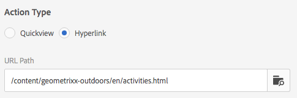

# Uso de selectores en Dynamic Media {#working-with-selectors}

Al trabajar con una imagen interactiva, un vídeo interactivo o un titular de carrusel, selecciona recursos y sitios y productos para los puntos interactivos y los mapas de imagen a los que desea vincularse. Al trabajar con conjuntos de imágenes, conjuntos de giros y conjuntos multimedia, también puede seleccionar recursos con el Selector de recursos.

En este tema se explica cómo utilizar los selectores de productos, sitios y recursos, incluida la capacidad de examinar, filtrar y ordenar dentro de los selectores.

Puede acceder a los selectores al crear conjuntos de carrusel, añadir zonas interactivas y mapas de imagen, y crear vídeos e imágenes interactivos.

Por ejemplo, en este titular de carrusel, puede utilizar el selector de productos si enlaza un punto interactivo o un mapa de imagen a una página de vista rápida. Utilice el selector de sitio si va a vincular un punto interactivo o un mapa de imagen a un hipervínculo; utilice el selector de recursos al crear una diapositiva.

Al seleccionar (en lugar de introducir manualmente) a dónde se dirigen las zonas interactivas o los mapas de imagen, se utiliza el selector. El selector de sitio solamente funciona si usted es cliente de [!DNL Adobe Experience Manager Sites]. El selector de productos también requiere [!DNL Experience Manager Commerce].

## Seleccionar productos en Dynamic Media {#selecting-products}

Utilice el selector de productos para elegir un producto cuando desee un punto interactivo o un mapa de imagen para proporcionar una vista rápida a un producto específico del catálogo de productos.

1. Vaya al conjunto de carrusel, la imagen interactiva o el vídeo interactivo y seleccione la pestaña **[!UICONTROL Acciones]** (solo disponible si ha definido un punto interactivo o un mapa de imagen).

   El selector de productos se encuentra en el área **[!UICONTROL Tipo de acción]**.

   

1. Seleccione el icono **[!UICONTROL Selector de productos]** (lupa) y desplácese hasta un producto del catálogo.

   

   Puede filtrar por palabra clave o etiqueta tocando **[!UICONTROL Filter]** e introduciendo palabras clave, o seleccionando etiquetas, o ambas.

   

   Para cambiar la ubicación en la que [!DNL Experience Manager] busca los datos del producto, puntee en **[!UICONTROL Examinar]** y desplácese a otra carpeta.

   

   Seleccione **[!UICONTROL Ordenar por]** para cambiar si [!DNL Experience Manager] ordena de más reciente a más antiguo o de más antiguo a más reciente.

   

   Seleccione **[!UICONTROL Ver como]** para cambiar la forma en que ve los productos: **[!UICONTROL Vista de lista]** o **[!UICONTROL Vista de tarjeta]**.

   

1. Una vez seleccionado el producto, el campo se rellena con la miniatura y el nombre del producto.

   

1. En el modo **[!UICONTROL Vista previa]**, puede seleccionar el punto interactivo o el mapa de imagen y ver cómo aparece la vista rápida.

   

## Seleccionar sitios en Dynamic Media {#selecting-sites}

Utilice el selector de sitio para elegir una página web cuando desee vincular un punto interactivo o un mapa de imagen a una página web administrada en [!DNL Experience Manager] sitios.

1. Vaya al conjunto de carrusel, la imagen interactiva o el vídeo interactivo y seleccione la pestaña **[!UICONTROL Acciones]** (solo disponible si ha definido un punto interactivo o un mapa de imagen).

   El Selector de sitio se encuentra en el área **[!UICONTROL Tipo de acción]**.

   

1. Seleccione el icono **[!UICONTROL Selector de sitio]** (carpeta con lupa) y navegue a una página de sus sitios de [!DNL Experience Manager] a la que desee vincular el punto interactivo o el mapa de imagen.

   

1. Una vez seleccionado el sitio, el campo se rellena con la ruta.

   

1. En el modo **[!UICONTROL Vista previa]**, si selecciona el punto interactivo o el mapa de imagen, navegará a la página de sitio [!DNL Experience Manager] que haya especificado.

## Selección de recursos en Dynamic Media {#selecting-assets}

Utilice este selector para elegir imágenes para utilizarlas en un titular de carrusel, un vídeo interactivo, conjuntos de imágenes, conjuntos de medios mixtos y conjuntos de giros. En el vídeo interactivo, el selector de recursos está disponible cuando selecciona **[!UICONTROL Seleccionar Assets]** en la pestaña **[!UICONTROL Contenido]**. En los conjuntos de carrusel, el selector de recursos está disponible al crear una diapositiva. En conjuntos de imágenes, conjuntos de medios mixtos y conjuntos de giros, el selector de recursos está disponible al crear un conjunto de imágenes, un conjunto de medios mixtos o un conjunto de giros, respectivamente.

Consulte también [Selector de recursos](/help/assets/search-assets.md#asset-selector) para obtener más información.

1. Vaya al conjunto de carrusel y cree una diapositiva. O bien, vaya al vídeo interactivo, vaya a la pestaña **[!UICONTROL Contenido]** y, a continuación, seleccione los recursos. O bien, cree un conjunto de medios mixtos, un conjunto de imágenes o un conjunto de giros.
1. Seleccione el icono **[!UICONTROL Selector de recursos]** (carpeta con lupa) y desplácese hasta un recurso.

   

   Filtre por palabra clave o etiqueta tocando **[!UICONTROL Filter]** e introduciendo palabras clave, o agregando criterios, o ambas cosas.

   

   Puede cambiar dónde [!DNL Experience Manager] busca los recursos navegando a otra carpeta en el campo **[!UICONTROL Ruta]**.

   Seleccione **[!UICONTROL Colección]** para buscar solamente recursos dentro de las colecciones.

   

   Seleccione **[!UICONTROL Ver como]** para cambiar la forma en que ve los productos: **[!UICONTROL Vista de lista]**, **[!UICONTROL Vista de columna]** o **[!UICONTROL Vista de tarjeta]**.

   

1. Para seleccionar el recurso, seleccione la marca de verificación. Se muestra el recurso.

   
—>
