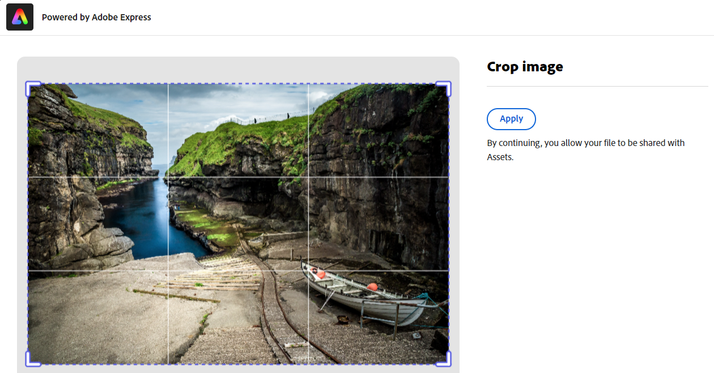

# Edición de imágenes en [!DNL Assets view] {#edit-images-in-assets-view}

La vista de Assets permite la edición básica de imágenes, como el cambio de tamaño, la eliminación de fondo, el recorte y la conversión entre los formatos JPEG y PNG. Además, permite realizar ediciones avanzadas integrándolas con Adobe Express. Después de editar una imagen, puede guardar la nueva como una nueva versión. El uso de versiones le ayuda a volver al recurso original más adelante, si es necesario. Para editar una imagen, [abra su previsualización](https://experienceleague.adobe.com/es/docs/experience-manager-assets-essentials/help/navigate-view#preview-assets) y haga clic en **Editar imagen**.

>[!NOTE]
>
>Puede editar imágenes de tipos de archivo PNG y JPEG mediante [!DNL Adobe Express].

<!--The editing actions that are available are Spot healing, Crop and straighten, Resize image, and Adjust image.-->

## Editar imagen {#edit-image}

Aterrizar en la vista de Assets mediante el vínculo - [Vista de Assets](https://experience.adobe.com/#/assets) y seleccionando el repositorio adecuado. Para obtener acceso, póngase en contacto con el administrador de su organización.
Para cualquier información de referencia adicional, consulte [Introducción a la vista de Adobe Experience Manager Assets](https://experienceleague.adobe.com/en/docs/experience-manager-cloud-service/content/assets/assets-view/get-started-assets-view), [Explicación de la interfaz de usuario de vistas de Assets](https://experienceleague.adobe.com/en/docs/experience-manager-cloud-service/content/assets/assets-view/navigate-assets-view#understand-interface-navigation), y [Casos de uso de vista de Assets](https://experienceleague.adobe.com/en/docs/experience-manager-cloud-service/content/assets/assets-view/get-started-assets-view#use-cases).
<!--
>[!CONTEXTUALHELP]
>id="assets_express_integration"
>title="Adobe Express Integration"
>abstract="Easy and intuitive image-editing tools powered by Adobe Express available directly within AEM Assets to increase content reuse and accelerate content velocity."-->

### Editar imagen en la vista de Assets mediante el Adobe Express {#edit-image-on-assets-view-using-adobe-express}

Después de aterrizar en la vista de Assets, haga clic en **Assets**, seleccione una imagen y haga clic en **Editar** desde el carril superior. La nueva pantalla muestra las opciones de edición disponibles, como cambiar el tamaño, quitar el fondo, realizar recortes y convertir entre los formatos JPEG y PNG.

#### Cambiar tamaño de imagen {#resize-image-using-express}

Cambiar el tamaño de una imagen a un tamaño específico es un caso de uso popular. La vista de Assets le permite cambiar rápidamente el tamaño de las imágenes para adaptarlas a los tamaños de foto comunes, ya que proporciona nuevas resoluciones calculadas previamente para tamaños de foto específicos. Para cambiar el tamaño de la imagen con la vista de Assets, siga los pasos a continuación:

1. Haga clic en **Cambiar tamaño de la imagen** en el panel izquierdo.
1. Seleccione la plataforma de medios sociales adecuada en la lista desplegable Cambiar tamaño y el tamaño de la imagen en las opciones que se muestran.
1. Escale la imagen, si es necesario, utilizando el campo **Escala de imagen**.
1. Haga clic en **[!UICONTROL Aplicar]** para que tengan efecto los cambios.
   

   La imagen editada está disponible para descargar. Puede guardar el recurso editado como una nueva versión del mismo recurso o guardarlo como uno nuevo.
   

#### Quitar fondo {#remove-background-using-express}

Puede quitar el fondo de una imagen siguiendo unos sencillos pasos, tal como se indica a continuación:

1. Haga clic en **Quitar fondo** en el panel izquierdo. Experience Manager Assets muestra la imagen sin fondo.
1. Haga clic en **[!UICONTROL Aplicar]** para que tengan efecto los cambios.
   

   La imagen editada está disponible para descargar. Puede guardar el recurso editado como una nueva versión del mismo recurso o guardarlo como uno nuevo.

#### Recortar imagen {#crop-image-using-express}

Transformar una imagen a un tamaño perfecto es fácil gracias al uso de las acciones rápidas de [!DNL Adobe Express] integradas.

1. Haga clic en **[!UICONTROL Recortar imagen]** en el panel izquierdo.
2. Arrastre los identificadores de las esquinas de la imagen para crear el recorte deseado.
3. Haga clic en **[!UICONTROL Aplicar]**.
   
La imagen recortada está disponible para descargar. Puede guardar el recurso editado como una nueva versión del mismo recurso o guardarlo como uno nuevo.

#### Convertir entre tipos de archivo de imagen {#convert-image-types-using-express}

Puede convertir rápidamente entre los formatos de imagen JPEG y PNG mediante Adobe Express. Ejecute los siguientes pasos:

1. Haga clic en **JPEG a PNG** o **PNG a JPEG** en el panel izquierdo.
   <!---->
1. Haga clic en **[!UICONTROL Descargar]**.

#### Limitaciones {#limitations-adobe-express}

* Resolución de imagen admitida: mínimo de 50 píxeles, máximo de 6000 píxeles por dimensión.

* Tamaño máximo de archivo admitido: 17 MB.

### Edición de imágenes en el editor integrado de Adobe Express {#edit-images-in-adobe-express-embedded-editor}

Los usuarios con derechos de acceso rápido pueden utilizar el editor Express integrado desde la vista de Assets para editar fácilmente el contenido y crear contenido nuevo con GenAI desde el Adobe Firefly. Esto mejora la reutilización de contenidos y acelera su velocidad. También puede utilizar elementos predefinidos para que su recurso tenga un aspecto impresionante o realizar acciones rápidas para editar la imagen con solo unos clics.

Para editar imágenes con [!DNL Adobe Express] editor incrustado, siga los pasos a continuación:

1. Aterrizar en la vista de AEM Assets mediante el vínculo: [Vista de AEM Assets](https://experience.adobe.com/#/assets) y seleccione el repositorio adecuado.
1. Haga clic en **Assets**, introduzca una carpeta y seleccione una imagen.
1. Haga clic en **Abrir en Adobe Express**. La imagen se abre en un lienzo exprés.
1. Realice los cambios necesarios en la imagen.
1. Si el proyecto requiere que se añadan más páginas, haga clic en **Añadir**, seleccione Assets, introduzca una carpeta, seleccione una imagen para llevarla a la página de lienzo y, a continuación, realice los cambios necesarios en la imagen.
1. Para guardar las imágenes, haga clic en **Guardar**. Aparece el cuadro de diálogo para guardar.

   >[!NOTE]
   >
   > **1. Para una sola página**
   >
   > **Guardar como versión:** esta función solo admite guardar un único recurso. Seleccione esta opción para exportar la imagen como una nueva versión (conservando el formato original) y guardarla en la misma carpeta.
   > **Guardar como nuevo recurso:** seleccione esta opción para exportar el recurso en un formato diferente al original y guardarlo en cualquier carpeta como un nuevo recurso.
   >  
   > **2. Para varias páginas**
   >
   > **Guardar como versión:** esta función solo admite guardar un único recurso. Si desea guardar una sola página de varias páginas, seleccione esta opción para guardar el recurso en su formato y ubicación originales.\
   > **Guardar como nuevo recurso:** con esta opción, exporte varios recursos o un único recurso a cualquier carpeta y guárdelos como nuevos recursos con su formato de archivo original o diferente.

1. En el cuadro de diálogo Guardar:
   1. Introduzca un nombre para el archivo en el campo **Guardar como**.
   1. Seleccione una carpeta de destino.
   1. Opcional: proporcione detalles como el nombre del proyecto o de la campaña, palabras clave, canales, lapso de tiempo y región.
1. Haga clic en **Guardar como versión** o **Guardar como nuevo recurso** para guardar los recursos.

#### Limitaciones de la edición de imágenes en Express Editor {#limitations-of-editing-images-in-the-express-editor}

* Tipo de archivo admitido: JPEG o PNG.
* Tamaño máximo de archivo admitido: 40 MB.
* Rango de anchura y altura admitido: entre 50 y 8000 píxeles.
* Vuelva a cargar la página para ver el nuevo recurso guardado más reciente en la carpeta de origen.

### Creación de nuevos recursos mediante Adobe Express {#create-new-embedded-editor}

[!DNL Assets view] permite crear una nueva plantilla desde cero utilizando el editor integrado de [!DNL Adobe Express]. Para crear un nuevo recurso con [!DNL Adobe Express], ejecute los pasos siguientes:

1. Vaya a **[!UICONTROL Mi Workspace]** y haga clic en **[!UICONTROL Crear]** dentro del titular del Adobe Express que se muestra en la parte superior. El lienzo blanco de [!DNL Adobe Express] se muestra dentro de la interfaz de usuario de [!DNL Assets view].
1. Cree su contenido mediante [Plantillas](https://helpx.adobe.com/es/express/using/work-with-templates.html). En caso contrario, vaya a **[!UICONTROL Sus cosas]** para modificar el contenido existente.
1. Una vez completada la edición, haga clic en **[!UICONTROL Guardar]**.
1. Especifique la ruta de destino del recurso creado y haga clic en **[!UICONTROL Guardar como nuevo recurso]**.

#### Limitaciones {#limitations}

* Solo puede modificar imágenes de los tipos de formato `JPEG` y `PNG`.
* El tamaño del recurso debe ser inferior a 40 MB.
* Puede guardar una imagen en los formatos `PDF`, `JPEG` o `PNG`.

<!--
## Edit images using [!DNL Adobe Photoshop Express] {#edit-using-photoshop-express}

<!--
After editing an image, you can save the new image as a new version. Versioning helps you to revert to the original asset later, if needed. To edit an image, [open its preview](navigate-assets-view.md#preview-assets) and click **[!UICONTROL Edit Image]**  from the rail on the right.

*Figure: The options to edit images are powered by [!DNL Adobe Photoshop Express].*
-->
<!--
### Touch up images {#spot-heal-images-using-photoshop-express}

If there are minor spots or small objects on an image, you can edit and remove the spots using the spot healing feature provided by Adobe Photoshop.

The brush samples the retouched area and makes the repaired pixels blend seamlessly into the rest of the image. Use a brush size that is only slightly larger than the spot you want to fix.

<!-- 
TBD: See if we should give backlinks to PS docs for these concepts.
For more information about how Spot Healing works in Photoshop, see [retouching and repairing photos](https://helpx.adobe.com/photoshop/using/retouching-repairing-images.html). 
-->
<!-- 
### Crop and straighten images {#crop-straighten-images-using-photoshop-express}

Using the crop and straighten option that you can do basic cropping, rotate image, flip it horizontally or vertically, and crop it to dimensions suitable for popular social media websites.

To save your edits, click **[!UICONTROL Crop Image]**. After editing, you can save the new image as a version.

Many default options let you crop your image to the best proportions that fit various social media profiles and posts.

### Resize image {#resize-image-using-photoshop-express}

You can view the common photo sizes in centimeters or inches to know the dimensions. By default, the resizing method retains the aspect ratio. To manually override the aspect ratio, click .

Enter the dimensions and click **[!UICONTROL Resize Image]** to resize the image. Before you save the changes as a version, you can either undo all the changes done before saving by clicking [!UICONTROL Undo] or you can change the specific step in the editing process by clicking [!UICONTROL Revert].

### Adjust image {#adjust-image-using-photoshop-express}

[!DNL Assets view] lets you adjust the color, tone, contrast, and more, with just a few clicks. Click **[!UICONTROL Adjust image]** in the edit window. The following options are available in the right sidebar:

* **Popular**: [!UICONTROL High Contrast & Detail], [!UICONTROL Desaturated Contrast], [!UICONTROL Aged Photo], [!UICONTROL B&W Soft], and [!UICONTROL B&W Sepia Tone].
* **Color**: [!UICONTROL Natural], [!UICONTROL Bright], [!UICONTROL High Contrast], [!UICONTROL High Contrast & Detail], [!UICONTROL Vivid], and [!UICONTROL Matte].
* **Creative**: [!UICONTROL Desaturated Contrast], [!UICONTROL Cool Light], [!UICONTROL Turquoise & Red], [!UICONTROL Soft Mist], [!UICONTROL Vintage Instant], [!UICONTROL Warm Contrast], [!UICONTROL Flat & Green], [!UICONTROL Red Lift Matte], [!UICONTROL Warm Shadows], and [!UICONTROL Aged Photo].
* **B&W**: [!UICONTROL B&W Landscape], [!UICONTROL B&W High Contrast], [!UICONTROL B&W Punch], [!UICONTROL B&W Low Contrast], [!UICONTROL B&W Flat], [!UICONTROL B&W Soft], [!UICONTROL B&W Infrared], [!UICONTROL B&W Selenium Tone], [!UICONTROL B&W Sepia Tone], and [!UICONTROL B&W Split Tone].
* **Vignetting**: [!UICONTROL None], [!UICONTROL Light], [!UICONTROL Medium], and [!UICONTROL Heavy].

<!--
TBD: Insert a video of the available social media options.
-->

### Siguientes pasos {#next-steps}

* Proporcione comentarios sobre productos usando [!UICONTROL Comentarios] opción disponible en la interfaz de usuario de la vista Assets.

* Facilite comentarios sobre la documentación usando [!UICONTROL Editar esta página]  o [!UICONTROL Registrar un problema] , disponibles en la barra lateral derecha.

* Contacto con el [Servicio de atención al cliente](https://experienceleague.adobe.com/?support-solution=General#support)

>[!MORELIKETHIS]
>
>* [Acciones rápidas en el Adobe Express](https://helpx.adobe.com/in/express/using/resize-image.html)
>* [Visualización del historial de versiones de un recurso](navigate-assets-view.md)
