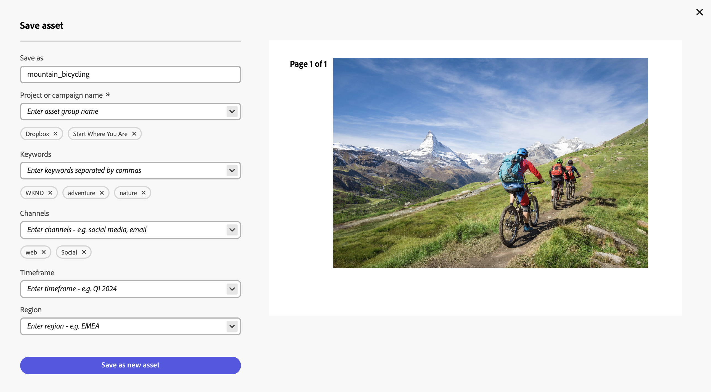

# Edición de imágenes en Content Hub {#edit-images-content-hub}

<table>
    <tr>
        <td>
            <i>Nuevo</i> <a href="/help/assets/dynamic-media/dm-prime-ultimate.md"><b>Dynamic Media Prime y Ultimate</b></a>
        </td>
        <td>
            <i>Nuevo</i> <a href="/help/assets/assets-ultimate-overview.md"><b>AEM Assets Ultimate</b></a>
        </td>
        <td>
            <i>Nueva</i> integración de <a href="/help/assets/integrate-aem-assets-edge-delivery-services.md"><b>AEM Assets con Edge Delivery Services</b></a>
        </td>
        <td>
            <i>Nueva</i> <a href="/help/assets/aem-assets-view-ui-extensibility.md"><b>extensibilidad de la interfaz de usuario</b></a>
        </td>
          <td>
            <i>Nuevo</i> <a href="/help/assets/dynamic-media/enable-dynamic-media-prime-and-ultimate.md"><b>Habilitar Dynamic Media Prime y Ultimate</b></a>
        </td>
    </tr>
    <tr>
        <td>
            <a href="/help/assets/search-best-practices.md"><b>Prácticas recomendadas de búsqueda</b></a>
        </td>
        <td>
            <a href="/help/assets/metadata-best-practices.md"><b>Prácticas recomendadas de metadatos</b></a>
        </td>
        <td>
            <a href="/help/assets/product-overview.md"><b>Centro de contenido</b></a>
        </td>
        <td>
            <a href="/help/assets/dynamic-media-open-apis-overview.md"><b>Dynamic Media con funciones de OpenAPI</b></a>
        </td>
        <td>
            <a href="https://developer.adobe.com/experience-cloud/experience-manager-apis/"><b>Documentación de desarrollador de AEM Assets</b></a>
        </td>
    </tr>
</table>

>[!AVAILABILITY]
>
>La guía del centro de contenido ya está disponible en formato de PDF. Descargue la guía completa y utilice el Asistente de IA de Adobe Acrobat para responder sus consultas.
>
>[!BADGE Guía del centro de contenido en PDF]{type=Informative url="https://helpx.adobe.com/content/dam/help/en/experience-manager/aem-assets/content-hub.pdf"}

Content Hub le permite crear contenido nuevo con Adobe Express. Puede editar el contenido existente con herramientas fáciles de usar, producir variaciones alineadas con la marca con plantillas y elementos de marca, y crear contenido nuevo con las últimas funciones de IA generativa de Adobe Firefly.

## Requisitos previos {#prereqs-edit-image-content-hub}

Los derechos para acceder a Adobe Express y [usuarios de Content Hub con derechos para remezclar recursos con nuevas variaciones](/help/assets/deploy-content-hub.md#onboard-content-hub-users-remix-assets) pueden editar imágenes mediante Content Hub.

>[!NOTE]
>
>Puede editar imágenes de tipos de archivos PNG y JPG/JPEG usando [!DNL Adobe Express].

## Edición de imágenes mediante [!DNL Adobe Express] {#edit-images-using-content-hub}

Para editar imágenes con Content Hub:

1. Haga clic en **[!DNL Open in Adobe Express]**, disponible en la tarjeta de recursos de la imagen que debe editar. También puede hacer clic en la imagen para abrir sus detalles y, a continuación, hacer clic en el logotipo de [!DNL Adobe Express]. A continuación, el editor incrustado de Adobe Express se carga sin salir de Content Hub.

   Puede aprovechar la funcionalidad [!DNL Adobe Express] para realizar todas las acciones relacionadas con la edición de imágenes, como [cambiar el tamaño de la imagen](https://helpx.adobe.com/express/using/resize-image.html), [quitar o cambiar el color de fondo](https://helpx.adobe.com/express/using/remove-background.html), [recortar imagen](https://helpx.adobe.com/express/using/crop-image.html), combinar la imagen con la imagen o el texto generados por IA y mucho más.

1. Realice las modificaciones y haga clic en **[!UICONTROL Guardar]** para guardar el recurso editado en cualquiera de los tipos de formato:

   * **[!UICONTROL PNG]** (se usa como formato de imagen de buena calidad)
   * **[!UICONTROL JPG]** (adecuado para archivos pequeños)
   * **[!UICONTROL PDF]** (adecuado para documentos)

   

1. Especifique un nombre para el recurso en el campo **[!UICONTROL Guardar como]**.

1. Especifique el nombre de la campaña del recurso mediante el campo **[!UICONTROL Nombre de campaña]**. Puede utilizar un nombre existente o crear uno nuevo. Content Hub proporciona más opciones a medida que escribe el nombre. <!--You can define multiple Campaign names for your upload. While you are typing a name, either click anywhere else within the dialog box or press the `,` (Comma) key to register the name.-->

   Como práctica recomendada, Adobe recomienda especificar valores en el resto de los campos, así como crear una experiencia de búsqueda mejorada para los recursos cargados.

1. [Opcional] Defina valores para los campos **[!UICONTROL Palabras clave]**, **[!UICONTROL Canales]**, **[!UICONTROL Periodo de tiempo]** y **[!UICONTROL Región]**. El etiquetado y la agrupación de recursos por palabras clave, canales y ubicación permite a todas las personas que utilicen el contenido aprobado de la empresa encontrar estos recursos y mantenerlos organizados.

1. Haga clic en **[!UICONTROL Guardar como nuevo recurso]** para guardar el recurso.

Los administradores también pueden configurar los campos obligatorios y opcionales que se muestran al agregar recursos a Content Hub, como Nombre de campaña, Palabras clave, Canales, etc. Para obtener más información, consulte [Configuración de la interfaz de usuario de Content Hub](configure-content-hub-ui-options.md#configure-upload-options-content-hub).
