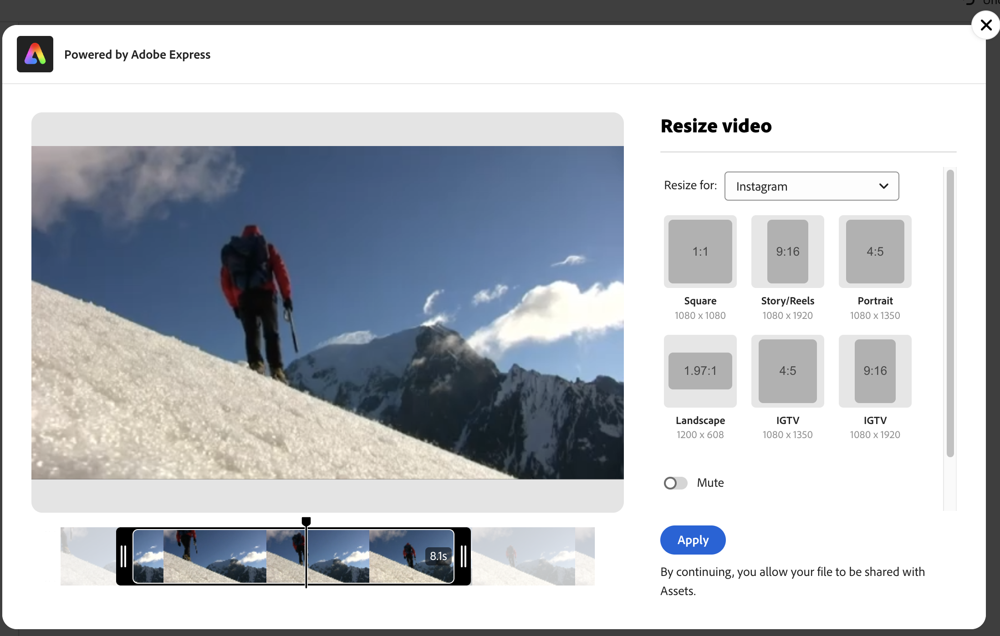

# Editar vídeos en [!DNL Assets view] {#edit-videos}

Crear variaciones de contenido de vídeo es fácil para los usuarios de Assets con las acciones rápidas [!DNL Adobe Express] incrustadas para el vídeo. Acciones rápidas en [!DNL Assets view] con tecnología [!DNL Adobe Express] proporciona opciones de edición de vídeo fáciles de usar, como recortar vídeo, cambiar el tamaño del vídeo, recortar vídeo y convertirlo a GIF.

Para editar un video, ve a los detalles del video y haz clic en [!UICONTROL Editar video]. También puede seleccionar el recurso, hacer clic en los detalles y, a continuación, hacer clic en el icono  disponible en el panel derecho. Después de editar un vídeo, puede guardarlo como una nueva versión o como un nuevo recurso.

## Requisitos previos {#prerequisites}

Derechos para acceder a [!DNL Adobe Express] y al menos a un entorno dentro de los AEM Assets. El entorno puede ser cualquiera de los repositorios de [!DNL Assets as a Cloud Service] o [!DNL Assets view].

## Edición de imágenes mediante Adobe Express {#edit-video-using-express}

Transformar un vídeo en un tamaño y orientación perfectos es fácil mediante [!DNL Adobe Express] acciones rápidas incrustadas.

### Recortar vídeo {#crop-video-using-express}

Puede eliminar partes no deseadas del vídeo mediante [!DNL Adobe Express] acciones rápidas incrustadas. Para ello, ejecute los pasos a continuación:

1. Seleccione un vídeo y haga clic en **[!UICONTROL Editar]**.
2. Haga clic en **[!UICONTROL Recortar vídeo]** en las acciones rápidas disponibles en el panel izquierdo.
3. Arrastre los controladores de las esquinas del vídeo para crear el recorte deseado; o elija entre los tamaños de pantalla existentes según desee.
4. Puede optar por silenciar o reactivar el vídeo.
5. Haga clic en **[!UICONTROL Aplicar]**.
   

   El vídeo recortado está disponible para descargar. Puede guardar el recurso editado como una nueva versión del mismo recurso o guardarlo como un nuevo recurso. 

### Cambiar tamaño de vídeo {#resize-video-using-express}

El contenido final de vídeo en DAM suele necesitar un cambio de tamaño para su distribución en canales específicos. [!DNL Assets view] le permite cambiar fácilmente el tamaño del vídeo para adaptarlo a las dimensiones que requieren los canales sociales comunes y también puede cambiar el tamaño para adaptarlo a las resoluciones personalizadas. Para cambiar el tamaño del vídeo mediante [!DNL Assets view], ejecute los pasos siguientes:

1. Seleccione un vídeo y haga clic en **[!UICONTROL Editar]**.
2. Haga clic en **[!UICONTROL Cambiar tamaño del vídeo]** en las acciones rápidas disponibles en el panel izquierdo.
3. Seleccione las dimensiones adecuadas en la plataforma de medios sociales bajo **[!UICONTROL Cambiar tamaño para la lista desplegable]**. También puede arrastrar los controladores de las esquinas del vídeo para crear el recorte deseado.
4. Escale el vídeo, si es necesario, mediante el campo **[!UICONTROL Escala de vídeo]**.
5. Puede optar por silenciar o reactivar el vídeo.
6. Haga clic en **[!UICONTROL Aplicar]** para que tengan efecto los cambios.
   

El vídeo que ha cambiado de tamaño está disponible para descargar. Puede guardar el recurso editado como una nueva versión del mismo recurso o guardarlo como uno nuevo.

### Recortar vídeo {#trim-video-using-express}

Si necesita utilizar un clip de un vídeo de mayor tamaño, puede utilizar la función **[!UICONTROL Recortar vídeo]** para seleccionar y recortar una sección del vídeo. Siga estos pasos:

1. Seleccione un vídeo y haga clic en **[!UICONTROL Editar]**.
2. Haga clic en **[!UICONTROL Recortar vídeo]** en las acciones rápidas disponibles en el panel izquierdo.
3. Especifique la hora de inicio y finalización del vídeo para recortar una parte concreta. También puede arrastrar los controladores de las esquinas del vídeo para crear el recorte deseado.
4. Seleccione las dimensiones adecuadas en la lista desplegable **[!UICONTROL Tamaño]**.
5. Puede optar por silenciar o reactivar el vídeo.
6. Haga clic en **[!UICONTROL Aplicar]** para que tengan efecto los cambios.
   

El vídeo recortado está disponible para descargar. Puede guardar el recurso editado como una nueva versión del mismo recurso o guardarlo como uno nuevo.

### Convertir vídeo a GIF {#convert-mp4-to-gif-using-express}

Puede convertir rápidamente un vídeo MP4 a un formato GIF con Adobe Express. Ejecute los siguientes pasos:

1. Seleccione un vídeo y haga clic en **[!UICONTROL Editar]**.
2. Haga clic en **[!UICONTROL Convertir a GIF]** en las acciones rápidas disponibles en el panel izquierdo.
3. Seleccione el tamaño de archivo adecuado en función de la calidad deseada. Además, elija la orientación horizontal, vertical o cuadrada.
4. Arrastre los controladores de las esquinas del vídeo para crear el recorte deseado.
5. Haga clic en **[!UICONTROL Aplicar]**.

   

El vídeo está disponible en formato GIF para su descarga. Puede guardar el recurso editado como una nueva versión del mismo recurso o guardarlo como uno nuevo.

## Limitaciones {#limitations-video-adobe-express}

* Solo se admiten vídeos en formato MP4 para su edición.

* El tamaño máximo de archivo de origen admitido es de 1 GB.

* Los vídeos compatibles tienen más de 46 píxeles y menos de 3840 píxeles en cualquier lado.

* Los exploradores web admitidos son Google Chrome, Firefox, Safari y Edge.

* La funcionalidad no se puede abrir en un modo incógnito de un explorador web.

### Siguientes pasos {#next-steps}

* Proporcione comentarios sobre el producto mediante la opción [!UICONTROL Comentarios] disponible en la interfaz de usuario de la vista Assets.

* Facilite comentarios sobre la documentación usando [!UICONTROL Editar esta página]  o [!UICONTROL Registrar un problema] , disponibles en la barra lateral derecha.

* Contacte con el [Servicio de atención al cliente](https://experienceleague.adobe.com/es?support-solution=General#support).

>[!MORELIKETHIS]
>
>* [Editar imágenes en la vista de Assets](edit-images-assets-view.md)
>* [Vista previa de un recurso](navigate-assets-view.md)
