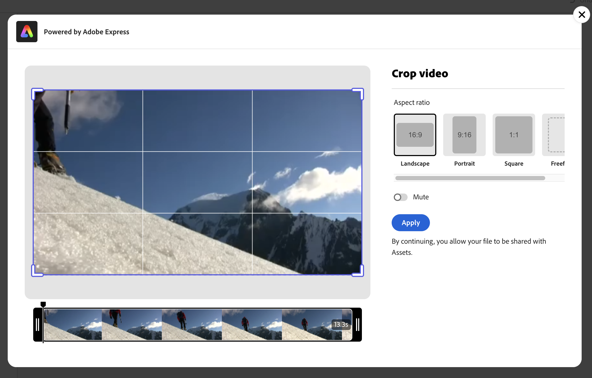
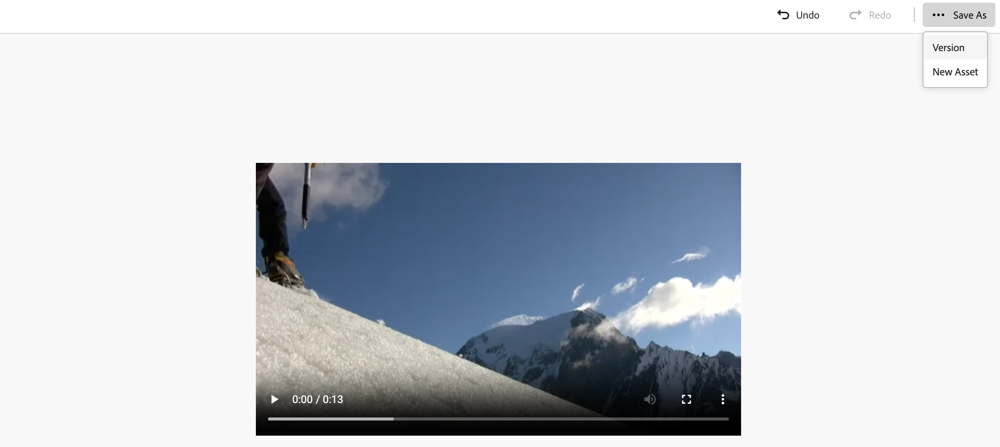

# Edición de vídeos en [!DNL Assets view] {#edit-videos}

Crear variaciones de contenido de vídeo es fácil para los usuarios de Assets con las acciones rápidas de [!DNL Adobe Express] incrustadas para el vídeo. Las acciones rápidas en [!DNL Assets view] con tecnología de [!DNL Adobe Express] ofrecen opciones de edición de vídeo fáciles de usar, como por ejemplo, recortar, cambiar el tamaño, ajustar y convertir vídeos a GIF.

Para editar un video, vaya a los detalles del video y haga clic en [!UICONTROL Editar video]. También puede seleccionar el recurso, hacer clic en los detalles y, a continuación, hacer clic en el icono  disponible en el panel derecho. Después de editar un vídeo, puede guardarlo como una nueva versión o como un nuevo recurso.

## Requisitos previos {#prerequisites}

Los derechos de acceso a [!DNL Adobe Express] son obligatorios y debe haber al menos un entorno dentro de AEM Assets. El entorno puede ser cualquiera de los repositorios de [!DNL Assets as a Cloud Service] o [!DNL Assets view].

## Edición de imágenes mediante Adobe Express {#edit-video-using-express}

Transformar un vídeo a un tamaño perfecto es fácil gracias al uso de las acciones rápidas de integradas de [!DNL Adobe Express].

### Recortar vídeo {#crop-video-using-express}

Puede eliminar partes no deseadas del vídeo mediante las acciones rápidas de [!DNL Adobe Express] incrustadas. Para ello, ejecute los siguientes pasos:

1. Seleccione un vídeo y haga clic en **[!UICONTROL Editar]**.
2. Haga clic en **[!UICONTROL Recortar vídeo]** en el panel izquierdo.
3. Arrastre los controladores en las esquinas del vídeo para crear el recorte deseado o bien elija los tamaños de pantalla existentes según desee.
4. Puede optar por silenciar o reactivar el vídeo.
5. Haga clic en **[!UICONTROL Aplicar]**.
   

   El vídeo recortado está disponible para su descarga. Puede guardar el recurso editado como una nueva versión del mismo recurso o guardarlo como uno nuevo. 

### Cambiar tamaño de vídeo {#resize-video-using-express}

El contenido de vídeo final en DAM suele necesitar un cambio de tamaño para su distribución en canales específicos. [!DNL Assets view] le permite cambiar fácilmente el tamaño del vídeo para adaptarlo a las dimensiones que requieren las redes sociales habituales y también puede cambiar el tamaño para adaptarlo a las resoluciones personalizadas. Para cambiar el tamaño del vídeo mediante [!DNL Assets view], ejecute los pasos siguientes:

1. Seleccione un vídeo y haga clic en **[!UICONTROL Editar]**.
2. Haga clic en **[!UICONTROL Cambiar tamaño del vídeo]** en el panel izquierdo.
3. Seleccione las dimensiones apropiadas en la plataforma de redes sociales en la lista desplegable **[!UICONTROL Cambiar tamaño]**. O bien, arrastre los controladores en las esquinas del vídeo para crear el recorte deseado.
4. Escale el vídeo, si es necesario, utilizando el campo **[!UICONTROL Escala de vídeo]**.
5. Puede optar por silenciar o reactivar el vídeo.
6. Haga clic en **[!UICONTROL Aplicar]** para que tengan efecto los cambios.
   

El vídeo cuyo tamaño ha cambiado está disponible para su descarga. Puede guardar el recurso editado como una nueva versión del mismo recurso o guardarlo como uno nuevo.

### Ajustar vídeo {#trim-video-using-express}

Si necesita utilizar un clip de un vídeo de mayor tamaño, puede utilizar la función **[!UICONTROL Recortar vídeo]** para seleccionar y recortar una sección del vídeo. Ejecute estos pasos:

1. Seleccione un vídeo y haga clic en **[!UICONTROL Editar]**.
2. Haga clic en **[!UICONTROL Ajustar vídeo]** en las acciones rápidas disponibles en el panel izquierdo.
3. Especifique la hora de inicio y finalización del vídeo para ajustar una parte determinada. Arrastre los controladores en las esquinas del vídeo para crear el ajuste deseado.
4. Seleccione las dimensiones adecuadas en la lista desplegable **[!UICONTROL Tamaño]**.
5. Puede optar por silenciar o reactivar el vídeo.
6. Haga clic en **[!UICONTROL Aplicar]** para que tengan efecto los cambios.
   

El vídeo ajustado está disponible para su descarga. Puede guardar el recurso editado como una nueva versión del mismo recurso o guardarlo como uno nuevo.

### Convertir vídeo a GIF {#convert-mp4-to-gif-using-express}

Puede convertir rápidamente un vídeo MP4 a un formato GIF con Adobe Express. Ejecute los siguientes pasos:

1. Seleccione un vídeo y haga clic en **[!UICONTROL Editar]**.
2. Haga clic en **[!UICONTROL Convertir a GIF]** en las acciones rápidas disponibles en el panel izquierdo.
3. Seleccione el tamaño de archivo adecuado en función de la calidad deseada. Además, elija la orientación horizontal, vertical o cuadrada.
4. Arrastre los controladores en las esquinas del vídeo para crear el recorte deseado.
5. Haga clic en **[!UICONTROL Aplicar]**.

   

El vídeo está disponible en formato GIF para su descarga. Puede guardar el recurso editado como una nueva versión del mismo recurso o guardarlo como uno nuevo.

## Limitaciones {#limitations-video-adobe-express}

* Solo se admiten vídeos en formato MP4 para su edición.

* El tamaño máximo de archivo de origen compatible es de 1 GB.

* Los vídeos compatibles tienen más de 46 píxeles y menos de 3840 píxeles en cualquier lado.

* Los exploradores web compatibles son Google Chrome, Firefox, Safari y Edge.

* La funcionalidad no se puede abrir en un modo incógnito en un explorador web.

### Próximos pasos {#next-steps}

* Proporcione comentarios sobre el producto mediante la opción [!UICONTROL Comentarios] disponible en la interfaz de usuario de la vista Assets.

* Facilite comentarios sobre la documentación usando [!UICONTROL Editar esta página]  o [!UICONTROL Registrar un problema] , disponibles en la barra lateral derecha.

* Contacte con el [Servicio de atención al cliente](https://experienceleague.adobe.com/es/home?support-solution=General#support).

>[!MORELIKETHIS]
>
>* [Editar imágenes en la vista de Assets](edit-images-assets-view.md)
>* [Vista previa de un recurso](navigate-assets-view.md)

**Consulte también**

* [Traducir recursos](/help/assets/translate-assets.md)
* [API HTTP de recursos](/help/assets/mac-api-assets.md)
* [Formatos de archivo compatibles con recursos](/help/assets/file-format-support.md)
* [Buscar recursos](/help/assets/search-assets.md)
* [Recursos de red](/help/assets/use-assets-across-connected-assets-instances.md)
* [Informes de recurso](/help/assets/asset-reports.md)
* [Esquemas de metadatos](/help/assets/metadata-schemas.md)
* [Descarga de recursos](/help/assets/download-assets-from-aem.md)
* [Administración de metadatos](/help/assets/manage-metadata.md)
* [Administración de plantillas de Dynamic Media](/help/assets/dynamic-media/manage-dynamic-media-templates.md)
* [Administrar informes](/help/assets/manage-reports-assets-view.md)
* [Facetas de búsqueda](/help/assets/search-facets.md)
* [Administrar colecciones](/help/assets/manage-collections.md)
* [Importación masiva de metadatos](/help/assets/metadata-import-export.md)
* [Publicación de recursos en AEM y Dynamic Media](/help/assets/publish-assets-to-aem-and-dm.md)

