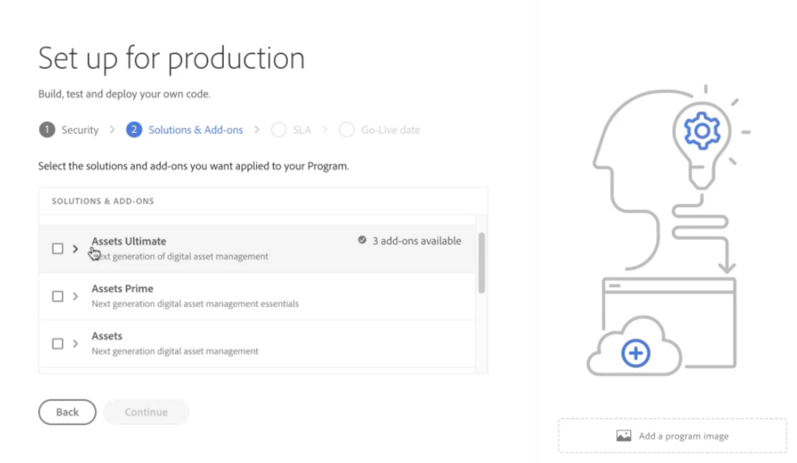
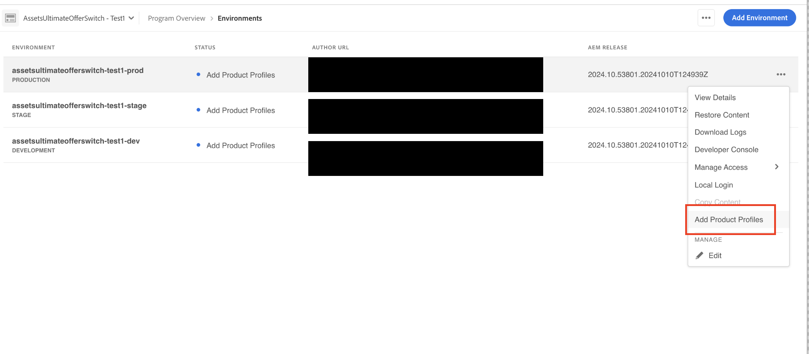
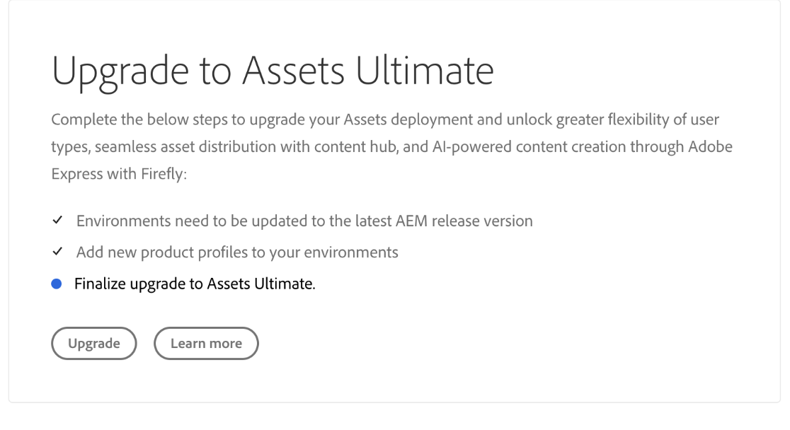
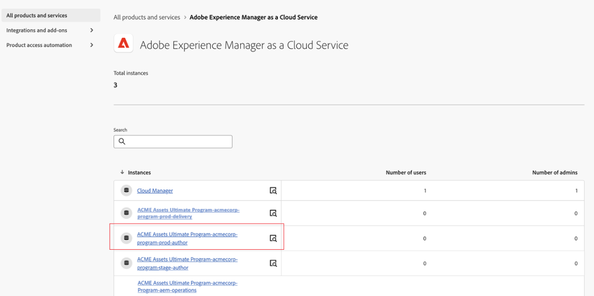

# Habilitar [!DNL Assets] as a Cloud Service Ultimate {#enable-assets-cloud-service-ultimate}

Assets as a Cloud Service Ultimate le permite realizar varias funciones clave de DAM, como administración de recursos y servicios de biblioteca, administración de seguridad y derechos, conexiones de Creative y Experience Cloud, extensibilidad de la interfaz de usuario, automatización impulsada por API, integraciones con aplicaciones de Adobe y que no sean de Adobe, implementación de código personalizado y mucho más. Consulte [Información general sobre Assets as a Cloud Service Ultimate](/help/assets/assets-ultimate-overview.md) para obtener la lista completa.

## Habilitar Assets Ultimate {#enable-assets-ultimate}

Los nuevos clientes de Assets as a Cloud Service primero deben habilitar Assets Ultimate creando un nuevo programa con Cloud Manager.

Ejecute los siguientes pasos:

1. Inicie sesión en Cloud Manager como administrador del sistema. Asegúrese de seleccionar la organización correcta al iniciar sesión.

   >[!NOTE]
   >
   >Asegúrese de que está añadido al perfil de producto de Cloud Manager correspondiente para añadir un nuevo programa. Para obtener más información, consulte [Permisos basados en roles en Cloud Manager](/help/onboarding/cloud-manager-introduction.md#role-based-permissions).

1. [Cree un nuevo programa](/help/journey-onboarding/create-program.md) y [agréguele entornos](/help/journey-onboarding//create-environments.md).

   Al crear el nuevo programa, en la ficha **[!UICONTROL Soluciones y complementos]**, seleccione **[!UICONTROL Assets Ultimate]**. También puede expandir **[!UICONTROL Assets Ultimate]** y seleccionar **[!UICONTROL Content Hub]** para habilitar [Content Hub](/help/assets/product-overview.md) para la distribución de recursos.

   

1. Haga clic en **[!UICONTROL Crear]** para crear el programa. Assets Ultimate ahora está habilitado para Experience Manager Assets as a Cloud Service.

El administrador del sistema tiene automáticamente derecho como administrador de AEM en Assets Ultimate y recibe un correo electrónico para navegar a Admin Console y administrar los perfiles de producto disponibles.

La instancia de AEM as a Cloud Service en Admin Console consta de los siguientes perfiles de producto:

* Administradores de AEM

* Usuarios de AEM

* [Usuarios colaboradores de AEM Assets](#onboard-collaborator-users)

* [Usuarios avanzados de AEM Assets](#onboard-power-users)

  

Si ha habilitado Content Hub para Assets as a Cloud Service, hay una nueva instancia creada dentro de AEM Assets as a Cloud Service en Admin Console con `delivery` como sufijo:

>[!NOTE]
>
>Si ha aprovisionado Content Hub antes del 14 de agosto de 2024, la nueva instancia se creará con `contenthub` como sufijo.

Tenga en cuenta que no hay `author` ni `publish` en el nombre de instancia de Content Hub.

Haga clic en el nombre de la instancia para ver el perfil de producto de Content Hub `AEM Assets Limited Users`.

Puede empezar a añadir usuarios o grupos de usuarios a este perfil de producto para proporcionarles acceso a Content Hub.

>[!NOTE]
>
>Si ha aprovisionado Content Hub antes del 14 de agosto de 2024, el perfil de producto de Content Hub tiene `contenthub` mencionado después de `Limited Users` en lugar de `delivery`.

## Habilitar Assets Ultimate para clientes existentes {#enable-assets-ultimate-existing-customers}

Los clientes existentes de Assets as a Cloud Service pueden actualizar a Assets Ultimate ejecutando dos sencillos pasos. Puede navegar al programa Assets as a Cloud Service en Cloud Manager y ver el estado de actualización en la tarjeta de programa en función de la disponibilidad de los créditos de Assets Ultimate. Si hay suficientes créditos disponibles para actualizar a Assets Ultimate, puede ver el estado como `Assets license upgrade required`, como se muestra en la siguiente imagen:

Si un cliente existente compra una nueva licencia para Assets Ultimate, el estado de actualización se muestra como `Assets license upgrade available`.

### Requisitos previos para la actualización {#prerequisites-assets-upgrade}

Todos los entornos deben actualizarse a la última versión de AEM as a Cloud Service o a un mínimo de `2024.10.18175`. Si no cumple los requisitos mínimos, póngase en contacto con su representante de Adobe para cambiar a la versión de AEM requerida.

### Actualizar a Assets Ultimate {#upgrade-assets-ultimate}

Ejecute los siguientes pasos:

1. Después de cambiar a los requisitos mínimos de la versión de AEM, haga clic en el nombre del programa. Se muestra una tarjeta de actualización justo encima de la sección **[!UICONTROL Entornos]**, como se muestra en la siguiente imagen:

   

1. Haga clic en **[!UICONTROL Agregar perfiles de producto]**. Cloud Manager muestra las opciones para agregar nuevos perfiles de producto a todos los entornos disponibles en el programa o en entornos individuales.

   

1. Haga clic en **[!UICONTROL Todos los entornos]** para agregar los nuevos perfiles de producto a todos los entornos del programa o en **[!UICONTROL Entornos individuales]** para agregar los nuevos perfiles de producto a los entornos seleccionados.

   Al hacer clic en **[!UICONTROL Entornos individuales]**, se muestra la lista de todos los entornos disponibles en el programa.

1. Haga clic en el icono de Más opciones correspondiente a un entorno y seleccione **[!UICONTROL Agregar perfiles de producto]** para agregar los nuevos perfiles de producto al entorno seleccionado.

   

   También puede agregar perfiles de producto a entornos seleccionados si navega hasta la sección **[!UICONTROL Entornos]**, hace clic en el icono Más opciones correspondiente a un entorno y selecciona **[!UICONTROL Agregar perfiles de producto]**.

   El estado del entorno muestra `Adding Product Profiles` mientras se agregan los nuevos perfiles de producto y, posteriormente, muestra `Running` cuando se completa el proceso.

   Debe agregar perfiles de producto a todos los entornos disponibles en el programa, individualmente o en todos los entornos juntos, antes de ejecutar el siguiente paso.

1. Haga clic en **[!UICONTROL Actualizar]**. La opción **[!UICONTROL Actualizar]** solo se muestra cuando agrega perfiles de producto a todos los entornos disponibles.

   

   El proceso de actualización ha finalizado y ha actualizado correctamente su Assets as a Cloud Service a Assets Ultimate. El estado del programa muestra `Assets Ultimate`.

   

La instancia de AEM as a Cloud Service en Admin Console ahora incluye los siguientes perfiles de producto:

* Administradores de AEM

* Usuarios de AEM

* [Usuarios colaboradores de AEM Assets](#onboard-collaborator-users)

* [Usuarios avanzados de AEM Assets](#onboard-power-users)

Si necesita habilitar Content Hub, haga clic en Más opciones (...) en el nombre del programa en Cloud Manager y seleccione **[!UICONTROL Editar programa]**. Expanda **[!UICONTROL Assets Ultimate]** y haga clic en **[!UICONTROL Content Hub]**. Este paso habilita Content Hub para Assets Ultimate. Se ha creado una nueva instancia en AEM Assets as a Cloud Service en Admin Console con `delivery` como sufijo:

>[!NOTE]
>
>Si ha aprovisionado Content Hub antes del 14 de agosto de 2024, la nueva instancia se creará con `contenthub` como sufijo.

Tenga en cuenta que no hay `author` ni `publish` en el nombre de instancia de Content Hub.

Haga clic en el nombre de la instancia para ver el perfil de producto de Content Hub `AEM Assets Limited Users`.

Puede empezar a añadir usuarios o grupos de usuarios a este perfil de producto para proporcionarles acceso a Content Hub.

>[!NOTE]
>
>Si ha aprovisionado Content Hub antes del 14 de agosto de 2024, el perfil de producto de Content Hub tiene `contenthub` mencionado después de `Limited Users` en lugar de `delivery`.

## Incorporación de usuarios de AEM Assets Collaborator {#onboard-collaborator-users}

AEM Assets Los usuarios de Collaborator pueden trabajar con recursos de Experience Manager mediante integraciones de Assets disponibles para su organización en otros productos de Adobe y aplicaciones que no sean de Adobe, crear y editar recursos mediante Adobe Express y Firefly integrados aprovechando las plantillas, los kits de marca, los recursos de Adobe Stock, etc. de diseño profesional, y acceder a los recursos aprobados de su organización y aprovecharlos mediante el portal de AEM Assets Content Hub.

Para incorporar usuarios de Collaborator:

1. Para acceder a los perfiles de producto de Experience Manager Assets, haga clic en el nombre del producto de AEM as a Cloud Service en la lista de productos en Admin Console.

1. Haga clic en la instancia de autor de producción para AEM as a Cloud Service:
   

1. Haga clic en el perfil de producto Usuarios de Collaborators y luego en **[!UICONTROL Agregar usuarios]** para agregar usuarios o grupos de usuarios al perfil de producto.
   

1. Haga clic en **[!UICONTROL Guardar]** para guardar los cambios.

También puede acceder y ver los servicios asignados a los usuarios de Collaborator, como se muestra en la siguiente imagen:

Los servicios `Adobe Express` y `AEM Assets Collaborator Users` están habilitados de manera predeterminada.

>[!NOTE]
>
>Puede desactivar y activar la opción para habilitar o deshabilitar los servicios disponibles, según sus necesidades; sin embargo, Adobe recomienda utilizar los servicios predeterminados habilitados para los perfiles de producto.

## AEM Assets integrados Usuarios avanzados {#onboard-power-users}

AEM Assets Los usuarios avanzados pueden acceder a todas las funciones de los AEM Assets, incluida la administración de recursos, permisos, metadatos, y al control y la automatización generales de los recursos digitales, trabajar con recursos de Experience Manager mediante integraciones de Assets disponibles para su organización en otras aplicaciones de Adobe y que no sean de Adobe, crear y editar recursos mediante Adobe Express y Firefly integrados que aprovechan las plantillas de diseño profesional, los kits de marca, los recursos de Adobe Stock, etc., y acceder a los recursos aprobados de su organización y aprovecharlos mediante el portal de AEM Assets de Content Hub.

Para incorporar usuarios avanzados:

1. Para acceder a los perfiles de producto de Experience Manager Assets, haga clic en el nombre del producto de AEM as a Cloud Service en la lista de productos en Admin Console.

1. Haga clic en la instancia de autor de producción para AEM as a Cloud Service:
   

1. Haga clic en el perfil de producto Usuarios avanzados y haga clic en **[!UICONTROL Agregar usuarios]** para agregar usuarios o grupos de usuarios al perfil de producto.
   

1. Haga clic en **[!UICONTROL Guardar]** para guardar los cambios.

También puede acceder y ver los servicios asignados a usuarios avanzados, como se muestra en la siguiente imagen:

Los servicios `Adobe Express` y `AEM Assets Power Users` están habilitados de manera predeterminada.

>[!NOTE]
>
>Puede desactivar y activar la opción para habilitar o deshabilitar los servicios disponibles, según sus necesidades; sin embargo, Adobe recomienda utilizar los servicios predeterminados habilitados para los perfiles de producto.

## Preguntas frecuentes {#frequently-asked-questions-enable-assets-ultimate}

### ¿Cómo habilitan Ultimate los nuevos clientes para los AEM Assets? {#enable-assets-ultimate-new-customers}

Nuevos AEM Assets Los clientes de as a Cloud Service habilitan Assets Ultimate creando un nuevo programa en Cloud Manager. Inicie sesión en Cloud Manager como administrador del sistema, cree un nuevo programa y, en la pestaña Soluciones y complementos, seleccione Assets Ultimate. Si lo desea, expanda Assets Ultimate y seleccione Content Hub para habilitar la distribución de recursos. Haga clic en Crear para completar la configuración del programa. A continuación, Assets Ultimate se habilita para la instancia as a Cloud Service de AEM Assets y el administrador del sistema recibe un correo electrónico para administrar los perfiles de producto en Admin Console.

### ¿Se puede activar Content Hub al mismo tiempo que Ultimate de los AEM Assets para los nuevos clientes? {#enable-content-hub-new-customers}

Content Hub se puede habilitar durante la configuración inicial del programa Ultimate de Assets en Cloud Manager. Al crear el nuevo programa, seleccione Assets Ultimate en la pestaña Soluciones y complementos, expanda la opción Assets Ultimate y seleccione Content Hub. Al completar la creación del programa, se habilitan simultáneamente Assets Ultimate y Content Hub. Se crea una nueva instancia con un sufijo de entrega en Admin Console que contiene el perfil de producto Content Hub de usuarios limitados de AEM Assets, que se utiliza para otorgar a los usuarios acceso a Content Hub.

### ¿Qué perfiles de producto están disponibles en Admin Console después de habilitar a los AEM Assets en Ultimate? {#product-profiles-assets-ultimate}

Después de habilitar AEM Assets Ultimate, la instancia de AEM as a Cloud Service en Adobe Admin Console incluye cuatro perfiles de producto: Administradores de AEM, Usuarios de AEM, Usuarios de Collaborator de AEM Assets y Usuarios avanzados de AEM Assets. Si Content Hub también está habilitado, se crea una instancia de envío independiente en Admin Console que contiene el perfil de producto Usuarios limitados de AEM Assets. Los usuarios y grupos de usuarios se añaden a cada perfil de producto para conceder el nivel de acceso correspondiente dentro de AEM Assets Ultimate.

### ¿Cuáles son los requisitos previos para que los clientes existentes actualicen a AEM Assets Ultimate? {#upgrade-assets-ultimate-prerequisites}

AEM Assets existentes Los clientes de as a Cloud Service deben asegurarse de que todos los entornos ejecuten la última versión de AEM as a Cloud Service o un mínimo de la versión 2024.10.18175 antes de actualizar a Assets Ultimate. Si no se cumple el requisito de la versión mínima, póngase en contacto con el representante de Adobe para cambiar a la versión de AEM necesaria antes de continuar con la actualización.

### ¿Cómo comprueban los clientes existentes si cumplen los requisitos para actualizar a AEM Assets Ultimate? {#check-upgrade-eligibility-assets-ultimate}

AEM Assets existentes Los clientes de as a Cloud Service pueden comprobar la idoneidad de la actualización navegando hasta el programa Assets as a Cloud Service en Cloud Manager y viendo el estado en la tarjeta de programa. Si hay suficientes créditos de Assets Ultimate disponibles, el estado se muestra como Actualización de licencia de Assets necesaria. Si se ha adquirido una licencia nueva para Assets Ultimate, el estado se muestra como Actualización de licencia de Assets disponible. Ambos estados indican que la ruta de actualización está disponible para el programa.

### ¿Cómo actualizan los clientes existentes a AEM Assets Ultimate? {#upgrade-steps-assets-ultimate}

Después de cumplir los requisitos mínimos de la versión de AEM, haga clic en el nombre del programa en Cloud Manager para mostrar la tarjeta de actualización encima de la sección Entornos. Haga clic en Añadir perfiles de producto y elija añadir nuevos perfiles de producto a todos los entornos o a entornos individuales. Los perfiles de producto deben añadirse a todos los entornos disponibles antes de continuar. Una vez que todos los entornos muestren un estado de ejecución, haga clic en Actualizar para completar el proceso. El estado del programa se actualiza a Assets Ultimate confirmando que la actualización ha finalizado.

### ¿Cómo habilito Content Hub después de actualizar un programa existente a AEM Assets Ultimate? {#enable-content-hub-existing-customers}

Después de actualizar un programa existente a AEM Assets Ultimate en Cloud Manager, haga clic en el icono Más opciones en el nombre del programa y seleccione Editar programa. Expanda Assets Ultimate y haga clic en Content Hub para habilitarlo. Se crea una nueva instancia de envío en Adobe Admin Console que contiene el perfil de producto de Content Hub Usuarios limitados de AEM Assets. Los usuarios y grupos de usuarios se pueden agregar a este perfil de producto para proporcionar acceso al portal de Content Hub.

### ¿Cómo incorporo usuarios de Collaborator en AEM Assets Ultimate? {#onboard-collaborator-users-aem-assets}

Para incorporar usuarios de Collaborator en AEM Assets Ultimate, acceda a Adobe Admin Console y haga clic en el nombre del producto de AEM as a Cloud Service en la lista de productos. Haga clic en la instancia de creación de producción, seleccione el perfil de producto Usuarios de Collaborator y haga clic en Añadir usuarios para añadir usuarios o grupos de usuarios. Haga clic en Save para aplicar los cambios. Los servicios de usuarios colaboradores de Adobe Express y AEM Assets están habilitados de forma predeterminada para este perfil de producto y se pueden activar o desactivar según sea necesario: Adobe recomienda mantener la configuración de servicio predeterminada.

### ¿Qué servicios están habilitados de forma predeterminada para los usuarios de Collaborator de AEM Assets? {#collaborator-user-default-services}

Hay dos servicios habilitados de forma predeterminada para el perfil de producto Usuarios de Collaborator de AEM Assets en Adobe Admin Console: Usuarios de Adobe Express y Usuarios de Collaborator de AEM Assets. Estos servicios proporcionan a los usuarios de Collaborator acceso a la creación y edición de recursos mediante Adobe Express y Firefly, integraciones con aplicaciones de Adobe y que no sean de Adobe y acceso a recursos aprobado a través del portal Content Hub de AEM Assets. Los servicios individuales se pueden activar o desactivar en Admin Console, aunque Adobe recomienda utilizar la configuración predeterminada.

### ¿Cómo puedo incorporar usuarios avanzados en AEM Assets Ultimate? {#onboard-power-users-aem-assets}

Para incorporar usuarios avanzados en AEM Assets Ultimate, acceda a Adobe Admin Console y haga clic en el nombre del producto de AEM as a Cloud Service en la lista de productos. Haga clic en la instancia de creación de producción, seleccione el perfil de producto Usuarios avanzados de AEM Assets y haga clic en Agregar usuarios para agregar usuarios o grupos de usuarios. Haga clic en Save para aplicar los cambios. Los servicios de usuarios avanzados de Adobe Express y AEM Assets están habilitados de forma predeterminada para este perfil de producto y se pueden activar o desactivar. Adobe recomienda mantener la configuración de servicio predeterminada.

### ¿Qué servicios están habilitados de forma predeterminada para los usuarios avanzados de AEM Assets? {#power-user-default-services}

Hay dos servicios habilitados de forma predeterminada para el perfil de producto Usuarios avanzados de AEM Assets en Adobe Admin Console: Adobe Express y Usuarios avanzados de AEM Assets. Estos servicios proporcionan a los usuarios avanzados acceso completo a las funciones de DAM de los AEM Assets, incluida la administración de recursos, el control de metadatos, los permisos y la automatización, así como la creación de contenido con tecnología de Adobe Express y Firefly, las integraciones con aplicaciones de Adobe y que no sean de Adobe, y el acceso al portal de Content Hub de los AEM Assets. Los servicios individuales se pueden activar o desactivar en Admin Console, aunque Adobe recomienda utilizar la configuración predeterminada.

### ¿Cuál es la diferencia entre el sufijo de envío y el de contendthub en la instancia de Content Hub Admin Console? {#content-hub-suffix-difference}

El sufijo de la instancia de Content Hub en Adobe Admin Console depende del momento en el que se aprovisionó Content Hub. Los clientes que aprovisionaron Content Hub después del 14 de agosto de 2024 tienen una instancia de con un sufijo de entrega. Los clientes que aprovisionaron Content Hub antes del 14 de agosto de 2024 tienen una instancia con un sufijo de contendthub. En el caso de aprovisionamiento anterior, el perfil de producto de Content Hub también muestra el contenido después de Usuarios limitados en lugar de la entrega. Ambas configuraciones proporcionan el mismo perfil de producto Usuarios limitados de AEM Assets para conceder acceso a Content Hub.

**Consulte también**

* [Traducir recursos](/help/assets/translate-assets.md)
* [API HTTP de recursos](/help/assets/mac-api-assets.md)
* [Formatos de archivo compatibles con recursos](/help/assets/file-format-support.md)
* [Buscar recursos](/help/assets/search-assets.md)
* [Recursos de red](/help/assets/use-assets-across-connected-assets-instances.md)
* [Informes de recurso](/help/assets/asset-reports.md)
* [Esquemas de metadatos](/help/assets/metadata-schemas.md)
* [Descarga de recursos](/help/assets/download-assets-from-aem.md)
* [Administración de metadatos](/help/assets/manage-metadata.md)
* [Administración de plantillas de Dynamic Media](/help/assets/dynamic-media/manage-dynamic-media-templates.md)
* [Administrar informes](/help/assets/manage-reports-assets-view.md)
* [Facetas de búsqueda](/help/assets/search-facets.md)
* [Administrar colecciones](/help/assets/manage-collections.md)
* [Importación masiva de metadatos](/help/assets/metadata-import-export.md)
* [Publicación de recursos en AEM y Dynamic Media](/help/assets/publish-assets-to-aem-and-dm.md)

