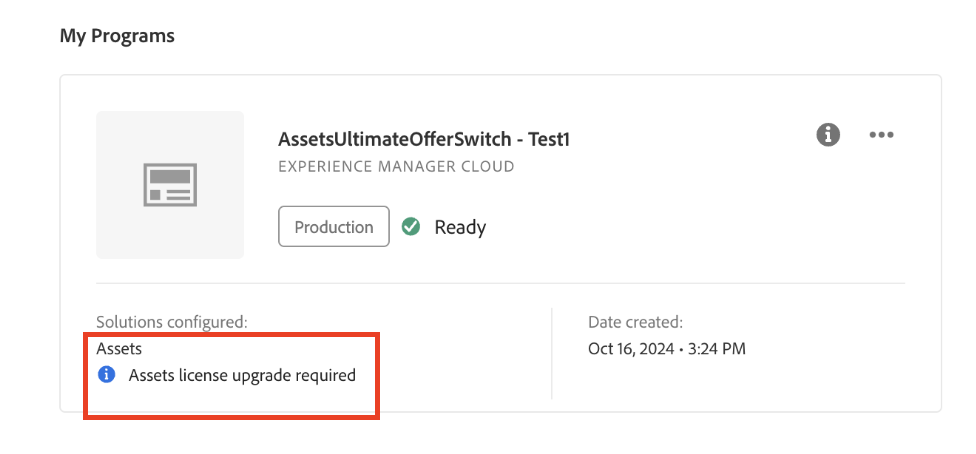

# Habilitar [!DNL Assets] as a Cloud Service Ultimate {#enable-assets-cloud-service-ultimate}

Assets as a Cloud Service Ultimate le permite realizar varias funciones clave de DAM, como administración de recursos y servicios de biblioteca, administración de seguridad y derechos, conexiones de Creative y Experience Cloud, extensibilidad de la interfaz de usuario, automatización impulsada por API, integraciones con aplicaciones de Adobe y que no sean de Adobe, implementación de código personalizado y mucho más. Consulte [Información general sobre Assets as a Cloud Service Ultimate](/help/assets/assets-ultimate-overview.md) para obtener la lista completa.

## Habilitar Assets Ultimate {#enable-assets-ultimate}

Los nuevos clientes de Assets as a Cloud Service primero deben habilitar Assets Ultimate creando un nuevo programa con Cloud Manager.

Ejecute los siguientes pasos:

1. Inicie sesión en Cloud Manager como administrador del sistema. Asegúrese de seleccionar la organización correcta al iniciar sesión.

   >[!NOTE]
   >
   >Asegúrese de que está añadido al perfil de producto de Cloud Manager correspondiente para añadir un nuevo programa. Para obtener más información, consulte [Permisos basados en roles en Cloud Manager](/help/onboarding/cloud-manager-introduction.md#role-based-permissions).

1. [Cree un nuevo programa](/help/journey-onboarding/create-program.md) y [agréguele entornos](/help/journey-onboarding//create-environments.md).

   Al crear el nuevo programa, en la ficha **[!UICONTROL Soluciones y complementos]**, seleccione **[!UICONTROL Assets Ultimate]**. También puede expandir **[!UICONTROL Assets Ultimate]** y seleccionar **[!UICONTROL Content Hub]** para habilitar [Content Hub](/help/assets/product-overview.md) para la distribución de recursos.

   

1. Haga clic en **[!UICONTROL Crear]** para crear el programa. Assets Ultimate ahora está habilitado para Experience Manager Assets as a Cloud Service.

El administrador del sistema tiene automáticamente derecho como administrador de AEM en Assets Ultimate y recibe un correo electrónico para navegar a Admin Console y administrar los perfiles de producto disponibles.

La instancia de AEM as a Cloud Service en Admin Console consta de los siguientes perfiles de producto:

* Administradores de AEM

* Usuarios de AEM 

* [Usuarios colaboradores de AEM Assets](#onboard-collaborator-users)

* [Usuarios avanzados de AEM Assets](#onboard-power-users)

  

Si ha habilitado Content Hub para Assets as a Cloud Service, hay una nueva instancia creada dentro de AEM Assets as a Cloud Service en Admin Console con `delivery` como sufijo:

>[!NOTE]
>
>Si ha aprovisionado Content Hub antes del 14 de agosto de 2024, la nueva instancia se creará con `contenthub` como sufijo.

Tenga en cuenta que no hay `author` ni `publish` en el nombre de instancia de Content Hub.

Haga clic en el nombre de la instancia para ver el perfil de producto de Content Hub `AEM Assets Limited Users`.

Puede empezar a añadir usuarios o grupos de usuarios a este perfil de producto para proporcionarles acceso a Content Hub.

>[!NOTE]
>
>Si ha aprovisionado Content Hub antes del 14 de agosto de 2024, el perfil de producto de Content Hub tiene `contenthub` mencionado después de `Limited Users` en lugar de `delivery`.

## Habilitar Assets Ultimate para clientes existentes {#enable-assets-ultimate-existing-customers}

Los clientes existentes de Assets as a Cloud Service pueden actualizar a Assets Ultimate ejecutando dos sencillos pasos. Puede navegar al programa Assets as a Cloud Service en Cloud Manager y ver el estado de actualización en la tarjeta de programa en función de la disponibilidad de los créditos de Assets Ultimate. Si hay suficientes créditos disponibles para actualizar a Assets Ultimate, puede ver el estado como `Assets license upgrade required`, como se muestra en la siguiente imagen:

Si un cliente existente compra una nueva licencia para Assets Ultimate, el estado de actualización se muestra como `Assets license upgrade available`.

### Requisitos previos para la actualización {#prerequisites-assets-upgrade}

Todos los entornos deben actualizarse a la última versión de AEM as a Cloud Service o a un mínimo de `2024.10.18175`. Si no cumple los requisitos mínimos, póngase en contacto con su representante de Adobe para cambiar a la versión de AEM requerida.

### Actualizar a Assets Ultimate {#upgrade-assets-ultimate}

Ejecute los siguientes pasos:

1. Después de cambiar a los requisitos mínimos de la versión de AEM, haga clic en el nombre del programa. Se muestra una tarjeta de actualización justo encima de la sección **[!UICONTROL Entornos]**, como se muestra en la siguiente imagen:

   

1. Haga clic en **[!UICONTROL Agregar perfiles de producto]**. Cloud Manager muestra las opciones para agregar nuevos perfiles de producto a todos los entornos disponibles en el programa o en entornos individuales.

   

1. Haga clic en **[!UICONTROL Todos los entornos]** para agregar los nuevos perfiles de producto a todos los entornos del programa o en **[!UICONTROL Entornos individuales]** para agregar los nuevos perfiles de producto a los entornos seleccionados.

   Al hacer clic en **[!UICONTROL Entornos individuales]**, se muestra la lista de todos los entornos disponibles en el programa.

1. Haga clic en el icono de Más opciones correspondiente a un entorno y seleccione **[!UICONTROL Agregar perfiles de producto]** para agregar los nuevos perfiles de producto al entorno seleccionado.

   

   También puede agregar perfiles de producto a entornos seleccionados si navega hasta la sección **[!UICONTROL Entornos]**, hace clic en el icono Más opciones correspondiente a un entorno y selecciona **[!UICONTROL Agregar perfiles de producto]**.

   El estado del entorno muestra `Adding Product Profiles` mientras se agregan los nuevos perfiles de producto y, posteriormente, muestra `Running` cuando se completa el proceso.

   Debe agregar perfiles de producto a todos los entornos disponibles en el programa, individualmente o en todos los entornos juntos, antes de ejecutar el siguiente paso.

1. Haga clic en **[!UICONTROL Actualizar]**. La opción **[!UICONTROL Actualizar]** solo se muestra cuando agrega perfiles de producto a todos los entornos disponibles.

   

   El proceso de actualización ha finalizado y ha actualizado correctamente su Assets as a Cloud Service a Assets Ultimate. El estado del programa muestra `Assets Ultimate`.

   

La instancia de AEM as a Cloud Service en Admin Console ahora incluye los siguientes perfiles de producto:

* Administradores de AEM

* Usuarios de AEM 

* [Usuarios colaboradores de AEM Assets](#onboard-collaborator-users)

* [Usuarios avanzados de AEM Assets](#onboard-power-users)

Si necesita habilitar Content Hub, haga clic en el botón Más opciones (...) del nombre del programa en Cloud Manager y seleccione **[!UICONTROL Editar programa]**. Expanda **[!UICONTROL Assets Ultimate]** y haga clic en **[!UICONTROL Content Hub]**. Este paso habilita Content Hub para Assets Ultimate. Se ha creado una nueva instancia en AEM Assets as a Cloud Service en Admin Console con `delivery` como sufijo:

>[!NOTE]
>
>Si ha aprovisionado Content Hub antes del 14 de agosto de 2024, la nueva instancia se creará con `contenthub` como sufijo.

Tenga en cuenta que no hay `author` ni `publish` en el nombre de instancia de Content Hub.

Haga clic en el nombre de la instancia para ver el perfil de producto de Content Hub `AEM Assets Limited Users`.

Puede empezar a añadir usuarios o grupos de usuarios a este perfil de producto para proporcionarles acceso a Content Hub.

>[!NOTE]
>
>Si ha aprovisionado Content Hub antes del 14 de agosto de 2024, el perfil de producto de Content Hub tiene `contenthub` mencionado después de `Limited Users` en lugar de `delivery`.

## Incorporación de usuarios de AEM Assets Collaborator {#onboard-collaborator-users}

AEM Assets Los usuarios de Collaborator pueden trabajar con recursos de Experience Manager mediante integraciones de Assets disponibles para su organización en otros productos de Adobe y aplicaciones que no sean de Adobe, crear y editar recursos mediante Adobe Express y Firefly integrados aprovechando las plantillas, los kits de marca, los recursos de Adobe Stock, etc. de diseño profesional, y acceder a los recursos aprobados de su organización y aprovecharlos mediante el portal de AEM Assets Content Hub.

Para incorporar usuarios de Collaborator:

1. Para acceder a los perfiles de producto de Experience Manager Assets, haga clic en el nombre del producto de AEM as a Cloud Service en la lista de productos en Admin Console.

1. Haga clic en la instancia de autor de producción para AEM as a Cloud Service:
   

1. Haga clic en el perfil de producto Usuarios de Collaborators y luego en **[!UICONTROL Agregar usuarios]** para agregar usuarios o grupos de usuarios al perfil de producto.
   

1. Haga clic en **[!UICONTROL Guardar]** para guardar los cambios.

También puede acceder y ver los servicios asignados a los usuarios de Collaborator, como se muestra en la siguiente imagen:

Los servicios `Adobe Express` y `AEM Assets Collaborator Users` están habilitados de manera predeterminada.

>[!NOTE]
>
>Puede desactivar y activar la opción para habilitar o deshabilitar los servicios disponibles, según sus necesidades; sin embargo, Adobe recomienda utilizar los servicios predeterminados habilitados para los perfiles de producto.

## AEM Assets integrados Usuarios avanzados {#onboard-power-users}

AEM Assets Los usuarios avanzados pueden acceder a todas las funciones de los AEM Assets, incluida la administración de recursos, permisos, metadatos, y al control y la automatización generales de los recursos digitales, trabajar con recursos de Experience Manager mediante integraciones de Assets disponibles para su organización en otras aplicaciones de Adobe y que no sean de Adobe, crear y editar recursos mediante Adobe Express y Firefly integrados que aprovechan las plantillas de diseño profesional, los kits de marca, los recursos de Adobe Stock, etc., y acceder a los recursos aprobados de su organización y aprovecharlos mediante el portal de AEM Assets de Content Hub.

Para incorporar usuarios avanzados:

1. Para acceder a los perfiles de producto de Experience Manager Assets, haga clic en el nombre del producto de AEM as a Cloud Service en la lista de productos en Admin Console.

1. Haga clic en la instancia de autor de producción para AEM as a Cloud Service:
   

1. Haga clic en el perfil de producto Usuarios avanzados y haga clic en **[!UICONTROL Agregar usuarios]** para agregar usuarios o grupos de usuarios al perfil de producto.
   

1. Haga clic en **[!UICONTROL Guardar]** para guardar los cambios.

También puede acceder y ver los servicios asignados a usuarios avanzados, como se muestra en la siguiente imagen:

Los servicios `Adobe Express` y `AEM Assets Power Users` están habilitados de manera predeterminada.

>[!NOTE]
>
>Puede desactivar y activar la opción para habilitar o deshabilitar los servicios disponibles, según sus necesidades; sin embargo, Adobe recomienda utilizar los servicios predeterminados habilitados para los perfiles de producto.
