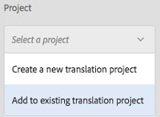

# Integración de AEM Assets con InDesign Server {#integrating-aem-assets-with-indesign-server}

Recursos Adobe Experience Manager (AEM) que utiliza:

* Un proxy para distribuir la carga de determinadas tareas de procesamiento. Un proxy es una instancia de AEM que se comunica con un trabajador proxy para cumplir una tarea específica y con otras instancias de AEM para ofrecer los resultados.
* Un trabajador proxy para definir y administrar una tarea específica.
Pueden abarcar una amplia variedad de tareas; por ejemplo, si se utiliza un servidor de InDesign para procesar archivos.

Para cargar archivos completamente en Recursos AEM que haya creado con Adobe InDesign, se utiliza un proxy. Esto utiliza un trabajador proxy para comunicarse con Adobe InDesign Server, donde se ejecutan [scripts](https://www.adobe.com/devnet/indesign/documentation.html#idscripting) para extraer metadatos y generar varias representaciones para Recursos AEM. El programa de trabajo proxy habilita la comunicación bidireccional entre InDesign Server y las instancias de AEM en una configuración de nube.

>[!NOTE]
>
>Adobe InDesign se suministra como dos productos:
>
>* [InDesign](https://www.adobe.com/products/indesign.html)
   >  Esto le permite diseñar diseños de página para impresión y/o distribución digital.
   >
   >
* [InDesign Server](https://www.adobe.com/products/indesignserver.html)
   >  Este motor le permite crear mediante programación documentos automatizados en función de lo que haya creado con InDesign. Funciona como un servicio que ofrece una interfaz a su motor [ExtendScript](https://www.adobe.com/devnet/scripting.html) .
   >  Las secuencias de comandos se escriben en extendscript, similar a javascript. Para obtener información sobre las secuencias de comandos de Indesign, consulte [https://www.adobe.com/devnet/indesign/documentation.html#idscripting](https://www.adobe.com/devnet/indesign/documentation.html#idscripting).
>

## Cómo funciona la extracción {#how-the-extraction-works}

Adobe InDesign Server se puede integrar con Recursos AEM para que los archivos INDD creados con InDesign se puedan cargar, generar representaciones, extraer todos los medios (por ejemplo, vídeo) y almacenar como recursos:

>[!NOTE]
>
>Las versiones anteriores de AEM podían extraer XMP y la miniatura, ahora se pueden extraer todos los medios.

1. Cargue el archivo INDD en Recursos AEM.
1. Un marco envía secuencias de comandos a InDesign Server mediante SOAP (Protocolo simple de acceso a objetos).
Esta secuencia de comandos de comando:

   * Recupere el archivo INDD.
   * Ejecutar comandos de InDesign Server:

      * Se extraen la estructura, el texto y los archivos multimedia.
      * Se generan representaciones PDF y JPG.
      * Se generan representaciones HTML e IDML.
   * Publique los archivos resultantes en Recursos AEM.
   >[!NOTE]
   >
   >IDML es un formato basado en XML que procesa *todo* el archivo de InDesign. Se almacena como un paquete comprimido usando la compresión [Zip](https://www.techterms.com/definition/zip) .
   >
   >
   >Consulte [Adobe Press - InDesign Interchange Formats INX e IDML](https://www.adobepress.com/articles/article.asp?p=1381880&seqNum=8) para obtener más información.

   >[!CAUTION]
   >
   >Si InDesign Server no está instalado o no está configurado, podrá cargar un archivo INDD en AEM. Sin embargo, las representaciones generadas se limitarán a PNG y JPEG. No podrá generar representaciones de HTML, .idml ni de páginas.

1. Después de la generación de extracción y representación:

   * La estructura se replica en un `cq:Page` (tipo de representación).
   * El texto y los archivos extraídos se almacenan en Recursos AEM.
   * Todas las representaciones se almacenan en Recursos AEM, en el propio recurso.

## Integración de InDesign Server con AEM {#integrating-the-indesign-server-with-aem}

Para integrar InDesign Server para utilizarlo con AEM Assets y después de configurar el proxy, deberá:

1. [Instale InDesign Server](#installing-the-indesign-server).
1. Si es necesario, [configure el flujo de trabajo](#configuring-the-aem-assets-workflow)de AEM Assets.
Esto solo es necesario si los valores predeterminados no son adecuados para la instancia.

1. Configure un trabajador [proxy para InDesign Server](#configuring-the-proxy-worker-for-indesign-server).

### Instalación de InDesign Server {#installing-the-indesign-server}

Para instalar e iniciar InDesign Server y utilizarlo con AEM:

1. Descargue e instale Adobe InDesign Server.

   >[!NOTE]
   >
   >InDesign Server (CS6 y versiones posteriores).

1. Si es necesario, puede personalizar la configuración de la instancia de InDesign Server.

1. Desde la línea de comandos, inicie el servidor:

   `<*ids-installation-dir*>/InDesignServer.com -port 8080`

   Esto iniciará el servidor con la escucha del complemento SOAP en el puerto 8080. Todos los mensajes y resultados de registro se escriben directamente en la ventana de comandos.

   >[!NOTE]
   >
   >Si desea guardar los mensajes de salida en un archivo, utilice la redirección; por ejemplo, en Windows:
   >
   >
   >`<ids-installation-dir>/InDesignServer.com -port 8080 > ~/temp/INDD-logfile.txt 2>&1`

### Configuración del flujo de trabajo de AEM Assets {#configuring-the-aem-assets-workflow}

Recursos AEM dispone de un flujo de trabajo preconfigurado **DAM Update Asset**, que cuenta con varios pasos de proceso específicos para InDesign:

* [Extracción de medios](#media-extraction)
* [Extracción de páginas](#page-extraction)

<!--
BROKEN LINK This workflow is setup with default values that can be adapted for your setup on the various author instances (this is a standard workflow, so further information is available under [Editing a Workflow](/help/sites-developing/workflows-models.md#configuring-a-workflow-step)). If you are using the default values (including the SOAP port), then no configuration is needed. BROKEN LINK
-->

Tras la configuración, la carga de archivos de InDesign en Recursos AEM (por cualquiera de los métodos habituales) activará el flujo de trabajo necesario para procesar el recurso y preparar las distintas representaciones. Pruebe la configuración cargando un `.indd` archivo en Recursos AEM para confirmar que ve las distintas representaciones creadas por ID en `<*your_asset*>.indd/Renditions`

#### Extracción de medios {#media-extraction}

Este paso controla la extracción de medios del archivo INDD.

Para personalizar, puede editar la ficha **Argumentos** del paso Extracción **de** medios.

Argumentos de extracción de medios y rutas de secuencias de comandos

* **Biblioteca** de ExtendScriptSe trata de una sencilla biblioteca de métodos http get/post, que requieren los demás scripts.

* **Ampliación de secuencias de comandos** Aquí puede especificar diferentes combinaciones de secuencias de comandos. Si desea que se ejecuten sus propias secuencias de comandos en InDesign Server, guarde las secuencias de comandos en `/apps/settings/dam/indesign/scripts`.
Para obtener información sobre las secuencias de comandos de Indesign, consulte:
   [https://www.adobe.com/devnet/indesign/documentation.html#idscripting](https://www.adobe.com/devnet/indesign/documentation.html#idscripting)

>[!CAUTION]
>
>No **cambie** la biblioteca **** ExtendScript.

>Esta biblioteca proporciona la funcionalidad HTTP necesaria para comunicarse con Sling. Esta configuración especifica la biblioteca que se enviará al servidor de InDesign para utilizarla en él.
>
La secuencia `ThumbnailExport.jsx` de comandos ejecutada por el paso del flujo de trabajo de Media Extraction genera una representación en miniatura en formato .jpg. Esta representación se utiliza en el paso del flujo de trabajo Miniaturas de proceso para generar las representaciones estáticas necesarias para AEM.

Puede configurar el paso del flujo de trabajo Miniaturas de proceso para generar representaciones estáticas de diferentes tamaños. Asegúrese de que no elimina los valores predeterminados, ya que la interfaz de usuario de Recursos AEM los requiere. Por último, el paso del flujo de trabajo Eliminar representación de vista previa de imagen elimina la representación en miniatura .jpg, ya que ya no es necesaria.

#### Extracción de páginas {#page-extraction}

Esto crea una página de AEM a partir de los elementos extraídos. Se utiliza un controlador de extracción para extraer datos de una representación (actualmente HTML o IDML). Estos datos se utilizan para crear una página con PageBuilder.

Para personalizar, puede editar la ficha **Argumentos** del paso Extracción **de** página.

* **Controlador** de extracción de página En la lista desplegable, seleccione el controlador que desee utilizar. Un controlador de extracción funciona en una representación específica, elegida por un elemento relacionado `RenditionPicker` (consulte la `ExtractionHandler` API).
En una instalación estándar de AEM, está disponible lo siguiente:

   * Controlador de extracción de exportación IDMLontaliza la `IDML` representación generada en el paso MediaExtract.

* **Nombre** de página Especifique el nombre que desea asignar a la página resultante. Si se deja en blanco, el nombre es &quot;page&quot; (o una derivativa si &quot;page&quot; ya existe).

* **Título** de página Especifique el título que desea asignar a la página resultante.

* **Ruta**de la raíz de la páginaRuta a la ubicación raíz de la página resultante.
Si se deja en blanco, se utilizará el nodo que contiene las representaciones del recurso.

* **Plantilla** de página La plantilla que se usará al generar la página resultante.

* **Diseño de página** El diseño de página que se utilizará al generar la página resultante.

### Configuración del trabajo proxy para InDesign Server {#configuring-the-proxy-worker-for-indesign-server}

>[!NOTE]
El programa de trabajo reside en la instancia de proxy.

1. En la consola Herramientas, expanda Configuraciones **de servicios de** nube en el panel izquierdo. A continuación, expanda Configuración **de proxy de** nube.

1. Haga doble clic en el programa de trabajo **** IDS para abrirlo y configurarlo.

1. Haga clic en **[!UICONTROL Editar]** para abrir el cuadro de diálogo de configuración y definir la configuración necesaria:

   

   * **Grupo** de ID Los extremos SOAP que se utilizarán para la comunicación con el servidor de InDesign. Puede agregar, quitar y ordenar los elementos que sean necesarios.

1. Haga clic en Aceptar para guardar.

### Configuración de Day CQ Link Externalizer {#configuring-day-cq-link-externalizer}

Si el servidor de InDesign y AEM se ejecutan en diferentes hosts o en cualquiera de estas aplicaciones o en ambas no se ejecutan en los puertos predeterminados, configure **Day CQ Link Externalizer** para establecer el nombre de host, el puerto y la ruta de contenido para el servidor de InDesign.

1. Acceda a Configuration Manager en la dirección URL `https://[aem_server]:[port]/system/console/configMgr`.
1. Busque la configuración Externalizador de vínculos **de CQ de día y haga clic en el icono** Editar **** para abrirlo.
1. Especifique el nombre de host y la ruta de contexto para el servidor de Indesign y haga clic en **Guardar**.

   

### Activación del procesamiento de trabajos paralelos para los servidores de InDesign {#enabling-parallel-job-processing-for-indesign-server-s}

Ahora puede habilitar el procesamiento de trabajos paralelos para IDS.

En primer lugar, debe determinar el número máximo de trabajos paralelos (`x`) que puede procesar un servidor de InDesign:

* En un solo equipo multiprocesador, el número máximo de trabajos paralelos (x) que puede procesar un servidor de InDesign es uno menor que el número de procesadores que ejecutan IDS.
* Cuando ejecuta IDS en varios equipos, debe contar el número total de procesadores disponibles (es decir, en todos los equipos) y luego restar el número total de equipos.

Para configurar el número de trabajos de IDS paralelos:

1. Abra la ficha **Configuraciones** de la consola Félix; por ejemplo: `https://[aem_server]:[port]/system/console/configMgr`.

1. Seleccione la cola de procesamiento de IDS en:

   `Apache Sling Job Queue Configuration`

1. Configurar:

   * **Tipo** - `Parallel`
   * **Trabajos** paralelos máximos: `<*x*>` (como se calculó arriba)

1. Guarde estos cambios.
1. Habilite la compatibilidad con varias sesiones para CS6 (y versiones posteriores) marcando:

   `enable.multisession.name` casilla de verificación

   En:

   `com.day.cq.dam.ids.impl.IDSJobProcessor.name configuration`

1. Cree un [grupo de trabajadores de `<*x*>` IDS agregando extremos de SOAP a la configuración](#configuring-the-proxy-worker-for-indesign-server)de IDS Worker.

   Si hay varios equipos que ejecutan servidores de InDesign, agregue puntos finales SOAP (número de procesadores por equipo -1) para cada equipo.

   >[!NOTE]
   Puede activar la lista negra de trabajadores de IDS cuando trabaje con un grupo de trabajadores.
   Para ello, habilite la casilla &quot;enable.reintento.name&quot;, en la configuración, que permite la recuperación de trabajos de IDS. `com.day.cq.dam.ids.impl.IDSJobProcessor.name`
   Además, en la configuración `com.day.cq.dam.ids.impl.IDSPoolImpl.name` , establezca un valor positivo para `max.errors.to.blacklist` el parámetro que determina el número de recuperaciones de trabajos antes de excluir un ID de la lista de controladores de trabajos
   De forma predeterminada, después del tiempo configurable (retry.interval.to.whitelist.name), en minutos, se vuelve a validar el programa de trabajo de IDS. Si el trabajador se encuentra en línea, se elimina de la lista negra

## Activación de la compatibilidad con InDesign Server 10.0 o superior {#enabling-support-for-indesign-server-or-higher}

Para InDesign Server 10.0 o superior, realice los siguientes pasos para habilitar la compatibilidad con varias sesiones.

1. Abra Configuration Manager desde la instancia de Recursos AEM `https://[aem_server]:[port]/system/console/configMgr`.
1. Edite la configuración `com.day.cq.dam.ids.impl.IDSJobProcessor.name`.
1. Seleccione la opción **[!UICONTROL ids.cc.enable]** y haga clic en **[!UICONTROL Guardar]**.

>[!NOTE]
Para la integración de InDesign Server con AEM Assets, utilice un procesador de varios núcleos, ya que la función de compatibilidad de sesión necesaria para la integración no se admite en sistemas de un solo núcleo.

## Configuración de las credenciales de AEM {#configure-aem-credentials}

Puede cambiar las credenciales de administrador predeterminadas (nombre de usuario y contraseña) para acceder al servidor de InDesign desde la instancia de AEM sin interrumpir la integración con el servidor de InDesign.

1. Ir a `/etc/cloudservices/proxy.html`.
1. En el cuadro de diálogo, especifique el nombre de usuario y la contraseña nuevos.
1. Guarde las credenciales.
