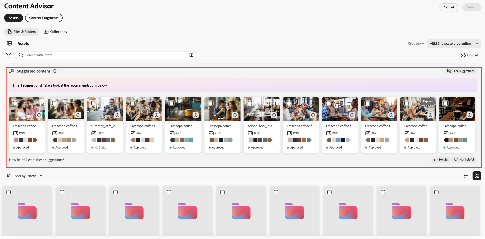

# Utilice el Asesor de contenido para acceder al contenido de AEM en aplicaciones de Adobe y que no sean de Adobe{#content-advisor-aem-assets-adobe-non-Adobe-applications}

El Asesor de contenido ofrece una experiencia unificada de detección de contenido en aplicaciones de Adobe y que no son de Adobe. Integrado de forma nativa con aplicaciones como Adobe Workfront, AJO B2C (próximamente), AEM Sites y aplicaciones que no son de Adobe, el Asesor de contenido reúne el contenido (recursos y fragmentos de contenido) en una sola interfaz inteligente. Le permite descubrir, examinar y reutilizar sin esfuerzo el contenido más relevante, justo dentro del flujo de trabajo, para que pueda moverse más rápido sin romper el contexto.

El Asesor de contenido aporta una detección inteligente según el contexto directamente en la experiencia de creación, lo que le ayuda a encontrar rápidamente contenido relevante y aprobado en función de sus intenciones. Con funciones como sugerencias inteligentes, representaciones de Dynamic Media y metadatos de recursos detallados, le permite evaluar y reutilizar contenido de forma eficaz sin salir de la interfaz de la aplicación, lo que acelera la creación de contenido y mantiene la coherencia de la marca.

Adobe Experience Manager (AEM) Assets también se integra de forma nativa con Adobe Express, lo que le permite detectar, acceder y utilizar recursos de AEM Assets directamente en la interfaz Express mediante el Asesor de contenido. Para obtener más información, consulte [Usar el Asesor de contenido para obtener acceso a los AEM Assets de Adobe Express](/help/assets/native-integration-adobe-express.md).

## Requisitos previos {#prerequisites}

* Acceso a un entorno de as a Cloud Service de AEM Assets.

* Acceso a un entorno de AEM Sites con fragmentos de contenido creados (requerido solo para trabajar con fragmentos de contenido). Esto no es necesario para acceder a AEM Assets o recursos binarios.

## Detección inteligente de recursos con el Asesor de contenido {#intelligent-asset-discovery-content-advisor}

El Asesor de contenido le ayuda a descubrir contenido relevante mediante recomendaciones inteligentes y según el contexto, basadas en el contenido de la aplicación Adobe o en las instrucciones de la campaña que aloja. También le permite seleccionar representaciones de Dynamic Media listas para el canal optimizadas para su caso de uso.

>[!IMPORTANT]
> 
>Asegúrese de seleccionar un repositorio **author** de la lista desplegable **Repository**. Un repositorio **delivery** no muestra las características del Asesor de contenido.
>
> Además, el repositorio **delivery** no tiene contenido organizado en carpetas y colecciones. El contenido se muestra en el nivel raíz en una estructura plana.

El Asesor de contenido proporciona las siguientes funciones clave:

* [Búsqueda por IA para una detección de recursos más inteligente](#content-advisor-ai-search)

* [Sugerencias inteligentes basadas en el contexto y la intención](#smart-suggestions-content-advisor)

* [Información de Campaign para descubrir recursos relevantes](#campaign-briefs-content-advisor)

* [Representaciones de recursos de Dynamic Media disponibles para su uso](#dynamic-media-renditions-content-advisor)

* [Integración perfecta con los fragmentos de contenido](#content-fragments-integration-content-advisor)

* [Acceso a metadatos de recursos coherente con la vista de Assets](#asset-metadata-content-advisor)

* [Filtros de acceso coherentes con la vista de Assets](#filters-content-advisor)

* [Acceder y reutilizar búsquedas recientes y guardadas](#saved-searches-content-advisor)

* [Buscar recursos en y entre colecciones](#search-collections-content-advisor)

### Búsqueda por IA para una detección de recursos más inteligente {#content-advisor-ai-search}

El Asesor de contenido utiliza una capacidad de búsqueda avanzada que comprende el significado y la intención detrás de la consulta de un usuario, en lugar de depender de coincidencias de palabras clave exactas. Utiliza la inteligencia artificial (IA) y el aprendizaje automático para ofrecer resultados más precisos y sensibles al contexto.

A diferencia de la búsqueda tradicional basada en palabras clave, que busca términos exactos, la Búsqueda por IA interpreta las relaciones entre palabras, conceptos e intención del usuario. Esto garantiza que los usuarios encuentren lo que están buscando, incluso si su consulta está redactada de forma diferente, contiene errores tipográficos o está en otro idioma.

Algunos de sus beneficios clave incluyen:

* Asistencia multilingüe: busque en varios idiomas sin necesidad de traducciones exactas. Los usuarios pueden encontrar contenido relevante independientemente del idioma de la consulta.

* Maneja errores ortográficos: Interpreta errores ortográficos y ortográficos, lo que garantiza resultados precisos incluso con entradas imperfectas.

* Comprende los sinónimos: Proporciona resultados para términos y frases relacionados, de modo que los usuarios no necesitan adivinar la palabra clave correcta.

* Búsqueda según el contexto: Reconoce la intención detrás de una consulta, no solo las palabras exactas.

>[!IMPORTANT]
> 
>* La versión mínima requerida de AEM para acceder a la Búsqueda por IA en el Asesor de contenido es `21994`
>* La compatibilidad con la búsqueda por IA para los fragmentos de contenido estará disponible próximamente.

### Sugerencias inteligentes basadas en el contexto y la intención {#smart-suggestions-content-advisor}

El Asesor de contenido muestra sugerencias inteligentes basadas en el contexto de la aplicación Adobe host. Esto le ayuda a descubrir y utilizar rápidamente recursos que se alinean con sus necesidades de contenido sin la laboriosa búsqueda manual.

>[!IMPORTANT]
> 
>* Debe firmar a un piloto de GenAI para acceder a esta función dentro del Asesor de contenido. Para firmar GenAI rider, póngase en contacto con su representante de Adobe.
>* La versión mínima de AEM requerida para acceder a esta función es `21994`.
>* El Asesor de contenido muestra sugerencias inteligentes basadas en el contexto y el propósito del contenido disponible en la aplicación Adobe host. No muestra los resultados en función de las imágenes. Consulte [Compatibilidad con funciones de Asesor de contenido en todas las aplicaciones de Adobe](#content-advisor-feature-support-adobe-applications) para obtener la lista de aplicaciones de Adobe compatibles que admiten esta capacidad.

### Información de Campaign para descubrir recursos relevantes {#campaign-briefs-content-advisor}

El Asesor de contenido le permite cargar un documento de resumen de campaña para descubrir recursos relevantes sin introducir manualmente las palabras clave de búsqueda. El Asesor de contenido analiza la información de la información de la campaña para comprender la intención de la campaña y recomienda los activos relevantes disponibles en los AEM Assets.

>[!IMPORTANT]
>
>* El Asesor de contenido analiza la información disponible como texto en la información de la campaña para recomendar recursos relevantes. No analiza la información disponible como imágenes en la información de la campaña.
>* Los tipos de archivo admitidos que puede cargar como resumen de campaña incluyen documentos PDF, DOCX y TXT.
>* Debe firmar a un piloto de GenAI para acceder a esta función dentro del Asesor de contenido. Para firmar GenAI rider, póngase en contacto con su representante de Adobe.
>* La versión mínima de AEM requerida para acceder a esta función es `21994`.
>* La compatibilidad con Cargar resumen de campaña estará disponible próximamente para los fragmentos de contenido.

### Representaciones de recursos de Dynamic Media disponibles para su uso {#dynamic-media-renditions-content-advisor}

Las representaciones de Dynamic Media proporcionan versiones de recursos listas para usar y optimizadas para el canal, incluidos [ajustes preestablecidos de imagen](/help/assets/dynamic-media/managing-image-presets.md), [recortes inteligentes](/help/assets/dynamic-media/image-profiles.md), tipos de formato y perfiles de color. Estas representaciones ayudan a garantizar que el recurso seleccionado cumpla los requisitos de canal y diseño sin necesidad de editar manualmente o duplicar recursos.

También puede aplicar modificadores de Dynamic Media para previsualizar los ajustes en tiempo real antes de seleccionar la representación para la aplicación de Adobe del host, lo que permite una selección más rápida de la representación más adecuada y, al mismo tiempo, mantener la coherencia y la calidad del recurso.

Haga clic en el icono  de la tarjeta de recursos y seleccione la pestaña **[!UICONTROL Dynamic Media]** para ver las representaciones disponibles de un recurso. Puede seleccionar ver [representaciones de Dynamic Media Scene7](/help/assets/dynamic-media/dynamic-media.md) o [Dynamic Media con representaciones de OpenAPI](/help/assets/dynamic-media-open-apis-overview.md). Al seleccionar **[!UICONTROL OpenAPI]** para un recurso, las representaciones disponibles solo se mostrarán si el recurso está aprobado y disponible para Dynamic Media con OpenAPI.

Debe tener una licencia de Dynamic Media de AEM válida para ver la pestaña Dynamic Media.

Haga clic en el icono  para obtener una vista previa de la representación o haga clic en el nombre de la representación y haga clic en **[!UICONTROL Seleccionar]** para que la representación esté disponible en la aplicación host.

Haga clic en **[!UICONTROL Agregar modificadores]**, especifique un modificador en el cuadro de texto y presione Entrar para aplicar la transformación a todas las representaciones de recursos en tiempo real. Del mismo modo, puede añadir varios modificadores a las representaciones y previsualizar esas transformaciones. Haga clic en el nombre de la representación y luego en **[!UICONTROL Seleccionar]** para que la representación esté disponible en la aplicación host. La representación después de aplicar esos modificadores no se guarda. Consulte la lista de modificadores admitidos para [Dynamic Media Scene7](https://experienceleague.adobe.com/es/docs/dynamic-media-developer-resources/image-serving-api/image-serving-api/http-protocol-reference/command-reference/c-command-reference) y [Dynamic Media con OpenAPI](https://developer.adobe.com/experience-cloud/experience-manager-apis/api/stable/assets/delivery/#operation/getAssetSeoFormat).

### Detección de fragmentos de contenido {#content-fragments-discovery-content-advisor}

El Asesor de contenido permite descubrir fragmentos de contenido, lo que facilita la exploración e incorporación de fragmentos a las aplicaciones de Adobe compatibles. Busque en una lista de fragmentos de contenido y seleccione el contenido más relevante sin abandonar el flujo de trabajo actual.

Cada fragmento de contenido se representa como una tarjeta con una previsualización de miniatura en directo generada a partir de su contenido, lo que le ayuda a identificar rápidamente el fragmento correcto. La tarjeta también muestra detalles clave como el título y el estado (Borrador, Modificado o Publicado). Para obtener información más detallada, haz clic en el icono  para ver las propiedades detalladas, las referencias a otros fragmentos de contenido y las variaciones disponibles, lo que garantiza una selección y reutilización del contenido fundamentadas.

>[!IMPORTANT]
> 
>* Las funciones de búsqueda por IA, sugerencias inteligentes, carga de informes de campaña y vista previa aún no son compatibles con los fragmentos de contenido en el Asesor de contenido.

### Acceso a metadatos de recursos coherente con la vista de Assets {#asset-metadata-content-advisor}

El Asesor de contenido proporciona acceso a las propiedades de recursos definidas en los AEM Assets, incluidos los metadatos disponibles en la vista de Assets. El Asesor de contenido utiliza la misma configuración de metadatos que en la vista de Assets, replicando la lista de pestañas de metadatos y el contenido en la página de detalles del recurso de la vista de Assets. Esto le permite revisar detalles clave del recurso, como el título, la descripción, el formato, el tamaño y otros metadatos, antes de seleccionar un recurso. El acceso a las propiedades del recurso le ayuda a asegurarse de que elige el recurso correcto y aprobado para su contenido.

Haga clic en el icono  de la tarjeta de recursos y seleccione la pestaña **[!UICONTROL Básico]** para ver los metadatos de los recursos. También puede ver otras pestañas de metadatos de recursos, como Producto, Campaña y Etiquetas, en consonancia con los metadatos de recursos que existen en la vista de Assets.

El Asesor de contenido muestra las propiedades (metadatos) de los archivos en una vista de sólo lectura. Las propiedades no se muestran para colecciones y carpetas.

### Filtros de acceso coherentes con la vista de Assets {#filters-content-advisor}

El Asesor de contenido proporciona las mismas capacidades de filtrado dentro de la aplicación Adobe host que están disponibles en la vista de Assets, lo que permite refinar los recursos mediante filtros predefinidos. Las mismas capacidades de filtrado que están disponibles en la vista Assets también se aplican a los filtros específicos de los tipos de contenido, como archivos, carpetas y colecciones. Esto garantiza una experiencia de detección de recursos coherente y le ayuda a localizar de forma eficaz los recursos relevantes en su aplicación host de Adobe.

Si no tiene filtros configurados en la vista de Assets mediante el esquema de filtros, el Asesor de contenido muestra filtros predeterminados, incluidos el tipo de archivo, el formato de archivo, el estado del recurso, el tamaño de archivo, el ancho de la imagen, el alto de la imagen, la fecha de modificación y la fecha de creación.

El esquema de filtro personalizado es compatible con Assets (archivos), pero aún no lo es con Carpetas y colecciones.

### Acceder y reutilizar búsquedas recientes y guardadas {#saved-searches-content-advisor}

Las búsquedas guardadas creadas en la vista de Assets también están disponibles, lo que permite reutilizar criterios de búsqueda predefinidos. Las búsquedas guardadas funcionan de forma coherente entre la vista de Assets y el Asesor de contenido en todos los exploradores. Esto le ayuda a localizar recursos de forma eficaz mediante patrones de búsqueda coherentes entre AEM Assets y otras aplicaciones de Adobe.

Para guardar la búsqueda utilizada con frecuencia mediante el Asesor de contenido:

1. Especifique un término de búsqueda (opcional), haga clic en el icono de filtros y seleccione las opciones según sus necesidades para crear una consulta de búsqueda.

1. Haga clic en **Administrar búsquedas guardadas** > **Crear nueva búsqueda guardada**.

1. Especifique el nombre de la búsqueda y haga clic en  para guardarla. La búsqueda se muestra en la lista de elementos.

   

Para aplicar cualquiera de los elementos de búsqueda guardados, seleccione el elemento de búsqueda en la lista desplegable **[!UICONTROL Búsquedas guardadas]**. El Asesor de contenido muestra los resultados en función de la consulta de búsqueda.

El Asesor de contenido guarda sus búsquedas recientes y también le permite guardar las búsquedas usadas con frecuencia para acceder rápidamente más adelante. La lista de búsquedas recientes no es coherente entre la vista de Assets y el Asesor de contenido. El mismo usuario puede tener un conjunto diferente de búsquedas recientes en la vista de Assets y en el Asesor de contenido. Si utiliza el modo de incógnito para acceder al Asesor de contenido, la lista de búsquedas recientes no está disponible. Además, las búsquedas recientes no se comparten en distintos exploradores para el mismo usuario y son específicas del entorno de AEM.

La función Búsqueda guardada predeterminada, disponible en la vista de Assets, aún no está disponible en el Asesor de contenido.

### Buscar recursos en y entre colecciones {#search-collections-content-advisor}

El Asesor de contenido le permite buscar recursos o colecciones en todas las colecciones o limitar la búsqueda a una colección específica. Esto le ayuda a localizar y utilizar rápidamente recursos de colecciones depuradas, conservando el contexto organizativo deseado.

## Compatibilidad con las funciones del Asesor de contenido en todas las aplicaciones Adobe {#content-advisor-feature-support-adobe-applications}

La siguiente tabla ilustra la compatibilidad de las funciones del Asesor de contenido en todas las aplicaciones de Adobe.

>[!IMPORTANT]
> 
> A medida que el Asesor de contenido se expanda a aplicaciones de Adobe adicionales, esta tabla se actualizará para reflejar la compatibilidad más reciente.

| Aplicación | Compatibilidad con una carga breve para buscar en Assets | Compatibilidad con el panel de contenido sugerido al buscar en Assets | Compatibilidad con el panel Dynamic Media al buscar en Assets | Compatibilidad para buscar fragmentos de contenido |
|--------------------------------------|----------------------------------------------|-----------------------------------------------------------|--------------------------------------------------------|------------------------------------------|
| [Adobe Express](/help/assets/native-integration-adobe-express.md) | ✓ | ✓ | ✓ | − |
| [AEM Sites - Creación de documentos](https://www.aem.live/docs/authoring-guide#document-authoring) | ✓ | ✓ | ✓ | − |
| [AEM Sites - Editor universal](https://www.aem.live/docs/authoring-guide#universal-editor-in-aem-sites) | ✓ | ✓ | ✓ | − |
| AEM Sites - [GoogleDrive](https://www.aem.live/docs/authoring-guide#google-drive)/[Creación de SharePoint](https://www.aem.live/docs/authoring-guide#microsoft-sharepoint) | ✓ | − | ✓ | − |
| AEM Sites: editor de fragmentos de contenido (solo en el campo Referencia de contenido) | ✓ | ✓ | ✓ | − |
| Flujo de trabajo Adobe Workfront | ✓ | ✓ | − | ✓ |
| Planificación de Adobe Workfront | ✓ | ✓ | − | ✓ |
| [Vista de AEM Assets](/help/assets/assets-view-introduction.md) | ✓ | − | − | − |
| [AEM Content Hub](/help/assets/product-overview.md) | ✓ | ✓ | − | − |
| [Adobe Journey Optimizer (AJO) para B2C](http://experienceleague.adobe.com/es/docs/journey-optimizer/using/ajo-home) | ✓ | ✓ | ✓ | ✓ |

## Compatibilidad con las funciones del Asesor de contenido en aplicaciones distintas de Adobe {#content-advisor-feature-support-non-adobe-applications}

El Asesor de contenido también está disponible para la integración con aplicaciones que no son de Adobe (de terceros), lo que amplía la detección inteligente de recursos más allá de las aplicaciones de Adobe. El mismo conjunto de funciones enriquecidas, que incluye búsqueda con tecnología de IA, recomendaciones según el contexto, detección basada en instrucciones de campaña, acceso a representaciones de Dynamic Media, detección de fragmentos de contenido, filtros y metadatos de recursos, se admite en integraciones de terceros.

Esto le permite detectar, evaluar y utilizar recursos aprobados de AEM Assets directamente desde las aplicaciones externas, al tiempo que mantiene la coherencia con la experiencia disponible en Adobe Express y otras aplicaciones de Adobe.

Para obtener más información sobre las integraciones, propiedades y personalizaciones, consulte los siguientes artículos:

* [Ejemplos de integración del Asesor de contenido](https://github.com/adobe/aem-assets-selectors-mfe-examples/tree/consolidate-docs-to-experience-league/examples)

* [Propiedades del Asesor de contenido](/help/assets/content-advisor-properties.md)

* [Personalizaciones del Asesor de contenido](/help/assets/content-advisor-customization.md)

