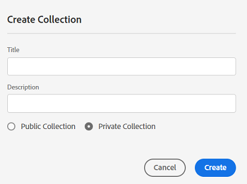

# Administrar colecciones {#manage-collections}

>[!CONTEXTUALHELP]
>id="assets_collections"
>title="Administrar colecciones"
>abstract="Una colección es un conjunto de recursos, carpetas u otras colecciones dentro de la vista Assets. Utilice las colecciones para compartir recursos entre los usuarios. A diferencia de las carpetas, una colección puede incluir recursos de distintas ubicaciones. Puede compartir varias colecciones con un usuario. Cada colección contiene referencias a recursos. La integridad referencial de los recursos se mantiene entre colecciones."

Una colección es un conjunto de recursos, carpetas u otras colecciones dentro de la vista Recursos de Adobe Experience Manager. Utilice las colecciones para compartir recursos entre los usuarios.

A diferencia de las carpetas, una colección puede incluir recursos de distintas ubicaciones.

<!--
You can share collections with various users that are assigned different levels of privileges, including viewing, editing, and so on.
-->

Puede compartir varias colecciones con un usuario. Cada colección contiene referencias a recursos. La integridad referencial de los recursos se mantiene entre colecciones.

Puede realizar las siguientes tareas para administrar y utilizar colecciones:

* [Crear una colección](#create-collection)

* [Agregar recursos a una colección](#add-assets-to-collection)

* [Eliminación de recursos de una colección](#remove-assets-from-collection)

* [Búsqueda dentro de colecciones](#search-collection)

* [Crear una colección inteligente](#create-smart-collection)

* [Edición de una colección inteligente](#edit-smart-collection)

* [Ver y editar metadatos de colección](#view-edit-collection-metadata)

* [Compartir vínculos de colecciones](#share-collection-links)

* [Descargar una colección](#download-collection)

* [Eliminar una colección](#delete-collection)

* [Administración de permisos en una colección privada](#manage-permissions-to-a-private-collection)

## Crear una colección {#create-collection}

Para crear una colección:

1. Haga clic en **[!UICONTROL Colecciones]** en el carril izquierdo y, a continuación, haga clic en **[!UICONTROL Crear colección]**.

1. Especifique un título y una descripción opcional para la colección.

1. Seleccione si necesita crear una colección privada o una colección pública. Hay una colección pública disponible para su visualización y edición por todos los usuarios. Sin embargo, hay una colección privada disponible para el creador y los usuarios con privilegios de administrador.

1. Haga clic en **[!UICONTROL Crear]** para crear la colección.

<!--
   
   for viewing and editing only to users with the appropriate [permissions](#manage-collection-access).

-->

## Agregar recursos a una colección {#add-assets-to-collection}

Para agregar recursos a una colección:

1. Haga clic en **[!UICONTROL Recursos]** en el carril izquierdo y seleccione los recursos que debe agregar a una colección.

1. Haga clic en **[!UICONTROL Agregar a colección]**.

1. En el cuadro de diálogo [!UICONTROL Colecciones], seleccione las colecciones para agregar los recursos seleccionados.

1. Haga clic en **[!UICONTROL Agregar]** para agregar el recurso a las colecciones seleccionadas.

## Eliminación de recursos de una colección {#remove-assets-from-collection}

Para quitar recursos de una colección:

1. Haga clic en **[!UICONTROL Colecciones]** en el carril izquierdo para ver la lista de colecciones.

1. Haga clic en la colección y seleccione los elementos que debe quitar de la colección.

1. Haga clic en **[!UICONTROL Quitar]**.

## Búsqueda dentro de colecciones {#search-collection}

Puede buscar dentro de una colección para encontrar fácilmente recursos relevantes. Para ello, ejecute los siguientes pasos:

* Navegue hasta **[!DNL Collections]**. En la barra de búsqueda, escriba una palabra clave para localizar la colección deseada. La barra de búsqueda muestra la ubicación de la colección seleccionada.

* Para restringir los resultados de búsqueda, abra **[!DNL Filters]** y asegúrese de que **[!DNL Collections]** está seleccionado en **[!DNL Asset Type]**.

* En el menú desplegable **[!DNL Collection Visibility]**, elija una de las siguientes opciones:

   * **[!DNL All]:** Muestra todas las colecciones, independientemente de la visibilidad.
   * **[!DNL Public Collection]:** Muestra solamente las colecciones que son visibles para todos los usuarios.
   * **[!DNL Private Collection]:** Muestra solamente las colecciones que están restringidas o son visibles para usuarios o grupos específicos.

* En el menú desplegable [!DNL Collection Type], elija una de las siguientes opciones:

   * **[!DNL All]:** muestra colecciones regulares e inteligentes.
   * **[!DNL Collection]:** Muestra las colecciones creadas manualmente donde los recursos se agregan individualmente.
   * **[!DNL Smart Collection]:** Muestra colecciones que incluyen automáticamente recursos guardados en [colecciones inteligentes](#manage-smart-collection).

* La lista desplegable **[!DNL Created Date]** le permite filtrar colecciones en función del momento en que se crearon. Puede especificar un intervalo de fechas para buscar colecciones creadas recientemente o colecciones más antiguas.

  

Para obtener más información, consulte [buscar recursos](search-assets-view.md), [filtrar resultados de búsqueda](search-assets-view.md#refine-search-results) o [administrar búsquedas guardadas](search-assets-view.md##saved-search).

## Administración de una colección inteligente {#manage-smart-collection}

Guarde los resultados de búsqueda como una colección inteligente para actualizar dinámicamente el contenido de la colección. Si hay recursos agregados al repositorio de vista de Assets que se ajustan a los criterios de búsqueda definidos al crear la colección inteligente, el contenido de la colección inteligente se actualiza automáticamente al abrir una colección inteligente.

### Crear una colección inteligente {#create-smart-collection}

Para crear una colección inteligente, haga esto:

1. Haga clic en **[!UICONTROL Filtrar]** y [defina los criterios de búsqueda](search-assets-view.md#refine-search-results).

1. Haga clic en **[!UICONTROL Guardar como]** y luego seleccione **[!UICONTROL Colección inteligente]**.

   

1. En el cuadro de diálogo [!UICONTROL Crear colección inteligente], especifique un título y una descripción para la colección inteligente.

1. Seleccione **[!UICONTROL Colección pública]** si necesita que todos los usuarios tengan acceso a la colección. Seleccione **[!UICONTROL Colección privada]** si necesita un grupo limitado de usuarios para acceder a la colección.

1. Haga clic en **[!UICONTROL Crear]** para crear la colección inteligente.

### Edición de una colección inteligente {#edit-smart-collection}

Para editar una colección inteligente, haga lo siguiente:

1. Haga clic en **[!UICONTROL Colecciones]** en el carril izquierdo y, a continuación, haga doble clic en el nombre de la colección que debe editar.

1. Haga clic en **[!UICONTROL Editar colección inteligente]**.

1. En el cuadro de diálogo [!UICONTROL Editar filtros de colecciones inteligentes], [actualice los criterios de búsqueda](search-assets-view.md#refine-search-results) para la colección inteligente.

1. Haga clic en **[!UICONTROL Guardar]**.

<!--

## Manage access to a Private collection {#manage-collection-access}

The permission management for collections function in the same manner as folders in [!DNL Assets view]. Administrators can manage the access levels for collections available in the repository. As an administrator, you can create user groups and assign permissions to those groups to manage access levels. You can also delegate the permission management privileges to user groups at the collection-level.

For more information, see [Manage permissions for folders and collections](manage-permissions.md).

-->

<!--

## Search a collection {#search-collections}

Click **[!UICONTROL Collections]** in the left rail and use the Search box to specify a text as the criteria to search for a collection. [!DNL Assets view] uses the specified text to search collection names, metadata including tags defined for a collection and returns appropriate results.

>[!NOTE]
>
>Assets view performs search in collections available at the root level. It does not perform search in assets and folders available in collections.

-->

## Ver y editar metadatos de colección {#view-edit-collection-metadata}

Los metadatos de la colección comprenden datos sobre la colección, como el título y la descripción.

Para ver y editar metadatos de colección:

1. Haga clic en **[!UICONTROL Colecciones]** en el carril izquierdo, seleccione una colección y haga clic en **[!UICONTROL Detalles]**.
1. Vea los metadatos de la colección utilizando la pestaña **[!UICONTROL Básico]**.
1. Modifique los campos de metadatos según sea necesario. Puede modificar el [!UICONTROL Título] y la [!UICONTROL Descripción] de los campos.

## Compartir vínculos de colecciones {#share-collection-links}

[!DNL Assets view] permite generar un vínculo y compartir colecciones y recursos de colecciones con partes interesadas externas que no tienen acceso a la aplicación de [!DNL Assets view]. Puede definir una fecha de caducidad para el vínculo y luego compartirlo con otras personas mediante el método de comunicación que prefiera, como el correo electrónico o los servicios de mensajería. Los destinatarios del vínculo pueden obtener una vista previa de los recursos y descargarlos.

Para obtener más información sobre cómo compartir vínculos de colección con partes interesadas externas, consulte [compartir vínculos para recursos](/help/assets/share-links-for-assets-view.md).

## Descargar una colección {#download-collection}

Para descargar una colección:

1. Haga clic en **[!UICONTROL Colecciones]** en el carril izquierdo.

1. Seleccione la colección que necesita descargar y haga clic en **[!UICONTROL Descargar]**.

1. En el cuadro de diálogo [!UICONTROL Descargar recurso], haga clic en **[!UICONTROL Aceptar]**.

La colección se descarga como un archivo .ZIP en el equipo local.

## Eliminar una colección {#delete-collection}

Para eliminar una colección:

1. Haga clic en **[!UICONTROL Colecciones]** en el carril izquierdo.

1. Seleccione la colección que quiere eliminar.

1. Haga clic en **[!UICONTROL Eliminar]**.

## Administración de permisos para una colección privada{#manage-permissions-private-collection}

Puede permitir que los administradores administren [niveles de acceso](https://experienceleague.adobe.com/es/docs/experience-manager-assets-essentials/help/get-started-admins/folder-access/manage-permissions) para colecciones privadas disponibles en el repositorio. Puede asignar permisos como `Can View` y `Can Edit` a los grupos de usuarios o a los usuarios. También puede delegar privilegios de administración de permisos a grupos de usuarios. Los usuarios que crean colecciones privadas son los propietarios de esas colecciones. Pueden usar la acción [!UICONTROL Administrar permisos] para conceder acceso a los demás usuarios. Además, los administradores pueden ver y administrar permisos de las colecciones privadas en el repositorio de [!DNL Experience Manager].
<!--
>[!NOTE]
>
>Adobe does not recommend to assign permissions to users.
-->
Para obtener información sobre cómo asignar los permisos disponibles a los grupos de usuarios, consulte [Adición de permisos a los grupos de usuarios](https://experienceleague.adobe.com/es/docs/experience-manager-assets-essentials/help/get-started-admins/folder-access/manage-permissions).

Para obtener más información sobre el flujo de trabajo de extremo a extremo, consulte [Administración de permisos](https://experienceleague.adobe.com/es/docs/experience-manager-assets-essentials/help/get-started-admins/folder-access/manage-permissions).

## Próximos pasos {#next-steps}

* Realice comentarios del producto mediante la opción [!UICONTROL Comentarios] disponible en la interfaz de usuario de la vista Recursos

* Proporcione comentarios sobre la documentación usando [!UICONTROL Editar esta página]  o [!UICONTROL Registrar una incidencia] , disponibles en la barra lateral derecha

* Contacto con el [Servicio de atención al cliente](https://experienceleague.adobe.com/es?support-solution=General#support)
