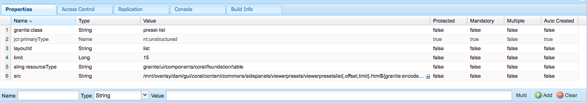

# Administración de recursos {#manage-assets}

| Versión | Vínculo del artículo |
| -------- | ---------------------------- |
| AEM 6.5 | [Haga clic aquí](https://experienceleague.adobe.com/docs/experience-manager-65/assets/managing/manage-assets.html?lang=en) |
| AEM as a Cloud Service | Este artículo |

Este artículo describe cómo administrar y editar recursos en [!DNL Adobe Experience Manager Assets]. Para administrar [!DNL Content Fragments], vea [[!DNL Content Fragments]](content-fragments/content-fragments.md) recursos.

## Crear carpetas {#creating-folders}

Al organizar una colección de recursos (por ejemplo, todas las `Nature` imágenes), puede crear carpetas para mantenerlas juntas. Puede utilizar carpetas para categorizar y organizar los recursos. [!DNL Experience Manager Assets] no requiere que organice los recursos en carpetas para funcionar mejor.

>[!NOTE]
>
>* No se admite el uso compartido de una carpeta Assets del tipo `sling:OrderedFolder` al compartirla en Experience Cloud. Si desea compartir una carpeta, no seleccione [!UICONTROL Ordenado] al crear una carpeta.
>* Experience Manager no permite el uso de la palabra `subassets` como nombre de carpeta. Es una palabra clave reservada para nodos que contienen subrecursos para recursos compuestos

1. Vaya al lugar de la carpeta de recursos digitales en el que desea crear una carpeta. En el menú, haga clic en **[!UICONTROL Crear]**. Seleccione **[!UICONTROL Nueva carpeta]**.
1. En el campo **[!UICONTROL Título]**, proporcione un nombre de carpeta. De forma predeterminada, DAM utiliza el título que ha proporcionado como nombre de la carpeta. Una vez creada la carpeta, puede anular el valor predeterminado y especificar otro nombre de carpeta.
1. Haga clic en **[!UICONTROL Crear]**. La carpeta se mostrará en la carpeta de recursos digitales.

No se admiten los siguientes caracteres (lista de caracteres separados por espacios):

* Un nombre de archivo de recursos no puede contener ninguno de estos caracteres: `* / : [ \\ ] | # % { } ? &`
* El nombre de una carpeta de recursos no puede contener ninguno de estos caracteres: `* / : [ \\ ] | # % { } ? \" . ^ ; + & \t`

## Carga de activos {#uploading-assets}

Consulte [agregar recursos digitales a Experience Manager](add-assets.md).

## Extraer archivos .zip {#extract-zip-archives}

Seleccione los archivos ZIP que se administran en Experience Manager y extraiga los archivos directamente en Experience Manager sin descargarlos.

Para extraer los archivos ZIP, realice los siguientes pasos:

1. Seleccione el tipo de archivo ZIP.
1. Haga clic en la opción **[!UICONTROL Extraer archivo]** disponible en la barra de acciones.
1. Seleccione la carpeta en la que debe guardar los recursos extraídos disponibles en la carpeta comprimida.
1. Haga clic en **[!UICONTROL Siguiente]**.
1. Seleccione el comportamiento adecuado para gestionar los conflictos de nombre de archivo durante la extracción. Puede seleccionar crear una versión de un recurso existente, reemplazar el recurso, mantener ambos recursos en la carpeta de destino u omitir la extracción del nuevo recurso.
1. Haga clic en **[!UICONTROL Extraer]**. Se inicia el proceso de extracción de zip. Una vez completado el proceso, puede ver los recursos extraídos en la carpeta de destino.

   

>[!NOTE]
>
>* El tamaño máximo de archivo ZIP admitido es de 15 GB.
>* Puede extraer un máximo de tres archivos ZIP al mismo tiempo.

## Previsualización de recursos {#previewing-assets}

Para obtener una vista previa de un recurso, siga estos pasos.

1. En la interfaz de usuario de Assets, vaya a la ubicación del recurso que desea previsualizar.
1. Seleccione el recurso que desee para abrirlo.

1. En el modo de vista previa, hay opciones de zoom disponibles para [tipos de imagen compatibles](/help/assets/file-format-support.md) (con edición interactiva).

   Para ampliar un recurso, seleccione `+` (o seleccione la lupa del recurso). Para alejar, seleccione `-`. Al acercar, puede mirar de cerca cualquier área de la imagen si realiza una panorámica. La flecha para restablecer el zoom le devuelve a la vista original.

   Seleccione **[!UICONTROL Restablecer]** para restablecer la vista al tamaño original.

## Editar propiedades {#editing-properties}

1. Vaya a la ubicación del recurso cuyos metadatos desee editar.

1. Seleccione el recurso y seleccione **[!UICONTROL Propiedades]** en la barra de herramientas para ver las propiedades del recurso. También puede elegir la acción rápida **[!UICONTROL Propiedades]** en la tarjeta de recursos.

   

1. En la página [!UICONTROL Propiedades], edite las propiedades de los metadatos en varias fichas. Por ejemplo, en la ficha **[!UICONTROL Básico]**, edite el título, la descripción, etc.

   >[!NOTE]
   >
   >El diseño de la página [!UICONTROL Properties] y las propiedades de metadatos disponibles dependen del esquema de metadatos subyacente. Para obtener información sobre cómo modificar el diseño de la página [!UICONTROL Propiedades], consulte [Esquemas de metadatos](/help/assets/metadata-schemas.md).

1. Para programar una fecha y hora determinada para la activación del recurso, utilice el selector de fechas situado junto al campo **[!UICONTROL Tiempo de activación]**.

   

1. Para desactivar el recurso después de una duración determinada, elija la fecha y la hora de desactivación del selector de fechas situado junto al campo **[!UICONTROL Tiempo de inactividad]**. La fecha de desactivación debe ser posterior a la fecha de activación de un recurso. Transcurrido el [!UICONTROL tiempo de inactividad], un recurso y sus representaciones no estarán disponibles a través de la interfaz web de Assets ni a través de la API HTTP.

   <!--
1. En el campo **[!UICONTROL Etiquetas]**, seleccione una o más etiquetas. Para agregar una etiqueta personalizada, escriba el nombre en el cuadro y seleccione la clave `Enter`. La nueva etiqueta se guardó en [!DNL Experience Manager].

   YouTube requiere que las etiquetas se publiquen y que tengan un vínculo a YouTube (si se encuentra un vínculo adecuado).

   >[!NOTE]
   >
   > Para crear etiquetas, debe tener permiso de escritura en la ruta de acceso `/content/cq:tags/default` del repositorio de CRX.

1. Seleccione **[!UICONTROL Guardar y cerrar]**.

1. Vaya a la interfaz de usuario de Assets. Las propiedades de metadatos editadas, incluidos el título, la descripción y las etiquetas, se muestran en la tarjeta de recursos en la vista de tarjeta y en las columnas relevantes de la vista de lista.

<!-- TBD: Uncomment after verification for Dec release.

## View asset usage and references {#usage-and-references}

[!DNL Experience Manager] lets you track statistics about usage of a digital asset. The usage statistics include the following:

    * Number of times the asset was viewed or downloaded
    * Channels/devices through which the asset was used
    * Creative solutions where the asset was recently used

To view usage statistics for an asset, in the [!UICONTROL Properties] page, click the **[!UICONTROL Insights]** tab. For more details, see [Assets Insights](assets-insights.md).

[!DNL Experience Manager] also lets you check all the incoming references to an asset, that is, the usage of an asset in remote [!DNL Sites] and in compound assets. Authors of webpages on [!DNL Experience Manager Sites] deployment can use an asset on a remote [!DNL Assets] deployment using the Connected Assets functionality. The [!UICONTROL References] tab in an asset's [!UICONTROL Properties] page lists the local and remote references of the asset. That is, the use of assets in compound assets in [!DNL Assets] and its use in remote [!DNL Sites] pages.

-->

## Copiar recursos {#copying-assets}

Al copiar un recurso o una carpeta, se copia todo el recurso o la carpeta, junto con su estructura de contenido. Un recurso o una carpeta copiados están duplicados en la ubicación de destino. El recurso en la ubicación de origen no se modifica.

Algunos atributos que son únicos de una copia concreta de un recurso no se transfieren. Algunos ejemplos son:

* ID de recurso, fecha y hora de creación, y versiones e historial de versiones. Algunas de estas propiedades están indicadas por las propiedades `jcr:uuid`, `jcr:created` y `cq:name`.

* La hora de creación y las rutas referenciadas son únicas para cada recurso y cada una de sus representaciones.

Se conservan las demás propiedades e información de metadatos. No se crea una copia parcial al copiar un recurso.

1. En la interfaz de usuario de Assets, seleccione uno o varios recursos y, a continuación, seleccione el icono **[!UICONTROL Copiar]** en la barra de herramientas. También puede seleccionar la acción rápida **[!UICONTROL Copiar]**  de la tarjeta de recursos.

   >[!NOTE]
   >
   >Si usa la acción rápida [!UICONTROL Copiar], solo podrá copiar un recurso a la vez.

1. Vaya a la ubicación en la que desea copiar los recursos.

   >[!NOTE]
   >
   >Si copia un recurso en la misma ubicación, [!DNL Experience Manager] genera automáticamente una variación del nombre. Por ejemplo, si copia un recurso con el título `Square`, [!DNL Experience Manager] genera automáticamente el título de su copia como `Square1`.

1. Haga clic en el icono de recurso **[!UICONTROL Pegar]** de la barra de herramientas. Los Assets se copian en esta ubicación.

   <!---->

   >[!NOTE]
   >
   >El icono **[!UICONTROL Pegar]** está disponible en la barra de herramientas hasta que finalice la operación de pegado.

### Mover recursos o cambiarles el nombre {#moving-or-renaming-assets}

1. Desplácese hasta la ubicación del recurso que desee mover.

1. Seleccione el recurso y seleccione el icono **[!UICONTROL Mover]**  de la barra de herramientas.

1. En el asistente Mover Assets, realice una de las siguientes acciones:

   * Especifique el nombre del recurso una vez que se haya movido. A continuación, seleccione **[!UICONTROL Siguiente]** para continuar.

   * Seleccione **[!UICONTROL Cancelar]** para detener el proceso.

   >[!NOTE]
   >
   >* Puede especificar el mismo nombre para el recurso si no hay ningún recurso con ese nombre en la nueva ubicación. Sin embargo, debe utilizar un nombre diferente si mueve el recurso a una ubicación en la que exista un recurso con el mismo nombre. Si utiliza el mismo nombre, el sistema genera automáticamente una variación del nombre. Por ejemplo, si el recurso tiene el nombre Cuadrado, el sistema genera el nombre Cuadrado1 para su copia.
   >* Al cambiar el nombre, no se permiten espacios en blanco en el nombre del archivo.

1. En el cuadro de diálogo **[!UICONTROL Seleccionar destino]**, realice una de las siguientes acciones:

   * Vaya a la nueva ubicación de los recursos y, a continuación, seleccione **[!UICONTROL Siguiente]** para continuar.

   * Seleccione **[!UICONTROL Atrás]** para volver a la pantalla **[!UICONTROL Cambiar nombre]**.

1. Si los recursos que se están moviendo tienen páginas, recursos o colecciones de referencia, la ficha **[!UICONTROL Ajustar referencias]** aparece junto a la ficha **[!UICONTROL Seleccionar destino]**.

   Realice una de las siguientes acciones en la pantalla **[!UICONTROL Ajustar referencias]**:

   * Especifique las referencias que se van a ajustar en función de los nuevos detalles y, a continuación, seleccione **[!UICONTROL Mover]** para continuar.

   * En la columna **[!UICONTROL Ajustar]**, seleccione o anule la selección de referencias a los recursos.
   * Seleccione **[!UICONTROL Atrás]** para volver a la pantalla **[!UICONTROL Seleccionar destino]**.

   * Seleccione **[!UICONTROL Cancelar]** para detener la operación de movimiento.

   Si no actualiza las referencias, seguirán apuntando a la ruta anterior del recurso. Si ajusta las referencias, se actualizan a la nueva ruta del recurso.

### Administrar representaciones {#managing-renditions}

1. Puede agregar o quitar representaciones de un recurso, excepto el original. Vaya a la ubicación del recurso para el que desea agregar o quitar representaciones.

1. Seleccione el recurso para abrir su página de recursos.

   <!---->

1. Seleccione el icono GlobalNav y seleccione **[!UICONTROL Representaciones]** en la lista.

   

1. En el panel **[!UICONTROL Representaciones]**, vea la lista de representaciones generadas para el recurso.

   

   >[!NOTE]
   >
   >De manera predeterminada, [!DNL Experience Manager Assets] no muestra la representación original del recurso en el modo de vista previa. Si es administrador, puede usar superposiciones para configurar [!DNL Assets] de modo que se muestren las representaciones originales en el modo de vista previa.

1. Seleccione una representación para verla o eliminarla.

   **Eliminando una representación**

   Seleccione una representación en el panel **[!UICONTROL Representaciones]** y, a continuación, seleccione el icono **[!UICONTROL Eliminar representación]** de la barra de herramientas. Las representaciones no se pueden eliminar por lotes una vez completado el procesamiento del recurso. Para los recursos individuales, puede eliminar las representaciones manualmente desde la interfaz de usuario. Para varios recursos, puede personalizar [!DNL Experience Manager] para eliminar representaciones específicas o eliminar los recursos y volver a cargar los recursos eliminados.

   

   **Cargando una nueva representación**

   Vaya a la página de detalles del recurso y seleccione el icono **[!UICONTROL Agregar representación]** en la barra de herramientas para cargar una nueva representación para el recurso.

   <!---->

   >[!NOTE]
   >
   >Si selecciona una representación en el panel **[!UICONTROL Representaciones]**, la barra de herramientas cambia de contexto y muestra solo las acciones que son relevantes para la representación. Las opciones, como el icono Cargar representación, no se muestran. Para ver estas opciones en la barra de herramientas, vaya a la página de detalles del recurso.

   Puede configurar las dimensiones de la representación que desee que se muestren en la página de detalles de un recurso de imagen o vídeo. En función de las dimensiones que especifique, Assets muestra la representación con las dimensiones exactas o más cercanas.

   No puede crear representaciones con los prefijos siguientes, ya que son internos de Adobe:

   * cq5

   * cqdam

   * cq5dam

   Para configurar las dimensiones de representación de una imagen en el nivel de detalle del recurso, superponga el `renditionpicker` nodo (`libs/dam/gui/content/assets/assetpage/jcr:content/body/content/content/items/assetdetail/items/col1/items/assetview/renditionpicker`) y configure el valor de la propiedad de anchura. Configure el **[!UICONTROL tamaño de la propiedad (Long) en KB]** en lugar de la anchura para personalizar la representación en la página de detalles del recurso según el tamaño de la imagen. En el caso de la personalización basada en el tamaño, la propiedad `preferOriginal` asigna preferencia al original si el tamaño de la representación coincidente es mayor que el del original.

   Del mismo modo, puede personalizar la imagen de la página Anotación superponiendo `libs/dam/gui/content/assets/annotate/jcr:content/body/content/content/items/content/renditionpicker`.

   <!---->

   Para configurar las dimensiones de representación de un recurso de vídeo, vaya al nodo `videopicker` en el repositorio de CRX en la ubicación `/libs/dam/gui/content/assets/assetpage/jcr:content/body/content/content/items/assetdetail/items/col1/items/assetview/videopicker`, superponga el nodo y, a continuación, edite la propiedad adecuada.

   >[!NOTE]
   >
   >Las anotaciones de vídeo solo se admiten en navegadores con formatos de vídeo compatibles con HTML5. Además, según el explorador, se admiten diferentes formatos de vídeo. Sin embargo, el formato de vídeo MXF aún no es compatible con las anotaciones de vídeo.

## Eliminar recursos {#delete-assets}

Para resolver o quitar las referencias entrantes de otras páginas, actualice las referencias relevantes antes de eliminar un recurso.

Además, deshabilite el botón de eliminación forzada mediante una superposición para impedir que los usuarios eliminen los recursos a los que se hace referencia y dejen los vínculos rotos.

1. Desplácese hasta la ubicación de los recursos que desee eliminar.

1. Seleccione el recurso y haga clic en **[!UICONTROL Eliminar]**  en la barra de herramientas.

1. En el cuadro de diálogo de confirmación, haga clic en:

   * **[!UICONTROL Cancelar]** para detener la acción
   * **[!UICONTROL Eliminar]** para confirmar la acción:

      * Si el recurso no tiene referencias, se elimina.
      * Si el recurso tiene referencias, un mensaje de error le informa de que se hace referencia a **[!UICONTROL Uno o más recursos]**. Puede seleccionar **[!UICONTROL Forzar eliminación]** o **[!UICONTROL Cancelar]**.

   >[!NOTE]
   >
   >Se necesitan permisos de eliminación en DAM/Asset para poder eliminar un recurso. Si solo tiene permisos de modificación, solo puede editar los metadatos del recurso y agregar anotaciones al recurso. Sin embargo, no puede eliminar el recurso ni sus metadatos.

   >[!NOTE]
   >
   >Para resolver o quitar las referencias entrantes de otras páginas, actualice las referencias relevantes antes de eliminar un recurso. Puede no permitir la eliminación de recursos a los que se hace referencia, ya que provoca vínculos rotos. Deshabilite el botón de eliminación forzada mediante una superposición.

## Descarga de recursos {#download-assets}

Ver [descargar recursos desde [!DNL Experience Manager]](/help/assets/download-assets-from-aem.md).

## Publicar o cancelar la publicación de recursos {#publish-assets}

1. Vaya a la ubicación del recurso o la carpeta de recursos que desee publicar o quitar del entorno de publicación (cancelar publicación).

1. Seleccione el recurso o la carpeta que desea publicar o cancelar la publicación y seleccione la opción **[!UICONTROL Administrar publicación]**  en la barra de herramientas. Como alternativa, para publicar rápidamente, seleccione la opción **[!UICONTROL Publicación rápida]** en la barra de herramientas. Si la carpeta que desea publicar incluye una carpeta vacía, esta no se publicará.

1. Seleccione la opción **[!UICONTROL Publicar]** o **[!UICONTROL Cancelar la publicación]** según sea necesario.

   
   *Imagen: opciones de publicación y cancelación de publicación y la opción de programación.*

1. Seleccione **[!UICONTROL Ahora]** para actuar sobre el recurso de inmediato o seleccione **[!UICONTROL Más tarde]** para programar la acción. Seleccione una fecha y una hora si elige la opción **[!UICONTROL Más tarde]**. Haga clic en **[!UICONTROL Siguiente]**.

1. Al publicar, si un recurso hace referencia a otros recursos, sus referencias se enumeran en el asistente. Solo se muestran las referencias que no se han publicado o que se han modificado desde la última publicación. Elija las referencias que desea publicar.

1. Al cancelar la publicación, si un recurso hace referencia a otros recursos, elija las referencias que desea cancelar la publicación. Haga clic en **[!UICONTROL Cancelar la publicación]**. En el cuadro de diálogo de confirmación, haga clic en **[!UICONTROL Cancelar]** para detener la acción o haga clic en **[!UICONTROL Cancelar la publicación]** para confirmar que se cancelará la publicación de los recursos en la fecha especificada.

Conozca las siguientes limitaciones y sugerencias relacionadas con la publicación o cancelación de publicación de recursos o carpetas:

* La opción [!UICONTROL Administrar publicación] solo está disponible para las cuentas de usuario que tienen permisos de replicación.
* Al cancelar la publicación de un recurso complejo, cancele la publicación solo del recurso. Evite cancelar la publicación de las referencias, ya que otros recursos publicados pueden hacer referencia a ellas.
* Las carpetas vacías no se publican.
* Si publica un recurso en proceso, solo se publica el contenido original. Faltan las representaciones. Espere a que se complete el procesamiento y, a continuación, publique o vuelva a publicar el recurso una vez finalizado el procesamiento.

## Grupo de usuarios cerrado {#closed-user-group}

Se usa un grupo de usuarios cerrado (CUG) para limitar el acceso a carpetas de recursos específicas publicadas desde [!DNL Experience Manager]. Si crea un CUG para una carpeta, el acceso a la carpeta (incluidos los recursos y subcarpetas de la carpeta) está restringido únicamente a los miembros o grupos asignados. Para acceder a la carpeta, deben iniciar sesión con sus credenciales de seguridad.

Los CUG son una forma adicional de restringir el acceso a sus recursos. También puede configurar una página de inicio de sesión para la carpeta.

1. Seleccione una carpeta en la interfaz de usuario de Assets y, en la barra de herramientas, seleccione Propiedades para mostrar la página de propiedades.
1. En la ficha **[!UICONTROL Permisos]**, agregue miembros o grupos en **[!UICONTROL Grupo de usuarios cerrado]**.

   

1. Para mostrar una pantalla de inicio de sesión cuando los usuarios accedan a la carpeta, seleccione la opción **[!UICONTROL Habilitar]**. A continuación, seleccione la ruta de acceso a una página de inicio de sesión en [!DNL Experience Manager] y guarde los cambios.

   

   >[!NOTE]
   >
   >Si no especifica la ruta de acceso a una página de inicio de sesión, [!DNL Experience Manager] muestra la página de inicio de sesión predeterminada en la instancia de publicación.

1. Publique la carpeta e intente obtener acceso a ella desde la instancia de publicación. Se muestra una pantalla de inicio de sesión.
1. Si es miembro de CUG, introduzca sus credenciales de seguridad. La carpeta se mostrará después de que [!DNL Experience Manager] lo autentique.

## Buscar recursos {#search-assets}

La búsqueda de recursos es fundamental para el uso de un sistema de administración de recursos digitales, ya sea para su uso posterior por parte de los creativos, para una administración sólida de los recursos por parte de los usuarios y los especialistas en marketing, o para la administración por parte de los administradores de DAM.

Para realizar búsquedas simples, avanzadas y personalizadas con el fin de descubrir y utilizar los recursos más apropiados, consulte [buscar recursos en [!DNL Experience Manager]](/help/assets/search-assets.md).

## Acciones rápidas {#quick-actions}

Los iconos de acción rápida están disponibles para un solo recurso a la vez. Según el dispositivo, realice las siguientes acciones para mostrar los iconos de acción rápida:

* Dispositivos táctiles: toque y mantenga presionado. Por ejemplo, en una iPad, puede seleccionar y mantener presionado un recurso para que se muestren las acciones rápidas.
* Dispositivos no táctiles: Pase el puntero por encima. Por ejemplo, en un dispositivo de escritorio, se muestra la barra de acciones rápidas si pasa el puntero sobre la miniatura del recurso.

<!-- Hiding this topic via cqdoc-18707

## Edit images {#editing-images}

The editing tools in the [!DNL Experience Manager Assets] interface let you perform small editing jobs on image assets. You can crop, rotate, flip, and perform other editing jobs on images. You can also add image maps to assets.

>[!NOTE]
>
>For some components, the Full Screen mode has additional options available.

1. Do one of the following to open an asset in edit mode:

    * Select the asset and then select the **[!UICONTROL Edit]** icon in the toolbar.
    * Select the **[!UICONTROL Edit]** icon that appears on an asset in the Card view.
    * In the asset page, select the **[!UICONTROL Edit]** icon in the toolbar.

   

1. To crop the image, select the **Crop** icon.

   

1. Select the desired option from the list. The crop area appears on the image based on the option you choose. The **Free Hand** option lets you crop the image without any aspect ratio restrictions.

   

1. Select the area to be cropped, and resize or reposition it on the image.
1. Use the **Finish** icon (top right corner) to crop the image. Clicking the **Finish** icon also triggers the regeneration of renditions.

   

1. Use the **Undo** and **Redo** icons on the top right to revert to the uncropped image or retain the cropped image, respectively.

   

1. Select the appropriate Rotate icon to rotate the image clockwise or anti-clockwise.

   

1. Select the appropriate Flip icon to flip the image horizontally or vertically.

   

1. Select the **Finish** icon to save the changes.

   

>[!NOTE]
>
>Image editing is supported for BMP, GIF, PNG, and JPEG files formats.

>[!NOTE]
>
>To edit a TXT file, set **Day CQ Link Externalizer** from Configuration Manager.
-->

## Escala de cronología {#timeline}

La cronología permite ver varios eventos para un elemento seleccionado, como flujos de trabajo activos para un recurso, comentarios/anotaciones, registros de actividad y versiones.


*Figura: Ordenar entradas de cronología para un recurso*

>[!NOTE]
>
>En la consola [Colecciones](/help/assets/manage-collections.md#navigate-the-collections-console), la lista **[!UICONTROL Mostrar todo]** proporciona opciones para ver solamente comentarios y flujos de trabajo. Además, la cronología solo se muestra para las colecciones de nivel superior que aparecen en la consola. No se muestra si navega dentro de cualquiera de las colecciones.

>[!NOTE]
>
>La cronología contiene varias [opciones específicas de los fragmentos de contenido](content-fragments/content-fragments.md).

## Anotar recursos {#annotating}

Las anotaciones son comentarios o notas explicativas que se agregan a imágenes o vídeos. Las anotaciones permiten a los especialistas en marketing colaborar y dejar comentarios sobre los recursos.

Las anotaciones de vídeo solo se admiten en exploradores con formatos de vídeo compatibles con HTML5. Los formatos de vídeo compatibles con Assets dependen del explorador. Sin embargo, el formato de vídeo MXF aún no es compatible con las anotaciones de vídeo.

>[!NOTE]
>
>Para los fragmentos de contenido, se crean [anotaciones en el editor de fragmentos](content-fragments/content-fragments.md).

1. Vaya a la ubicación del recurso al que desea agregar anotaciones.
1. Seleccione el icono **[!UICONTROL Anotar]** de una de las siguientes opciones:

   * [Acciones rápidas](#quick-actions)
   * En la barra de herramientas después de seleccionar el recurso o navegar a la página del recurso

   <!---->

1. Agregue un comentario en el cuadro **[!UICONTROL Comentario]** de la parte inferior de la cronología. También puede marcar un área de la imagen y agregar una anotación en el cuadro de diálogo **[!UICONTROL Agregar anotación]**.

<!-- -->

<!--
1. To notify a user about an annotation, specify the email address of the user and add the comment. For example, to notify Aaron MacDonald about an annotation, enter @aa. Hints for all matching users is displayed in a list. Select Aaron's email address from the list to tag her with the comment. Similarly, you can tag more users anywhere within the annotation or before or after it.
-->

>[!NOTE]
>
>Para un usuario que no es administrador, las sugerencias aparecen únicamente si el usuario tiene permisos de lectura en `/home` en CRXDE.

<!---->

1. Después de agregar la anotación, haga clic en **[!UICONTROL Agregar]** para guardarla. Se envía una notificación para la anotación a Aaron.

   <!---->

   >[!NOTE]
   >
   >Puede añadir varias anotaciones antes de guardarlas.

1. Seleccione **[!UICONTROL Cerrar]** para salir del modo Anotación.
1. Para ver la notificación, inicia sesión en Assets con las credenciales de Aaron MacDonald&#39;s y haz clic en el icono **[!UICONTROL Notificaciones]** para ver la notificación.

   >[!NOTE]
   >
   >Las anotaciones también se pueden añadir a los recursos de vídeo. Al realizar anotaciones en vídeos, el reproductor realiza pausas para permitirle realizar anotaciones en un fotograma. Para obtener más información, consulte [administración de recursos de vídeo](manage-video-assets.md). Sin embargo, el formato de vídeo MXF aún no es compatible con las anotaciones de vídeo.

1. Para elegir un color diferente para poder diferenciar entre usuarios, seleccione el icono Perfil y seleccione **[!UICONTROL Mis preferencias]**.

   <!---->

   Especifique el color que desee en el cuadro **[!UICONTROL Color de anotación]** y, a continuación, seleccione **[!UICONTROL Aceptar]**.

<!-- -->

>[!NOTE]
>
>También puede agregar anotaciones a una colección. Sin embargo, si una colección contiene colecciones secundarias, sólo puede agregar anotaciones o comentarios a la colección principal. La opción Anotar no está disponible para colecciones secundarias.

### Ver anotaciones guardadas {#viewing-saved-annotations}

Solo puede ver una anotación a la vez.

>[!NOTE]
>
>Si selecciona varias anotaciones, se podrá ver la anotación más reciente en la interfaz de usuario.
>
>La selección múltiple solo es compatible para imprimir el recurso anotado como PDF.

1. Para ver las anotaciones guardadas de un recurso, vaya a la ubicación del recurso y abra la página del recurso.

1. Seleccione el icono GlobalNav y elija **[!UICONTROL Cronología]** en la lista.

   <!---->

1. En la lista **[!UICONTROL Mostrar todo]** de la cronología, seleccione **[!UICONTROL Comentarios]** para filtrar los resultados según las anotaciones.

   <!---->

   Seleccione un comentario en el panel **[!UICONTROL Cronología]** para ver la anotación correspondiente en la imagen.

   <!---->

   Seleccione **[!UICONTROL Eliminar]** para eliminar un comentario en particular.

### Imprimir anotaciones {#printing-annotations}

Si un recurso tiene anotaciones o ha sido sometido a un flujo de trabajo de revisión, puede imprimir el recurso junto con anotaciones y revisar el estado como archivo PDF para su revisión sin conexión.

También puede elegir imprimir solo las anotaciones o revisar el estado.

>[!NOTE]
>
>Puede seleccionar varias anotaciones al imprimir el recurso anotado como PDF.

Para imprimir las anotaciones y revisar el estado, seleccione el icono **[!UICONTROL Imprimir]** y siga las instrucciones del asistente. El icono **[!UICONTROL Imprimir]** solo aparece en la barra de herramientas cuando el recurso tiene al menos un estado de anotación o revisión asignado.

1. En la interfaz de usuario de Assets, abra la página de vista previa de un recurso.
1. Realice una de las siguientes acciones:

   * Para imprimir todas las anotaciones y el estado de revisión, omita el paso 3 y vaya directamente al paso 4.
   * Para imprimir anotaciones específicas y revisar el estado, abra la [cronología](/help/assets/manage-digital-assets.md#timeline) y, a continuación, vaya al paso 3.

1. Para imprimir anotaciones específicas, selecciónelas en la cronología.

   <!---->

   Para imprimir solo el estado de la revisión, selecciónelo en la cronología.

   <!---->

1. Seleccione el icono **[!UICONTROL Imprimir]** de la barra de herramientas.

   <!---->

1. En el cuadro de diálogo Imprimir, elija la posición en la que desea que se muestre el estado de las anotaciones o la revisión en PDF. Por ejemplo, si desea que las anotaciones o el estado se impriman en la parte superior derecha de la página que contiene la imagen impresa, utilice la configuración **Superior izquierda**. Está seleccionada de forma predeterminada.

   <!---->

   Puede elegir otros ajustes en función de la posición en la que desea que aparezcan las anotaciones o el estado en el PDF impreso. Si desea que las anotaciones o el estado aparezcan en una página independiente del recurso impreso, elija **[!UICONTROL Página siguiente]**.

1. Haga clic en **[!UICONTROL Imprimir]**. Según la opción elegida en el paso 2, el PDF generado muestra las anotaciones/el estado en la posición especificada. Por ejemplo, si elige imprimir las anotaciones y el estado de la revisión mediante la configuración **Superior izquierda**, la salida generada se parece al archivo PDF que se muestra aquí.

   <!---->

1. Descargue o imprima PDF con las opciones de la parte superior derecha.

   <!---->

   Para modificar el aspecto del archivo de PDF procesado, por ejemplo, el color de fuente, el tamaño y el estilo, el color de fondo de los comentarios y los estados, abra la **[!UICONTROL configuración de Annotation PDF]** del Administrador de configuración y modifique las opciones que desee. Por ejemplo, para cambiar el color de visualización del estado aprobado, modifique el código de color en el campo correspondiente. Para obtener información sobre cómo cambiar el color de fuente de las anotaciones, consulte [Anotar](/help/assets/manage-digital-assets.md#annotating).

   Vuelva al archivo de PDF procesado y actualícelo. La PDF actualizada refleja los cambios realizados.

## Creación de versiones de recursos {#asset-versioning}

El control de versiones crea una instantánea de los recursos digitales en un momento específico. El uso de versiones ayuda a restaurar los recursos a un estado anterior más adelante. Por ejemplo, si desea deshacer un cambio realizado en un recurso, restaure la versión sin editar del recurso.

Los siguientes son escenarios en los que se crean versiones:

* Las imágenes se modifican en una aplicación diferente y se cargan en Assets. Se crea una versión de la imagen para que la imagen original no se sobrescriba.
* Los metadatos de un recurso se editan.
* La aplicación de escritorio [!DNL Experience Manager] se usa para desproteger un recurso existente y guardar los cambios. Se crea una nueva versión cada vez que se guarda el recurso.

También puede activar el control automático de versiones mediante un flujo de trabajo. Al crear una versión para un recurso, los metadatos y las representaciones se guardan junto con la versión. Las representaciones son alternativas procesadas de las mismas imágenes, por ejemplo, una representación en PNG de un archivo JPEG cargado.

La funcionalidad de control de versiones permite hacer lo siguiente:

* Cree una versión de un recurso.
* Permite ver la revisión actual de un recurso.
* Restaure el recurso a una versión anterior.

1. Vaya a la ubicación del recurso para el que desea crear una versión y selecciónelo para abrir su página de recursos.

1. Seleccione el icono GlobalNav y elija **[!UICONTROL Cronología]** en el menú.

   

1. Seleccione el icono **[!UICONTROL Acciones]** (flecha) en la parte inferior para ver las acciones disponibles que puede realizar en el recurso.

   <!---->

1. Seleccione **[!UICONTROL Guardar como versión]** para crear una versión para el recurso.

<!---->

1. Agregue una etiqueta y un comentario y, a continuación, haga clic en **[!UICONTROL Crear]** para crear una versión. También puede seleccionar **Cancelar** para salir de la operación.

   <!---->

1. Para ver la nueva versión, abra la lista **[!UICONTROL Mostrar todo]** en la cronología de la página de detalles de recursos o de la interfaz de usuario de recursos y elija **[!UICONTROL Versiones]**. Todas las versiones creadas para un recurso se muestran en la pestaña de cronología. Puede filtrar la lista para mostrar Versiones, haciendo clic en la flecha de colocación y seleccionando **[!UICONTROL Versiones]** en la lista.

   

1. Seleccione una versión específica para el recurso para previsualizarlo o permitir que aparezca en la interfaz de usuario de Assets.

   

1. Añada una etiqueta y un comentario para que la versión vuelva a la versión concreta en la interfaz de usuario de Assets.

   

1. Para generar una vista previa de la versión, seleccione **[!UICONTROL Vista previa de la versión]**.
1. Para mostrar esta versión en la interfaz de usuario de Assets, seleccione **[!UICONTROL Revertir a esta versión]**.
1. Para comparar entre dos versiones, vaya a la página del recurso y seleccione la versión que desea comparar con la versión actual.

   

1. En la cronología, seleccione la versión que desee comparar y arrastre el control deslizante hacia la izquierda para superponer esta versión sobre la versión actual y comparar.

   

### Iniciar un flujo de trabajo en un recurso {#starting-a-workflow-on-an-asset}

1. Vaya a la ubicación del recurso para el que desea iniciar un flujo de trabajo y seleccione el recurso para abrir la página del recurso.
1. Seleccione el icono GlobalNav y elija **[!UICONTROL Cronología]** en el menú para mostrar la cronología.

   

1. Seleccione el icono **[!UICONTROL Acciones]** (flecha) en la parte inferior para abrir la lista de acciones disponibles para el recurso.

   <!---->

1. Seleccione **[!UICONTROL Iniciar flujo de trabajo]** de la lista.

   <!---->

1. En el cuadro de diálogo **[!UICONTROL Iniciar flujo de trabajo]**, seleccione un modelo de flujo de trabajo de la lista.

   <!---->

1. (Opcional) Especifique un título para el flujo de trabajo, que se puede utilizar para hacer referencia a la instancia de flujo de trabajo.

   <!---->

1. Seleccione **[!UICONTROL Iniciar]** y, a continuación, seleccione **[!UICONTROL Continuar]** en el cuadro de diálogo para confirmar. Cada paso del flujo de trabajo se muestra en la cronología como un evento.

   <!---->

## Colecciones {#collections}

Una colección es un conjunto ordenado de recursos. Utilice las colecciones para compartir recursos entre los usuarios.

* Una colección puede incluir recursos de diferentes ubicaciones porque solo contienen referencias a estos recursos. Cada colección mantiene la integridad referencial de los recursos.
* Puede compartir colecciones con varios usuarios con diferentes niveles de privilegios, como editar, ver, etc.

Para obtener información detallada sobre la administración de colecciones, consulte [administrar colecciones](/help/assets/manage-collections.md).

## Ocultar recursos caducados al ver recursos en la aplicación de escritorio o Adobe Asset Link {#hide-expired-assets-via-acp-api}

La aplicación de escritorio [!DNL Experience Manager] permite el acceso al repositorio DAM desde Windows o Mac Desktop. Adobe Asset Link permite el acceso a los recursos desde las aplicaciones de escritorio de [!DNL Creative Cloud] admitidas.

Al examinar los recursos desde la interfaz de usuario de [!DNL Experience Manager], no se muestran los recursos caducados. Para evitar ver, buscar y recuperar recursos caducados al examinar recursos desde la aplicación de escritorio y Asset Link, los administradores pueden realizar la siguiente configuración. La configuración funciona para todos los usuarios, independientemente del privilegio de administrador.

Ejecute el siguiente comando CURL. Asegúrese de que los usuarios que tengan acceso a los recursos tengan acceso de lectura a `/conf/global/settings/dam/acpapi/`. Los usuarios que forman parte del grupo `dam-user` tienen el permiso de forma predeterminada.

```curl
curl -v -u admin:admin --location --request POST 'http://localhost:4502/conf/global/settings/dam/acpapi/configuration/_jcr_content' \
--header 'Content-Type: application/x-www-form-urlencoded' \
--data-urlencode 'jcr:title=acpapiconfig' \
--data-urlencode 'hideExpiredAssets=true' \
--data-urlencode 'hideExpiredAssets@TypeHint=Boolean' \
--data-urlencode 'jcr:primaryType=nt:unstructured' \
--data-urlencode '../../jcr:primaryType=sling:Folder'
```

Para obtener más información, consulte cómo [examinar recursos DAM mediante la aplicación de escritorio](https://experienceleague.adobe.com/docs/experience-manager-desktop-app/using/using.html#browse-search-preview-assets) y [cómo utilizar Adobe Asset Link](https://helpx.adobe.com/enterprise/admin-guide.html/enterprise/using/manage-assets-using-adobe-asset-link.ug.html).

**Consulte también**

* [Traducir recursos](translate-assets.md)
* [API HTTP de recursos](mac-api-assets.md)
* [Formatos de archivo compatibles con recursos](file-format-support.md)
* [Buscar recursos](search-assets.md)
* [Recursos de red](use-assets-across-connected-assets-instances.md)
* [Informes de recurso](asset-reports.md)
* [Esquemas de metadatos](metadata-schemas.md)
* [Descarga de recursos](download-assets-from-aem.md)
* [Administración de metadatos](manage-metadata.md)
* [Facetas de búsqueda](search-facets.md)
* [Administrar colecciones](manage-collections.md)
* [Importación masiva de metadatos](metadata-import-export.md)
* [Publicación de recursos en AEM y Dynamic Media](/help/assets/publish-assets-to-aem-and-dm.md)
