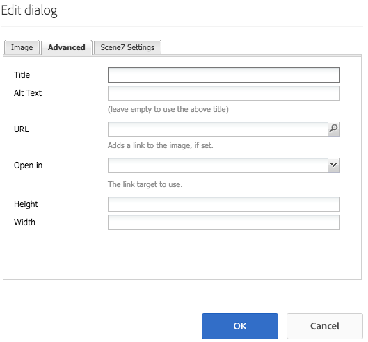
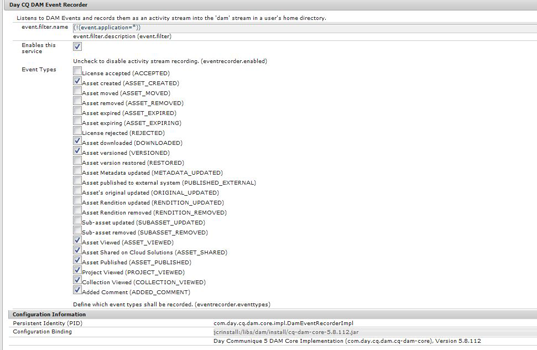

# Manage assets {#manage-assets}

En este artículo se describe cómo administrar y editar recursos en Recursos Adobe Experience Manager (AEM). Para administrar fragmentos de contenido, consulte Recursos de fragmentos [de contenido](content-fragments/content-fragments.md) .

## Crear carpetas {#creating-folders}

Al organizar una colección de recursos, por ejemplo, todas `Nature` las imágenes, puede crear carpetas para mantenerlas juntas. Puede utilizar carpetas para categorizar y organizar los recursos. Recursos AEM no requiere que organice los recursos en carpetas para que funcionen mejor.

>[!NOTE]
>
>Compartir una carpeta de recursos del tipo `sling:OrderedFolder`, no se admite al compartir en Marketing Cloud. Si desea compartir una carpeta, no seleccione [!UICONTROL Pedido] al crear una carpeta.

1. Vaya al lugar de la carpeta de recursos digitales en el que desea crear una nueva carpeta. En el menú, haga clic en **[!UICONTROL Crear]**. Seleccione **[!UICONTROL Nueva carpeta]**.
1. En el campo **[!UICONTROL Título]** , especifique un nombre de carpeta. De forma predeterminada, DAM utiliza el título que ha proporcionado como nombre de carpeta. Una vez creada la carpeta, puede anular el valor predeterminado y especificar otro nombre de carpeta.
1. Haga clic en **[!UICONTROL Crear]**. La carpeta se muestra en la carpeta de recursos digitales.

No se admiten los siguientes caracteres (lista de caracteres separados por espacios):

* Un nombre de archivo de recurso no puede contener ninguno de estos caracteres: `* / : [ \\ ] | # % { } ? &`
* El nombre de una carpeta de recursos no puede contener ninguno de estos caracteres: `* / : [ \\ ] | # % { } ? \" . ^ ; + & \t`

## Upload assets {#uploading-assets}

Consulte [Adición de recursos digitales a Experience Manager](add-assets.md)para obtener información detallada.

## Vista previa de recursos {#previewing-assets}

Para obtener una vista previa de un recurso, siga estos pasos.

1. En la interfaz de usuario de Recursos, navegue hasta la ubicación del recurso cuya vista previa desee obtener.
1. Toque el recurso que desee para abrirlo.

1. En el modo de vista previa, las opciones de zoom están disponibles para los tipos [de imagen](/help/assets/file-format-support.md) admitidos (con edición interactiva).

   Para acercar un recurso, toque o haga clic en `+` (o toque o haga clic en la lupa del recurso). Para alejar, toque o haga clic en `-`. Al acercar, puede ver con detenimiento cualquier área de la imagen. La flecha para restablecer el zoom le lleva de nuevo a la vista original.

   Toque **[!UICONTROL Restablecer]** para restablecer el tamaño original de la vista.

## Editar propiedades {#editing-properties}

1. Navegue a la ubicación del recurso cuyos metadatos desee editar.

1. Seleccione el recurso y toque o haga clic en **[!UICONTROL Propiedades]** en la barra de herramientas para ver sus propiedades. También puede seleccionar la acción rápida **[!UICONTROL Propiedades]** en la tarjeta de recursos.

   

1. En la página [!UICONTROL Propiedades] , edite las propiedades de metadatos en varias fichas. Por ejemplo, en la ficha **[!UICONTROL Básico]** , edite el título, la descripción, etc.

   >[!NOTE]
   >
   >El diseño de la página [!UICONTROL Propiedades] y las propiedades de metadatos disponibles dependen del esquema de metadatos subyacente. Para obtener información sobre cómo modificar el diseño de la página [!UICONTROL Propiedades] , consulte Esquemas [de metadatos](/help/assets/metadata-schemas.md).

1. Para programar una fecha y hora determinada para la activación del recurso, utilice el selector de fechas situado junto al campo **[!UICONTROL Tiempo de activación]**.

   

1. Para desactivar el recurso después de una duración determinada, elija la fecha y hora de desactivación en el selector de fechas situado junto al campo Tiempo de **[!UICONTROL desactivación]** . La fecha de desactivación debe ser posterior a la fecha de activación de un recurso. Después del tiempo de [!UICONTROL inactividad], un recurso y sus representaciones no están disponibles ni a través de la interfaz web de Recursos ni a través de la API HTTP.

   

1. En el campo **[!UICONTROL Etiquetas]** , seleccione una o varias etiquetas. Para agregar una etiqueta personalizada, escriba el nombre de la etiqueta en el cuadro y pulse la tecla Intro. La nueva etiqueta se guarda en AEM.

   YouTube requiere que las etiquetas publiquen y tengan un vínculo a YouTube (si se encuentra un vínculo adecuado).

   >[!NOTE]
   >
   >Para crear etiquetas, debe tener permiso de escritura en la ruta de acceso `/content/cq:tags/default` del repositorio de CRX.

1. Para ver las estadísticas de uso del recurso, toque o haga clic en la ficha **[!UICONTROL Perspectivas]** .

   Las estadísticas de uso incluyen lo siguiente:

   * Número de veces que se ha visualizado o descargado el recurso
   * Canales/dispositivos a través de los cuales se utilizó el recurso
   * Soluciones creativas en las que el recurso se ha utilizado recientemente
   Para obtener más información, consulte Perspectivas [de recursos](assets-insights.md).

1. Toque o haga clic en **[!UICONTROL Guardar y cerrar]**.

1. Vaya a la interfaz de usuario de Recursos. Las propiedades de metadatos editadas, incluido el título, la descripción y las etiquetas, se muestran en la tarjeta del recurso en la vista de tarjeta y en las columnas relevantes de la vista de lista.

## Copiar recursos {#copying-assets}

Al copiar un recurso o una carpeta, se copia todo el recurso o la carpeta, junto con su estructura de contenido. Un recurso copiado o una carpeta se duplica en la ubicación de destino. El recurso en la ubicación de origen no se modifica.

Algunos atributos que son exclusivos de una copia concreta de un activo no se arrastran. Algunos ejemplos son:

* ID del recurso, fecha y hora de creación, y versiones e historial de versiones. Algunas de estas propiedades están indicadas por las propiedades `jcr:uuid`, `jcr:created`y `cq:name`.

* El tiempo de creación y las rutas a las que se hace referencia son únicos para cada recurso y cada una de sus representaciones.

El resto de las propiedades y la información de metadatos se conservan. No se crea una copia parcial al copiar un recurso.

1. En la interfaz de usuario de Recursos, seleccione uno o varios recursos y, a continuación, toque o haga clic en el icono **[!UICONTROL Copiar]** de la barra de herramientas. Como alternativa, seleccione la acción rápida **[!UICONTROL Copiar]**  en la tarjeta del recurso.

   >[!NOTE]
   >
   >Si utiliza la acción rápida [!UICONTROL Copiar] , solo puede copiar un recurso a la vez.

1. Vaya a la ubicación en la que desea copiar los recursos.

   >[!NOTE]
   >
   >Si copia un recurso en la misma ubicación, AEM genera automáticamente una variación del nombre. Por ejemplo, si copia un recurso con título `Square`, AEM genera automáticamente el título de su copia como `Square1`.

1. Haga clic en el icono **[!UICONTROL Pegar]** recurso de la barra de herramientas. Los recursos se copian en esta ubicación.

   

   >[!NOTE]
   >
   >El icono **[!UICONTROL Pegar]** está disponible en la barra de herramientas hasta que se complete la operación de pegado.

### Mover o cambiar el nombre de los recursos {#moving-or-renaming-assets}

1. Navegue hasta la ubicación del recurso que desee mover.

1. Seleccione el recurso y toque o haga clic en el icono **[!UICONTROL Mover]** de la barra de herramientas  .

1. En el asistente Mover recursos, realice una de las siguientes acciones:

   * Especifique el nombre del recurso después de moverlo. A continuación, toque o haga clic en **[!UICONTROL Siguiente]** para continuar.

   * Toque o haga clic en **[!UICONTROL Cancelar]** para detener el proceso.
   >[!NOTE]
   >
   >* Puede especificar el mismo nombre para el recurso si no hay ningún recurso con ese nombre en la nueva ubicación. Sin embargo, debe utilizar un nombre diferente si mueve el recurso a una ubicación en la que exista un recurso con el mismo nombre. Si utiliza el mismo nombre, el sistema genera automáticamente una variación del nombre. Por ejemplo, si el recurso tiene el nombre Cuadrado, el sistema genera el nombre Cuadrado1 para su copia.
   >* Al cambiar el nombre, no se permiten espacios en blanco en el nombre del archivo.

1. En el cuadro de diálogo **[!UICONTROL Seleccionar destino]** , realice una de las siguientes acciones:

   * Vaya a la nueva ubicación de los recursos y, a continuación, toque o haga clic en **[!UICONTROL Siguiente]** para continuar.

   * Toque o haga clic en **[!UICONTROL Atrás]** para volver a la pantalla **[!UICONTROL Cambiar nombre]** .

1. Si los recursos que se mueven tienen páginas, recursos o colecciones de referencia, la ficha **[!UICONTROL Ajustar referencias]** aparece junto a la ficha **[!UICONTROL Seleccionar destino]** .

   Realice una de las siguientes acciones en la pantalla **[!UICONTROL Ajustar referencias]** :

   * Especifique las referencias que se van a ajustar en función de los nuevos detalles y, a continuación, toque o haga clic en **[!UICONTROL Mover]** para continuar.

   * En la columna **[!UICONTROL Ajustar]** , seleccione o anule la selección de referencias a los recursos.
   * Toque o haga clic en **[!UICONTROL Atrás]** para volver a la pantalla **[!UICONTROL Seleccionar destino]** .

   * Toque o haga clic en **[!UICONTROL Cancelar]** para detener la operación de movimiento.
   Si no actualiza las referencias, éstas seguirán apuntando a la ruta anterior del recurso. Si ajusta las referencias, se actualizan a la nueva ruta de acceso del recurso.

### Administrar representaciones {#managing-renditions}

1. Puede agregar o quitar representaciones de un recurso, excepto el original. Vaya a la ubicación del recurso para el que desea agregar o quitar representaciones.

1. Toque o haga clic en el recurso para abrir su página de recursos.

   

1. Toque o haga clic en el icono de GlobalNav y seleccione **[!UICONTROL Representaciones]** en la lista.

   

1. En el panel **[!UICONTROL Representaciones]** , consulte la lista de representaciones generadas para el recurso.

   

   >[!NOTE]
   >
   >De forma predeterminada, Recursos AEM no muestra la representación original del recurso en el modo de vista previa. Si es un administrador, puede utilizar superposiciones para configurar Recursos AEM para que muestren las representaciones originales en el modo de vista previa.

1. Seleccione una representación para verla o eliminarla.

   **Eliminación de una representación**

   Seleccione una representación en el panel **[!UICONTROL Representaciones]** y, a continuación, toque o haga clic en el icono **[!UICONTROL Eliminar representación]** de la barra de herramientas.

   

   **Carga de una nueva representación**

   Vaya a la página de detalles del recurso y pulse o haga clic en el icono **[!UICONTROL Agregar representación]** de la barra de herramientas para cargar una nueva representación para el recurso.

   

   >[!NOTE]
   >
   >Si selecciona una representación en el panel **[!UICONTROL Representaciones]**, la barra de herramientas cambia de contexto y muestra solo las acciones que son relevantes para la representación. Las opciones, como el icono Cargar representación, no se muestran. Para ver estas opciones en la barra de herramientas, vaya a la página de detalles del recurso.

   Puede configurar las dimensiones de la representación que desee mostrar en la página de detalles de un recurso de vídeo o imagen. En función de las dimensiones que especifique, Recursos AEM muestra la representación con las dimensiones exactas o más cercanas.

   Para configurar las dimensiones de representación de una imagen en el nivel de detalle del recurso, superponga el `renditionpicker` nodo (`libs/dam/gui/content/assets/assetpage/jcr:content/body/content/content/items/assetdetail/items/col1/items/assetview/renditionpicker`) y configure el valor de la propiedad de anchura. Configure el **[!UICONTROL tamaño de la propiedad (Long) en KB]** en lugar de la anchura para personalizar la representación en la página de detalles del recurso según el tamaño de la imagen. En el caso de la personalización basada en el tamaño, la propiedad `preferOriginal` asigna preferencia al original si el tamaño de la representación coincidente es mayor que el del original.

   Del mismo modo, puede personalizar la imagen de la página Anotación superponiendo `libs/dam/gui/content/assets/annotate/jcr:content/body/content/content/items/content/renditionpicker`.

   

   Para configurar las dimensiones de representación de un recurso de vídeo, navegue hasta el `videopicker` nodo del repositorio de CRX en la ubicación `/libs/dam/gui/content/assets/assetpage/jcr:content/body/content/content/items/assetdetail/items/col1/items/assetview/videopicker`, superponga el nodo y, a continuación, edite la propiedad adecuada.

   >[!NOTE]
   >
   >Las anotaciones de vídeo solo se admiten en navegadores con formatos de vídeo compatibles con HTML5. Además, según el navegador, se admiten diferentes formatos de vídeo.

## Delete assets {#delete-assets}

Para resolver o eliminar las referencias entrantes de otras páginas, actualice las referencias relevantes antes de eliminar un recurso.

Asimismo, desactive el botón de forzar eliminación mediante una superposición para impedir que los usuarios eliminen los recursos a los que se hace referencia y dejen vínculos rotos.

1. Navegue a la ubicación de los recursos que desee eliminar.

1. Seleccione el recurso y toque o haga clic en el icono **[!UICONTROL Eliminar]** de la barra de herramientas.

   

1. En el cuadro de diálogo de confirmación, haga clic en:

   * **[!UICONTROL Cancelar]** para detener la acción
   * Seleccione **[!UICONTROL Eliminar]** para confirmar la acción:

      * Si el recurso no tiene referencias, se elimina.
      * Si el recurso tiene referencias, un mensaje de error le informa de que se hace referencia a **uno o varios recursos.** Puede seleccionar **[!UICONTROL Forzar eliminación]** o **[!UICONTROL Cancelar]**.
   >[!NOTE]
   >
   >Para poder eliminar un recurso, se requieren permisos de eliminación en la represa o el recurso. Si solo tiene permisos de modificación, solo puede editar los metadatos del recurso y agregar anotaciones al recurso. Sin embargo, no puede eliminar el recurso ni sus metadatos.

   >[!NOTE]
   >
   >Para resolver o eliminar las referencias entrantes de otras páginas, actualice las referencias relevantes antes de eliminar un recurso.
   >
   >
   >Asimismo, desactive el botón de forzar eliminación mediante una superposición para impedir que los usuarios eliminen los recursos a los que se hace referencia y dejen vínculos rotos.

## Descargar recursos {#download-assets}

See [Download assets from AEM](/help/assets/download-assets-from-aem.md).

## Publish assets {#publish-assets}

<!--
>[!NOTE]
>
>For more information specific to Dynamic Media, see [Publishing Dynamic Media Assets.](/help/assets/dynamic-media/publishing-dynamicmedia-assets.md)
-->

1. Vaya a la ubicación de los recursos o la carpeta que desee publicar.

1. Seleccione la acción rápida **[!UICONTROL Publicar]** en la tarjeta de recursos o seleccione el recurso y pulse o haga clic en el icono **[!UICONTROL Publicación rápida]** de la barra de herramientas.
1. Si el recurso hace referencia a otros recursos, sus referencias se enumeran en el asistente. Solo se muestran las referencias que no se han publicado o que se han modificado desde la última vez que se publicaron o no. Elija las referencias que desee publicar.

   

   >[!NOTE]
   >
   >Si la carpeta que desea publicar incluye una carpeta vacía, la carpeta vacía no se publicará.

1. Toque o haga clic en **[!UICONTROL Publicar]** para confirmar la activación de los recursos.

>[!CAUTION]
>
>Si publica recursos que se están procesando, solo se publicará el contenido original. Faltan las representaciones. Espere a que se complete el procesamiento y, a continuación, publique o vuelva a publicar el recurso una vez finalizado el procesamiento.

## Cancelar la publicación de recursos {#unpublishing-assets}

1. Vaya a la ubicación de la carpeta de recursos o recursos que desea eliminar del entorno de publicación (cancelar la publicación).

1. Seleccione el recurso o la carpeta que desea cancelar la publicación y toque o haga clic en el icono **[!UICONTROL Administrar publicación]** de la barra de herramientas.

   

1. Seleccione la acción **[!UICONTROL Cancelar publicación]** en la lista.

   

1. Para cancelar la publicación del recurso posteriormente, seleccione **[!UICONTROL Cancelar publicación posteriormente]** y, a continuación, seleccione una fecha para cancelar la publicación del recurso.
1. Programe una fecha para que el recurso no esté disponible desde el entorno de publicación.
1. Si el recurso hace referencia a otros recursos, elija las referencias que desee cancelar la publicación. Toque o haga clic en **[!UICONTROL Cancelar publicación]**.
1. En el cuadro de diálogo de confirmación, toque o haga clic en:

   * **[!UICONTROL Cancelar]** para detener la acción
   * **[!UICONTROL Cancele la publicación]** para confirmar que los recursos se han cancelado de publicar (ya no están disponibles en el entorno de publicación) en la fecha especificada.
   >[!NOTE]
   >
   >Al cancelar la publicación de un recurso complejo, solo se debe cancelar la publicación del recurso. Evite cancelar la publicación de las referencias porque otros recursos publicados pueden hacer referencia a ellas.

## Closed user group {#closed-user-group}

Un grupo de usuarios cerrado (CUG) se utiliza para limitar el acceso a carpetas de recursos específicas publicadas desde AEM. Si crea un CUG para una carpeta, el acceso a la carpeta (incluidos los recursos de carpetas y las subcarpetas) se restringirá únicamente a los miembros o grupos asignados. Para acceder a la carpeta, deben iniciar sesión con sus credenciales de seguridad.

Los CUG son una forma adicional de restringir el acceso a sus recursos. También puede configurar una página de inicio de sesión para la carpeta.

1. Seleccione una carpeta en la interfaz de usuario de Recursos y toque o haga clic en el icono Propiedades en la barra de herramientas para mostrar la página de propiedades.
1. En la ficha **[!UICONTROL Permisos]** , agregue miembros o grupos en Grupo **[!UICONTROL de usuarios]** cerrado.

   

1. Para mostrar una pantalla de inicio de sesión cuando los usuarios acceden a la carpeta, seleccione la opción **[!UICONTROL Activar]** . A continuación, seleccione la ruta a una página de inicio de sesión en AEM y guarde los cambios.

   

   >[!NOTE]
   >
   >Si no especifica la ruta a una página de inicio de sesión, AEM muestra la página de inicio de sesión predeterminada en la instancia de publicación.

1. Publique la carpeta e intente acceder a ella desde la instancia de publicación. Aparece una pantalla de inicio de sesión.
1. Si es miembro de CUG, introduzca sus credenciales de seguridad. La carpeta se muestra después de que AEM le autentique.

## Búsqueda de recursos {#search-assets}

La búsqueda de recursos es fundamental para el uso de un sistema de gestión de activos digitales, ya sea para su uso ulterior por parte de los creativos, para una gestión sólida de los recursos por parte de los usuarios y especialistas en marketing del negocio o para la administración por parte de los administradores de DAM.

Para realizar búsquedas simples, avanzadas y personalizadas con el fin de descubrir y utilizar los recursos más adecuados, consulte [Buscar recursos en AEM](/help/assets/search-assets.md).

## Acciones rápidas {#quick-actions}

Los iconos de acción rápida están disponibles para un único recurso a la vez. Según el dispositivo, realice las siguientes acciones para mostrar los iconos de acción rápida:

* Dispositivos táctiles: Tocar y aguantar. Por ejemplo, en un iPad, puede mantener pulsado un recurso para que se muestren las acciones rápidas.
* Dispositivos no táctiles: Pase el ratón por encima. Por ejemplo, en un dispositivo de escritorio, se muestra la barra de acciones rápidas si pasa el puntero sobre la miniatura del recurso.

## Edición de imágenes {#editing-images}

Las herramientas de edición de la interfaz de Recursos AEM le permiten realizar pequeños trabajos de edición en recursos de imagen. Puede recortar, rotar, voltear y realizar otros trabajos de edición en imágenes. También puede añadir mapas de imagen a los recursos.

>[!NOTE]
>
>Para algunos componentes, el modo de pantalla completa tiene opciones adicionales disponibles.

1. Realice una de las siguientes acciones para abrir un recurso en modo de edición:

   * Seleccione el recurso y toque o haga clic en el icono **[!UICONTROL Editar]** de la barra de herramientas.
   * Toque o haga clic en el icono **[!UICONTROL Editar]** que aparece en un recurso en la vista de tarjeta.
   * En la página de recursos, toque o haga clic en el icono **[!UICONTROL Editar]** de la barra de herramientas.
   

1. Para recortar la imagen, toque o haga clic en el icono **Recortar** .

   

1. Seleccione la opción que desee en la lista. El área de recorte aparece en la imagen según la opción elegida. La opción **Mano libre** permite recortar la imagen sin restricciones de proporción de aspecto.

   

1. Seleccione el área que desea recortar y cambie su tamaño o posición en la imagen.
1. Utilice el icono **Finalizar** (esquina superior derecha) para recortar la imagen. Al hacer clic en el icono **Finalizar** también se desencadena la regeneración de las representaciones.

   

1. Utilice los iconos **Deshacer** y **Rehacer** de la parte superior derecha para revertir a la imagen sin recortar o conservar la imagen recortada, respectivamente.

   

1. Toque o haga clic en el icono Girar correspondiente para rotar la imagen en el sentido de las agujas del reloj o en el sentido contrario.

   

1. Toque o haga clic en el icono Voltear correspondiente para voltear la imagen horizontal o verticalmente.

   

1. Toque o haga clic en el icono **Finalizar** para guardar los cambios.

   

>[!NOTE]
>
>La edición de imágenes es compatible con los formatos de archivos BMP, GIF, PNG y JPEG.

<!-- You can also add image maps using the image editor. For details, see [Adding Image Maps](/help/assets/image-maps.md). -->

>[!NOTE]
>
>Para editar un archivo TXT, configure **Day CQ Link Externalizer** desde Configuration Manager.

## Escala de tiempo {#timeline}

La línea de tiempo le permite ver varios eventos para un elemento seleccionado, como flujos de trabajo activos para un recurso, comentarios/anotaciones, registros de actividades y versiones.

*Figura: Ordenar entradas de línea de tiempo para un recurso*

>[!NOTE]
>
>En la consola Colecciones, la lista **[!UICONTROL Mostrar todo]** proporciona opciones para ver solo comentarios y flujos de trabajo. Además, la línea de tiempo solo se muestra para las colecciones de nivel superior que aparecen en la consola. No se muestra si se desplaza por alguna de las colecciones.

>[!NOTE]
>
>La línea de tiempo contiene varias [opciones específicas de los fragmentos](content-fragments/content-fragments.md)de contenido.

## Anotaciones {#annotating}

Las anotaciones son comentarios o notas explicativas añadidas a imágenes o vídeos. Las anotaciones proporcionan a los especialistas en marketing la posibilidad de colaborar y dejar comentarios sobre los recursos.

Las anotaciones de vídeo solo se admiten en navegadores con formatos de vídeo compatibles con HTML5. Los formatos de vídeo compatibles con AEM Assets dependen del navegador.

>[!NOTE]
>
>En Fragmentos de contenido, [las anotaciones se crean en el editor](content-fragments/content-fragments.md)de fragmentos.

1. Navegue hasta la ubicación del recurso al que desee agregar anotaciones.
1. Toque o haga clic en el icono **[!UICONTROL Anotar]** de una de las siguientes opciones:

   * [Acciones rápidas](#quick-actions)
   * Desde la barra de herramientas después de seleccionar el recurso o de desplazarse a la página de recursos
   

1. Agregue un comentario en el cuadro **[!UICONTROL Comentario]** de la parte inferior de la cronología. También puede marcar un área de la imagen y agregar una anotación en el cuadro de diálogo **[!UICONTROL Agregar anotación]**.

   

<!--
1. To notify a user about an annotation, specify the email address of the user and add the comment. For example, to notify Aaron MacDonald about an annotation, enter @aa. Hints for all matching users is displayed in a list. Select Aaron's email address from the list to tag her with the comment. Similarly, you can tag more users anywhere within the annotation or before or after it.

   >[!NOTE]
   >
   >For a non-administrator user, suggestions appear only if the user has Read permissions at `/home` in CRXDE.

   

1. After adding the annotation, click **[!UICONTROL Add]** to save it. A notification for the annotation is sent to Aaron.

   

   >[!NOTE]
   >
   >You can add multiple annotations, before you save them.

1. Tap/click **[!UICONTROL Close]** to exit from the Annotation mode.
1. To view the notification, log in to AEM Assets with Aaron MacDonald's credentials and click the **[!UICONTROL Notifications]** icon to view the notification.

   >[!NOTE]
   >
   >Annotations can also be added to video assets. While annotating videos, the player pauses to let you annotate on a frame. For details, see [managing video assets](manage-video-assets.md).

1. To choose a different color so you can differentiate between users, click/tap the Profile icon and click/tap **[!UICONTROL My Preferences]**.

   

   Specify the desired color in the **[!UICONTROL Annotation Color]** box and then click/tap **[!UICONTROL Accept]**.

   

>[!NOTE]
>
>You can also add annotations to a collection. However, if a collection contains child collections, you can add annotations/comments to the parent collection only. The Annotate option is not available for child collections.

### View saved annotations {#viewing-saved-annotations}

1. To view saved annotations for an asset, navigate to the location of the asset and open the asset page for the asset.

1. Tap/click the GlobalNav icon, and choose **[!UICONTROL Timeline]** from the list.

   

1. From the **[!UICONTROL Show All]** list in the timeline, select **[!UICONTROL Comments]** to filter the results based on annotations.

   

   Tap/click a comment in the **[!UICONTROL Timeline]** panel to view the corresponding annotation on the image.

   

   Tap/click **[!UICONTROL Delete]**, to delete a particular comment.

### Print annotations {#printing-annotations}

If an asset has annotations or it has been subjected to a review workflow, you can print the asset along with annotations and review status as a PDF file for offline review.

You can also choose to print only the annotations or review status.

To print the annotations and review status, tap/click the **[!UICONTROL Print]** icon and follow the instructions in the wizard. The **[!UICONTROL Print]** icon appears in the toolbar only when the asset has at least one annotation or review status assigned to it.

1. From the Assets UI, open the preview page for an asset.
1. Do one of the following:

    * To print all the annotations and the review status, skip step 3 and directly go to step 4.
    * To print specific annotations and review status, open the [timeline](/help/assets/manage-digital-assets.md#timeline) and then go to step 3.

1. To print specific annotations, select the annotations from the timeline.

   

   To print the review status only, select it from the timeline.

   

1. Tap/click the **[!UICONTROL Print]** icon from the toolbar.

   

1. From the Print dialog, choose the position you want the annotations/review status to be displayed on the PDF. For example, if you want the annotations/status to be printed at the top-right of the page that contains the printed image, use the **Top-Left** setting. It is selected by default.

   

   You can choose other settings depending on the position where you want the annotations/status to appear in the printed PDF. If you want the annotations/status to appear in a page that is separate from the printed asset, choose **[!UICONTROL Next Page]**.

   >[!NOTE]
   >
   >Lengthy annotations may not render properly in the PDF file. For optimal rendering, Adobe recommends that you limit annotations to 50 words.

1. Tap/click **[!UICONTROL Print]**. Depending upon the option you choose in step 2, the generated PDF displays the annotations/status at the specified position. For example, if you choose to print both annotations and the review status using the **Top-Left** setting, the generated output resembles the PDF file depicted here.

   

1. Download or print the PDF using the options at the top-right.

   

   To modify the appearance of the rendered PDF file, for example the font color, size, and style, background color of the comments and statuses, open the **[!UICONTROL Annotation PDF configuration]** from Configuration Manager, and modify the desired options. For example, to change the display color of the approved status, modify the color code in the corresponding field. For information around changing the font color of annotations, see [Annotating](/help/assets/manage-digital-assets.md#annotating).

   

   Return to the rendered PDF file and refresh it. The refreshed PDF reflects the changes you made.

## Asset versioning {#asset-versioning}

Versioning creates a snapshot of digital assets at a specific point in time. Versioning helps restore assets to a previous state at a later time. For example, if you want to undo a change that you made to an asset, restore the unedited version of the asset.

The following are scenarios where you create versions:

* You modify an image in a different application and upload to AEM Assets. A version of the image is created so your original image is not overwritten.
* You edit the metadata of an asset.
* You use AEM desktop app to checkout an existing asset and save your changes. A new version is created everytime the asset is saved.

You can also enable automatic versioning through a workflow. When you create a version for an asset, the metadata and renditions are saved along with the version. Renditions are rendered alternatives of the same images, for example, a PNG rendition of an uploaded JPEG file.

The versioning functionality lets you do the following:

* Create a version of an asset.
* View the current revision for an asset.
* Restore the asset to a previous version.

1. Navigate to the location of the asset for which you want to create a version, and tap/click it to open its asset page.

1. Tap/click the GlobalNav icon, and the choose **[!UICONTROL Timeline]** from the menu.

   

1. Tap/click the **[!UICONTROL Actions]** (arrow) icon at the bottom to view the available actions you can perform on the asset.

   

1. Tap/click **[!UICONTROL Save as Version]** to create a version for the asset.

   

1. Add a label and comment, and then click **[!UICONTROL Create]** to create a version. Alternatively, tap/click **Cancel** to exit the operation.

   

1. To view the new version, open the **[!UICONTROL Show All]** list in the timeline from the asset details page or the Assets UI, and choose **[!UICONTROL Versions]**. All versions created for an asset are listed under the timeline tab. You can filter the list to show Versions, by clicking the drop arrow and selecting **[!UICONTROL Versions]** from the list.

   

1. Select a specific version for the asset to preview it or enable it to appear in the Assets UI.

   

1. Add a label and comment for the version to revert to the particular version in the Assets UI.

   

1. To generate a preview for the version, tap/click **[!UICONTROL Preview Version]**.
1. To display this version in the Assets UI, select **[!UICONTROL Revert to this Version]**.
1. To compare between two versions, go to asset page of the asset and tap/click the version to be compared with the current version.

   

1. From the timeline, select the version you want to compare and drag the slider to the left to superimpose this version over the current version and compare.

   

### Starte a workflow on an asset {#starting-a-workflow-on-an-asset}

1. Navigate to the location of the asset for which you want to start a workflow, and tap/click the asset to open the asset page.
1. Tap/click the GlobalNav icon, and the choose **[!UICONTROL Timeline]** from the menu to display the timeline.

   

1. Tap/click the **[!UICONTROL Actions]** (arrow) icon at the bottom to open the list of actions available for the asset.

   

1. Tap/click **[!UICONTROL Start Workflow]** from the list.

   

1. In the **[!UICONTROL Start Workflow]** dialog, select a workflow model from the list.

   

1. (Optional) Specify a title for the workflow, which can be used to reference the workflow instance.

   

1. Tap/click **[!UICONTROL Start]** and then tap/click **[!UICONTROL Proceed]** in the dialog to confirm. Each step of workflow is displayed in the timeline as an event.

   

## Collections {#collections}

A collection is an ordered set of assets. Use collections to share assets between users.

* A collection can include assets from different locations because they only contain references to these assets. Each collection maintains the referential integrity of assets.
* You can share collections with multiple users with different privilege levels, including editing, viewing, and so on.

See [Managing Collections](/help/assets/manage-collections.md) for details on collection management.
