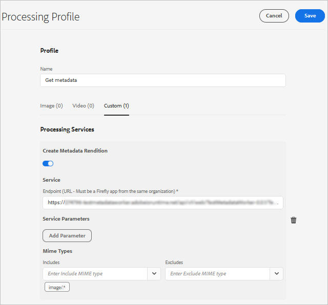

# Administración de metadatos de recursos digitales {#managing-metadata-for-digital-assets}

| Versión | Vínculo del artículo |
| -------- | ---------------------------- |
| AEM 6.5 | [Haga clic aquí](https://experienceleague.adobe.com/docs/experience-manager-65/assets/using/metadata.html?lang=en) |
| AEM as a Cloud Service | Este artículo |

[!DNL Adobe Experience Manager Assets] guarda los metadatos de cada recurso. Permite una categorización y organización más sencillas de los recursos y ayuda a las personas que buscan un recurso específico. Con la capacidad de extraer metadatos de archivos cargados a [!DNL Experience Manager Assets], la administración de metadatos se integra con el flujo de trabajo creativo. Con la capacidad de mantener y administrar metadatos con sus recursos, puede organizar y procesar recursos automáticamente en función de sus metadatos.

<!-- 
* [Metadata Schemata Reference](meta-ref.md)
-->

## Por qué necesitamos los metadatos {#why-metadata}

Los metadatos son datos sobre datos. A este respecto, los datos hacen referencia a su recurso digital, por ejemplo, una imagen. Los metadatos son esenciales para una administración eficaz de los recursos.

Los metadatos son la recopilación de todos los datos disponibles para un recurso, pero que no están necesariamente contenidos en esa imagen. Algunos ejemplos de metadatos son los siguientes:

* Nombre del recurso.
* Fecha y hora de la última modificación.
* Tamaño del recurso tal como se almacenó en el repositorio.
* Nombre de la carpeta en la que se encuentra.
* Recursos relacionados o etiquetas aplicadas.

Las anteriores son las propiedades de metadatos básicas que [!DNL Experience Manager] puede administrar para los recursos, lo que permite a los usuarios ver todos los recursos. Por ejemplo, ordenar recursos por fecha de última modificación resulta útil cuando se intenta descubrir recursos agregados o modificados recientemente.

Puede añadir más datos de alto nivel a los recursos digitales, por ejemplo:

* Tipo de recurso (¿es una imagen, un vídeo, un clip de audio o un documento?).
* Propietario del recurso.
* Título del recurso.
* Descripción del recurso.
* Etiquetas asignadas a un recurso.

Más metadatos le ayudan a categorizar los recursos y son útiles a medida que aumenta la cantidad de información digital. Es posible administrar algunos cientos de archivos basados únicamente en los nombres de archivo. Sin embargo, este enfoque no es escalable. Se queda corto cuando aumenta el número de personas involucradas y el número de recursos administrados.

Con la adición de metadatos, el valor de un recurso digital aumenta, ya que pasa a ser:

* Más accesible: los sistemas y los usuarios pueden encontrarlo fácilmente.
* Más fácil de administrar: puede encontrar recursos con el mismo conjunto de propiedades más fácilmente y aplicarles cambios.
* Completado: el recurso lleva más información y contexto con más metadatos.

Por estos motivos, [!DNL Assets] le proporciona los medios adecuados para crear, administrar e intercambiar metadatos para sus recursos digitales.

## Tipos de metadatos {#types-of-metadata}

Los metadatos se clasifican como metadatos técnicos, informativos y administrativos.

### Metadatos técnicos

Los metadatos técnicos se centran en los aspectos técnicos de los recursos digitales, y proporcionan información crucial relacionada con lo siguiente:

* Tamaño del archivo
* Formato
* Resolución
* Dimensiones
* Modo de color

Este tipo de metadatos ayuda a los usuarios a comprender los recursos digitales y a utilizarlos de forma eficaz.

### Metadatos informativos

Los metadatos informativos proporcionan información descriptiva para mejorar la comprensión del contenido, lo que ayuda a descubrir contenido y a realizar búsquedas. Incluye palabras clave, subtítulos y descripciones.  Por ejemplo, al administrar un vídeo en Experience Manager Assets, podemos incluir los siguientes metadatos informativos:

* **Palabras clave**: Marketing, lanzamiento de producto, Promoción
* **Pie de ilustración**: Presentamos nuestro último producto con interesantes características
* **Descripción**: Una descripción detallada del contenido del vídeo.

### Metadatos administrativos

Los metadatos administrativos tratan los aspectos administrativos de los recursos digitales. Garantiza el control de acceso, el cumplimiento y la administración del ciclo de vida general de los recursos dentro del sistema de administración de recursos digitales. Incluye información relacionada con lo siguiente:

* Propiedad de activos
* Derechos de uso
* Permisos
* Otros detalles administrativos

Este tipo de metadatos garantiza la administración eficaz de los recursos, el control de acceso y el cumplimiento normativo.

<!-- Learn more about [metadata best practices](metadata-best-practices.md) to manage your digital assets effectively. -->

<!-- The two basic types of metadata are technical metadata and descriptive metadata.

Technical metadata is useful for software applications that are dealing with digital assets and should not be maintained manually. [!DNL Experience Manager Assets] and other software automatically determine technical metadata and the metadata may change when the asset is modified. The available technical metadata of an asset depends largely on the file type of the asset. Some examples of technical metadata are:

* Size of a file.
* Dimensions (height and width) of an image.
* Bit rate of an audio or video file.
* Resolution (level of detail) of an image.

Descriptive metadata is metadata concerned with the application domain, for example, the business that an asset is coming from. Descriptive metadata cannot be determined automatically. It is created manually or semi-automatically. For example, a GPS-enabled camera can automatically track the latitude and longitude and add geotag the image.

The cost of manually creating descriptive metadata information is high. So, standards are established to ease the exchange of metadata across software systems and organizations. [!DNL Experience Manager Assets] supports all relevant standards for metadata management. -->

## Metadatos y última modificación {#last-modification}

La última fecha de modificación de un recurso refleja la última vez que se modifica el archivo original de un recurso. Como resultado, la fecha de modificación y el usuario solo cambian cuando:

* Se carga una nueva versión del recurso
* Se vuelve a procesar un recurso

La fecha de la última modificación y el usuario no cambian:

* Cuando se mueve o se cambia el nombre de un recurso
* Cuando un recurso está desprotegido, protegido en la versión o
* Cuando se publica o se cancela la publicación de un recurso
* Al actualizar los metadatos
* Actualizaciones de referencia o de colección

## Estándares de codificación {#encoding-standards}

Existen varias formas de incrustar metadatos en los archivos. Se admite una selección de estándares de codificación:

* XMP: usado por [!DNL Assets] para almacenar los metadatos extraídos dentro del repositorio.
* ID3: para archivos de audio y vídeo.
* EXIF: para archivos de imagen.
* Otro/Heredado: de [!DNL Microsoft Word], [!DNL PowerPoint], [!DNL Excel], etc.

### XMP {#xmp}

[!DNL Extensible Metadata Platform] (XMP) es un estándar abierto que utiliza [!DNL Experience Manager Assets] para toda la administración de metadatos. El estándar ofrece codificación de metadatos universal que puede incrustarse en todos los formatos de archivo. Adobe y otras empresas admiten el estándar XMP, ya que proporciona un modelo de contenido enriquecido. Los usuarios del estándar XMP y de [!DNL Experience Manager Assets] tienen una potente plataforma sobre la cual construir. Para obtener más información, consulte [XMP](https://www.adobe.com/products/xmp.html).

### ID3 {#id}

Los datos almacenados en estas etiquetas ID3 se muestran cuando reproduce un archivo de audio digital en el equipo o en un reproductor MP3 portátil.

Las etiquetas ID3 están diseñadas para el formato de archivo MP3. Información adicional sobre los formatos:

* Las etiquetas ID3 funcionan en archivos MP3 y mp3PRO.
* WAV no tiene etiquetas.
* WMA tiene etiquetas propietarias que no permiten la implementación de código abierto.
* Ogg Vorbis utiliza comentarios Xiph incrustados en el contenedor Ogg.
* AAC utiliza un formato de etiquetado propio.

### EXIF {#exif}

El formato de archivo de imagen intercambiable (Exif) es el formato de metadatos más utilizado en la fotografía digital. Proporciona una forma de incrustar un vocabulario fijo de propiedades de metadatos en muchos formatos de archivo, como JPEG, TIFF, RIFF y WAV. EXIF almacena los metadatos como pares de un nombre y un valor de metadatos. Estos pares de nombre-valor de metadatos también se denominan etiquetas, no deben confundirse con el etiquetado de [!DNL Experience Manager]. Las cámaras digitales modernas crean metadatos EXIF y el software gráfico moderno lo admite. El formato EXIF es el denominador común más bajo para la administración de metadatos, especialmente para imágenes.

Una limitación importante de EXIF es que algunos formatos de archivo de imagen populares, como BMP, GIF o PNG, no lo admiten.

Los campos de metadatos definidos por EXIF suelen ser de naturaleza técnica y su uso para la gestión descriptiva de metadatos es limitado. Por este motivo, [!DNL Experience Manager Assets] ofrece la asignación de propiedades EXIF a [esquemas de metadatos comunes](metadata-schemas.md) y a XMP.

#### Otros metadatos {#other-metadata}

Otros metadatos que se pueden incrustar de los archivos son [!DNL Microsoft Word], [!DNL PowerPoint], [!DNL Excel], etc.

## Administración de metadatos de recursos digitales {#manage-assets-metadata}

Enterprise Manager Assets permite editar los metadatos de varios recursos simultáneamente para poder propagar rápidamente cambios de metadatos comunes a los recursos de forma masiva. Utilice la página [!UICONTROL Propiedades] para cambiar las propiedades de los metadatos por un valor común o agregar o modificar etiquetas. Para personalizar la página Propiedades de los metadatos, lo que incluye agregar, modificar y eliminar propiedades de los metadatos, utilice el Editor de esquemas.

>[!NOTE]
>
>Los métodos de edición masiva funcionan para los recursos disponibles en una carpeta o una colección. Para los recursos que están disponibles en todas las carpetas o que coinciden con un criterio común, es posible [actualizar en lotes los metadatos después de buscar](/help/assets/search-assets.md#metadata-updates).

1. Desplácese hasta la ubicación de los recursos que desee editar.
1. Seleccione los recursos para los que desea editar propiedades comunes.
1. En la barra de herramientas, seleccione **[!UICONTROL Propiedades]** para abrir la página [!UICONTROL Propiedades] de los recursos seleccionados.

   >[!NOTE]
   >
   >Al seleccionar varios recursos, se selecciona el formulario principal común más bajo para los recursos. En otras palabras, la página [!UICONTROL Propiedades] solo muestra campos de metadatos que son comunes en las páginas [!UICONTROL Propiedades] de todos los recursos individuales.

1. Modifique las propiedades de los metadatos de los recursos seleccionados en las distintas pestañas.
1. Para ver el editor de metadatos de un recurso específico, cancele la selección de los recursos restantes de la lista. Los campos del editor de metadatos se rellenan con los metadatos del recurso en particular.

   >[!NOTE]
   >
   >* En la página [!UICONTROL Propiedades], puede quitar recursos de la lista de recursos cancelando la selección. La lista de recursos tiene todos los recursos seleccionados de forma predeterminada. Los metadatos de los recursos que elimina de la lista no se actualizan.
   >* En la parte superior de la lista de recursos, seleccione la casilla de verificación cerca de **[!UICONTROL Title]** para alternar entre seleccionar los recursos y borrar la lista.

1. Para seleccionar un esquema de metadatos diferente para los recursos, seleccione **[!UICONTROL Configuración]** en la barra de herramientas y elija el esquema que desee. Guarde los cambios.
1. Para anexar los nuevos metadatos con los metadatos existentes en los campos que contienen varios valores, seleccione el **[!UICONTROL modo Anexar]**. Si no selecciona esta opción, los metadatos nuevos sustituirán a los metadatos existentes en los campos. Seleccione **[!UICONTROL Enviar]**.

   >[!CAUTION]
   >
   >En el caso de los campos de un solo valor, los nuevos metadatos no se anexan al valor existente en el campo aunque seleccione el modo **[!UICONTROL Anexar]**.

## Metadatos personalizados con perfil de procesamiento {#metadata-compute-service}

Assets as a [!DNL Cloud Service] puede generar metadatos personalizados para un recurso mediante servicios nativos de la nube. Configure un perfil de procesamiento para generar metadatos personalizados. Ver [cómo usar el perfil de procesamiento](/help/assets/asset-microservices-configure-and-use.md#use-profiles).

>[!TIP]
>
>Solo se puede aplicar un perfil de procesamiento a una carpeta. Para aplicar varios procesos a los recursos de una carpeta, agregue más opciones a un único perfil de procesamiento. Por ejemplo, un solo perfil puede generar representaciones, transcodificar recursos, generar metadatos personalizados, etc. Puede aplicar filtros de tipo MIME para cada tarea de modo que la tarea adecuada se active para el formato de archivo requerido.

<!-- TBD: Commenting as Web Console is not available. Document the appropriate OSGi config method if available in CS.

## Configure limit for bulk metadata update {#configlimit}

To prevent DOS-like situation, [!DNL Experience Manager] limits the number of parameters supported in a Sling request. When updating metadata of many assets in one go, you may reach the limit and the metadata does not get updated for more assets. [!DNL Experience Manager] generates the following warning in the logs:

`org.apache.sling.engine.impl.parameters.Util Too many name/value pairs, stopped processing after 10000 entries`

To change the limit, access Web Console ( **[!UICONTROL Tools]** > **[!UICONTROL Operations]** > **[!UICONTROL Web Console]**) and change the value of **[!UICONTROL Maximum POST Parameters]** in **[!UICONTROL Apache Sling Request Parameter Handling]** OSGi configuration.
-->

## Esquemas de metadatos {#metadata-schemata}

Los esquemas de metadatos son conjuntos predefinidos de definiciones de propiedades de metadatos que se pueden utilizar en diversas aplicaciones. Las propiedades siempre están asociadas a un recurso, lo que significa que las propiedades están &quot;alrededor&quot; del recurso.

También puede diseñar sus propios esquemas de metadatos si no existe ninguno que se ajuste a sus necesidades. No duplique la información existente. Dentro de una organización, la separación de esquemas facilita el uso compartido de metadatos. [!DNL Experience Manager] le proporciona una lista predeterminada de los esquemas de metadatos más populares. La lista le ayuda a poner en marcha su estrategia de metadatos y a elegir rápidamente las propiedades de metadatos que necesite.

A continuación se enumeran los esquemas de metadatos admitidos.

### Metadatos estándar {#standard-metadata}

* DC - [!DNL Dublin Core] es un conjunto de metadatos importante y ampliamente utilizado.
* DICOM - Imágenes digitales y comunicaciones en medicina.
* `Iptc4xmpCore` y `iptc4xmpExt` - International Press Communications Standard contiene muchos metadatos específicos de temas.
* RDF, Resource Description Framework, para metadatos web semánticos genéricos.
* XMP: [!DNL Extensible Metadata Platform].
* `xmpBJ` - Oferta de trabajo básica.

### Metadatos específicos de la aplicación {#application-specific-metadata}

Los metadatos específicos de la aplicación incluyen metadatos técnicos y descriptivos. Si utiliza estos metadatos, es posible que otras aplicaciones no puedan utilizarlos. Por ejemplo, es posible que una aplicación de procesamiento de imágenes diferente no pueda acceder a los metadatos de [!DNL Adobe Photoshop]. Puede crear un paso del flujo de trabajo que cambie una propiedad específica de la aplicación a una propiedad estándar.

* ACDSee: metadatos administrados por el programa [!DNL ACDSee]. Consulte [www.acdsee.com/](https://www.acdsee.com/).
* Álbum - [!DNL Adobe Photoshop Album].
* CQ - Utilizado por [!DNL Experience Manager Assets].
* DAM: Utilizado por [!DNL Experience Manager Assets].
* DEX - [Optima SC Description explorer](https://www.optimasc.com/products/dex/index.html) es una colección de herramientas para la administración de archivos y metadatos de los sistemas operativos Windows.
* CRS - [Adobe Photoshop Camera Raw](https://helpx.adobe.com/camera-raw/using/introduction-camera-raw.html).
* LR: [!DNL Adobe Lightroom].
* MediaPro - [iView MediaPro](https://en.wikipedia.org/wiki/Phase_One_Media_Pro).
* MicrosoftPhoto and MP - Microsoft Photo.
* PDF y PDF/X.
* Photoshop y psAux: [!DNL Adobe Photoshop].

### Metadatos de Digital Rights Management {#digital-rights-management-metadata}

* CC - [!DNL Creative Commons].
* [!DNL XMPRights].
* PLUS - [Sistema universal de licencias de imágenes](https://www.useplus.com).
<!--THIS LINK IS 404 WITH NO SUITABLE REPLACEMENT * PRISM - [Publishing Requirements for Industry Standard Metadata](https://www.idealliance.org/prism-metadata). -->
* PRL - PRISM Rights Language.
* PUR - Derechos de uso de PRISM.
* `xmpPlus`: integración de PLUS con XMP.

### Metadatos específicos de fotografía {#photography-specific-metadata}

* Exif - Información técnica de la cámara, incluyendo la posición GPS.
* CRS: esquema [!DNL Camera Raw].
* `iptc4xmpCore` y `iptc4xmpExt`.
* TIFF: metadatos de imagen (no solo para imágenes de TIFF).

### Metadatos específicos de impresión {#print-specific-metadata}

* PDF y PDF/X: aplicaciones de Adobe PDF y de terceros.
<!--THIS LINK IS 404 WITH NO SUITABLE REPLACEMENT * PRISM - [Publishing Requirements for Industry Standard Metadata](https://www.idealliance.org/prism-metadata). -->
* XMP: [!DNL Extensible Metadata Platform].
* `xmpPG`: metadatos de XMP para texto paginado.

### Metadatos específicos de medios múltiples {#multimedia-specific-metadata}

* `xmpDM` - [!DNL Dynamic Media].
* `xmpMM` - Administración de medios.

## Flujos de trabajo impulsados por metadatos {#metadata-driven-workflows}

La creación de flujos de trabajo impulsados por metadatos le ayuda a automatizar algunos procesos, lo que mejora la eficacia. En un flujo de trabajo controlado por metadatos, el sistema de administración de flujos de trabajo lee el flujo de trabajo y, como resultado, realiza algunas acciones predefinidas. Por ejemplo, algunas de las formas de utilizar flujos de trabajo impulsados por metadatos:

* El flujo de trabajo puede comprobar si una imagen tiene título o no. Si no es así, el sistema le notifica que añada un título.
* El flujo de trabajo puede comprobar si un aviso de copyright en un recurso permite la distribución o no. Por lo tanto, el sistema envía el recurso a un servidor u otro.
* Un flujo de trabajo puede buscar recursos sin metadatos obligatorios predefinidos o recursos con *metadatos no válidos*.

**Consulte también**

* [Traducir recursos](translate-assets.md)
* [API HTTP de recursos](mac-api-assets.md)
* [Formatos de archivo compatibles con recursos](file-format-support.md)
* [Buscar recursos](search-assets.md)
* [Recursos de red](use-assets-across-connected-assets-instances.md)
* [Informes de recurso](asset-reports.md)
* [Esquemas de metadatos](metadata-schemas.md)
* [Descarga de recursos](download-assets-from-aem.md)
* [Facetas de búsqueda](search-facets.md)
* [Administrar colecciones](manage-collections.md)
* [Importación masiva de metadatos](metadata-import-export.md)
* [Publicación de recursos en AEM y Dynamic Media](/help/assets/publish-assets-to-aem-and-dm.md)

>[!MORELIKETHIS]
>
>* [Metadatos XMP](xmp-metadata.md)
>* [Cómo editar o agregar metadatos](meta-edit.md)
