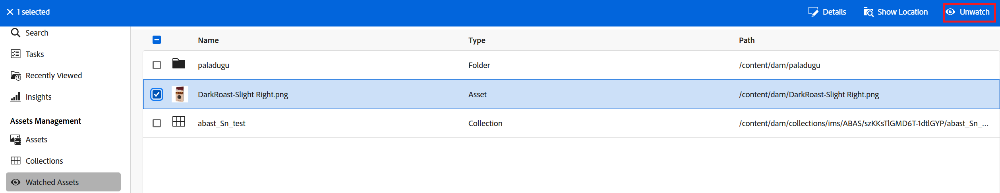

# Ver recursos, carpetas y colecciones {#watch-assets-folders}

Las notificaciones de vista de Assets permiten supervisar las operaciones realizadas en los recursos, carpetas o colecciones disponibles en el repositorio. Debe seleccionar y suscribirse al contenido para el que se le envían las notificaciones. También puede configurar las categorías a las que se envían las notificaciones.

## Suscripción a las categorías de notificación {#subscribe-to-notification-categories}

Puede elegir y suscribirse a una lista de categorías para recibir notificaciones. La vista de Assets le envía las notificaciones únicamente para las categorías que seleccione entre las opciones disponibles:

<table>
    <tbody>
     <tr>
      <th><strong>Categoría de notificación</strong></th>
      <th><strong>Descripción</strong></th>
     </tr>
     <tr>
      <td>Solicitudes</td>
      <td>Cuando asigna una tarea a un usuario, recibe notificaciones cuando ese usuario realiza acciones en esa tarea.</td>
     </tr>
     <tr>
      <td>Asignado a mí</td>
      <td>Recibirá una notificación cuando haya una tarea asignada de otro usuario.</td>
     </tr>
     <tr>
      <td>Comentario sobre el contenido suscrito</td>
      <td>Recibe una notificación cuando un usuario comenta sobre su recurso suscrito.</td>
     </tr>
     <tr>
      <td>Eliminación del contenido suscrito</td>
      <td>Recibirá una notificación cuando un usuario elimine el recurso, la colección o la carpeta suscritos.</td>
     </tr>
     <tr>
      <td>Participación externa del contenido suscrito</td>
      <td>Recibirá una notificación cuando un usuario genere un vínculo público para el recurso, la colección o la carpeta suscritos.</td>
     </tr>
     <tr>
      <td>Modificación del contenido suscrito</td>
      <td>Recibirá una notificación cuando un usuario cree una nueva versión para el recurso suscrito.</td>
     </tr>
     <tr>
      <td>Mover/cambiar el nombre del contenido suscrito</td>
      <td>Recibirá una notificación cuando un usuario mueva o cambie el nombre del recurso o la carpeta suscritos.</td>
     </tr>
     <tr>
      <td>Actualizaciones en carpetas y colecciones suscritas</td>
      <td>Recibirá una notificación cuando un usuario agregue o elimine un recurso de una carpeta o colección suscritas.</td>
     </tr>    
    </tbody>
   </table>

Para suscribirse a las categorías de notificación, haga lo siguiente:

1. Haga clic en  en el extremo derecho de la barra de menús de la interfaz de usuario de la vista Assets.

1. Haga clic en el  para ver la página [!UICONTROL preferencias de Experience Cloud].

1. Haga clic en la opción **[!UICONTROL Notificaciones]** disponible en el panel izquierdo.

1. En la sección **[!UICONTROL Notificaciones]**, vaya a la sección [!UICONTROL Vista de Assets] y asegúrese de que la opción de alternancia pasa al estado ACTIVADO.

   

1. Haga clic en **[!UICONTROL Personalizar]** para ver las categorías de notificación.
   

1. Seleccione las categorías de notificación para las que debe recibir notificaciones.

## Visualización y ocultación de carpetas, activos o colecciones {#watch-unwatch-assets}

Puede ver y dejar de ver carpetas, recursos o colecciones para mantenerse informado, lo que permite una mejor colaboración en torno a los recursos que está monitorizando.

Después de la [suscripción a las categorías de notificación](#subscribe-to-notification-categories), debe suscribirse al contenido para comenzar a recibir notificaciones.

>[!NOTE]
>
>* Para **[!UICONTROL Solicitudes]** y categorías de notificación **[!UICONTROL Asignado a mí]**, no es necesario suscribirse al contenido después de suscribirse a las categorías de notificación. Las notificaciones se envían automáticamente para las solicitudes creadas por usted y cuando se le asigna una tarea.
>* La vista de Assets envía notificaciones solo cuando otros usuarios realizan acciones en el contenido suscrito. No recibe notificaciones por las acciones que realiza en el contenido suscrito.

### Suscribirse al contenido {#subscribe-to-content}

Siga estos pasos para suscribirse a carpetas, recursos o colecciones:

1. Examine la carpeta, la colección o el recurso al que desee suscribirse y haga clic en **[!UICONTROL Ver]**.

1. La vista Assets muestra un mensaje de éxito. Puede hacer clic en **[!UICONTROL Ir a las preferencias de notificación]** en el mensaje de éxito para editar su [suscripción a las categorías de notificación](#subscribe-to-notification-categories).

   

La vista de Assets ahora enviará notificaciones para las categorías suscritas. También puede seleccionar varios activos, colecciones o carpetas y hacer clic en **[!UICONTROL Ver]** para ahorrar tiempo. Sin embargo, si selecciona varios elementos y algunos ya están suscritos, no se mostrará la opción **[!UICONTROL Ver]**.

### Ver contenido suscrito {#view-subscribed-content}

Para ver el contenido suscrito, siga estos pasos:

1. Vaya a **[!UICONTROL Assets inspeccionado]** en [!UICONTROL Administración de recursos].

1. La vista de Assets muestra una lista de los recursos suscritos, incluidos su nombre, tipo y ruta. Seleccione un recurso, una carpeta o una colección de la lista para ver sus detalles, ubicación o para [cancelar la suscripción](#unsubscribe-to-content).

   

### Ver suscriptores de contenido {#view-content-subscribers}

Para ver los suscriptores de contenido, siga estos pasos:

1. Navegue por la carpeta, la colección o el recurso y seleccione **[!UICONTROL Detalles]**.

1. Haga clic en el ojo del panel derecho para ver una lista de observadores del contenido.

   También puede hacer clic en  en el panel derecho para ver los observadores de contenido.

### Cancelar suscripción al contenido {#unsubscribe-to-content}

Para cancelar la suscripción:

1. Vaya a **[!UICONTROL Assets inspeccionado]** en [!UICONTROL Administración de recursos].

1. Seleccione el recurso, la carpeta o la colección cuya suscripción desea cancelar y haga clic en **[!UICONTROL Dejar de ver]**.

   

También puede examinar la carpeta, la colección o el recurso en [!UICONTROL Administración de recursos]. Seleccione el [recurso suscrito](#subscribe-to-content) y haga clic en **[!UICONTROL Dejar de ver]**.

## Ver notificaciones {#view-notifications}

Las notificaciones aparecen en el extremo derecho de la barra de menús de la interfaz de usuario de la vista de Assets.

Al hacer clic en una notificación, la vista de Assets lo desplaza hasta el recurso o la carpeta correspondiente a los que se hace referencia en la notificación.
