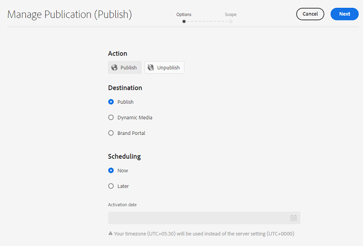
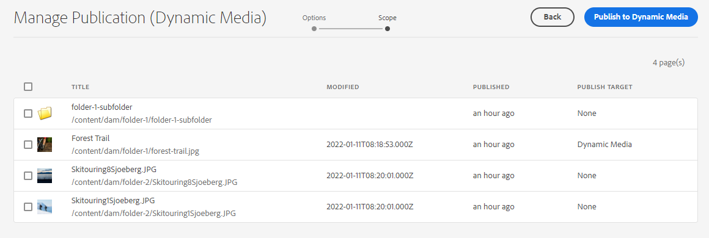
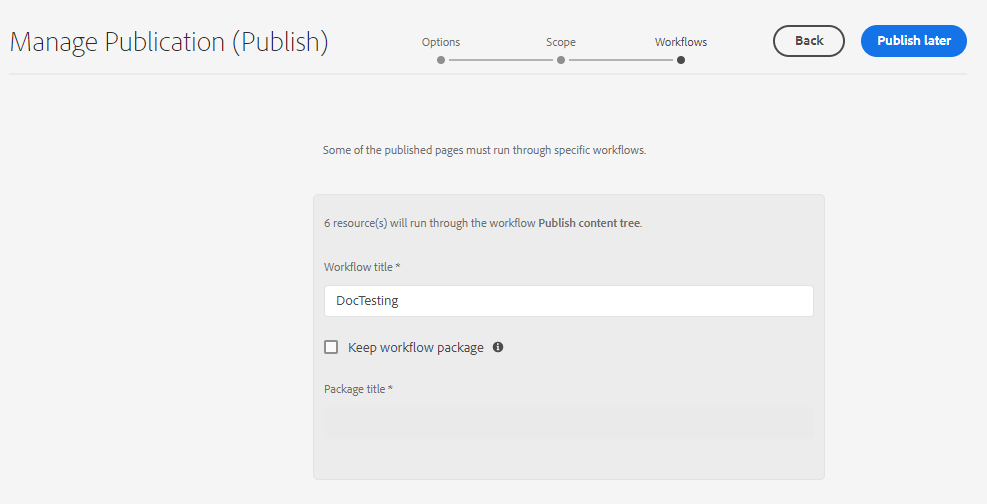

# Administrar publicación en Experience Manager Assets {#manage-publication-in-aem}

Como administrador de [!DNL Adobe Experience Manager Assets], puede publicar recursos y carpetas que contengan recursos de su instancia de autor en [!DNL Experience Manager Assets], [!DNL Dynamic Media] y [!DNL Brand Portal]. Además, puede programar la publicación de un recurso o una carpeta en una fecha u hora posterior. Una vez publicados, los usuarios pueden acceder a los recursos y distribuirlos a otros usuarios. De manera predeterminada, puede publicar recursos y carpetas en [!DNL Experience Manager Assets]. Sin embargo, puede configurar [!DNL Experience Manager Assets] para habilitar la publicación en [[!DNL Dynamic Media]](https://experienceleague.adobe.com/docs/experience-manager-cloud-service/content/assets/dynamicmedia/config-dm.html?lang=es) y [[!DNL Brand Portal]](https://experienceleague.adobe.com/docs/experience-manager-cloud-service/content/assets/brand-portal/configure-aem-assets-with-brand-portal.html?lang=es).

Puede publicar o cancelar la publicación de recursos en el nivel de recurso o carpeta mediante la opción **[!UICONTROL Publicación rápida]** o **[!UICONTROL Administrar publicación]** disponible en la interfaz [!DNL Experience Manager Assets]. Si realiza las modificaciones posteriores al recurso o la carpeta originales en [!DNL Experience Manager Assets], los cambios no se reflejarán en la instancia de publicación hasta que vuelva a publicar desde [!DNL Experience Manager Assets]. Garantiza que los cambios en curso no estén disponibles en la instancia de publicación. Solo los cambios aprobados publicados por un administrador están disponibles en la instancia de publicación.

* [Publicación de recursos mediante Publicación rápida](#quick-publish)
* [Publicar recursos mediante Administrar publicación](#manage-publication)
* [Publicar recursos más tarde](#publish-assets-later)
* [Publicación de recursos en Dynamic Media](#publish-assets-to-dynamic-media)
* [Publicación de recursos en Brand Portal](#publish-assets-to-brand-portal)
* [Solicitar publicación](#request-publication)
* [Limitaciones y sugerencias](#limitations-and-tips)

## Publicación de recursos mediante Publicación rápida {#quick-publish}

Publicación rápida permite publicar inmediatamente el contenido en el destino seleccionado. Desde la consola [!DNL Experience Manager Assets], vaya a la carpeta principal y seleccione todos los recursos o carpetas que desee publicar. Haga clic en la opción **[!UICONTROL Publicación rápida]** de la barra de herramientas y seleccione el destino de la lista desplegable en el que desee publicar los recursos.

## Publicar recursos mediante Administrar publicación {#manage-publication}

Administrar publicación le permite publicar o cancelar la publicación de contenido desde y hacia el destino seleccionado, [agregar contenido](#add-content) a la lista de publicaciones desde el repositorio de DAM, [incluir la configuración de la carpeta](#include-folder-settings) para publicar contenido de las carpetas seleccionadas y aplicar filtros, y [programar la publicación](#publish-assets-later) a una fecha u hora posterior.

Desde la consola [!DNL Experience Manager Assets], vaya a la carpeta principal y seleccione todos los recursos o carpetas que desee publicar. Haga clic en la opción **[!UICONTROL Administrar publicación]** en la barra de herramientas. Si no tiene [!DNL Dynamic Media] y [!DNL Brand Portal] configurados en su instancia de [!DNL Experience Manager Assets], solo puede publicar recursos y carpetas en [!DNL Experience Manager Assets].

Las siguientes opciones están disponibles en la interfaz [!UICONTROL Administrar publicación]:

* [!UICONTROL Acciones]
   * `Publish`: publicar recursos y carpetas en el destino seleccionado
   * `Unpublish`: cancelar la publicación de recursos y carpetas desde el destino

* [!UICONTROL Destino]
   * `Publish`: publicar recursos y carpetas en [!DNL Experience Manager Assets] (`AEM`)
   * `Dynamic Media`: publicar recursos en [!DNL Dynamic Media]
   * `Brand Portal`: publicar recursos y carpetas en [!DNL Brand Portal]

* [!UICONTROL Programación]
   * `Now`: publicar recursos inmediatamente
   * `Later`: publicar recursos en función de la fecha u hora `Activation`

Para continuar, haz clic en **[!UICONTROL Siguiente]**. En función de la selección, la ficha **[!UICONTROL Ámbito]** refleja distintas opciones. Las opciones para **[!UICONTROL Agregar contenido]** e **[!UICONTROL Incluir configuración de carpeta]** solo están disponibles para publicar los recursos y carpetas en [!DNL Experience Manager Assets] (`Destination: Publish`).

### Añadir contenido {#add-content}

La publicación en [!DNL Experience Manager Assets] le permite agregar más contenido (recursos y carpetas) a la lista de publicación. Puede agregar más recursos o carpetas a la lista en los repositorios DAM. Haga clic en el botón **[!UICONTROL Agregar contenido]** para agregar más contenido.

Puede agregar varios recursos desde una carpeta o agregar varias carpetas a la vez. Pero no puede agregar recursos de varias carpetas a la vez.

### Incluir configuración de carpeta {#include-folder-settings}

De manera predeterminada, al publicar una carpeta en [!DNL Experience Manager Assets] se publican todos los recursos, las subcarpetas y sus referencias.

Para filtrar el contenido de la carpeta que desea publicar, haga clic en **[!UICONTROL Incluir configuración de carpeta]**:

* `Include folder contents`

   * Habilitado: se publican todos los recursos de la carpeta, las subcarpetas (incluidos todos los recursos de las subcarpetas) y las referencias seleccionadas.
   * Deshabilitado: solo se publican la carpeta seleccionada (vacía) y las referencias. Los recursos de la carpeta seleccionada no se publican.

* `Include folder contents` y `Include only immediate folder contents`

  Si se seleccionan ambas opciones, se publican todos los recursos de la carpeta, las subcarpetas (vacías) y las referencias seleccionadas. Los recursos de las subcarpetas no se publican.

<!--
* [!UICONTROL Include only immediate folder contents]: Only the subfolders content and references are published. 

Only the selected folder content and references are published.
-->

Después de aplicar los filtros, haga clic en **[!UICONTROL Aceptar]** y, a continuación, haga clic en **[!UICONTROL Publicar]**. Al hacer clic en el botón Publicar, aparece un mensaje de confirmación `Resource(s) have been scheduled for publication`. Y los recursos y (o) carpetas seleccionados se publican en el destino definido en función del programador (`Now` o `Later`). Inicie sesión en la instancia de publicación para comprobar que los recursos y las carpetas se han publicado correctamente.

En la ilustración anterior, puede ver valores diferentes para el atributo **[!UICONTROL Publish Target]**. Recordemos que ha elegido publicar en [!DNL Experience Manager Assets] (`Destination: Publish`). Entonces, ¿por qué se muestra que solo se publican una carpeta y un recurso en `AEM`, y que los otros dos recursos se publican tanto en `AEM` como en `Dynamic Media`?

En este caso, debe comprender la función de las propiedades de carpeta. La propiedad **[!UICONTROL Dynamic Media Publishing mode]** de una carpeta desempeña un papel importante en la publicación. Para ver las propiedades de una carpeta, selecciónela y haga clic en **[!UICONTROL Propiedades]** en la barra de herramientas. Para ver un recurso, consulte las propiedades de su carpeta principal.

En la tabla siguiente se explica cómo se produce la publicación según el **[!UICONTROL destino]** definido y el **[!UICONTROL modo de publicación de Dynamic Media]** definido:

| [!UICONTROL Destino] | [!UICONTROL Modo de publicación de medios dinámicos] | [!UICONTROL Destino de publicación] | Contenido permitido |
| --- | --- | --- | --- |
| Publicación | Publicación selectiva | `AEM` | Assets y/o carpetas |
| Publicación | Inmediato | `AEM` y `Dynamic Media` | Assets y/o carpetas |
| Publicación | Tras la activación | `AEM` y `Dynamic Media` | Assets y/o carpetas |
| Dynamic Media | Publicación selectiva | `Dynamic Media` | Recursos |
| Dynamic Media | Inmediato | `None` | No se pueden publicar los recursos |
| Dynamic Media | Tras la activación | `None` | No se pueden publicar los recursos |

>[!NOTE]
>
>Solo se publican los recursos en [!DNL Dynamic Media].
>
>No se permite publicar una carpeta en [!DNL Dynamic Media].
>
>Si selecciona una carpeta (`Selective Publish`) y elige el destino [!DNL Dynamic Media], el atributo [!UICONTROL Publish Target] refleja `None`.

Ahora cambiemos **[!UICONTROL Destination]** en el caso de uso anterior a **[!UICONTROL Dynamic Media]** y verifiquemos los resultados. Al hacerlo, solo se publica el recurso de `Selective Publish` en [!DNL Dynamic Media]. Los recursos de `Immediate` y `Upon Activation` carpetas no se han publicado y reflejan `None`.

>[!NOTE]
>
>Si [!DNL Dynamic Media] no está configurado en su instancia de [!DNL Experience Manager Assets] y el **[!UICONTROL destino]** es **[!UICONTROL Publish]**, los recursos y las carpetas siempre se publican en `AEM`.
>
>La publicación en [!DNL Brand Portal] es independiente de las propiedades de la carpeta. Todos los recursos, carpetas y colecciones se pueden publicar en Brand Portal. Ver [publicar recursos en Brand Portal](#publish-assets-to-brand-portal).

>[!NOTE]
>
>Si ha personalizado el asistente [!DNL Manage Publication], la personalización seguirá funcionando con las funcionalidades existentes.
>
>Sin embargo, puede quitar la personalización existente para usar las nuevas características de [!DNL Manager Publication].

## Publicar recursos más tarde {#publish-assets-later}

Para programar el flujo de trabajo de publicación de recursos para una fecha u hora posterior:

1. Desde la consola [!UICONTROL Experience Manager Assets], vaya a la carpeta principal y seleccione todos los recursos o carpetas que desee programar para la publicación.
1. Haga clic en la opción **[!UICONTROL Administrar publicación]** en la barra de herramientas.
1. Haga clic en **[!UICONTROL Publicar]** desde **[!UICONTROL Acción]** y, a continuación, seleccione el **[!UICONTROL Destino]** en el que desea publicar el contenido.
1. Seleccione **[!UICONTROL Más tarde]** en **[!UICONTROL Programación]**.
1. Seleccione una **[!UICONTROL fecha de activación]** y especifique la fecha y la hora. Haga clic en **[!UICONTROL Siguiente]**.

   

1. En la ficha **[!UICONTROL Ámbito]**, **[!UICONTROL Agregar contenido]** (si es necesario). Haga clic en **[!UICONTROL Siguiente]**.
1. En la pestaña **[!UICONTROL Flujos de trabajo]**, especifique un título de flujo de trabajo. Haga clic en **[!UICONTROL Publicar más tarde]**.

   

   Inicie sesión en la instancia de destino para verificar los recursos publicados (según la fecha u hora programadas).

## Publicación de recursos en Dynamic Media {#publish-assets-to-dynamic-media}

Solo se publican los recursos en [!DNL Dynamic Media]. Sin embargo, el comportamiento de publicación difiere según las propiedades de la carpeta. Una carpeta puede tener **[!UICONTROL Modo de publicación de medios dinámicos]** configurado para la publicación selectiva, que puede ser cualquiera de las siguientes:

* `Selective Publish`
* `Immediate`
* `Upon Activation`

El proceso de publicación de los modos **[!UICONTROL Inmediato]** y **[!UICONTROL Tras la activación]** es consistente, pero diferente para **[!UICONTROL Publicación selectiva]**. Consulte [Configurar la publicación selectiva en el nivel de carpeta en Dynamic Media](https://experienceleague.adobe.com/docs/experience-manager-cloud-service/content/assets/dynamicmedia/selective-publishing.html?lang=es). Después de configurar la publicación selectiva en una carpeta, puede realizar cualquiera de las siguientes acciones:

* [Publicar recursos de forma selectiva en Dynamic Media o Experience Manager mediante Administrar publicación](https://experienceleague.adobe.com/docs/experience-manager-cloud-service/content/assets/dynamicmedia/selective-publishing.html?lang=en#selective-publish-manage-publication)
* [Cancele la publicación selectiva de recursos de Dynamic Media o Experience Manager mediante Administrar publicación](https://experienceleague.adobe.com/docs/experience-manager-cloud-service/content/assets/dynamicmedia/selective-publishing.html?lang=en#selective-unpublish-manage-publication)
* [Publicar recursos en Dynamic Media o Experience Manager mediante publicación rápida](https://experienceleague.adobe.com/docs/experience-manager-cloud-service/content/assets/dynamicmedia/selective-publishing.html?lang=en#quick-publish-aem-dm)
* [Publicar o cancelar la publicación de recursos de forma selectiva mediante resultados de búsqueda](https://experienceleague.adobe.com/docs/experience-manager-cloud-service/content/assets/dynamicmedia/selective-publishing.html?lang=en#selective-publish-unpublish-search-results)

## Publicación de recursos en Brand Portal {#publish-assets-to-brand-portal}

Puede publicar recursos, carpetas y colecciones en la instancia [!DNL Experience Manager Assets Brand Portal].

* [Publicar recursos en Brand Portal](https://experienceleague.adobe.com/docs/experience-manager-cloud-service/content/assets/brand-portal/publish-to-brand-portal.html?lang=en#publish-assets-to-bp)
* [Publicar carpetas en Brand Portal](https://experienceleague.adobe.com/docs/experience-manager-cloud-service/content/assets/brand-portal/publish-to-brand-portal.html?lang=en#publish-folders-to-brand-portal)
* [Publicar colecciones en Brand Portal](https://experienceleague.adobe.com/docs/experience-manager-cloud-service/content/assets/brand-portal/publish-to-brand-portal.html?lang=en#publish-collections-to-brand-portal)

## Solicitar publicación {#request-publication}

La opción `Request Publication` ayuda a autenticar el flujo de trabajo de Assets antes de publicarlos en el entorno de Assets [!DNL AEM]. [!DNL AEM] proporciona un nivel diferente de permisos a varios usuarios. Puede ser *colaborador* que está cargando recursos, pero no puede publicarlos hasta que se hayan verificado las cargas. Además, al ser *administrador*, puede leer y escribir en los flujos de trabajo de Assets.

La opción Solicitar publicación está disponible para los siguientes usuarios:

* **Colaborador:** Si usted es un usuario que puede colaborar en [!DNL AEM] Assets, tiene acceso limitado al flujo de trabajo de [!DNL AEM] Assets. El botón `Manage publication` está oculto para usted. Como colaborador, solo puede contribuir añadiendo Assets, pero no puede publicarlos ni tener acceso de lectura al flujo de trabajo.

* **Usuario de flujo de trabajo:** Este usuario no puede publicar recursos, pero tiene acceso de lectura al flujo de trabajo. Como usuario de flujo de trabajo, puede:
   * solicitar publicación
   * ver botón `Manage publication`
   * programe el flujo de trabajo y vea las opciones `schedule now` y `schedule later`

* **Administrador:** Como tipo de administrador de usuario, puede administrar los pasos generales del flujo de trabajo para Assets. El botón `Manage publication` es visible para usted. Si el destino `publish` está seleccionado, puede programar un recurso más adelante para el paso de flujo de trabajo.

>[!NOTE]
>
>Si se selecciona [!DNL Dynamic Media] como destino, el paso del flujo de trabajo se deshabilita para los usuarios **workflow user** y **admin**.
>

## Limitaciones y sugerencias {#limitations-and-tips}

* `Manage publication` está disponible para los usuarios que tienen al menos permisos de lectura en el flujo de trabajo.
* Las carpetas vacías no se publican.
* Si publica un recurso que se está procesando, solo se publica el contenido original. Faltan las representaciones. Espere a que se complete el procesamiento y, a continuación, publique o vuelva a publicar el recurso una vez finalizado el procesamiento.
* Al cancelar la publicación de un recurso complejo, cancele la publicación solo del recurso. Evite cancelar la publicación de las referencias, ya que otras referencias pueden proceder de otros recursos publicados.
