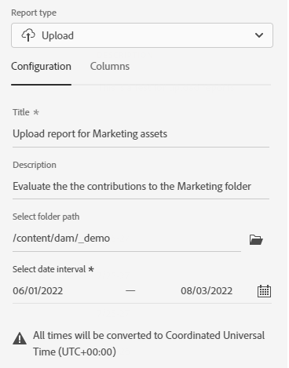

# Administrar informes {#manage-reports}

>[!CONTEXTUALHELP]
>id="assets_reports"
>title="Informes"
>abstract="La creación de informes de recursos proporciona visibilidad a los administradores de la actividad del entorno de la vista Adobe Experience Manager Assets. Estos datos proporcionan información útil sobre cómo los usuarios interactúan con el contenido y el producto. Todos los usuarios asignados al Perfil de producto de los administradores pueden acceder al panel de Insights o crear informes definidos por el usuario."

La creación de informes de recursos proporciona visibilidad a los administradores de la actividad del entorno de la vista Adobe Experience Manager Assets. Estos datos proporcionan información útil sobre cómo los usuarios interactúan con el contenido y el producto.

## Acceso a los informes {#access-reports}

Todas las personas asignadas al perfil de producto Administradores de la vista Recursos pueden acceder al tablero de Insights o crear informes definidos por el usuario en la vista Recursos.

## Vista Insights {#view-live-statistics}

La vista Recursos le permite ver datos en tiempo real de su entorno de la vista Recursos con el tablero de Insights. Puede ver las métricas de eventos en tiempo real durante los últimos 30 días o 12 meses.

<!---->

Haga clic en **[!UICONTROL Insights]** en el panel de navegación izquierdo para ver los siguientes gráficos generados automáticamente:

* **Descargas**: el número de archivos descargados del entorno de la vista Recursos en los últimos 30 días o 12 meses representados mediante un gráfico de líneas.

* **Cargas**: el número de archivos cargados en el entorno de la vista Recursos en los últimos 30 días o 12 meses representados mediante un gráfico de líneas.

<!--* **Asset Count by Size**: The division of count of assets based on their range of various sizes from 0 MB to 100 GB.-->

* **Uso de almacenamiento**: el uso del almacenamiento, en bytes, para el entorno de vista de recursos representado mediante un gráfico de barras.

<!--* **Delivery**: The graph depicts the count of assets as the delivery dates.-->

<!--* **Asset Count by Asset Type**: Represents count of various MIME types of the available assets. For example, application/zip, image/png, video/mp4, application/postscripte.-->

* **Búsquedas principales**: vea los términos más buscados junto con el número de veces que se buscan en el entorno de vista Recursos en los últimos 30 días o 12 meses representados en formato tabular.

<!--

* **Storage usage**: The storage usage, in gigabytes (GB), for the Assets view environment, for the last 30 days or 12 months represented using a bar chart.

-->

## Creación de un informe de descarga {#create-download-report}

Para crear un informe de descarga, haga lo siguiente:

1. Vaya a **[!UICONTROL Configuración]** > **[!UICONTROL Informes]** y haga clic en **[!UICONTROL Crear informe]**.

1. En la pestaña [!UICONTROL Configuración], especifique el tipo de informe como **[!UICONTROL Descargar]**.

1. Especifique un título y una descripción opcional para el informe.

1. Seleccione la ruta de la carpeta, que comprende los recursos en los que se ejecutará el informe, utilizando el campo **[!UICONTROL Seleccionar ruta de la carpeta]**.

1. Seleccione el intervalo de fecha para el informe.

   >[!NOTE]
   >
   > La vista Recursos convierte todas las zonas horarias locales a la hora universal coordinada (UTC).

1. En la pestaña [!UICONTROL Columnas], seleccione los nombres de columna que debe mostrar en el informe.

1. Haga clic en **[!UICONTROL Crear]**.

   

En la tabla siguiente se explica el uso de todas las columnas que se pueden agregar al informe:

<table>
    <tbody>
     <tr>
      <th><strong>El nombre de la columna</strong></th>
      <th><strong>Descripción</strong></th>
     </tr>
     <tr>
      <td>Título</td>
      <td>El título del recurso.</td>
     </tr>
     <tr>
      <td>Ruta </td>
      <td>Ruta de la carpeta en la que el recurso está disponible en la vista Recursos.</td>
     </tr>
     <tr>
      <td>Tipo MIME</td>
      <td>Tipo MIME del recurso.</td>
     </tr>
     <tr>
      <td>Tamaño</td>
      <td>El tamaño del recurso en bytes.</td>
     </tr>
     <tr>
      <td>Descargado por</td>
      <td>ID de correo electrónico del usuario que descargó el recurso.</td>
     </tr>
     <tr>
      <td>Fecha de descarga</td>
      <td>La fecha en la que se realiza la acción de descarga de recursos.</td>
     </tr>
     <tr>
      <td>Autor</td>
      <td>El autor del recurso.</td>
     </tr>
     <tr>
      <td>Fecha de creación</td>
      <td>La fecha en la que el recurso se carga en la vista Recursos.</td>
     </tr>
     <tr>
      <td>Fecha de modificación</td>
      <td>La fecha de la última modificación del recurso.</td>
     </tr>
     <tr>
      <td>Caducado</td>
      <td>Estado de caducidad del recurso.</td>
     </tr>
     <tr>
      <td>Descargado por (nombre de usuario)</td>
      <td>Nombre del usuario que descargó el recurso.</td>
     </tr>           
    </tbody>
   </table>

## Creación de un informe de carga {#create-upload-report}

Para crear un informe de carga:

1. Vaya a **[!UICONTROL Configuración]** > **[!UICONTROL Informes]** y haga clic en **[!UICONTROL Crear informe]**.

1. En la pestaña [!UICONTROL Configuración], especifique el tipo de informe como **[!UICONTROL Cargar]**.

1. Especifique un título y una descripción opcional para el informe.

1. Seleccione la ruta de la carpeta, que comprende los recursos en los que se ejecutará el informe, utilizando el campo **[!UICONTROL Seleccionar ruta de la carpeta]**.

1. Seleccione el intervalo de fecha para el informe.

1. En la pestaña [!UICONTROL Columnas], seleccione los nombres de columna que debe mostrar en el informe.

1. Haga clic en **[!UICONTROL Crear]**.

   

En la tabla siguiente se explica el uso de todas las columnas que se pueden agregar al informe:

<table>
    <tbody>
     <tr>
      <th><strong>El nombre de la columna</strong></th>
      <th><strong>Descripción</strong></th>
     </tr>
     <tr>
      <td>Título</td>
      <td>El título del recurso.</td>
     </tr>
     <tr>
      <td>Ruta </td>
      <td>Ruta de la carpeta en la que el recurso está disponible en la vista Recursos.</td>
     </tr>
     <tr>
      <td>Tipo MIME</td>
      <td>Tipo MIME del recurso.</td>
     </tr>
     <tr>
      <td>Tamaño</td>
      <td>El tamaño del recurso.</td>
     </tr>
     <tr>
      <td>Autor</td>
      <td>El autor del recurso.</td>
     </tr>
     <tr>
      <td>Fecha de creación</td>
      <td>La fecha en la que el recurso se carga en la vista Recursos.</td>
     </tr>
     <tr>
      <td>Fecha de modificación</td>
      <td>La fecha de la última modificación del recurso.</td>
     </tr>
     <tr>
      <td>Caducado</td>
      <td>Estado de caducidad del recurso.</td>
     </tr>              
    </tbody>
   </table>

## Ver informes existentes {#view-report-list}

Después de la [creación del informe](#create-download-report), puede ver la lista de informes y seleccionar para descargarlos en formato CSV o eliminarlos.

Para ver la lista de informes, vaya a **[!UICONTROL Configuración]** > **[!UICONTROL Informes]**.

Para cada informe, puede ver el título del informe, el tipo de informe, la descripción especificada al crear el informe, el estado del informe, el ID de correo electrónico del autor que lo creó y la fecha de creación del informe.

`Completed ` el estado del informe indica que el informe está listo para descargarse.

## Descargar un informe CSV {#download-csv-report}

Para descargar un informe en formato CSV, haga lo siguiente:

1. Vaya a **[!UICONTROL Configuración]** > **[!UICONTROL Informes]**.

1. Seleccione un informe y haga clic en **[!UICONTROL Descargar CSV]**.

El informe seleccionado se descarga en formato CSV. Las columnas que se muestran en el informe CSV dependen de las columnas que seleccione al [crear el informe](#create-download-report).

## Eliminar un informe {#delete-report}

Para eliminar un informe, haga lo siguiente:

1. Vaya a **[!UICONTROL Configuración]** > **[!UICONTROL Informes]**.

1. Seleccione un informe y haga clic en **[!UICONTROL Eliminar]**.

1. Haga clic en **[!UICONTROL Eliminar]** de nuevo para confirmar.
