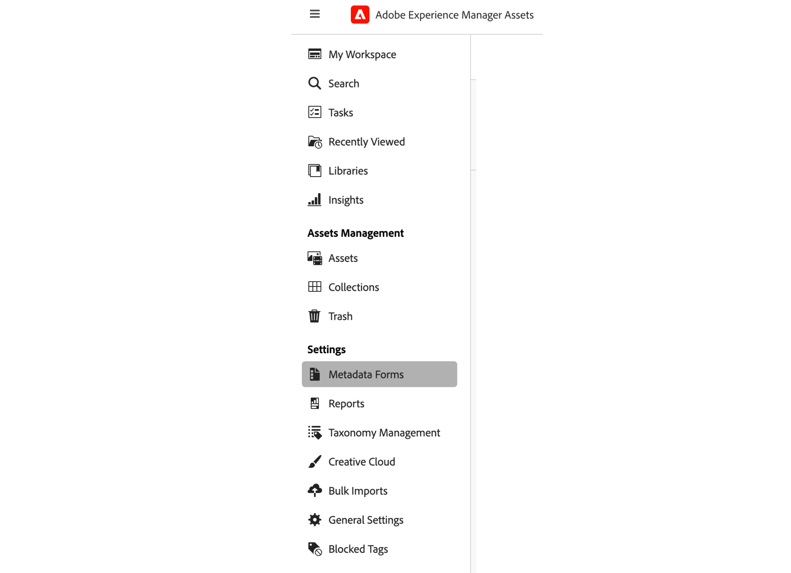

# Metadatos en la vista de recursos {#metadata}

Los metadatos son los datos o la descripción de los datos. Por ejemplo, las imágenes, como recurso, pueden contener información acerca de la cámara en la que se hizo clic o cualquier información de copyright. Esta información son los metadatos de la imagen. Los metadatos son esenciales para una administración eficiente de los recursos. Los metadatos son la recopilación de todos los datos disponibles para un recurso, pero es posible que no estén necesariamente contenidos en ese recurso.

Los metadatos le ayudan a categorizar los recursos y son útiles a medida que aumenta la cantidad de información digital. Es posible administrar algunos cientos de archivos basados únicamente en los nombres de archivo, miniaturas y memoria. Sin embargo, este enfoque no es escalable. Se queda corto cuando aumenta el número de personas involucradas y el número de recursos administrados.

Con la adición de metadatos, el valor de un recurso digital aumenta, ya que pasa a ser:

* Más accesible: los sistemas y los usuarios pueden encontrarlo fácilmente.
* Más fácil de administrar: puede encontrar recursos con el mismo conjunto de propiedades más fácilmente y aplicarles cambios.
* Completado: el recurso lleva más información y contexto con más metadatos.

Por estos motivos, Assets le proporciona los medios adecuados para crear, administrar e intercambiar metadatos para sus recursos digitales.

## Visualización de los metadatos {#view-metadata}

Para ver los metadatos de un recurso, navegue hasta él o búsquelo, selecciónelo y haga clic en **[!UICONTROL Detalles]** en la barra de herramientas.

*Figura: para ver un recurso y sus metadatos, haga clic en **[!UICONTROL Detalles]** en la barra de herramientas o haga doble clic en él.*

Los metadatos básicos, como título, descripción y fecha de carga, están disponibles en la pestaña [!UICONTROL Básico]. La pestaña [!UICONTROL Avanzado] contiene metadatos más avanzados, como el modelo de cámara, los detalles de la lente y etiquetas geográficas. La pestaña [!UICONTROL Etiquetas] contiene etiquetas aplicadas automáticamente en función del contenido de la imagen.

## Actualización de los metadatos {#update-metadata}

Una vez que el administrador configura el formulario de los metadatos, los demás campos se pueden actualizar manualmente. Es posible que desee cambiar esto, ya que solo se lee en función del formulario de metadatos predeterminado.

## Etiquetas inteligentes {#smart-tags}

[!DNL Experience Manager Assets] utiliza inteligencia artificial proporcionada por [Adobe Sensei](https://www.adobe.com/es/sensei.html) para aplicar automáticamente las etiquetas relevantes a todos los recursos cargados. Estas etiquetas, que reciben el adecuado nombre de Etiquetas inteligentes, aumentan la velocidad del contenido de los proyectos al ayudarle a encontrar recursos relevantes con rapidez. Las etiquetas inteligentes son un ejemplo de metadatos que no están contenidos en la imagen.

Las etiquetas inteligentes se aplican en tiempo casi real y se generan en función del contenido de la imagen. Al cargar un recurso, la interfaz de usuario muestra [!UICONTROL Procesando] en la miniatura del recurso durante un tiempo. Una vez completado el procesamiento, puede [ver los metadatos](#view-metadata) y las etiquetas inteligentes.

*Imagen: para ver las etiquetas inteligentes de un recurso, haga clic en **[!UICONTROL Detalles]** en la barra de herramientas o haga doble clic en él.*

Las etiquetas inteligentes también contienen una puntuación de confianza en forma de porcentaje. Indica la confianza asociada a la etiqueta aplicada. Puede moderar las etiquetas inteligentes aplicadas automáticamente.

## Adición o actualización de etiquetas {#manually-tag}

Puede añadir más etiquetas a los recursos, además de las etiquetas inteligentes que se agregan automáticamente, usando el servicio inteligente de [!DNL Adobe Sensei]. Abra un recurso para previsualizarlo, haga clic en [!UICONTROL Etiquetas] y escriba las palabras clave que desee en el campo [!UICONTROL Palabras clave]. Para añadir la etiqueta, pulse Intro. [!DNL Assets view] indexa la palabra clave casi en tiempo real y su equipo puede buscar rápidamente los recursos actualizados con las nuevas palabras clave.

También puede quitar etiquetas de la sección [!UICONTROL Etiquetas inteligentes], que [!DNL Assets view] añade automáticamente a todos los recursos cargados.

## Administración de taxonomía {#taxonomy-management}

Las etiquetas también se pueden anidar en una jerarquía para admitir relaciones como categoría y subcategoría. Si necesita insertar etiquetas jerárquicas, el administrador las gestiona fácilmente en la sección [!UICONTROL Administración de taxonomía] de [!UICONTROL Configuración]. Puede crear un conjunto controlado de áreas de nombres y etiquetas a las que todos los usuarios pueden acceder para utilizar mientras describen el contenido. Solo los administradores pueden configurar jerarquías de etiquetas en [!UICONTROL Administrador de taxonomía] garantizando que los valores se controlan y utilizan de forma coherente.

## Configuración de formularios de metadatos {#metadata-forms}

>[!CONTEXTUALHELP]
>id="assets_metadata_forms"
>title="Formularios de metadatos"
>abstract="[!DNL Experience Manager Assets] proporciona muchos campos de metadatos estándar de forma predeterminada. Las organizaciones tienen requisitos de metadatos adicionales, y necesitan más campos para agregar los metadatos específicos de su empresa. Los formularios de metadatos permiten a las empresas añadir campos de metadatos personalizados a la página Detalles de un recurso. Los metadatos específicos de la empresa mejoran el control y el descubrimiento de sus recursos."

La vista de recursos proporciona muchos campos de metadatos estándar de forma predeterminada. Las organizaciones tienen requisitos de metadatos adicionales y necesitan más campos para agregar los específicos de su empresa. Los formularios de metadatos permiten a las empresas añadir campos de metadatos personalizados a la página [!UICONTROL Detalles] de un recurso. Los metadatos específicos de la empresa mejoran el control y el descubrimiento de sus recursos. Puede crear formularios desde cero o reutilizar uno existente.

Puede configurar formularios de metadatos para diferentes tipos de recursos (diferentes tipos de MIME). Utilice el mismo nombre de formulario que el tipo MIME del archivo. La vista Recursos coincide automáticamente con el tipo MIME de los recursos cargados al nombre del formulario y actualiza los metadatos de los recursos cargados en función de los campos del formulario.
<!--
For example, if a metadata form by the name `PDF` or `pdf` exists, then the uploaded PDF documents contain metadata fields as defined in the form.
-->
La vista Recursos utiliza la siguiente secuencia para buscar nombres de formularios de metadatos existentes y aplicar los campos de metadatos a los recursos cargados de un tipo concreto:

Subtipo MIME > Tipo MIME > `default` formulario > Formulario predeterminado

Por ejemplo, si existe un formulario de metadatos con el nombre `PDF` o `pdf`, los documentos PDF cargados contienen campos de metadatos tal como se definen en el formulario. Si un formulario de metadatos con el nombre `PDF` o `pdf` no existe, la vista de recursos coincidirá si hay un formulario de metadatos con el nombre `application`. Si hay un formulario de metadatos con el nombre `application`, los documentos PDF cargados contienen campos de metadatos tal como se definen en el formulario. Si la vista Recursos sigue sin encontrar un formulario de metadatos coincidente, busca el `default` metadata form para aplicar campos de metadatos definidos en el formulario a los documentos de PDF cargados. Si ninguno de estos pasos funciona, la vista Recursos aplica campos de metadatos definidos en el formulario predeterminado a todos los documentos de PDF cargados.
Sin embargo, si desea asignar un formulario de metadatos a una carpeta [consulte](#assign-metadata-form-folder).

>[!IMPORTANT]
>
>El nuevo formulario de metadatos para un tipo de archivo específico reemplaza completamente el formulario de metadatos predeterminado que [!DNL Assets view] proporciona. Si elimina o cambia el nombre de un formulario de metadatos, los campos de metadatos predeterminados volverán a estar disponibles para los nuevos recursos.

Para crear un formulario de metadatos, siga estos pasos:

1. En el carril izquierdo, haga clic en **[!UICONTROL Ajustes]** > **[!UICONTROL Formularios de metadatos]**.

   

1. Haga clic en **[!UICONTROL Crear]**, en el área superior derecha de la interfaz de usuario.
1. Proporcione un nombre al formulario y haga clic en **[!UICONTROL Crear]**.
1. Proporcione un nombre para la pestaña en **[!UICONTROL Ajustes]**, en el carril derecho.
1. De los **[!UICONTROL Componentes]** disponibles en el carril izquierdo, arrastre los necesarios a una pestaña del formulario. Arrastre los componentes en la secuencia deseada.

   

   *Imagen: interfaz de creación de formularios de metadatos con opciones para añadir componentes y para previsualizar el formulario.*

1. Para cada componente, proporcione un nombre en **[!UICONTROL Configuración]**, en el carril derecho, y una asignación con las propiedades admitidas.
1. De forma opcional, para un componente, seleccione **[!UICONTROL Obligatorio]** para que el campo de metadatos sea obligatorio y **[!UICONTROL Solo lectura]** para que no se pueda editar en la página [!UICONTROL Detalles] del recurso.
1. Si lo desea, haga clic en **[!UICONTROL Previsualizar]** para previsualizar el formulario que está creando.
1. Opcionalmente, puede añadir más pestañas y los componentes necesarios en cada una.
1. Haga clic en **[!UICONTROL Guardar]** cuando haya completado el formulario.

Vea este vídeo para ver la secuencia de pasos:

>[!VIDEO](https://video.tv.adobe.com/v/341275)

Una vez creado un formulario, se aplica automáticamente cuando los usuarios cargan un recurso del tipo MIME correspondiente.

Para reutilizar un formulario existente y crear uno nuevo, seleccione un formulario de metadatos, haga clic en **[!UICONTROL Copiar]** en la barra de herramientas, proporcione un nombre y haga clic en **[!UICONTROL Confirmar]**. Puede editar un formulario de metadatos para cambiarlo. Al cambiar un formulario, se utiliza para los recursos cargados después del cambio. No cambia los recursos existentes.

### Componentes de propiedad {#property-components}

Puede personalizar el formulario de metadatos mediante cualquiera de los siguientes componentes de propiedad. Basta con arrastrar y soltar el tipo de componente en el formulario en la ubicación deseada y modificar la configuración del componente.
A continuación se ofrece una descripción general de cada tipo de propiedad y de cómo se almacenan.

| Nombre del componente | Descripción |
|---|---|
| Contenedor de acordeón | Añada un encabezado contraíble para ver una lista de componentes y propiedades comunes. Se puede expandir o contraer de forma predeterminada. |
| Texto de una sola línea | Añada una propiedad de texto de una sola línea. |
| Texto de varias líneas | Añada varias líneas de texto o un párrafo. Se expande a medida que un usuario escribe para incluir todo el contenido. |
| Texto con varios valores | Añada una propiedad de texto de varios valores. |
| Número | Añada un componente de número. |
| Casilla de verificación | Añada un valor booleano. Se almacena como TRUE o FALSE una vez que se guarda un valor. |
| Fecha | Añada un componente de fecha. |
| Lista desplegable | Añada una lista desplegable. |
| Estado | Añadir la propiedad de estado del repositorio (asignada a repo:state) |
| Estado de los recursos | Añadir la propiedad predeterminada Estado del recurso (asignada a dam:assetStatus) |
| Etiquetas | Añada una etiqueta de los valores almacenados en Administración de taxonomía (asignados a xcm:tags). |
| Palabras clave | Añada palabras clave de forma libre (asignadas a dc:subject). |
| Etiquetas inteligentes | Añada para aumentar las capacidades de búsqueda añadiendo automáticamente etiquetas de metadatos. |

### Asignar un formulario de metadatos a una carpeta {#assign-metadata-form-folder}

También puede asignar un formulario de metadatos a una carpeta dentro de la implementación de la vista Recursos. El formulario de metadatos asignado a una carpeta según el tipo MIME se sobrescribe cuando se aplica un formulario de metadatos a una carpeta manualmente. Todos los recursos de la carpeta, incluidos los de las subcarpetas, muestran las propiedades definidas en el formulario de metadatos.

Para asignar un formulario de metadatos a una carpeta:

1. Vaya a **[!UICONTROL Configuración]** > **[!UICONTROL Formularios de metadatos]** y seleccione un formulario de metadatos.

2. Haga clic en **[!UICONTROL Asignar a carpeta]**.

3. Seleccione la carpeta y haga clic en **[!UICONTROL Asignar]**. Puede seleccionar las carpetas haciendo clic en sus nombres.

   

   También puede navegar a la página de detalles de la carpeta y seleccionar un formulario de metadatos de las propiedades de carpeta disponibles en el panel derecho para asignar el formulario de metadatos a la carpeta.

   

### Quitar formulario de metadatos de las carpetas {#remove-metadata-form-folder}

Después de asignar un formulario de metadatos a una o varias carpetas, Experience Manager Assets también permite quitar formularios de metadatos de las carpetas seleccionadas.

Para quitar un formulario de metadatos de una carpeta:

1. Vaya a **[!UICONTROL Configuración]** > **[!UICONTROL Formularios de metadatos]** y seleccione un formulario de metadatos.

1. Clic **[!UICONTROL Eliminar de las carpetas]**. Se muestra la lista de carpetas asignadas para el formulario de metadatos.

1. Seleccione la carpeta y haga clic en **[!UICONTROL Eliminar]**. También puede seleccionar varias carpetas de la lista.

También puede navegar a la página de detalles de la carpeta y seleccionar **[!UICONTROL Formulario de metadatos asignado al sistema]** desde el **[!UICONTROL Metadatos de Forms]** para quitar el formulario de metadatos asignado de una carpeta.

## Pasos siguientes {#next-steps}

* [Vea un vídeo para administrar formularios de metadatos en la vista Recursos](https://experienceleague.adobe.com/docs/experience-manager-learn/assets-essentials/configuring/metadata-forms.html?lang=es)

* Realice comentarios del producto mediante la opción [!UICONTROL Comentarios] disponible en la interfaz de usuario de la vista Recursos

* Proporcione comentarios sobre la documentación usando [!UICONTROL Editar esta página]  o [!UICONTROL Registrar una incidencia] , disponibles en la barra lateral derecha

* Contacto con el [Servicio de atención al cliente](https://experienceleague.adobe.com/?support-solution=General&amp;lang=es#support)

<!-- TBD: Cannot create a form using the second option. Documenting only the first option for now.
To reuse an existing form to create a form, do one of these:

* Select a metadata form and click **[!UICONTROL Copy]** from the toolbar, provide a name, and click **[!UICONTROL Confirm]**.

* Click **[!UICONTROL Create]**, select **[!UICONTROL Use existing form structure as template]** option, and select an existing form. 
-->

<!-- TBD: Queries for PM and engg.

Can we edit the existing metadata in any form?

How to moderate smart tags?

Allow or deny list for smart tags?

What about Tags displayed just above Smart Tags in the UI?

Is there a detailed metadata tab. Where do the other details of an asset go?

How can one search based strictly on the metadata. Similar to AEM Assets GQL queries.
-->

<!-- TBD: Link to related articles if any.

>[!MORELIKETHIS]
>
>* [Search assets](search.md).
-->
