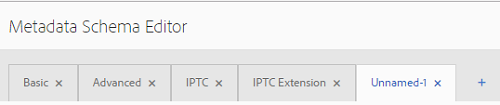

# Esquemas de metadatos {#metadata-schemas}

Las organizaciones idean un modelo de metadatos que mejora la detección de recursos, el uso, la interoperabilidad, etc. La aplicación correcta de metadatos es sacrosanta para mantener flujos de trabajo y procesos impulsados por metadatos. Para adherirse a la estrategia y los estándares de metadatos de toda la organización, puede utilizar esquemas de metadatos que ayuden a los usuarios de DAM a alinearse. [!DNL Adobe Experience Manager] permite métodos fáciles y flexibles para crear, mantener y aplicar esquemas de metadatos.

Entrada [!DNL Adobe Experience Manager Assets], los esquemas contienen campos específicos para que se rellene la información específica. También contiene información de diseño para mostrar los campos de metadatos de una manera fácil de usar. Las propiedades de metadatos incluyen título, descripción, tipos MIME, etiquetas y más. Puede usar el complemento [!UICONTROL Forms de esquema de metadatos] editor para modificar los esquemas existentes o agregar esquemas de metadatos personalizados.

Para ver y editar la página de propiedades de un recurso, siga estos pasos:

1. Haga clic en **[!UICONTROL Ver propiedades]** opción de las acciones rápidas en el mosaico del recurso en la vista de tarjeta. También puede seleccionar un recurso y hacer clic en **[!UICONTROL Propiedades]**  en la barra de herramientas.

1. Puede editar las distintas propiedades de metadatos editables en las pestañas disponibles. Sin embargo, no puede modificar el recurso [!UICONTROL Tipo] en el [!UICONTROL Básico] de la página de propiedades.

   

   *Imagen: pestaña Básico del recurso [!UICONTROL Propiedades].*

   Para modificar el tipo MIME de un recurso, utilice un formulario de esquema de metadatos personalizado o modifique un formulario existente. Consulte [Editar Forms de esquema de metadatos](#edit-metadata-schema-forms) para obtener más información. Si modifica el esquema de metadatos de un tipo MIME, se modifica el diseño de página de propiedades de los recursos y de todos los subtipos. Por ejemplo, la modificación de un esquema jpeg en `default/image` solo modifica el diseño de metadatos (propiedades del recurso) para los recursos con tipo MIME `image/jpeg`. Sin embargo, si edita el esquema predeterminado, los cambios modifican el diseño de los metadatos para todos los tipos de recursos.

## Formularios de esquema de metadatos {#default-metadata-schema-forms}

Para ver una lista de formularios o plantillas, en [!DNL Experience Manager] interfaz navegar a **[!UICONTROL Herramientas]** > **[!UICONTROL Assets]** > **[!UICONTROL Esquemas de metadatos]**.

[!DNL Experience Manager] proporciona las siguientes plantillas de formulario de esquema de metadatos.

| Plantillas |  | Descripción |
|---|---|---|
| [!UICONTROL predeterminada] |  | El formulario de esquema de metadatos base para los recursos. |
|  | Los siguientes formularios secundarios heredan las propiedades del [!UICONTROL predeterminado] formulario: |  |
|  | <ul><li>[!UICONTROL dm_video]</li></ul> | Formulario de esquema para vídeos de Dynamic Media. |
|  | <ul><li>[!UICONTROL imagen]</li></ul> | Formulario de esquema para imágenes con el tipo MIME como `image/jpeg` y `image/png`.   El [!UICONTROL imagen] El formulario tiene las siguientes plantillas de formulario secundarias: <ul><li> [!UICONTROL jpeg]: Formulario de esquema para recursos con subtipo [!UICONTROL jpeg].</li> <li>[!UICONTROL riña]: Formulario de esquema para los recursos con TIFF de subtipo.</li></ul> |
|  | <ul><li>[!UICONTROL aplicación]</li></ul> | Formulario de esquema para recursos con tipo MIME como `application/pdf` y `application/zip`.  [!UICONTROL pdf]: Formulario de esquema para recursos con PDF de subtipo. |
|  | <ul><li>[!UICONTROL vídeo]</li></ul> | Formulario de esquema para recursos de vídeo con tipo MIME como `video/avi` y `video/mp4`. |
| [!UICONTROL colección] |  | Formulario de esquema para colecciones. |
| [!UICONTROL contentfragment] |  | Formulario de esquema para fragmentos de contenido. |
| [!UICONTROL formularios] |  | Este formulario de esquema está relacionado con [!DNL Adobe Experience Manager Forms]. |
| [!UICONTROL ugc_contentfragment] |  | Formulario de esquema para elementos y recursos de contenido generado por el usuario e integrado en Experience Manager desde medios sociales. |

>[!NOTE]
>
>Para ver los formularios secundarios de un formulario de esquema, haga clic en su nombre.

## Agregar un formulario de esquema de metadatos {#add-a-metadata-schema-form}

Para agregar un formulario de esquema de metadatos, siga estos pasos:

1. Para añadir una plantilla personalizada a la lista, haga clic en **[!UICONTROL Crear]** en la barra de herramientas.

   >[!NOTE]
   >
   >Se muestra un símbolo de bloqueo con las plantillas sin editar. Si personaliza una plantilla, esta no estará bloqueada .

1. En el cuadro de diálogo, proporcione el título del formulario de esquema y haga clic en **[!UICONTROL Crear]** para completar el proceso de creación del formulario.

## Editar formularios de esquema de metadatos {#edit-metadata-schema-forms}

Puede editar un formulario de esquema de metadatos recién agregado o existente. El formulario de esquema de metadatos incluye pestañas y elementos de formulario en pestañas. Puede asignar o configurar estos elementos de formulario a un campo dentro de un nodo de metadatos en el repositorio CRX. Puede agregar pestañas o elementos de formulario al formulario de esquema de metadatos. Las pestañas y los elementos de formulario derivados del elemento principal están en estado bloqueado. No se pueden modificar en el nivel secundario.

1. En el [!UICONTROL Forms de esquema de metadatos] , seleccione un formulario y haga clic en **[!UICONTROL Editar]** en la barra de herramientas.

1. En el **[!UICONTROL Editor de formularios de esquemas de metadatos]** , personalice el formulario de metadatos. Arrastre los componentes necesarios desde el **[!UICONTROL Generar formulario]** a una de las pestañas.

   

   *Figura: A [!UICONTROL Editor de formularios de esquemas de metadatos] página con fichas disponibles.*

1. Para configurar un componente, selecciónelo y modifique sus propiedades en la **[!UICONTROL Configuración]** pestaña.

### Componentes dentro de [!UICONTROL Generar formulario] pestaña {#components-within-the-build-form-tab}

El **[!UICONTROL Generar formulario]** La pestaña enumera los elementos de formulario que utiliza en el formulario de esquema. El **[!UICONTROL Configuración]** proporciona los atributos de cada elemento seleccionado en la **[!UICONTROL Generar formulario]** pestaña. En la tabla siguiente se enumeran los elementos de formulario disponibles en la variable **[!UICONTROL Generar formulario]** pestaña:

| Nombre del componente | Descripción |
| -------------------------------- | ----------------------------------------------------------------------------------- |
| [!UICONTROL Sección de encabezado] | Añada un encabezado de sección para una lista de componentes comunes. |
| [!UICONTROL Texto de una sola línea] | Agregue una propiedad de texto de una sola línea. Se almacena como una cadena. |
| [!UICONTROL Texto con varios valores] | Agregue una propiedad de texto de varios valores. Se almacena como una matriz de cadenas. |
| [!UICONTROL Número] | Añada un componente numérico. |
| [!UICONTROL Fecha] | Añada un componente de fecha. |
| [!UICONTROL Lista desplegable] | Añada una lista desplegable. |
| [!UICONTROL Etiquetas estándar] | Añadir una etiqueta. |
| [!UICONTROL Etiquetas inteligentes] | Añada para aumentar las capacidades de búsqueda mediante la adición automática de etiquetas de metadatos. |
| [!UICONTROL Campo oculto] | Agregue un campo oculto. Se envía como parámetro de POST cuando se guarda el recurso. |
| [!UICONTROL Recurso al que se hace referencia en] | Agregue este componente para ver la lista de recursos a los que hace referencia el recurso. |
| [!UICONTROL Referencia de recursos] | Agregar para mostrar una lista de recursos que hacen referencia al recurso. |
| [!UICONTROL Referencias de productos] | Agregar para mostrar la lista de productos vinculados con el recurso. |
| [!UICONTROL Metadatos de contexto] | Agregue para controlar la visualización de otras pestañas de metadatos en la página de propiedades de los recursos. |

<!-- TBD: Ratings are not available in Experience Manager as a Cloud Service. Removed via cqdoc-18089 ticket. 
| [!UICONTROL Asset Rating]        | Add to display options for rating the asset.                                       |
-->

#### Editar el componente de metadatos {#edit-the-metadata-component}

Para editar las propiedades de un componente de metadatos en el formulario, haga clic en el componente para editar todas o un subconjunto de las siguientes propiedades en la **[!UICONTROL Configuración]** pestaña. Se recomienda asignar solo un campo a una propiedad determinada en el esquema de metadatos. De lo contrario, el sistema selecciona el último campo añadido asignado a la propiedad.

**Etiqueta de campo**: nombre de la propiedad de metadatos que se muestra en la página de propiedades del recurso.

**Asignar a la propiedad**: esta propiedad especifica la ruta relativa o el nombre del nodo del recurso donde se guarda en el repositorio CRX. Comienza con `./` para indicar que la ruta se encuentra en el nodo del recurso.

Los siguientes son ejemplos de valores válidos para una propiedad:

* `./jcr:content/metadata/dc:title`: Almacena el valor en el nodo de metadatos del recurso como propiedad `dc:title`.

* `./jcr:created`: Almacena la fecha y hora de creación de un recurso. Es una propiedad protegida. Si configura estas propiedades, Adobe recomienda marcarlas como Deshabilitar edición. De lo contrario, se produce el fallo “Error al modificar los recursos” al guardar las propiedades del recurso.

Para asegurarse de que el componente se muestra correctamente en el formulario de esquema de metadatos, la ruta de la propiedad no debe incluir espacios.

* **Marcador**: utilice esta propiedad para especificar el texto de marcador de posición correspondiente a la propiedad de metadatos.
* **Requerido**: utilice esta propiedad para marcar una propiedad de metadatos como obligatoria en la página de propiedades.
* **Desactivar edición**: utilice esta propiedad para impedir cualquier edición en una propiedad de la página de propiedades.
* **Mostrar campo vacío en solo lectura**: Marque esta propiedad para mostrar una propiedad de metadatos en la página de propiedades aunque no tenga valor. De forma predeterminada, cuando una propiedad de metadatos no tiene valor, no se muestra en la página de propiedades.
* **Mostrar lista en orden**: utilice esta propiedad para mostrar una lista ordenada de opciones.
* **Opciones**: utilice esta propiedad para especificar opciones en una lista.
* **Descripción** : utilice esta propiedad para agregar una descripción breve para el componente de metadatos.
* **Clase**: clase de objeto a la que está asociada la propiedad.
* **Eliminar**: haga clic en [!UICONTROL Eliminar] para eliminar un componente del formulario de esquema.

>[!NOTE]
>
>El [!UICONTROL Campo oculto] El componente no incluye estos atributos. En su lugar, incluye propiedades como los atributos Nombre, Valor, Etiqueta de campo y Descripción. Los valores del componente Campo oculto se envían como parámetro de POST cada vez que se guarda el recurso. No se puede guardar como metadatos para el recurso.

Si selecciona la opción **[!UICONTROL Obligatorio]**, puede buscar recursos que no tengan metadatos obligatorios. En el panel **[!UICONTROL Filtros]**, expanda el predicado **[!UICONTROL Validación de metadatos]** y seleccione la opción **[!UICONTROL No válido]**. Los resultados de la búsqueda muestran los recursos que carecen de metadatos obligatorios configurados a través del formulario de esquema.

Si agrega el componente Metadatos contextuales a cualquier pestaña de cualquier formulario de esquema, el componente aparece como una lista en la página de propiedades de los recursos a los que se aplica el esquema en particular. La lista incluye todas las demás pestañas, excepto la pestaña a la que se aplicó el componente Metadatos contextuales. Actualmente, esta función proporciona funcionalidad básica para controlar la visualización de metadatos en función del contexto.

Para mostrar cualquier pestaña en la página de propiedades además de la pestaña donde se aplica el componente Metadatos contextuales, seleccione la pestaña en la lista. La pestaña se añade a la página de propiedades.

### Especificar propiedades en el archivo JSON {#specify-properties-in-json-file}

En lugar de especificar propiedades para las opciones de la pestaña **[!UICONTROL Configuración]**, puede definir las opciones de un archivo JSON especificando los pares de clave-valor correspondientes. Especifique la ruta del archivo JSON en el campo **[!UICONTROL Ruta de JSON]**.

#### Agregar o eliminar una pestaña en el formulario de esquema {#add-delete-a-tab-in-the-schema-form}

El editor de esquemas permite agregar o eliminar una pestaña. El formulario de esquema predeterminado incluye el **[!UICONTROL Básico]**, **[!UICONTROL Avanzadas]** , **[!UICONTROL IPTC]**, y **[!UICONTROL Extensión IPTC]** pestañas.

Clic `+` para agregar una pestaña en un formulario de esquema. De forma predeterminada, la nueva pestaña tiene el nombre `Unnamed-1`. Puede modificar el nombre desde el **[!UICONTROL Configuración]** pestaña. Clic `X` para eliminar una pestaña.

## Eliminar formularios de esquema de metadatos {#deleting-metadata-schema-forms}

Experience Manager solo permite eliminar formularios de esquema personalizados. No permite eliminar los formularios o las plantillas de esquema predeterminados. Sin embargo, puede eliminar cualquier cambio personalizado en estos formularios.

Para eliminar un formulario, seleccione un formulario y haga clic en el icono Eliminar.

>[!NOTE]
>
>Después de eliminar los cambios personalizados en un formulario predeterminado, vuelve a aparecer el icono de candado antes de él en la interfaz del esquema de metadatos para indicar que el formulario ha vuelto a su estado predeterminado.

>[!NOTE]
>
>* Después de eliminar los cambios personalizados en un formulario predeterminado, el  vuelve a aparecer antes del formulario. Indica que el formulario se revierte a su estado predeterminado.
>* No puede eliminar los formularios de esquema de metadatos predeterminados en [!DNL Assets].

## Formularios de esquema para tipos MIME {#schema-forms-for-mime-types}

[!DNL Experience Manager] proporciona formularios predeterminados para varios tipos MIME de forma predeterminada. Sin embargo, puede agregar formularios personalizados para recursos de varios tipos MIME.

### Adición de nuevos formularios para tipos MIME {#adding-new-forms-for-mime-types}

Cree un formulario bajo el tipo de formulario correspondiente. Por ejemplo, para agregar una plantilla para `image/png` subtipo, cree el formulario en los formularios de &quot;imagen&quot;. El título del formulario de esquema es el nombre del subtipo. En este caso, el título es `png`.

#### Usar una plantilla de esquema existente para varios tipos MIME {#use-an-existing-schema-template-for-various-mime-types}

Puede utilizar una plantilla existente para un tipo MIME diferente. Por ejemplo, utilice la variable `image/jpeg` formulario para recursos de tipo MIME `image/png`.

En este caso, cree un nodo en `/etc/dam/metadataeditor/mimetypemappings` en el repositorio CRX. Especifique un nombre para el nodo y defina las siguientes propiedades:

| Nombre | Descripción | Tipo | Valor  |
|------|-------------|------|-------|
| `exposedmimetype` | Nombre del formulario existente que se debe asignar | `String` | `image/jpeg` |
| `mimetypes` | Lista de tipos MIME que utilizan el formulario definido en la variable `exposedmimetype` atributo | `String` | `image/png` |

[!DNL Assets] asigna los siguientes tipos MIME y formularios de esquema:

| Formulario de esquema | Tipos MIME |
|---|---|
| image/jpeg | image/pjpeg |
| image/tiff | image/x-tiff |
| application/pdf | application/postscript |
| application/x-ImageSet | Multipart/Related; type=application/x-ImageSet |
| application/x-SpinSet | Multipart/Related; type=application/x-SpinSet |
| application/x-MixedMediaSet | Multipart/Related; type=application/x-MixedMediaSet |
| video/quicktime | video/x-quicktime |
| video/mpeg4 | video/mp4 |
| video/avi | video/avi, video/msvideo, video/x-msvideo |
| video/wmv | video/x-ms-wmv |
| video/flv | video/x-flv |

## Concesión de acceso a esquemas de metadatos {#grant-access-to-metadata-schemas}

La función Esquema de metadatos solo está disponible para administradores. Sin embargo, los administradores pueden proporcionar acceso a los usuarios que no son administradores modificando algunos permisos. Proporcione a los usuarios que no son administradores permisos para crear, modificar y eliminar en `/conf` carpeta.

## Aplicar metadatos específicos de carpeta {#applying-folder-specific-metadata}

[!DNL Assets] permite definir una variante de un esquema de metadatos y aplicarla a una carpeta específica.

Por ejemplo, puede definir una variante del esquema de metadatos predeterminado y aplicarla a una carpeta. Al aplicar el esquema modificado, se anula el esquema de metadatos predeterminado original que se aplica a los recursos de la carpeta.

Solo los recursos cargados en la carpeta a la que se aplica este esquema se ajustan a los metadatos modificados definidos en el esquema de metadatos de variante. [!DNL Assets] en otras carpetas en las que se aplique el esquema original, siga ajustándose a los metadatos definidos en el esquema original.

La herencia de metadatos por recursos se basa en el esquema aplicado a la carpeta de nivel superior en la jerarquía. Las subcarpetas aplican o heredan el mismo esquema. Si se aplica un esquema diferente en el nivel de subcarpeta, se detiene la herencia.

1. Entrada [!DNL Experience Manager] interfaz, vaya a **[!UICONTROL Herramientas]** > **[!UICONTROL Assets]** > **[!UICONTROL Esquemas de metadatos]**. Se muestra la página **[!UICONTROL Formularios de esquema de metadatos]**.
1. Seleccione la casilla de verificación situada antes de un formulario, por ejemplo el formulario de metadatos predeterminado, y haga clic en **[!UICONTROL Copiar]** y guárdelo como un formulario personalizado. Especifique un nombre personalizado para el formulario, por ejemplo `my_default`. También puede crear un formulario personalizado.

1. En el **[!UICONTROL Forms de esquema de metadatos]** , seleccione la `my_default` y haga clic en **[!UICONTROL Editar]**.
1. En el **[!UICONTROL Editor de esquemas de metadatos]** , agregue un campo de texto al formulario de esquema. Por ejemplo, agregue un campo con la etiqueta **[!UICONTROL Categoría]**.
1. Haga clic en **[!UICONTROL Guardar]**. El formulario modificado aparece en la lista **[!UICONTROL Forms de esquema de metadatos]** página.
1. Hacer clic o tocar **[!UICONTROL Aplicar a las carpetas]** en la barra de herramientas para aplicar los metadatos personalizados a una carpeta.
1. Seleccione la carpeta en la que desea aplicar el esquema modificado y, a continuación, toque o haga clic en **[!UICONTROL Aplicar]**.
1. Si la carpeta tiene aplicado el otro esquema de metadatos, aparece un mensaje que advierte de que está a punto de sobrescribir el esquema de metadatos existente. Clic **Sobrescribir**.
1. Clic **OK** para cerrar el mensaje de éxito.
1. Navegue hasta la carpeta a la que aplicó el esquema de metadatos modificado.

## Definición de metadatos obligatorios {#defining-mandatory-metadata}

Puede definir campos obligatorios en el nivel de carpeta, que se aplican a los recursos cargados en la carpeta. Si carga recursos que carecen de metadatos para los campos obligatorios definidos anteriormente, aparecerá una indicación visual de la falta de metadatos en los recursos en la vista Tarjeta.

>[!NOTE]
>
>Un campo de metadatos se puede definir como obligatorio en función del valor de otro campo. En la vista Tarjetas, el Experience Manager no muestra el mensaje de advertencia sobre la falta de metadatos para estos campos de metadatos obligatorios.

1. Haga clic en el logotipo del Experience Manager y, a continuación, vaya a **[!UICONTROL Herramientas]** > **[!UICONTROL Assets]** > **[!UICONTROL Esquemas de metadatos]**. Se muestra la página **[!UICONTROL Formularios de esquema de metadatos]**.
1. Guarde el formulario de metadatos predeterminado como un formulario personalizado. Por ejemplo, guárdelo como `my_default`.
1. Edite el formulario personalizado. Añada un campo obligatorio. Por ejemplo, añada un **[!UICONTROL Categoría]** y haga que el campo sea obligatorio.
1. Haga clic en **[!UICONTROL Guardar]**. El formulario modificado aparece en la lista **[!UICONTROL Forms de esquema de metadatos]** página. Seleccione el formulario y toque o haga clic en él **[!UICONTROL Aplicar a las carpetas]** en la barra de herramientas para aplicar los metadatos personalizados a una carpeta.
1. Vaya a la carpeta y cargue algunos recursos a los que les faltan metadatos para el campo obligatorio agregado al formulario personalizado. Se muestra un mensaje para los metadatos que faltan para el campo obligatorio en la vista de tarjeta del recurso.
1. (Opcional) Acceso `https://[server]:[port]/system/console/components/`. Configuración y activación `com.day.cq.dam.core.impl.MissingMetadataNotificationJob` componente que está desactivado de forma predeterminada. Establezca la frecuencia con la que el Experience Manager comprueba la validez de los metadatos de los recursos.

   Esta configuración agrega una propiedad de `hasValidMetadata` hasta `jcr:content` de recursos. Con esta propiedad, el Experience Manager puede filtrar los resultados en una búsqueda.

   >[!NOTE]
   >
   >Si se agrega un recurso después de la comprobación programada, el recurso no se marca con `hasValidMetadata` hasta la siguiente comprobación programada. Los recursos no aparecen en los resultados de búsqueda intermedios.

   >[!CAUTION]
   >
   >Las comprobaciones de validación de metadatos consumen muchos recursos y pueden afectar al rendimiento del sistema. Programe las comprobaciones según corresponda. Si el servidor no puede soportar la carga, intente deshabilitar este trabajo
