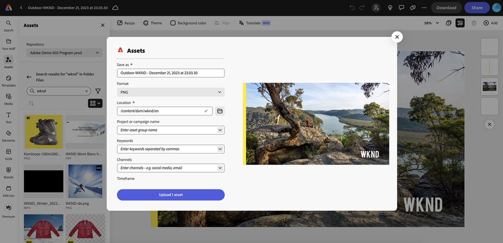

# Integración nativa con Adobe Express {#native-integration-adobe-express}

AEM Assets se integra de forma nativa con Adobe Express, lo que le permite acceder directamente a los recursos almacenados en AEM Assets desde la interfaz de usuario de Adobe Express. Puede colocar contenido administrado en AEM Assets en el lienzo Express y, a continuación, guardar contenido nuevo o editado en un repositorio de AEM Assets. La integración ofrece las siguientes ventajas clave:

* AEM Se ha aumentado la reutilización del contenido mediante la edición y el guardado de nuevos recursos en los recursos de.

* Se ha reducido el tiempo y esfuerzo generales para crear nuevos recursos o crear nuevas versiones de los recursos existentes.

## Requisitos previos {#prerequisites}

Derechos para acceder al Adobe Express y al menos a un entorno dentro de AEM Assets. El entorno puede ser cualquiera de los repositorios de Assets as a Cloud Service o Assets Essentials.

## Uso de AEM Assets en el editor de Adobe Express {#use-aem-assets-in-express}

Siga estos pasos para empezar a utilizar AEM Assets en el editor de Adobe Express:

1. Abra la aplicación web de Adobe Express.

1. Abra un nuevo lienzo en blanco cargando una nueva plantilla o proyecto, o creando un recurso.

1. Clic **[!UICONTROL Assets]** disponible en el panel de navegación izquierdo. El Adobe Express muestra la lista de repositorios a los que puede acceder junto con la lista de recursos y carpetas disponibles en el nivel raíz.

1. Examine o busque recursos en su repositorio para arrastrarlos y colocarlos en el lienzo. Puede filtrar recursos mediante varios filtros disponibles, como tipo de archivo, tipo MIME y dimensiones.

   

## Guardar proyectos de Adobe Express en AEM Assets {#save-express-projects-in-assets}

Después de incorporar las modificaciones adecuadas en el lienzo Express, puede guardarlo en el repositorio de AEM Assets.

1. Clic **[!UICONTROL Compartir]** para abrir **[!UICONTROL Compartir]** diálogo.

   

1. Seleccionar **[!UICONTROL AEM Assets]** desde el **[!UICONTROL Almacenamiento]** disponible en el panel derecho. El Adobe Express muestra el cuadro de diálogo de carga.
1. Especifique un nombre y un formato para el recurso. Puede guardar el contenido del lienzo en formato PNG o en formato de JPEG.

1. Haga clic en el icono de carpeta junto al **[!UICONTROL Ubicación]** , vaya a la ubicación donde debe guardar el recurso y haga clic en **[!UICONTROL Seleccionar]**. El nombre de la carpeta se muestra en la **[!UICONTROL Ubicación]** field.

   

1. Opcional: puede añadir metadatos de campaña para la carga mediante la variable **[!UICONTROL Nombre del proyecto o campaña]** field. Puede utilizar un nombre existente o crear uno nuevo. Puede definir varios nombres de proyecto o campaña para la carga. Mientras escribe un nombre, haga clic en cualquier otro lugar del cuadro de diálogo o presione la tecla `,` Clave (coma) para registrar el nombre.

   Como práctica recomendada, Adobe recomienda especificar valores en el resto de los campos, así como crear una experiencia de búsqueda mejorada para los recursos cargados.
1. Del mismo modo, defina los valores de **[!UICONTROL Palabras clave]** y **[!UICONTROL Canales]** campos.

1. Clic **[!UICONTROL Cargar]** para cargar el recurso en AEM Assets.

## Restricciones {#limitations}

Algunos usuarios con acceso a más de un repositorio de Assets experimentan un error conocido al guardar un documento con recursos de varios repositorios.
