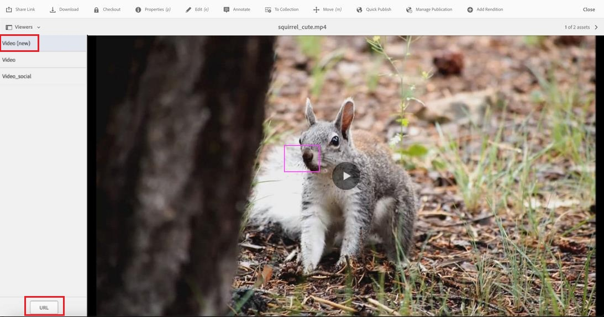
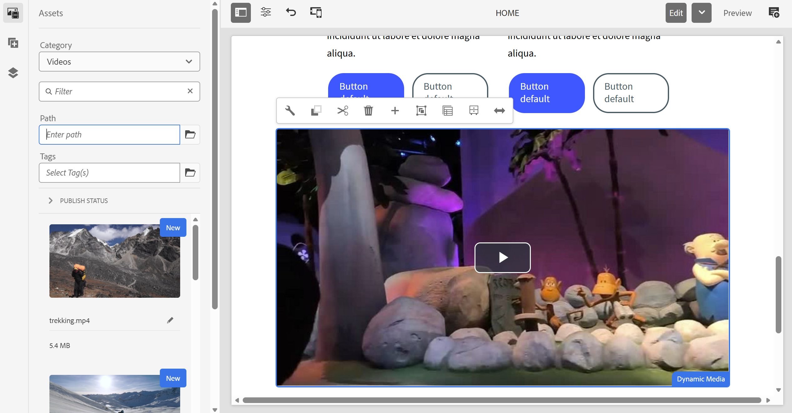
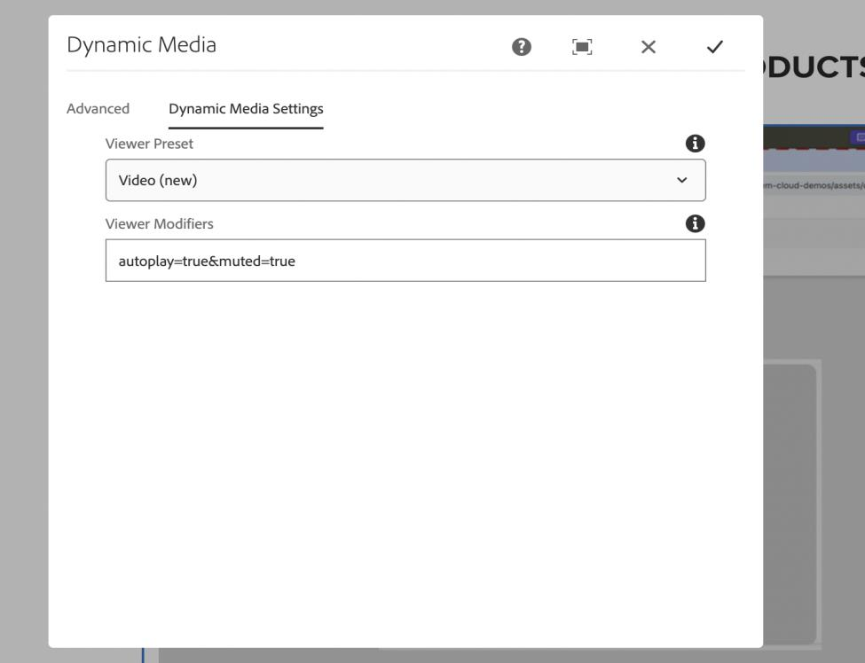

# Nuevo visor de vídeo en Dynamic Media {#new-video-viewer-dynamic-media}

El nuevo Visor de vídeo para Dynamic Media ofrece una experiencia de reproducción de vídeo modernizada en Adobe Experience Manager (AEM). Proporciona una experiencia de visualización coherente y ampliable en los entornos de creación, previsualización y Sites, a la vez que sigue funcionando con los flujos de trabajo de Dynamic Media existentes.

Los visores de vídeo existentes en Dynamic Media admiten los requisitos principales de reproducción, pero proporcionan una extensibilidad limitada y una integración de nivel de evento para escenarios modernos de integración y análisis

El nuevo visor de vídeo aborda estas limitaciones mediante lo siguiente:

* Proporciona una experiencia de reproducción más coherente
* Permitir la selección explícita de visualizadores
* Emisión de eventos de reproducción estructurada para el consumo programático
* Integración compatible con análisis externos y sistemas externos

El visor está disponible como opción adicional y requiere una selección explícita cuando se admite. No reemplaza automáticamente a los visores de vídeo existentes.

El nuevo Visor de vídeo está diseñado para organizaciones que requieren una experiencia de vídeo mejorada y ampliable sin interrumpir las implementaciones existentes.

> **NOTA**
>
> El nuevo visor de vídeo es una función de disponibilidad limitada. Puedes habilitarlo creando un [ticket de asistencia](https://helpx.adobe.com/es/enterprise/using/support-for-experience-cloud.html).

## Cómo funciona el nuevo visor de vídeo {#how-it-works}

El nuevo Visor de vídeo funciona de la siguiente manera:

1. Se incorpora un recurso de vídeo en una carpeta sincronizada con Dynamic Media.
2. Se puede obtener una vista previa del vídeo desde la página de detalles del recurso con **Vídeo (nuevo)**.
3. Se puede seleccionar el nuevo visor de vídeo en el componente **Dynamic Media** al crear páginas de Sites.
4. Durante la reproducción, el visor emite eventos estructurados a la ventana principal.
5. Se pueden utilizar modificadores de visor opcionales para controlar el comportamiento de reproducción.

## Diferencias clave con respecto al Visor de vídeo existente {#key-differences}

| Área | Descripción |
|------|-------------|
| Disponibilidad del visor | Aparece como una nueva opción denominada **Vídeo (nuevo)** |
| Selección de visor | Debe estar seleccionado explícitamente |
| Extensibilidad | Emite eventos de reproducción estructurados |
| Integración | Sigue funcionando con los flujos de trabajo de Dynamic Media existentes |

## Requisitos previos {#prerequisites}

Antes de usar el Nuevo visor de vídeo, asegúrese de que se cumplen los siguientes requisitos previos:

| Requisito | Descripción |
|------------|-------------|
| Sincronización de Dynamic Media | La carpeta de recursos debe sincronizarse con Dynamic Media. |
| Perfil de vídeo | Se debe aplicar un perfil de vídeo a la carpeta. |
| Recurso de vídeo | Se debe ingerir un vídeo en la carpeta. |

El nuevo Visor de vídeo está disponible a partir de la **versión de AEM as a Cloud Service 2025.7.0**.

Para habilitar o deshabilitar el Nuevo visor de vídeo, póngase en contacto con el Servicio de atención al cliente de Adobe.

## Vista previa del nuevo visor de vídeo {#preview}

Siga estos pasos para obtener una vista previa del nuevo visor de vídeo desde la página de detalles de recursos:

1. Vaya a **Assets** > **Archivos** y abra la carpeta que contiene el recurso de vídeo.
2. Haga clic en el recurso de vídeo para abrir la página de detalles del recurso.
3. En el panel izquierdo, haga clic en **Visualizadores**.
4. En el panel **Visualizadores**, seleccione **Vídeo (nuevo)**.
5. Haga clic en **URL** para copiar el vínculo de vista previa.
   

## Uso del nuevo visor de vídeo en Sites {#use-in-sites}

El nuevo visor de vídeo está disponible a través del componente **Dynamic Media** existente en AEM Sites.

### Añadir el componente Dynamic Media

Ejecute los siguientes pasos para agregar un vídeo mediante el componente Dynamic Media:

1. Abra la página en el **editor de sitios**.
2. Arrastre el componente **Dynamic Media** a la ubicación requerida en la página.
3. Seleccione el componente **Dynamic Media** en la página.
4. Haga clic en el componente para abrir el selector de recursos.
5. Seleccione un recurso de vídeo.

### Configuración del visor

Ejecute los siguientes pasos para configurar el ajuste preestablecido de visualizador:

1. Seleccione el componente **Dynamic Media** en la página.
2. Haga clic en **Configurar** en la barra de herramientas de componentes.
   

3. En el **cuadro de diálogo de configuración de Dynamic Media**, seleccione **Vídeo (nuevo)** de la lista desplegable **Ajuste preestablecido de visor**.
   

4. Escriba los modificadores necesarios en el campo **Modificadores del visor** (por ejemplo, `autoplay=true&muted=true`).
   

5. Guarde los cambios.

El vídeo se carga en la página mediante el Nuevo visor de vídeo.

> **Nota:** El nuevo visor de vídeo no reemplaza automáticamente los vídeos existentes. Los usuarios deben seleccionar manualmente **Vídeo (nuevo)** en el **Ajuste preestablecido de visor** al usar el componente Dynamic Media, o actualizar las direcciones URL para que apunten al Nuevo visor de vídeo cuando sea necesario.

### Migración de vídeos mediante direcciones URL directas

Si accede a los vídeos a través de direcciones URL directas en lugar del componente Dynamic Media, puede cambiarlos al Nuevo visor de vídeo actualizando la dirección URL. Por ejemplo: `https://s7d1.scene7.com/dmviewers/html5/VideoViewer.html?asset=<video-asset>`

## Modificadores de visor {#viewer-modifiers}

Los modificadores de visor permiten controlar la carga de recursos, el comportamiento de reproducción, la selección de formato de flujo continuo y la presentación del visor.

| Modificador | Descripción |
|--------|-------------|
| `asset` | Especifica el ID de recurso del vídeo o conjunto de vídeos adaptable. |
| `posterimage` | Especifica la imagen mostrada antes de que comience la reproducción. |
| `serverurl` | Especifica la ruta raíz del servicio de imágenes. |
| `contenturl` | Especifica la ruta raíz del contenido. |
| `videoserverurl` | Especifica la ruta raíz del servidor de vídeo. |
| `sources.dash` | Especifica la URL del manifiesto DASH para la reproducción. |
| `sources.hls` | Especifica la URL del manifiesto de HLS para la reproducción. |
| `autoplay=true` | Inicia la reproducción automáticamente cuando se carga el vídeo. |
| `controls=true/false` | Muestra u oculta los controles de reproducción de vídeo. |
| `loop=true` | Reinicia la reproducción automáticamente después de que finalice el vídeo. |
| `muted=true` | Inicia la reproducción en estado silencioso. |
| `playbackrates` | Especifica las opciones de velocidad de reproducción disponibles. |
| `playback` | Especifica el formato de flujo continuo (automático, hls, guión o progresivo). |
| `progressivebitrate` | Especifica la velocidad de bits para la reproducción progresiva. |
| `initialbitrate` | Especifica la velocidad de bits inicial para flujo adaptable. |
| `isletterboxed=true/false` | Controla si el vídeo está en formato buzón o estirado. |
| `customcss` | Especifica un archivo CSS personalizado para el estilo del visor. |
| `transition` | Especifica el comportamiento de mostrar u ocultar la transición para los controles de visor. |

Los modificadores se especifican como parámetros de consulta en el campo **Modificadores del visor**.

## Eventos admitidos {#supported-events}

El Nuevo visor de vídeo emite los siguientes eventos durante la reproducción:

| Tipo de evento | Descripción |
|-----------|-------------|
| play | El vídeo comienza a reproducirse |
| pause | El vídeo está en pausa |
| buscar | El usuario busca dentro del vídeo |
| cargar | Se ha cargado el vídeo |
| cerrar | El reproductor está cerrado |
| metadatos | Metadatos como la duración |
| hito | Se alcanzó el hito de reproducción |
| current_time | Posición de reproducción periódica |
| pantalla completa | Abrir pantalla completa |
| un_fullscreen | Salir de pantalla completa |

## Gestión de eventos en la ventana principal {#handling-events}

El Nuevo visor de vídeo envía mensajes relacionados con la reproducción a la página principal durante las interacciones de vídeo.

Para controlar estos eventos, la aplicación principal debe detectar eventos de mensajes del explorador y validar el origen del mensaje antes de procesar los datos.

La carga útil de evento incluye información como el tipo de evento, el estado de reproducción, el tiempo de reproducción actual y metadatos adicionales. Estos eventos pueden utilizarse para admitir el seguimiento de análisis, las interacciones personalizadas o la integración con sistemas externos

Adobe recomienda validar el origen del mensaje para garantizar que los eventos se procesen solo desde dominios de Dynamic Media de confianza.

## Informe de participación en vídeo para el nuevo visor de vídeo {#video-engagement-report}

El informe Participación de vídeo proporciona métricas de análisis para los vídeos reproducidos con el nuevo Visor de vídeo en Dynamic Media. El informe ofrece datos de rendimiento agregados para el mes especificado y admite informes mensuales.

Los informes se generan bajo petición. Para solicitar un informe, crea un [ticket de soporte](https://helpx.adobe.com/es/enterprise/using/support-for-experience-cloud.html) y proporciona los siguientes detalles:

* Mes del informe: especifique el mes para el que se requiere el informe (por ejemplo, enero de 2026).
* Dirección de correo electrónico de envío: dirección de correo electrónico del grupo (recomendado) o del individuo que va a enviar el informe

El informe proporciona métricas de participación por vídeo que incluyen vistas, impresiones, tiempo de visualización, tasa de finalización y puntuación de participación.

### Formato del informe

* Los informes se entregan en formato CSV.
* Cada fila representa un solo vídeo.
* Las métricas se agregan para el período de informe seleccionado.
* Los recursos eliminados se excluyen del informe.
* Admite filtrado por `tenant_name`.

### Campos del informe

El informe Participación en vídeo incluye los siguientes campos:

| Campo | Descripción | Cálculo |
|-------|------------|-------------|
| `video_id` | Identificador único de vídeo. | ND |
| `video_name` | Nombre del recurso de vídeo. | ND |
| `video_created_date` | Fecha de creación del vídeo. | ND |
| `duration_in_seconds` | Duración del vídeo en segundos. | ND |
| `video_views` | Número total de eventos de reproducción de vídeo durante el período de informe seleccionado. | ND |
| `video_impressions` | Número total de veces que se cargó el vídeo. | ND |
| `video_watched_seconds` | Segundos totales vistos en todos los eventos de reproducción. | Suma de segundos vistos en todos los eventos de reproducción |
| `play_rate` | Porcentaje de reproducciones de vídeo en relación con cargas de vídeo. | (`video_views` ÷ `video_impressions`) × 100 |
| `avg_time_watched_in_seconds` | Segundos promedio observados por vista. | `video_watched_seconds` ÷ `video_views` |
| `avg_completion_rate` | Porcentaje de vistas que alcanzaron la finalización completa del vídeo. | (Vistas completadas ÷ `video_views`) × 100 |
| `engagement_score` | Porcentaje promedio de visualización en todos los eventos de reproducción. | (Porcentaje total de la cronología del vídeo vista en todas las sesiones ÷ `video_views`) |
| `tenant_name` | Identificador de la compañía o inquilino asociado con los datos. | ND |

## Preguntas frecuentes {#faq-video-engagement}

+++Si un vídeo se configura para la reproducción automática, ¿se cuenta como una vista automáticamente o solo después de que el usuario lo vea durante un tiempo mínimo?

La reproducción automática se cuenta como una vista de vídeo. La reproducción iniciada automáticamente se registra como una vista.

+++

+++Si un usuario ve solo parte de un vídeo (por ejemplo, los primeros 2 segundos y los últimos 2 segundos de un vídeo de 10 segundos), ¿se cuenta como una vista completada?

Una vista se cuenta como completada cuando la reproducción llega al final de la cronología del vídeo, incluso si se omitieron partes del vídeo.

+++

+++Si un usuario retrocede y vuelve a ver partes del vídeo, ¿aumenta el recuento de video_views, el engagement_score o ambos?

Volver a ver partes del vídeo no aumenta el recuento de video_views. La reproducción adicional contribuye a engagement_score.

+++

+++Si el mismo usuario ve el mismo vídeo varias veces sin volver a cargar la página, ¿cómo se calculan video_views y engagement_score?

La reproducción repetida sin volver a cargar la página no aumenta el recuento de video_views. La reproducción adicional contribuye a engagement_score.

+++

+++¿La pausa y reanudación de un vídeo afecta al seguimiento de la participación o al cálculo de la tasa de finalización?

Pausar y reanudar la reproducción no afecta al seguimiento de la participación ni al cálculo de la tasa de finalización.

+++
