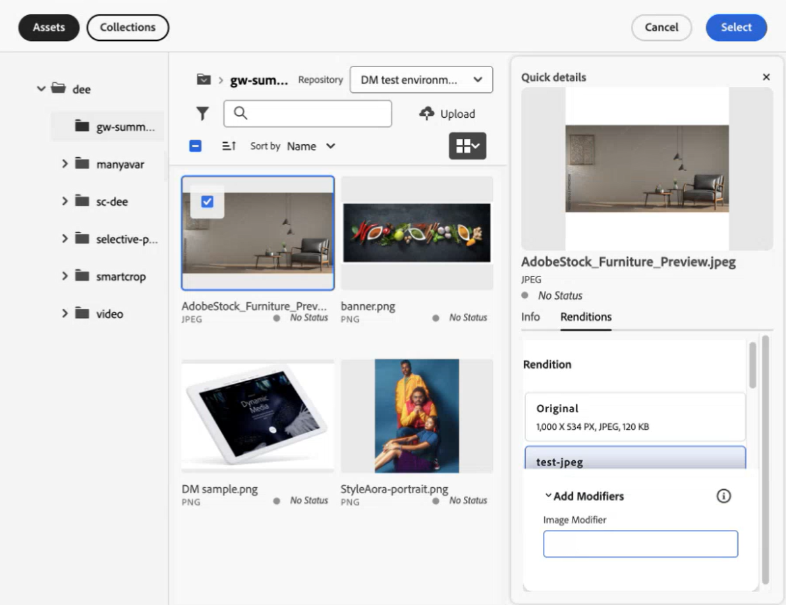

# Selector de recursos de Micro-Frontend {#Overview}

<table>
    <tr>
        <td>
            <sup style= "background-color:#008000; color:#FFFFFF; font-weight:bold"><i>Nuevo</i></sup> <a href="/help/assets/dynamic-media/dm-prime-ultimate.md"><b>Dynamic Media Prime y Ultimate</b></a>
        </td>
        <td>
            <sup style= "background-color:#008000; color:#FFFFFF; font-weight:bold"><i>Nuevo</i></sup> <a href="/help/assets/assets-ultimate-overview.md"><b>AEM Assets Ultimate</b></a>
        </td>
        <td>
            <sup style= "background-color:#008000; color:#FFFFFF; font-weight:bold"><i>Nuevo</i></sup> <a href="/help/assets/integrate-aem-assets-edge-delivery-services.md"><b>Integración de AEM Assets con Edge Delivery Services</b></a>
        </td>
        <td>
            <sup style= "background-color:#008000; color:#FFFFFF; font-weight:bold"><i>New</i></sup> <a href="/help/assets/aem-assets-view-ui-extensibility.md"><b>Extensibilidad de la IU</b></a>
        </td>
          <td>
            <sup style= "background-color:#008000; color:#FFFFFF; font-weight:bold"><i>Nuevo</i></sup> <a href="/help/assets/dynamic-media/enable-dynamic-media-prime-and-ultimate.md"><b>Habilitar Dynamic Media Prime y Ultimate</b></a>
        </td>
    </tr>
    <tr>
        <td>
            <a href="/help/assets/search-best-practices.md"><b>Prácticas recomendadas de búsqueda</b></a>
        </td>
        <td>
            <a href="/help/assets/metadata-best-practices.md"><b>Prácticas recomendadas de metadatos</b></a>
        </td>
        <td>
            <a href="/help/assets/product-overview.md"><b>Centro de contenido</b></a>
        </td>
        <td>
            <a href="/help/assets/dynamic-media-open-apis-overview.md"><b>Dynamic Media con funciones de OpenAPI</b></a>
        </td>
        <td>
            <a href="https://developer.adobe.com/experience-cloud/experience-manager-apis/"><b>Documentación de desarrollador de AEM Assets</b></a>
        </td>
    </tr>
</table>

El Selector de recursos de Micro-Frontend proporciona una interfaz de usuario que se integra fácilmente con el repositorio de [!DNL Experience Manager Assets] para poder examinar o buscar recursos digitales disponibles en el repositorio y utilizarlos en la experiencia de creación de la aplicación.

La interfaz de usuario de Micro-Frontend está disponible en la experiencia de su aplicación mediante el paquete Selector de recursos. Las actualizaciones del paquete se importan automáticamente y el último Selector de recursos implementado se carga automáticamente en la aplicación.


El Selector de recursos ofrece muchas ventajas, como las siguientes:

* Facilidad de integración con cualquiera de las aplicaciones [Adobe](/help/assets/integrate-asset-selector-adobe-app.md) o [que no sean de Adobe](/help/assets/integrate-asset-selector-non-adobe-app.md) que utilicen la biblioteca JavaScript convencional.
* Son fáciles de mantener, ya que las actualizaciones del paquete del Selector de recursos se implementan automáticamente en el Selector de recursos disponible para su aplicación. No se requieren actualizaciones dentro de la aplicación para cargar las modificaciones más recientes.
* Facilidad de personalización, ya que hay propiedades disponibles que controlan la visualización del Selector de recursos en la aplicación.
* Filtros personalizados, de búsqueda de texto completo y listos para usar para navegar rápidamente a los recursos y utilizarlos en la experiencia de creación.
* Capacidad para cambiar repositorios dentro de una organización IMS para la selección de recursos.
* Capacidad para ordenar recursos por nombre, dimensiones y tamaño y verlos en la vista Lista, Cuadrícula, Galería o Cascada.

<!--Perform the following tasks to integrate and use Asset Selector with your [!DNL Experience Manager Assets] repository:

1. [Install Asset Selector](#installation)
2. [Integrate Asset Selector using Vanilla JS](#integration-using-vanilla-js)
3. [Use Asset Selector](#using-asset-selector)
-->

<!--
## Setting up Asset Selector {#asset-selector-setup}


-->

## Requisitos previos{#prereqs}

Debe asegurarse de que dispone de los siguientes métodos de comunicación:

* La aplicación host se está ejecutando en HTTPS.
* No puede ejecutar la aplicación en `localhost`. Si desea integrar el Selector de recursos en su equipo local, debe crear un dominio personalizado, por ejemplo `[https://<your_campany>.localhost.com:<port_number>]`, y añadir este dominio personalizado en la `redirectUrl list`.
* Puede configurar y añadir clientID a la variable de entorno de AEM Cloud Service con el `imsClientId` correspondiente.
<!--* You can configure and add `ADOBE_PROVIDED_CLIENT_ID` into the AEM Cloud Service environment variable with the respective `imsClientId`.
-->
* La lista de ámbitos de IMS debe definirse en la configuración del entorno.
* La URL de la aplicación está en la lista de URL de redirección permitidas del cliente de IMS.
* El flujo de inicio de sesión de IMS se configura y se representa mediante una ventana emergente en el explorador web. Por lo tanto, las ventanas emergentes deben habilitarse o permitirse en el explorador de destino.

Utilice los requisitos previos anteriores si necesita el flujo de trabajo de autenticación de IMS del Selector de recursos. Alternativamente, si ya está autenticado con el flujo de trabajo de IMS, puede añadir la información de IMS en su lugar.

**Más información**

* [Integrar el Selector de recursos con una aplicación de Adobe](/help/assets/integrate-asset-selector-adobe-app.md)
* [Integrar el Selector de recursos con una aplicación que no sea de Adobe](/help/assets/integrate-asset-selector-non-adobe-app.md)
* [Integrar las API abiertas de Dynamic Media del Selector de recursos](/help/assets/integrate-asset-selector-dynamic-media-open-api.md)


>[!IMPORTANT]
>
> Este repositorio está diseñado para servir como documentación suplementaria que describa las API disponibles y ejemplos de uso para la integración del Selector de recursos. Antes de intentar instalar o utilizar el Selector de recursos, asegúrese de que su organización tenga acceso al Selector de recursos como parte del perfil de Experience Manager Assets as a Cloud Service. Si no se le ha proporcionado acceso, no puede integrar ni utilizar estos componentes. Para solicitar el aprovisionamiento, el administrador del programa debe enviar un vale de asistencia marcado como P2 a Admin Console e incluir la siguiente información:
>
>* Nombres de dominio en los que está alojada la aplicación integradora.
>* Después del aprovisionamiento, se proporcionará a su organización `imsClientId`, `imsScope` y `redirectUrl` correspondientes a los entornos solicitados que son esenciales para la configuración del Selector de recursos. Sin estas propiedades válidas, no se pueden ejecutar los pasos de instalación.

## Instalación {#installation}

El Selector de recursos está disponibles a través de la CDN de ESM (por ejemplo, [esm.sh](https://esm.sh/)/[skypack](https://www.skypack.dev/)) y la versión de [UMD](https://github.com/umdjs/umd).

En navegadores que utilizan la **Versión de UMD** (recomendado):

```
<script src="https://experience.adobe.com/solutions/CQ-assets-selectors/static-assets/resources/assets-selectors.js"></script>

<script>
  const { renderAssetSelector } = PureJSSelectors;
</script>
```

En navegadores con compatibilidad con `import maps` con **Versión de CDN de ESM**:

```
<script type="module">
  import { AssetSelector } from 'https://experience.adobe.com/solutions/CQ-assets-selectors/static-assets/resources/@assets/selectors/index.js'
</script>
```

En la federación de módulos Deno/Webpack mediante **Versión de CDN de ESM**:

```
import { AssetSelector } from 'https://experience.adobe.com/solutions/CQ-assets-selectors/static-assets/resources/@assets/selectors/index.js'
```

## Uso del Selector de recursos {#using-asset-selector}

Una vez configurado el Selector de recursos y autenticado para usar el Selector de recursos con su aplicación [!DNL Adobe Experience Manager] as a [!DNL Cloud Service], puede seleccionar recursos o realizar otras operaciones para buscar los recursos dentro del repositorio.


* **A**: [Ocultar/Mostrar panel](#hide-show-panel)
* **B**: [Conmutador de repositorios](#repository-switcher)
* **C**: [Recursos](#repository)
* **D**: [Filtros](#filters)
* **E**: [Barra de búsqueda](#search-bar)
* **F**: [Ordenación](#sorting)
* **G**: [Ordenación en orden ascendente o descendente](#sorting)
* **H**: [Ver](#types-of-view)

### Ocultar/Mostrar panel {#hide-show-panel}

Para ocultar carpetas en el panel de navegación izquierdo, haga clic en el icono **[!UICONTROL Ocultar carpetas]**. Para deshacer los cambios, haga clic en el icono **[!UICONTROL Ocultar carpetas]** de nuevo.

### Conmutador de repositorios {#repository-switcher}

El Selector de recursos también le permite cambiar de repositorio para realizar la selección de recursos. Puede seleccionar el repositorio que desee en la lista desplegable disponible en el panel izquierdo. Las opciones del repositorio disponibles en la lista desplegable se basan en la propiedad `repositoryId` definida en el archivo `index.html`. Se basa en los entornos de la organización de IMS seleccionada a la que accede el usuario que ha iniciado sesión. Los consumidores pueden aprobar un `repositoryID` preferido y, en ese caso, el Selector de recursos deja de procesar el conmutador de repositorios y solo procesa los recursos del repositorio dado.

### Repositorio de recursos

Es una colección de carpetas de recursos que puede utilizar para realizar operaciones.

### Filtros listos para usar {#filters}

El Selector de recursos también proporciona opciones de filtro listas para usar para restringir los resultados de búsqueda. Los filtros disponibles son los siguientes:

* **[!UICONTROL Estado]:** es el estado actual del recurso, que puede ser `all`, `approved`, `rejected` o `no status`.
* **[!UICONTROL Tipo de archivo]:** incluye `folder`, `file`, `images`, `documents` o `video`.
* **[!UICONTROL Estado de caducidad]:** señala la duración de la caducidad de los recursos. Puede marcar la casilla de verificación `[!UICONTROL Expired]` para filtrar los recursos que han caducado o establecer el elemento `[!UICONTROL Expiration Duration]` de un recurso para mostrar los recursos en función de la duración de su caducidad. Cuando un recurso ya ha caducado o está a punto de hacerlo, aparece un distintivo que lo indica. Además, puede decidir si desea permitir el uso (o arrastrar y soltar) de un recurso caducado. Más información sobre [personalizar recursos caducados](/help/assets/asset-selector-customization.md#customize-expired-assets). De manera predeterminada, se muestra el distintivo **Caducará pronto** para los recursos que caduquen en los próximos 30 días. Sin embargo, puede configurar la caducidad mediante la propiedad `expirationDate`.

  >[!TIP]
  >
  > Si desea ver o filtrar recursos en función de su fecha de caducidad futura, mencione el intervalo de fechas futuras en el campo `[!UICONTROL Expiration Duration]`. Muestra los recursos que tienen el distintivo **caducará pronto**.

* **[!UICONTROL Tipo MIME]:** incluye `JPG`, `GIF`, `PPTX`, `PNG`, `MP4`, `DOCX`, `TIFF`, `PDF`, `XLSX`.
* **[!UICONTROL Tamaño de la imagen]:** incluye la anchura mínima/máxima y la altura mínima/máxima de la imagen.

  

### Búsqueda personalizada

Además de la búsqueda de texto completo, el Selector de recursos le permite buscar recursos dentro de los archivos mediante búsquedas personalizadas. Puede utilizar filtros de búsqueda personalizados en los modos Vista modal y Vista de carril.


También puede crear un filtro de búsqueda predeterminado para guardar los campos que busca con frecuencia y utilizarlos más adelante. Para crear una búsqueda personalizada de sus recursos, puede utilizar la propiedad `filterSchema`.

### Barra de búsqueda {#search-bar}

El Selector de recursos le permite realizar una búsqueda de texto completo de los recursos del repositorio seleccionado. Por ejemplo, si escribe la palabra clave `wave` en la barra de búsqueda, se muestran todos los recursos con la palabra clave `wave` mencionada en cualquiera de las propiedades de metadatos.

### Ordenación {#sorting}

Puede ordenar los recursos en el Selector de recursos por nombre, dimensiones o tamaño de un recurso. También puede ordenar los recursos en orden ascendente o descendente.

### Tipos de vista {#types-of-view}

El Selector de recursos le permite ver el recurso en cuatro vistas diferentes:

*  [!UICONTROL **Vista de lista**]: la vista de lista muestra los archivos y carpetas desplazables en una sola columna.
*  [!UICONTROL **Vista de cuadrícula**]: la vista de cuadrícula muestra archivos y carpetas desplazables en una cuadrícula de filas y columnas.
*  [!UICONTROL **Vista de galería**]: la vista de galería muestra los archivos o carpetas en una lista horizontal bloqueada en el centro.
*  [!UICONTROL **Vista en cascada**] La vista en cascada muestra los archivos o carpetas en forma de puente.

### Detalles y metadatos del recurso {#asset-details-and-metadata}

La página Detalles del recurso proporciona una vista completa de un recurso específico, consolidando toda la información clave en un solo lugar. Incluye una descripción general con el nombre, formato de archivo, estado y una breve descripción, junto con una vista previa o una miniatura para facilitar la identificación visual. También incluye metadatos de un recurso, como la fecha de creación, el autor, el tamaño, el esquema de colores, etc. Estos atributos ayudan a lograr una búsqueda, un filtrado y una clasificación eficientes de un recurso. El panel de detalles del recurso está disponible tanto en la vista modal como en la del carril del Selector de recursos. En la vista de carril, es necesario habilitar y configurar la propiedad `onDrop` para devolver un recurso. Como alternativa, en la vista modal, la propiedad `handleSelection` devuelve un recurso. Consulte [Propiedades del selector de recursos](asset-selector-properties.md).

Para ver los detalles de un recurso y los metadatos, ejecute los pasos siguientes:

1. Abra el MFE para el selector de recursos y vaya a un recurso.
1. Pase el puntero por encima del recurso y haga clic en .
1. Vaya a la pestaña **[!UICONTROL Información]** para ver los detalles del recurso. <!--Otherwise, go to the **[Renditions](#asset-renditions)** tab to see renditions of an asset.-->

Para personalizar el panel de vista de detalles de un recurso, consulte [Personalizar información en la vista modal](asset-selector-customization.md#customize-info-in-modal-view).


<!--

#### Asset renditions {#asset-renditions}

Renditions in Adobe Experience Manager (AEM) are customized versions of digital assets, such as images, designed for different devices and platforms to ensure optimal performance. See [Dynamic Media renditions](/help/assets/renditions.md#dynamic-media-renditions).

>[!NOTE]
>
>* Prerequisites to [Dynamic Media with OpenAPI Capabilities renditions](/help/assets/renditions.md##prereqs-dm-with-openapi-renditions).
>* Renditions tab in the details panel of an asset shows up if `featureSet`  props is set to `['detail-panel', 'dm-renditions']`.
>* An asset should be approved to see Dynamic Media with OpenAPI renditions and/or ensure processing/publishing of the asset to Dynamic Media is complete (for images only).



For assets that are approved and have renditions enabled, you see the **Dynamic Media with Open API** badge. 


Additionally, see [Asset Selector user interface for Dynamic Media with OpenAPI capabilities](integrate-asset-selector-dynamic-media-open-api.md##interface-dynamic-media-open-api).

##### Add modifiers {#modifiers-dm-media-renditions}

Beyond the common image settings available in the UI, Dynamic Media supports numerous advanced image modifications that you can specify in the Image Modifiers field. See [Defining image preset options with Image Modifiers](https://experienceleague.adobe.com/en/docs/experience-manager-65/content/assets/dynamic/managing-image-presets#defining-image-preset-options-with-image-modifiers).

-->

## Más información sobre las funcionalidades clave {#key-capabilities-asset-selector}

<table>
<tr>
    <td>
        <br/>
        <a href="integrate-asset-selector.md">Integrar el selector de recursos</a>
        <p>
        <em>Conozca varias funcionalidades para integrar el Selector de recursos con varias aplicaciones.
        </p>
     </td>
    <td>
        <br/>
        <a href="integrate-asset-selector-adobe-app.md">Integrar el selector de recursos con aplicaciones de Adobe</a>
        <p>
        <em>Descubra cómo integrar el Selector de recursos con varias aplicaciones de Adobe.</em>
        </p>
    </td>
    <td>
        <br/>
        <a href="integrate-asset-selector-non-adobe-app.md">Integrar el Selector de recursos con aplicaciones de terceros</a>
        <p>
        <em>Descubra las funcionalidades para integrar el Selector de recursos con aplicaciones que no sean de Adobe.</em>
        </p>
    </td>
    <td>
        <br/>
        <a href="integrate-asset-selector-dynamic-media-open-api.md">Integrar el Selector de recursos con las API abiertas de Dynamic Media</a>
        <p>
        <em>Obtenga información sobre cómo integrar el Selector de recursos con las API abiertas de Dynamic Media.</em>
        </p>
     </td>
     <td>
        <br/>
        <a href="asset-selector-properties.md">Propiedades del Selector de recursos</a>
        <p>
        <em>Comprenda el uso de las propiedades de forma práctica. </em>
        </p>
    </td>
</tr>
<tr>
    <td>
        <br/>
        <a href="asset-selector-examples.md">Ejemplos del Selector de recursos</a>
        <p>
        <em>Conozca los conceptos básicos de la personalización de varios componentes del Selector de recursos, como filtros, selección de recursos, recursos caducados y mucho más. </em>
        </p>
    </td>
    <td>
        <br/>
        <a href="asset-selector-customization.md">Personalizaciones del Selector de recursos</a>
        <p>
        <em>Configure y personalice varios componentes del Selector de recursos en función de su capacidad de uso. </em>
        </p>
    </td>
    <td>
        <br/>
        <a href="asset-selector-upload.md">Carga del Selector de recursos</a>
        <p>
        <em>Aprenda a cargar archivos o carpetas en el Selector de recursos desde su sistema de archivos local o de terceros. </em>
        </p>
    </td>
     <td>
        <br/>
        <a href="asset-selector-collections.md">Colecciones del Selector de recursos</a>
        <p>
        <em>Aprenda a utilizar colecciones en el Selector de recursos mediante el repositorio de Experience Manager. </em>
        </p>
    </td>
    <td>
    </td>
</tr>
</table>

>[!MORELIKETHIS]
>
>* [Personalizaciones del Selector de recursos](/help/assets/asset-selector-customization.md)
>* [Integrar el Selector de recursos con varias aplicaciones](/help/assets/integrate-asset-selector.md)
>* [Propiedades del Selector de recursos](/help/assets/asset-selector-properties.md)
>* [Integre el Selector de recursos con Dynamic Media con funciones de OpenAPI](/help/assets/integrate-asset-selector-dynamic-media-open-api.md)
