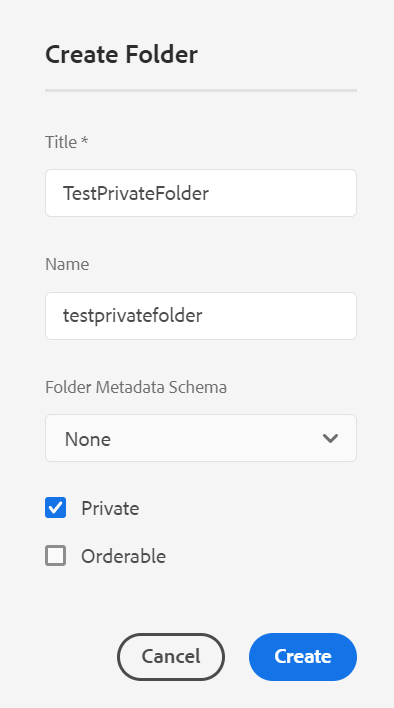

# Carpeta privada en [!DNL Adobe Experience Manager Assets] {#private-folder}

Puede crear una carpeta privada en la [!DNL Adobe Experience Manager Assets] interfaz de usuario que está disponible exclusivamente para usted. Puede compartir esta carpeta privada con otros usuarios y asignarles varios privilegios. En función del nivel de privilegios que asigne, los usuarios pueden realizar varias tareas en la carpeta, como ver los recursos dentro de la carpeta o editar los recursos.

>[!NOTE]
>
>La carpeta privada tiene al menos un miembro con la función Propietario.
>
>Para crear una carpeta privada, es necesario `Read` y `Modify` permisos en la carpeta principal en la que se crea una carpeta privada. Si no es administrador, estos permisos no están habilitados de forma predeterminada en `/content/dam`. En este caso, obtenga primero estos permisos para su ID o grupo de usuarios antes de intentar crear carpetas privadas.

## Crear y compartir una carpeta privada  {#create-share-private-folder}

Para crear y compartir una carpeta privada:

1. En el [!DNL Assets] en la consola, haga clic en **[!UICONTROL Crear]** en la barra de herramientas y, a continuación, seleccione **[!UICONTROL Carpeta]** del menú .

   

1. En el **[!UICONTROL Crear carpeta]** , introduzca un `Title` y `Name` (opcional) para la carpeta .

   Seleccione el **[!UICONTROL Privado]** y haga clic en **[!UICONTROL Crear]**.

   

   Se crea una carpeta privada. Ahora puede [agregar recursos](add-assets.md#upload-assets) a la carpeta y comparta la carpeta con otros usuarios o grupos. La carpeta no es visible para ningún otro usuario hasta que la comparta y les asigne privilegios.

1. Para compartir la carpeta, selecciónela y haga clic en **[!UICONTROL Propiedades]** en la barra de herramientas.

1. En el **[!UICONTROL Propiedades de carpeta]** seleccione un usuario o grupo de la **[!UICONTROL Agregar usuario]** , asigne una función (`Viewer`, `Editor`o `Owner`) en la carpeta privada y haga clic en **[!UICONTROL Agregar]**.

   

   Puede asignar varias funciones, como `Editor`, `Owner`o `Viewer` al usuario con el que comparte la carpeta. Si asigna una `Owner` función para el usuario, el usuario tiene `Editor` privilegios en la carpeta . Además, el usuario puede compartir la carpeta con otros usuarios. Si asigna una `Editor` , el usuario puede editar los recursos de la carpeta privada. Si asigna una función de visor, el usuario solo puede ver los recursos de la carpeta privada.

   >[!NOTE]
   >
   >La carpeta privada tiene al menos un miembro con `Owner` función. Por lo tanto, el administrador no puede quitar todos los miembros propietarios de una carpeta privada. Sin embargo, para eliminar los propietarios existentes (y el administrador mismo) de la carpeta privada, el administrador debe agregar otro usuario como propietario.

1. Haga clic en **[!UICONTROL Guardar y cerrar]**. Según la función que asigne, al usuario se le asignará un conjunto de privilegios en su carpeta privada cuando inicie sesión en [!DNL Assets].
1. Haga clic en **[!UICONTROL Ok]** para cerrar el mensaje de confirmación.
1. El usuario con el que comparte la carpeta recibe una notificación de uso compartido en su interfaz de usuario.

1. Haga clic en [!UICONTROL Notificaciones] para abrir una lista de notificaciones.

   

1. Haga clic en la entrada de la carpeta privada compartida por el administrador para abrir la carpeta.

## Eliminación de carpeta privada {#delete-private-folder}

Puede eliminar una carpeta seleccionando la carpeta y [!UICONTROL Eliminar] en el menú superior o utilizando la tecla Retroceso en el teclado.

>[!CAUTION]
>
>Si elimina una carpeta privada del CRXDE Lite, los grupos de usuarios redundantes se dejarán en el repositorio.

>[!NOTE]
>
>Si elimina una carpeta utilizando el método anterior de la interfaz de usuario, también se eliminan los grupos de usuarios asociados.
>
>Sin embargo, los grupos de usuarios redundantes, no utilizados y autogenerados existentes se pueden eliminar del repositorio utilizando `clean` en JMX en la instancia de autor (`http://[server]:[port]/system/console/jmx/com.day.cq.dam.core.impl.team%3Atype%3DClean+redundant+groups+for+Assets`).

**Consulte también**

* [Traducir recursos](translate-assets.md)
* [API HTTP de Recursos](mac-api-assets.md)
* [Formatos de archivo compatibles con Assets](file-format-support.md)
* [Buscar recursos](search-assets.md)
* [Recursos conectados](use-assets-across-connected-assets-instances.md)
* [Informes de Asset](asset-reports.md)
* [Esquemas de metadatos](metadata-schemas.md)
* [Descarga de recursos](download-assets-from-aem.md)
* [Administración de metadatos](manage-metadata.md)
* [Facetas de búsqueda](search-facets.md)
* [Administrar colecciones](manage-collections.md)
* [Importación masiva de metadatos](metadata-import-export.md)
