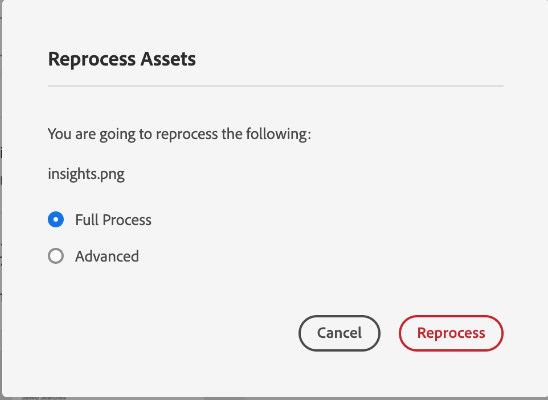
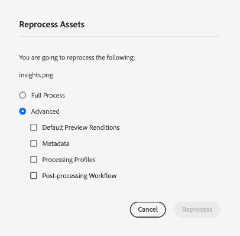
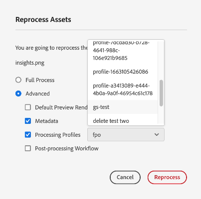

# Reprocesamiento de recursos digitales {#reprocessing-digital-assets}

Puede volver a procesar los recursos en una carpeta que ya tenga un perfil de metadatos existente cambiado después. Si desea que el ajuste preestablecido recién editado se vuelva a aplicar a los recursos existentes en la carpeta, debe volver a procesar la carpeta. Puede volver a procesar tantos recursos como sea necesario.

Vuelva a procesar los recursos en una carpeta si se da cualquiera de las dos situaciones siguientes:

* Desea ejecutar un ajuste preestablecido de conjunto por lotes en una carpeta de recursos existente que ya tenga recursos cargados en ella.
* Edita posteriormente un ajuste preestablecido por lotes existente que se había aplicado antes a una carpeta de recursos.

## Reprocesamiento de recursos {#reprocessing-steps}

Para volver a procesar recursos de una carpeta, siga estos pasos:

1. En [!DNL Experience Manager], desde la página Assets, seleccione los recursos añadidos recientemente o los recursos que desee volver a procesar.En caso de que seleccione una carpeta, siga estos pasos:

   * El flujo de trabajo considera recursivamente todos los archivos de la carpeta seleccionada.
   * Si hay una o más subcarpetas con recursos en la carpeta principal seleccionada, el flujo de trabajo vuelve a procesar cada recurso en la jerarquía de carpetas.
   * Como práctica recomendada, evite ejecutar este flujo de trabajo en una jerarquía de carpetas que tenga más de 1000 recursos.

1. Seleccione **[!UICONTROL Volver a procesar los recursos]**. Elija entre las dos opciones:

   

   * **[!UICONTROL Proceso completo]:** seleccione esta opción cuando desee ejecutar el proceso general, incluidos el perfil predeterminado, el perfil personalizado, el procesamiento dinámico (si está configurado) y los flujos de trabajo de posprocesamiento.
   * **[!UICONTROL Avanzado]:** seleccione esta opción para elegir el reprocesamiento avanzado.

     

     Seleccione entre las siguientes opciones avanzadas:

      * **[!UICONTROL Representaciones de previsualización predeterminadas]:** elija esta opción cuando desee volver a procesar las representaciones que se previsualizan de forma predeterminada.

      * **[!UICONTROL Metadatos]:** elija esta opción cuando desee extraer información de metadatos y etiquetas inteligentes para los recursos seleccionados.

      * **[!UICONTROL Perfiles de procesamiento]:** elija esta opción cuando desee volver a procesar un perfil seleccionado. Puede elegir la opción **[!UICONTROL Proceso completo]** para incluir el procesamiento predeterminado y el perfil personalizado asignado en el nivel de carpeta.        <!--When assets are uploaded to a folder, [!DNL Experience Manager] checks the containing folder's properties for a processing profile. If none is applied, a parent folder in the hierarchy is checked for a processing profile to apply.-->

      * **[!UICONTROL Flujo de trabajo de posprocesamiento]:** elija esta opción donde se requiera un procesamiento adicional de recursos que no se pueda lograr mediante los perfiles de procesamiento. Se pueden añadir a la configuración flujos de trabajo de posprocesamiento adicionales. El posprocesamiento le permite añadir un procesamiento completamente personalizado sobre el procesamiento configurable mediante microservicios de recursos.

Consulte [usar microservicios de recursos y perfiles de procesamiento](https://experienceleague.adobe.com/docs/experience-manager-cloud-service/content/assets/manage/asset-microservices-configure-and-use.html?lang=es) para obtener más información sobre los perfiles de procesamiento y el flujo de trabajo de posprocesamiento.

Después de seleccionar las opciones apropiadas, haga clic en **[!UICONTROL Volver a procesar]**. Aparece el mensaje de éxito.

## Escenarios para volver a procesar recursos digitales {#scenarios-reprocessing}

[!DNL Experience Manager] permite el reprocesamiento de recursos digitales para los siguientes componentes.

### Etiquetas inteligentes {#reprocessing-smart-tags}

Las organizaciones que trabajan con recursos digitales utilizan cada vez más vocabulario controlado por taxonomía en los metadatos de recursos. Básicamente, incluye una lista de palabras clave que los empleados, socios y clientes suelen utilizar para referirse a recursos digitales de una clase determinada y buscarlos. El etiquetado de recursos con vocabulario controlado por taxonomía garantiza que los recursos se identifiquen y recuperen con facilidad.

En comparación con los vocabularios de lenguajes naturales, el etiquetado de recursos digitales basado en la taxonomía empresarial ayuda a alinearlos con el negocio de una empresa y garantiza que los recursos más relevantes aparezcan en las búsquedas.

Más información sobre [Reprocesamiento de etiquetas de color para imágenes existentes en DAM](https://experienceleague.adobe.com/docs/experience-manager-cloud-service/content/assets/manage/color-tag-images.html?lang=es#color-tags-existing-images).

### Recorte inteligente {#reprocessing-smart-crop}

Obtenga más información sobre [Recorte inteligente de Dynamic Media](https://experienceleague.adobe.com/docs/experience-manager-cloud-service/content/assets/dynamicmedia/image-profiles.html?lang=es), que le permite aplicar un recorte específico (**[!UICONTROL Recorte inteligente]** y recorte de píxeles) y una configuración perfeccionada a los recursos cargados.

### Metadatos {#reprocessing-metadata}

[!DNL Adobe Experience Manager Assets] guarda los metadatos de cada recurso. Esto facilita la categorización y organización de los recursos y ayuda al buscar un recurso específico. Con la capacidad de extraer metadatos de archivos cargados en Experience Manager Assets, la administración de metadatos se integra con el flujo de trabajo creativo. Con la capacidad de mantener y administrar metadatos con sus recursos, puede organizar y procesar recursos automáticamente en función de sus metadatos.

Más información sobre [Reprocesamiento de perfiles de metadatos](https://experienceleague.adobe.com/docs/experience-manager-cloud-service/content/assets/manage/metadata-profiles.html?lang=es).

### Reprocesamiento de recursos de Dynamic Media en una carpeta {#reprocessing-dynamic-media}

Puede volver a procesar los recursos en una carpeta que ya tenga un perfil de imagen de Dynamic Media existente o un perfil de vídeo de Dynamic Media que haya cambiado posteriormente. Para obtener más información, visite [reprocesar recursos de Dynamic Media en una carpeta](https://experienceleague.adobe.com/docs/experience-manager-cloud-service/content/assets/admin/about-image-video-profiles.html?lang=es).

>[!NOTE]
>
>Debe configurar [!DNL Dynamic Media] en el entorno para habilitar el cuadro de diálogo de Dynamic Media.
>

### Flujos de trabajo

Obtenga más información sobre [perfiles de procesamiento y flujos de trabajo de posprocesamiento](https://experienceleague.adobe.com/docs/experience-manager-cloud-service/content/assets/manage/asset-microservices-configure-and-use.html?lang=es).

**Consulte también**

* [Traducir recursos](/help/assets/translate-assets.md)
* [API HTTP de recursos](/help/assets/mac-api-assets.md)
* [Formatos de archivo compatibles con recursos](/help/assets/file-format-support.md)
* [Buscar recursos](/help/assets/search-assets.md)
* [Recursos de red](/help/assets/use-assets-across-connected-assets-instances.md)
* [Informes de recurso](/help/assets/asset-reports.md)
* [Esquemas de metadatos](/help/assets/metadata-schemas.md)
* [Descarga de recursos](/help/assets/download-assets-from-aem.md)
* [Administración de metadatos](/help/assets/manage-metadata.md)
* [Administración de plantillas de Dynamic Media](/help/assets/dynamic-media/manage-dynamic-media-templates.md)
* [Administrar informes](/help/assets/manage-reports-assets-view.md)
* [Facetas de búsqueda](/help/assets/search-facets.md)
* [Administrar colecciones](/help/assets/manage-collections.md)
* [Importación masiva de metadatos](/help/assets/metadata-import-export.md)
* [Publicación de recursos en AEM y Dynamic Media](/help/assets/publish-assets-to-aem-and-dm.md)
