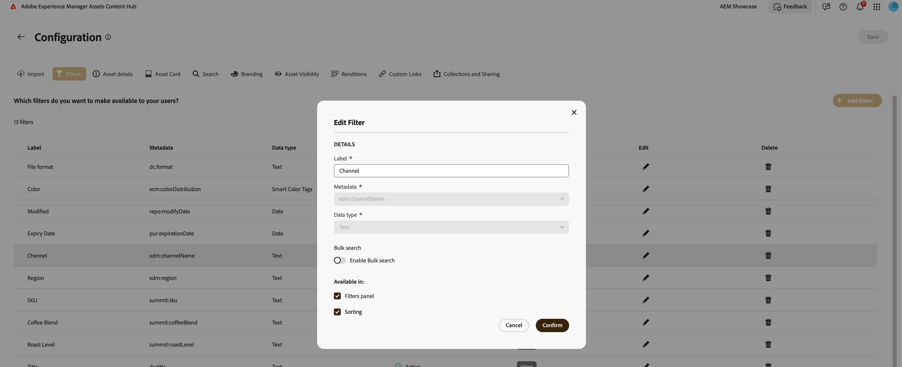

# Buscar Assets en [!DNL Content Hub] {#search-assets}

Cuando tiene un gran número de recursos en el repositorio, la búsqueda del recurso adecuado requiere tiempo. La búsqueda de [!DNL The Content Hub] le permite buscar los recursos aprobados para que pueda realizar acciones adicionales en ellos, como descargar, compartir o crear colecciones. Puede utilizar varias funciones para reducir los resultados de búsqueda, como realizar búsquedas basadas en texto, utilizar filtros, realizar búsquedas específicas de etiquetas inteligentes o etiquetas inteligentes, buscar un formato de archivo determinado, etc.

## Requisitos previos {#prerequisites}

[Usuarios de Content Hub](deploy-content-hub.md#onboard-content-hub-users) pueden realizar las acciones mencionadas en este artículo.

## Qué puede buscar  {#what-you-can-search}

La búsqueda [!DNL Content Hub] proporciona resultados basados en:

* **Texto coincidente:** La búsqueda de [!DNL Content Hub] le permite buscar un recurso con su nombre o descripción. Puede realizar una búsqueda basada en palabras clave que compare la palabra clave con el texto disponible en las propiedades de un recurso.

* **Contexto coincidente:** La lista de resultados de búsqueda de [!DNL Content Hub] contiene los resultados inmediatos de los recursos que obtiene basándose en el contexto coincidente. Por ejemplo, si escribe `cool` en la barra de búsqueda, los recursos relacionados con `winter`, `snow`, `cold surroundings` se muestran en la lista de búsqueda.

* **Información del recurso (título, etiquetas o etiquetas inteligentes):** [!DNL Content Hub] utiliza el algoritmo de búsqueda inteligente para clasificar los resultados de búsqueda con precisión y de la manera más relevante posible. [Metadatos](#asset-properties.md) es la colección de todos los datos disponibles para un recurso, pero es posible que no estén necesariamente contenidos en ese recurso. [Le ayuda a categorizar los recursos y resulta útil a medida que aumenta la cantidad de información digital](/help/assets/configure-content-hub-ui-options.md##configure-metadata-search-content-hub).

* **Fecha de última modificación:** Los recursos que se modificaron recientemente aparecen en la parte superior de la lista de resultados de búsqueda. También puede filtrar el intervalo de fechas según sus necesidades.

* **Uso:** Los recursos que se usan con más frecuencia aparecen en la parte superior de la lista de búsqueda.

* **Historial de búsqueda:** Haga clic dentro del cuadro de búsqueda sin escribir ningún carácter para obtener el historial de búsqueda. También puede quitar cualquier palabra clave en particular del historial. El historial de búsqueda se guarda en la memoria caché de un explorador web, lo que significa que, si accede a la búsqueda [!DNL Content Hub] en un explorador diferente o borra la memoria caché del explorador, ya no podrá ver el historial de búsqueda.

* **Buscar mientras escribe:** La búsqueda de [!DNL Content Hub] mejora su experiencia de búsqueda al proporcionar sugerencias de autocompletar al comenzar a escribir.

## Búsqueda básica {#basic-search}

Para realizar una búsqueda básica de [!DNL the Content Hub], vaya a la barra de búsqueda y especifique la palabra clave que necesita buscar. Vaya a los filtros disponibles en el panel izquierdo y aplíquelos para reducir los resultados de búsqueda.

Por ejemplo, busque todas las imágenes de **[!UICONTROL JPEG]** con la palabra clave `architect` en ella, que se modificó en el último año. Para ejecutar este escenario, ejecute los siguientes pasos:

1. Especifique `architect` como palabra clave de búsqueda.

1. Vaya al panel Filtros > **[!UICONTROL Formato]** > seleccione **[!UICONTROL JPEG]**.

1. Vaya a **[!UICONTROL Modificado]** > especifique el intervalo de fechas.

   

## Reduzca los resultados de búsqueda mediante filtros {#narrow-down-search-results}

Utilice el panel Filtros para buscar recursos basados en metadatos. Puede filtrar los resultados de búsqueda según varios predicados de búsqueda. Puede seleccionar todos los predicados adecuados para minimizar o reducir los resultados de búsqueda. Puede elegir más de 10 predicados al filtrar los resultados de búsqueda. Cuando se seleccionan varias opciones dentro de un filtro, Content Hub muestra los recursos que coinciden con cualquiera de las opciones seleccionadas dentro de un filtro. Sin embargo, cuando selecciona varias opciones en distintos filtros, Content Hub solo muestra los recursos que coinciden con todas las opciones seleccionadas en todos los filtros para reducir los resultados de búsqueda.

Los filtros predeterminados incluyen formato de archivo, aprobado por, fecha de aprobación, recursos caducados y no caducados y fecha de caducidad. Los administradores también pueden configurar los filtros que se muestran en la lista de filtros. Para obtener más información, consulte [Configuración de la interfaz de usuario de Content Hub](configure-content-hub-ui-options.md#configure-filters-content-hub).

## Búsqueda por IA en Content Hub {#ai-search-aem-assets-content-hub}

Búsqueda por IA en AEM Assets Content Hub es una función de búsqueda avanzada que comprende el significado y la intención detrás de la consulta de un usuario, en lugar de depender de coincidencias de palabras clave exactas. Utiliza inteligencia artificial (IA) y aprendizaje automático para ofrecer resultados más precisos y relevantes para el contexto.

A diferencia de la búsqueda tradicional basada en palabras clave, que busca términos exactos, la Búsqueda por IA interpreta las relaciones entre palabras, conceptos e intención del usuario. Esto garantiza que los usuarios encuentren lo que están buscando, incluso si su consulta está redactada de forma diferente, contiene errores tipográficos o está en otro idioma.

Algunos de sus beneficios clave incluyen:

* **Soporte multilingüe**: busque en varios idiomas sin requerir traducciones exactas. Los usuarios pueden encontrar contenido relevante independientemente del idioma de la consulta.

* **Controla los errores ortográficos**: interpreta errores ortográficos y ortográficos, lo que garantiza resultados precisos incluso con entradas imperfectas.

* **Entiende los sinónimos**: Proporciona resultados para términos y frases relacionados, por lo que los usuarios no necesitan adivinar la palabra clave correcta.

* **Búsqueda relevante para el contexto**: Reconoce la intención detrás de una consulta, no solo las palabras exactas.

### Ejemplos de Búsqueda por IA en Content Hub {#examples-ai-search-aem-assets-content-hub}

**Mensaje de ejemplo**: *Mujer tomando café*

La búsqueda tradicional basada en palabras clave busca coincidencias exactas de los metadatos de recursos, como `Woman`, `drinking`, `Coffee`, y devuelve recursos que incluyen todos estos términos en los metadatos.

Sin embargo, la Búsqueda por IA coincide con palabras similares como `Girl`, `Lady` en el caso de `Woman` y `Cappuccino` y `Latte` en el caso de `Coffee`.

Del mismo modo, puede especificar este mensaje en español o escribir incorrectamente `Woman` como `Wman` y seguir obteniendo los mismos resultados.

### Habilitar o deshabilitar la Búsqueda por IA en Content Hub {#enable-disable-ai-search-content-hub}

Siga estos pasos para habilitar o deshabilitar la Búsqueda por IA en Content Hub:

1. Vaya al icono de su perfil de usuario y haga clic en **[!UICONTROL Configuraciones]**.

1. En la ficha **[!UICONTROL Buscar]**, seleccione **[!UICONTROL Búsqueda por IA]** para habilitar la Búsqueda por IA para Content Hub o **[!UICONTROL Palabra clave]** para deshabilitarla.

   

1. Haga clic en **[!UICONTROL Guardar]**.

<!--

<table>
    <tbody>
     <tr>
      <th><strong>Search Predicate</strong></th>
      <th><strong>Description</strong></th>
      <th><strong>Properties</strong></th>
     </tr>
     <tr>
      <td> Campaigns </td>
      <td> Allows you to search using planned activity performed to take any particular action. For example, advertisement campaign run on Ferrari to know the understand the interests of people using number of clicks people perform.</td>
      <td>NA</td>
     </tr>
     <tr>
      <td> Channels </td>
      <td> Helps you to understand the path from where the asset is coming from. For example, web, social media, books, catalog, etc.</td>
      <td>NA</td>
     </tr>
     <tr>
      <td> Region </td>
      <td> Helps you to understand the location where the asset is created. For example, Japan, EMEA, Worldwide, etc.</td>
      <td>NA</td>
     </tr>
     <tr>
      <td> Keywords </td>
      <td> Keyword helps you search using terms or the words that you enter based on the topic. For example, images, low-resolution, etc.</td>
      <td>NA</td>
     </tr>
     <tr>
      <td> Timeframe </td>
      <td> Helps you search assets using timeline. For example, search by year 2024, Q3 2023, etc.</td>
      <td>NA</td>
     </tr>
     <tr>
      <td>File format</td>
      <td>Composition of an asset. The supported assets include image, document, video, printable media, and so on.</td>
      <td>
        <ul>
            <li>[!UICONTROL JPEG]</li> 
            <li>[!UICONTROL Quicktime]</li> 
            <li>[!UICONTROL PNG]</li> 
            <li>[!UICONTROL WebP]</li> 
            <li>[!UICONTROL MP4]</li> 
            <li>[!UICONTROL Plain]</li> 
            <li>[!UICONTROL PDF]</li>
            <li>[!UICONTROL SVG + XML]</li>
        </ul>
      </td>
     </tr>
     <tr>
      <td>Tags</td>
      <td>Tags help you categorize assets that can be browsed and searched more efficiently based on hierarchical taxonomies.</td>
      <td>
        <ul>
            <li>Field label</li>
            <li>Property name</li>
            <li>Path</li>
            <li>Description</li>
        </ul>
      </td>
     </tr>
     <tr>
      <td>Subject</td>
      <td>Classification of assets based on their theme. For example, colorful, hiking, outdoors.</td>
      <td>NA</td>
     </tr>
          <tr>
      <td>Last modified</td>
      <td>Search assets based on their last modification. Specify the date range using the Start date and End date fields.</td>
      <td>
        <ul>
            <li>Range text (From)</li> 
            <li>Range text (To) </li>
        </ul>
      </td>
     </tr>    
     <tr>
      <td>Asset ID</td>
      <td>Unique number that identifies the asset.</td>
      <td>NA</td>
     </tr>
     <tr>
      <td> Colors </td>
      <td> Helps you search assets using colors that are automatically identified in an asset using Adobe's AI capabilities.</td>
      <td>NA</td>
     </tr>  
    </tbody>
   </table>

-->

## Búsqueda masiva {#bulk-search}

La búsqueda masiva de recursos permite buscar varios recursos simultáneamente al introducir una lista de identificadores (como nombres, formatos de archivo, colores, etiquetas, etc.). En lugar de buscar recursos uno por uno, la búsqueda masiva de [!DNL Content Hub] acelera la detección de los recursos que necesita. Con esta capacidad, puede introducir varios valores para cualquier propiedad de filtro (separados por un delimitador (por ejemplo, varios ID de SKU)) y recuperar instantáneamente todos los recursos coincidentes con una sola búsqueda.

Para buscar varios recursos a la vez, escriba varios valores en una sola consulta separándolos con delimitadores ` [ , | \t | \r | \n | \r\n ]`. También puede añadir más delimitadores según el caso de uso. Consulte [Configurar la búsqueda en lotes](configure-content-hub-ui-options.md#bulk-search-configuration).

Para realizar una búsqueda masiva en [!DNL Content Hub], ejecute los pasos siguientes:

1. Una vez que la búsqueda masiva esté [configurada](configure-content-hub-ui-options.md#bulk-search-configuration), podrá ver la opción Búsqueda masiva en las propiedades de filtro [!DNL Content Hub] que configuró. Puede habilitarlo o deshabilitarlo según los requisitos.

1. Agregue una consulta de búsqueda que contenga delimitadores especificados en la configuración. La consulta de búsqueda debe contener una cadena acompañada de varios valores separados por comas.

## Configuración de la ordenación en Content Hub {#configure-sorting-aem-assets-content-hub}

Content Hub proporciona opciones de clasificación listas para usar para ayudar a los usuarios a organizar los resultados de búsqueda de recursos. Los administradores también pueden habilitar campos de metadatos personalizados como opciones de ordenación para que los usuarios puedan ordenar los recursos en función de metadatos específicos de la empresa, como canal, región, SKU o campaña.

### Opciones de ordenación predeterminadas {#default-sorting-options}

De forma predeterminada, Content Hub incluye las siguientes opciones de ordenación en la página principal de Content Hub:

* Tamaño

* Modificado

* Nombre

* Relevancia

### Agregar campos de metadatos personalizados como opciones de ordenación {#add-custom-metadata-fields-for-sorting}

Los administradores pueden configurar campos de metadatos adicionales para que aparezcan en el menú de ordenación.

Para habilitar un campo de metadatos para la ordenación:

1. Haga clic en el icono de perfil de usuario y seleccione **Configuraciones**.
1. Vaya a la ficha **Filtros**.
1. Busque el campo de metadatos que desea habilitar para la ordenación.
1. Haga clic en el icono de edición disponible para ese campo de metadatos en particular.
1. En el cuadro de diálogo Editar filtro, habilite la opción **Ordenar**.
1. Haga clic en **Confirmar** y guarde la configuración. Las actualizaciones surten efecto cuando el valor del campo **Status** para el campo de metadatos se muestra como `Active`.

Por ejemplo, si habilita la ordenación para el campo Metadatos de canal, los usuarios podrán ordenar los resultados de los recursos mediante el valor Canal.

### Usar opciones de ordenación personalizadas en la página principal de Content Hub {#use-custom-sorting-options}

Después de habilitar la ordenación para un campo de metadatos:

* El campo aparece en el menú de ordenación de la página principal de Content Hub.
* Los campos de ordenación personalizados se muestran debajo de una línea de separación en el menú de ordenación.
* El separador diferencia visualmente los campos personalizados configurados por el administrador de las opciones de ordenación predeterminadas.

Por ejemplo, si el campo Metadatos de canal está habilitado para la ordenación, se muestra el menú Ordenar:

* Campos predeterminados como Tamaño, Modificado, Nombre y Relevancia
* Una línea de separación
* El canal de campo personalizado

Esta distinción ayuda a los usuarios a identificar rápidamente las opciones de ordenación estándar en comparación con las opciones de ordenación basadas en metadatos específicas de la organización.

## Haga más con la búsqueda {#do-more-with-search}

[!DNL The Content Hub] no se limita a la búsqueda, sino que le permite realizar acciones adicionales, como [descargar](download-assets-content-hub.md), [compartir](share-assets-content-hub.md) y [agregar recursos a la colección](collections-content-hub.md), directamente desde la interfaz de búsqueda o vista previa. Seleccione los recursos en la página de resultados de búsqueda para ver estas opciones.

Más información sobre [configurar recursos en [!DNL Content Hub]](configure-content-hub-ui-options.md).

## Preguntas frecuentes {#faqs-deploy-content-hub}

### ¿Cómo puedo reducir los resultados de búsqueda en AEM Assets Content Hub?

Puede reducir los resultados de búsqueda en AEM Assets Content Hub mediante la búsqueda basada en texto, la aplicación de varios filtros (como formato de archivo, estado de aprobación, fecha de modificación, etc.), la búsqueda por etiquetas o etiquetas inteligentes y el uso del panel . La combinación de varios predicados u opciones de filtro le ayuda a segmentar con precisión los recursos que necesita.

### ¿Puedo realizar una búsqueda masiva en AEM Assets Content Hub de varios recursos a la vez?

Sí, puede realizar una búsqueda masiva en AEM Assets Content Hub introduciendo varios valores (como nombres, formatos de archivo y etiquetas) separados por delimitadores especificados. La función Búsqueda masiva le permite encontrar rápidamente varios recursos en una sola consulta, lo que lo hace más eficiente que buscar recursos uno por uno.

### ¿Pueden los administradores personalizar los filtros disponibles en la búsqueda de AEM Assets Content Hub?

Sí, los administradores pueden utilizar la interfaz de usuario de configuración de Content Hub de AEM Assets para configurar qué filtros están disponibles en la interfaz de búsqueda. Aunque los filtros predeterminados incluyen el formato de archivo, el estado de aprobación, la fecha de caducidad y mucho más, los administradores pueden adaptar estas opciones para adaptarlas a las necesidades de la organización.

**Consulte también**

* [Traducir recursos](/help/assets/translate-assets.md)
* [API HTTP de recursos](/help/assets/mac-api-assets.md)
* [Formatos de archivo compatibles con recursos](/help/assets/file-format-support.md)
* [Buscar recursos](/help/assets/search-assets.md)
* [Recursos de red](/help/assets/use-assets-across-connected-assets-instances.md)
* [Informes de recurso](/help/assets/asset-reports.md)
* [Esquemas de metadatos](/help/assets/metadata-schemas.md)
* [Descarga de recursos](/help/assets/download-assets-from-aem.md)
* [Administración de metadatos](/help/assets/manage-metadata.md)
* [Administración de plantillas de Dynamic Media](/help/assets/dynamic-media/manage-dynamic-media-templates.md)
* [Administrar informes](/help/assets/manage-reports-assets-view.md)
* [Facetas de búsqueda](/help/assets/search-facets.md)
* [Administrar colecciones](/help/assets/manage-collections.md)
* [Importación masiva de metadatos](/help/assets/metadata-import-export.md)
* [Publicación de recursos en AEM y Dynamic Media](/help/assets/publish-assets-to-aem-and-dm.md)

