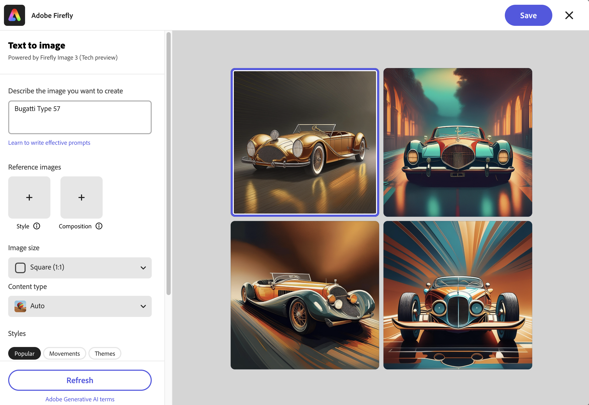

# Búsqueda de recursos en [!DNL Assets view] {#search-assets}

>[!CONTEXTUALHELP]
>id="assets_search"
>title="Buscar archivos"
>abstract="Busque los archivos especificando una palabra clave en la barra de búsqueda o filtrando los archivos en función de su estado, tipo de archivo, tipo MIME, tamaño, creación, modificación y fechas de caducidad. También puede aplicar filtros personalizados, además de los filtros estándar. Los resultados filtrados se pueden guardar como una búsqueda guardada o una colección inteligente."
>additional-url="https://experienceleague.adobe.com/docs/experience-manager-assets-essentials/help/manage-collections.html?lang=es#manage-smart-collection" text="Crear colecciones inteligentes"

[!DNL Assets view] proporciona una búsqueda efectiva que funciona de forma predeterminada. La búsqueda es exhaustiva, ya que es de texto completo. La potente funcionalidad de búsqueda le permite descubrir rápidamente el recurso adecuado y ayudarle a mejorar la velocidad del contenido. [!DNL Assets view] proporciona búsquedas de texto completo e incluso búsquedas mediante metadatos como etiquetas inteligentes, título, fecha de creación y copyright.

Para buscar recursos:

* Haga clic en el cuadro de búsqueda que hay en la parte superior de la página. De forma predeterminada, busca dentro de la carpeta que está explorando actualmente. Realice una de las acciones siguientes:

  

   * Busque con una palabra clave y opcionalmente cambie la carpeta. Pulse Intro.

   * Empiece a trabajar con un recurso visualizado hace poco directamente buscándolo. Haga clic en el cuadro de búsqueda y seleccione un recurso visualizado recientemente en las sugerencias.

## Filtrado de los resultados de búsqueda {#refine-search-results}

Puede restringir los resultados de búsqueda para encontrar recursos relevantes aplicando varios filtros. Estos filtros, configurados por un administrador, se basan en archivos, carpetas y colecciones. Consulte [Personalizar filtros de búsqueda](custom-search-filters.md).

Puede filtrar los resultados de búsqueda según los parámetros siguientes.

* Estado de los activos: filtre los resultados de búsqueda mediante un estado del activo `Approved`, `Rejected` o `No Status`.
* Tipo de archivo: filtre los resultados de búsqueda según los tipos de archivos admitidos, es decir, `Images`, `Documents` y `Videos`.
* Tipo de MIME: filtre uno o varios formatos de archivo compatibles. <!-- TBD:  [supported file formats](/help/using/supported-file-formats.md). -->
* Tamaño de imagen: proporcione una o más de las dimensiones mínimas y máximas para filtrar imágenes. El tamaño se proporciona en dimensiones en píxeles y no es el tamaño de archivo de las imágenes.
* Fecha de creación: la fecha de creación del recurso tal como se indica en los metadatos. El formato de fecha estándar utilizado es `yyyy-mm-dd`.
* Fecha de modificación: fecha de la última modificación de los recursos. El formato de fecha estándar utilizado es `yyyy-mm-dd`.
* Fecha de caducidad: filtre los resultados de búsqueda en función de un `Expired` estado del activo. Además, puede especificar un intervalo de fechas de caducidad para los recursos para filtrar aún más los resultados de búsqueda.
* Filtros personalizados: [Agregue filtros personalizados](#custom-filters) a la interfaz de usuario de la vista de Assets. Aplique esos filtros personalizados además de los filtros estándar para restringir los resultados de búsqueda.

Puede ordenar los recursos buscados en orden creciente o descendente de `Name`, `Relevance`, `Size`, `Modified` y `Created`. Los recursos buscados se ordenan según `Relevance`, de forma predeterminada.

## Administrar filtros personalizados {#custom-filters}

**Permisos necesarios:** `Can Edit`, `Owner` o Administrador.

La vista Assets también permite agregar filtros personalizados a la interfaz de usuario. A continuación, puede aplicar esos filtros personalizados además de los [filtros estándar](#refine-search-results) para restringir los resultados de búsqueda.

La vista Assets proporciona los siguientes filtros personalizados:

<table>
    <tbody>
     <tr>
      <th><strong>Nombre de filtro personalizado</strong></th>
      <th><strong>Descripción</strong></th>
     </tr>
     <tr>
      <td>Título</td>
      <td>Filtre los recursos mediante el título del recurso. El título que especifique en los criterios de búsqueda que distinguen entre mayúsculas y minúsculas debe coincidir con el título exacto del recurso para mostrarlo en los resultados.</td>
     </tr>
     <tr>
      <td>Nombre</td>
      <td>Filtre los recursos con el nombre del archivo del recurso. El nombre que especifique en los criterios de búsqueda que distinguen entre mayúsculas y minúsculas debe coincidir con el nombre de archivo exacto del recurso para mostrarlo en los resultados.</td>
     </tr>
     <tr>
      <td>Tamaño del recurso</td>
      <td>Filtre los recursos definiendo un intervalo de tamaño, en bytes, en los criterios de búsqueda para que un recurso se muestre en los resultados.</td>
     </tr>
     <tr>
      <td>Etiquetas previstas</td>
      <td>Filtre recursos con la etiqueta inteligente de recursos. El nombre de la etiqueta inteligente que especifique en los criterios de búsqueda que distinguen entre mayúsculas y minúsculas debe coincidir con el nombre exacto de la etiqueta inteligente del recurso que se mostrará en los resultados. No se pueden especificar varias etiquetas inteligentes en los criterios de búsqueda.</td>
     </tr>    
    </tbody>
   </table>

<!--
   You can use a wildcard operator (*) to enable Assets view to display assets in the results that partially match the search criteria. For example, if you define <b>ma*</b> as the search criteria, Assets view displays assets with title, such as, market, marketing, man, manchester, and so on in the results.

   You can use a wildcard operator (*) to enable Assets view to display assets in the results that partially match the search criteria.

   You can use a wildcard operator (*) to enable Assets view to display assets in the results that partially match the search criteria. You can specify multiple smart tags separated by a comma in the search criteria.

   -->

### Añadir filtros personalizados {#add-custom-filters}

Para añadir filtros personalizados:

1. Haga clic en **[!UICONTROL Filtros]**.

1. En la sección **[!UICONTROL Filtros personalizados]**, haga clic en **[!UICONTROL Editar]** o **[!UICONTROL Añadir filtros]**.

   

1. En el cuadro de diálogo **[!UICONTROL Administración de filtros personalizados]**, seleccione los filtros que debe agregar a la lista de filtros existente. Seleccione **[!UICONTROL Filtros personalizados]** para seleccionar todos los filtros.

1. Haga clic en **[!UICONTROL Confirmar]** para agregar los filtros a la interfaz de usuario.

### Eliminar filtros personalizados {#remove-custom-filters}

Para eliminar filtros personalizados:

1. Haga clic en **[!UICONTROL Filtros]**.

1. En la sección **[!UICONTROL Filtros personalizados]**, haga clic en **[!UICONTROL Editar]**.

1. En el cuadro de diálogo **[!UICONTROL Administración de filtros personalizados]**, anule la selección de los filtros que debe eliminar de la lista de filtros existente.

1. Haga clic en **[!UICONTROL Confirmar]** para eliminar los filtros de la interfaz de usuario.

## Búsqueda semántica {#semantic-search}

La búsqueda semántica es una capacidad de búsqueda avanzada que comprende el significado y la intención detrás de la consulta de un usuario en lugar de depender de coincidencias de palabras clave exactas. Utiliza inteligencia artificial (IA), procesamiento de lenguajes naturales (NLP) y aprendizaje automático para ofrecer resultados más precisos y sensibles al contexto.

A diferencia de la búsqueda tradicional basada en palabras clave, que busca términos exactos, la búsqueda semántica interpreta las relaciones entre palabras, conceptos e intención del usuario. Esto garantiza que los usuarios encuentren lo que están buscando, incluso si su consulta está redactada de forma diferente, contiene errores tipográficos o está en otro idioma.

Algunos de sus beneficios clave incluyen:

* **Soporte multilingüe**: busque en varios idiomas sin requerir traducciones exactas. Los usuarios pueden encontrar contenido relevante independientemente del idioma de la consulta.

* **Controla los errores ortográficos**: corrige o interpreta automáticamente los errores ortográficos y ortográficos, lo que garantiza resultados precisos incluso con entradas imperfectas.

* **Entiende los sinónimos**: Proporciona resultados para términos y frases relacionados, por lo que los usuarios no necesitan adivinar la palabra clave correcta.

* **Búsqueda según el contexto**: Reconoce la intención detrás de una consulta, no solo las palabras.

>[!IMPORTANT]
>
> Especifique tres o más palabras para que la búsqueda semántica muestre los resultados adecuados.

### Ejemplos de búsqueda semántica {#examples-semantic-search}

**Mensaje de ejemplo**: *Mujer tomando café*

La búsqueda tradicional basada en palabras clave busca coincidencias exactas de los metadatos de recursos, como Mujer, Café, etc., y devuelve recursos que incluyen estas palabras clave.

Sin embargo, la búsqueda semántica busca palabras similares como `Girl`, `Lady` en el caso de `Woman` y opciones de café, como `Cappuccino` y `Latte` en el caso de `Coffee`.

Del mismo modo, puede especificar este mensaje en español o escribir incorrectamente `Woman` como `Wman` y seguir obteniendo los mismos resultados.

## Búsqueda de recursos con [!DNL Adobe Firefly] {#search-firefly}

Puede buscar un recurso que no esté disponible en ninguna de las carpetas de recursos utilizando la [!DNL Adobe Firefly] funcionalidad de búsqueda de recursos dentro de [!DNL Experience Manager Assets]. Esto permite generar eficazmente recursos en tiempo real que no están almacenados en las carpetas de recursos.

### Antes de empezar {#search-assets-firefly-prereqs}

Debe tener una suscripción [!DNL Adobe Express] activa.

### Generación de recursos {#generate-assets-firefly}

Para generar nuevos recursos mediante [!DNL Adobe Firefly]:

1. Navegue hasta el espacio de trabajo [!DNL AEM Assets].

1. Escriba el nombre del recurso en la barra de búsqueda. Por ejemplo, puede buscar un recurso mediante la palabra clave `Bugatti Type 57`. Al buscar el recurso, no se encuentran resultados porque el recurso no está presente en ninguna de las carpetas de recursos. Para generar recursos mediante IA, haga clic en **[!UICONTROL Generar con Firefly]**. Aparece el cuadro de diálogo [!DNL Adobe Firefly].

   

   Los nuevos recursos se han generado correctamente. Además, puede cambiar la descripción de la imagen escribiendo la nueva indicación de texto en el cuadro de descripción. [Aprenda a escribir un buen aviso de IA para generar contenido extraordinario y relevante](https://helpx.adobe.com/in/firefly/using/tips-and-tricks.html?lang=es). También puede [editar la imagen con otras características como cambiar el estilo, las dimensiones de la imagen y más](https://helpx.adobe.com/in/firefly/using/text-to-image.html?lang=es).

   

1. Seleccione una imagen que desea guardar. Haga clic en **[!UICONTROL Guardar]** para guardar los recursos en su carpeta preferida y facilitar el acceso.

1. Aparece el formulario Guardar recurso. Especifique los campos siguientes:

   * Introduzca un nombre para el archivo en el campo **Guardar como**.
   * Seleccione una carpeta de destino.
   * Introduzca detalles como el nombre del proyecto o de la campaña, palabras clave, canales, lapso de tiempo y región.

   

1. Haga clic en **Guardar como nuevo recurso** para guardar los recursos.

### Carga de activos {#upload-assets-firefly}

Para cargar el recurso generado en el repositorio de recursos:

1. Haga clic en **[!UICONTROL Cargar]**. 
1. Seleccione la carpeta de recursos en la que debe cargar el recurso y haga clic en **[!UICONTROL Seleccionar carpeta]**.
   

## Búsquedas guardadas {#saved-search}

La funcionalidad de búsqueda es bastante fácil de usar en [!DNL Assets view]. Desde el cuadro de búsqueda, no solo puede escribir una palabra clave y pulsar la tecla Enter para ver los resultados, sino que también puede buscar rápidamente de nuevo las palabras clave buscadas recientemente con un solo clic.

También puede filtrar los resultados de búsqueda según criterios específicos en torno a los metadatos y el tipo de recursos. Para los filtros utilizados con frecuencia, a fin de mejorar la experiencia de búsqueda, [!DNL Assets view] permite guardar los parámetros de búsqueda. A continuación, puede seleccionar la búsqueda guardada para buscar y aplicar el filtro con un solo clic.

Para crear una búsqueda guardada, busque algún recurso, aplique uno o varios filtros y haga clic en **[!UICONTROL Guardar como]** > **[!UICONTROL Búsqueda guardada]** en el panel de [!UICONTROL Filtros]. También puede hacer clic en **[!UICONTROL Guardar como]** y seleccionar **[!UICONTROL Colección inteligente]** para guardar los resultados como una Colección inteligente. Consulte [Crear una Colección inteligente](manage-collections.md#create-a-smart-collection) para obtener más información.

<!-- TBD: Search behavior. Full-text search. Ranking and rank boosts. Hidden assets.
Report poor UX that users can only save a filtered search and not a simple search.
.
Are other supported files fully indexed and support full-text search? Eg. audio/videos files can at best have metadata indexed.
Anything about ranking of assets displayed in search results?

What about temporarily hiding an asset (suspending search on it) from the search results? If an asset is undergoing review collaboration, should it be used by others? Should it be hidden in search?

When userA is searching and userB add an asset that matches search results, will the asset display in search as soon as userA refreshes the page? Assuming indexing is near real-time. May not be so for bulk uploads.
-->

## Trabajar con los resultados de búsqueda {#work-with-search-results}

Puede seleccionar los recursos que se muestran en los resultados de búsqueda y realizar las acciones siguientes:

* **Buscar imagen similar**: busque un recurso de imagen similar en la interfaz de usuario de Assets en función de los metadatos y de las etiquetas inteligentes.

* **Detalles**: ver y editar las propiedades del recurso.

* **Descargar**: descargar un recurso.

* **Añadir a la colección**: añadir el recurso seleccionado a una colección.

* **Fijar en Acceso rápido**: [fijar un recurso](my-workspace-assets-view.md) para un acceso más rápido cuando lo necesite más tarde. Todos los elementos fijados se muestran en la sección **Acceso rápido** de Mi espacio de trabajo.

* **Abrir en Adobe Express**: edite una imagen en Adobe Express integrado desde la pantalla de Adobe Experience Manager Assets.

* **Editar**: edite la imagen con Adobe Express.

* **Compartir vínculo**: [compartir vínculos](share-links-for-assets-view.md) para un recurso con otros usuarios para que puedan acceder a él y descargarlo.

* **Eliminar**: eliminar un recurso.

* **Copiar**: copiar un recurso en una ubicación de carpeta diferente.

* **Mover**: mover un recurso a una ubicación de carpeta diferente.

* **Cambiar nombre**: cambiar el nombre de un recurso.

* **Copiar en las bibliotecas**: añada un recurso a la biblioteca.

* **Asignar tareas**: asignar tareas a los usuarios de un recurso.

* **Ver**: [monitorizar las operaciones](https://experienceleague.adobe.com/es/docs/experience-manager-cloud-service/content/assets/manage/search-assets) realizadas en un recurso.

## Configurar la página principal Buscar primero {#configuring-search-first-homepage}

La vista Assets permite seleccionar la página de aterrizaje predeterminada para su organización. Al utilizar Buscar primero como página principal, también tiene opciones para adaptar la personalización de marca de la página configurando las imágenes de fondo y del logotipo para que coincidan con su marca.

Para configurar la página principal Buscar primero, ejecute los siguientes pasos:

1. Vaya a **[!UICONTROL Configuración]** > **[!UICONTROL Configuración general]**.
1. Seleccione **[!UICONTROL Buscar primero]**. Además, abra la configuración relacionada con Buscar primero. Puede establecer [alineación](#setting-alignment-search-bar) o [establecer la imagen de fondo y logotipo](#setting-background-image-and-logo) de su página principal.

### Alineación de la barra de búsqueda {#setting-alignment-search-bar}

[!DNL Assets view] le permite cambiar la alineación de la barra de búsqueda. Puede hacer que la barra de búsqueda aparezca en el centro o en la parte superior. Seleccione la alineación adecuada y haga clic en **[!UICONTROL Guardar]**.

### Imagen de fondo y logotipo de la página principal {#setting-background-image-and-logo}

Puede añadir el logotipo de la marca y la imagen de fondo a la página principal Buscar primero. Ejecute los siguientes pasos:

1. Vaya a la sección **[!UICONTROL Imagen de fondo y logotipo]** debajo de **[!UICONTROL Página principal]**.
1. Haga clic en **[!UICONTROL Reemplazar]** para examinar imágenes de un repositorio de recursos existente.
1. Haga clic en **[!UICONTROL Guardar]**. [Previsualice](#preview-configured-homepage) los cambios para revisar las modificaciones.

### Vista previa de la página principal configurada {#preview-configured-homepage}

Puede obtener una vista previa para comprobar el diseño y el formato de la página principal Buscar primero. Mediante **[!UICONTROL Vista previa]** puede corregir el diseño o realizar modificaciones según sea necesario. Para obtener una vista previa de la página principal configurada, ejecute los pasos siguientes:

1. Haga clic en **[!UICONTROL Configuración general]** y seleccione **[!UICONTROL Buscar primero]**.
1. Vaya a **[!UICONTROL Personalizar la página principal Buscar primero]** y haga clic en **[!UICONTROL Vista previa]**. Cambie mediante el botón **[!UICONTROL Tema oscuro]** para obtener una vista previa de la página principal en un tema oscuro o claro.
1. Haga clic en **[!UICONTROL Cerrar]** para cerrar el cuadro de diálogo.

   

## Búsqueda contextual {#contextual-search}

También puede buscar recursos disponibles en el repositorio definiendo indicaciones de texto. Experience Manager Assets transforma automáticamente esas indicaciones de texto en filtros de búsqueda y muestra los resultados de la búsqueda. Puede ver y modificar los filtros automáticos mediante el panel Filtros para reducir aún más los resultados de la búsqueda.

### Acceso a la búsqueda contextual {#access-contextual-search}

Para acceder a la búsqueda contextual en Experience Manager Assets:

1. Haga clic en **[!UICONTROL Búsqueda]** en el panel de la izquierda.

   

1. Defina la indicación de texto en el cuadro de texto de búsqueda y haga clic en **[!UICONTROL Búsqueda contextual]**.

   

   [!DNL Experience Manager Assets] muestra los resultados de la búsqueda.

### Filtros admitidos {#supported-filters}

La búsqueda contextual admite los siguientes filtros predeterminados. Base sus indicaciones de texto en estos filtros para ver los resultados de búsqueda adecuados.

* Altura de la imagen

* Anchura de la imagen

* Tipo de archivo: imagen, documento, vídeo o carpeta.

* Tipo de MIME: JPG, PNG, TIFF, GIF, MP4, PDF, PPTX, DOCX o XLSX

* Fecha de creación

* Fecha de modificación

* Fecha de caducidad

* Estado del recurso: aprobado, rechazado o todo

* Recursos caducados

### Ejemplos de indicaciones de texto {#text-prompts-examples}

**Ejemplo 1**

**Indicación de texto**: imágenes creadas este mes.

[!DNL Experience Manager Assets] aplica los siguientes filtros automáticamente y muestra los resultados de la búsqueda:

**Ejemplo 2**

**Indicación de texto**: Imágenes de al menos 200 píxeles de altura y 100 píxeles de anchura con playa y cielo despejado.

[!DNL Experience Manager Assets] aplica los siguientes filtros automáticamente y muestra los resultados de la búsqueda:

**Ejemplo 3**

**Indicación de texto**: necesito imágenes de cielo azul de 1500 y 2500 píxeles de altura y creadas en el último mes que no hayan caducado ni estén aprobadas.

[!DNL Experience Manager Assets] aplica los siguientes filtros automáticamente y muestra los resultados de la búsqueda:

El siguiente vídeo ilustra el proceso de extremo a extremo desde el acceso a la interfaz de usuario de búsqueda contextual hasta la definición de indicaciones de texto y la visualización de los resultados de la búsqueda.

>[!VIDEO](https://video.tv.adobe.com/v/3428407)

### Deshabilitación de la búsqueda contextual {#disable-contextual-search}

Los administradores también tienen la opción de deshabilitar la búsqueda contextual para los usuarios de su organización. Para ello, ejecute los siguientes pasos:

1. Vaya a **[!UICONTROL Configuración]** > **[!UICONTROL Configuración general]**.

1. En la sección [!UICONTROL Búsqueda contextual], desactive el conmutador **[!UICONTROL Habilitar la búsqueda contextual para su organización]** para deshabilitar la función de búsqueda contextual para todos los usuarios de su organización.

### Comentarios sobre la búsqueda contextual {#contextual-search-feedback}

Si necesita facilitar comentarios sobre la función de búsqueda contextual, haga clic en el   y haga clic en el icono Comentarios. Seleccione el tipo de comentarios, especifique el asunto y la descripción y haga clic en **[!UICONTROL Enviar]**.

## Próximos pasos {#next-steps}

* [Vea un vídeo para buscar recursos en la vista de Assets](https://experienceleague.adobe.com/docs/experience-manager-learn/assets-essentials/basics/using.html?lang=es)

* Realice comentarios del producto mediante la opción [!UICONTROL Comentarios] disponible en la interfaz de usuario de la vista Recursos

* Facilite comentarios sobre la documentación usando [!UICONTROL Editar esta página]  o [!UICONTROL Registrar un problema] , disponibles en la barra lateral derecha.

* Contacto con el [Servicio de atención al cliente](https://experienceleague.adobe.com/?support-solution=General&lang=es#support)

