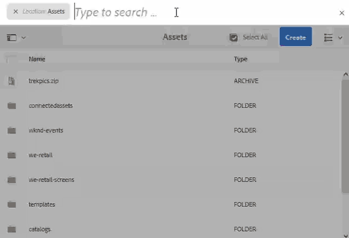

# Búsqueda de recursos en AEM {#search-assets-in-aem}

| Versión | Vínculo del artículo |
| -------- | ---------------------------- |
| AEM 6.5 | [Haga clic aquí](https://experienceleague.adobe.com/docs/experience-manager-65/assets/using/search-assets.html?lang=es) |
| AEM as a Cloud Service | Este artículo |

[!DNL Adobe Experience Manager Assets] proporciona métodos de búsqueda de recursos sólidos que le ayudan a lograr una mayor velocidad de contenido. Sus equipos pueden reducir el tiempo de salida al mercado con una experiencia de búsqueda de recursos inteligente y fluida mediante la funcionalidad y los métodos personalizados predeterminados. La capacidad de búsqueda de recursos es fundamental para el uso de un sistema de administración de recursos digitales, ya sea para su uso posterior por parte de los creativos, para una administración sólida de los recursos por parte de los usuarios y los especialistas en marketing, o para la administración por parte de los administradores de DAM. Las búsquedas simples, avanzadas y personalizadas que puede realizar a través de la interfaz de usuario de [!DNL Assets] u otras aplicaciones y superficies ayudan a completar estos casos de uso.

La búsqueda de recursos en AEM admite los siguientes casos de uso y este artículo describe el uso, los conceptos, las configuraciones, las limitaciones y la resolución de problemas para estos casos de uso.

| Buscar recursos | Configurar y administrar la funcionalidad de búsqueda | Trabajar con resultados de búsqueda de recursos |
|---|---|---|
| [Búsquedas básicas](#searchbasics) | [Índice de búsqueda](#searchindex) | [Ordenar resultados](#sort) |
| [Comprender la interfaz de usuario de búsqueda](#searchui) | [Extracción de texto](#extracttextupload) | [Comprobar propiedades y metadatos de un recurso](#checkinfo) |
| [Sugerencias de búsqueda](#searchsuggestions) | [Metadatos obligatorios](#mandatorymetadata) | [Descargar](#download) |
| [Comprenda los resultados de búsqueda y el comportamiento](#searchbehavior) | [Modificar facetas de búsqueda](#searchfacets) | [Actualizaciones masivas de metadatos](#metadata-updates) |
| [Buscar rango y aumentar](#searchrank) | [predicados personalizados](#custompredicates) | [Colecciones inteligentes](#collections) |
| [Búsqueda avanzada: filtrado y ámbito de la búsqueda](#scope) | | [Comprender y solucionar problemas con resultados inesperados](#unexpected-results) |
| [Buscar desde otras soluciones y aplicaciones](#search-assets-other-surfaces):<ul><li>[Adobe Asset Link](#aal)</li><li>[Brand Portal](#brand-portal)</li><li>[aplicación de escritorio de Experience Manager](#desktop-app)</li><li>[imágenes de Adobe Stock](#adobe-stock)</li><li>[Recursos de Dynamic Media](#search-dynamic-media-assets)</li></ul> | | |
| [Selector de recursos](#asset-picker) | | |
| [Limitaciones](#limitations) y [Sugerencias](#tips) | | |
| [Ejemplos ilustrados](#samples) | | |

Busque recursos usando el campo Omnisearch en la parte superior de la interfaz web de [!DNL Experience Manager]. Vaya a **[!UICONTROL Assets]** > **[!UICONTROL Archivos]** en [!DNL Experience Manager], haga clic en  en la barra superior, escriba la palabra clave de búsqueda y seleccione `Return`. También puede usar el método abreviado de teclado `/` (barra diagonal) para abrir el campo Omnisearch. `Location:Assets` está preseleccionado para limitar las búsquedas a recursos DAM. `Path:/content/dam` también se muestra cuando realiza una búsqueda en el nivel raíz de la carpeta **[!UICONTROL Archivos]**. Si se desplaza a cualquier otra carpeta, `Path:/content/dam/<folder name>` se muestra en el campo Omnisearch para limitar el ámbito de búsqueda a la carpeta actual. [!DNL Experience Manager] proporciona sugerencias cuando empieza a escribir una palabra clave de búsqueda.

Utilice el panel **[!UICONTROL Filtros]** para buscar recursos, carpetas, etiquetas y metadatos. Puede filtrar los resultados de búsqueda en función de las distintas opciones (predicados), como tipo de archivo, tamaño de archivo, fecha de última modificación, estado del recurso, datos de perspectivas y licencias de Adobe Stock. Puede personalizar el panel Filtros y agregar o quitar predicados de búsqueda mediante [facetas de búsqueda](/help/assets/search-facets.md). El filtro [!UICONTROL Tipo de archivo] del panel [!UICONTROL Filtros] tiene casillas de verificación de estado mixto. Por lo tanto, a menos que seleccione todos los predicados anidados (o formatos), las casillas de verificación de primer nivel están marcadas parcialmente.

La capacidad de búsqueda [!DNL Experience Manager] admite la búsqueda de colecciones y la búsqueda de recursos dentro de una colección. Ver [colecciones de búsqueda](/help/assets/manage-collections.md).

## Comprender la interfaz de búsqueda de recursos {#searchui}

Familiarícese con la interfaz de búsqueda de recursos y las acciones disponibles.
<!--

-->

*Figura: Comprender la interfaz de resultados de búsqueda de [!DNL Experience Manager Assets].*

**A.** Guardar búsqueda como una colección inteligente.
**B.** Filtros o predicados para reducir los resultados de búsqueda.
**C.** Muestra archivos, carpetas o ambos.
**D.** La ubicación de búsqueda es DAM.
**E.** Accede A Búsquedas Guardadas.
**F.** Haga clic en Filtros para abrir o cerrar el carril izquierdo.
**G.** Muestra Assets como búsqueda predeterminada.
**H.** La ubicación de búsqueda es DAM.
**I.** campo Omnisearch con palabra clave de búsqueda proporcionada por el usuario.
**J.** Seleccione los resultados de búsqueda cargados.
**K.** Ordenar por Creado, Modificado, Nombre, Ninguno.
**L.** Ordenar de forma ascendente o descendente.
**M.** Número de resultados de búsqueda mostrados del total de resultados de búsqueda. **N.** Cierre la búsqueda.
**O.** Cambiar entre la vista de tarjeta y la vista de lista.

### Facetas de búsqueda dinámica {#dynamicfacets}

Puede descubrir los recursos deseados más rápido desde la página de resultados de búsqueda mediante la cantidad dinámicamente actualizada de resultados de búsqueda esperados en las facetas de búsqueda. El número esperado de recursos se actualiza incluso antes de aplicar el filtro de búsqueda. Ver el recuento esperado en el filtro le ayuda a navegar por los resultados de búsqueda de forma rápida y eficaz.

*Imagen: vea el número aproximado de recursos sin filtrar los resultados de búsqueda en las facetas de búsqueda.*

Experience Manager Assets muestra los recuentos de facetas de dos propiedades de forma predeterminada:

* Tipo de recurso (jcr:content/metadata/dc:format)

* Estado de aprobación (jcr:content/metadata/dam:status)

En agosto de 2023, Experience Manager Assets incluye una nueva versión 9 del índice `damAssetLucene`. Las versiones anteriores, `damAssetLucene-8` e inferiores, usan el modo `statistical` para comprobar el control de acceso en una muestra de los elementos de cada recuento de facetas de búsqueda.

`damAssetLucene-9` cambia el comportamiento del recuento de facetas de Oak Query para no evaluar más el control de acceso en los recuentos de facetas devueltos por el índice de búsqueda subyacente, lo que resulta en tiempos de respuesta de búsqueda más rápidos. Como resultado, a los usuarios se les pueden presentar valores de recuento de facetas, que incluyen recursos a los que no tienen acceso. Estos usuarios no pueden acceder, descargar ni leer ningún otro detalle de esos recursos, incluidas sus rutas, ni obtener más información sobre ellos.

Si necesita cambiar al comportamiento anterior (modo `statistical`), vea [Búsqueda de contenido e indexación](https://experienceleague.adobe.com/docs/experience-manager-cloud-service/content/operations/indexing.html?lang=es) para crear una versión personalizada del índice `damAssetLucene-9`. Adobe no recomienda cambiar al modo `secure` debido al impacto en los tiempos de respuesta de búsqueda con grandes conjuntos de resultados.

Para obtener más información sobre las funcionalidades de faceta de Oak, incluida una descripción detallada de estos modos, consulte [Facetas: documentación de Oak: índice de Lucene](https://jackrabbit.apache.org/oak/docs/query/lucene.html#facets).

## Buscar sugerencias mientras escribe {#searchsuggestions}

Cuando empieza a escribir una palabra clave, Experience Manager sugiere las posibles palabras clave o frases de búsqueda. Las sugerencias se basan en los recursos de Experience Manager. Experience Manager indexa todos los campos de metadatos para ayudar con la búsqueda. Para proporcionar sugerencias de búsqueda, el sistema utiliza los valores de los siguientes campos de metadatos. Para proporcionar sugerencias de búsqueda, considere la posibilidad de rellenar los siguientes campos con las palabras clave adecuadas:

* Etiquetas de recursos. (se asigna a `jcr:content/metadata/cq:tags`)
* Título del recurso. (se asigna a `jcr:content/metadata/dc:title`)
* Descripción del recurso. (se asigna a `jcr:content/metadata/dc:description`)
* Título en el repositorio JCR. El valor puede asignarse al título del recurso. (se asigna a `jcr:content/jcr:title`)
* Descripción en el repositorio JCR. El valor puede asignarse a la descripción del recurso. (se asigna a `jcr:content/jcr:description`)

## Comprender los resultados de búsqueda y el comportamiento {#searchbehavior}

### Términos y resultados de búsqueda básicos {#searchbasics}

Puede ejecutar búsquedas de palabras clave desde el campo OmniSearch. La búsqueda de palabras clave no distingue entre mayúsculas y minúsculas y es una búsqueda de texto completo (en los campos de metadatos populares). Si se usa más de una palabra clave, `AND` es el operador predeterminado entre las palabras clave.

Los resultados se ordenan por relevancia, empezando por las coincidencias más cercanas. Para varias palabras clave, los resultados más relevantes son los recursos que contienen ambos términos en sus metadatos. Dentro de los metadatos, las palabras clave que aparecen como etiquetas inteligentes tienen una clasificación más alta que las palabras clave que aparecen en otros campos de metadatos. [!DNL Experience Manager] permite dar a un término de búsqueda en particular un peso mayor. Además, es posible [aumentar la clasificación](#searchrank) de algunos recursos de destino para términos de búsqueda específicos.

Para encontrar rápidamente los recursos relevantes, la interfaz enriquecida proporciona mecanismos de filtrado, ordenación y selección. Puede filtrar los resultados en función de varios criterios y ver la cantidad de recursos buscados para varios filtros. Como alternativa, puede volver a ejecutar la búsqueda cambiando la consulta en el campo Omnisearch. Al cambiar los términos o filtros de búsqueda, los demás filtros permanecen aplicados para conservar el contexto de la búsqueda.

Cuando los resultados son muchos recursos, [!DNL Experience Manager] muestra los primeros 100 en la vista de tarjeta y 200 en la vista de lista. A medida que los usuarios se desplazan, se cargan más recursos. Esto sirve para mejorar el rendimiento. Vea una demostración en vídeo de [número de recursos mostrados](https://www.youtube.com/watch?v=LcrGPDLDf4o).

A veces, es posible que vea algunos recursos inesperados en los resultados de búsqueda. Para obtener más información, consulte [resultados inesperados](#unexpected-results).

[!DNL Experience Manager] puede buscar muchos formatos de archivo y los filtros de búsqueda se pueden personalizar para adaptarlos a sus necesidades comerciales. Póngase en contacto con su administrador para comprender qué opciones de búsqueda están disponibles para su repositorio de DAM y qué restricciones tiene su cuenta.

<!-- 
### Results with and without enhanced Smart Tags {#withsmarttags}

By default, [!DNL Experience Manager] search combines the search terms with an AND clause. For example, consider searching for keywords woman running. Only the assets with both woman and running keywords in the metadata appear in the search results by default. The same behavior is retained when special characters (periods, underscores, or dashes) are used with the keywords. The following search queries return the same results:

* `woman running`
* `woman.running`
* `woman-running`

However, the query `woman -running` returns assets without `running` in their metadata.
Using Smart Tags adds an extra `OR` clause to find any of the search terms as the applied smart tags. An asset tagged with either `woman` or `running` using Smart Tags also appear in such a search query. So the search results are a combination of,

* Assets with `woman` and `running` keywords in the metadata (default behavior).

* Assets smart tagged with either of the keywords (Smart Tags behavior).
-->

### Buscar clasificación y aumento {#searchrank}

Los resultados de búsqueda que coinciden con todos los términos de búsqueda en los campos de metadatos se muestran primero, seguidos de los resultados de búsqueda que coinciden con cualquiera de los términos de búsqueda en las etiquetas inteligentes. En el ejemplo anterior, el orden aproximado de visualización de los resultados de búsqueda es:

1. Coincide con `woman running` en los distintos campos de metadatos.
1. Coincidencias de `woman running` en etiquetas inteligentes.
1. Coincidencias de `woman` o de `running` en etiquetas inteligentes.

Puede mejorar la relevancia de las palabras clave para recursos concretos para ayudar a impulsar las búsquedas en función de las palabras clave. En otras palabras, las imágenes para las que promociona palabras clave específicas aparecen en la parte superior de los resultados de búsqueda cuando busca en función de estas palabras clave.

1. En la interfaz de usuario [!DNL Assets], abra la página de propiedades del recurso. Haga clic en **[!UICONTROL Avanzado]** y luego en **[!UICONTROL Agregar]** en **[!UICONTROL Elevar para las palabras clave de búsqueda]**.
1. En el cuadro **[!UICONTROL Buscar en promoción]**, especifique una palabra clave para la que desee aumentar la búsqueda de la imagen y, a continuación, haga clic en **[!UICONTROL Agregar]**. Puede especificar varias palabras clave del mismo modo.
1. Haga clic en **[!UICONTROL Guardar y cerrar]**. El recurso que promocionó para esta palabra clave aparece entre los resultados de búsqueda principales.

Puede utilizarlo para su ventaja al aumentar la clasificación de algunos recursos en los resultados de búsqueda de la palabra clave objetivo. Consulte el siguiente vídeo de ejemplo. Para obtener información detallada, consulte [buscar en [!DNL Experience Manager]](https://experienceleague.adobe.com/docs/experience-manager-learn/assets/search-and-discovery/search-boost.html?lang=es).

>[!VIDEO](https://video.tv.adobe.com/v/3410335/?captions=spa&quality=6)

*Vídeo: comprenda cómo se clasifican los resultados de búsqueda y cómo se puede influir en la clasificación.*

## Configurar el tamaño del lote de recursos para mostrar los resultados de búsqueda {#configure-asset-batch-size}

Los administradores ahora pueden configurar el tamaño del lote de recursos que se muestra al realizar una búsqueda. Los resultados de la búsqueda de recursos se muestran en múltiplos del número de tamaños de lotes configurados al desplazarse hacia abajo para cargar los resultados. Puede seleccionar entre los tamaños de lote disponibles de 200, 500 y 1000 recursos. Configurar un número de tamaño de lote menor resulta en tiempos de respuesta de búsqueda más rápidos.

Por ejemplo, si establece el límite de recuento de resultados en un tamaño de lote de 200 recursos, Experience Manager Assets muestra un tamaño de lote de 200 recursos en los resultados de búsqueda cuando comienza a realizar la búsqueda. Cuando se desplaza hacia abajo para navegar por los resultados de búsqueda, se muestra el siguiente lote de 200 recursos. El proceso continúa hasta que se muestren todos los recursos que coincidan con la consulta de búsqueda.

Para configurar el tamaño del lote de recursos:

1. Vaya a **[!UICONTROL Herramientas]** > **[!UICONTROL Assets]** > **[!UICONTROL Configuraciones de Assets]** > **[!UICONTROL Configuración de Assets Omnisearch]**.

1. Seleccione el límite de recuento de resultados y haga clic en **[!UICONTROL Guardar]**.

   

## Búsqueda avanzada {#scope}

[!DNL Experience Manager] proporciona varios métodos, como filtros, que se aplican a los recursos buscados para ayudarle a localizar los recursos deseados con mayor rapidez. A continuación se describen algunos métodos comúnmente utilizados. A continuación se comparten [ejemplos ilustrados](#samples).

**Buscar archivos o carpetas**: En los resultados de la búsqueda, vea archivos, carpetas o ambos. En el panel **[!UICONTROL Filtros]**, puede seleccionar la opción adecuada. Consulte [interfaz de búsqueda](#searchui).

**Buscar recursos dentro de una carpeta**: puede limitar la búsqueda a una carpeta específica. En el panel **[!UICONTROL Filtros]**, agregue la ruta de una carpeta. Solo puede seleccionar una carpeta a la vez.

<!--

-->

*Figura: Limite los resultados de búsqueda a una carpeta agregando una ruta de carpeta en el panel Filtros.*

### Buscar imágenes similares {#visualsearch}

Para buscar imágenes que sean visualmente similares a una imagen seleccionada por el usuario, haga clic en la opción **[!UICONTROL Buscar similares]** en la vista de tarjeta de una imagen o en la barra de herramientas. [!DNL Experience Manager] muestra las imágenes con etiquetas inteligentes del repositorio de DAM similares a una imagen seleccionada por el usuario.

*Imagen: encuentre imágenes similares usando la opción en la vista de tarjeta.*

### Imágenes de Adobe Stock {#adobe-stock}

Desde la interfaz de usuario de [!DNL Experience Manager], los usuarios pueden buscar [recursos de Adobe Stock](/help/assets/aem-assets-adobe-stock.md) y obtener la licencia de los recursos necesarios. Agregar `Location: Adobe Stock` en la barra Omnisearch. También puede utilizar el panel Filtros para buscar todos los recursos con o sin licencia o buscar un recurso específico mediante el número de archivo de Adobe Stock.

### Recursos de Dynamic Media {#dmassets}

Puede filtrar imágenes de Dynamic Media seleccionando **[!UICONTROL Dynamic Media]** > **[!UICONTROL Conjuntos]** en el panel **[!UICONTROL Filtros]**. Filtra y muestra recursos como conjuntos de imágenes, carruseles, conjuntos de medios mixtos y conjuntos de giros.

### Búsqueda GQL con valores específicos en campos de metadatos {#gql-search}

Puede buscar recursos en función de los valores exactos de los campos de metadatos, como título, descripción y creador. La función de búsqueda de texto completo GQL recupera solo aquellos recursos cuyo valor de metadatos coincida exactamente con la consulta de búsqueda. Los nombres de las propiedades (Creador, Título, etc.) y los valores distinguen entre mayúsculas y minúsculas.

| Campo de metadatos | Valor de faceta y uso |
|---|---|
| Título | title:John |
| Creador | creador:John |
| Lugar de residencia | ubicación:NA |
| Descripción | description: &quot;Imagen de muestra&quot; |
| Herramienta de creación | creatortool:&quot;Adobe Photoshop&quot; |
| Propietario del copyright | copyrightowner:&quot;Adobe Systems&quot; |
| Colaborador | colaborador:John |
| Condiciones de uso | términos de uso: &quot;CopyRights Reserved&quot; |
| Creado | creado:YYYY-MM-DDTHH |
| Fecha de caducidad | caduca :YYYY-MM-DDTHH |
| A tiempo | ontime:YYYY-MM-DDTHH |
| Tiempo de inactividad | tiempo de inactividad:YYYY-MM-DDTHH |
| Intervalo de tiempo (caduca dateontime,offtime) | campo faceta : límite inferior.límite superior |
| Ruta | /content/dam/&lt;nombre de carpeta> |
| Título del PDF | pdftitle:&quot;Documento de Adobe&quot; |
| Asunto | asunto: &quot;Formación&quot; |
| Etiquetas | tags:&quot;Ubicación y viaje&quot; |
| Tipo | tipo:&quot;image\png&quot; |
| Ancho de la imagen | ancho:lowerbound..límite superior |
| Altura de la imagen | altura:lowerbound..límite superior |
| Persona | persona:John |

Las propiedades `path`, `limit`, `size` y `orderby` no se pueden combinar usando el operador `OR` con ninguna otra propiedad.

<!-- TBD: Where are the limit, size, orderby properties defined?
-->

La palabra clave para una propiedad generada por el usuario es su etiqueta de campo en minúsculas en el editor de propiedades, con espacios eliminados.

Estos son algunos ejemplos de formatos de búsqueda para consultas complejas:

* Para mostrar todos los recursos con varios campos de facetas (por ejemplo: title=John Doe y creator tool = Adobe Photoshop): `title:"John Doe" creatortool:Adobe*`
* Para mostrar todos los recursos cuando el valor de las facetas no sea una sola palabra, sino una oración (por ejemplo: title=Scott Reynolds): `title:"Scott Reynolds"`
* Para mostrar recursos con varios valores de una sola propiedad (por ejemplo: title=Scott Reynolds o John Doe): `title:"Scott Reynolds" OR "John Doe"`
* Para mostrar recursos con valores de propiedad que comiencen por una cadena específica (por ejemplo: el título es Scott Reynolds): `title:Scott*`
* Para mostrar recursos con valores de propiedad que terminen en una cadena específica (por ejemplo: el título es Scott Reynolds): `title:*Reynolds`
* Para mostrar los recursos con un valor de propiedad que contenga una cadena específica (por ejemplo: title = Basel Meeting Room): `title:*Meeting*`
* Para mostrar recursos que contienen una cadena determinada y tienen un valor de propiedad específico (por ejemplo: buscar Adobe de cadena en recursos que tienen title=John Doe): `*Adobe* title:"John Doe"`

## Buscar recursos de otras [!DNL Experience Manager] ofertas o interfaces {#search-assets-other-surfaces}

[!DNL Adobe Experience Manager] conecta el repositorio DAM con otras [!DNL Experience Manager] soluciones para proporcionar un acceso más rápido a los recursos digitales y optimizar los flujos de trabajo creativos. Cualquier detección de recursos comienza con examinar o buscar. El comportamiento de búsqueda sigue siendo el mismo en las distintas superficies y soluciones. Algunos métodos de búsqueda cambian según la audiencia de destino, los casos de uso y la interfaz de usuario varían según las soluciones de [!DNL Experience Manager]. Los métodos específicos se documentan para las soluciones individuales en los vínculos siguientes. Los consejos y comportamientos universalmente aplicables se documentan en este artículo.

### Buscar recursos desde el panel Adobe Asset Link {#aal}

Con Adobe Asset Link, los profesionales creativos ahora pueden acceder al contenido almacenado en [!DNL Experience Manager Assets], sin salir de las aplicaciones de Adobe Creative Cloud compatibles. Los creativos pueden examinar, buscar, extraer y registrar recursos sin problemas mediante el panel en la aplicación de las aplicaciones [!DNL Adobe Creative Cloud]: [!DNL Adobe Photoshop], [!DNL Adobe Illustrator] y [!DNL Adobe InDesign]. Asset Link también permite a los usuarios buscar visualmente resultados similares. Los resultados de la visualización de búsqueda visual utilizan los algoritmos de aprendizaje automático de Adobe Sensei y ayudan a los usuarios a encontrar imágenes estéticamente similares. Consulte [buscar y examinar recursos](https://helpx.adobe.com/es/enterprise/using/manage-assets-using-adobe-asset-link.html#UseAdobeAssetLink) mediante Adobe Asset Link.

### Buscar recursos en la aplicación de escritorio [!DNL Experience Manager] {#desktop-app}

Los profesionales de Creative usan la aplicación de escritorio para que [!DNL Experience Manager Assets] sea fácil de buscar y esté disponible en el escritorio local (Win o Mac). Los creativos pueden mostrar fácilmente los recursos deseados en Mac Finder o Windows Explorer, abrirlos en aplicaciones de escritorio y cambiarlos localmente: los cambios se vuelven a guardar en [!DNL Experience Manager] con una nueva versión creada en el repositorio. La aplicación admite búsquedas básicas utilizando una o más palabras clave, caracteres comodín `*` y `?`, y el operador `AND`. Ver [examinar, buscar y previsualizar recursos](https://experienceleague.adobe.com/docs/experience-manager-desktop-app/using/using.html?lang=es#browse-search-preview-assets) en la aplicación de escritorio.

### Búsqueda de recursos en [!DNL Brand Portal] {#brand-portal}

Los usuarios y especialistas en marketing de la línea de negocios utilizan Brand Portal para compartir de forma eficiente y segura los recursos digitales aprobados con sus equipos internos ampliados, socios y distribuidores. Ver [buscar recursos en Brand Portal](https://experienceleague.adobe.com/docs/experience-manager-brand-portal/using/search-capabilities/brand-portal-searching.html?lang=es).

### Buscar [!DNL Adobe Stock] imágenes {#adobe-stock1}

Desde la interfaz de usuario [!DNL Experience Manager], los usuarios pueden buscar recursos de Adobe Stock y obtener la licencia de los recursos necesarios. Agregue `Location: Adobe Stock` en el campo Omnisearch. También puede usar el panel **[!UICONTROL Filtros]** para buscar todos los recursos con o sin licencia o buscar un recurso específico mediante el número de archivo de Adobe Stock. Ver [administrar [!DNL Adobe Stock] imágenes en [!DNL Experience Manager]](/help/assets/aem-assets-adobe-stock.md#usemanage).

### Buscar [!DNL Dynamic Media] recursos {#search-dynamic-media-assets}

Puede filtrar imágenes de Dynamic Media seleccionando **[!UICONTROL Dynamic Media]** > **[!UICONTROL Conjuntos]** en el panel **[!UICONTROL Filtros]**. Filtra y muestra recursos como conjuntos de imágenes, carruseles, conjuntos de medios mixtos y conjuntos de giros. Durante la creación de páginas web, los autores pueden buscar conjuntos desde el Buscador de contenido. Los filtros para conjuntos están disponibles en un menú emergente.

### Buscar recursos en el buscador de contenido al crear páginas web {#content-finder}

Los creadores pueden utilizar el buscador de contenido para buscar en el repositorio de DAM los recursos relevantes y utilizar los recursos en las páginas web que crean. Los creadores también pueden usar la funcionalidad Assets conectado para buscar recursos disponibles en una implementación remota de [!DNL Experience Manager]. Los autores pueden utilizar estos recursos en páginas web en una implementación local de [!DNL Experience Manager]. Consulte [usar recursos remotos](/help/assets/use-assets-across-connected-assets-instances.md#use-remote-assets).

### Buscar colecciones {#collections}

La capacidad de búsqueda [!DNL Experience Manager] admite la búsqueda de colecciones y la búsqueda de recursos dentro de una colección. Ver [colecciones de búsqueda](/help/assets/manage-collections.md).

## Selector de recursos {#asset-picker}

[Selector de recursos AEM](/help/assets/overview-asset-selector.md) (llamado selector de recursos en versiones anteriores de [!DNL Adobe Experience Manager]) le permite buscar, filtrar y examinar los recursos DAM de una manera especial. El selector de recursos está disponible en `https://[aem_server]:[port]/aem/assetpicker.html`. Puede recuperar los metadatos de los recursos seleccionados mediante el selector de recursos. Puede iniciarlo con parámetros de solicitud admitidos, como el tipo de recurso (imagen, vídeo, texto) y el modo de selección (selecciones únicas o múltiples). Estos parámetros establecen el contexto del selector de recursos para una instancia de búsqueda determinada y permanecen intactos durante toda la selección.

El selector de recursos utiliza el mensaje HTML5 `Window.postMessage` para enviar datos del recurso seleccionado al destinatario. Solo funciona en el modo Examinar y solo con la página de resultados de Omnisearch.

Pase los siguientes parámetros de solicitud en una URL para iniciar el selector de recursos en un contexto concreto:

| Nombre | Valores | Ejemplo | Función |
|---|---|---|---|
| sufijo de recurso (B) | Ruta de carpeta como sufijo de recurso en la dirección URL: [https://localhost:4502/aem/assetpicker.html/&lt;folder_path>](https://localhost:4502/aem/assetpicker.html) | Para iniciar el selector de recursos con una carpeta particular seleccionada, por ejemplo, con la carpeta `/content/dam/we-retail/en/activities` seleccionada, la dirección URL debe tener el formato: `https://localhost:4502/aem/assetpicker.html/content/dam/we-retail/en/activities?assettype=images` | Si necesita que se seleccione una carpeta concreta al iniciar el selector de recursos, pásela como sufijo de recurso. |
| `mode` | individual, múltiple | <ul><li>`https://localhost:4502/aem/assetpicker.html?mode=single`</li><li>`https://localhost:4502/aem/assetpicker.html?mode=multiple`</li></ul> | En el modo múltiple, puede seleccionar varios recursos simultáneamente mediante el selector de recursos. |
| `dialog` | true, false | [https://localhost:4502/aem/assetpicker.html?dialog=true](https://localhost:4502/aem/assetpicker.html?dialog=true) | Utilice estos parámetros para abrir el selector de recursos como cuadro de diálogo de Granite. Esta opción solo es aplicable cuando se inicia el selector de recursos a través del campo Granite Path y se configura como URL de pickerSrc. |
| `root` | &lt;folder_path> | `https://localhost:4502/aem/assetpicker.html?assettype=images&root=/content/dam/we-retail/en/activities` | Utilice esta opción para especificar la carpeta raíz del selector de recursos. En este caso, el selector de recursos le permite seleccionar solo recursos secundarios (directos/indirectos) en la carpeta raíz. |
| `viewmode` | buscar | | Para iniciar el selector de recursos en modo de búsqueda, con `assettype` y `mimetype` parámetros. |
| `assettype` | Imágenes, documentos, multimedia, archivos. | <ul><li>`https://localhost:4502/aem/assetpicker.html?viewmode=search&assettype=images`</li><li> `https://localhost:4502/aem/assetpicker.html?viewmode=search&assettype=documents` </li><li> `https://localhost:4502/aem/assetpicker.html?viewmode=search&assettype=multimedia` </li><li> `https://localhost:4502/aem/assetpicker.html?viewmode=search&assettype=archives` </li></ul> | Utilice la opción para filtrar los tipos de recursos en función del valor proporcionado. |
| `mimetype` | Tipo MIME (`/jcr:content/metadata/dc:format`) de un recurso (también se admite el comodín). | <ul><li>`https://localhost:4502/aem/assetpicker.html?mimetype=image/png`</li><li>`https://localhost:4502/aem/assetpicker.html?mimetype=*png`</li><li>`https://localhost:4502/aem/assetpicker.html?mimetype=*presentation`</li><li>`https://localhost:4502/aem/assetpicker.html?mimetype=*presentation&mimetype=*png`</li></ul> | Utilícelo para filtrar recursos en función del tipo MIME. |

Para acceder a la interfaz del selector de recursos, vaya a `https://[aem_server]:[port]/aem/assetpicker`. Vaya a la carpeta deseada y seleccione uno o varios recursos. También puede buscar el recurso deseado en el cuadro Omnisearch, aplicar un filtro según sea necesario y, a continuación, seleccionarlo.

<!---->

*Imagen: examine y seleccione un recurso en el selector de recursos.*

## Limitaciones {#limitations}

La capacidad de búsqueda en [!DNL Experience Manager Assets] tiene las siguientes limitaciones:

* No introduzca un espacio inicial en la consulta de búsqueda; de lo contrario, la búsqueda no funcionará.
* [!DNL Experience Manager] puede seguir mostrando el término de búsqueda después de seleccionar las propiedades de un recurso en los resultados de búsqueda y, a continuación, cancelar la búsqueda. <!-- (CQ-4273540) -->
* Al buscar carpetas o archivos y carpetas, los resultados de la búsqueda no se pueden ordenar según ningún parámetro.
* Si selecciona `Return` sin escribir en la barra de Omnisearch, [!DNL Experience Manager] devuelve una lista de archivos solamente y no de carpetas. Si busca carpetas específicamente sin usar una palabra clave, [!DNL Experience Manager] no devuelve ningún resultado.
* Puede realizar búsquedas de texto completo en carpetas. Especifique un término de búsqueda para que la búsqueda funcione.

La búsqueda visual o la búsqueda por similitudes tienen las siguientes limitaciones:

* La búsqueda visual funciona mejor con un repositorio grande. Aunque no se requiere un número mínimo de imágenes para obtener buenos resultados, la calidad de las coincidencias con algunas imágenes no es tan buena como las coincidencias de un repositorio grande.
* No puede cambiar el modelo o el tren [!DNL Experience Manager] para encontrar imágenes similares. Por ejemplo, añadir o eliminar etiquetas inteligentes a algunos recursos no cambia el modelo. Los recursos no se excluyen de los resultados de búsqueda visualmente similares.

La funcionalidad de búsqueda puede tener limitaciones de rendimiento en los siguientes casos:

* La vista de tarjeta tiene un tiempo de carga más rápido en comparación con la vista de lista para mostrar los resultados de búsqueda.

## Sugerencias de búsqueda {#tips}

* Al monitorizar el estado de revisión de los recursos, utilice la opción adecuada para encontrar qué recursos están aprobados o qué recursos están pendientes de aprobación.
* Utilice el predicado de perspectivas para buscar recursos compatibles en función de sus estadísticas de uso obtenidas de varias aplicaciones de Creative. Los datos de uso se agrupan en Puntuación de uso, Impresiones, Clics y Canales multimedia, donde los recursos aparecen en categorías.
* Utilice la casilla de verificación **[!UICONTROL Seleccionar todo]** para seleccionar los recursos buscados. [!DNL Experience Manager] muestra inicialmente 100 recursos en la vista de tarjeta y 200 recursos en la vista de lista. Se cargan más recursos a medida que se desplazan por los resultados de búsqueda. Puede seleccionar más recursos que los cargados. El recuento de los recursos seleccionados se muestra en la esquina superior derecha de la página de resultados de búsqueda. Puede operar en la selección, por ejemplo, descargar los recursos seleccionados, actualizar las propiedades de los metadatos por lotes para los recursos seleccionados o agregar los recursos seleccionados a una colección. Cuando se seleccionan más recursos de los mostrados, se aplica una acción a todos los recursos seleccionados o un cuadro de diálogo muestra el número de recursos a los que se aplica. Para aplicar una acción a los recursos que no se cargaron, asegúrese de que todos los recursos están seleccionados explícitamente.
* Para buscar recursos que no contengan los metadatos obligatorios, consulte [metadatos obligatorios](#mandatorymetadata).
* La búsqueda utiliza todos los campos de metadatos. Una búsqueda genérica, como buscar 12, generalmente devuelve muchos resultados. Para obtener mejores resultados, utilice comillas dobles (no simples) o asegúrese de que el número es contiguo a una palabra sin carácter especial (por ejemplo, `shoe12`).
* La búsqueda de texto completo admite operadores como `-` y `^`. Para buscar estas cartas como literales de cadena, escriba la expresión de búsqueda entre comillas dobles. Por ejemplo, use `"Notebook - Beauty"` en lugar de `Notebook - Beauty`.
* Si los resultados de búsqueda son demasiados, limite el [ámbito de búsqueda](#scope) a cero en los recursos deseados. Funciona mejor cuando tiene alguna idea de cómo buscar mejor los recursos deseados, por ejemplo, tipo de archivo específico, ubicación específica, metadatos específicos, etc.

* **Etiquetado**: las etiquetas le ayudan a categorizar los recursos que se pueden examinar y buscar de forma más eficaz. El etiquetado ayuda a propagar la taxonomía adecuada a otros usuarios y flujos de trabajo. [!DNL Experience Manager] ofrece métodos para etiquetar recursos automáticamente mediante los servicios artificialmente inteligentes de Adobe Sensei, que mejoran el etiquetado de sus recursos mediante el uso y la formación. Al buscar recursos, las etiquetas inteligentes se tienen en cuenta. Funciona junto con la funcionalidad de búsqueda integrada. Ver [comportamiento de búsqueda](#searchbehavior). Para optimizar el orden en que se muestran los resultados de búsqueda, puede [aumentar la clasificación de búsqueda](#searchrank) de algunos recursos seleccionados.

* **Indexación**: En los resultados de la búsqueda solo se devuelven metadatos y recursos indizados. Para obtener una mejor cobertura y rendimiento, garantice una indexación adecuada y siga las prácticas recomendadas. Ver [indexación](#searchindex).

Ver más [Prácticas recomendadas de búsqueda](search-best-practices.md).

## Algunos ejemplos que ilustran la búsqueda {#samples}

Utilice comillas dobles alrededor de las palabras clave para encontrar los recursos que contienen la frase exacta en el orden exacto especificado por el usuario.

*Figura: comportamiento de búsqueda con y sin comillas.*

**Buscar con asterisco comodín**: Para ampliar la búsqueda, use un asterisco antes o después de la palabra de búsqueda para que coincida con cualquier número de caracteres. Por ejemplo, buscar una ejecución sin asterisco no devuelve recursos que contengan cualquier variación de la palabra (incluidos los metadatos). Un asterisco sustituye cualquier número de caracteres. Por ejemplo,

* `run` devuelve recursos con la palabra clave exactamente run
* `run*` devuelve recursos con `running`, `run`, `runaway`, etc.
* `*run` devuelve recursos con `outrun`, `rerun`, etc.
* `*run*` devuelve todas las combinaciones posibles.

*Imagen: ilustrando el uso del comodín asterisco en la búsqueda de recursos con un ejemplo.*

**Buscar con el signo de interrogación comodín**: Para ampliar la búsqueda, use uno o más &#39;?&#39; caracteres para que coincida con el número exacto de caracteres. Por ejemplo, en la siguiente ilustración,

* La consulta `run???` no coincide con ningún recurso.

* La consulta `run????` coincide con la palabra `running` con cuatro caracteres después de `run`.

* La consulta `??run` coincide con la palabra `rerun` con dos caracteres antes de `run`.

*Imagen: ilustrando el uso del carácter comodín de signo de interrogación en la búsqueda de recursos con un ejemplo.*

**Excluir una palabra clave**: utilice el guión para buscar recursos que no contengan una palabra clave. Por ejemplo, la consulta `running -shoe` devuelve recursos que contienen `running`, pero no `shoe`. De manera similar, la consulta `camp -night` devuelve recursos que contienen `camp` pero no `night`. La consulta `camp-night` devuelve recursos que contienen `camp` y `night`.

*Figura: uso del guión para buscar recursos que no contengan una palabra clave excluida.*

## Búsqueda de IA {#ai-search}

La búsqueda de IA es una capacidad de búsqueda avanzada que comprende el significado y la intención detrás de la consulta de un usuario en lugar de depender de coincidencias de palabras clave exactas. Utiliza inteligencia artificial (IA) y aprendizaje automático para ofrecer resultados más precisos y sensibles al contexto.

A diferencia de la búsqueda tradicional basada en palabras clave, que busca términos exactos, la búsqueda de IA interpreta las relaciones entre palabras, conceptos e intención del usuario. Esto garantiza que los usuarios encuentren lo que están buscando, incluso si su consulta está redactada de forma diferente, contiene errores tipográficos o está en otro idioma.

Algunos de sus beneficios clave incluyen:

* **Soporte multilingüe**: busque en varios idiomas sin requerir traducciones exactas. Los usuarios pueden encontrar contenido relevante independientemente del idioma de la consulta.

* **Controla los errores ortográficos**: interpreta errores ortográficos y ortográficos, lo que garantiza resultados precisos incluso con entradas imperfectas.

* **Entiende los sinónimos**: Proporciona resultados para términos y frases relacionados, por lo que los usuarios no necesitan adivinar la palabra clave correcta.

* **Búsqueda según el contexto**: Reconoce la intención detrás de una consulta, no solo las palabras exactas.

### Ejemplos de búsqueda de IA {#examples-ai-search}

**Mensaje de ejemplo**: *Mujer tomando café*

La búsqueda tradicional basada en palabras clave busca coincidencias exactas de los metadatos de recursos, como `Woman`, `drinking`, `Coffee`, y devuelve recursos que incluyen todos estos términos en los metadatos.

Sin embargo, la búsqueda de IA coincide con palabras similares como `Girl`, `Lady` en el caso de `Woman` y `Cappuccino` y `Latte` en el caso de `Coffee`.

Del mismo modo, puede especificar este mensaje en español o escribir incorrectamente `Woman` como `Wman` y seguir obteniendo los mismos resultados.

## Tareas de configuración y administración relacionadas con la funcionalidad de búsqueda {#configadmin}

### Buscar configuraciones de índice {#searchindex}

La detección de recursos se basa en la indexación del contenido de DAM, incluidos los metadatos. La detección de recursos más rápida y precisa depende de la indexación optimizada y las configuraciones adecuadas. Ver [indexación](/help/operations/indexing.md).

### Búsqueda visual o de similitudes {#configvisualsearch}

La búsqueda visual utiliza etiquetas inteligentes. Después de configurar la funcionalidad de etiquetado inteligente, siga estos pasos.

1. En [!DNL Experience Manager] CRXDE, en el nodo `/oak:index/lucene`, agregue las siguientes propiedades y valores y guarde los cambios.

   * `costPerEntry` propiedad de tipo `Double` con el valor `10`.

   * `costPerExecution` propiedad de tipo `Double` con el valor `2`.

   * `refresh` propiedad de tipo `Boolean` con el valor `true`.

   Esta configuración permite realizar búsquedas desde el índice adecuado.

1. Para crear el índice Lucene, en CRXDE, en `/oak:index/damAssetLucene/indexRules/dam:Asset/properties`, cree un nodo con el nombre `imageFeatures` de tipo `nt-unstructured`. En el nodo `imageFeatures`,

   * Agregue la propiedad `name` de tipo `String` con el valor `jcr:content/metadata/imageFeatures/haystack0`.

   * Agregue la propiedad `nodeScopeIndex` de tipo `Boolean` con el valor `true`.

   * Agregue la propiedad `propertyIndex` de tipo `Boolean` con el valor `true`.

   * Agregue la propiedad `useInSimilarity` de tipo `Boolean` con el valor `true`.

   Guarde los cambios.

1. Obtenga acceso a `/oak:index/damAssetLucene/indexRules/dam:Asset/properties/predictedTags` y agregue la propiedad `similarityTags` de tipo `Boolean` con el valor de `true`.
1. Aplicar etiquetas inteligentes a los recursos del repositorio [!DNL Experience Manager]. Ver [cómo configurar etiquetas inteligentes](https://experienceleague.adobe.com/docs/experience-manager-learn/assets/configuring/tagging.html?lang=es#configuring).
1. En CRXDE, en el nodo `/oak-index/damAssetLucene`, establezca la propiedad `reindex` en `true`. Guarde los cambios.
1. (Opcional) Si ha personalizado el formulario de búsqueda, copie el nodo `/libs/settings/dam/search/facets/assets/jcr%3Acontent/items/similaritysearch` en `/conf/global/settings/dam/search/facets/assets/jcr:content/items`. Guarde los cambios.

Para obtener información relacionada, consulte [comprender las etiquetas inteligentes en Experience Manager](https://experienceleague.adobe.com/docs/experience-manager-learn/assets/metadata/image-smart-tags.html?lang=es) y [cómo administrarlas](/help/assets/smart-tags.md).

### Metadatos obligatorios {#mandatorymetadata}

Los usuarios empresariales, los administradores o los bibliotecarios de DAM pueden definir algunos metadatos como metadatos obligatorios, algo que es imprescindible para que funcionen los procesos empresariales. Por varios motivos, es posible que a algunos recursos les falten estos metadatos, como recursos heredados o recursos migrados de forma masiva. Se detectan y comunican los Assets con metadatos que faltan o no son válidos en función de la propiedad de metadatos indizados. Para configurarlo, consulte [metadatos obligatorios](/help/assets/metadata-schemas.md#defining-mandatory-metadata).

### Modificar facetas de búsqueda {#searchfacets}

Para mejorar la velocidad de detección, [!DNL Experience Manager Assets] ofrece facetas de búsqueda mediante las cuales puede filtrar los resultados de búsqueda. El panel Filtros incluye algunas facetas estándar de forma predeterminada. Los administradores pueden personalizar el panel Filtros para modificar las facetas predeterminadas mediante los predicados integrados. [!DNL Experience Manager] proporciona una buena colección de predicados integrados y un editor para personalizar las facetas. Ver [facetas de búsqueda](/help/assets/search-facets.md).

### Extraer texto al cargar recursos {#extracttextupload}

Puede configurar [!DNL Experience Manager] para que extraiga el texto de los recursos cuando los usuarios carguen recursos, como archivos de PSD o PDF. [!DNL Experience Manager] indexa el texto extraído y ayuda a los usuarios a buscar estos recursos en función del texto extraído. Consulte [cargar recursos](/help/assets/manage-digital-assets.md#uploading-assets).

### Predicados personalizados para filtrar los resultados de búsqueda {#custompredicates}

Los predicados se utilizan para crear facetas. Los administradores pueden personalizar las facetas de búsqueda en el panel Filtros mediante predicados preconfigurados. Estos predicados se pueden personalizar mediante superposiciones. Ver [crear predicados personalizados](/help/assets/search-facets.md).

Puede buscar recursos digitales en función de una o varias de las siguientes propiedades. Los filtros que se aplican a algunas de estas propiedades están disponibles de forma predeterminada y algunos otros filtros se pueden crear a medida para aplicarlos a las otras propiedades.

| Campo de búsqueda | Buscar valores de propiedad |
|-----------------|----------------------------------------------------------------------------------------------------------------------------------------|
| Tipos MIME | Imágenes, documentos, multimedia, archivos u otros. |
| Última modificación | Hora, día, semana, mes o año. |
| Tamaño del archivo | Pequeño, Medium o Grande. |
| Estado de publicación | Publicado o no publicado. |
| Estado aprobado | Aprobado o rechazado. |
| Orientación | Horizontal, Vertical o Cuadrado. |
| Estilo | Color o en blanco y negro. |
| Altura del vídeo | Especificado como valor mínimo y máximo. El valor solo se almacena en los metadatos de las representaciones de vídeo. |
| Anchura del vídeo | Especificado como valor mínimo y máximo. El valor solo se almacena en los metadatos de las representaciones de vídeo. |
| Formato de vídeo | DVI, Flash, MPEG4, MPEG, OGG Theora, QuickTime, Windows Media. El valor se almacena en los metadatos del vídeo de origen y en las representaciones. |
| Códec de vídeo | x264. El valor solo se almacena en los metadatos de las representaciones de vídeo. |
| Velocidad de bits de vídeo | Especificado como valor mínimo y máximo. El valor solo se almacena en los metadatos de las representaciones de vídeo. |
| Códec de audio | Libvorbis, Lame MP3, codificación AAC. El valor solo se almacena en los metadatos de las representaciones de vídeo. |
| Velocidad de bits de audio | Especificado como valor mínimo y máximo. El valor solo se almacena en los metadatos de las representaciones de vídeo. |

## Trabajar con resultados de búsqueda de recursos {#aftersearch}

Puede hacer lo siguiente con los recursos que ha buscado en [!DNL Experience Manager]:

* Ver propiedades de metadatos y otra información.
* Descargar uno o varios recursos.
* Utilice Acciones de escritorio para abrir estos recursos en la aplicación de escritorio.
* Crear colecciones inteligentes.
* Crear una versión
* Iniciar un flujo de trabajo
* Relacionar o dejar de relacionar recursos
* Aplique filtros mediante el panel Filtros que se muestra automáticamente después de realizar la búsqueda para reducir los resultados.
* Vaya a la ubicación del recurso

### Ordenar resultados de búsqueda {#sort}

Ordene los resultados de búsqueda para descubrir los recursos necesarios más rápido. Puede ordenar los resultados de búsqueda en la vista de lista y solo cuando seleccione **[[!UICONTROL Archivos]](#searchui)** en el panel **[!UICONTROL Filtros]**. [!DNL Assets] utiliza la ordenación del lado del servidor para ordenar rápidamente todos los recursos (aunque sean muchos) de una carpeta o los resultados de una consulta de búsqueda. La ordenación del lado del servidor proporciona resultados más rápidos y precisos que la ordenación del lado del cliente.

En la vista de lista, puede ordenar los resultados de búsqueda del mismo modo que puede ordenar los recursos de cualquier carpeta. La ordenación funciona en estas columnas: Nombre, Título, Estado, Dimensiones, Tamaño, Clasificación, Uso, (Fecha) de creación, (Fecha) de modificación, (Fecha) de publicación, Flujo de trabajo y Retirado.

<!--For limitations of sort functionality, see [limitations](#limitations).-->

### Comprobación de la información detallada de un recurso {#checkinfo}

Puede consultar la información detallada de los recursos buscados en la página de resultados de la búsqueda.

Para ver todos los metadatos de un recurso, selecciónelo y haga clic en **[!UICONTROL propiedades]** en la barra de herramientas.

Para comprobar los comentarios de un recurso o del historial de versiones de un recurso, haga clic en el recurso y abrirá una vista previa de gran tamaño. Abra la cronología en el carril izquierdo y seleccione **[!UICONTROL Comentarios]** o **[!UICONTROL Versiones]**. También puede ordenar la actividad de la cronología como comentarios o versiones en orden cronológico.

*Figura: Ordenar entradas de escala de tiempo para un recurso de búsqueda.*

### Descargar recursos buscados {#download}

Puede descargar los recursos buscados y sus representaciones igual que descarga los recursos normales de las carpetas. Seleccione uno o más recursos de los resultados de búsqueda y haga clic en **[!UICONTROL Descargar]** en la barra de herramientas. Ver [descargar recursos](/help/assets/download-assets-from-aem.md)

### Actualizar propiedades de metadatos en lote {#metadata-updates}

Es posible realizar actualizaciones masivas en los campos de metadatos comunes de varios recursos. En los resultados de búsqueda, seleccione uno o varios recursos. Haga clic en **[!UICONTROL Propiedades]** en la barra de herramientas y actualice los metadatos según sea necesario. Haga clic en **[!UICONTROL Guardar y cerrar]** cuando haya terminado. Se sobrescriben los metadatos existentes anteriormente en los campos actualizados.

Para los recursos que están disponibles en una sola carpeta o una colección, es más fácil [actualizar los metadatos de forma masiva](/help/assets/bulk-metadata-edit.md) sin usar la funcionalidad de búsqueda. Para los recursos disponibles en todas las carpetas o que coinciden con un criterio común, es más rápido actualizar los metadatos por lotes mediante la búsqueda.

### Colecciones inteligentes {#smart-collections}

Una colección es un conjunto ordenado de recursos que puede incluir recursos de diferentes ubicaciones porque las colecciones solo contienen referencias a estos recursos. Las colecciones son de los dos tipos siguientes:

* Una lista de referencia estática de recursos, carpetas y otras colecciones.
* Una lista dinámica (colección inteligente) que rellena los recursos de la colección en función de criterios de búsqueda.

Puede crear colecciones inteligentes basadas en los criterios de búsqueda. En el panel **[!UICONTROL Filtros]**, seleccione **[!UICONTROL Archivos]** y haga clic en **[!UICONTROL Guardar colección inteligente]**. Consulte [Gestión de colecciones](/help/assets/manage-collections.md).

### Crear una versión {#create-version}

Cree una versión para los recursos que se muestran en los resultados de búsqueda. Seleccione el recurso y haga clic en **[!UICONTROL Crear]** > **[!UICONTROL Versión]**. Agregue una etiqueta opcional o un comentario y haga clic en **[!UICONTROL Crear]**. También puede seleccionar varios recursos y crear versiones para ellos simultáneamente.

### Crear un flujo de trabajo {#create-workflow}

De forma similar a la capacidad Crear versión, también puede crear un flujo de trabajo para los recursos que se muestran en los resultados de búsqueda. Seleccione los recursos y haga clic en **[!UICONTROL Crear]** > **[!UICONTROL Flujo de trabajo]**. Seleccione el modelo de flujo de trabajo, especifique un título para el flujo de trabajo y haga clic en **[!UICONTROL Iniciar]**.

### Relacionar y desrelacionar recursos {#relate-unrelate-assets}

Relacionar y desrelacionar recursos que se muestran en los resultados de búsqueda. Seleccione los recursos y haga clic en **[!UICONTROL Relacionar]** o **[!UICONTROL Anular la relación]**.

### Navegar a la ubicación de la carpeta de recursos {#navigate-asset-folder-location}

Vaya a la ubicación de la carpeta para los recursos mostrados en los resultados de búsqueda. Seleccione el recurso y haga clic en **[!UICONTROL Mostrar ubicación de archivos]**.

## Resultados y problemas de búsqueda inesperados {#unexpected-results}

<!--
**Partially related or unrelated search results**: Experience Manager may display seemingly partially related or unrelated assets, alongside the desired assets in the search results. If you enable Enhanced Smart Tags, the search behavior changes slightly. See how it changes [after smart tagging](#withsmarttags).
-->

| Error, problemas, síntomas | Posible razón | Posible solución o comprensión del problema |
|---|---|---|
| Resultados incorrectos al buscar recursos sin metadatos. | Al buscar recursos a los que les faltan los metadatos obligatorios, [!DNL Experience Manager] puede mostrar algunos recursos que tienen metadatos válidos. Los resultados se basan en la propiedad de metadatos indizada. | Una vez actualizados los metadatos, es necesario volver a indexarlos para reflejar el estado correcto de los metadatos de los recursos. Consulte [metadatos obligatorios](metadata-schemas.md#define-mandatory-metadata). |
| Demasiados resultados de búsqueda. | Parámetro de búsqueda amplio. | Considere limitar el [ámbito de búsqueda](#scope). El uso de etiquetas inteligentes puede proporcionar más resultados de búsqueda de los esperados. Ver [comportamiento de búsqueda con etiquetas inteligentes](#withsmarttags). |
| Resultados de búsqueda no relacionados o relacionados en parte. | Cambia el comportamiento de búsqueda con el etiquetado inteligente. | Comprenda [cómo cambia la búsqueda después del etiquetado inteligente](#withsmarttags). |
| No hay sugerencias de autocompletar para los recursos. | Los recursos cargados recientemente aún no están indexados. Los metadatos no están disponibles inmediatamente como sugerencias cuando empieza a escribir una palabra clave de búsqueda en la barra de Omnisearch. | [!DNL Experience Manager] espera hasta que expire un tiempo de espera (una hora de forma predeterminada) antes de ejecutar un trabajo en segundo plano para indexar los metadatos de todos los recursos cargados o actualizados recientemente y, a continuación, añade los metadatos a la lista de sugerencias. |
| No hay resultados de búsqueda. | <ul><li>No existe ningún Assets que coincida con su consulta. </li><li> Espacio en blanco agregado antes de la consulta de búsqueda. </li><li> El campo de metadatos no admitido contiene la palabra clave que ha buscado.</li><li> Búsqueda realizada durante el tiempo de inactividad de un recurso. </li></ul> | <ul><li>Busque con una palabra clave diferente. También puede utilizar el etiquetado inteligente o la búsqueda por similitudes para mejorar los resultados de búsqueda. </li><li>[Limitación conocida](#limitations).</li><li>No se tienen en cuenta todos los campos de metadatos para las búsquedas. Ver [ámbito](#scope).</li><li>Busque más adelante o modifique el tiempo de activación y el tiempo de inactividad para los recursos necesarios.</li></ul> |
| El filtro de búsqueda o un predicado no están disponibles. | <ul><li>El filtro de búsqueda no está configurado.</li><li>No está disponible para su inicio de sesión.</li><li>(Menos probable) Las opciones de búsqueda no se personalizan en la implementación que está utilizando.</li></ul> | <ul><li>Póngase en contacto con el administrador para comprobar si las personalizaciones de búsqueda están disponibles o no.</li><li>Póngase en contacto con el administrador para comprobar si su cuenta tiene los privilegios y permisos para utilizar la personalización.</li><li>Póngase en contacto con el administrador y compruebe las personalizaciones disponibles para la implementación de [!DNL Assets] que está utilizando.</li></ul> |
| Al buscar imágenes visualmente similares, falta una imagen esperada. | <ul><li>La imagen no está disponible en [!DNL Experience Manager].</li><li>La imagen no está indexada. Normalmente, cuando se carga recientemente.</li><li>La imagen no está etiquetada de forma inteligente.</li></ul> | <ul><li>Agregar la imagen a [!DNL Assets].</li><li>Póngase en contacto con el administrador para volver a indexar el repositorio. Además, asegúrese de que está utilizando el índice adecuado.</li><li>Póngase en contacto con el administrador para etiquetar de forma inteligente los recursos relevantes.</li></ul> |
| Al buscar imágenes visualmente similares, se muestra una imagen irrelevante. | Comportamiento visual de búsqueda. | [!DNL Experience Manager] muestra tantos recursos potencialmente relevantes como sea posible. Las imágenes menos relevantes, si las hay, se añaden a los resultados pero con una clasificación de búsqueda más baja. La calidad de las coincidencias y la relevancia de los recursos buscados disminuyen al desplazarse hacia abajo en los resultados de búsqueda. |
| Al seleccionar y operar en los resultados de búsqueda, todos los recursos buscados no se operan. | La opción [!UICONTROL Seleccionar todo] solo selecciona los primeros 100 resultados de búsqueda en la vista de tarjeta y los primeros 200 resultados de búsqueda en la vista de lista. | |

**Consulte también**

* [Prácticas recomendadas de búsqueda](search-best-practices.md)
* [Traducir recursos](translate-assets.md)
* [Formatos de archivo compatibles con recursos](file-format-support.md)
* [Recursos de red](use-assets-across-connected-assets-instances.md)
* [Informes de recurso](asset-reports.md)
* [Esquemas de metadatos](metadata-schemas.md)
* [Descarga de recursos](download-assets-from-aem.md)
* [Administración de metadatos](manage-metadata.md)
* [Facetas de búsqueda](search-facets.md)
* [Administrar colecciones](manage-collections.md)
* [Importación masiva de metadatos](metadata-import-export.md)
* [Publicación de recursos en AEM y Dynamic Media](/help/assets/publish-assets-to-aem-and-dm.md)

>[!MORELIKETHIS]
>
>* [[!DNL Experience Manager] guía de implementación de búsqueda](https://experienceleague.adobe.com/docs/experience-manager-learn/sites/developing/search-tutorial-develop.html?lang=es)
>* [Configuración avanzada para mejorar los resultados de búsqueda](https://experienceleague.adobe.com/docs/experience-manager-learn/assets/search-and-discovery/search-boost.html?lang=es)
