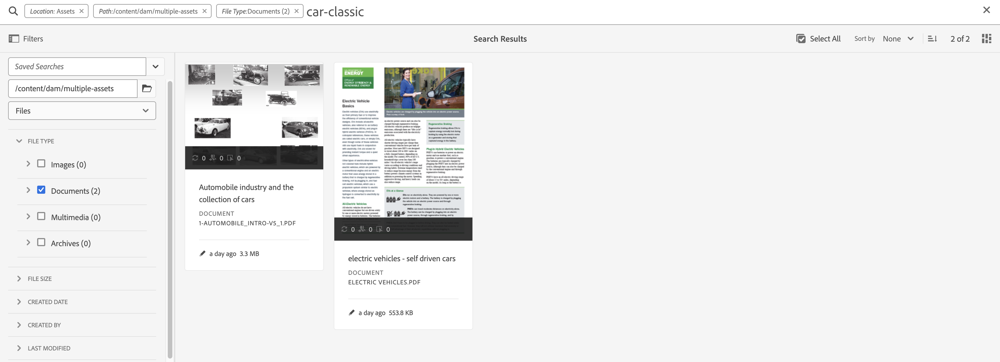

# Prácticas recomendadas de búsqueda para AEM Assets

[!DNL Adobe Experience Manager Assets] proporciona métodos de búsqueda de recursos sólidos que le ayudan a lograr una mayor velocidad de contenido. A veces, encontrar el recurso adecuado puede ser arduo y requerir mucho tiempo. Por lo tanto, la capacidad de búsqueda de recursos en [!DNL Adobe Experience Manager Assets] es fundamental para el uso de un sistema de administración de recursos digitales, ya sea para su uso posterior por parte de creativos, para la administración sólida de recursos por parte de usuarios empresariales y especialistas en marketing o para la administración por parte de administradores de DAM.

Este documento de ayuda contiene prácticas recomendadas de búsqueda de AEM con la ayuda de varios escenarios para ayudar a los usuarios de AEM a realizar búsquedas de nivel básico a avanzado.

## Acceso a Experience Manager Search {#access-experience-manager-search}

A continuación se indican los pasos básicos que se deben seguir en Experience Manager antes de comenzar la búsqueda:

* En la **vista de administración**, vaya a Assets > Archivos en Experience Manager y haga clic en el icono de búsqueda en la barra superior. También puede usar una barra diagonal (/) para abrir el campo Omni Search.
En la **vista de Assets**, la barra de búsqueda se ve en la parte superior y se puede acceder a ella directamente.
* `Location:Assets` y `Path:/content/dam` están preseleccionados para limitar el ámbito de búsqueda a su repositorio de Experience Manager Assets. Si se desplaza a cualquier otra carpeta, `Path:/content/dam/<folder name>` se muestra en el campo Omni Search para limitar el ámbito de búsqueda a la carpeta actual.

## Búsqueda básica {#basic-search}

**Escenario 1: realice una búsqueda básica usando `classic car` como palabra clave de búsqueda.**

La búsqueda de palabras clave no distingue entre mayúsculas y minúsculas y es una búsqueda de texto completo en los campos de metadatos incluidos en el índice del recurso *búsqueda de texto completo* (configurable en la definición del índice). Si se usa más de una palabra clave, **AND es el operador predeterminado entre las palabras clave, por lo que considera que la búsqueda de &#39;coche clásico&#39; es &#39;coche AND clásico&#39;**.

Los resultados de búsqueda que coinciden con todos los términos de búsqueda en los campos de metadatos se muestran primero, seguidos de los resultados de búsqueda que coinciden con cualquiera de los términos de búsqueda en las etiquetas inteligentes. El orden aproximado de visualización de los resultados de búsqueda es:

1. Coincide con `Classic Car` en los distintos campos de metadatos.
2. Coincidencias de `Classic Car` en etiquetas inteligentes.
3. Coincidencias de `Classic` o de `Car` en etiquetas inteligentes.

Especifique `classic car` como palabra clave de búsqueda y haga clic en Buscar. Puede ver las sugerencias de búsqueda en una lista desplegable a medida que escribe la palabra clave. Las sugerencias de búsqueda se basan en el contenido del índice de búsqueda de la implementación de Experience Manager. Si no puede ver los recursos adecuados en el menú desplegable, pulse la tecla Intro para ver la lista de resultados. Los resultados se ordenan por relevancia, empezando por las coincidencias más cercanas.

<!---->

Puede hacer la búsqueda más específica añadiendo la palabra clave de búsqueda entre comillas dobles (&quot; &quot;). Esta búsqueda solo incluye Assets que contiene los términos especificados juntos. Los criterios de búsqueda son - `"classic car"`. Por lo tanto, se muestran los resultados de búsqueda con los términos `classic` y `car`.

<!---->

La búsqueda muestra resultados similares si también estás trabajando en la **[!UICONTROL vista de Assets]**.

>[!VIDEO](https://video.tv.adobe.com/v/3425489)

## Archivos y carpetas {#files-folders}

**Escenario 2: busque todos los archivos que usan la palabra clave `classic car` en la carpeta `automobile`.**

El filtro Archivos y carpetas le ayuda a limitar la búsqueda. Utilice las opciones Archivos, Carpetas o Archivos y carpetas disponibles en la lista desplegable según sus necesidades. La opción para elegir entre Archivos, Carpetas o Archivos y carpetas sólo está accesible en la **[!UICONTROL vista Administrador]**. En la **[!UICONTROL vista de Assets]**, vaya a [!UICONTROL Ruta] y busque la carpeta donde desea realizar una búsqueda.

* Utilice la opción **[!UICONTROL Archivos]** cuando necesite buscar específicamente archivos en una ruta específica dentro del repositorio. No es necesario buscar carpetas dentro de la ruta definida.
* Utilice la opción **[!UICONTROL Carpetas]** cuando necesite limitar la búsqueda a carpetas en una ruta específica.
* Utilice la opción **[!UICONTROL Archivos y carpetas]** si necesita buscar en todos los recursos disponibles en la ruta especificada dentro del repositorio.

Para lograr este escenario, ejecute los pasos a continuación:

1. Especifique `classic car` como palabra clave de búsqueda y haga clic en Buscar.
2. Haga clic en Filtros y defina la ruta de la carpeta `automobile`. Por ejemplo, `/content/dam/multiple-assets/automobile`
Seleccione la carpeta de la ruta y vaya a la carpeta requerida si desea buscar dentro de la carpeta específica.
3. Seleccione Archivos de la lista desplegable para mostrar todos los archivos con la palabra clave `classic car`.

<!---->

>[!VIDEO](https://video.tv.adobe.com/v/3425487)

## Operadores {#operators}

**Escenario 3: busque palabras clave `Classic Car` o `Car` usando varias combinaciones de operadores para reducir la búsqueda.**

Para ejecutar el escenario anterior en **[!UICONTROL Admin view]**, puede usar una combinación de varios operadores para mejorar su experiencia de búsqueda. Los operadores admitidos son:

### Operador AND {#and-operator}

El operador AND es el operador predeterminado entre dos palabras clave en Omni Search. Por ejemplo, cuando escribe `classic car` en la barra de búsqueda, los resultados con las palabras clave `classic` y `car` aparecen en los resultados de búsqueda de forma predeterminada.

### Operador OR {#or-operator}

Si desea ser específico con los resultados de búsqueda y desea una opción en los resultados de búsqueda, puede utilizar el operador OR. Por ejemplo, la palabra clave `classic OR car` proporciona a los resultados de la búsqueda cualquiera de las palabras clave de sus metadatos.

### operador NOT {#not-operator}

Si desea recuperar resultados excluyendo algunas palabras clave, puede utilizar el operador NOT. El operador NOT utiliza el símbolo de guión (-) para indicar a la búsqueda de AEM qué elementos se excluirán de los resultados de búsqueda. Por ejemplo, la consulta de búsqueda `car - classic` que especifica metadatos que contienen `car` pero excluyen `classic`.

Del mismo modo, puede buscar todos los coches, pero no jeep. La consulta tiene el siguiente aspecto: `car - jeep`. Muestra todos los recursos con metadatos `car`, pero excluye los recursos con metadatos `jeep`.

**[!UICONTROL Assets view]** no admite el uso de Operadores.

## Comodines {#wildcards}

Se utilizan caracteres comodín para reemplazar uno o más caracteres en la búsqueda. Para ejecutar el escenario anterior en **[!UICONTROL Admin view]**, puede usar una combinación de varios comodines para mejorar su experiencia de búsqueda. Se utilizan dos caracteres comodín para realizar la búsqueda: signo de interrogación (?) y Asterisco (*). El símbolo de signo de interrogación se utiliza para buscar un solo carácter, mientras que el símbolo de asterisco se utiliza para buscar varios caracteres.

### Signo de interrogación (?) {#question-mark}

El signo de interrogación puede utilizarse como operador condicional para facilitar la búsqueda en Experience Manager.

* La consulta `car?` coincide con la palabra con un carácter después de car. Por ejemplo, el carro de compras.
* `?car` consulta coincide con la palabra con un carácter antes de car. Por ejemplo, cicatriz.
* `car????` consulta coincide con la palabra con cuatro caracteres después de car. Por ejemplo, lavado de autos.

### Asterisco (*) {#asterisk}

El asterisco es un operador comodín que se utiliza para ampliar la búsqueda escribiendo menos caracteres. Cuando conozca los caracteres de inicio del recurso que está buscando, pero no conozca el resto, puede utilizar el operador asterisco en la búsqueda. Por ejemplo, la consulta `*car` devuelve todos los recursos con la tarjeta de sufijo disponibles en sus metadatos. Los resultados podrían ser coche clásico, coche deportivo, coche clásico y deportivo, y así sucesivamente. A continuación se muestran algunos ejemplos de uso del operador asterisco de varias formas:

* `*car*` devuelve todas las combinaciones posibles.
* `car*` devuelve recursos con carro, portador, carro, etc.
* `*car` devuelve recursos con el automóvil moderno, el automóvil deportivo, etc.

>[!VIDEO](https://video.tv.adobe.com/v/3425488)

**[!UICONTROL Assets view]** no admite el uso de comodines.

## Filtros {#filters}

Adobe Experience Manager proporciona varios filtros de búsqueda que puede utilizar para restringir y segmentar la búsqueda mediante una consulta con ámbito. Cuando no está seguro del título o la metadescripción de un recurso, puede utilizar varios filtros de búsqueda para que la búsqueda sea más relevante. Puede utilizar filtros de búsqueda con o sin escribir una palabra clave. Para abrir el panel de filtros en la **[!UICONTROL vista de administración]**, haga clic en el icono **GlobalNav** y seleccione **[!UICONTROL Filtros]**. Por su parte, para abrir el panel Filtros en **[!UICONTROL Assets view]**, haga clic en [!UICONTROL Filtros] junto a la barra de búsqueda.

Puede seleccionar uno o varios filtros para restringir la búsqueda en Adobe Experience Manager.
<!--The following filters are available out of the box for all the users of Experience Manager:

* File Type Search Filters  
* File Size Search Filters 
* Date of Creation 
* Created by 
* Last Modified date 
* Last Modified by 
* Search by Language 
* Search by Status 
* Search based on Orientation 
* Search by Style 
* Search based on insights 
* Search by Adobe Stock 
* Color specific Asset search 
* Content fragment model 
 -->

<!--**Scenario 5: Search for an Asset named 'classic car' in Black color which has either meta description or a similar asset in Japanese language.**  
 
To perform a search on such a requirement, type 'classic car' in the search bar.  Navigate to the filters panel and expand the language search filter drop-down. Type "ja-jp", which represents the Japanese language. Expand the 'Asset Color' filter and select black color or add the hexadecimal code for the black color (#000000).

-->

**Escenario 4: buscar documentos de tipo de archivo PDF sin publicar con la palabra clave `classic car`.**

Ejecute los siguientes pasos en **[!UICONTROL vista de administrador]**:

1. Escriba `classic car` en la barra de búsqueda.
1. Vaya a Filtros. En [!UICONTROL Tipo de archivo], expanda [!UICONTROL Documentos] y después [!UICONTROL Procesamiento de texto].
1. Seleccione [!UICONTROL PDF].
1. Ir a [!UICONTROL Estado] > [!UICONTROL Publicar] > [!UICONTROL Publicación cancelada].

<!---->

Ejecute los siguientes pasos en **[!UICONTROL Assets view]**:

1. Escriba `classic car` en la barra de búsqueda.
1. Vaya a Filtros. En [!UICONTROL Tipo MIME], seleccione [!UICONTROL PDF].
1. Vaya a [!UICONTROL Estado del recurso], seleccione [!UICONTROL Todos] para incluir todos los recursos publicados y no publicados.

**Escenario 5: buscar todas las imágenes excepto PNG**

Cuando no está seguro del título o la metadescripción de un recurso, puede utilizar varios filtros de búsqueda para que la búsqueda sea más relevante. Por ejemplo, para buscar recursos en **[!UICONTROL Admin view]**, siga los pasos a continuación:

1. Vaya a los filtros de búsqueda.
1. Vaya a Filtros. En [!UICONTROL Tipo de archivo], expanda [!UICONTROL Imágenes] y seleccione [!UICONTROL Web habilitado]
1. Anule la selección de PNG.

<!---->

Para buscar recursos usando el escenario mencionado en **[!UICONTROL Assets view]**, siga los pasos a continuación:

1. Vaya a los filtros de búsqueda.
1. Vaya a Filtros. En [!UICONTROL Tipo MIME], seleccione todos los tipos MIME especificados, pero Anule la selección de PNG.

>[!VIDEO](https://video.tv.adobe.com/v/3425486)

## Búsqueda avanzada {#advanced-search}

La búsqueda de AEM permite crear consultas de búsqueda complejas con menos esfuerzo. A continuación se muestran varios ejemplos para ayudarle a crear consultas de búsqueda complejas:

**Escenario 6: buscar todos los documentos en el repositorio de Experience Manager con `classic car` en sus metadatos. El contenido del documento debe contener la palabra clave `classic car`.**

Adobe Experience Manager le permite agregar varios criterios a la búsqueda. Puede utilizar una combinación de palabras clave, operadores y filtros para reducir los resultados de búsqueda.

Para realizar una búsqueda del escenario 6:

1. Escriba la palabra clave `classic car` en la barra de búsqueda.
2. Vaya al panel Filtros y seleccione Documentos en Tipo de archivo.
3. Refine la búsqueda con el comodín de asterisco. Escriba `"classic car"` para buscar todos los recursos que contengan la palabra clave `classic car`.

<!---->

No se puede ejecutar el escenario 6 en **[!UICONTROL Assets view]** porque no admite el uso de caracteres comodín.

**Escenario 7: buscar todos los documentos en el repositorio de Experience Manager en los que el contenido del documento debe incluir `car` pero excluir `classic`. La misma condición se aplica a los metadatos de un recurso.**

Para realizar una búsqueda del escenario 7:

Escriba la palabra clave `car - classic` en la barra de búsqueda. Vaya al panel Filtros y seleccione Documentos en Tipo de archivo. El orden de prioridad de la búsqueda se basa en lo siguiente:
Prioridad 1: Metadatos
Prioridad 2: Etiquetas inteligentes

<!---->

No se puede ejecutar el escenario 7 en **[!UICONTROL Assets view]** porque no admite el uso de caracteres comodín.

<!--
**Scenario 9: Search for all images except PNG**

When you are unsure about the title or meta description of an asset, you can use various search filters to make your search more relevant. Follow the steps below:

1. Go to search filters. 
1. Under [!UICONTROL File Type], expand [!UICONTROL Images] and select [!UICONTROL Web enabled]
1. Deselect PNG.

**Method 1:** Go to search bar and type `images - PNG`. All the images appear excluding PNG.

**Method 2:** Go to search filters. Under [!UICONTROL File Type], expand [!UICONTROL Images] > select [!UICONTROL Web enabled] > deselect PNG.

-->

**Escenario 8: buscar etiquetas de metadatos con el jeep de metadatos**

Puede capturar un criterio específico mediante varios filtros de búsqueda. La etiqueta es una palabra clave que se asigna a un recurso para que se pueda identificar entre un gran número de recursos. Por ejemplo, en este escenario, busque recursos que tengan etiquetas *jeep*. Para ello, escriba `tags:jeep` en la barra de búsqueda. En los resultados de búsqueda solo se muestran los recursos que cumplen estos criterios.

<!---->

La búsqueda muestra resultados similares si también estás trabajando en la **[!UICONTROL vista de Assets]**.

>[!VIDEO](https://video.tv.adobe.com/v/3425490)

**Escenario 9: buscar una coincidencia similar para el color rojo del coche**

Al realizar la búsqueda en AEM, puede filtrar los resultados mostrando recursos similares a los seleccionados. Puede usar la opción **Buscar similares** para restringir la búsqueda a la coincidencia exacta o similar del recurso buscado. Esto ayuda a encontrar recursos que tienen etiquetas inteligentes similares a las del recurso seleccionado. Por ejemplo, cuando desee buscar recursos similares, ejecute los siguientes pasos:

1. Busque el recurso según sus necesidades.
1. Pase el ratón sobre el recurso > haga clic en los puntos suspensivos > seleccione [!UICONTROL Buscar similares].
o
Seleccione el recurso > vaya a los puntos suspensivos en la parte superior derecha > seleccione [!UICONTROL Buscar similares].

   

1. Fíjese en la barra de búsqueda. La miniatura del recurso seleccionado aparecerá en la barra de búsqueda indicando los requisitos de búsqueda. Como resultado, devuelve recursos con etiquetas inteligentes similares.

Ejecute los siguientes pasos en **[!UICONTROL Assets view]**:

1. Busque el recurso según sus necesidades.
1. Seleccione la opción Imagen > Navegar a [!UICONTROL Buscar imagen similar] en la barra de navegación de la parte superior.
Le lleva a la colección de recursos con colores y metadatos similares.

## Facetas de búsqueda personalizadas {#custom-search-facets}

Las facetas de búsqueda en Adobe Experience Manager le permiten buscar recursos de varias formas en lugar de hacerlo de una sola forma predeterminada o por orden taxonómico. Puede personalizar las facetas de búsqueda y agregar predicados según sus necesidades. Lea [Facetas de búsqueda](https://experienceleague.adobe.com/docs/experience-manager-cloud-service/content/assets/admin/search-facets.html?lang=en#) para obtener una guía paso a paso sobre cómo agregar un predicado personalizado.

<!--**Scenario 10: Search assets based on Sku ID**
to be added later
-->

**Escenario 10: buscar recursos específicos en función de la última fecha de modificación o caducidad**

Las restricciones de fecha le permiten limitar la búsqueda personalizada a un periodo determinado, por ejemplo, mediante los filtros de búsqueda de periodo de tiempo. Para buscar el requisito anterior, escriba `classic car` en la barra de búsqueda. Seleccione el intervalo de fechas en los filtros de fecha [!UICONTROL Fecha de creación] y [!UICONTROL Última modificación].

La búsqueda muestra resultados similares si también estás trabajando en la [!UICONTROL vista de Assets].

## Aumentar la relevancia de las palabras clave {#boosting-keywords}

Puede mejorar la relevancia de las palabras clave para recursos concretos para ayudar a impulsar las búsquedas en función de las palabras clave. En otras palabras, las imágenes para las que promociona palabras clave específicas aparecen en la parte superior de los resultados de búsqueda cuando busca en función de estas palabras clave.

1. En la interfaz de usuario de Assets, abra la página de propiedades del recurso. Haga clic en [!UICONTROL Avanzado] y luego en [!UICONTROL Agregar] en [!UICONTROL Elevar para las palabras clave de búsqueda].
2. En el cuadro Buscar promocionar, especifique una palabra clave para la que desee aumentar la búsqueda de la imagen y, a continuación, haga clic en [!UICONTROL Agregar]. Puede especificar varias palabras clave del mismo modo.
3. Haga clic en [!UICONTROL Guardar y cerrar]. El recurso que promocionó para esta palabra clave aparece entre los resultados de búsqueda principales.

## Cosas importantes al realizar una búsqueda en Experience Manager {#notable-things}

* Proporcione información de metadatos del recurso para preparar su recurso en el que se puede buscar mediante el algoritmo Omni Search. Asegúrese de que se actualiza la información de metadatos del recurso.
* Use comillas dobles (&quot; &quot;) para que la búsqueda sea exacta y precisa.
* Compruebe la ruta que está buscando. Seleccione la opción adecuada entre carpeta, archivo o archivo y carpeta para ejecutar la consulta de búsqueda en la ubicación adecuada.
* Puede comprobar los filtros que está aplicando a la búsqueda en la barra de búsqueda de Omni.
* En caso de que no obtenga resultados, compruebe la ruta que está buscando. Compruebe también la carpeta desde la que está realizando la búsqueda. Por ejemplo, si está realizando una búsqueda dentro de la &quot;Carpeta del automóvil&quot; pero la palabra clave que está utilizando está relacionada con &quot;Ropa&quot;, los resultados de la búsqueda no son adecuados.
* Compruebe si ha agregado espacio en blanco antes de la palabra clave que está buscando.
* El uso de una combinación de palabras clave, operadores y filtros puede facilitar y nivelar la experiencia de búsqueda.

<!--
* Use stemming search approach while searching for the asset. It means using an exact keyword that you are looking for.
* Specify Smart tags to the asset properties to boost the ranking of the search results.
The newly added assets are not indexed.
-->

## Diferencias entre la [!UICONTROL vista de administrador] y la [!UICONTROL búsqueda de la vista de Assets] {#differences-asset-and-admin-view}

<table>
    <tr>
        <th> Parámetros </th>
        <th> Vista de administrador </th>
        <th> Vista de recursos </th>
    </tr>
    <tr>
        <td> Facetas personalizadas </td>
        <td> Puede agregar <a href="https://experienceleague.adobe.com/docs/experience-manager-cloud-service/content/assets/admin/search-facets.html?lang=en">facetas de búsqueda personalizadas según los requisitos.</td>
        <td> Las facetas personalizadas se admiten parcialmente en la vista de Assets. Las facetas admitidas son:
            <ul>
            <li> Etiquetas previstas
            <li> Nombre
            <li> Confianza de etiquetas prevista
            <li> Tamaño del recurso
            <li> Título
            </ul>
        </td>
    </tr>
    <tr>
        <td> Operadores </td>
        <td> Admite AND, OR y NOT </td>
        <td> No compatible </td>
    </tr>
    <tr>
        <td> Comodines </td>
        <td> Admite el signo de interrogación (?) y un asterisco (*).</td>
        <td> No compatible </td>
    </tr>
    <tr>
        <td> Ampliación de resultados de búsqueda </td>
        <td> Compatible </td>
        <td> No compatible </td>
    </tr>
     <tr>
        <td> Borrar todos los filtros a la vez </td>
        <td> No compatible </td>
        <td> Compatible</td>
    </tr>
     <tr>
        <td> Archivos/carpetas/archivos y carpetas </td>
        <td> Compatible </td>
        <td> Hay una opción para seleccionar una carpeta disponible en "Tipo de archivo" </td>
    </tr>
     <tr>
        <td> Estado de los recursos </td>
        <td> 
            Las opciones compatibles son:
            <ul>
            <li> Publicación
            <li> Fecha de publicación
            <li> Última publicación de
            <li> Aprobación 
            <li> Cierre de compra
            <li> Vencimiento
            <li> Dynamic Media
            </ul>
        </td>
        <td>
        Las opciones compatibles son:
            <ul>
            <li> Todos
            <li> Aprobados
            <li> Rechazado
            <li> Sin estado
            </ul> 
        </td>
    </tr>
     <tr>
        <td> Tipo de archivo </td>
        <td>
        Las opciones compatibles son:
            <ul>
            <li> Imágenes
            <li> Documentos
            <li> Multimedia
            <li> Archivos 
            </ul>
            Estas tienen opciones jerárquicas adicionales.
        </td>
        <td>
        Las opciones compatibles son:
            <ul>
            <li> Imágenes
            <li> Documentos
            <li> Vídeo
            <li> Carpeta 
            </ul> 
        Más opciones se enumeran en Tipo MIME.
        </td>
    </tr>
     <tr>
        <td> Tamaño del archivo </td>
        <td>
        Las opciones compatibles son:
            <ul>
            <li> De - A
            <li> Tamaño (bytes, KB, MB, GB)
            </ul> 
        </td>
        <td> No compatible </td>
    </tr>
     <tr>
        <td> Otros filtros </td>
        <td>
            <ul>
            <li> Idioma
            <li> Estado
            <li> Orientación
            <li> Estilo 
            <li> Perspectivas
            <li> Stock
            <li> Color de recurso
            <li> Modelo de fragmento de contenido
            </ul> 
        </td>
        <td> No compatible </td>
    </tr>
</table>

>[!MORELIKETHIS]
>
>* [Buscar recursos](https://experienceleague.adobe.com/docs/experience-manager-cloud-service/content/assets/manage/search-assets.html?lang=en)
>* [Facetas de búsqueda](https://experienceleague.adobe.com/docs/experience-manager-cloud-service/content/assets/admin/search-facets.html?lang=en)
