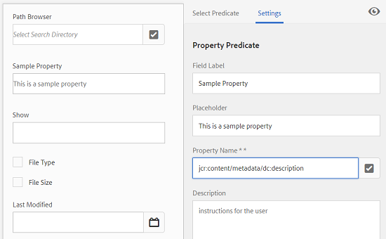

# Facetas de búsqueda {#search-facets}

Obtenga información sobre cómo crear, modificar y utilizar facetas de búsqueda en AEM.

Una implementación en toda la empresa de Recursos Adobe Experience Manager (AEM) tiene la capacidad de almacenar muchos recursos. A veces, encontrar el recurso correcto puede resultar difícil y llevar mucho tiempo si solo se utilizan las funciones de búsqueda genéricas de AEM.

Utilice las facetas de búsqueda del panel Filtros para agregar más granularidad a la experiencia de búsqueda y hacer que la funcionalidad de búsqueda sea más eficiente y versátil. Las facetas de búsqueda agregan varias dimensiones (predicados) que le permiten realizar búsquedas más complejas. El panel Filtros incluye algunas facetas estándar. También puede agregar facetas de búsqueda personalizadas.

En resumen, las facetas de búsqueda permiten buscar recursos de varias formas en lugar de hacerlo en un único orden taxonómico predeterminado. Puede desplazarse fácilmente hasta el nivel de detalle deseado para una búsqueda más enfocada.

Por ejemplo, si busca una imagen, puede elegir si desea un mapa de bits o una imagen vectorial. Puede reducir aún más el alcance de la búsqueda especificando el tipo MIME para la imagen. Del mismo modo, al buscar documentos, puede especificar el formato, por ejemplo, PDF o MS Word.

## Agregar un predicado {#adding-a-predicate}

Las facetas de búsqueda que aparecen en el panel Filtros se definen en el formulario de búsqueda subyacente mediante predicados. Para mostrar más o diferentes facetas, agregue predicados al formulario predeterminado o utilice un formulario personalizado que incluya facetas de su elección.

Para las búsquedas de texto completo, agregue el `Fulltext` predicado al formulario. Utilice el predicado Propiedad para buscar recursos que coincidan con una sola propiedad especificada. Utilice el predicado Opciones para buscar recursos que coincidan con uno o varios valores de una propiedad concreta. Agregue el predicado Intervalo de fechas para buscar recursos creados dentro de un intervalo de fechas especificado.

1. Toque o haga clic en el logotipo de AEM y, a continuación, vaya a **[!UICONTROL Herramientas]** > **[!UICONTROL General]** > **[!UICONTROL Buscar formularios]**.
1. En la página Buscar formularios, seleccione **[!UICONTROL Recursos Administración Barra]** de búsqueda y, a continuación, toque **Editar** .

   

1. En la página Editar formularios de búsqueda, arrastre un predicado de la ficha **[!UICONTROL Seleccionar predicado]** al panel principal. Por ejemplo, arrastre Predicado **[!UICONTROL de propiedades]**.

   

   Arrastre y suelte un predicado para personalizar los filtros de búsqueda

1. En la ficha Configuración, introduzca una etiqueta de campo, un texto de marcador de posición y una descripción para el predicado. Especifique un nombre válido para la propiedad de metadatos que desea asociar con el predicado.

   La etiqueta de encabezado de la ficha Configuración identifica el tipo del predicado seleccionado.

   

   Utilice la ficha Configuración para proporcionar las opciones necesarias de un predicado

1. En el campo Nombre **[!UICONTROL de propiedad]** , especifique un nombre válido para la propiedad de metadatos que desea asociar al predicado. Es el nombre basado en el cual se realiza la búsqueda. Por ejemplo, introduzca `jcr:content/metadata/dc:description` o `./jcr:content/metadata/dc:description`.

   También puede seleccionar un nodo existente en el cuadro de diálogo de selección.

   

   Asociación de una propiedad de metadatos con un predicado en el campo Nombre de propiedad

1. Toque o haga clic en la **[!UICONTROL vista previa]** de la  para generar una vista previa del panel Filtros tal como aparece después de agregar el predicado.
1. Revise el diseño del predicado en el modo de vista previa.

   

   Vista previa del formulario de búsqueda antes de enviar los cambios

1. Para cerrar la vista previa, toque o haga clic en **[!UICONTROL Cerrar]**  en la esquina superior derecha de la vista previa.
1. Toque **[!UICONTROL Listo]** para guardar la configuración.
1. Vaya al panel Buscar en la interfaz de usuario de Recursos. El predicado Propiedad se agrega al panel.
1. Escriba una descripción del recurso que se buscará en el cuadro de texto. Por ejemplo, escriba &quot;Adobe&quot;. Cuando realiza una búsqueda, los recursos con una descripción que coincide con &quot;Adobe&quot; se muestran en los resultados de la búsqueda.

## Agregar un predicado de opciones {#adding-an-options-predicate}

El predicado Opciones permite agregar varias opciones de búsqueda en el panel Filtros. Puede seleccionar una o varias de estas opciones en el panel Filtros para buscar recursos. Por ejemplo, para buscar recursos en función del tipo de archivo, configure las opciones como Imágenes, Multimedia, Documentos y Archivos en el formulario de búsqueda. Después de configurar estas opciones, la búsqueda se realiza en recursos de tipo GIF, JPEG, PNG, etc., al seleccionar la opción Imágenes en el panel Filtros.

Para asignar las opciones a la propiedad correspondiente, cree una estructura de nodos para las opciones y proporcione la ruta del nodo principal en la propiedad Nombre de propiedad del predicado Opciones. El nodo principal debe ser del tipo `sling`: `OrderedFolder`. Las opciones deben ser del tipo `nt:unstructured`. Los nodos de opciones deben tener las propiedades `jcr:title` y `value` configuradas.

La `jcr:title` propiedad es un nombre descriptivo para la opción que se muestra en el panel Filtros. El `value` campo se utiliza en la consulta para coincidir con la propiedad especificada.

Al seleccionar una opción, la búsqueda se realiza en función de la propiedad del nodo de opciones y de sus nodos secundarios, si los hay. `value` El árbol entero bajo el nodo de opciones se recorre y la propiedad de cada nodo secundario se combina mediante una operación O para formar la consulta de búsqueda. `value`

Por ejemplo, si selecciona &quot;Imágenes&quot; para los tipos de archivo, la consulta de búsqueda de los recursos se genera combinando la propiedad `value` mediante una operación O. Por ejemplo, la búsqueda de imágenes se genera combinando los resultados coincidentes para *image/jpeg*, *image/gif*, *image/png*, *image/pjpeg*, e *image/tiff* `jcr:content/metadata/dc:format` para la propiedad mediante una operación OR.

La propiedad Value de un tipo de archivo, como se ve en CRXDE, se utiliza para que funcionen las consultas de búsqueda

En lugar de crear manualmente una estructura de nodos para las opciones del repositorio de CRX, puede definir las opciones de un archivo JSON especificando los pares de clave-valor correspondientes. Especifique la ruta del archivo JSON en el campo Nombre **[!UICONTROL de propiedad]** . Por ejemplo, puede definir los pares clave-valor `image/bmp`, `image/gif`, `image/jpeg`y `image/png` especificar sus valores como se muestra en el siguiente archivo JSON de muestra. En el campo **[!UICONTROL Nombre]** de propiedad, puede especificar la ruta de CRX para este archivo.

```
{
    "options" :
 [
          {"value" : "image/bmp","text" : "BMP"},
          {"value" : "image/gif","text" : "GIF"},
          {"value" : "image/jpeg","text" : "JPEG"},
          {"value" : "image/png","text" : "PNG"}
 ]
}
```

Si desea utilizar un nodo existente, especifíquelo mediante el cuadro de diálogo de selección.

>[!NOTE]
>
>El predicado Opciones es un contenedor personalizado que incluye predicados de propiedades para mostrar el comportamiento descrito. Actualmente, no hay ningún extremo REST disponible para admitir la funcionalidad de forma nativa.

1. Toque el logotipo de AEM y, a continuación, vaya a **[!UICONTROL Herramientas > General > Buscar formularios]**.
1. En la página **[!UICONTROL Buscar formularios]** , seleccione **[!UICONTROL Recursos Administración Raíl]** de búsqueda y toque el icono Editar.
1. En la página **[!UICONTROL Editar formulario]** de búsqueda, arrastre Predicado **[!UICONTROL de]** opciones desde la ficha **[!UICONTROL Seleccionar predicado]** al panel principal.
1. En la ficha **[!UICONTROL Configuración]** , introduzca una etiqueta y un nombre para la propiedad. Por ejemplo, para buscar recursos en función de su formato, especifique un nombre práctico para la etiqueta, por ejemplo, Tipo **[!UICONTROL de archivo]**. Especifique la propiedad en función de la cual se realizará la búsqueda en el campo de propiedad, por ejemplo `jcr:content/metadata/dc:format.`
1. Realice una de las acciones siguientes:

   * En el campo Nombre **[!UICONTROL de]** propiedad, mencione la ruta del archivo JSON donde define los nodos para las opciones y especifique los pares de clave-valor correspondientes.
   * Toque  junto al campo Opciones para especificar el texto y el valor de visualización de las opciones que desea proporcionar en el panel Filtros. Para agregar otra opción, toque o haga clic  y repita el paso.

1. Asegúrese de que la opción Selección **** única se borra para que el usuario pueda seleccionar varias opciones para los tipos de archivo a la vez (por ejemplo, Imágenes, Documentos, Multimedia y Archivos). Si selecciona **[!UICONTROL Selección]**&#x200B;única, el usuario sólo puede seleccionar una opción para los tipos de archivo a la vez.

   

   Campos disponibles en el predicado Opciones

1. En el campo **Descripción** , introduzca una descripción opcional y, a continuación, haga clic en **[!UICONTROL Finalizado]**.
1. Vaya al panel Buscar. El predicado Opciones se agrega al panel **Buscar** . Las opciones de Tipo **[!UICONTROL de archivo]** se muestran como casillas de verificación.

## Agregar un predicado de propiedad de varios valores {#adding-a-multi-value-property-predicate}

El `Multi Value Property` predicado permite buscar recursos para varios valores. Imagine un escenario en el que tiene imágenes de varios productos en Recursos AEM y los metadatos de cada imagen incluyen un número de SKU asociado al producto. Puede utilizar este predicado para buscar imágenes de producto basadas en varios números de SKU.

1. Haga clic en el logotipo de AEM y, a continuación, vaya a **[!UICONTROL Herramientas]** > **[!UICONTROL General]** > **[!UICONTROL Buscar formularios]**.
1. En la página Buscar formularios, seleccione **[!UICONTROL Recursos Administración Raíl]** de búsqueda y toque **Editar** aemassets_edit .
1. En la página Editar formulario de búsqueda, arrastre un predicado **[!UICONTROL de propiedades de]** varios valores de la ficha **[!UICONTROL Seleccionar predicado]** al panel principal.
1. En la ficha **[!UICONTROL Configuración]** , introduzca una etiqueta y un texto de marcador de posición para el predicado. Especifique el nombre de la propiedad en función de la cual se realizará la búsqueda en el campo de propiedad, por ejemplo `jcr:content/metadata/dc:value`. También puede utilizar el cuadro de diálogo de selección para seleccionar un nodo.
1. Asegúrese de que la opción Compatibilidad con **** delimitadores está seleccionada. En el campo Delimitadores **[!UICONTROL de entrada]** , especifique delimitadores para separar valores individuales. De forma predeterminada, se especifica una coma como delimitador. Puede especificar un delimitador diferente.
1. En el campo **Descripción** , introduzca una descripción opcional y, a continuación, toque **[!UICONTROL Listo]**.
1. Vaya al panel Filtros de la interfaz de usuario de Recursos. El predicado Propiedad **[!UICONTROL de]** varios valores se agrega al panel.
1. Especifique varios valores en el campo Valor múltiple separado por los delimitadores y realice la búsqueda. El predicado obtiene una coincidencia de texto exacta para los valores especificados.

## Agregar un predicado de etiquetas {#adding-a-tags-predicate}

El `Tags` predicado permite realizar búsquedas de recursos basadas en etiquetas. De forma predeterminada, Recursos AEM busca en los recursos una o varias etiquetas coincidentes en función de las etiquetas que especifique. En otras palabras, la consulta de búsqueda realiza una operación O utilizando las etiquetas especificadas. Sin embargo, puede utilizar la opción de coincidencia con todas las etiquetas para buscar recursos que incluyan todas las etiquetas que especifique.

1. Haga clic en el logotipo de AEM y, a continuación, vaya a **[!UICONTROL Herramientas]** > **[!UICONTROL General]** > **[!UICONTROL Buscar formularios]**.
1. En la página Buscar formularios, seleccione **[!UICONTROL Recursos Administración Raíl]** de búsqueda y toque **Editar** aemassets_edit .
1. En la página Editar formulario de búsqueda, arrastre el predicado **[!UICONTROL de]** etiquetas de la ficha Seleccionar predicado al panel principal.
1. En la ficha Configuración, introduzca un texto de marcador de posición para el predicado. Especifique el nombre de propiedad en función del cual se realizará la búsqueda en el campo de propiedad, por ejemplo, *jcr:content/metadata/cq:tags*. También puede seleccionar un nodo en CRXDE desde el cuadro de diálogo de selección.
1. Configure la propiedad de ruta de etiquetas raíz de este predicado para rellenar varias etiquetas en la lista Etiquetas.
1. Seleccione la opción **** Mostrar todas las etiquetas para buscar recursos que incluyan todas las etiquetas que especifique.

   

   Configuración típica del predicado Etiquetas

1. En el campo **[!UICONTROL Descripción]** , introduzca una descripción opcional y toque o haga clic en **[!UICONTROL Listo]**.
1. Vaya al panel Buscar. El predicado **[!UICONTROL Etiquetas]** se agrega al panel Buscar.
1. Especifique las etiquetas en función de las cuales desee buscar recursos o seleccione en la lista de sugerencias.
1. Seleccione **[!UICONTROL Coincidir todo]** para buscar coincidencias que incluyan todas las etiquetas que especifique.

## Adición de otros predicados {#adding-other-predicates}

De forma similar a como se agrega un predicado de propiedad o un predicado de opciones, se pueden agregar los siguientes predicados adicionales al panel Buscar:

<table>
 <tbody>
  <tr>
   <td><p><strong>Nombre del predicado</strong></p> </td>
   <td><p><strong>Descripción</strong></p> </td>
   <td><p><strong>Propiedades</strong></p> </td>
  </tr>
  <tr>
   <td><p>Texto completo</p> </td>
   <td>El predicado de búsqueda realiza una búsqueda de texto completo en todo un nodo de recursos. <code>jcr</code> Se asigna con el <code>contains</code>: operador. Puede especificar una ruta relativa si desea realizar una búsqueda de texto completo en una parte específica del nodo de recursos.</td>
   <td>
    <ul>
     <li>Etiqueta</li>
     <li>Marcador de posición</li>
     <li>Nombre de la propiedad </li>
     <li>Descripción</li>
    </ul> </td>
  </tr>
  <tr>
   <td>Navegador de rutas</td>
   <td>Buscar predicado para buscar recursos en carpetas y subcarpetas en una ruta raíz preconfigurada</td>
   <td>
    <ul>
     <li>Marcador de posición</li>
     <li>Ruta raíz</li>
     <li>Descripción</li>
    </ul> </td>
  </tr>
  <tr>
   <td><p>Ruta</p> </td>
   <td><p>Utilícelo para filtrar los resultados según la ubicación. Puede especificar diferentes rutas como opciones.</p> </td>
   <td>
    <ul>
     <li>Etiqueta</li>
     <li>Ruta</li>
     <li>Descripción</li>
    </ul> </td>
  </tr>
  <tr>
   <td><p>Estado de publicación</p> </td>
   <td><p>Buscar predicado para buscar recursos en función de su estado de publicación</p> </td>
   <td>
    <ul>
     <li>Etiqueta</li>
     <li>Nombre de la propiedad </li>
     <li>Descripción</li>
    </ul> </td>
  </tr>
  <tr>
   <td><p>Fecha relativa</p> </td>
   <td><p>El predicado de búsqueda busca recursos en función de la fecha relativa de su creación. Por ejemplo, puede configurar opciones, como hace 2 meses, hace 3 semanas, etc. </p> </td>
   <td>
    <ul>
     <li>Etiqueta</li>
     <li>Nombre de la propiedad </li>
     <li>Fecha relativa</li>
    </ul> </td>
  </tr>
  <tr>
   <td><p>Intervalo</p> </td>
   <td><p>El predicado de búsqueda busca recursos que se encuentran dentro de un rango especificado. En el panel Buscar, puede especificar los valores mínimo y máximo para el rango.</p> </td>
   <td>
    <ul>
     <li>Etiqueta</li>
     <li>Nombre de la propiedad </li>
     <li>Descripción</li>
    </ul> </td>
  </tr>
  <tr>
   <td><p>Intervalo de fechas</p> </td>
   <td><p>El predicado de búsqueda busca recursos creados dentro de un intervalo especificado para una propiedad de fecha. En el panel Buscar, puede especificar las fechas de inicio y finalización con los selectores de fecha.</p> </td>
   <td>
    <ul>
     <li>Etiqueta</li>
     <li>Marcador de posición</li>
     <li>Nombre de la propiedad </li>
     <li>Texto de rango (Desde)</li>
     <li>Texto de intervalo (hasta)</li>
     <li>Descripción</li>
    </ul> </td>
  </tr>
  <tr>
   <td><p>Fecha</p> </td>
   <td><p>Busque en el predicado una búsqueda de recursos basada en deslizadores basada en una propiedad de fecha.</p> </td>
   <td>
    <ul>
     <li>Etiqueta</li>
     <li>Nombre de la propiedad </li>
     <li>Descripción</li>
    </ul> </td>
  </tr>
  <tr>
   <td><p>Tamaño del archivo</p> </td>
   <td><p>El predicado de búsqueda busca recursos en función de su tamaño. Se trata de un predicado basado en el silenciador en el que se seleccionan las opciones del deslizador de un nodo configurable. Las opciones predeterminadas se definen en /libs/dam/options/predicates/filesize en el repositorio de CRX. El tamaño del archivo se proporciona en bytes.</p> </td>
   <td>
    <ul>
     <li>Etiqueta</li>
     <li>Nombre de la propiedad </li>
     <li>Ruta</li>
     <li>Descripción</li>
    </ul> </td>
  </tr>
  <tr>
   <td>Última modificación del recurso</td>
   <td>Buscar predicado para buscar recursos modificados recientemente </td>
   <td>
    <ul>
     <li>Nombre de la propiedad </li>
     <li>Valor de propiedad</li>
     <li>Descripción</li>
    </ul> </td>
  </tr>
  <tr>
   <td>Estado de publicación</td>
   <td>Buscar predicado para buscar recursos en función de su estado de publicación </td>
   <td>
    <ul>
     <li>Etiqueta</li>
     <li>Nombre de la propiedad </li>
     <li>Descripción</li>
    </ul> </td>
  </tr>
  <tr>
   <td>Clasificación</td>
   <td>Buscar predicado para buscar recursos en función de su clasificación promedio </td>
   <td>
    <ul>
     <li>Etiqueta</li>
     <li>Nombre de la propiedad </li>
     <li>Ruta de opción</li>
     <li>Descripción</li>
    </ul> </td>
  </tr>
  <tr>
   <td>Estado de caducidad</td>
   <td>Buscar predicado para buscar recursos en función de su estado de caducidad </td>
   <td>
    <ul>
     <li>Etiqueta</li>
     <li>Nombre de la propiedad </li>
     <li>Descripción</li>
    </ul> </td>
  </tr>
  <tr>
   <td>Oculto</td>
   <td>Predicado de búsqueda que define una propiedad de campo oculto para buscar recursos</td>
   <td>
    <ul>
     <li>Nombre de la propiedad </li>
     <li>Valor de propiedad</li>
     <li>Descripción</li>
    </ul> </td>
  </tr>
 </tbody>
</table>

## Restaurar las facetas de búsqueda predeterminadas {#restoring-default-search-facets}

De forma predeterminada, aparece un icono Bloquear antes del carril **[!UICONTROL de búsqueda Administración de]** recursos en la página **[!UICONTROL Buscar formularios]** . El icono Bloquear desaparece si agrega facetas de búsqueda al formulario que indican que se ha modificado el formulario predeterminado.

El icono Bloquear en una opción de la página Buscar formularios indica que la configuración predeterminada está intacta y no está personalizada.

Para restaurar la faceta de búsqueda predeterminada, realice los siguientes pasos:

1. Seleccione el carril **[!UICONTROL de búsqueda de administración de]** recursos en la página **[!UICONTROL Buscar formularios]** .
1. Toque **[!UICONTROL Eliminar]** icono  Eliminar en la barra de herramientas.
1. En el cuadro de diálogo de confirmación, toque **[!UICONTROL Eliminar]** para eliminar los cambios personalizados.

   Después de eliminar los cambios personalizados en las facetas de búsqueda, el icono Bloquear vuelve a aparecer antes de **[!UICONTROL Recursos Administración Raíl]** de búsqueda en la página **[!UICONTROL Buscar formularios]** .

## User permissions {#user-permissions}

Si no se le ha asignado una función de administrador, aquí tiene una lista de permisos que necesita para realizar acciones de edición, eliminación y vista previa que involucran facetas de búsqueda.

<table>
 <tbody>
  <tr>
   <td><strong>Acción</strong></td>
   <td><strong>Permisos</strong></td>
  </tr>
  <tr>
   <td>Editar </td>
   <td>Permisos de lectura y escritura en el <code>/apps</code> nodo de CRX<br /> </td>
  </tr>
  <tr>
   <td>Eliminar</td>
   <td>Permisos de lectura, escritura y eliminación en el <code>/apps</code> nodo de CRX</td>
  </tr>
  <tr>
   <td>Vista previa</td>
   <td>Permisos de lectura, escritura y eliminación en el <code>/var/dam/content</code> nodo de CRX. Además, los permisos de lectura y escritura en el <code>/apps</code> nodo.</td>
  </tr>
 </tbody>
</table>

>[!MORELIKETHIS]
>
>* [Buscar recursos digitales](search-assets.md)

