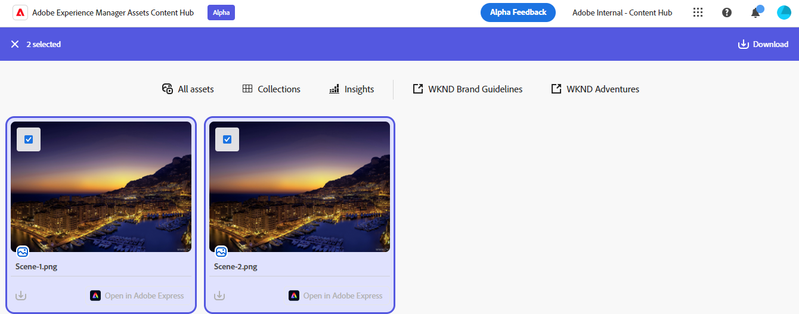

# Uso compartido de recursos en Content Hub {#search-assets-as-a-link}

Compartir recursos a través de un vínculo es una forma cómoda de poner los recursos a disposición de los usuarios [!DNL the Content Hub] usuarios. La funcionalidad permite a los usuarios autorizados acceder y descargar los recursos compartidos con ellos. Al descargar recursos desde un vínculo compartido, [!DNL the Content Hub] utiliza un servicio asincrónico que ofrece una descarga más rápida e ininterrumpida.

## Compartir un solo recurso {#share-a-single-asset}

Puede compartir un solo recurso ejecutando los siguientes pasos:

1. Seleccione un recurso y haga clic en  para compartir un recurso.

   

1. Utilice el **[!UICONTROL Caducidad]** para especificar una fecha de caducidad para el vínculo. Seleccione una de las opciones disponibles, como, 24 horas, 1 semana, 30 días, 90 días, 1 año o especifique una fecha personalizada.

1. Clic **[!UICONTROL Copiar vínculo compartido]**. A continuación, puede compartir el vínculo copiado con el destinatario.

## Compartir varios recursos {#share-multiple-assets}

[!DNL The Content Hub] permite compartir varios recursos a través de un vínculo compartido. Ejecute los siguientes pasos:

1. Seleccione los recursos que debe compartir con el destinatario autorizado. Puede seleccionar varios recursos uno por uno o hacer clic en ellos **[!UICONTROL Seleccionar todo]** para seleccionar todos los recursos disponibles a la vez. El **[!UICONTROL Seleccionar todo]** Esta opción solo se muestra al seleccionar al menos un recurso.

1. Haga clic en  icono.

   

1. En la sección Vista previa, también puede eliminar recursos según sus necesidades. Utilice el **[!UICONTROL Caducidad]** para especificar una fecha de caducidad para el vínculo. Seleccione una de las opciones disponibles, como, 24 horas, 1 semana, 30 días, 90 días, 1 año o especifique una fecha personalizada.

1. Clic **[!UICONTROL Copiar vínculo compartido]**. A continuación, puede compartir el vínculo copiado con el destinatario.

## Previsualización y uso compartido de recursos {#preview-assets}

Puede obtener una vista previa del aspecto de un recurso digital que va a compartir antes de compartirlo con un destinatario del vínculo. Haga clic en el recurso que necesita previsualizar. El [!DNL Content Hub] muestra el [vista detallada del recurso](asset-properties-content-hub.md).

Haga clic en  para compartir un recurso. Utilice el **[!UICONTROL Caducidad]** para especificar una fecha de caducidad para el vínculo. Seleccione una de las opciones disponibles, como, 24 horas, 1 semana, 30 días, 90 días, 1 año o especifique una fecha personalizada. Clic **[!UICONTROL Copiar vínculo compartido]**. A continuación, puede compartir el vínculo copiado con el destinatario.

## Acceso a los recursos compartidos {#access-shared-assets}

Después de compartir el vínculo de los recursos, los destinatarios autorizados pueden hacer clic en él para obtener una vista previa de los recursos compartidos o descargarlos en un explorador web.

Haga clic en el vínculo compartido y en el icono de descarga disponible en la tarjeta de recursos para descargar un recurso.  También puede seleccionar varios recursos y hacer clic en **[!UICONTROL Descargar]**. <!--You can either download original assets or Original+Renditions of an asset.--> [!DNL The Content Hub] descarga cada recurso uno por uno en el sistema de archivos local.

