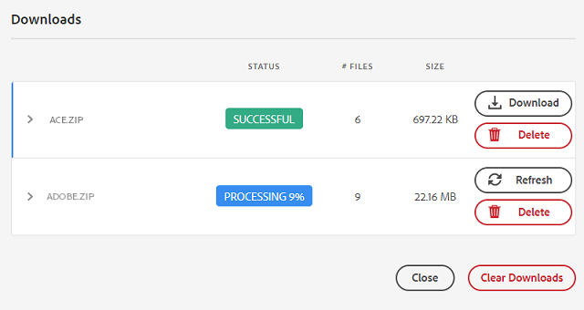

# Compartir y distribuir recursos administrados en [!DNL Experience Manager] {#share-assets-from-aem}

| Versión | Vínculo del artículo |
| -------- | ---------------------------- |
| AEM 6.5 | [Haga clic aquí](https://experienceleague.adobe.com/docs/experience-manager-65/assets/administer/link-sharing.html?lang=es) |
| AEM as a Cloud Service | Este artículo |

[!DNL Adobe Experience Manager Assets] le permite compartir recursos, carpetas y colecciones con miembros de su organización y entidades externas, incluidos socios y proveedores. Utilice los siguientes métodos para compartir recursos de [!DNL Experience Manager Assets] como [!DNL Cloud Service]:

* [Compartir como vínculo](#sharelink).
* [Descargue recursos](/help/assets/download-assets-from-aem.md) y compártalos por separado.
* Compartir usando [[!DNL Experience Manager] aplicación de escritorio](https://experienceleague.adobe.com/docs/experience-manager-desktop-app/using/introduction.html?lang=es).
* Compartir usando [[!DNL Adobe Asset Link]](https://www.adobe.com/es/creativecloud/business/enterprise/adobe-asset-link.html).
* Compartir usando [[!DNL Brand Portal]](https://experienceleague.adobe.com/docs/experience-manager-brand-portal/using/introduction/brand-portal.html?lang=es).

## Requisitos previos {#prerequisites}

Necesita privilegios de administrador para [configurar opciones para compartir recursos como vínculo](#config-link-share-settings).

## Configuración del uso compartido de vínculos {#config-link-share-settings}

[!DNL Experience Manager Assets] le permite establecer la configuración predeterminada del recurso compartido de vínculos.

1. Haga clic en el logotipo de [!DNL Experience Manager] y, a continuación, vaya a **[!UICONTROL Herramientas]** > **[!UICONTROL Assets]** > **[!UICONTROL Configuración de Assets]** > **[!UICONTROL Vínculo compartido]**.
1. Configuración inicial:

   * **Incluir originales:**

      * Seleccione `Select Include Originals` para seleccionar la opción `Include Originals` de forma predeterminada en el cuadro de diálogo de uso compartido de vínculos.
      * Seleccione cómo se le presenta la opción `Include Originals` en el cuadro de diálogo Compartir vínculos. [!UICONTROL Editable] permite al usuario cambiar la configuración definida aquí en la Configuración inicial. Con `Read-only` se muestra la configuración, pero no se puede modificar. `Hidden` oculta la configuración y usa el valor configurado aquí en la configuración inicial.
   * **Incluir representaciones:**
      * Seleccione la opción `Select Include Renditions` para seleccionar la opción `Include Renditions` de forma predeterminada en el cuadro de diálogo de uso compartido de vínculos.
      * Seleccione cómo se le presenta la opción `Include Renditions` en el cuadro de diálogo Compartir vínculos. [!UICONTROL Editable] permite al usuario cambiar la configuración definida aquí en la Configuración inicial. Con `Read-only` se muestra la configuración, pero no se puede modificar. `Hidden` oculta la configuración y usa el valor configurado aquí en la configuración inicial.

1. Especifique el período de validez predeterminado para el vínculo en el campo `Validity Period` de la sección `Expiration date`.

1. Botón **[!UICONTROL Compartir vínculo]** en la barra de acciones:
   * Todos los usuarios con permisos para `jcr:modifyAccessControl` pueden ver la opción [!UICONTROL Compartir vínculos]. De forma predeterminada, está visible para todos los administradores. El botón [!UICONTROL Vínculo compartido] es visible para todos de forma predeterminada. Puede configurar para que muestre esta opción solo para los grupos definidos o también puede denegar esta opción a grupos específicos. Seleccione `Allow only for groups` si desea permitir que grupos específicos vean la opción `Share Link`. Seleccione `Deny from groups` para denegar la opción `Share Link` a grupos específicos. Una vez que seleccione cualquiera de estas opciones, especifique los nombres de grupo con el campo `Select Groups` para agregar los nombres de grupo que necesita permitir o denegar.

Para ver las opciones relacionadas con la configuración de correo electrónico, visite [Documentación del servicio de correo electrónico](https://experienceleague.adobe.com/docs/experience-manager-learn/cloud-service/networking/examples/email-service.html?lang=es)


## Compartir recursos como un vínculo {#sharelink}

Compartir recursos a través de un vínculo es una manera cómoda de poner los recursos a disposición de terceros externos, especialistas en marketing y otros usuarios de [!DNL Experience Manager]. La funcionalidad permite a los usuarios anónimos acceder y descargar los recursos compartidos con ellos. Al descargar recursos desde un vínculo compartido, [!DNL Experience Manager Assets] utiliza un servicio asincrónico que ofrece una descarga más rápida e ininterrumpida. Los recursos que se van a descargar se colocan en segundo plano en archivos ZIP de un tamaño de archivo manejable. Para las descargas grandes, la descarga está agrupada en varios archivos de 100 GB por tamaño de archivo.

<!--
Users with administrator privileges or with read permissions at `/var/dam/share` location are able to view the links shared with them. 
-->

>[!NOTE]
>
>* Necesita el permiso Editar ACL en la carpeta o el recurso que desea compartir como vínculo.
>* [Habilite los correos electrónicos salientes](/help/implementing/developing/introduction/development-guidelines.md#sending-email) antes de compartir un vínculo con los usuarios.

Existen dos formas de compartir los recursos mediante la funcionalidad de uso compartido de vínculos:

1. Genere un vínculo compartido, [copie y comparta el vínculo del recurso](#copy-and-share-assets-link) con otros usuarios.
1. Genere un vínculo compartido y [comparta el vínculo del recurso por correo electrónico](#share-assets-link-through-email). Puede modificar los valores predeterminados, como la fecha y la hora de caducidad, y permitir la descarga de los recursos originales y sus representaciones. Puede enviar correos electrónicos a varios usuarios añadiendo sus direcciones de correo electrónico.

   

En ambos casos, puede modificar los valores predeterminados, como la fecha y la hora de caducidad, y permitir la descarga de los recursos originales y sus representaciones.

### Copiar y compartir el vínculo del recurso{#copy-and-share-asset-link}

Para compartir recursos como una URL pública:

1. Inicie sesión en [!DNL Experience Manager Assets] y vaya a **[!UICONTROL Archivos]**.
1. Seleccione los recursos o la carpeta que contienen los recursos. En la barra de herramientas, haga clic en **[!UICONTROL Compartir vínculo]**.
1. Aparecerá el cuadro de diálogo **[!UICONTROL Vínculo compartido]** que contiene un vínculo de recurso generado automáticamente en el campo **[!UICONTROL Compartir vínculo]**.
1. Establezca la fecha de caducidad del vínculo compartido según sea necesario.
1. En **[!UICONTROL Configuración del vínculo]**, marque o desmarque `Include Originals` o `Include Renditions` para incluir o excluir cualquiera de los dos. Es obligatorio elegir al menos una opción.
1. Los nombres de los Assets seleccionados aparecen en la columna derecha del cuadro de diálogo [!DNL Share Link].
1. Copie el vínculo del recurso y compártalo con los usuarios.

### Compartir vínculo de recurso mediante notificación por correo electrónico {#share-assets-link-through-email}

Para compartir recursos por correo electrónico:

1. Seleccione los recursos o la carpeta que contienen los recursos. En la barra de herramientas, haga clic en **[!UICONTROL Compartir vínculo]**.
1. Aparecerá el cuadro de diálogo **[!UICONTROL Vínculo compartido]** que contiene un vínculo de recurso generado automáticamente en el campo **[!UICONTROL Compartir vínculo]**.

   * En el cuadro Dirección de correo electrónico, escriba la dirección de correo electrónico del usuario con el que desea compartir el vínculo. Puede compartir el vínculo con varios usuarios. Si el usuario es miembro de su organización, seleccione su dirección de correo electrónico de entre las sugerencias que aparecen en la lista desplegable. En el campo de texto de la dirección de correo electrónico, escriba la dirección de correo electrónico del usuario con el que desea compartir el vínculo y haga clic en [!UICONTROL Escribir]. Puede compartir el vínculo con varios usuarios.

   * En el cuadro **[!UICONTROL Asunto]**, escriba un asunto para especificar el propósito de los recursos compartidos.
   * En el cuadro **[!UICONTROL Mensaje]**, escriba un mensaje si es necesario.
   * En el campo **[!UICONTROL Caducidad]**, use el selector de fechas para especificar la fecha y hora de caducidad del vínculo.
   * Habilite la casilla de verificación **[!UICONTROL Permitir la descarga del archivo original]** para permitir que los destinatarios descarguen la representación original.

1. Haga clic en **[!UICONTROL Compartir]**. Un mensaje confirma que el vínculo se comparte con los usuarios. Los usuarios reciben un correo electrónico con el vínculo compartido.

   

### Personalizar plantilla de correo electrónico {#customize-email-template}

Una plantilla bien diseñada transmite profesionalidad y competencia, mejorando la credibilidad de su mensaje y su organización. El [!DNL Adobe Experience Manager] le permite personalizar la plantilla de correo electrónico, que se envía a los destinatarios que reciben el correo electrónico que contiene el vínculo compartido. Además, las plantillas de correo electrónico personalizadas permiten personalizar el contenido del correo electrónico al dirigirse a los destinatarios con un nombre y hacer referencia a detalles específicos relevantes para ellos. Este contacto personal puede hacer que el destinatario se sienta valorado y aumentar la participación. Además, una plantilla personalizada garantiza que los correos electrónicos sean coherentes con la identidad de su marca, incluidos los logotipos, los colores y las fuentes. La coherencia refuerza el reconocimiento de la marca y la confianza entre los destinatarios.

#### Formato de una plantilla de correo electrónico personalizada {#format-of-custom-email-template}

La plantilla de correo electrónico se puede personalizar con texto sin formato o HTML. El vínculo de plantilla editable predeterminado se encuentra en `/libs/settings/dam/adhocassetshare/en.txt`. Puede anular la plantilla creando el archivo `/apps/settings/dam/adhocassetshare/en.txt`. Puede modificar la plantilla de correo electrónico tantas veces como sea necesario.

| Marcadores de posición | Descripción |
|---|-----|
| `${emailSubject}` | Asunto de un correo electrónico |
| `${emailInitiator}` | ID de correo electrónico del usuario que creó el correo electrónico |
| `${emailMessage}` | Cuerpo del correo electrónico |
| `${pagePath}` | URL del vínculo compartido |
| `${linkExpiry}` | Fecha de caducidad del vínculo compartido |

<!--| `${host.prefix}` | Origin of the [!DNL Experience Manager] instance, for example `http://www.adobe.com"` |-->

#### Ejemplo de plantilla de correo electrónico personalizada {#custom-email-template-example}

```
subject: ${emailSubject}

<!DOCTYPE html>
<html><body>
<p><strong>${emailInitiator}</strong> invited you to review assets.</p>
<p>${emailMessage}</p>
<p>The shared link will be available until ${linkExpiry}.
<p>
    <a href="${pagePath}" target="_blank"><strong>Open</strong></a>
</p>

</body></html>
```

<!--Sent from instance: ${host.prefix}-->

### Descarga de recursos mediante el vínculo de recursos {#download-assets-using-asset-link}

Cualquier usuario que tenga acceso al vínculo de recursos compartidos puede descargar los recursos agrupados en una carpeta zip. El proceso de descarga es el mismo, tanto si un usuario accede al vínculo de recurso copiado como si utiliza el vínculo de recurso compartido a través del correo electrónico.

* Haga clic en el vínculo del recurso o pegue la dirección URL en el explorador. Se abre la interfaz de [!UICONTROL Vínculo compartido], en la que puede cambiar a [!UICONTROL Vista de tarjeta] o a [!UICONTROL Vista de lista].

* En la [!UICONTROL vista de tarjeta], puede pasar el ratón sobre el recurso compartido o la carpeta de recursos compartidos para seleccionarlos o colocarlos en la cola de descarga.

* De forma predeterminada, la interfaz de usuario muestra la opción **[!UICONTROL Descargar bandeja de entrada]**. Refleja la lista de todos los recursos o carpetas compartidos que se ponen en cola para su descarga junto con su estado.

* Al seleccionar los recursos o la carpeta, aparece la opción **[!UICONTROL Descarga de cola]** en la pantalla. Haga clic en la opción **[!UICONTROL Descarga de cola]** para iniciar el proceso de descarga.

  

* Mientras se prepara el archivo de descarga, haga clic en la opción **[!UICONTROL Descargar bandeja de entrada]** para ver el estado de la descarga. Para las descargas grandes, haz clic en el botón **[!UICONTROL Actualizar]** para actualizar el estado.

  

* Una vez completado el procesamiento, haga clic en el botón **[!UICONTROL Descargar]** para descargar el archivo zip.

<!--
You can also copy the auto-generated link and share it with the users. The default expiration time for the link is one day.
-->

>[!NOTE]
>
>Si un recurso compartido se mueve a una ubicación diferente, su vínculo deja de funcionar. Vuelva a crear el vínculo y vuelva a compartirlo con los usuarios.


<!--
## Share assets as a link {#sharelink}

To generate the URL for assets you want to share with users, use the Link Sharing dialog. Users with administrator privileges or with read permissions at `/var/dam/share` location are able to view the links shared with them. Sharing assets through a link is a convenient way of making resources available to external parties without them having to first log in to Experience Manager Assets.

>[!NOTE]
>
>* You need Edit ACL permission on the folder or the asset that you want to share as a link.
>* Before you share a link with users, ensure that Day CQ Mail Service is configured. Otherwise, an error occurs.

1. In the Assets user interface, select the asset to share as a link.
1. From the toolbar, click/tap the **[!UICONTROL Share Link]**.

   An asset link is auto-created in the **[!UICONTROL Share Link]** field. Copy this link and share it with the users. The default expiration time for the link is one day.

   Alternatively, proceed to perform steps 3-7 of this procedure to add email recipients, configure the expiration time for the link, and send it from the dialog.

   >[!NOTE]
   >
   >If a shared asset is moved to a different location, its link stops working. Re-create the link and re-share with the users.

1. From the web console, open the **[!UICONTROL Day CQ Link Externalizer]** configuration and modify the following properties in the **[!UICONTROL Domains]** field with the values mentioned against each:

    * local
    * author
    * publish

   For the local and author properties, provide the URL for the local and author instance respectively. Both local and author properties have the same value if you run a single Experience Manager author instance. For publish, provide the URL for the publish instance.

1. In the email address box of the **[!UICONTROL Link Sharing]** dialog, type the email ID of the user you want to share the link with. You can also share the link with multiple users.

   If the user is a member of your organization, select the user's email ID from the suggested email IDs that appear in the list below the typing area. For an external user, type the complete email ID and then select it from the list.

   To enable emails to be sent out to users, configure the SMTP server details in [Day CQ Mail Service](/help/assets/configure-asset-sharing.md#configmailservice).

   >[!NOTE]
   >
   >If you enter an email ID of a user that is not a member of your organization, the words "External User" are prefixed with the email ID of the user.

1. In the **[!UICONTROL Subject]** box, enter a subject for the asset you want to share.
1. In the **[!UICONTROL Message]** box, enter an optional message.
1. In the **[!UICONTROL Expiration]** field, specify an expiration date and time for the link using the date picker. By default, the expiration date is set for a week from the date you share the link.
1. To let users download the original image along with the renditions, select **[!UICONTROL Allow download of original file]**.

   >[!NOTE]
   >
   >By default, users can only download the renditions of the asset that you share as a link.

1. Click **[!UICONTROL Share]**. A message confirms that the link is shared with the users through an email.
1. To view the shared asset, click/tap the link in the email that is sent to the user. The shared asset is displayed in the **[!UICONTROL Adobe Marketing Cloud]** page.

   To toggle to the list view, click/tap the layout icon in the toolbar.

1. To generate a preview of the asset, click/tap the shared asset. To close the preview and return to the **[!UICONTROL Marketing Cloud]** page, click/tap **[!UICONTROL Back]** in the toolbar. If you have shared a folder, click/tap **[!UICONTROL Parent Folder]** to return to the parent folder.

   >[!NOTE]
   >
   >Experience Manager supports generating the preview of assets of these MIME types: JPG, PNG, GIF, BMP, INDD, PDF, and PPT. You can only download the assets of the other MIME types.

1. To download the shared asset, click/tap **[!UICONTROL Select]** from the toolbar, click/tap the asset, and then click/tap **[!UICONTROL Download]** from the toolbar.
1. To view the assets you shared as links, go to the Assets user interface and click/tap the GlobalNav icon. Choose **[!UICONTROL Navigation]** from the list to display the Navigation pane.
1. From the Navigation pane, choose **[!UICONTROL Shared Links]** to display a list of shared assets.
1. To un-share an asset, select it and tap/click **[!UICONTROL Unshare]** from the toolbar.

A message confirms that you unshared the asset. In addition, the entry for the asset is removed from the list.
-->

## Descargar recursos y compartirlos por separado {#download-and-share-assets}

Los usuarios pueden descargar los recursos necesarios y compartirlos fuera de [!DNL Experience Manager]. Para obtener más información, consulte [cómo buscar recursos](/help/assets/search-assets.md), [cómo descargar recursos](/help/assets/download-assets-from-aem.md) y [cómo descargar colecciones](manage-collections.md#download-a-collection)

## Comparta recursos con profesionales creativos {#share-with-creatives}

Los especialistas en marketing y los usuarios de la línea de negocios pueden compartir fácilmente recursos aprobados con sus profesionales creativos mediante,

* **Aplicación de escritorio de Experience Manager**: La aplicación funciona en Windows y Mac. Ver [descripción general de la aplicación de escritorio](https://experienceleague.adobe.com/docs/experience-manager-desktop-app/using/introduction.html?lang=es). Para saber cómo cualquier usuario de escritorio autorizado puede acceder fácilmente a los recursos compartidos, consulte [examinar, buscar y previsualizar recursos](https://experienceleague.adobe.com/docs/experience-manager-desktop-app/using/using.html?lang=es#browse-search-preview-assets). Los usuarios de escritorio pueden crear recursos y volver a compartirlos con sus homólogos que sean usuarios de Experience Manager, por ejemplo, cargando nuevas imágenes. Ver [cargar recursos mediante una aplicación de escritorio](https://experienceleague.adobe.com/docs/experience-manager-desktop-app/using/using.html?lang=es#upload-and-add-new-assets-to-aem).

* **Adobe Asset Link**: Los profesionales creativos pueden buscar y utilizar recursos directamente desde [!DNL Adobe InDesign], [!DNL Adobe Illustrator] y [!DNL Adobe Photoshop].

## Configurar el uso compartido de recursos {#configure-sharing}

Las distintas opciones para compartir los recursos requieren una configuración específica y tienen requisitos previos específicos.

### Configurar el uso compartido de vínculos de recursos {#asset-link-sharing}

<!-- TBD: Web Console is not there so how to configure Day CQ email service? Or is it not required now? -->

Para generar la dirección URL de los recursos que desea compartir con los usuarios, utilice el cuadro de diálogo Uso compartido de vínculos. Los usuarios con privilegios de administrador o con permisos de lectura en la ubicación `/var/dam/share` pueden ver los vínculos compartidos con ellos. Compartir recursos a través de un vínculo es una manera cómoda de poner los recursos a disposición de terceros externos sin que tengan que iniciar sesión primero en [!DNL Assets].

>[!NOTE]
>
>Si desea compartir vínculos de la instancia de autor a entidades externas, asegúrese de exponer solo las siguientes direcciones URL para `GET` solicitudes. Bloquee otras direcciones URL para asegurarse de que la instancia de autor sea segura.
>
>* `[aem_server]:[port]/linkshare.html`
>* `[aem_server]:[port]/linksharepreview.html`
>* `[aem_server]:[port]/linkexpired.html`

<!--
1. From the list of services, locate **[!UICONTROL Day CQ Mail Service]**.
1. Click the **[!UICONTROL Edit]** icon beside the service, and configure the following parameters for **Day CQ Mail Service** with the details mentioned against their names:

    * SMTP server host name: email server host name
    * SMTP server port: email server port
    * SMTP user: email server user name
    * SMTP password: email server password
-->

<!-- TBD: Commenting as Web Console is not available. Document the appropriate OSGi config method if available in CS.
### Configure maximum data size {#maxdatasize}

When you download assets from the link shared using the Link Sharing feature, Experience Manager compresses the asset hierarchy from the repository and then returns the asset in a ZIP file. However, in the absence of limits to the amount of data that can be compressed in a ZIP file, huge amounts of data is subjected to compression, which causes out of memory errors in JVM. To secure the system from a potential denial of service attack due to this situation, you can configure the maximum size of the downloaded files. If uncompressed size of the asset exceeds the configured value, asset download requests are rejected. The default value is 100 MB.

1. Click/Tap the Experience Manager logo and then go to **[!UICONTROL Tools]** &gt; **[!UICONTROL Operations]** &gt; **[!UICONTROL Web Console]**.
1. From the web console, locate the **[!UICONTROL Day CQ DAM Adhoc Asset Share Proxy Servlet]** configuration.
1. Open the configuration in edit mode, and modify the value of the **[!UICONTROL Max Content Size (uncompressed)]** parameter.
1. Save the changes.
-->

<!--
Add content or link about how to configure sharing via BP, DA, AAL, etc.
-->

### Habilitar las acciones de escritorio para usarlas con la aplicación de escritorio {#desktop-actions}

Desde la interfaz de usuario de [!DNL Assets] en un explorador, puede explorar las ubicaciones de los recursos o retirarlos y abrirlos para editarlos en la aplicación de escritorio. Estas opciones se denominan acciones de escritorio y, para habilitarlas, consulte [habilitar acciones de escritorio en [!DNL Assets] interfaz web](https://experienceleague.adobe.com/docs/experience-manager-desktop-app/using/using.html?lang=es#desktopactions-v2).


### Configuraciones para usar [!DNL Adobe Asset Link] {#configure-asset-link}

Adobe Asset Link optimiza la colaboración entre creativos y especialistas en marketing en el proceso de creación de contenido. Conecta [!DNL Adobe Experience Manager Assets] con [!DNL Creative Cloud] aplicaciones de escritorio, [!DNL Adobe InDesign], [!DNL Adobe Photoshop] y [!DNL Adobe Illustrator]. El panel [!DNL Adobe Asset Link] permite a los creativos acceder al contenido almacenado en [!DNL Assets] y modificarlo sin salir de las aplicaciones creativas con las que están más familiarizados.

Ver [cómo configurar [!DNL Assets] para utilizarlo con [!DNL Adobe Asset Link]](https://helpx.adobe.com/es/enterprise/using/configure-aem-assets-for-asset-link.html).

## Prácticas recomendadas y solución de problemas {#bestpractices}

* Es posible que las carpetas de recursos o las colecciones que contienen un espacio en blanco en su nombre no se compartan.
* Si los usuarios no pueden descargar los recursos compartidos, consulte con el administrador de Experience Manager cuáles son los límites de descarga. El valor predeterminado es 100 MB.
* Para que un usuario obtenga una vista previa de un vídeo compartido mediante el uso compartido de vínculos, el vídeo debe tener una representación de vídeo estática disponible en la ubicación `/jcr:content/renditions` en el nodo del vídeo en el repositorio. La vista previa no depende de la disponibilidad de una representación de [!DNL Dynamic Media].
* Al descargar un recurso de vídeo mediante el uso compartido de vínculos, las representaciones de [!DNL Dynamic Media] no se incluyen en el archivo descargado.

<!--
* If you cannot send email with links to shared assets or if the other users cannot receive your email, check with your Experience Manager administrator if the [email service](/help/assets/configure-asset-sharing.md#configmailservice) is configured or not. 
* If you cannot share assets using link sharing functionality, ensure that you have the appropriate permissions. See [share assets](#sharelink).
-->

<!-- TBD: Add content or link about how to share using Brand Portal when it is available on [!DNL Cloud Service].
-->

**Consulte también**

* [Traducir recursos](translate-assets.md)
* [API HTTP de recursos](mac-api-assets.md)
* [Formatos de archivo compatibles con recursos](file-format-support.md)
* [Buscar recursos](search-assets.md)
* [Recursos de red](use-assets-across-connected-assets-instances.md)
* [Informes de recurso](asset-reports.md)
* [Esquemas de metadatos](metadata-schemas.md)
* [Descarga de recursos](download-assets-from-aem.md)
* [Administración de metadatos](manage-metadata.md)
* [Facetas de búsqueda](search-facets.md)
* [Administrar colecciones](manage-collections.md)
* [Importación masiva de metadatos](metadata-import-export.md)
* [Publicación de recursos en AEM y Dynamic Media](/help/assets/publish-assets-to-aem-and-dm.md)

