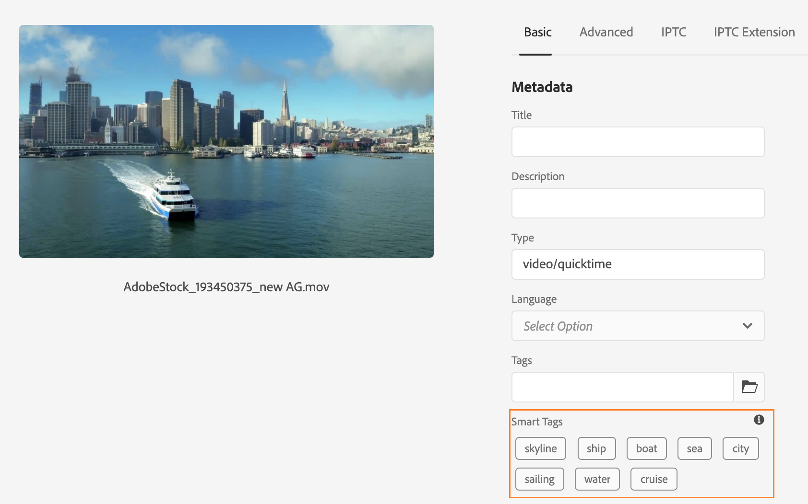

# Etiquetado inteligente de activos de vídeo {#video-smart-tags}

La creciente necesidad de nuevo contenido requiere menos esfuerzos manuales para ofrecer experiencias digitales atractivas en poco tiempo. [!DNL Adobe Experience Manager] as a [!DNL Cloud Service] admite el etiquetado automático de recursos de vídeo mediante inteligencia artificial. Etiquetar los vídeos manualmente puede llevar mucho tiempo. Sin embargo, [!DNL Adobe Sensei] la función de etiquetado inteligente de vídeo utiliza modelos de inteligencia artificial para analizar el contenido de vídeo y añadir etiquetas a los recursos de vídeo. Esto reduce el tiempo para que los usuarios de DAM entreguen experiencias enriquecidas a sus clientes. El servicio de aprendizaje automático de Adobe genera dos conjuntos de etiquetas para un vídeo. Mientras que un conjunto corresponde a objetos, escenas y atributos de ese vídeo; el otro conjunto se relaciona con acciones como beber, correr y trotar.

El etiquetado de vídeos está activado de forma predeterminada en [!DNL Adobe Experience Manager] as a [!DNL Cloud Service]. Sin embargo, puede [exclusión del etiquetado inteligente de vídeo](#opt-out-video-smart-tagging) en una carpeta. Los vídeos se etiquetan automáticamente al cargar vídeos nuevos o volver a procesar los existentes. [!DNL Experience Manager] también crea las miniaturas y extrae los metadatos de los archivos de vídeo. Las etiquetas inteligentes se muestran en orden descendente de su [puntuación de confianza](#confidence-score-video-tag) en recurso [!UICONTROL Propiedades].

## Etiquetado inteligente de vídeos al cargar {#smart-tag-assets-on-ingestion}

Cuando usted [cargar recursos de vídeo](add-assets.md#upload-assets) hasta [!DNL Adobe Experience Manager] as a [!DNL Cloud Service], los vídeos se procesan. Una vez completado el procesamiento, consulte la [!UICONTROL Básico] pestaña de recurso [!UICONTROL Propiedades] página. Las etiquetas inteligentes se añaden automáticamente al vídeo en [!UICONTROL Etiquetas inteligentes]. Los microservicios de recursos aprovechan [!DNL Adobe Sensei] para crear estas etiquetas inteligentes.



Las etiquetas inteligentes aplicadas se ordenan en orden descendente de [puntuación de confianza](#confidence-score-video-tag), combinado para etiquetas de objeto y acción, en [!UICONTROL Etiquetas inteligentes].

>[!IMPORTANT]
>
>Se recomienda revisar estas etiquetas generadas automáticamente para asegurarse de que se ajustan a su marca y a sus valores.

## Etiquetado inteligente de vídeos existentes en DAM {#smart-tag-existing-videos}

Los recursos de vídeo ya existentes en DAM no se etiquetan automáticamente de forma inteligente. Tienes que hacerlo [!UICONTROL Volver a procesar recursos] manualmente para generar etiquetas inteligentes para ellos.

Para etiquetar recursos de vídeo o carpetas (incluidas las subcarpetas) de recursos que ya existen en el repositorio de recursos, siga estos pasos:

1. Seleccione el [!DNL Adobe Experience Manager] y, a continuación, seleccione los recursos en la [!UICONTROL Navegación] página.

1. Seleccionar [!UICONTROL Archivos] para mostrar la interfaz de Assets.

1. Desplácese hasta la carpeta a la que desee aplicar las etiquetas inteligentes.

1. Seleccione la carpeta completa o los recursos de vídeo específicos.

1. Seleccionar  [!UICONTROL Volver a procesar recursos] y seleccione el icono [!UICONTROL Proceso completo] opción.

<!-- TBD: Limit size -->


Una vez completado el proceso, vaya a [!UICONTROL Propiedades] de cualquier recurso de vídeo de la carpeta. Las etiquetas añadidas automáticamente se ven en [!UICONTROL Etiquetas inteligentes] sección en [!UICONTROL Básico] pestaña. Estas etiquetas inteligentes aplicadas se ordenan en orden descendente de [puntuación de confianza](#confidence-score-video-tag).

## Buscar vídeos etiquetados {#search-smart-tagged-videos}

Para buscar los recursos de vídeo basados en las etiquetas inteligentes generadas automáticamente, utilice [Omnisearch](search-assets.md#search-assets-in-aem):

1. Seleccione el icono de búsqueda  para mostrar el campo Omnisearch.

1. Especifique una etiqueta, en el campo Omnisearch, que no haya añadido explícitamente a un vídeo.

1. Busque en función de la etiqueta.

Los resultados de la búsqueda muestran los recursos de vídeo en función de la etiqueta especificada.

Los resultados de la búsqueda son una combinación de recursos de vídeo con palabras clave buscadas en los metadatos y los recursos de vídeo que están etiquetados de forma inteligente con las palabras clave buscadas. Sin embargo, los resultados de búsqueda que coinciden con todos los términos de búsqueda en los campos de metadatos se muestran primero, seguidos de los resultados de búsqueda que coinciden con cualquiera de los términos de búsqueda de las etiquetas inteligentes. Para obtener más información, consulte [Comprender [!DNL Experience Manager] resultados de búsqueda con etiquetas inteligentes](smart-tags.md#understand-search).

## Moderar etiquetas inteligentes de vídeo {#moderate-video-smart-tags}

[!DNL Adobe Experience Manager] permite depurar las etiquetas inteligentes para lo siguiente:

* elimine las etiquetas inexactas asignadas a los vídeos de marca.

* refine las búsquedas de vídeos basadas en etiquetas asegurándose de que el vídeo aparezca en los resultados de búsqueda de las etiquetas más relevantes. Por lo tanto, elimina las posibilidades de que los vídeos no relacionados se muestren en los resultados de búsqueda.

* asigne una clasificación más alta a una etiqueta para aumentar su relevancia con respecto a un vídeo. La promoción de una etiqueta para un vídeo aumenta las posibilidades de que el vídeo aparezca en los resultados de búsqueda cuando se realiza una búsqueda basada en esa etiqueta.

Para obtener más información sobre cómo moderar las etiquetas inteligentes de los recursos, consulte [Administración de etiquetas inteligentes](smart-tags.md#manage-smart-tags-and-searches).


>[!NOTE]
>
>Cualquier etiqueta moderada mediante los pasos indicados en [Administración de etiquetas inteligentes](smart-tags.md#manage-smart-tags-and-searches) no se recuerdan en el reprocesamiento del recurso. El conjunto original de etiquetas se muestra de nuevo.

## Excluirse del etiquetado inteligente de vídeo {#opt-out-video-smart-tagging}

Como el etiquetado automatizado de vídeos se ejecuta en paralelo a otras tareas de procesamiento de recursos como la creación de miniaturas y la extracción de metadatos, puede llevar mucho tiempo. Para acelerar el procesamiento de recursos, puede excluirse del etiquetado inteligente de vídeo al cargar a nivel de carpeta.

Para desactivar la generación automatizada de etiquetas inteligentes de vídeo para los recursos cargados en una carpeta específica:

1. Abrir [!UICONTROL Procesamiento de recursos] pestaña en la carpeta [!UICONTROL Propiedades].

1. Entrada [!UICONTROL Etiquetas inteligentes para vídeos] menú, [!UICONTROL Heredado] está seleccionada de forma predeterminada y la etiqueta inteligente de vídeo está activada.

   Si la variable [!UICONTROL Heredado] está seleccionada, la ruta de la carpeta heredada también está visible junto con la información sobre si está configurada en [!UICONTROL Activar] o [!UICONTROL Deshabilitar].

   

1. Seleccionar [!UICONTROL Deshabilitar] para desactivar el etiquetado inteligente de vídeos cargados en la carpeta.

>[!IMPORTANT]
>
>Si ha excluido el etiquetado de vídeos en una carpeta en el momento de la carga y desea etiquetar de forma inteligente los vídeos después de la carga, **[!UICONTROL Habilitar etiquetas inteligentes para vídeos]** de [!UICONTROL Procesamiento de recursos] de la carpeta [!UICONTROL Propiedades] y utilice [[!UICONTROL Volver a procesar recurso] opción](#smart-tag-existing-videos) para agregar etiquetas inteligentes al vídeo.

## Puntuación de confianza {#confidence-score-video-tag}

[!DNL Adobe Experience Manager] aplica un umbral de confianza mínimo para las etiquetas inteligentes de objetos y acciones a fin de evitar tener demasiadas etiquetas para cada recurso de vídeo, lo que ralentiza la indexación. Los resultados de la búsqueda de recursos se clasifican según las puntuaciones de confianza, que generalmente mejoran los resultados de búsqueda más allá de lo que sugiere una inspección de las etiquetas asignadas de cualquier recurso de vídeo. Las etiquetas inexactas suelen tener puntuaciones de confianza bajas, por lo que rara vez aparecen en la parte superior de la lista de etiquetas inteligentes de los recursos.

El umbral predeterminado para las etiquetas de acción y objeto en [!DNL Adobe Experience Manager] es 0,7 (debe ser un valor entre 0 y 1). Si algunos recursos de vídeo no están etiquetados con una etiqueta específica, significa que el algoritmo tiene menos del 70 % de confianza en las etiquetas previstas. Es posible que el umbral predeterminado no siempre sea óptimo para todos los usuarios. Por lo tanto, puede cambiar el valor de puntuación de confianza en la configuración de OSGI.

Para añadir la configuración OSGI de puntuación de confianza al proyecto implementado en, haga lo siguiente [!DNL Adobe Experience Manager] as a [!DNL Cloud Service] mediante [!DNL Cloud Manager]:

* En el [!DNL Adobe Experience Manager] proyecto (`ui.config` desde tipo de archivo 24 o anteriormente `ui.apps`) el `config.author` Configuración OSGi, incluya un archivo de configuración denominado `com.adobe.cq.assetcompute.impl.senseisdk.SenseiSdkImpl.cfg.json` con los siguientes contenidos:

```json
{
  "minVideoActionConfidenceScore":0.5,
  "minVideoObjectConfidenceScore":0.5,
}
```

>[!NOTE]
>
>Las etiquetas manuales tienen asignada una confianza del 100 % (confianza máxima). Por lo tanto, si hay recursos de vídeo con etiquetas manuales que coinciden con la consulta de búsqueda, se muestran antes que las etiquetas inteligentes que coinciden con la consulta de búsqueda.

## Restricciones {#video-smart-tagging-limitations}

* No se puede entrenar el servicio que aplica etiquetas inteligentes a los vídeos que utilizan vídeos específicos. Funciona con predeterminado [!DNL Adobe Sensei] configuración.

* No se muestra el progreso del etiquetado.

* Solo los vídeos con un tamaño de archivo inferior a 300 MB se etiquetan automáticamente. El [!DNL Adobe Sensei] El servicio omite los archivos de vídeo de mayor tamaño.

* Solo los vídeos en los formatos de archivo y los códecs compatibles mencionados en [Etiquetas inteligentes](/help/assets/smart-tags.md#smart-tags-supported-file-formats) están etiquetados.

>[!MORELIKETHIS]
>
>* [Administrar etiquetas inteligentes y búsquedas de recursos](smart-tags.md#manage-smart-tags-and-searches)
>* [Capacite el servicio de etiquetas inteligentes y etiquete sus imágenes](smart-tags.md)

