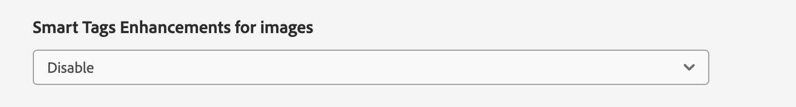

# Etiquetas inteligentes para AEM Assets {#using-smart-tags}

Las organizaciones poseen numerosos activos digitales, y este número sigue creciendo rápidamente. La búsqueda de un activo específico en medio de una cantidad tan grande de datos plantea un desafío significativo. Para solucionarlo, `metadata` y `tags` se emplean para mejorar la capacidad de búsqueda de recursos digitales. Las organizaciones utilizan vocabularios controlados por taxonomía en los metadatos de los recursos. Suelen consistir en listas de palabras clave que los empleados, socios y clientes suelen utilizar para hacer referencia a los recursos digitales y localizarlos.

Las etiquetas inteligentes son palabras clave que no solo aparecen en el texto, sino que también describen mejor el recurso. El etiquetado de recursos con vocabulario controlado por taxonomía garantiza que se puedan identificar y recuperar fácilmente mediante la búsqueda.

Por ejemplo, las palabras ordenadas alfabéticamente en un diccionario son más fáciles de encontrar que las dispersas aleatoriamente. El etiquetado tiene un propósito similar. Organiza los recursos según la taxonomía empresarial, asegurándose de que los más relevantes aparezcan en los resultados de búsqueda. Por ejemplo, un fabricante de automóviles puede etiquetar imágenes de automóviles con nombres de modelos, de modo que solo se muestren imágenes relevantes al diseñar una campaña promocional. Tanto si se etiquetan como &quot;corredores&quot; o &quot;zapatillas de deporte&quot;, los usuarios no tienen que preocuparse por errores tipográficos, variaciones ortográficas o términos de búsqueda alternativos: las etiquetas inteligentes las reconocen todas.

En segundo plano, la funcionalidad utiliza el marco artificial inteligente de [Adobe Sensei](https://business.adobe.com/es/products/sensei/adobe-sensei.html) y aplica automáticamente las etiquetas inteligentes a los recursos cargados (de forma predeterminada), junto con el texto alineado con la taxonomía empresarial.

## Requisitos previos y configuración {#smart-tags-prereqs-config}

Etiquetas inteligentes se aprovisiona automáticamente para [!DNL Adobe Experience Manager] como [!DNL Cloud Service] y, por lo tanto, no se requiere ninguna configuración.

## Flujo de trabajo Etiquetas inteligentes {#smart-tags-workflow}

El etiquetado inteligente con tecnología de [!DNL Adobe Sensei] utiliza modelos de inteligencia artificial para analizar el contenido y agregar etiquetas a los recursos. Esto reduce el tiempo para que los usuarios de DAM entreguen experiencias enriquecidas a sus clientes. Las etiquetas inteligentes se muestran en orden descendente de [puntuación de confianza](#confidence-score) en las propiedades del recurso.

* **Recursos basados en imágenes**
En el caso de las imágenes, las etiquetas inteligentes se basan en algún aspecto visual. Las imágenes en muchos formatos se etiquetan con los servicios de contenido inteligente. Las etiquetas inteligentes se aplican a los [tipos de archivo compatibles](#supported-file-formats) que generan representaciones en formato JPG y PNG.

  <!-- -->

* **Recursos basados en vídeo**
Para los recursos basados en vídeo, el etiquetado está habilitado de forma predeterminada en [!DNL Adobe Experience Manager] como [!DNL Cloud Service]. Del mismo modo que las etiquetas basadas en imagen y texto, los vídeos también se etiquetan automáticamente al cargar vídeos nuevos o volver a procesar los existentes. [!DNL Adobe Sensei] genera dos conjuntos de etiquetas para un vídeo: un conjunto corresponde a objetos, escenas y atributos de ese vídeo, mientras que el otro conjunto se relaciona con acciones como beber, correr y trotar. Compruebe también [exclusión del etiquetado inteligente de vídeos](#opt-out-video-smart-tagging).

* **Recursos basados en texto**
Para los recursos admitidos, [!DNL Experience Manager] ya extrae el texto, que se indiza y se usa para buscar los recursos. Sin embargo, las etiquetas inteligentes basadas en palabras clave en el texto proporcionan una faceta de búsqueda dedicada, estructurada y de mayor prioridad. Esto último ayuda a mejorar la detección de recursos en comparación con un índice de búsqueda.
Para los recursos basados en texto, la eficacia de las etiquetas inteligentes no depende de la cantidad de texto del recurso, sino de las palabras clave o entidades relevantes presentes en el texto del recurso.

  

Las etiquetas inteligentes se implementan en los AEM Assets de mediante el siguiente flujo de trabajo:

1. Cree o cargue un recurso en AEM. Se generan etiquetas listas para usar para Assets basadas en imágenes, vídeos y texto.

1. Si descubre que no se generan etiquetas específicas, puede entrenar las etiquetas de tipo imagen en consecuencia. Consulte [Formación sobre etiquetas inteligentes](#smart-tags-training.md).

## Formatos de archivo compatibles con las etiquetas inteligentes {#supported-file-formats}

| Imágenes (tipos MIME) | Recursos basados en texto (formatos de archivo) | Recursos de vídeo (formatos de archivo y códecs) |
|----|-----|------|
| image/jpeg | CSV | MP4 (H264/AVC) |
| image/tiff | DOC | MKV (H264/AVC) |
| image/png | DOCX | MOV (H264/AVC, Motion JPEG) |
| image/bmp | HTML | AVI (indeo4) |
| image/gif | PDF | FLV (H264/AVC, vp6f) |
| image/pjpeg | PPT | WMV (WMV2) |
| image/x-portable-anymap | PPTX |  |
| image/x-portable-bitmap | RTF |  |
| image/x-portable-graymap | SRT |  |
| image/x-portable-pixmap | TXT |  |
| image/x-rgb | VTT |  |
| image/x-xbitmap | |  |
| image/x-xpixmap | |  |
| image/x-icon |  |  |
| image/photoshop |  |  |
| image/x-photoshop |  |  |
| image/psd |  |  |
| image/vnd.adobe.photoshop |  |  |

## Preparación de un recurso para el etiquetado inteligente predeterminado

Cuando [carga recursos](add-assets.md#upload-assets) en [!DNL Adobe Experience Manager] como un [!DNL Cloud Service], los recursos cargados se procesan. Una vez completado el procesamiento, consulte la pestaña [!UICONTROL Básico] de la página del recurso [!UICONTROL Propiedades]. Las etiquetas inteligentes se agregan automáticamente a los recursos en [!UICONTROL Etiquetas inteligentes]. Los microservicios de recursos utilizan [!DNL Adobe Sensei] para crear estas etiquetas inteligentes.

Se han agregado 

<!--
The applied smart tags are sorted in descending order of [confidence score](#confidence-score), combined for object and action tags, within [!UICONTROL Smart Tags].
-->

>[!IMPORTANT]
>
>Se recomienda revisar estas etiquetas generadas automáticamente para asegurarse de que se ajustan a su marca y a sus valores.

## Assets sin etiquetar en DAM {#smart-tag-existing-assets}

Los recursos existentes o anteriores de DAM no se etiquetan automáticamente de forma inteligente. Debe [volver a procesar](https://experienceleague.adobe.com/docs/experience-manager-cloud-service/content/assets/admin/about-image-video-profiles.html?lang=es#adjusting-load) Assets manualmente para poder generarles etiquetas inteligentes. Una vez completado el proceso, vaya a la página [!UICONTROL Propiedades] de cualquier recurso de la carpeta. Las etiquetas agregadas automáticamente se ven en la sección [!UICONTROL Etiquetas inteligentes] de la pestaña [!UICONTROL Básico]. Estas etiquetas inteligentes aplicadas se ordenan en orden descendente de [puntuación de confianza](#confidence-score).

<!--
To smart tag assets, or folders (including subfolders) of assets that exist in assets repository, follow these steps:

1. Select the [!DNL Adobe Experience Manager] logo and then select assets from the [!UICONTROL Navigation] page.

1. Select [!UICONTROL Files] to display the Assets interface.

1. Navigate to the folder to which you want to apply Smart Tags.

1. Select the assets and click  [!UICONTROL Reprocess Assets] icon and select the [!UICONTROL Full Process] option.

-->

## Puntuación de confianza {#confidence-score}

Los resultados de la búsqueda de recursos se clasifican según las puntuaciones de confianza, que generalmente mejoran los resultados de búsqueda más allá de lo que sugiere una inspección de las etiquetas asignadas de cualquier recurso. Las etiquetas inexactas suelen tener puntuaciones de confianza bajas, por lo que rara vez aparecen en la parte superior de la lista de etiquetas inteligentes de los recursos.
<!--
[!DNL Adobe Experience Manager] as a [!DNL Cloud Service] applies a minimum confidence threshold for object and action-smart tags to avoid having too many tags for each asset, which slows down indexing. 

The default threshold for action and object tags in [!DNL Adobe Experience Manager] for an image is 0.5 and for video it is 0.7 (should be value from 0 through 1). If some assets are not tagged by a specific tag, then it indicates that the algorithm is less than 70% confident in the predicted tags. The default threshold might not always be optimal for all the users. You can, therefore, change the confidence score value in OSGI configuration.

To add the confidence score OSGI configuration to the project deployed to [!DNL Adobe Experience Manager] as a [!DNL Cloud Service] through [!DNL Cloud Manager]:

In the [!DNL Adobe Experience Manager] project (`ui.config` since Archetype 24, or previously `ui.apps`) the `config.author` OSGi configuration, include a config file named `com.adobe.cq.assetcompute.impl.senseisdk.SenseiSdkImpl.cfg.json` with the following contents:

```json
{
  "minVideoActionConfidenceScore":0.5,
  "minVideoObjectConfidenceScore":0.5,
}
```
-->

>[!NOTE]
>
>Las etiquetas manuales tienen asignada una confianza del 100 % (confianza máxima). Por lo tanto, si hay recursos con etiquetas manuales que coinciden con la consulta de búsqueda, se muestran antes que Etiquetas inteligentes que coincidan con la consulta de búsqueda.

## Moderar etiquetas inteligentes {#moderate-smart-tags}

[!DNL Adobe Experience Manager] como [!DNL Cloud Service] le permite depurar las etiquetas inteligentes para:

* elimine las etiquetas inexactas asignadas a los recursos de la marca.

* refina las búsquedas basadas en etiquetas de recursos asegurándose de que el recurso aparezca en los resultados de búsqueda de las etiquetas más relevantes. Por lo tanto, elimina las posibilidades de que los recursos no relacionados se muestren en los resultados de búsqueda.

* asigne una clasificación más alta a una etiqueta para aumentar su relevancia con respecto a un recurso. La promoción de una etiqueta para un recurso aumenta las posibilidades de que el recurso en particular aparezca en los resultados de búsqueda cuando se realiza una búsqueda basada en esa etiqueta.

Para obtener más información sobre cómo moderar las etiquetas inteligentes de los recursos, consulte [Administrar etiquetas inteligentes](smart-tags.md#manage-smart-tags-and-searches).


>[!NOTE]
>
>Las etiquetas que se hayan moderado siguiendo los pasos de [Administrar etiquetas inteligentes](smart-tags.md#manage-smart-tags-and-searches) no se recordarán al volver a procesar el recurso. Los conjuntos originales de etiquetas se muestran de nuevo.

## Administración de etiquetas inteligentes y búsquedas de recursos {#manage-smart-tags-and-searches}

Puede depurar Etiquetas inteligentes para eliminar cualquier etiqueta inexacta que se haya asignado a los recursos de la marca, de modo que solo se muestren las etiquetas más relevantes.

La moderación de las etiquetas inteligentes también ayuda a refinar las búsquedas de recursos basadas en etiquetas, ya que garantiza que los recursos aparezcan en los resultados de búsqueda de las etiquetas más relevantes. Básicamente, ayuda a eliminar las posibilidades de que los recursos no relacionados aparezcan en los resultados de búsqueda.

También puede asignar una clasificación más alta a una etiqueta para aumentar la relevancia de la etiqueta para el recurso. La promoción de una etiqueta para un recurso aumenta las posibilidades de que el recurso aparezca en los resultados de búsqueda cuando se realiza una búsqueda en función de la etiqueta en particular.

Para moderar las etiquetas inteligentes de sus recursos digitales:

1. En el campo de búsqueda, busque recursos digitales basados en una etiqueta.

1. Para identificar los recursos digitales que no encuentre relevantes para la búsqueda, revise los resultados de la búsqueda.

1. Seleccione un recurso y, a continuación, seleccione  en la barra de herramientas.

1. En la página **[!UICONTROL Administrar etiquetas]**, inspeccione las etiquetas. Si no desea buscar el recurso en función de una etiqueta específica, seleccione la etiqueta y seleccione  en la barra de herramientas. También puede seleccionar  junto a la etiqueta.

1. Para asignar una clasificación más alta a una etiqueta, selecciónela y seleccione  en la barra de herramientas. La etiqueta que promociones se moverá a la sección **[!UICONTROL Etiquetas]**.

1. Seleccione **[!UICONTROL Guardar]** y, a continuación, seleccione **[!UICONTROL Aceptar]** para cerrar el cuadro de diálogo [!UICONTROL Éxito].

1. Vaya a la página [!UICONTROL Propiedades] del recurso. Observe que a la etiqueta que ha promocionado se le asigna una alta relevancia y, por lo tanto, aparece más arriba en los resultados de búsqueda.

### Comprender los resultados de búsqueda de [!DNL Experience Manager] con etiquetas inteligentes {#understand-search}

De manera predeterminada, [!DNL Experience Manager] combina los términos de búsqueda con una cláusula `AND` o `OR` para encontrar cualquiera de los términos de búsqueda en las etiquetas inteligentes aplicadas. El uso de etiquetas inteligentes no cambia este comportamiento predeterminado. Por ejemplo, considere buscar `woman running`. Assets con solo `woman` o solo `running` palabra clave en los metadatos no aparece en los resultados de búsqueda de forma predeterminada. Sin embargo, un recurso etiquetado con `woman` o `running` que usa etiquetas inteligentes aparece en dicha consulta de búsqueda. Por lo tanto, los resultados de búsqueda son una combinación de:

* Assets con palabras clave `woman` y `running` en los metadatos.

* Assets Smart etiquetado con cualquiera de las palabras clave.

Los resultados de búsqueda que coinciden con todos los términos de búsqueda en los campos de metadatos se muestran primero, seguidos de los resultados de búsqueda que coinciden con cualquiera de los términos de búsqueda en las etiquetas inteligentes. En el ejemplo anterior, el orden aproximado de visualización de los resultados de búsqueda es:

1. coincide con `woman running` en los distintos campos de metadatos.
1. coincidencias de `woman running` en etiquetas inteligentes.
1. coincide con `woman` o con `running` en las etiquetas inteligentes.

## Excluirse del etiquetado inteligente {#opt-out-smart-tagging}

Como el etiquetado automatizado de recursos se ejecuta en paralelo con otras tareas de procesamiento de recursos, como la creación de miniaturas y la extracción de metadatos, puede llevar mucho tiempo. Para acelerar el procesamiento de los recursos, puede excluirse del etiquetado inteligente al cargar archivos en el nivel de carpeta. Para desactivar la generación automatizada de etiquetas inteligentes para los recursos cargados en una carpeta específica:

1. Abra la pestaña [!UICONTROL Procesamiento de recursos] en la carpeta [!UICONTROL Propiedades].
1. En el menú [!UICONTROL Etiquetas inteligentes para vídeos], por ejemplo, la opción [!UICONTROL Heredado] está seleccionada de forma predeterminada y la etiqueta inteligente de vídeo está habilitada.

   Cuando se selecciona la opción [!UICONTROL Heredado], la ruta de la carpeta heredada también se ve junto con la información de si está configurada en [!UICONTROL Habilitar] o [!UICONTROL Deshabilitar].

   

1. Seleccione [!UICONTROL Deshabilitar] para desactivar el etiquetado inteligente cargado en la carpeta.

1. Del mismo modo, puede excluir el etiquetado inteligente de [!UICONTROL Etiquetas inteligentes para texto], [!UICONTROL Etiquetas inteligentes para imagen] y [!UICONTROL Etiquetas de color para imágenes].

>[!IMPORTANT]
>
>Si ha excluido el etiquetado de una carpeta en el momento de la carga y desea etiquetarla de forma inteligente después de la carga, **[!UICONTROL habilite las etiquetas inteligentes]** desde la pestaña [!UICONTROL Procesamiento de recursos] de la carpeta [!UICONTROL Propiedades] y use la opción [[!UICONTROL Volver a procesar el recurso]](#smart-tag-existing-assets) para agregar etiquetas inteligentes a los recursos.

<!--
## Benefits of Smart Tags to your assets {#benefits-of-smart-tags}

Following are the benefits of using Smart Tags in your AEM Assets:
*  Makes an asset searchable.
*  Smart Tags are generated automatically to your assets, thus, it minimizes your effort to perform tagging manually.
*  It allows the usage of the same vocabulary, tag structure, and taxonomy so that you need not to worry about tagging if by chance you miss tagging at first.
*  Whether you are tagging "runners" or "running" shoes, you do not need to worry about typos, wrong spellings, or alternative search terms as Smart Tags know it already!
*  Helps your assets to become organized and categorized.
-->

## Mejora de la detección de contenido con metadatos generados por IA {#ai-smart-tags}

En lugar de depender de la entrada manual, IA asigna automáticamente etiquetas descriptivas a los recursos digitales. Estas etiquetas generadas por IA mejoran la calidad de los metadatos, lo que facilita la búsqueda, la categorización y la recomendación de recursos. Este enfoque no solo mejora la eficacia al eliminar el etiquetado manual, sino que también garantiza la coherencia y la escalabilidad en grandes volúmenes de contenido digital. Por ejemplo, si el recurso es una imagen, la IA puede identificar objetos, escenas, emociones o incluso logotipos de marca dentro de él y generar etiquetas relevantes como &quot;puesta de sol&quot;, &quot;playa&quot;, &quot;vacaciones&quot; o &quot;sonrisa&quot;. El contenido generado por IA puede mejorar la búsqueda de recursos mediante técnicas de búsqueda semánticas y léxicas. Ver más [Buscar en Assets](search-assets.md). <!--If the asset is a document, AI reads and interprets the text to assign meaningful keywords that summarize its content—such as "climate change," "policy," or "renewable energy.-->


### Cómo habilitar los metadatos generados por IA {#enable-ai-generated-metadata}

Para habilitar los metadatos generados por IA:

* La versión mínima de AEM requerida es `20626`.

* Debes firmar un acuerdo con GenAI Rider. Para obtener más información, póngase en contacto con su representante de Adobe.

### Configuración de títulos generados por IA {#configure-ai-generated-titles}

AEM permite configurar la visualización de los títulos de los recursos en la vista de tarjetas o en la vista de lista de la página de exploración de recursos. Puede elegir mostrar el título del recurso definido por usted, el título generado mediante IA o utilizar un título generado por IA solo si no hay ningún título existente para el recurso.

Para configurar títulos generados por IA:

1. Vaya a **[!UICONTROL Herramientas > Assets > Configuración de Assets > Configuración de mejora de etiquetas inteligentes]**.

1. Seleccione una de las siguientes opciones:

   * **Título de DC de visualización (predeterminado)**: especifique el título en el campo **[!UICONTROL Título]** disponible en las propiedades del recurso para mostrarlo en la vista de tarjeta o en la vista de lista. Si el título del recurso no está definido, AEM Assets muestra el nombre del archivo.

   * **Mostrar título generado por IA**: muestra el título generado por IA e ignora el título especificado en las propiedades del recurso. Si el título generado por IA no está disponible para un recurso, AEM Assets muestra el título de recurso predeterminado disponible en sus propiedades.

   * **Mostrar el título generado por IA solo si el título de DC no existe**: AEM Assets muestra el título generado por IA solo si el título del recurso no está definido para un recurso.

     

### Uso de metadatos generados por IA {#using-ai-generated-smart-tags}

<!--[!NOTE]
>
>The enhanced smart tags capability is available only for the newly uploaded assets.
-->

Para utilizar la función de etiquetas inteligentes mejorada, ejecute los siguientes pasos:

1. En la interfaz [!DNL Experience Manager], vaya a la carpeta deseada y haga clic en **[!UICONTROL Agregar Assets]**. <!--Alternatively, to update enhanced smart tags in an existing content, click **[!UICONTROL reprocess]**.--> Los formatos de archivo de imagen compatibles son `png`, `jpg`, `jpeg`, `psd`, `tiff`, `gif`, `webp`, `crw`, `cr2`, `3fr`, `nef`, `arw` y `bmp`.

1. Espere hasta que se procese el recurso recién cargado. Una vez finalizado, vaya a las propiedades del recurso.

1. Vaya a la pestaña **[!UICONTROL Generado por IA]**. Si la versión de [!DNL Experience Manager] no es compatible o no se ha actualizado, esta pestaña no estará visible. Los campos siguientes están presentes:

   * **[!UICONTROL Título generado]:** El título proporciona un título claro y conciso que captura la idea central de un recurso cargado, lo que facilita su comprensión de un vistazo. Al agregar un recurso, si proporciona un título (en `dc:title`), este se mostrará en la vista del explorador de recursos. Si se deja en blanco, se asignará automáticamente un título generado por IA.
   * **[!UICONTROL Descripción generada]:** La descripción ofrece un resumen breve pero informativo de lo que trata el recurso, lo que ayuda a los usuarios y al módulo de búsqueda a captar rápidamente su relevancia.
   * **[!UICONTROL Palabras clave generadas]:** Las palabras clave son términos de destino que representan los temas principales de un recurso y que ayudan a etiquetar y filtrar el contenido.

1. [Opcional]: puede agregar etiquetas adicionales o crear las suyas propias si cree que faltan etiquetas relevantes. Para ello, escriba sus etiquetas en el campo **[!UICONTROL Palabras clave generadas]** y haga clic en **[!UICONTROL Guardar]**.

### Deshabilitar metadatos generados por IA {#disable-ai-generated-metadata}

Puede deshabilitar los metadatos generados por IA en el nivel de carpeta. Todas las carpetas secundarias heredan las propiedades de la carpeta principal.

Para deshabilitar los metadatos generados por IA en el nivel de carpeta:

1. Vaya a **[!UICONTROL Adobe Experience Manager > Assets > Archivos]**.

1. Seleccione la carpeta y haga clic en **[!UICONTROL Propiedades]**.

1. En la ficha **[!UICONTROL Procesamiento de recursos]**, vaya a la carpeta **[!UICONTROL Mejoras de etiquetas inteligentes para imágenes]**. Seleccione uno de los siguientes valores de la lista desplegable:

   * Heredada: la carpeta hereda las opciones de activación o desactivación de la carpeta principal.

   * Habilitar: habilita los metadatos generados por IA para la carpeta seleccionada.

   * Deshabilitar: deshabilita los metadatos generados por IA para la carpeta seleccionada.

     

## Limitaciones y prácticas recomendadas relacionadas con las etiquetas inteligentes {#limitations-best-practices-smart-tags}

Estos modelos no siempre son perfectos para identificar etiquetas. La versión actual de las etiquetas inteligentes tiene las siguientes limitaciones:

* Incapacidad para reconocer diferencias sutiles en las imágenes. Por ejemplo, camisetas slim fit versus regular fit.
* Incapacidad para identificar etiquetas en función de patrones diminutos o partes de una imagen. Por ejemplo, logotipos en camisas.
* Las etiquetas que no se gestionan están relacionadas con lo siguiente:

   * Aspectos no visuales, abstractos. Por ejemplo, el año o la temporada de lanzamiento de un producto, el estado de ánimo o la emoción evocados por una imagen y una connotación subjetiva de un vídeo.
   * Diferencias visuales finas en productos como camisas con y sin collares o logotipos de productos pequeños incrustados en productos.

* Solo los vídeos con un tamaño de archivo inferior a 300 MB se etiquetan automáticamente. El servicio [!DNL Adobe Sensei] omite los archivos de vídeo de mayor tamaño.
* Para buscar archivos con etiquetas inteligentes (regulares o mejoradas), use la búsqueda [!DNL Assets] (búsqueda de texto completo). No hay ningún predicado de búsqueda independiente para las etiquetas inteligentes.
* En comparación con las etiquetas generales, los recursos etiquetados con taxonomía empresarial son más fáciles de identificar y recuperar mediante búsquedas basadas en etiquetas.

## Preguntas frecuentes{#faq-smart-tags}

+++**¿Cómo mejoran las etiquetas inteligentes la experiencia de búsqueda de un recurso?**

[!DNL Adobe] Sensei etiqueta los recursos automáticamente una vez que los ha cargado. El proceso automatizado se ejecuta tan rápido en el backend que verá las etiquetas agregadas en los recursos después de unos segundos una vez que se complete la carga.

+++

+++**¿Qué sucede si la lista de etiquetas inteligentes es inexacta o muestra una etiqueta no deseada?**

Se puede eliminar una etiqueta inexacta o no deseada de la lista. Por ejemplo, como concesionario de automóviles, es posible que desee eliminar la etiqueta &quot;dañada&quot; de la lista.

+++

+++**¿Cómo puede priorizar los recursos que contienen las mismas etiquetas?**

Sí, puede priorizar los recursos que contengan las mismas etiquetas. Puede promocionar una etiqueta en la lista de etiquetas inteligentes de un recurso para realizar la priorización. La promoción de una etiqueta permite priorizar las imágenes que aparecen en los resultados de búsqueda para esa etiqueta en particular.

+++

+++**¿La aplicación de etiquetas inteligentes está limitada a una carpeta en particular?**

Las etiquetas inteligentes se pueden configurar y aplicar en cualquier carpeta dentro de DAM.

+++

+++**¿Cómo puedo saber que el etiquetado necesita entrenamiento?**

Consulte [Determinación de los requisitos de la formación sobre etiquetas inteligentes](#smart-tags-training.md#smart-tag-training-requirement).

+++

+++**¿Cuáles son los formatos de archivo admitidos para etiquetar un recurso?**

Consulte [Formatos de archivo compatibles](#supported-file-formats).

+++

+++**¿En qué idioma se generan las etiquetas inteligentes?**

Las etiquetas inteligentes se generan solo en inglés. Se pueden traducir a otros idiomas traduciendo todo el recurso, incluidos los metadatos.

+++

+++**Ya no quiero usar el etiquetado inteligente.**

Puede [desactivar el etiquetado inteligente](#opt-out-smart-tagging) siempre que quiera dejar de usarlo.

+++
