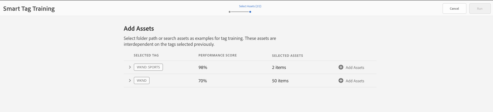

# Agregue etiquetas inteligentes a los recursos y mejore la experiencia de búsqueda {#smart-tag-assets-for-faster-search}

Las organizaciones que se ocupan de los recursos digitales utilizan cada vez más el vocabulario controlado por taxonomía en los metadatos de los recursos. Esencialmente, incluye una lista de palabras clave que los empleados, socios y clientes suelen utilizar para referirse a sus recursos digitales y buscarlos. El etiquetado de recursos con vocabulario controlado por taxonomía garantiza que los recursos se puedan identificar y recuperar fácilmente en las búsquedas.

En comparación con los vocabularios de lenguaje natural, el etiquetado basado en la taxonomía empresarial ayuda a alinear los activos con el negocio de una empresa y garantiza que los activos más relevantes aparezcan en las búsquedas. Por ejemplo, un fabricante de coches puede etiquetar imágenes de coche con nombres de modelo, de modo que solo se muestren imágenes relevantes cuando se realice una búsqueda para diseñar una campaña de promoción.

En segundo plano, la funcionalidad utiliza el marco de trabajo artificialmente inteligente de [Adobe Sensei](https://business.adobe.com/why-adobe/experience-cloud-artificial-intelligence.html) para entrenar su algoritmo de reconocimiento de imágenes en la estructura de etiquetas y la taxonomía empresarial. A continuación, esta inteligencia de contenido se utiliza para aplicar etiquetas relevantes en un conjunto diferente de recursos. [!DNL Experience Manager Assets] de forma predeterminada, aplica etiquetas inteligentes a los recursos cargados.

<!-- TBD: Create a flowchart for how training works in CS.
 
-->

## Tipos de recursos admitidos {#smart-tags-supported-file-formats}

You can tag the following types of assets:

* **Images**: Images in many formats are tagged using the Adobe Sensei&#39;s smart content services. You [crear un modelo de formación](#train-model) y, a continuación, las imágenes cargadas se etiquetan automáticamente. Las etiquetas inteligentes se aplican a los tipos de archivo compatibles que generan representaciones en formato JPG y PNG.
* **Recursos basados en texto**: [!DNL Experience Manager Assets] etiqueta automáticamente los recursos basados en texto compatibles al cargarlos.
* **Recursos de vídeo**: El etiquetado de vídeo está habilitado de forma predeterminada en [!DNL Adobe Experience Manager] como [!DNL Cloud Service]. [Los vídeos están etiquetados automáticamente](/help/assets/smart-tags-video-assets.md) al cargar vídeos nuevos o reprocesar los existentes.

| Imágenes (tipos MIME) | Recursos basados en texto (formatos de archivo) | Recursos de vídeo (formatos de archivo y códecs) |
|----|-----|------|
| image/jpeg | CSV | MP4 (H264/AVC) |
| image/tiff | DOC | MKV (H264/AVC) |
| image/png | DOCX | MOV (H264/AVC, JPEG de movimiento) |
| image/bmp | HTML | AVI (vídeo4) |
| image/gif | PDF | FLV (H264/AVC, vp6f) |
| image/pjpeg | PPT | WMV (WMV2) |
| image/x-portable-anymap | PPTX |  |
| image/x-portable-bitmap | RTF |  |
| image/x-portable-graymap | SRT |  |
| image/x-portable-pixmap | TXT |  |
| image/x-rgb | VTT |  |
| image/x-xbitmap |  |  |
| image/x-xpixmap |  |  |
| image/x-icon |  |  |
| imagen/photoshop |  |  |
| image/x-photoshop |  |  |
| image/psd |  |  |
| image/vnd.adobe.photoshop |  |  |

[!DNL Experience Manager] agrega automáticamente las etiquetas inteligentes a los recursos basados en texto y a los vídeos de forma predeterminada. Para agregar automáticamente etiquetas inteligentes a imágenes, complete las siguientes tareas.

* [Understand tag models and guidelines](#understand-tag-models-guidelines).
* [Capacitar al modelo](#train-model).
* [Etiquetado de recursos digitales](#tag-assets).
* [Administrar las etiquetas y las búsquedas](#manage-smart-tags-and-searches).

## Explicación de los modelos de etiquetas y las directrices {#understand-tag-models-guidelines}

Un modelo de etiqueta es un grupo de etiquetas relacionadas que están asociadas con varios aspectos visuales de las imágenes que se están etiquetando. Las etiquetas están relacionadas con los aspectos visuales de las imágenes, que son claramente diferentes, de modo que, cuando se aplican, las etiquetas ayudan a buscar tipos específicos de imágenes. Por ejemplo, una colección de zapatos puede tener etiquetas diferentes, pero todas las etiquetas están relacionadas con zapatos y pueden pertenecer al mismo modelo de etiquetas. Cuando se aplican, las etiquetas ayudan a encontrar diferentes tipos de zapatos, por ejemplo por diseño o por uso. Para comprender la representación de contenido de un modelo de formación en [!DNL Experience Manager], visualice un modelo de formación como una entidad de nivel superior compuesta por un grupo de etiquetas agregadas manualmente e imágenes de ejemplo para cada etiqueta. Cada etiqueta se puede aplicar exclusivamente a una imagen.

Antes de crear un modelo de etiquetas y entrenar el servicio, identifique un conjunto de etiquetas únicas que describan mejor los objetos de las imágenes en el contexto de su negocio. Asegúrese de que los recursos del conjunto depurado se ajustan a [las directrices de formación](#training-guidelines).

### Directrices de formación {#training-guidelines}

Asegúrese de que las imágenes del conjunto de formación cumplen las siguientes directrices:

**Cantidad y tamaño:** Mínimo de 10 imágenes y máximo 50 imágenes por etiqueta.

**Coherencia**: Asegúrese de que las imágenes de una etiqueta son visualmente similares. Es mejor añadir las etiquetas de los mismos aspectos visuales (como el mismo tipo de objetos en una imagen) juntos en un único modelo de etiqueta. Por ejemplo, no es buena idea etiquetar todas estas imágenes como `my-party` (para formación) porque no son visualmente similares.

**Cobertura**: Debería haber suficiente variedad en las imágenes de la formación. La idea es dar algunos ejemplos, pero razonablemente diversos, para que [!DNL Experience Manager] aprende a centrarse en las cosas correctas. If you&#39;re applying the same tag on visually dissimilar images, include at least five examples of each kind. Por ejemplo, para la etiqueta *modelo-descendente-pose*, incluya más imágenes de formación similares a la imagen resaltada a continuación para que el servicio identifique imágenes similares con mayor precisión durante el etiquetado.

**Distracción/obstrucción**: El servicio forma mejor con imágenes que tienen menos distracción (fondos destacados, acompañamientos no relacionados, como objetos/personas con el tema principal). Por ejemplo, para la etiqueta *zapato casual*, la segunda imagen no es un buen candidato para la formación.

**Complejidad:** Si una imagen cumple los requisitos para más de una etiqueta, agregue todas las etiquetas aplicables antes de incluir la imagen para formación. Por ejemplo, para las etiquetas, como *impermeable* y *vista del lado del modelo*, agregue ambas etiquetas en el recurso que cumple los requisitos antes de incluirlo para formación.

**Número de etiquetas**: Adobe recomienda que prepare un modelo utilizando al menos dos etiquetas diferentes y al menos diez imágenes diferentes para cada etiqueta. En un modelo de etiqueta única, no agregue más de 50 etiquetas.

**Número de ejemplos**: Para cada etiqueta, añada al menos diez ejemplos. Sin embargo, Adobe recomienda unos 30 ejemplos. Se admite un máximo de 50 ejemplos por etiqueta.

**Prevención de falsos positivos y conflictos**: Adobe recomienda crear un modelo de etiqueta única para un aspecto visual único. Organice los modelos de etiquetas de forma que se eviten las etiquetas superpuestas entre los modelos. Por ejemplo, no utilice etiquetas comunes como `sneakers` en dos nombres de modelos de etiquetas diferentes `shoes` y `footwear`. El proceso de formación sobrescribe un modelo de etiquetas entrenado con el otro para una palabra clave común.

**Ejemplos**: Algunos ejemplos más para obtener instrucciones son:

* Cree un modelo de etiqueta que solo incluya:

   * Las etiquetas relacionadas con los modelos de automóvil.
   * Las etiquetas están relacionadas con las chaquetas para adultos y niños.

* No crear,

   * Modelo de etiqueta que incluye modelos de automóvil publicados en 2019 y 2020.
   * Varios modelos de etiquetas que incluyen los mismos modelos de coche.

**Imágenes usadas para entrenar**: Puede usar las mismas imágenes para entrenar diferentes modelos de etiquetas. Sin embargo, no asocie una imagen con más de una etiqueta en un modelo de etiquetas. Es posible etiquetar la misma imagen con etiquetas diferentes que pertenecen a modelos de etiquetas diferentes.

No se puede deshacer la formación. Las directrices anteriores le ayudarán a elegir buenas imágenes para entrenar.

## Capacite el modelo para sus etiquetas personalizadas {#train-model}

Para crear y entrenar un modelo para etiquetas específicas de su empresa, siga estos pasos:

1. Cree las etiquetas necesarias y la estructura de etiquetas adecuada. Cargue las imágenes relevantes en el repositorio DAM.
1. En [!DNL Experience Manager] interfaz de usuario, acceso **[!UICONTROL Recursos]** > **[!UICONTROL Formación de etiquetas inteligentes]**.
1. Haga clic en **[!UICONTROL Crear]**. Proporcione un **[!UICONTROL Título]**, **[!UICONTROL Descripción]**.
1. Click on the folder icon in **[!UICONTROL Tags]** field. Se abre una ventana emergente.
1. Busque o seleccione las etiquetas adecuadas de las etiquetas existentes en `cq-tags` que desea agregar al modelo. Haga clic en **[!UICONTROL Siguiente]**. 

   >[!NOTE]
   >
   >You can sort the tags structure in ascending or descending order based on the **[!UICONTROL Name]** (alphabetical order), **[!UICONTROL Created]** date, or **[!UICONTROL Modified]** date.

1. En el **[!UICONTROL Seleccionar recursos]** cuadro de diálogo, haga clic en **[!UICONTROL Agregar recursos]** en cada etiqueta. Busque en el repositorio de DAM o busque el repositorio para seleccionar al menos 10 y como máximo 50 imágenes. Select assets and not the folder. Una vez seleccionadas las imágenes, haga clic en **[!UICONTROL Select]**.

   

1. To preview the thumbnails of the selected images, click the accordion in front of a tag. Puede modificar la selección haciendo clic en **[!UICONTROL Agregar recursos]**. Una vez que esté satisfecho con la selección, haga clic en **[!UICONTROL Submit]**. The user interface displays a notification at the bottom of the page indicating that the training is initiated.
1. Compruebe el estado de la formación en el **[!UICONTROL Estado]** para cada modelo de etiqueta. Possible statuses are [!UICONTROL Pending], [!UICONTROL Trained], and [!UICONTROL Failed].

*Figure: Steps of the training workflow to train tagging model.*

### Ver el estado y el informe de la formación {#training-status}

To check whether the Smart Tags service is trained on your tags in the training set of assets, review the training workflow report from the Reports console.

1. En [!DNL Experience Manager] interfaz, vaya a **[!UICONTROL Herramientas]** > **[!UICONTROL Recursos]** > **[!UICONTROL Informes]**.
1. En el **[!UICONTROL Informes de recursos]** página, haga clic en **[!UICONTROL Crear]**.
1. Seleccione el **[!UICONTROL Formación sobre etiquetas inteligentes]** informe y, a continuación, haga clic en **[!UICONTROL Siguiente]** en la barra de herramientas.
1. Especifique un título y una descripción para el informe. En **[!UICONTROL Programar informe]**, deje seleccionada la opción **[!UICONTROL Ahora]**. Si desea programar el informe para más adelante, seleccione **[!UICONTROL Más adelante]** e indique una fecha y una hora. A continuación, haga clic en **[!UICONTROL Crear]** en la barra de herramientas.
1. En la página **[!UICONTROL Informes de recursos]**, seleccione el informe que ha generado. Para ver el informe, haga clic en **[!UICONTROL Ver]** en la barra de herramientas.
1. Revise los detalles del informe. El informe muestra el estado de la formación de las etiquetas que ha entrenado. El color verde del **[!UICONTROL Estado de la formación]** indica que el servicio Etiquetas inteligentes está entrenado para la etiqueta. El color amarillo indica que el servicio está parcialmente entrenado para una etiqueta en particular. Para formar completamente el servicio para una etiqueta, añada más imágenes con la etiqueta en particular y ejecute el flujo de trabajo de formación. Si no ve las etiquetas en este informe, ejecute de nuevo el flujo de trabajo de formación para estas etiquetas.Etiquetas
1. Para descargar el informe, selecciónelo en la lista y haga clic en **[!UICONTROL Descargar]** en la barra de herramientas. El informe se descarga como hoja de cálculo.

<!--
### Tag assets from the workflow console {#tagging-assets-from-the-workflow-console}

1. In [!DNL Experience Manager] interface, go to **[!UICONTROL Tools]** > **[!UICONTROL Workflow]** > **[!UICONTROL Models]**.
1. From the **[!UICONTROL Workflow Models]** page, select the **[!UICONTROL DAM Smart Tags Assets]** workflow and then click **[!UICONTROL Start Workflow]** from the toolbar.

   

1. In the **[!UICONTROL Run Workflow]** dialog, browse to the payload folder containing assets on which you want to apply your tags automatically.
1. Specify a title for the workflow and an optional comment. Click **[!UICONTROL Run]**.

   

   *Figure: Navigate to the asset folder and review the tags to verify whether your assets are tagged properly. For details, see [manage smart tags](#manage-smart-tags-and-searches).*

### Tag assets from the timeline {#tagging-assets-from-the-timeline}

1. From the [!DNL Assets] user interface, select the folder containing assets or specific assets to which you want to apply smart tags.
1. From upper-left corner, open the **[!UICONTROL Timeline]**.
1. Open actions from the bottom of the left sidebar and click **[!UICONTROL Start Workflow]**.

   

1. Select the **[!UICONTROL DAM Smart Tag Assets]** workflow, and specify a title for the workflow.
1. Click **[!UICONTROL Start]**. The workflow applies your tags on assets. Navigate to the asset folder and review the tags to verify that your assets are tagged properly. For details, see [manage smart tags](#manage-smart-tags-and-searches).

>[!NOTE]
>
>In the subsequent tagging cycles, only the modified assets are tagged again with newly trained tags. However, even unaltered assets are tagged if the gap between the last and current tagging cycles for the tagging workflow exceeds 24 hours. For periodic tagging workflows, unaltered assets are tagged when the time gap exceeds six months.

### Tag uploaded assets {#tag-uploaded-assets}

[!DNL Experience Manager] can automatically tag the assets that users upload to DAM. To do so, administrators configure a workflow to add an available step that tags assets. See [how to enable Smart Tags for uploaded assets](/help/assets/smart-tags-configuration.md#enable-smart-tagging-for-uploaded-assets).
-->

## Tag assets with Smart Tags {#tag-assets}

Todos los tipos de recursos compatibles se etiquetan automáticamente mediante [!DNL Experience Manager Assets] cuando se cargue. El etiquetado está habilitado y funciona de forma predeterminada. [!DNL Experience Manager] aplica las etiquetas adecuadas en tiempo casi real. <!-- TBD: You can also apply the tagging workflow on-demand. The workflow applies to both, assets and folders. -->

* Para imágenes y vídeos, las etiquetas inteligentes se basan en un aspecto visual.

* Para los recursos basados en texto, la eficacia de las etiquetas inteligentes no depende de la cantidad de texto del recurso, sino de las palabras clave o entidades relevantes presentes en el texto del recurso. Para los recursos basados en texto, las etiquetas inteligentes son las palabras clave que aparecen en el texto, pero las que mejor describen el recurso. Para recursos compatibles, [!DNL Experience Manager] ya extrae el texto, que luego se indexa y se utiliza para buscar los recursos. Sin embargo, las etiquetas inteligentes basadas en palabras clave del texto proporcionan una faceta de búsqueda dedicada, estructurada y de mayor prioridad. Esto último ayuda a mejorar la detección de recursos en comparación con un índice de búsqueda.

## Administración de etiquetas inteligentes y búsquedas de recursos {#manage-smart-tags-and-searches}

Puede depurar las etiquetas inteligentes para eliminar cualquier etiqueta incorrecta que se haya asignado a los recursos de su marca, de modo que solo se muestren las etiquetas más relevantes.

Moderar las etiquetas inteligentes también ayuda a refinar las búsquedas basadas en etiquetas de recursos, ya que garantiza que los recursos aparezcan en los resultados de búsqueda de las etiquetas más relevantes. Esencialmente, ayuda a eliminar las posibilidades de que recursos no relacionados se muestren en los resultados de búsqueda.

También puede asignar una clasificación superior a una etiqueta para aumentar la relevancia de la etiqueta para el recurso. La promoción de una etiqueta para un recurso aumenta las posibilidades de que el recurso aparezca en los resultados de búsqueda cuando se realiza una búsqueda basada en la etiqueta en particular.

Para moderar las etiquetas inteligentes de los recursos digitales:

1. En el campo de búsqueda, busque recursos digitales basados en una etiqueta .

1. Para identificar los recursos digitales que no considere relevantes para la búsqueda, revise los resultados de la búsqueda.

1. Seleccione un recurso y, a continuación, seleccione  en la barra de herramientas.

1. En el **[!UICONTROL Administrar etiquetas]** , inspeccione las etiquetas . Si no desea que se busque el recurso en función de una etiqueta específica, seleccione la etiqueta y seleccione  en la barra de herramientas. También puede seleccionar `X` situado junto a la etiqueta.

1. Para asignar una clasificación superior a una etiqueta, seleccione la etiqueta y seleccione  en la barra de herramientas. La etiqueta que promocione se moverá a la variable **[!UICONTROL Etiquetas]** para obtener más información.

1. Select **[!UICONTROL Guardar]** y, a continuación, seleccione **[!UICONTROL OK]** para cerrar el [!UICONTROL Correcto] diálogo.

1. Vaya a la [!UICONTROL Propiedades] para el recurso. Observe that the tag you promoted is assigned a high relevance and, therefore, appears higher in the search results.

### Comprender [!DNL Experience Manager] resultados de búsqueda con etiquetas inteligentes {#understand-search}

By default, [!DNL Experience Manager] search combines the search terms with an `AND` clause. Using smart tags does not change this default behavior. Al usar etiquetas inteligentes, se agrega un `OR` para encontrar cualquiera de los términos de búsqueda en las etiquetas inteligentes aplicadas. Por ejemplo, piense en buscar `woman running`. Assets with just `woman` or just `running` keyword in the metadata do not appear in the search results by default. Sin embargo, un recurso etiquetado con `woman` o `running` el uso de etiquetas inteligentes aparece en una consulta de búsqueda de este tipo. Así que los resultados de la búsqueda son una combinación de:

* Recursos con `woman` y `running` palabras clave en los metadatos.

* Assets smart tagged with either of the keywords.

The search results that match all search terms in metadata fields are displayed first, followed by the search results that match any of the search terms in the smart tags. In the above example, the approximate order of display of search results is:

1. matches of `woman running` in the various metadata fields.
1. matches of `woman running` in smart tags.
1. coincidencias de `woman` o `running` en etiquetas inteligentes.

## Limitaciones relacionadas con el etiquetado y prácticas recomendadas {#limitations}

Enhanced smart tagging is based on learning models of images and their tags. Estos modelos no siempre son perfectos para identificar etiquetas. La versión actual de las etiquetas inteligentes tiene las siguientes limitaciones:

* Incapacidad para reconocer sutiles diferencias en imágenes. Por ejemplo, camisas ajustadas a la perfección frente a camisas ajustadas a la norma.
* Incapacidad para identificar etiquetas basadas en pequeños patrones o partes de una imagen. For example, logos on shirts.
* El etiquetado es compatible con los idiomas que [!DNL Experience Manager] admite . Para obtener una lista de idiomas, consulte [Notas de la versión del servicio de contenido inteligente](https://experienceleague.adobe.com/docs/experience-manager-64/release-notes/smart-content-service-release-notes.html#languages).
* The tags that are not handled relate to:

   * Aspectos no visuales, abstractos. Por ejemplo, el año o la temporada de lanzamiento de un producto, el estado de ánimo o la emoción que evoca una imagen y una connotación subjetiva de un vídeo.
   * Diferencias visuales finas en productos como camisas con y sin collares o logotipos de productos pequeños incrustados en productos.

To train the model, use the most appropriate images. La formación no se puede revertir o el modelo de formación no se puede eliminar. Your tagging accuracy depends on the current training, so do it carefully.

<!-- TBD: Add limitations related to text files. -->

To search for files with smart tags (regular or enhanced), use the [!DNL Assets] search (full-text search). No hay predicado de búsqueda independiente para las etiquetas inteligentes.

>[!NOTE]
>
>La capacidad de las etiquetas inteligentes para formarse sobre sus etiquetas y aplicarlas en otras imágenes depende de la calidad de las imágenes que utilice para la formación.
>Para obtener mejores resultados, Adobe recomienda utilizar imágenes visualmente similares para entrenar el servicio para cada etiqueta.

>[!MORELIKETHIS]
>
>* [Comprender cómo las etiquetas inteligentes ayudan a administrar los archivos digitales](https://medium.com/adobetech/efficient-asset-management-with-enhanced-smart-tags-887bd47dbb3f)
>* [Uso de etiquetas inteligentes para vídeos](smart-tags-video-assets.md)

