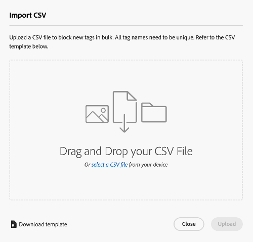

# Administración de etiquetas en la vista Recursos {#view-assets-and-details}

>[!CONTEXTUALHELP]
>id="assets_taxonomy_management"
>title="Administrar etiquetas"
>abstract="Las etiquetas le ayudan a categorizar los archivos que se pueden examinar y buscar de forma más eficaz. Los administradores pueden utilizar la estructura jerárquica de etiquetado, que facilita la aplicación de metadatos relevantes, la categorización de recursos, la compatibilidad con la búsqueda, la reutilización de etiquetas, la mejora de la capacidad de detección, etc."

Las etiquetas le ayudan a categorizar los archivos que se pueden examinar y buscar de forma más eficaz. El etiquetado propaga la taxonomía adecuada a otros usuarios y flujos de trabajo.

Las listas planas de vocabularios controlados pueden volverse inmanejables con el tiempo. Los administradores pueden utilizar la estructura jerárquica de etiquetado, que facilita la aplicación de metadatos relevantes, la categorización de recursos, la compatibilidad con la búsqueda, la reutilización de etiquetas, la mejora de la capacidad de detección, etc.

Puede crear un área de nombres en el nivel raíz y crear una estructura jerárquica de subetiquetas dentro del área de nombres. Por ejemplo, puede crear un área de nombres `Activities` en el nivel de raíz y tener etiquetas `Cycling`, `Hiking` y `Running` dentro del área de nombres. Puede tener más subetiquetas `Clothing` y `Shoes` dentro de `Running`.

El etiquetado ofrece muchas ventajas, como las siguientes:

* El etiquetado permite a los autores organizar fácilmente los recursos que no son similares a través de una taxonomía común. Los creadores pueden buscar y organizar recursos rápidamente mediante etiquetas comunes.

* Las etiquetas jerárquicas son extremadamente flexibles y son una excelente manera de organizar los términos de una manera lógica. Mediante áreas de nombres, etiquetas y subetiquetas, se pueden representar sistemas taxonómicos completos.

* Las etiquetas pueden evolucionar con el tiempo a medida que cambia el vocabulario de la organización.

* Las etiquetas administradas en la vista Administración están sincronizadas con las etiquetas administradas en la vista Recursos, que garantiza la integridad y el control de los metadatos.

Para poder aplicar etiquetas a los recursos, primero debe crear un área de nombres y luego crear y añadirle etiquetas. También puede crear etiquetas y añadirlas a un área de nombres existente. Todas las etiquetas que cree en el nivel raíz se añaden automáticamente al área de nombres de etiquetas estándar. A continuación, puede añadir el campo Etiquetas al formulario de metadatos para que se muestre en la página Detalles del recurso. Después de configurar estos ajustes, puede comenzar a aplicar etiquetas a los recursos.

>[!NOTE]
>
>Únicamente debe agregar el campo Etiquetas al formulario de metadatos si no está utilizando el formulario de metadatos predeterminado.

En la vista Administración hay disponibles funcionalidades adicionales, además de las mencionadas en este artículo, como combinar, cambiar el nombre, localizar y publicar etiquetas.

## Crear un área de nombres {#create-a-namespace}

Un área de nombres es un contenedor para etiquetas que solo puede existir en el nivel raíz. Puede comenzar a configurar la estructura jerárquica de etiquetas definiendo primero un nombre lógico para el área de nombres. Si no añade una etiqueta a ninguna de las áreas de nombres existentes, la etiqueta se mueve a Etiquetas estándar automáticamente.

Siga estos pasos para crear un área de nombres:

1. Vaya a `Taxonomy Management` en `Settings` para ver la lista de áreas de nombres existentes. También puede ver la última fecha de modificación, el usuario que modificó el área de nombres o las etiquetas debajo de ella y el número de veces que la etiqueta se utiliza en un recurso.
1. Haga clic en `Create Namespace`.
1. Agregue `Title`, `Name` y `Description` al área de nombres. La entrada especificada en el campo `Title` se muestra en la parte superior de la jerarquía. Por ejemplo, en la siguiente imagen, **Actividades** hace referencia al título del área de nombres.

   

1. Haga clic en `Save`.

## Añadir etiquetas a un área de nombres {#add-tags-to-namespace}

Ejecute los siguientes pasos para añadir etiquetas a un área de nombres:

1. Vaya a **[!UICONTROL Administración de taxonomía]**.
1. Seleccione el área de nombres y haga clic en `Create` para crear la etiqueta en el nivel superior bajo el área de nombres. Si necesita crear una subetiqueta en una etiqueta que exista en un área de nombres, seleccione la etiqueta y haga clic en `Create`.
   

   En este ejemplo, la imagen de la izquierda representa la etiqueta directamente debajo del área de nombres `automobile-four-wheeler` que aparece en el campo `Path`. La imagen de la derecha es un ejemplo de subetiquetas que se han añadido dentro de una etiqueta, ya que hay más nombres de etiqueta, `jeep` y `jeep-meridian`, que se muestran en el campo `Path` además del área de nombres.
1. Especifique el título, el nombre y la descripción de la etiqueta, y haga clic en `Save`.

   >[!NOTE]
   >
   >* Los campos `Title` y `Name` son obligatorios, mientras que el campo `Description` es opcional.
   >* De forma predeterminada, la herramienta copia el texto que escribe en el campo Título y elimina los espacios en blanco o los caracteres especiales (. &amp; / \ : * ? [ ] | &quot; %) y lo almacena como el nombre.
   >* Puede actualizar el campo `Title` luego, pero el campo `Name` es de solo lectura.

## Añadir etiquetas a etiquetas estándar {#add-tags-to-standard-tags}

Las etiquetas no estructuradas o las etiquetas que no tienen jerarquía se almacenan en el área de nombres `Standard Tags`. Además, si desea añadir términos descriptivos adicionales sin que afecte a la taxonomía controlada, puede almacenar dicho valor en `Standard Tags`. Con el tiempo, puede mover estos valores a áreas de nombres estructuradas. Además, puede utilizar el área de nombres `Standard Tags` como entrada de forma libre para palabras clave.

Para crear una etiqueta estándar, haga clic en `Create Tag` en el nivel raíz. Especifique el título, el nombre y la descripción y haga clic en `Save`.

>[!NOTE]
>
>Si elimina el `Standard Tags`espacio de nombres mediante Assets as a Cloud Service, las etiquetas creadas en el nivel raíz no se muestran en la lista de etiquetas disponibles.

## Mover etiquetas {#move-tags}

Si almacena las etiquetas en una jerarquía incorrecta o si la taxonomía cambia con el tiempo, puede mover las etiquetas seleccionadas para mantener la integridad de los datos. Se deben tener en cuenta las siguientes condiciones al mover las etiquetas:

* Las etiquetas solo se pueden mover por debajo de áreas de nombres existentes o dentro de una jerarquía de etiquetas existente.
* Las etiquetas no se pueden mover a la raíz para convertirlas en un área de nombres.
* Al mover una etiqueta principal también se mueven todas las etiquetas secundarias almacenadas en la jerarquía.

Siga estos pasos para mover etiquetas de una ubicación a otra:

1. Seleccione la etiqueta o toda la jerarquía de etiquetas en el área de nombres correspondiente y haga clic en `Move`.
1. En el cuadro de diálogo Mover, seleccione la nueva etiqueta de destino o el área de nombres mediante la sección `Select Tag`.
1. Haga clic en `Save`. La etiqueta se muestra en su nueva ubicación.

## Editar etiquetas {#edit-tags}

Para editar el título de la etiqueta, selecciónela y haga clic en `Edit`. Especifique el nuevo título y haga clic en `Save`.

>[!NOTE]
>
>* El `Name` de una etiqueta no se puede actualizar. La ruta raíz de una etiqueta también se basa en el nombre de la etiqueta. La ruta sigue siendo la misma aunque actualice el campo `Title`.
>* Las operaciones adicionales, como combinar, localizar y publicar, están disponibles en Assets as a Cloud Service.

## Eliminar etiquetas {#delete-tags}

Puede eliminar varias áreas de nombres o etiquetas simultáneamente. La operación de eliminación no se puede deshacer.

Realice los siguientes pasos para eliminar etiquetas:

1. Seleccione el área de nombres o la etiqueta y haga clic en `Delete`.
1. Haga clic en `Confirm`.

>[!NOTE]
>
>* Al eliminar la etiqueta principal o el área de nombres, también se eliminan las subetiquetas almacenadas en la jerarquía. Si necesita eliminar o actualizar el área de nombres principal, se recomienda [mover las etiquetas](#moving-tags) al nuevo destino antes de eliminar la jerarquía principal.
>* Al eliminar una etiqueta, también se eliminan todas sus referencias de los recursos.
>* No puede eliminar etiquetas estándar que existan en el nivel raíz.

## Añadir el componente Etiquetas al formulario de metadatos {#add-tags-to-metadata-form}

El componente de etiquetas se añade al formulario de metadatos `default` automáticamente. Puede diseñar un [formulario de metadatos](https://experienceleague.adobe.com/docs/experience-manager-assets-essentials/help/metadata.html?lang=es#metadata-forms) mediante una plantilla o desde cero. Si no utiliza una plantilla de formulario de metadatos existente, puede modificar el formulario de metadatos y añadir el componente de etiquetas. La asignación de propiedades de metadatos se rellena automáticamente y no se puede modificar en este momento. Los usuarios de [!DNL Assets as a Cloud Service] pueden actualizar la asignación para almacenar valores de etiquetas utilizando áreas de nombres personalizadas, y exponer solo subconjuntos de jerarquías mediante rutas raíz.

Vea este vídeo rápido para ver cómo añadir el componente Etiquetas al formulario de metadatos:

>[!VIDEO](https://video.tv.adobe.com/v/3420452)

### Añadir etiquetas a recursos {#add-tags-to-assets}

1. Vaya a la página de detalles del recurso y navegue hasta la sección `Tags` del formulario de metadatos.
1. Seleccione el icono del selector de etiquetas que está junto al campo Etiquetas o empiece a escribir un nombre de etiqueta para ver los resultados sugeridos.

   

1. Seleccione una o varias etiquetas. La subetiqueta se selecciona automáticamente junto con la etiqueta principal o el área de nombres.
Las etiquetas modificadas en Assets Essentials se aplican también en Assets as a Cloud Service.

## Añadir etiquetas a la lista de bloqueados {#blocklist-essentials}

[!DNL Assets view] le permite definir una lista de bloqueados compuesta por palabras que no deben añadirse como etiquetas inteligentes a los recursos cuando se cargan en el repositorio. Esta posibilidad le ayuda a mantener el cumplimiento de la marca y reduce el esfuerzo por moderar las etiquetas inteligentes.
<!--
### Block smart tags for single asset {#block-smart-tags-for-single-asset}

-->

### Bloquear las etiquetas inteligentes de todos los recursos {#block-smart-tags-for-all-assets}

[!DNL Assets view] permite a un administrador bloquear las etiquetas inteligentes de los recursos existentes y los recién añadidos. Para bloquear etiquetas, ejecute los siguientes pasos:

1. Vaya a **[!UICONTROL Etiquetas bloqueadas]** bajo **[!UICONTROL Configuración]**.
1. Haga clic en **[!UICONTROL Añadir etiqueta bloqueada]**.
1. Escriba las etiquetas en el cuadro de texto que debe bloquear y haga clic en **[!UICONTROL Entrar]**.
1. Una vez que haya terminado de añadir etiquetas, haga clic en **[!UICONTROL Añadir]**. Las etiquetas introducidas aparecen en la lista de etiquetas bloqueadas.

   >[!NOTE]
   >
   >Puede añadir un máximo de 25 etiquetas a la lista a la vez. Repita los pasos para añadir más etiquetas a la lista de bloqueados.

También puede bloquear las etiquetas inteligentes de un solo recurso. Vaya a los detalles de un recurso. En la pestaña **[!UICONTROL Etiquetas]**, quite las etiquetas inteligentes no deseadas y haga clic en **[!UICONTROL Guardar]**. Las etiquetas se muestran en la lista de bloqueados del recurso seleccionado.

### Acciones realizadas en la lista de bloqueados {#blocklist-actions}

* **Quitar etiquetas:** También puede quitar las etiquetas de la lista de bloqueados. Para ello, seleccione una o varias etiquetas que desee quitar. Haga clic en **[!UICONTROL Quitar]**. Puede quitar un máximo de 25 etiquetas de la lista a la vez.
* **Seleccionar todo:** Seleccione la casilla de verificación junto a **Nombre de etiqueta** para seleccionar todas las etiquetas de la lista de bloqueados.
* **Ordenación:** Puede ordenar la lista de bloqueados en orden ascendente o descendente. Para ello, haga clic en la flecha situada junto a **Nombre de etiqueta**.

  

  >[!NOTE]
  >
  >No utilice caracteres especiales al agregar una etiqueta en la lista de bloqueados. Se pueden utilizar caracteres como a-z, A-Z, 0-9 y -.

### Exportar lista de bloqueados{#export-blocklist}

La vista Assets permite exportar las etiquetas bloqueadas enumeradas al formato CSV. Para exportar la lista de bloqueados, ejecute los pasos siguientes:

1. Haga clic en **[!UICONTROL Exportar como CSV.]**
1. Elija la ubicación adecuada para guardar el archivo CSV. También puede cambiar el nombre del archivo según los requisitos.
1. Haga clic en **[!UICONTROL Guardar]**. La lista exportada en formato CSV se descargará en la ubicación seleccionada.

### Importar lista de bloqueados{#import-blocklist}

La vista de Assets permite importar etiquetas bloqueadas desde una fuente de datos (CSV). Para importar lista de bloqueados, ejecute los pasos siguientes:

1. Haga clic en **[!UICONTROL Importar como CSV]**.
1. Elija el archivo CSV en su dispositivo. Haga clic en **[!UICONTROL seleccionar un archivo]** para desplazarse al archivo desde su dispositivo. También puede arrastrar y soltar el archivo CSV desde su dispositivo.
1. Haga clic en **[!UICONTROL Cargar]**. Las etiquetas del archivo CSV se enumeran en la lista de etiquetas bloqueadas.

   

Si desea descargar una plantilla de etiquetas bloqueadas, siga estos pasos:

1. Haga clic en **[!UICONTROL Descargar plantilla]**.
1. Elija la ubicación adecuada para guardar el archivo CSV. También puede cambiar el nombre del archivo según los requisitos.
1. Haga clic en **[!UICONTROL Guardar]**. La plantilla de etiquetas de bloque en formato CSV se descarga en la ubicación seleccionada.
